# AI Agent Architecture

<cite>
**Referenced Files in This Document**   
- [AIAgent.tsx](file://src/pages/EpubReader/components/AIAgent/AIAgent.tsx)
- [AIAgent.d.ts](file://src/pages/EpubReader/components/AIAgent/types/AIAgent.d.ts)
- [useFetchAIMessage.ts](file://src/pages/EpubReader/components/AIAgent/components/MessageList/useFetchAIMessage.ts)
- [MessageList.tsx](file://src/pages/EpubReader/components/AIAgent/components/MessageList/MessageList.tsx)
- [InputBarRender.tsx](file://src/pages/EpubReader/components/AIAgent/components/MessageList/components/InputBarRender.tsx)
- [AIMessageRender.tsx](file://src/pages/EpubReader/components/AIAgent/components/AIMessageRender.tsx)
- [UserMessage.tsx](file://src/pages/EpubReader/components/AIAgent/components/UserMessage.tsx)
- [useSmoothScroll.ts](file://src/pages/EpubReader/components/AIAgent/hooks/useSmoothScroll.ts)
- [LatestAssistantMessage.tsx](file://src/pages/EpubReader/components/AIAgent/components/MessageList/components/LatestAssistantMessage.tsx)
- [utils.ts](file://src/pages/EpubReader/components/AIAgent/utils.ts)
- [drilldownSelection.ts](file://src/pages/EpubReader/components/AIAgent/utils/drilldownSelection.ts)
</cite>

## Table of Contents
1. [Introduction](#introduction)
2. [Core Components](#core-components)
3. [Architecture Overview](#architecture-overview)
4. [Detailed Component Analysis](#detailed-component-analysis)
5. [State Management and Lifecycle](#state-management-and-lifecycle)
6. [View Modes and UI/UX](#view-modes-and-uiux)
7. [Integration and Usage](#integration-and-usage)
8. [Performance Considerations](#performance-considerations)
9. [Conclusion](#conclusion)

## Introduction
The AI Agent component in the EPUB reader provides a contextual AI interaction system that enables users to engage with AI-powered assistance while reading. This architecture is designed to orchestrate AI conversations, manage streaming responses, and provide a seamless chat-like interface within the reading experience. The component supports two distinct view modes and integrates tightly with the reading context to provide relevant AI responses based on selected text and surrounding content.

## Core Components
The AI Agent architecture consists of several interconnected components that work together to provide a cohesive AI interaction experience. The core components include the main AIAgent container, message management system, input interface, and AI response handling utilities. These components are designed to work in concert to provide a responsive and intuitive AI interaction layer within the EPUB reader.

**Section sources**
- [AIAgent.tsx](file://src/pages/EpubReader/components/AIAgent/AIAgent.tsx)
- [MessageList.tsx](file://src/pages/EpubReader/components/AIAgent/components/MessageList/MessageList.tsx)
- [InputBarRender.tsx](file://src/pages/EpubReader/components/AIAgent/components/MessageList/components/InputBarRender.tsx)

## Architecture Overview

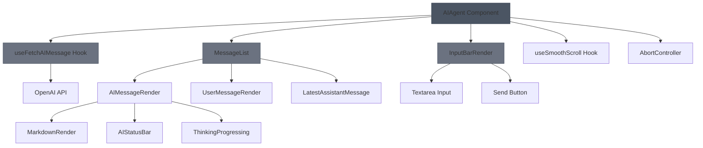

**Diagram sources**
- [AIAgent.tsx](file://src/pages/EpubReader/components/AIAgent/AIAgent.tsx)
- [MessageList.tsx](file://src/pages/EpubReader/components/AIAgent/components/MessageList/MessageList.tsx)
- [InputBarRender.tsx](file://src/pages/EpubReader/components/AIAgent/components/MessageList/components/InputBarRender.tsx)
- [useFetchAIMessage.ts](file://src/pages/EpubReader/components/AIAgent/components/MessageList/useFetchAIMessage.ts)

## Detailed Component Analysis

### AIAgent Component Analysis
The AIAgent component serves as the orchestrator for all AI interactions within the EPUB reader. It manages the state, handles AI configuration, and coordinates between the various sub-components to provide a unified AI experience.

#### Component Props and Configuration
The AIAgent component accepts several props that configure its behavior and AI integration:

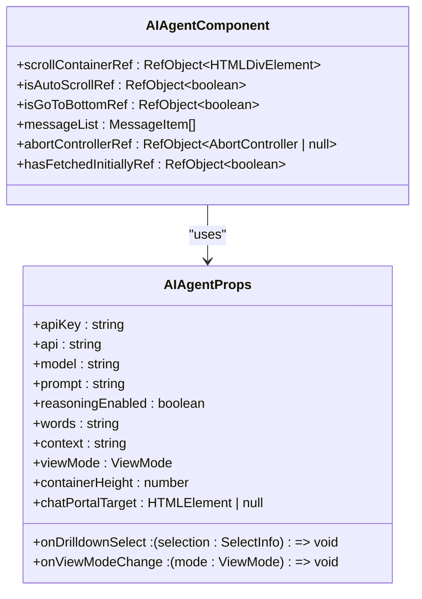

**Diagram sources**
- [AIAgent.tsx](file://src/pages/EpubReader/components/AIAgent/AIAgent.tsx#L16-L22)
- [AIAgent.d.ts](file://src/pages/EpubReader/components/AIAgent/types/AIAgent.d.ts#L8-L14)

The component's props are designed to provide comprehensive control over the AI interaction:
- **apiKey**: The authentication key for the AI service, renamed from 'key' to avoid React's reserved prop conflict
- **api**: The base URL for the AI service endpoint
- **model**: Specifies which AI model to use for generating responses
- **prompt**: The template for AI requests, which can include placeholders like {{words}} and {{context}} that are replaced with actual content
- **reasoningEnabled**: A boolean flag that enables or disables reasoning capabilities in the AI response
- **words** and **context**: Provide the selected text and surrounding context from the EPUB reader to inform the AI response

These props are combined from various sources using TypeScript's Pick utility to extract specific properties from different type definitions, creating a cohesive configuration interface.

**Section sources**
- [AIAgent.tsx](file://src/pages/EpubReader/components/AIAgent/AIAgent.tsx#L16-L22)
- [AIAgent.d.ts](file://src/pages/EpubReader/components/AIAgent/types/AIAgent.d.ts#L8-L14)

#### Message Management and State
The AIAgent component manages conversation state through the messageList state variable, which stores the history of interactions between the user and the AI. The component initializes this state with a user message containing the processed prompt:

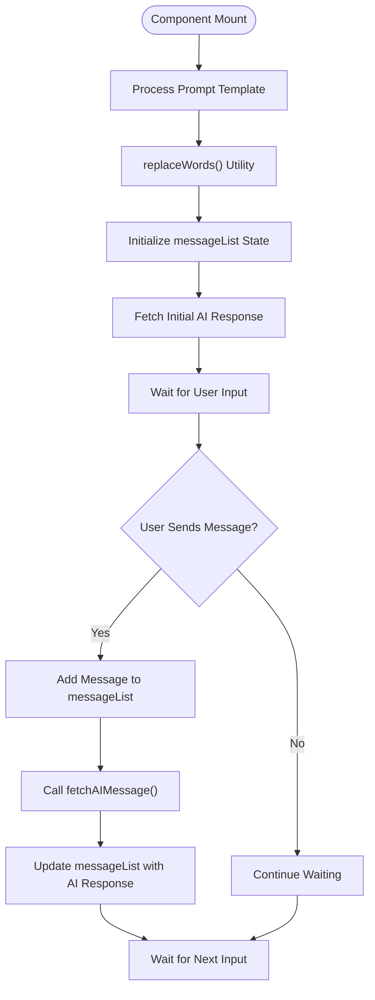

**Diagram sources**
- [AIAgent.tsx](file://src/pages/EpubReader/components/AIAgent/AIAgent.tsx#L38-L43)
- [utils.ts](file://src/pages/EpubReader/components/AIAgent/utils.ts#L13-L30)

The messageList state is implemented as a useState hook with an initial value containing a single user message. The content of this message is generated by the replaceWords utility function, which processes the prompt template by replacing placeholders with actual values from the words and context props. This ensures that the AI receives relevant contextual information when generating its initial response.

**Section sources**
- [AIAgent.tsx](file://src/pages/EpubReader/components/AIAgent/AIAgent.tsx#L38-L43)
- [utils.ts](file://src/pages/EpubReader/components/AIAgent/utils.ts#L13-L30)

### useFetchAIMessage Hook Analysis
The useFetchAIMessage custom hook is responsible for initiating and managing streaming AI responses from the OpenAI API. It handles the entire lifecycle of an AI request, from initialization to completion or cancellation.

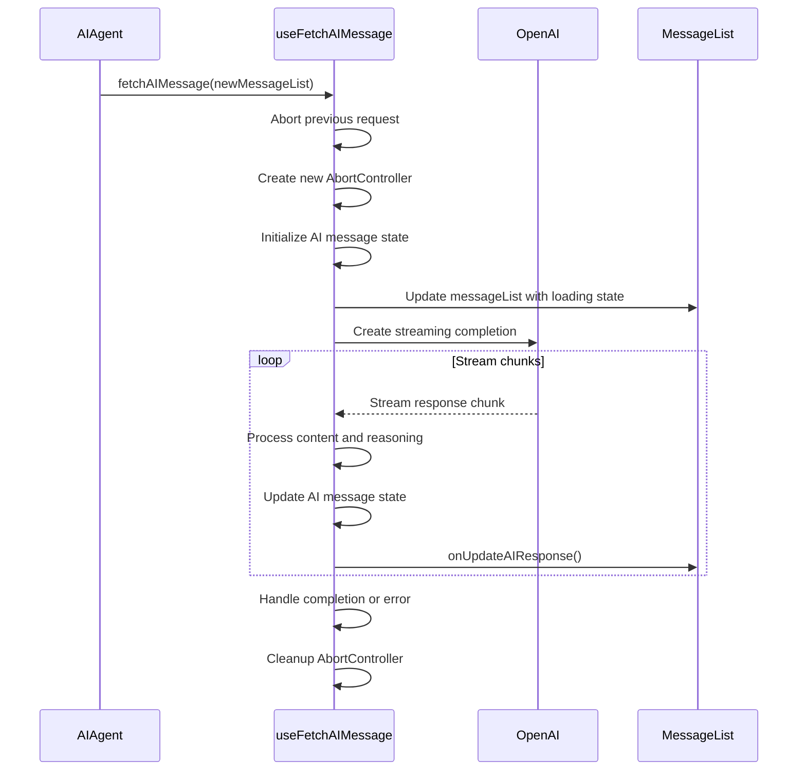

**Diagram sources**
- [useFetchAIMessage.ts](file://src/pages/EpubReader/components/AIAgent/components/MessageList/useFetchAIMessage.ts#L60-L150)

The hook accepts several parameters that configure the AI request:
- **setMessageList**: A state dispatch function to update the message list
- **apiKey** and **api**: Credentials and endpoint for the AI service
- **model**: The specific AI model to use
- **messageList**: The current conversation history
- **onUpdateAIResponse**: A callback to update the AI response as it streams
- **reasoningEnabled**: Flag to enable reasoning capabilities
- **abortControllerRef**: A ref to manage request cancellation

When invoked, the hook first aborts any ongoing request using the AbortController pattern, ensuring that only one request is active at a time. It then creates a new OpenAI client instance with the provided credentials and configuration. The request is configured as a streaming completion, allowing the UI to update incrementally as tokens are generated.

The hook processes the streaming response in a loop, handling both content and reasoning content when enabled. As each chunk arrives, it updates the AI message state and calls the onUpdateAIResponse callback, which triggers a re-render of the message list with the progressively completed response. This streaming approach provides immediate feedback to the user and creates a more engaging experience.

Error handling is implemented to catch any issues during the request, displaying appropriate error messages in the UI. The hook also ensures proper cleanup by nullifying the abortControllerRef in the finally block, preventing memory leaks.

**Section sources**
- [useFetchAIMessage.ts](file://src/pages/EpubReader/components/AIAgent/components/MessageList/useFetchAIMessage.ts#L7-L153)

### MessageList and InputBarRender Integration
The AIAgent component integrates with MessageList and InputBarRender to create a cohesive chat-like interface. This integration is designed to provide a natural conversational experience while maintaining context awareness within the EPUB reader.

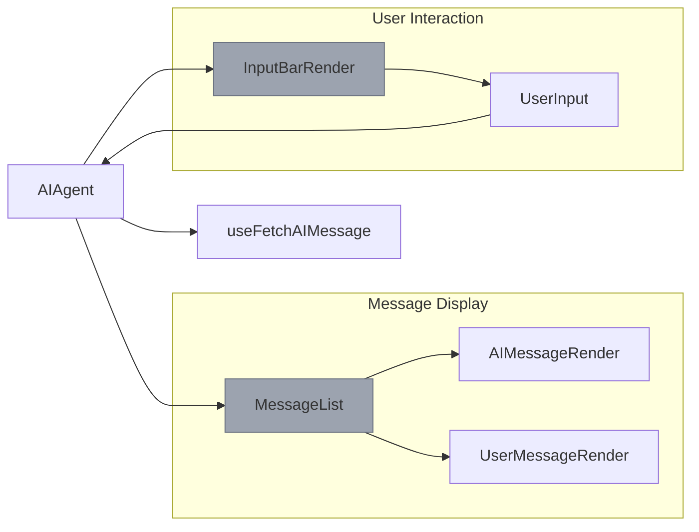

**Diagram sources**
- [AIAgent.tsx](file://src/pages/EpubReader/components/AIAgent/AIAgent.tsx#L144-L194)
- [MessageList.tsx](file://src/pages/EpubReader/components/AIAgent/components/MessageList/MessageList.tsx)
- [InputBarRender.tsx](file://src/pages/EpubReader/components/AIAgent/components/MessageList/components/InputBarRender.tsx)

The MessageList component renders the conversation history based on the current viewMode. In 'simple' mode, it displays only the latest assistant message using the LatestAssistantMessage component, providing a compact view of the AI's response. In 'conversation' mode, it renders the complete message history with both user and assistant messages in a scrollable container.

The InputBarRender component provides the interface for user input, appearing only in 'conversation' mode. It includes a resizable textarea that automatically adjusts its height based on content, up to a maximum of 8 rows. The component handles both keyboard and button submission, with special handling for desktop devices where Enter sends the message and Shift+Enter creates a new line.

The integration between these components is managed through callback functions passed as props. When the user submits a message, the InputBarRender calls the onSend callback, which is implemented in the AIAgent component. This callback adds the user's message to the messageList and triggers a new AI request through the fetchAIMessage function.

**Section sources**
- [AIAgent.tsx](file://src/pages/EpubReader/components/AIAgent/AIAgent.tsx#L144-L194)
- [MessageList.tsx](file://src/pages/EpubReader/components/AIAgent/components/MessageList/MessageList.tsx)
- [InputBarRender.tsx](file://src/pages/EpubReader/components/AIAgent/components/MessageList/components/InputBarRender.tsx)

## State Management and Lifecycle

### Internal State Management
The AIAgent component employs several React hooks to manage its internal state and lifecycle. The primary state is managed through the messageList useState hook, which stores the conversation history as an array of MessageItem objects. Each message has a role (either 'user' or 'assistant') and contains the relevant content.

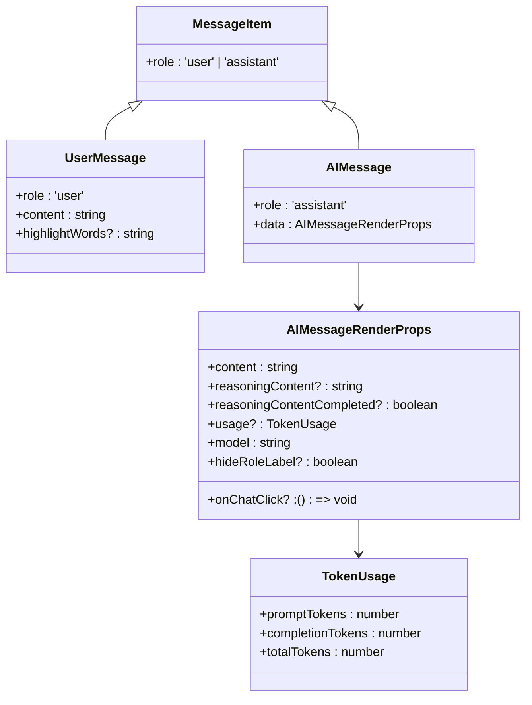

**Diagram sources**
- [AIAgent.d.ts](file://src/pages/EpubReader/components/AIAgent/types/AIAgent.d.ts#L23-L34)
- [AIMessageRender.tsx](file://src/pages/EpubReader/components/AIAgent/components/AIMessageRender.tsx#L10-L23)

The component also uses useRef hooks to maintain mutable values across renders without triggering re-renders. The abortControllerRef stores the current AbortController instance for the active AI request, allowing it to be canceled when needed. The isAutoScrollRef and isGoToBottomRef track the auto-scroll state of the message container, enabling intelligent scrolling behavior that respects user interactions.

**Section sources**
- [AIAgent.tsx](file://src/pages/EpubReader/components/AIAgent/AIAgent.tsx#L25-L27)
- [AIAgent.d.ts](file://src/pages/EpubReader/components/AIAgent/types/AIAgent.d.ts#L23-L34)

### Request Cancellation with AbortController
The component implements robust request cancellation using the AbortController API. This is crucial for providing a responsive user experience, as it allows users to cancel long-running AI requests if needed.

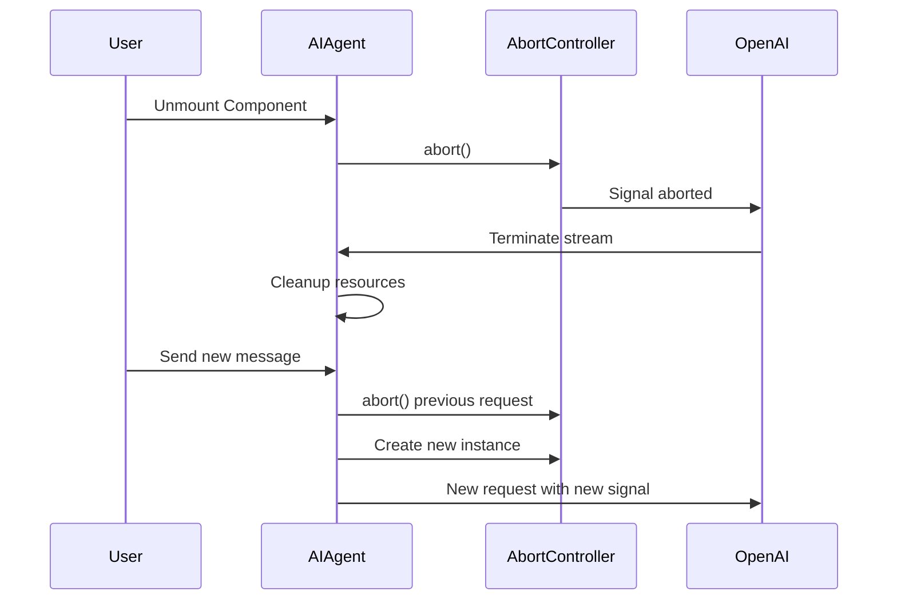

**Diagram sources**
- [AIAgent.tsx](file://src/pages/EpubReader/components/AIAgent/AIAgent.tsx#L86-L89)
- [useFetchAIMessage.ts](file://src/pages/EpubReader/components/AIAgent/components/MessageList/useFetchAIMessage.ts#L71-L73)

The cleanup is implemented in a useEffect hook with an empty dependency array, which returns a cleanup function that runs when the component unmounts. This function calls abort() on the current AbortController instance, terminating any ongoing request. Additionally, before starting a new request, the useFetchAIMessage hook aborts any previous request, ensuring that only one request is active at a time.

This pattern prevents race conditions and ensures that the UI always reflects the most recent user action, even if previous requests are still in progress.

**Section sources**
- [AIAgent.tsx](file://src/pages/EpubReader/components/AIAgent/AIAgent.tsx#L86-L89)
- [useFetchAIMessage.ts](file://src/pages/EpubReader/components/AIAgent/components/MessageList/useFetchAIMessage.ts#L71-L73)

## View Modes and UI/UX

### Simple and Conversation View Modes
The AIAgent component supports two distinct view modes: 'simple' and 'conversation'. These modes provide different UI/UX experiences tailored to different use cases within the EPUB reader.

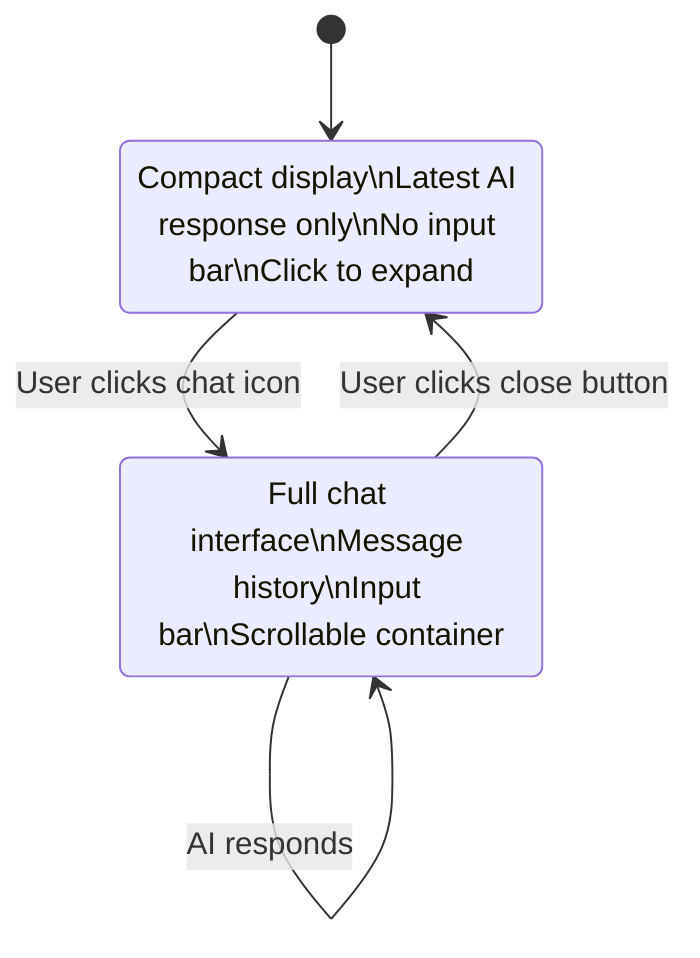

**Diagram sources**
- [AIAgent.tsx](file://src/pages/EpubReader/components/AIAgent/AIAgent.tsx#L141-L153)
- [AIAgent.tsx](file://src/pages/EpubReader/components/AIAgent/AIAgent.tsx#L156-L194)

In 'simple' mode, the component displays only the latest AI response in a compact format using the LatestAssistantMessage component. This mode is designed for quick reference and minimizes screen space usage. Users can click on the message to expand into 'conversation' mode for a more detailed interaction.

In 'conversation' mode, the component provides a full-featured chat interface with a scrollable message history, auto-scrolling behavior, and an input bar for sending new messages. This mode is optimized for extended conversations and provides a more immersive experience.

The transition between modes is handled smoothly, with appropriate scrolling behavior. When entering 'conversation' mode, the component automatically scrolls to the bottom to show the latest messages. When returning to 'simple' mode, the scroll position is reset.

**Section sources**
- [AIAgent.tsx](file://src/pages/EpubReader/components/AIAgent/AIAgent.tsx#L141-L194)
- [LatestAssistantMessage.tsx](file://src/pages/EpubReader/components/AIAgent/components/MessageList/components/LatestAssistantMessage.tsx)

### Auto-Scroll and User Interaction
The component implements sophisticated auto-scroll behavior to enhance the user experience in 'conversation' mode. This behavior is managed by the useSmoothScrollToBottom hook, which provides smooth scrolling animations and intelligent pause/resume functionality.

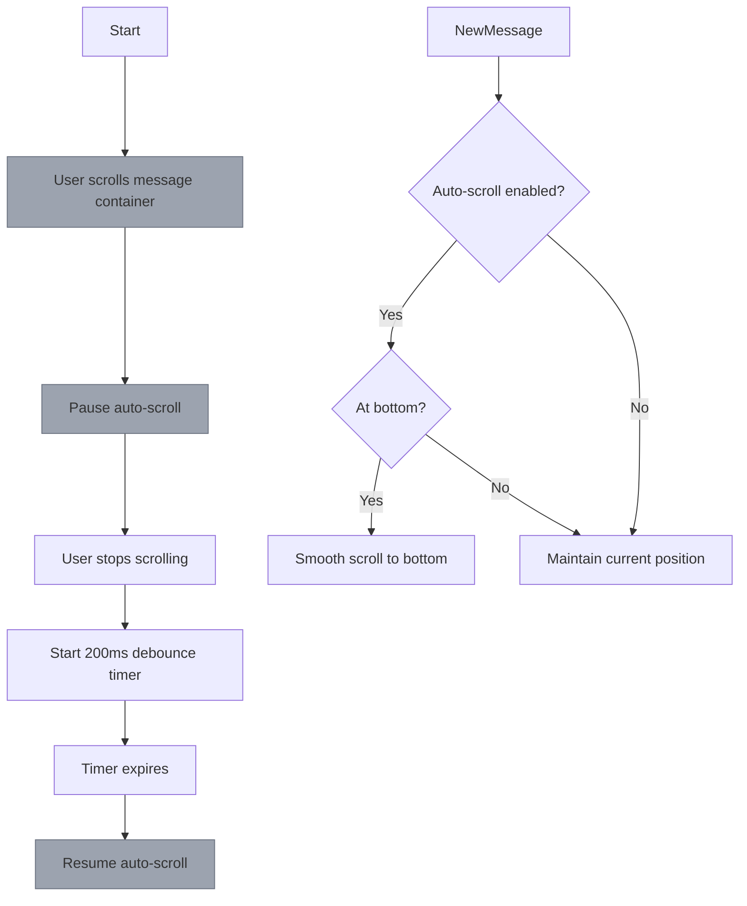

**Diagram sources**
- [AIAgent.tsx](file://src/pages/EpubReader/components/AIAgent/AIAgent.tsx#L93-L103)
- [useSmoothScroll.ts](file://src/pages/EpubReader/components/AIAgent/hooks/useSmoothScroll.ts#L33-L148)

The auto-scroll system uses several techniques to provide a natural experience:
- Smooth scrolling animations using requestAnimationFrame for 60fps performance
- Easing functions (easeOutCubic) to create natural motion
- Dynamic target recalculation to handle growing content during streaming
- Pause detection when the user interacts with the scroll container
- Resume detection after a brief debounce period when scrolling stops

The system also handles edge cases, such as determining whether the user is near the bottom of the container (within 100px) to decide whether to resume auto-scrolling after user interaction.

**Section sources**
- [AIAgent.tsx](file://src/pages/EpubReader/components/AIAgent/AIAgent.tsx#L93-L103)
- [useSmoothScroll.ts](file://src/pages/EpubReader/components/AIAgent/hooks/useSmoothScroll.ts#L33-L148)

## Integration and Usage

### Component Instantiation in Reading Flow
The AIAgent component is designed to be instantiated within the EPUB reader's context, receiving relevant props from the parent components to provide contextual AI interactions.

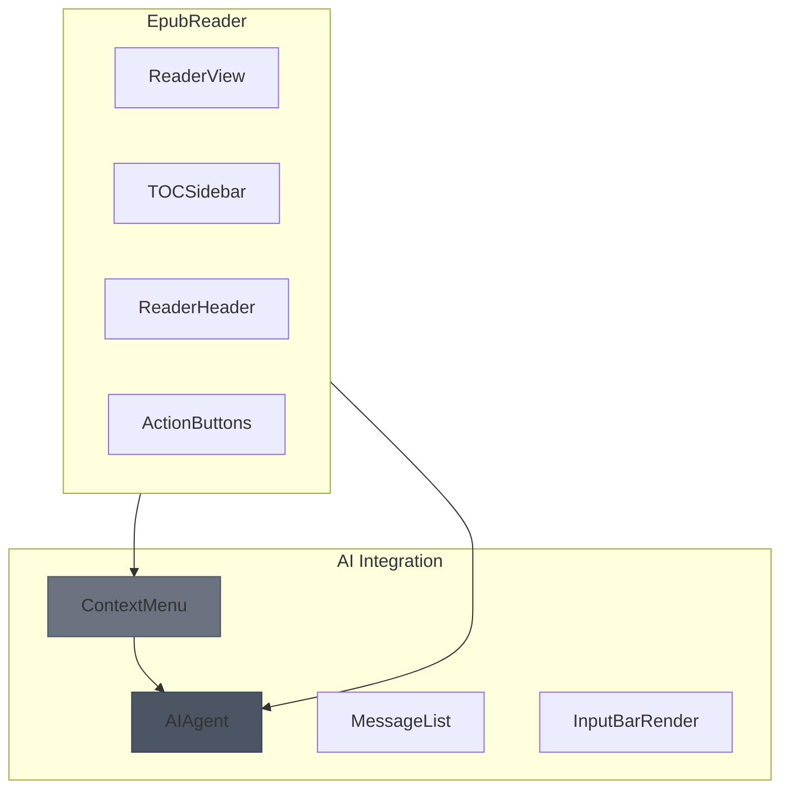

**Diagram sources**
- [AIAgent.tsx](file://src/pages/EpubReader/components/AIAgent/AIAgent.tsx)
- [GEMINI.md](file://GEMINI.md)

The component is typically instantiated with props derived from the current reading context, including selected text (words), surrounding content (context), and user-configured AI settings (apiKey, api, model, prompt). This allows the AI to provide relevant responses based on what the user is currently reading.

The onDrilldownSelect callback enables deeper interaction, allowing users to select specific words from the AI response for further analysis or definition lookup, creating a recursive exploration capability within the reading experience.

**Section sources**
- [AIAgent.tsx](file://src/pages/EpubReader/components/AIAgent/AIAgent.tsx)
- [GEMINI.md](file://GEMINI.md)

### Lifecycle Management
The component implements proper lifecycle management to ensure resources are cleaned up and the user experience remains consistent.

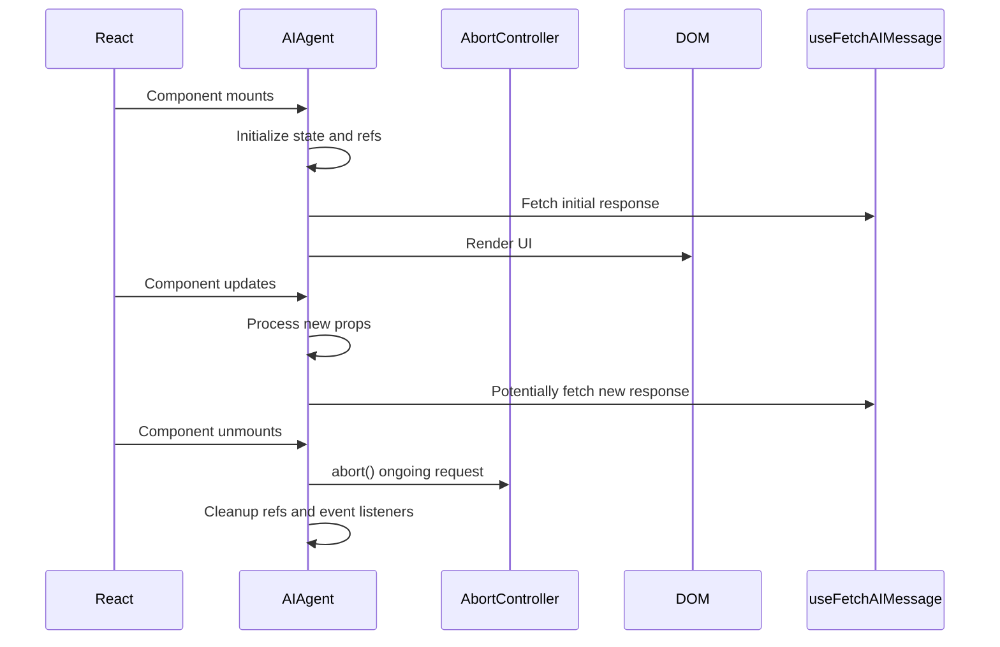

**Diagram sources**
- [AIAgent.tsx](file://src/pages/EpubReader/components/AIAgent/AIAgent.tsx#L79-L83)
- [AIAgent.tsx](file://src/pages/EpubReader/components/AIAgent/AIAgent.tsx#L86-L89)

The component uses several useEffect hooks to manage its lifecycle:
- An effect that fetches the initial AI response when the component mounts, but only once (using the hasFetchedInitiallyRef)
- A cleanup effect that aborts any ongoing request when the component unmounts
- Effects that handle scrolling behavior when the viewMode or messageList changes

This ensures that the component behaves predictably and doesn't make unnecessary API calls or leave resources hanging when no longer needed.

**Section sources**
- [AIAgent.tsx](file://src/pages/EpubReader/components/AIAgent/AIAgent.tsx#L79-L89)

## Performance Considerations

### Render Optimization with useCallback and useRef
The component employs several performance optimization techniques to minimize unnecessary re-renders and maintain smooth performance.

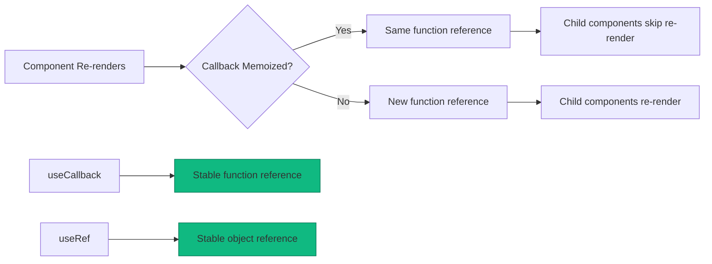

**Diagram sources**
- [AIAgent.tsx](file://src/pages/EpubReader/components/AIAgent/AIAgent.tsx#L47-L57)
- [AIAgent.tsx](file://src/pages/EpubReader/components/AIAgent/AIAgent.tsx#L70-L76)

The component uses useCallback to memoize callback functions like onUpdateAIResponse and onSend. This ensures that these functions maintain the same reference across renders unless their dependencies change, preventing unnecessary re-renders of child components that depend on them.

For example, the onUpdateAIResponse callback is memoized with an empty dependency array, making it a stable reference that doesn't change between renders. This is particularly important because it's passed to the useFetchAIMessage hook, and changing its reference would cause the hook to re-initialize unnecessarily.

The component also uses useRef for values that don't need to trigger re-renders, such as the scroll container reference and the auto-scroll state flags. This prevents unnecessary re-renders when these values change.

Additionally, the useFetchAIMessage hook is memoized as a stable function reference, ensuring that it doesn't change between renders and preventing unnecessary re-fetching of AI responses.

**Section sources**
- [AIAgent.tsx](file://src/pages/EpubReader/components/AIAgent/AIAgent.tsx#L47-L76)

## Conclusion
The AI Agent architecture in the EPUB reader provides a sophisticated and user-friendly interface for contextual AI interactions. By orchestrating multiple components and managing complex state and lifecycle concerns, it delivers a seamless experience that enhances the reading process. The component's design emphasizes performance, usability, and flexibility, supporting both quick reference through the 'simple' mode and extended conversations through the 'conversation' mode. With proper request management, smooth scrolling behavior, and thoughtful integration with the reading context, the AI Agent serves as a powerful tool for readers seeking deeper understanding and engagement with their content.