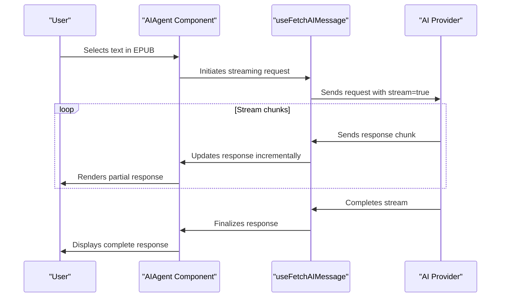
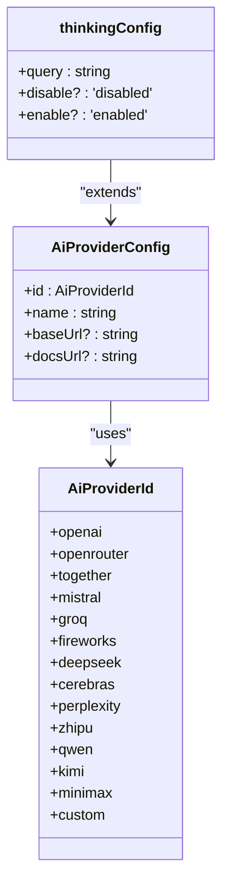
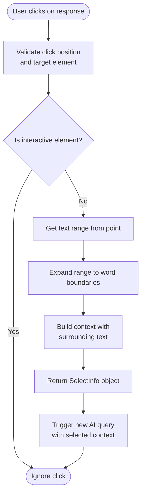

# AI Integration

<cite>
**Referenced Files in This Document**   
- [aiProviders.ts](file://src/config/aiProviders.ts)
- [AIAgent.tsx](file://src/pages/EpubReader/components/AIAgent/AIAgent.tsx)
- [AIAgent.d.ts](file://src/pages/EpubReader/components/AIAgent/types/AIAgent.d.ts)
- [drilldownSelection.ts](file://src/pages/EpubReader/components/AIAgent/utils/drilldownSelection.ts)
- [utils.ts](file://src/pages/EpubReader/components/AIAgent/utils.ts)
- [MessageList.tsx](file://src/pages/EpubReader/components/AIAgent/components/MessageList/MessageList.tsx)
- [useFetchAIMessage.ts](file://src/pages/EpubReader/components/AIAgent/components/MessageList/useFetchAIMessage.ts)
- [MarkdownRender.tsx](file://src/pages/EpubReader/components/AIAgent/components/MarkdownRender.tsx)
- [selection.service.ts](file://src/pages/EpubReader/services/selection.service.ts)
- [ApiConfig.tsx](file://src/pages/ContextMenuSettingsPage/components/ApiConfig.tsx)
- [ToolForm.tsx](file://src/pages/ContextMenuSettingsPage/components/ToolForm.tsx)
- [AIMessageRender.tsx](file://src/pages/EpubReader/components/AIAgent/components/AIMessageRender.tsx)
- [UserMessage.tsx](file://src/pages/EpubReader/components/AIAgent/components/UserMessage.tsx)
- [thinkingConfig.ts](file://src/config/thinkingConfig.ts)
- [epub.ts](file://src/types/epub.ts)
</cite>

## Table of Contents
1. [AI Agent Architecture](#ai-agent-architecture)
2. [Streaming Response Pattern](#streaming-response-pattern)
3. [Configuration System](#configuration-system)
4. [Context Menu Integration](#context-menu-integration)
5. [Drilldown Selection Capability](#drilldown-selection-capability)
6. [Message Management](#message-management)
7. [Rate Limiting and Error Handling](#rate-limiting-and-error-handling)
8. [Security Considerations](#security-considerations)
9. [Performance Optimization](#performance-optimization)

## AI Agent Architecture

The AIAgent component provides contextual assistance by analyzing selected text from EPUB content through a sophisticated architecture that integrates AI services with the reading experience. The component accepts selected text and context from the EPUB reader, processes it through configured AI providers, and presents the results in an interactive chat interface. The architecture follows a modular design with clear separation of concerns, where the AIAgent component orchestrates communication between the user interface, AI service providers, and response rendering components.

The component supports two view modes: simple and conversation. In simple mode, it displays a concise summary of the AI response, while conversation mode provides a full chat interface for extended interactions. The architecture is designed to handle the complete lifecycle of AI interactions, from text selection to response rendering, with proper state management and error handling.

**Section sources**
- [AIAgent.tsx](file://src/pages/EpubReader/components/AIAgent/AIAgent.tsx#L1-L202)
- [AIAgent.d.ts](file://src/pages/EpubReader/components/AIAgent/types/AIAgent.d.ts#L1-L35)

## Streaming Response Pattern

The AI integration implements a streaming response pattern that provides real-time feedback as AI responses are generated. This is achieved through the use of OpenAI's streaming API, which delivers responses incrementally rather than waiting for the complete response. The `useFetchAIMessage` hook handles the streaming process, processing each chunk of the response as it arrives and updating the UI progressively.

The streaming implementation uses the `dangerouslyAllowBrowser` option to enable browser-based requests and sets `stream: true` in the request configuration. As each response part arrives, the content is incrementally appended to the existing response, creating a typing effect that enhances user experience by providing immediate feedback. The streaming approach also includes handling for usage statistics, which are updated as the response progresses, providing transparency about token consumption.

**Diagram sources**
- [useFetchAIMessage.ts](file://src/pages/EpubReader/components/AIAgent/components/MessageList/useFetchAIMessage.ts#L1-L204)
- [AIAgent.tsx](file://src/pages/EpubReader/components/AIAgent/AIAgent.tsx#L1-L202)

## Configuration System

The configuration system in aiProviders.ts enables extensibility across different AI services through a comprehensive catalog of supported providers. The system defines an `AiProviderId` type that enumerates all available providers, including major services like OpenAI, Together AI, Mistral, Groq, and specialized providers like Zhipu GLM and Kimi. Each provider is configured with a unique ID, display name, base URL, and documentation URL, allowing the application to dynamically adapt to different AI service endpoints.

The configuration supports both predefined providers and custom OpenAI-compatible services through the 'custom' provider option, which allows users to specify their own API endpoint. This extensibility is further enhanced by the `AI_PROVIDER_CATALOG` constant, which maintains a registry of all providers with their specific configuration details. The system also includes provider-specific configuration through the thinkingConfig.ts file, which defines model-specific parameters for advanced features like reasoning.

**Diagram sources**
- [aiProviders.ts](file://src/config/aiProviders.ts#L1-L110)
- [thinkingConfig.ts](file://src/config/thinkingConfig.ts#L1-L34)

## Context Menu Integration

The context menu integration allows users to trigger AI tools directly from text selection within the EPUB reader. When users select text, the selection.service.ts handles the extraction of selected content and its surrounding context, preparing it for AI processing. The context menu system captures the selected text and expands it with surrounding content to provide meaningful context for AI analysis.

The integration is configured through the ContextMenuSettings interface, which defines the structure for AI tool configuration including prompt templates, model selection, and reasoning options. The ApiConfig component provides a user interface for configuring API endpoints and authentication keys for different providers, with validation and connection testing capabilities. This integration enables users to access AI assistance with minimal friction, transforming selected text into actionable AI queries through a right-click context menu.

**Section sources**
- [selection.service.ts](file://src/pages/EpubReader/services/selection.service.ts#L1-L169)
- [ApiConfig.tsx](file://src/pages/ContextMenuSettingsPage/components/ApiConfig.tsx#L1-L276)
- [epub.ts](file://src/types/epub.ts#L1-L135)

## Drilldown Selection Capability

The drilldown selection capability enables users to follow up on AI responses by selecting specific terms or concepts within the response for further analysis. This feature is implemented through the resolveDrilldownSelection function in drilldownSelection.ts, which processes mouse events on rendered AI responses to identify selectable words and their context. The function uses precise range calculations to determine the exact word under the cursor, expanding the selection to complete word boundaries while avoiding interactive elements.

When a user clicks on a word in an AI response, the system extracts the selected word and constructs a contextual string that includes surrounding text, marked with `<selected>` tags to indicate the focus of the query. This contextual information is then passed back to the AIAgent component, allowing for iterative exploration of content. The drilldown feature supports both English and non-English characters and intelligently handles word boundaries to ensure accurate selection.

**Diagram sources**
- [drilldownSelection.ts](file://src/pages/EpubReader/components/AIAgent/utils/drilldownSelection.ts#L1-L136)
- [AIMessageRender.tsx](file://src/pages/EpubReader/components/AIAgent/components/AIMessageRender.tsx#L1-L103)

## Message Management

The MessageList component manages user messages and assistant responses through a structured system that maintains conversation history and renders messages appropriately. The system uses the MessageItem type to represent both user and AI messages, with distinct properties for each role. User messages contain the message content and optional highlighted words, while AI messages include the response content, reasoning content (when enabled), usage statistics, and model information.

The MessageList component renders messages in chronological order, using specialized components for user and AI messages. The UserMessageRender component processes the message content, applying markdown formatting and highlighting specific words when requested. The AIMessageRender component handles AI responses, including streaming content, reasoning visualization, and status information. The system maintains message state through React's useState hook, ensuring that new messages are properly appended and the UI is updated efficiently.

**Section sources**
- [MessageList.tsx](file://src/pages/EpubReader/components/AIAgent/components/MessageList/MessageList.tsx#L1-L65)
- [UserMessage.tsx](file://src/pages/EpubReader/components/AIAgent/components/UserMessage.tsx#L1-L42)
- [AIMessageRender.tsx](file://src/pages/EpubReader/components/AIAgent/components/AIMessageRender.tsx#L1-L103)
- [AIAgent.d.ts](file://src/pages/EpubReader/components/AIAgent/types/AIAgent.d.ts#L1-L35)

## Rate Limiting and Error Handling

The AI integration includes comprehensive error handling for API failures and network issues. The useFetchAIMessage hook implements try-catch blocks around the API request to capture and handle errors gracefully. When an API request fails, the system displays a user-friendly error message instead of crashing, maintaining application stability. The error handling distinguishes between abort signals (intentional cancellations) and actual errors, ensuring that only genuine failures are reported to the user.

The implementation includes an AbortController to allow cancellation of ongoing requests, which is particularly important for streaming responses that may need to be terminated. The controller is properly cleaned up in a useEffect cleanup function to prevent memory leaks. Error messages are extracted from the underlying error object and displayed in the message list, providing transparency about what went wrong. The system also handles rate limiting implicitly by respecting the streaming nature of responses and implementing proper request queuing.

**Section sources**
- [useFetchAIMessage.ts](file://src/pages/EpubReader/components/AIAgent/components/MessageList/useFetchAIMessage.ts#L1-L204)
- [AIAgent.tsx](file://src/pages/EpubReader/components/AIAgent/AIAgent.tsx#L1-L202)

## Security Considerations

The security considerations for API key management are addressed through multiple layers of protection. The ApiConfig component implements a secure input field for API keys with password masking by default, which users can temporarily reveal through a toggle button. This balances usability with security by allowing users to verify their input while protecting against shoulder surfing.

The system stores API keys in the ContextMenuSettings configuration, which should be managed securely by the application's state management system. The implementation avoids logging API keys by using dedicated logger instances that filter sensitive information. The configuration system supports provider-specific API key caching through the providerApiKeyCache property, reducing the need for repeated key entry while maintaining separation between different service credentials.

**Section sources**
- [ApiConfig.tsx](file://src/pages/ContextMenuSettingsPage/components/ApiConfig.tsx#L1-L276)
- [epub.ts](file://src/types/epub.ts#L1-L135)

## Performance Optimization

Performance optimization for minimizing latency in AI interactions is achieved through several strategies. The streaming response pattern reduces perceived latency by displaying results as they are generated rather than waiting for complete responses. The implementation uses React's useMemo hook to memoize markdown components in MarkdownRender.tsx, preventing unnecessary re-renders and improving rendering performance.

The system implements efficient state updates by batching message list modifications and using callback memoization with useCallback to prevent unnecessary re-renders of child components. The smooth scrolling behavior is optimized through the useSmoothScrollToBottom hook, which intelligently manages scroll position updates based on user interaction. Additionally, the abort mechanism allows users to cancel long-running requests, preventing resource wastage and improving responsiveness.

**Section sources**
- [MarkdownRender.tsx](file://src/pages/EpubReader/components/AIAgent/components/MarkdownRender.tsx#L1-L77)
- [AIAgent.tsx](file://src/pages/EpubReader/components/AIAgent/AIAgent.tsx#L1-L202)
- [useFetchAIMessage.ts](file://src/pages/EpubReader/components/AIAgent/components/MessageList/useFetchAIMessage.ts#L1-L204)