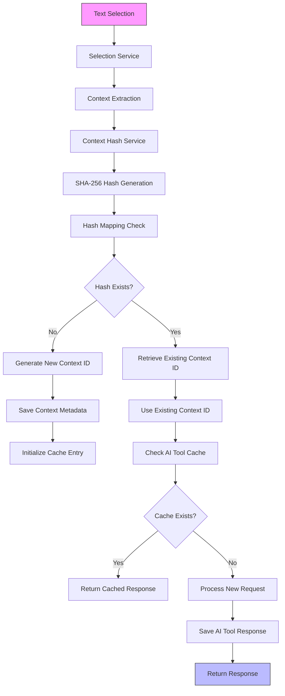
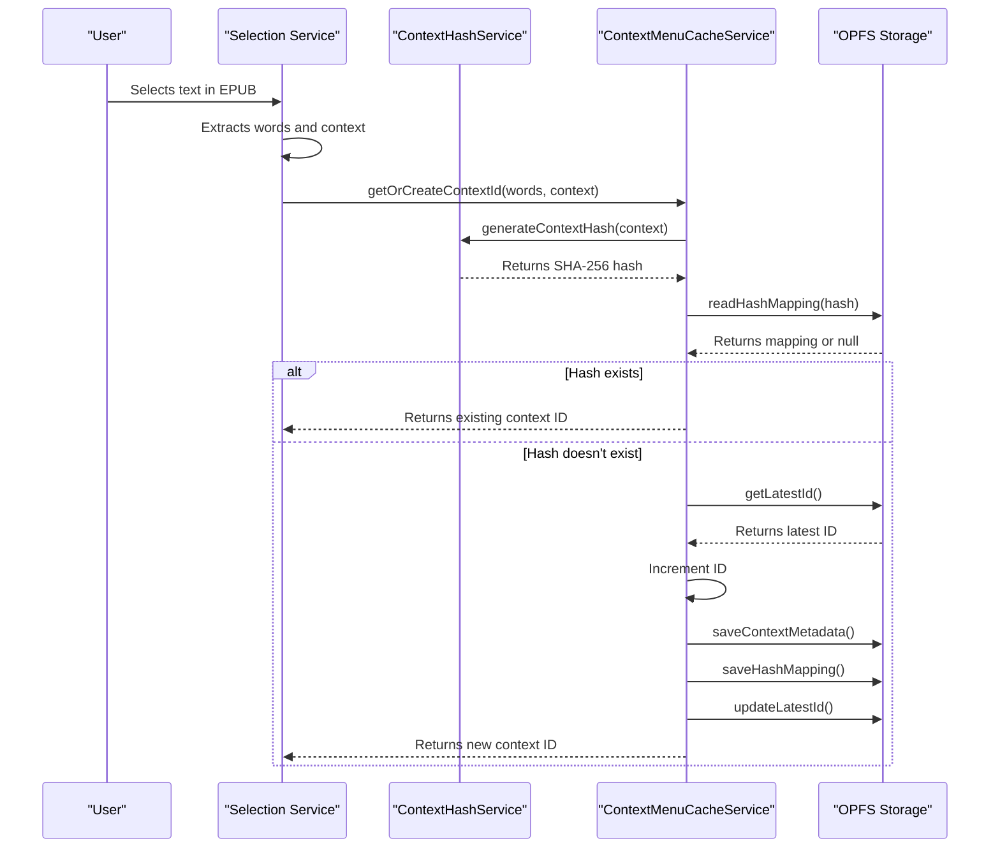
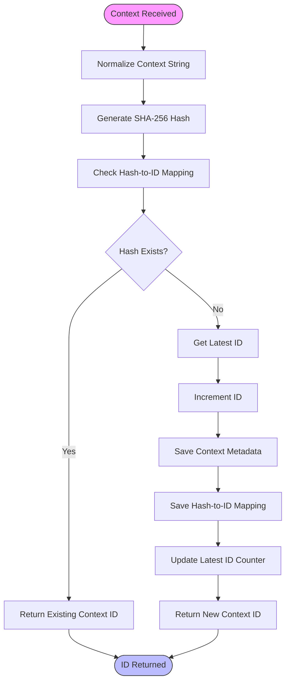
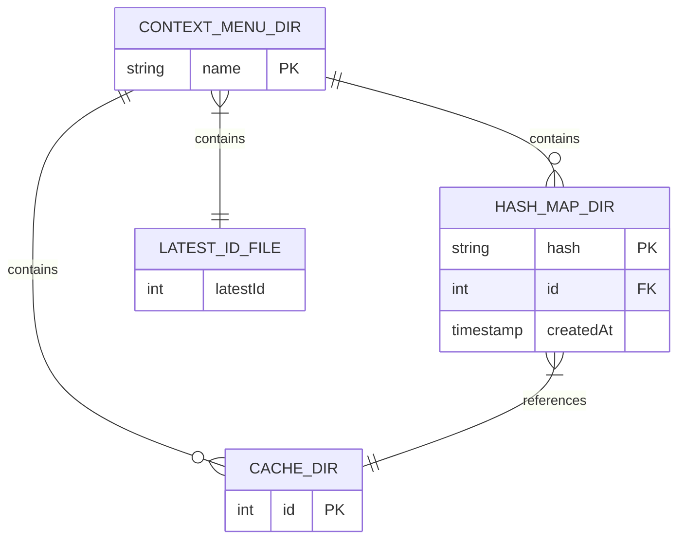

# Context Menu Caching

<cite>
**Referenced Files in This Document**   
- [ContextMenuCacheService.ts](file://src/services/ContextMenuCacheService.ts)
- [ContextHashService.ts](file://src/services/ContextHashService.ts)
- [opfs.ts](file://src/services/opfs.ts)
- [contextMenuCache.ts](file://src/types/contextMenuCache.ts)
- [useContextMenuState.ts](file://src/pages/EpubReader/hooks/useContextMenuState.ts)
- [selection.service.ts](file://src/pages/EpubReader/services/selection.service.ts)
- [epub.ts](file://src/types/epub.ts)
- [epub.ts](file://src/constants/epub.ts)
- [fileOperations.ts](file://src/utils/fileOperations.ts)
- [logger.ts](file://src/utils/logger.ts)
</cite>

## Table of Contents
1. [Introduction](#introduction)
2. [Architecture Overview](#architecture-overview)
3. [Core Components](#core-components)
4. [Data Flow Analysis](#data-flow-analysis)
5. [Caching Mechanism](#caching-mechanism)
6. [Hash-Based Deduplication](#hash-based-deduplication)
7. [OPFS Storage Structure](#opfs-storage-structure)
8. [Error Handling and Resilience](#error-handling-and-resilience)
9. [Performance Considerations](#performance-considerations)
10. [Conclusion](#conclusion)

## Introduction
The Context Menu Caching system in the EPUB reader application provides a robust mechanism for storing and retrieving AI analysis results and context metadata. This system enables efficient reuse of previously processed content, reducing redundant API calls and improving user experience by providing instant access to cached responses. The caching architecture leverages the Origin Private File System (OPFS) for persistent storage, implementing a sophisticated hash-based deduplication strategy to identify and reuse identical contexts across different reading sessions.

## Architecture Overview

**Diagram sources**
- [selection.service.ts](file://src/pages/EpubReader/services/selection.service.ts#L12-L155)
- [ContextMenuCacheService.ts](file://src/services/ContextMenuCacheService.ts#L1-L200)
- [ContextHashService.ts](file://src/services/ContextHashService.ts#L1-L133)

## Core Components

The context menu caching system consists of several interconnected components that work together to provide efficient caching functionality. The system is designed with a functional programming paradigm, emphasizing pure functions and immutability. Key components include the ContextMenuCacheService for managing cache operations, the ContextHashService for generating and managing context hashes, and the OPFS service for handling low-level file system operations. These components work in concert to ensure that context data and AI responses are stored and retrieved efficiently.

**Section sources**
- [ContextMenuCacheService.ts](file://src/services/ContextMenuCacheService.ts#L1-L200)
- [ContextHashService.ts](file://src/services/ContextHashService.ts#L1-L133)
- [opfs.ts](file://src/services/opfs.ts#L1-L65)

## Data Flow Analysis

**Diagram sources**
- [selection.service.ts](file://src/pages/EpubReader/services/selection.service.ts#L12-L155)
- [ContextMenuCacheService.ts](file://src/services/ContextMenuCacheService.ts#L66-L106)
- [ContextHashService.ts](file://src/services/ContextHashService.ts#L21-L33)

## Caching Mechanism

The caching mechanism in the EPUB reader application is designed to optimize performance by storing both context metadata and AI tool responses. The system uses a two-tiered approach: first, it stores context metadata that includes the selected words and surrounding context, and second, it stores AI tool responses associated with specific contexts. This allows the application to quickly retrieve previously analyzed content without requiring additional API calls. The cache is organized hierarchically with context IDs serving as primary keys, and AI tool names as secondary keys, enabling efficient lookup and retrieval operations.

**Section sources**
- [ContextMenuCacheService.ts](file://src/services/ContextMenuCacheService.ts#L142-L199)
- [contextMenuCache.ts](file://src/types/contextMenuCache.ts#L23-L41)

## Hash-Based Deduplication

**Diagram sources**
- [ContextHashService.ts](file://src/services/ContextHashService.ts#L21-L33)
- [ContextMenuCacheService.ts](file://src/services/ContextMenuCacheService.ts#L66-L106)

## OPFS Storage Structure

The Origin Private File System (OPFS) storage structure for the context menu cache is organized in a hierarchical directory structure that facilitates efficient data retrieval and management. The root directory contains a "contextMenu" folder that serves as the primary container for all caching-related data. Within this directory, there are three main components: a "hashMapId" directory that stores hash-to-ID mappings, a "cache" directory that contains context-specific data, and a "latest-id.json" file that tracks the highest assigned context ID. Each context ID has its own subdirectory within the cache directory, containing metadata and AI tool response files.

**Diagram sources**
- [opfs.ts](file://src/services/opfs.ts#L11-L14)
- [ContextHashService.ts](file://src/services/ContextHashService.ts#L86-L133)
- [ContextMenuCacheService.ts](file://src/services/ContextMenuCacheService.ts#L35-L57)

## Error Handling and Resilience

The context menu caching system implements comprehensive error handling to ensure resilience in the face of various failure scenarios. All file operations are wrapped in the performFileOperation utility function, which provides consistent error logging and recovery mechanisms. The system gracefully handles cases where OPFS is not supported, hash mappings are missing, or file operations fail. When critical operations fail, the system provides fallback mechanisms, such as using incremental IDs when hash-based lookup fails. This ensures that the application remains functional even when caching is not available, providing a degraded but usable experience.

**Section sources**
- [fileOperations.ts](file://src/utils/fileOperations.ts#L22-L36)
- [ContextMenuCacheService.ts](file://src/services/ContextMenuCacheService.ts#L36-L57)
- [ContextHashService.ts](file://src/services/ContextHashService.ts#L40-L55)

## Performance Considerations

The context menu caching system is designed with performance as a primary consideration. By using SHA-256 hashing for context identification, the system can quickly determine whether a particular context has been processed before, avoiding redundant AI processing. The hierarchical storage structure minimizes lookup times, and the use of OPFS ensures that data is stored persistently without impacting application performance. The system also implements batch operations when creating new context entries, reducing the number of individual file operations required. These optimizations collectively ensure that the caching system enhances rather than hinders application performance.

**Section sources**
- [ContextMenuCacheService.ts](file://src/services/ContextMenuCacheService.ts#L98-L102)
- [ContextHashService.ts](file://src/services/ContextHashService.ts#L21-L33)
- [opfs.ts](file://src/services/opfs.ts#L32-L56)

## Conclusion
The Context Menu Caching system in the EPUB reader application represents a sophisticated solution for optimizing AI-assisted reading experiences. By leveraging OPFS for persistent storage and implementing a hash-based deduplication strategy, the system efficiently manages context data and AI responses, reducing redundant processing and improving response times. The modular architecture, with clearly defined responsibilities for each component, ensures maintainability and extensibility. This caching mechanism not only enhances performance but also contributes to a more seamless and responsive user experience, allowing readers to focus on content rather than waiting for AI processing.