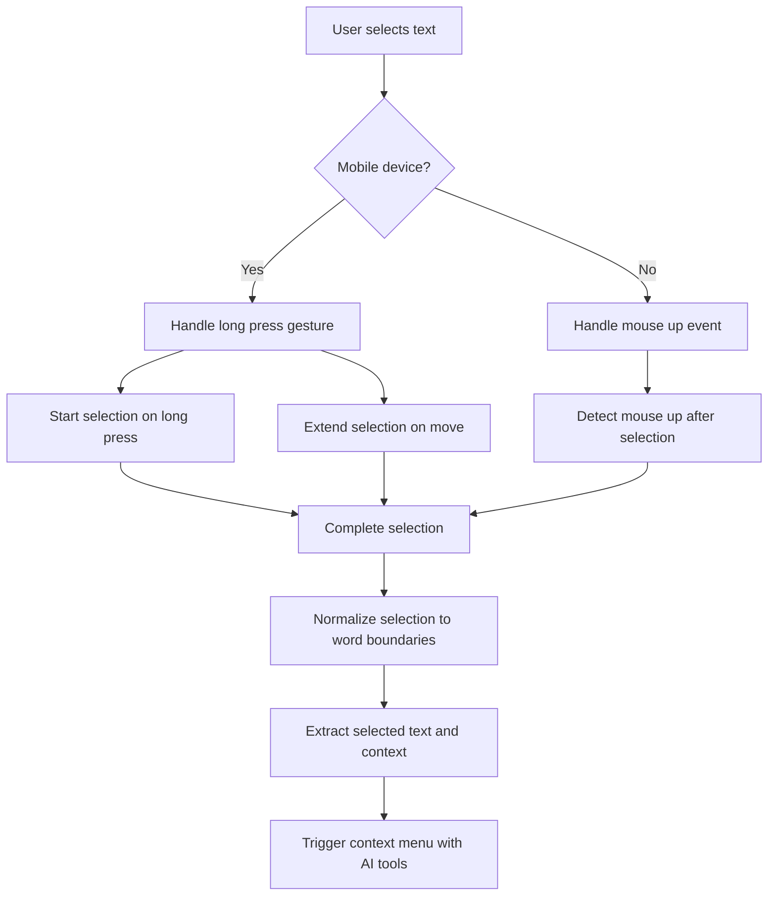
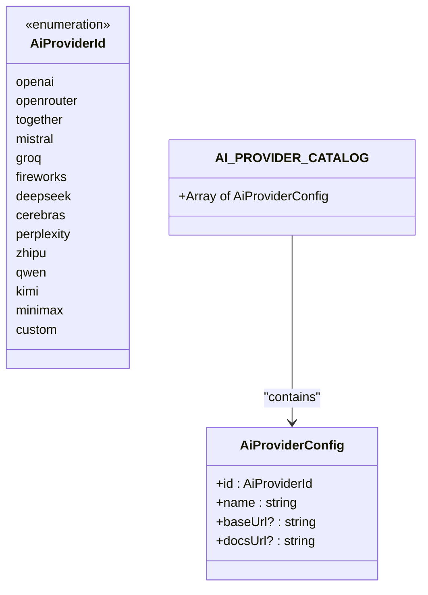
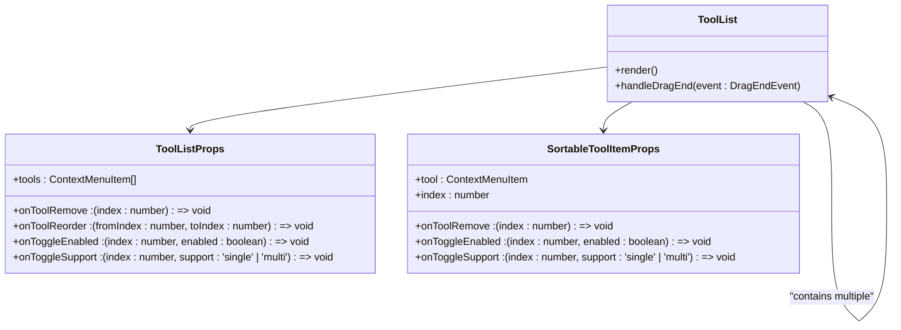
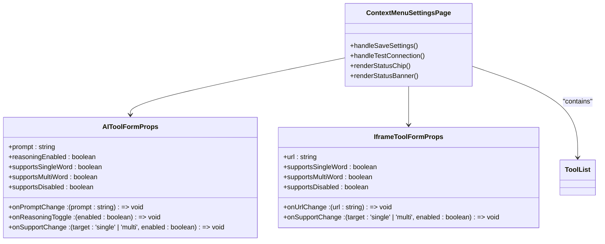
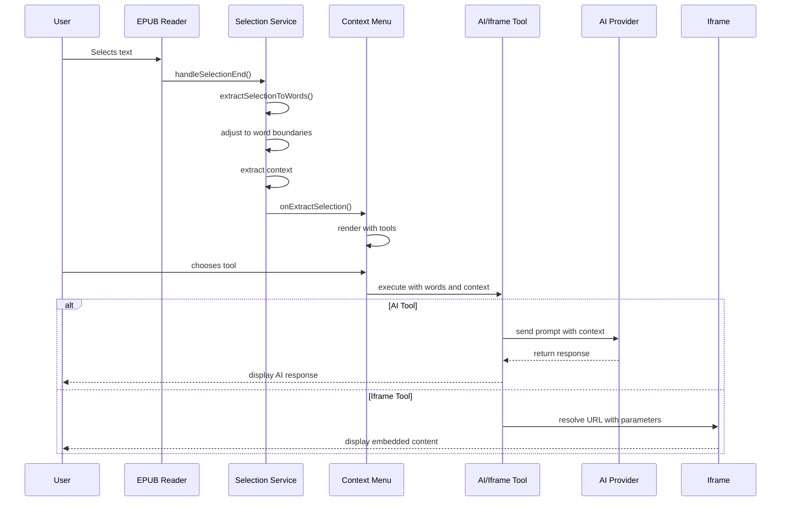
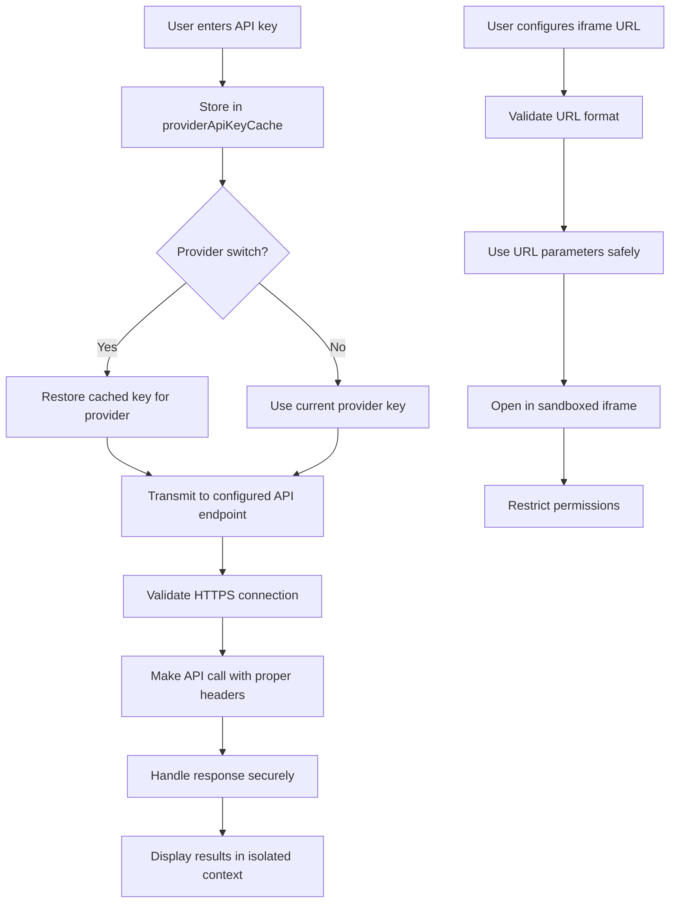
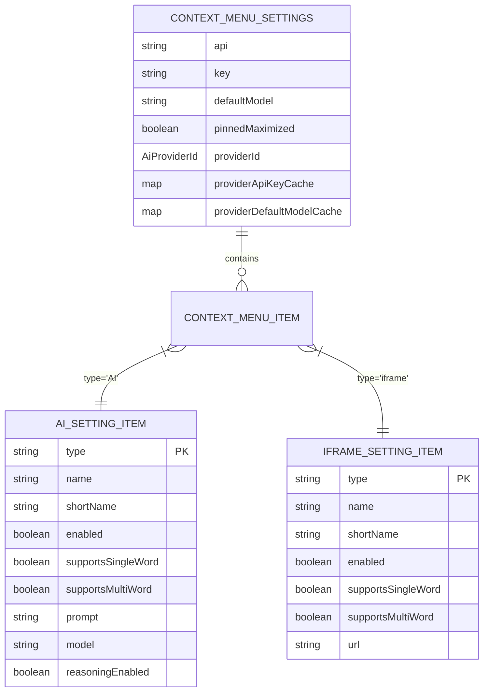
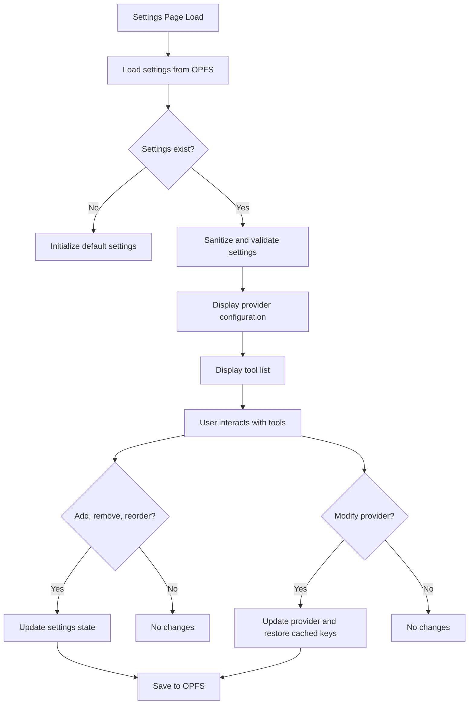
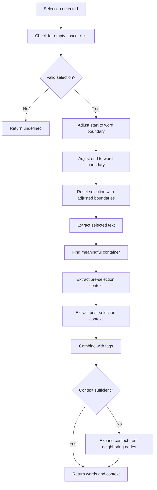

# Context Menu Integration

<cite>
**Referenced Files in This Document**   
- [aiProviders.ts](file://src/config/aiProviders.ts)
- [ToolList.tsx](file://src/pages/ContextMenuSettingsPage/components/ToolList.tsx)
- [selection.service.ts](file://src/pages/EpubReader/services/selection.service.ts)
- [mobileSelection.service.ts](file://src/pages/EpubReader/services/mobileSelection.service.ts)
- [computerSelection.service.ts](file://src/pages/EpubReader/services/computerSelection.service.ts)
- [ContextMenu.tsx](file://src/pages/EpubReader/components/ContextMenu.tsx)
- [epub.ts](file://src/types/epub.ts)
- [ContextMenuSettingsPage.tsx](file://src/pages/ContextMenuSettingsPage/index.tsx)
- [useContextMenuSettings.ts](file://src/pages/ContextMenuSettingsPage/hooks/useContextMenuSettings.ts)
- [AIToolForm.tsx](file://src/pages/ContextMenuSettingsPage/components/AIToolForm.tsx)
- [IframeToolForm.tsx](file://src/pages/ContextMenuSettingsPage/components/IframeToolForm.tsx)
- [useToolForm.ts](file://src/pages/ContextMenuSettingsPage/hooks/useToolForm.ts)
- [renditionEvent.service.ts](file://src/pages/EpubReader/services/renditionEvent.service.ts)
- [epub.ts](file://src/constants/epub.ts)
</cite>

## Table of Contents
1. [Introduction](#introduction)
2. [Text Selection and Context Menu Trigger](#text-selection-and-context-menu-trigger)
3. [AI Providers Configuration](#ai-providers-configuration)
4. [ToolList Component](#toollist-component)
5. [Tool Configuration and User Interface](#tool-configuration-and-user-interface)
6. [Data Flow from Selection to Execution](#data-flow-from-selection-to-execution)
7. [Security Considerations](#security-considerations)
8. [Custom Tool Configuration Examples](#custom-tool-configuration-examples)
9. [User Experience and Settings Management](#user-experience-and-settings-management)
10. [Selection Service Implementation](#selection-service-implementation)

## Introduction
The context menu AI integration system enables users to interact with selected text in EPUB documents through configurable AI tools. When users select text in the EPUB reader, a context menu appears with AI-powered actions that can process the selected content. This system supports both AI-based tools that use language models and iframe-based tools that embed external web content. The configuration is managed through a settings interface where users can add, remove, reorder, and configure tools according to their preferences.

## Text Selection and Context Menu Trigger
The context menu is triggered when users select text in the EPUB reader, with different implementations for mobile and desktop devices. The system uses device detection to determine the appropriate selection handling mechanism.

**Diagram sources**
- [mobileSelection.service.ts](file://src/pages/EpubReader/services/mobileSelection.service.ts#L16-L101)
- [computerSelection.service.ts](file://src/pages/EpubReader/services/computerSelection.service.ts#L6-L18)
- [renditionEvent.service.ts](file://src/pages/EpubReader/services/renditionEvent.service.ts#L29-L57)

**Section sources**
- [mobileSelection.service.ts](file://src/pages/EpubReader/services/mobileSelection.service.ts#L16-L101)
- [computerSelection.service.ts](file://src/pages/EpubReader/services/computerSelection.service.ts#L6-L18)
- [renditionEvent.service.ts](file://src/pages/EpubReader/services/renditionEvent.service.ts#L29-L57)

## AI Providers Configuration
The AI provider configuration is defined in `aiProviders.ts`, which exports a catalog of supported AI services. Each provider has an ID, name, base URL, and documentation URL. The system supports multiple AI providers including OpenAI, OpenRouter, Together AI, Mistral, Groq, and others, as well as a custom option for OpenAI-compatible APIs.

**Diagram sources**
- [aiProviders.ts](file://src/config/aiProviders.ts#L1-L109)

**Section sources**
- [aiProviders.ts](file://src/config/aiProviders.ts#L1-L109)

## ToolList Component
The ToolList component renders the configurable AI actions in the settings interface, allowing users to manage their tools. It supports drag-and-drop reordering, enabling/disabling tools, and configuring selection support for single-word and multi-word selections.

**Diagram sources**
- [ToolList.tsx](file://src/pages/ContextMenuSettingsPage/components/ToolList.tsx#L25-L239)

**Section sources**
- [ToolList.tsx](file://src/pages/ContextMenuSettingsPage/components/ToolList.tsx#L25-L239)

## Tool Configuration and User Interface
The system provides specialized forms for configuring different tool types through AIToolForm and IframeToolForm components. These forms are accessible through the ContextMenuSettingsPage, which manages the overall configuration state.

**Diagram sources**
- [AIToolForm.tsx](file://src/pages/ContextMenuSettingsPage/components/AIToolForm.tsx#L6-L110)
- [IframeToolForm.tsx](file://src/pages/ContextMenuSettingsPage/components/IframeToolForm.tsx#L6-L90)
- [ContextMenuSettingsPage.tsx](file://src/pages/ContextMenuSettingsPage/index.tsx#L15-L272)

**Section sources**
- [AIToolForm.tsx](file://src/pages/ContextMenuSettingsPage/components/AIToolForm.tsx#L6-L110)
- [IframeToolForm.tsx](file://src/pages/ContextMenuSettingsPage/components/IframeToolForm.tsx#L6-L90)
- [ContextMenuSettingsPage.tsx](file://src/pages/ContextMenuSettingsPage/index.tsx#L15-L272)

## Data Flow from Selection to Execution
The data flow from text selection to tool execution involves several steps: capturing the selection, normalizing it to word boundaries, extracting context, and passing the data to the appropriate tool. The system handles both AI and iframe tools differently based on their type.

**Diagram sources**
- [selection.service.ts](file://src/pages/EpubReader/services/selection.service.ts#L11-L148)
- [ContextMenu.tsx](file://src/pages/EpubReader/components/ContextMenu.tsx#L152-L713)
- [IframeRender.tsx](file://src/pages/EpubReader/components/IframeRender/IframeRender.tsx)

**Section sources**
- [selection.service.ts](file://src/pages/EpubReader/services/selection.service.ts#L11-L148)
- [ContextMenu.tsx](file://src/pages/EpubReader/components/ContextMenu.tsx#L152-L713)

## Security Considerations
The system implements several security measures for external API calls, including secure storage of API keys, validation of provider configurations, and proper handling of iframe content. API keys are stored in a cache keyed by provider ID and are only transmitted to the configured API endpoints.

**Diagram sources**
- [useContextMenuSettings.ts](file://src/pages/ContextMenuSettingsPage/hooks/useContextMenuSettings.ts#L176-L188)
- [aiProviders.ts](file://src/config/aiProviders.ts#L24-L108)
- [ContextMenu.tsx](file://src/pages/EpubReader/components/ContextMenu.tsx#L683-L689)

**Section sources**
- [useContextMenuSettings.ts](file://src/pages/ContextMenuSettingsPage/hooks/useContextMenuSettings.ts#L176-L188)
- [aiProviders.ts](file://src/config/aiProviders.ts#L24-L108)

## Custom Tool Configuration Examples
The system supports various custom tool configurations for different use cases. Users can create AI tools with specific prompts or iframe tools that embed external services with the selected text as parameters.

**Diagram sources**
- [epub.ts](file://src/types/epub.ts#L8-L108)
- [AIToolForm.tsx](file://src/pages/ContextMenuSettingsPage/components/AIToolForm.tsx#L29-L48)
- [IframeToolForm.tsx](file://src/pages/ContextMenuSettingsPage/components/IframeToolForm.tsx#L37-L41)

**Section sources**
- [epub.ts](file://src/types/epub.ts#L8-L108)

## User Experience and Settings Management
The user experience for discovering and managing AI tools is designed to be intuitive through the ContextMenuSettingsPage. Users can easily add new tools, reorder existing ones via drag-and-drop, and configure each tool's behavior.

**Diagram sources**
- [useContextMenuSettings.ts](file://src/pages/ContextMenuSettingsPage/hooks/useContextMenuSettings.ts#L47-L127)
- [ContextMenuSettingsPage.tsx](file://src/pages/ContextMenuSettingsPage/index.tsx#L22-L38)
- [useToolForm.ts](file://src/pages/ContextMenuSettingsPage/hooks/useToolForm.ts#L8-L158)

**Section sources**
- [useContextMenuSettings.ts](file://src/pages/ContextMenuSettingsPage/hooks/useContextMenuSettings.ts#L47-L127)
- [ContextMenuSettingsPage.tsx](file://src/pages/ContextMenuSettingsPage/index.tsx#L22-L38)

## Selection Service Implementation
The selection service captures and normalizes text selections across different devices, ensuring consistent behavior. It adjusts selections to word boundaries and extracts contextual information around the selected text to provide better input for AI tools.

**Diagram sources**
- [selection.service.ts](file://src/pages/EpubReader/services/selection.service.ts#L33-L148)
- [mobileSelection.service.ts](file://src/pages/EpubReader/services/mobileSelection.service.ts#L103-L230)
- [computerSelection.service.ts](file://src/pages/EpubReader/services/computerSelection.service.ts#L6-L18)

**Section sources**
- [selection.service.ts](file://src/pages/EpubReader/services/selection.service.ts#L33-L148)
- [mobileSelection.service.ts](file://src/pages/EpubReader/services/mobileSelection.service.ts#L103-L230)
- [computerSelection.service.ts](file://src/pages/EpubReader/services/computerSelection.service.ts#L6-L18)