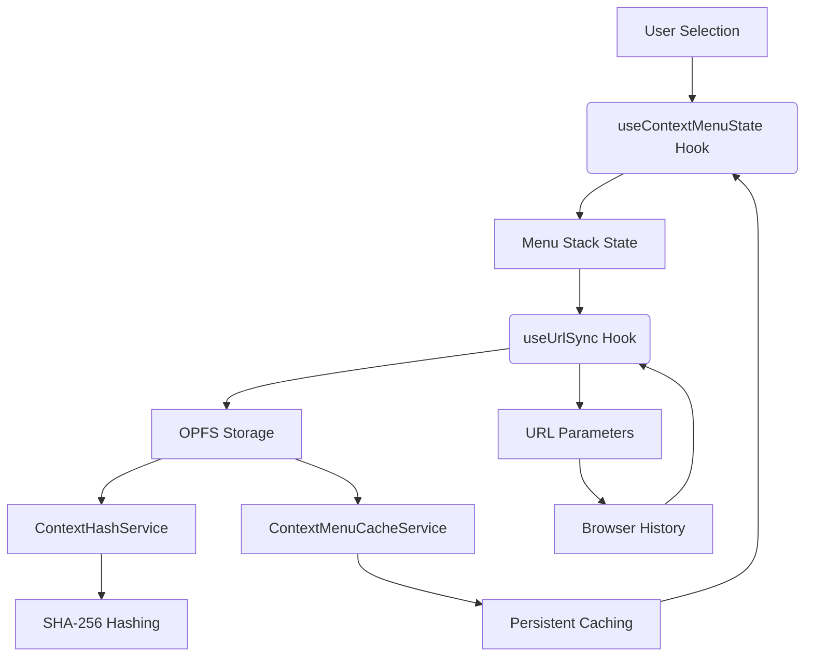
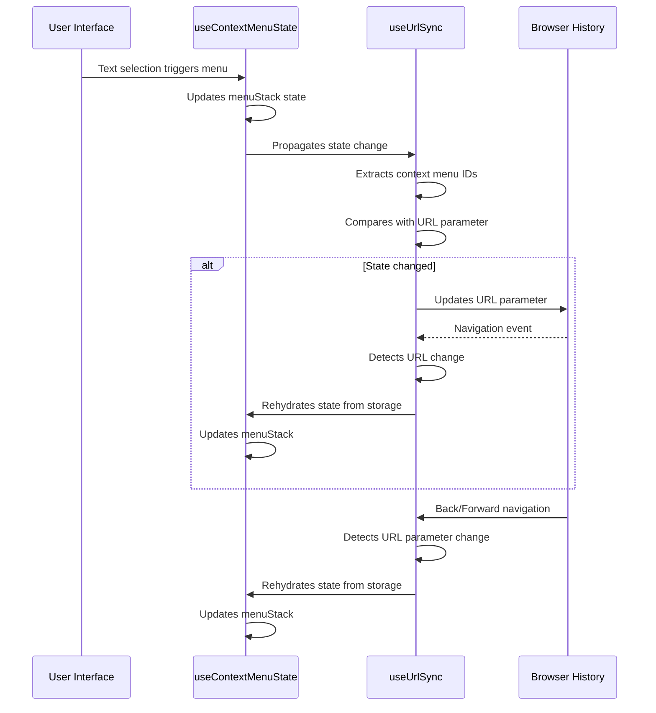
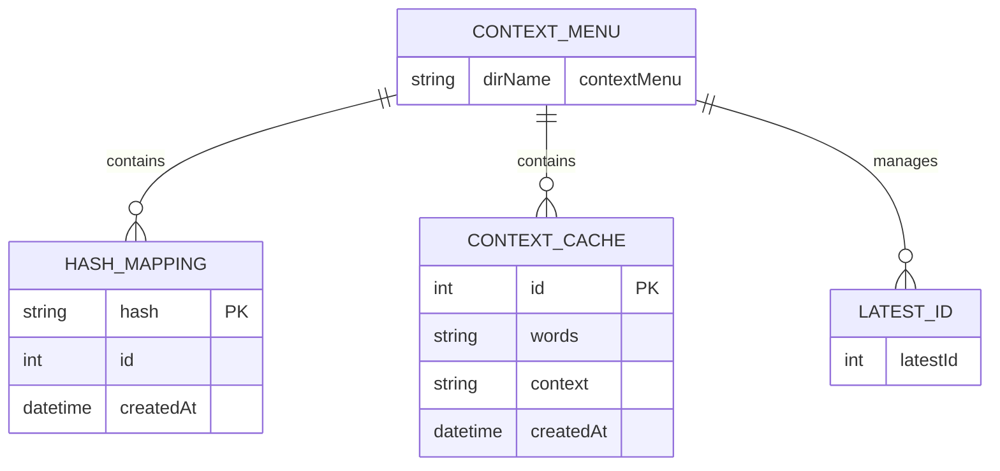
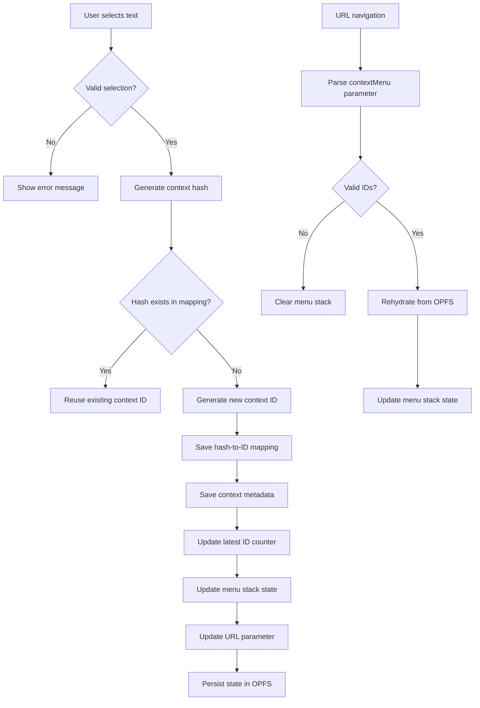
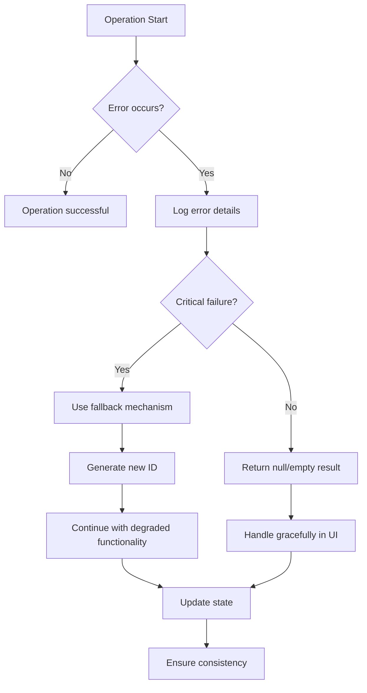

# Context Menu State Synchronization

<cite>
**Referenced Files in This Document**   
- [useContextMenuState.ts](file://src/pages/EpubReader/hooks/useContextMenuState.ts)
- [useUrlSync.ts](file://src/pages/EpubReader/hooks/useUrlSync.ts)
- [ContextMenuCacheService.ts](file://src/services/ContextMenuCacheService.ts)
- [ContextHashService.ts](file://src/services/ContextHashService.ts)
- [opfs.ts](file://src/services/opfs.ts)
- [contextMenuCache.ts](file://src/types/contextMenuCache.ts)
- [fileOperations.ts](file://src/utils/fileOperations.ts)
- [EpubReader/index.tsx](file://src/pages/EpubReader/index.tsx)
</cite>

## Table of Contents
1. [Introduction](#introduction)
2. [Core Components](#core-components)
3. [State Synchronization Architecture](#state-synchronization-architecture)
4. [URL State Management](#url-state-management)
5. [Persistent Storage System](#persistent-storage-system)
6. [Data Flow Analysis](#data-flow-analysis)
7. [Error Handling and Recovery](#error-handling-and-recovery)
8. [Performance Considerations](#performance-considerations)

## Introduction
This document details the context menu state synchronization system in the EPUB reader application. The system maintains consistent state between the user interface, URL parameters, and persistent storage, ensuring that context menu states are preserved across navigation, page reloads, and browser sessions. The implementation uses React hooks, URL search parameters, and the Origin Private File System (OPFS) for persistent storage.

## Core Components

The context menu state synchronization system consists of several key components that work together to maintain consistent state across different layers of the application.

**Section sources**
- [useContextMenuState.ts](file://src/pages/EpubReader/hooks/useContextMenuState.ts#L1-L248)
- [useUrlSync.ts](file://src/pages/EpubReader/hooks/useUrlSync.ts#L1-L167)
- [ContextMenuCacheService.ts](file://src/services/ContextMenuCacheService.ts#L1-L200)

## State Synchronization Architecture

The state synchronization architecture follows a layered approach with clear separation of concerns between state management, URL synchronization, and persistent storage.

**Diagram sources**
- [useContextMenuState.ts](file://src/pages/EpubReader/hooks/useContextMenuState.ts#L1-L248)
- [useUrlSync.ts](file://src/pages/EpubReader/hooks/useUrlSync.ts#L1-L167)
- [ContextMenuCacheService.ts](file://src/services/ContextMenuCacheService.ts#L1-L200)
- [ContextHashService.ts](file://src/services/ContextHashService.ts#L1-L133)

## URL State Management

The URL state management system synchronizes the context menu state with URL parameters, enabling bookmarking, sharing, and back/forward navigation while preserving context menu states.

**Diagram sources**
- [useUrlSync.ts](file://src/pages/EpubReader/hooks/useUrlSync.ts#L1-L167)
- [useContextMenuState.ts](file://src/pages/EpubReader/hooks/useContextMenuState.ts#L1-L248)

**Section sources**
- [useUrlSync.ts](file://src/pages/EpubReader/hooks/useUrlSync.ts#L1-L167)

## Persistent Storage System

The persistent storage system uses OPFS to store context menu data, ensuring that user context is preserved across sessions and application restarts.

**Diagram sources**
- [ContextMenuCacheService.ts](file://src/services/ContextMenuCacheService.ts#L1-L200)
- [ContextHashService.ts](file://src/services/ContextHashService.ts#L1-L133)
- [opfs.ts](file://src/services/opfs.ts#L1-L65)

**Section sources**
- [ContextMenuCacheService.ts](file://src/services/ContextMenuCacheService.ts#L1-L200)
- [ContextHashService.ts](file://src/services/ContextHashService.ts#L1-L133)
- [opfs.ts](file://src/services/opfs.ts#L1-L65)

## Data Flow Analysis

The data flow for context menu state synchronization follows a specific pattern from user interaction to persistent storage and back.

**Diagram sources**
- [useContextMenuState.ts](file://src/pages/EpubReader/hooks/useContextMenuState.ts#L1-L248)
- [useUrlSync.ts](file://src/pages/EpubReader/hooks/useUrlSync.ts#L1-L167)
- [ContextMenuCacheService.ts](file://src/services/ContextMenuCacheService.ts#L1-L200)

## Error Handling and Recovery

The system implements comprehensive error handling to ensure robustness and graceful degradation when errors occur during state synchronization.

**Diagram sources**
- [ContextMenuCacheService.ts](file://src/services/ContextMenuCacheService.ts#L1-L200)
- [ContextHashService.ts](file://src/services/ContextHashService.ts#L1-L133)
- [fileOperations.ts](file://src/utils/fileOperations.ts#L1-L91)

**Section sources**
- [ContextMenuCacheService.ts](file://src/services/ContextMenuCacheService.ts#L1-L200)
- [ContextHashService.ts](file://src/services/ContextHashService.ts#L1-L133)
- [fileOperations.ts](file://src/utils/fileOperations.ts#L1-L91)

## Performance Considerations

The context menu state synchronization system has been designed with performance in mind, minimizing redundant operations and optimizing data access patterns.

### Key Performance Optimizations

| Optimization | Description | Benefit |
|------------|-----------|--------|
| Hash-based deduplication | Uses SHA-256 hashes to identify duplicate contexts | Prevents redundant storage and processing |
| Batched file operations | Groups related file operations together | Reduces I/O overhead |
| Reference comparison | Uses refs to track previous state | Minimizes unnecessary URL updates |
| Lazy initialization | Initializes OPFS structure only when needed | Improves startup performance |
| Memoized calculations | Caches computed values | Reduces CPU usage |

**Section sources**
- [useUrlSync.ts](file://src/pages/EpubReader/hooks/useUrlSync.ts#L1-L167)
- [ContextMenuCacheService.ts](file://src/services/ContextMenuCacheService.ts#L1-L200)
- [ContextHashService.ts](file://src/services/ContextHashService.ts#L1-L133)