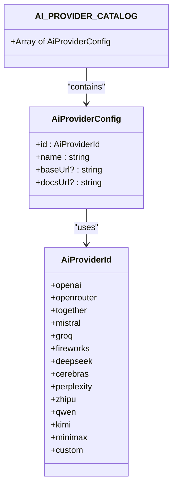
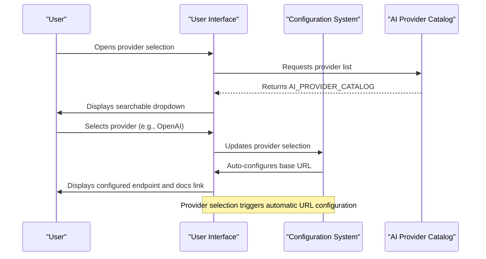
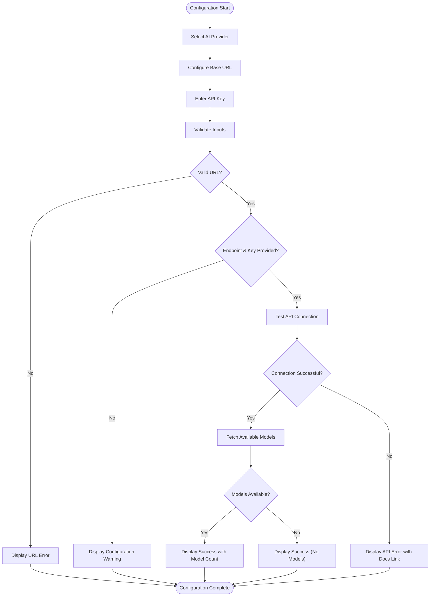
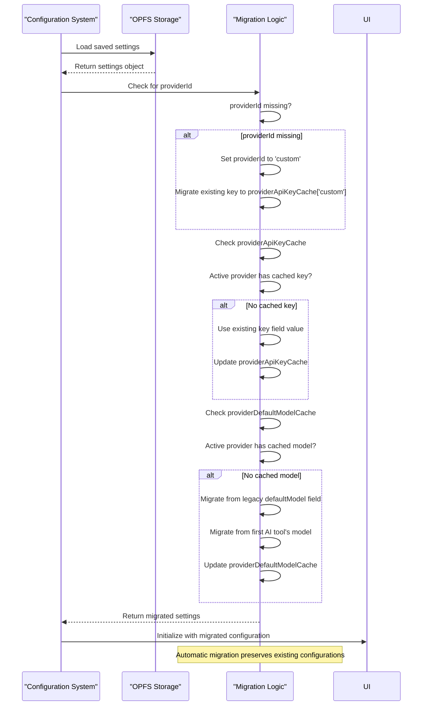
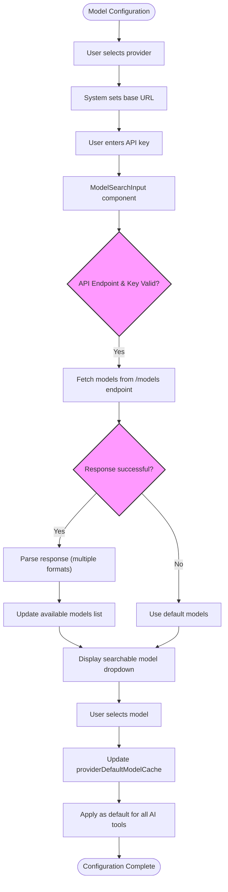

# Model Configuration

<cite>
**Referenced Files in This Document**   
- [aiProviders.ts](file://src/config/aiProviders.ts)
- [ApiConfig.tsx](file://src/pages/ContextMenuSettingsPage/components/ApiConfig.tsx)
- [SearchableSelect.tsx](file://src/components/SearchableSelect.tsx)
- [ModelSearchInput.tsx](file://src/pages/ContextMenuSettingsPage/components/ModelSearchInput.tsx)
- [useContextMenuSettings.ts](file://src/pages/ContextMenuSettingsPage/hooks/useContextMenuSettings.ts)
- [epub.ts](file://src/types/epub.ts)
- [OPFSManager.ts](file://src/services/OPFSManager.ts)
</cite>

## Table of Contents
1. [Introduction](#introduction)
2. [AI Provider Configuration](#ai-provider-configuration)
3. [Provider Selection and Management](#provider-selection-and-management)
4. [API Configuration Interface](#api-configuration-interface)
5. [Migration Strategy and Backward Compatibility](#migration-strategy-and-backward-compatibility)
6. [Model Selection and Auto-Configuration](#model-selection-and-auto-configuration)
7. [Security Considerations](#security-considerations)
8. [Troubleshooting Guide](#troubleshooting-guide)
9. [Extending the Provider Catalog](#extending-the-provider-catalog)

## Introduction
This document provides comprehensive guidance on AI model configuration and provider management within the EPUB reader application. It covers the architecture of the AI provider system, configuration management, user interface components, security practices, and extension mechanisms. The system enables users to select from multiple AI service providers, configure API endpoints and keys securely, and manage model settings for AI-powered reading tools.

## AI Provider Configuration

The AI provider configuration is defined in the `aiProviders.ts` file, which maintains a catalog of supported AI services. This configuration includes essential metadata for each provider, enabling seamless integration and user guidance.

The `AI_PROVIDER_CATALOG` exports a comprehensive list of AI providers, each with a unique identifier, display name, base URL, and documentation link. The system supports major AI platforms including OpenAI, OpenRouter, Together AI, Mistral, Groq, Fireworks AI, DeepSeek, Cerebras, Perplexity, Zhipu GLM, Qwen, Kimi (Moonshot), and Minimax.

A special 'custom' provider option allows users to connect to any OpenAI-compatible service by specifying a custom base URL. Providers without a defined base URL require users to input their endpoint manually. Each provider entry includes a documentation URL to help users understand service-specific requirements and capabilities.



**Diagram sources**
- [aiProviders.ts](file://src/config/aiProviders.ts#L1-L110)

**Section sources**
- [aiProviders.ts](file://src/config/aiProviders.ts#L1-L110)

## Provider Selection and Management

The provider selection system is built around the `SearchableSelect` component, which provides a user-friendly interface for choosing AI providers from the catalog. This component supports filtering, keyboard navigation, and responsive dropdown positioning based on available screen space.

When a user selects a provider, the system automatically configures the base URL based on the provider's configuration. For standard providers, this means the correct endpoint is pre-populated. For the 'custom' provider option, users must manually enter their base URL, enabling connection to any OpenAI-compatible service.

The selection process is enhanced with additional information display. When a provider is selected, the interface shows the base URL and provides a direct link to the provider's documentation, helping users understand service-specific requirements and capabilities.



**Diagram sources**
- [SearchableSelect.tsx](file://src/components/SearchableSelect.tsx#L1-L185)
- [aiProviders.ts](file://src/config/aiProviders.ts#L24-L109)

**Section sources**
- [SearchableSelect.tsx](file://src/components/SearchableSelect.tsx#L1-L185)

## API Configuration Interface

The `ApiConfig` component provides a comprehensive interface for managing AI provider credentials and endpoints. This component handles provider selection, API key management, and endpoint configuration with real-time validation and connection testing.

The interface includes several key features:
- Provider selection with automatic base URL configuration
- Secure API key input with visibility toggle
- Real-time validation of endpoint URLs
- Connection testing with model availability verification
- Error handling and user guidance

When both the API endpoint and key are provided, the system automatically tests the connection by querying the provider's models endpoint. This validation provides immediate feedback on configuration correctness and model availability. The system displays appropriate status messages, including success indicators with model count, error messages with troubleshooting links, and warnings for incomplete configurations.



**Diagram sources**
- [ApiConfig.tsx](file://src/pages/ContextMenuSettingsPage/components/ApiConfig.tsx#L53-L276)

**Section sources**
- [ApiConfig.tsx](file://src/pages/ContextMenuSettingsPage/components/ApiConfig.tsx#L53-L276)

## Migration Strategy and Backward Compatibility

The system implements a comprehensive migration strategy to ensure backward compatibility with existing endpoint configurations while introducing the new provider-based architecture. This approach allows seamless transition for existing users without requiring manual reconfiguration.

When loading settings, the system checks for legacy configuration patterns and automatically migrates them to the new provider-based model. If no provider is specified in existing settings, the system defaults to the 'custom' provider and preserves the existing API key in the provider-specific cache. This ensures that users who previously configured custom endpoints continue to function without interruption.

The migration process also handles legacy model configuration by checking for deprecated model fields and migrating them to the provider-specific default model cache. This preserves user preferences while aligning with the new architecture. The system prioritizes provider-specific cached settings over legacy global settings, ensuring consistency across sessions.



**Diagram sources**
- [useContextMenuSettings.ts](file://src/pages/ContextMenuSettingsPage/hooks/useContextMenuSettings.ts#L47-L127)

**Section sources**
- [useContextMenuSettings.ts](file://src/pages/ContextMenuSettingsPage/hooks/useContextMenuSettings.ts#L47-L127)

## Model Selection and Auto-Configuration

The model configuration system provides intelligent auto-configuration while allowing user customization through the `ModelSearchInput` component. This component enables users to search for available models from their selected provider while falling back to default models when API access is unavailable.

When a user configures a valid API endpoint and key, the system automatically fetches the list of available models from the provider's API. The component handles multiple API response formats (OpenAI standard, direct array, alternative formats) to ensure compatibility across different providers. If the API request fails, the system gracefully falls back to a predefined list of default models, ensuring functionality even when connectivity issues occur.

The system maintains a cache of default models for each provider, stored in the `providerDefaultModelCache`. This cache is updated whenever a user selects a model, creating a personalized experience that remembers frequently used models across sessions. The global default model setting applies to all AI tools unless overridden at the tool level.



**Diagram sources**
- [ModelSearchInput.tsx](file://src/pages/ContextMenuSettingsPage/components/ModelSearchInput.tsx#L25-L235)
- [useContextMenuSettings.ts](file://src/pages/ContextMenuSettingsPage/hooks/useContextMenuSettings.ts#L192-L209)

**Section sources**
- [ModelSearchInput.tsx](file://src/pages/ContextMenuSettingsPage/components/ModelSearchInput.tsx#L25-L235)

## Security Considerations

The system implements robust security practices for managing sensitive API credentials through the OPFS (Origin Private File System) storage mechanism. API keys are never stored in plain text in less secure storage mechanisms like localStorage or cookies.

The `useContextMenuSettings` hook manages a `providerApiKeyCache` that stores API keys indexed by provider ID. When a user switches providers, the system automatically retrieves the appropriate key from the cache without exposing it in the global configuration. This provider-specific caching ensures that credentials remain associated with their respective services while minimizing exposure.

All API key inputs use password masking by default, with an optional visibility toggle that requires explicit user action to reveal the key. This balances usability with security, allowing users to verify their input when needed while protecting against casual observation.

The OPFSManager service handles the encryption and secure storage of configuration data, including API keys. The system follows the principle of least privilege, only loading and decrypting sensitive data when necessary for API operations.

```mermaid
classDiagram
class ContextMenuSettings {
+api : string
+key : string
+providerId? : AiProviderId
+providerApiKeyCache? : Partial~Record~AiProviderId, string~~
+providerDefaultModelCache? : Partial~Record~AiProviderId, string~~
}
class OPFSManager {
+getContextMenuSettings()
+updateContextMenuSettings()
}
class useContextMenuSettings {
+updateApiKey()
+updateProvider()
}
OPFSManager --> ContextMenuSettings : "stores/encrypts"
useContextMenuSettings --> ContextMenuSettings : "manages"
useContextMenuSettings --> OPFSManager : "persists"
note right of ContextMenuSettings : providerApiKeyCache stores keys by provider ID
note right of useContextMenuSettings : updateApiKey updates both current key and providerApiKeyCache
```

**Diagram sources**
- [useContextMenuSettings.ts](file://src/pages/ContextMenuSettingsPage/hooks/useContextMenuSettings.ts#L28-L37)
- [OPFSManager.ts](file://src/services/OPFSManager.ts)

**Section sources**
- [useContextMenuSettings.ts](file://src/pages/ContextMenuSettingsPage/hooks/useContextMenuSettings.ts#L176-L189)

## Troubleshooting Guide

This section provides guidance for resolving common connection issues and configuration problems related to AI provider integration.

### Connection Issues
When experiencing connection problems, verify the following:
1. Ensure the API endpoint URL is valid and uses HTTPS protocol
2. Confirm the API key is correct and has not expired
3. Check that the provider's service is operational
4. Verify network connectivity and firewall settings

The system provides specific error messages to help diagnose issues:
- "Please enter a valid URL" indicates malformed endpoint configuration
- "API connection failed" with HTTP status provides server response details
- "Network error" suggests connectivity problems or CORS restrictions

### Model Availability Errors
If models are not appearing in the selection dropdown:
1. Verify that both the endpoint and API key are correctly configured
2. Check that the API key has permissions to access the models endpoint
3. Confirm the provider supports the models API endpoint
4. Test connectivity to the provider's API directly

The system automatically attempts to fetch models when the input field is focused. If this fails, it falls back to default models while displaying a warning message.

### Provider Switching Issues
When switching between providers:
1. Ensure each provider has its API key cached in providerApiKeyCache
2. Verify the base URL updates correctly based on the selected provider
3. Check that the default model updates according to providerDefaultModelCache

The migration system should automatically handle legacy configurations, but manual verification may be needed for complex migration scenarios.

**Section sources**
- [ApiConfig.tsx](file://src/pages/ContextMenuSettingsPage/components/ApiConfig.tsx#L121-L159)
- [ModelSearchInput.tsx](file://src/pages/ContextMenuSettingsPage/components/ModelSearchInput.tsx#L60-L108)

## Extending the Provider Catalog

Adding new AI providers to the catalog requires modifications to the `aiProviders.ts` configuration file. To add a new provider:

1. Add a new identifier to the `AiProviderId` union type
2. Create a new entry in the `AI_PROVIDER_CATALOG` array with the following properties:
   - `id`: The unique identifier added in step 1
   - `name`: Display name for the provider
   - `baseUrl`: Base API endpoint (or undefined for custom providers)
   - `docsUrl`: Link to provider documentation

For example, to add a new provider:
```typescript
{
  id: 'newprovider',
  name: 'New Provider',
  baseUrl: 'https://api.newprovider.com/v1',
  docsUrl: 'https://docs.newprovider.com'
}
```

After adding the provider to the catalog, ensure that:
1. The provider's API is compatible with the application's request format
2. The models endpoint is accessible and returns data in a supported format
3. Authentication follows the standard Bearer token pattern
4. Rate limits and usage policies are documented for users

The system's architecture allows new providers to be added without modifying core functionality, as the configuration-driven design automatically incorporates new entries into the selection interface and configuration flow.

**Section sources**
- [aiProviders.ts](file://src/config/aiProviders.ts#L1-L110)