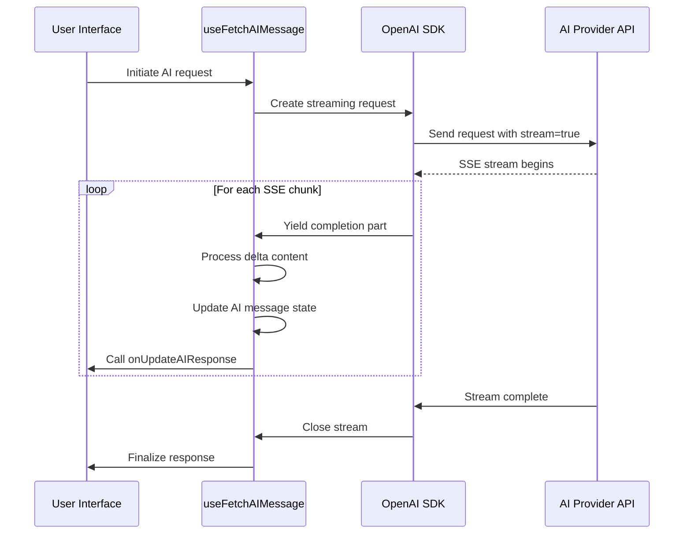
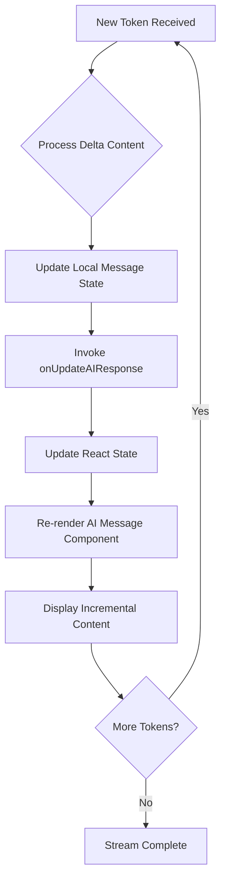
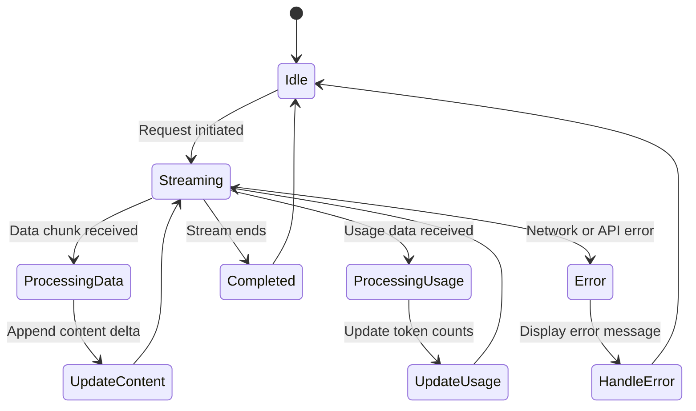
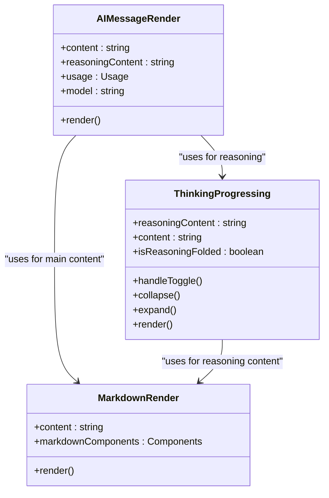
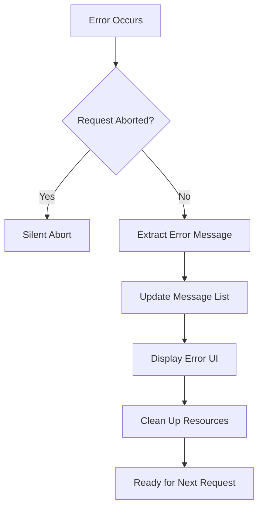
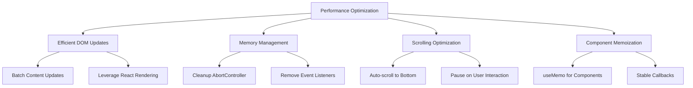

# Streaming Responses

<cite>
**Referenced Files in This Document**   
- [useFetchAIMessage.ts](file://src/pages/EpubReader/components/AIAgent/components/MessageList/useFetchAIMessage.ts)
- [AIMessageRender.tsx](file://src/pages/EpubReader/components/AIAgent/components/AIMessageRender.tsx)
- [MarkdownRender.tsx](file://src/pages/EpubReader/components/AIAgent/components/MarkdownRender.tsx)
- [AIAgent.tsx](file://src/pages/EpubReader/components/AIAgent/AIAgent.tsx)
- [thinkingConfig.ts](file://src/config/thinkingConfig.ts)
- [MessageList.tsx](file://src/pages/EpubReader/components/AIAgent/components/MessageList/MessageList.tsx)
- [ThinkingProgressing.tsx](file://src/pages/EpubReader/components/AIAgent/components/ThinkingProgressing.tsx)
</cite>

## Table of Contents
1. [Introduction](#introduction)
2. [Streaming Implementation with useFetchAIMessage](#streaming-implementation-with-usefetchaimessage)
3. [Real-Time UI Updates with onUpdateAIResponse](#real-time-ui-updates-with-onupdateairesponse)
4. [SSE Parsing and Event Handling](#sse-parsing-and-event-handling)
5. [Incremental Rendering with react-markdown](#incremental-rendering-with-react-markdown)
6. [Error Handling Strategy](#error-handling-strategy)
7. [Performance Optimization](#performance-optimization)
8. [Troubleshooting Common Streaming Issues](#troubleshooting-common-streaming-issues)
9. [Conclusion](#conclusion)

## Introduction
The streaming AI response system in this application enables real-time interaction with AI models through a seamless streaming interface. The system implements a robust streaming mechanism that connects to OpenAI-compatible APIs and delivers responses incrementally as tokens are generated. This approach significantly enhances user experience by reducing perceived latency and providing immediate feedback during AI processing. The architecture combines React's state management with the OpenAI SDK's streaming capabilities to create a responsive interface that handles both standard responses and reasoning processes.

## Streaming Implementation with useFetchAIMessage

The core streaming functionality is implemented in the `useFetchAIMessage` custom hook, which orchestrates the entire streaming process from API request to response handling. This hook leverages the OpenAI SDK's streaming capabilities to establish a connection with AI providers and process Server-Sent Events (SSE) as they arrive.

**Diagram sources**
- [useFetchAIMessage.ts](file://src/pages/EpubReader/components/AIAgent/components/MessageList/useFetchAIMessage.ts#L23-L152)

**Section sources**
- [useFetchAIMessage.ts](file://src/pages/EpubReader/components/AIAgent/components/MessageList/useFetchAIMessage.ts#L23-L152)

## Real-Time UI Updates with onUpdateAIResponse

The streaming system implements a callback mechanism through the `onUpdateAIResponse` function, which enables real-time UI updates as AI tokens arrive. This callback is defined in the `AIAgent` component and passed down to the streaming hook, creating a direct communication channel between the streaming logic and the UI rendering layer.

When new tokens are received from the AI provider, the streaming hook updates the AI message state and invokes the `onUpdateAIResponse` callback with the current response state. This triggers a re-render of the AI message component, displaying the incremental content to the user. The callback mechanism ensures that the UI remains responsive and provides immediate visual feedback during the streaming process.

**Diagram sources**
- [AIAgent.tsx](file://src/pages/EpubReader/components/AIAgent/AIAgent.tsx#L47-L57)
- [useFetchAIMessage.ts](file://src/pages/EpubReader/components/AIAgent/components/MessageList/useFetchAIMessage.ts#L129)

**Section sources**
- [AIAgent.tsx](file://src/pages/EpubReader/components/AIAgent/AIAgent.tsx#L47-L57)
- [useFetchAIMessage.ts](file://src/pages/EpubReader/components/AIAgent/components/MessageList/useFetchAIMessage.ts#L129)

## SSE Parsing and Event Handling

The system handles Server-Sent Events (SSE) through the OpenAI SDK's built-in streaming support, which abstracts the low-level SSE parsing while providing access to the streaming data. The implementation processes three main types of events: data chunks containing response deltas, usage information, and stream completion.

For data events, the system extracts the content delta from the completion part and appends it to the existing response. When reasoning is enabled, the system also processes reasoning content separately, allowing for the display of the AI's thought process. Usage events provide token count information that is displayed in the AI status bar, giving users insights into resource consumption.

The error handling mechanism monitors for stream interruptions and API errors, ensuring graceful degradation when issues occur. The implementation uses AbortController to manage request cancellation, allowing users to abort ongoing requests when needed.

**Diagram sources**
- [useFetchAIMessage.ts](file://src/pages/EpubReader/components/AIAgent/components/MessageList/useFetchAIMessage.ts#L108-L141)
- [thinkingConfig.ts](file://src/config/thinkingConfig.ts#L1-L34)

**Section sources**
- [useFetchAIMessage.ts](file://src/pages/EpubReader/components/AIAgent/components/MessageList/useFetchAIMessage.ts#L108-L141)

## Incremental Rendering with react-markdown

The system implements incremental rendering of AI responses using the `react-markdown` library, which processes Markdown content as it streams in from the AI provider. This approach enables the display of formatted content including headings, lists, code blocks, and other Markdown elements as they are generated, rather than waiting for the complete response.

The `MarkdownRender` component is optimized for performance through the use of React's `useMemo` hook, which memoizes the markdown components configuration to prevent unnecessary re-creation on each render. The component supports GitHub Flavored Markdown (GFM) through the `remark-gfm` plugin, enabling features like tables, strikethrough, and task lists.

For reasoning content, the system implements a collapsible interface that automatically folds the thinking process when the main response content arrives. Users can expand the reasoning section to view the AI's thought process, providing transparency into how the response was generated.

**Diagram sources**
- [MarkdownRender.tsx](file://src/pages/EpubReader/components/AIAgent/components/MarkdownRender.tsx#L1-L77)
- [AIMessageRender.tsx](file://src/pages/EpubReader/components/AIAgent/components/AIMessageRender.tsx#L1-L103)
- [ThinkingProgressing.tsx](file://src/pages/EpubReader/components/AIAgent/components/ThinkingProgressing.tsx#L1-L159)

**Section sources**
- [MarkdownRender.tsx](file://src/pages/EpubReader/components/AIAgent/components/MarkdownRender.tsx#L1-L77)
- [AIMessageRender.tsx](file://src/pages/EpubReader/components/AIAgent/components/AIMessageRender.tsx#L1-L103)

## Error Handling Strategy

The streaming system implements a comprehensive error handling strategy to manage various failure scenarios that may occur during AI requests. The implementation distinguishes between user-initiated aborts and genuine errors, ensuring that error messages are only displayed when appropriate.

Network failures and API errors are caught in the main try-catch block of the streaming function. When an error occurs, the system checks whether the request was aborted by the user (via the AbortController) before displaying an error message. This prevents error notifications when users intentionally cancel requests.

The error handling mechanism also manages malformed responses and incomplete data streams, providing fallback behavior that maintains UI stability. When an error occurs, the system updates the message list with an error message, replacing any incomplete response content. This ensures that the UI always reflects the current state of the conversation.

**Diagram sources**
- [useFetchAIMessage.ts](file://src/pages/EpubReader/components/AIAgent/components/MessageList/useFetchAIMessage.ts#L143-L147)
- [AIAgent.tsx](file://src/pages/EpubReader/components/AIAgent/AIAgent.tsx#L85-L90)

**Section sources**
- [useFetchAIMessage.ts](file://src/pages/EpubReader/components/AIAgent/components/MessageList/useFetchAIMessage.ts#L143-L147)

## Performance Optimization

The streaming implementation incorporates several performance optimizations to ensure smooth user experience even with large responses. The system minimizes DOM updates by batching content updates and leveraging React's efficient rendering pipeline.

Memory management is handled through proper cleanup of AbortController references and event listeners, preventing memory leaks during prolonged usage. The implementation also optimizes the rendering of markdown content by memoizing component configurations and minimizing re-renders.

For large responses, the system implements efficient scrolling behavior that automatically scrolls to the bottom of the conversation while allowing users to pause auto-scroll when reading earlier content. This balance between automatic updates and user control enhances the overall user experience.

**Diagram sources**
- [AIAgent.tsx](file://src/pages/EpubReader/components/AIAgent/AIAgent.tsx#L93-L126)
- [MarkdownRender.tsx](file://src/pages/EpubReader/components/AIAgent/components/MarkdownRender.tsx#L10-L70)

**Section sources**
- [AIAgent.tsx](file://src/pages/EpubReader/components/AIAgent/AIAgent.tsx#L93-L126)

## Troubleshooting Common Streaming Issues

The system addresses common streaming issues through various mechanisms. Connection timeouts are handled by the underlying OpenAI SDK and browser's fetch implementation, with appropriate error handling to notify users of connectivity problems.

CORS (Cross-Origin Resource Sharing) policies are managed by configuring the OpenAI client with `dangerouslyAllowBrowser: true`, which enables browser-based requests to external AI providers. This configuration is necessary for client-side streaming but requires careful consideration of security implications.

For debugging streaming issues, the system includes logging capabilities that capture key events in the streaming process. These logs can help identify where failures occur and provide insights into the timing and sequence of events during normal operation.

Network instability is mitigated through the use of streaming resumption patterns, though the current implementation requires users to restart requests if they fail. Future enhancements could include automatic retry logic with exponential backoff for transient network issues.

**Section sources**
- [useFetchAIMessage.ts](file://src/pages/EpubReader/components/AIAgent/components/MessageList/useFetchAIMessage.ts#L75-L79)
- [AIAgent.tsx](file://src/pages/EpubReader/components/AIAgent/AIAgent.tsx#L85-L90)

## Conclusion

The streaming AI response system provides a robust and user-friendly interface for interacting with AI models in real-time. By leveraging the OpenAI SDK's streaming capabilities and React's state management, the system delivers a seamless experience that minimizes perceived latency and provides immediate feedback.

The architecture effectively handles the complexities of streaming data, from SSE parsing and incremental rendering to error handling and performance optimization. The callback-based update mechanism ensures that the UI remains responsive and synchronized with the streaming process.

Future enhancements could include support for streaming resumption, enhanced error recovery, and additional visualization of the streaming process. However, the current implementation successfully addresses the core requirements of real-time AI interaction, providing a solid foundation for further development.