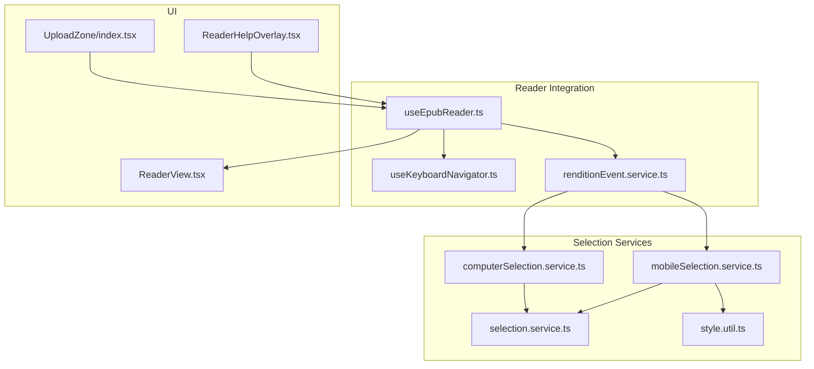
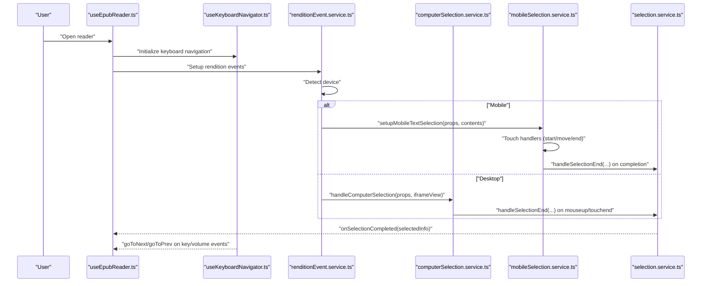
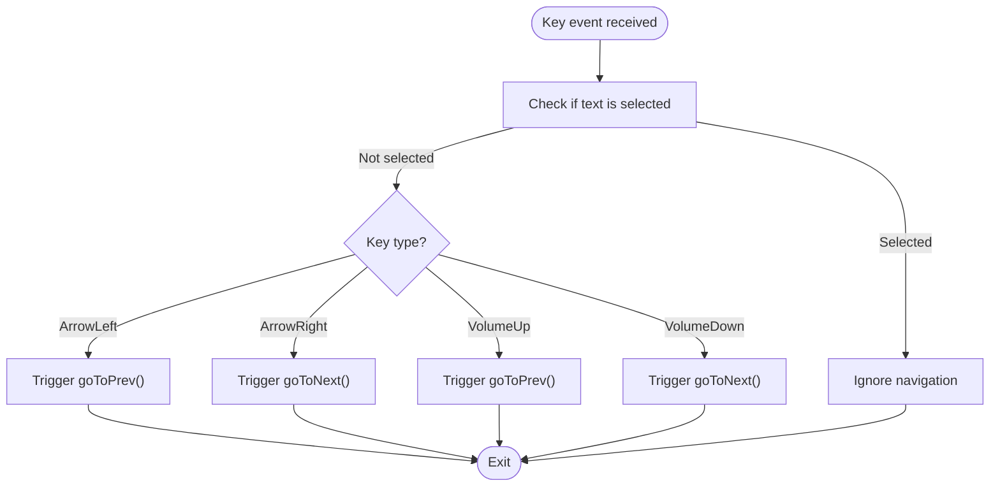
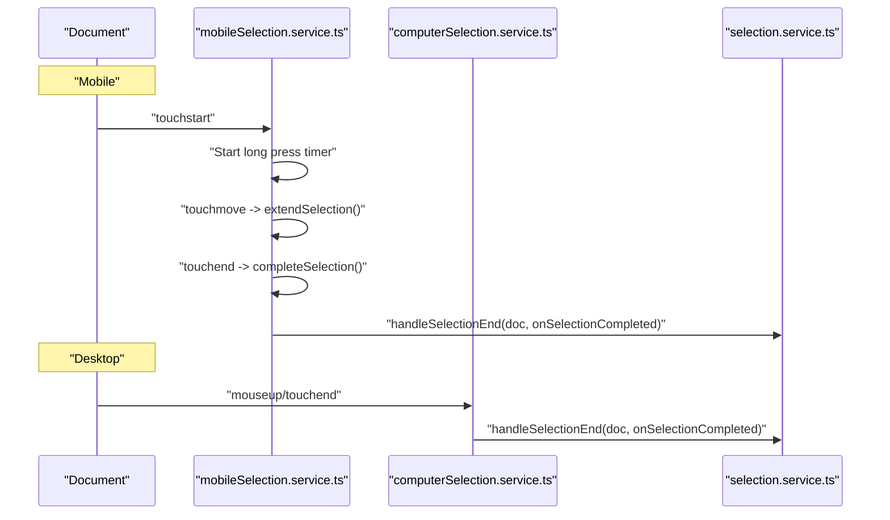
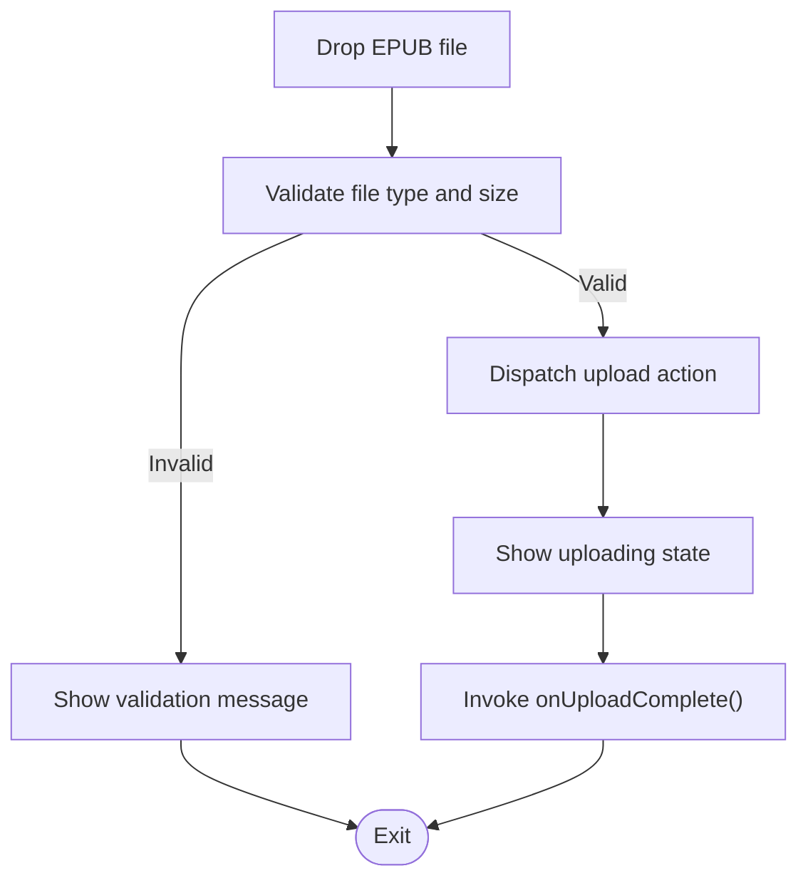
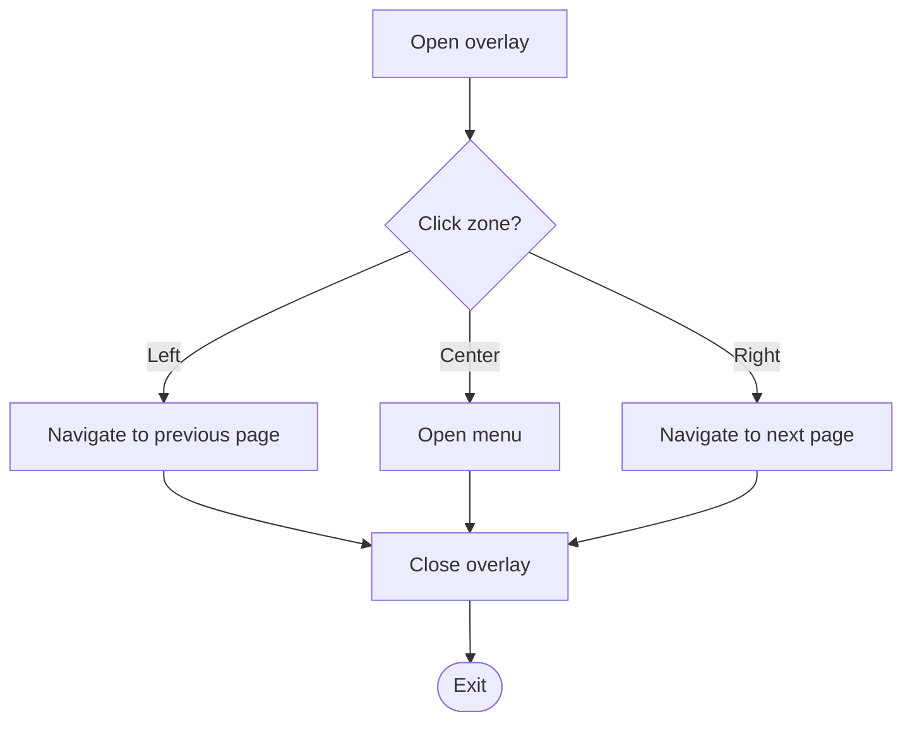
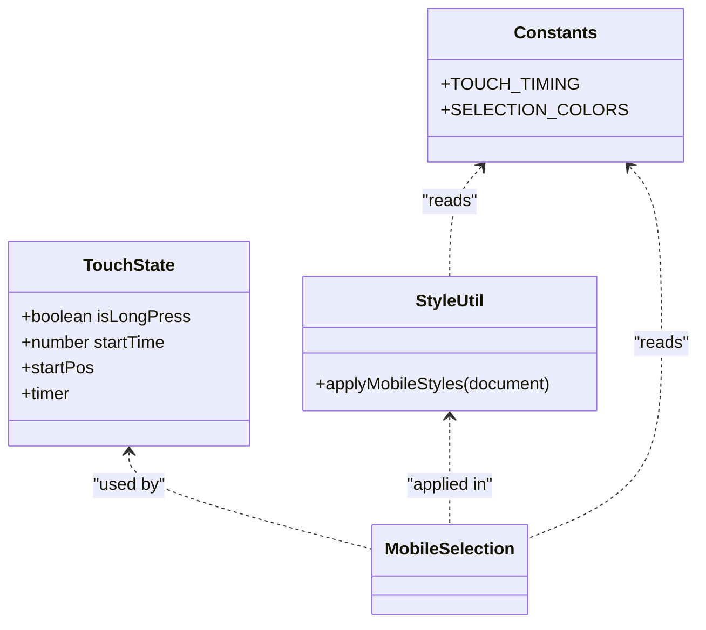
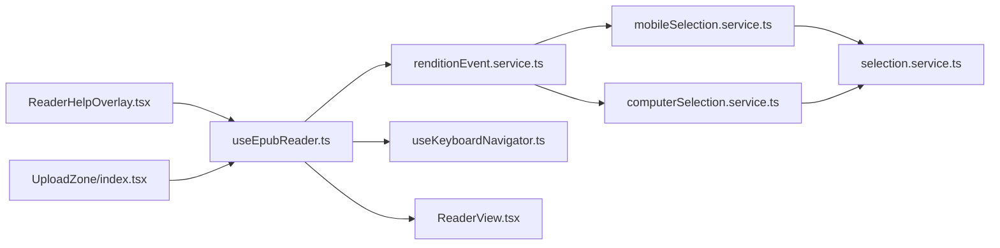

# Advanced Features

<cite>
**Referenced Files in This Document**
- [useKeyboardNavigator.ts](file://src/pages/EpubReader/hooks/useKeyboardNavigator.ts)
- [useEpubReader.ts](file://src/pages/EpubReader/hooks/useEpubReader.ts)
- [renditionEvent.service.ts](file://src/pages/EpubReader/services/renditionEvent.service.ts)
- [computerSelection.service.ts](file://src/pages/EpubReader/services/computerSelection.service.ts)
- [mobileSelection.service.ts](file://src/pages/EpubReader/services/mobileSelection.service.ts)
- [selection.service.ts](file://src/pages/EpubReader/services/selection.service.ts)
- [style.util.ts](file://src/pages/EpubReader/utils/style.util.ts)
- [epub.ts](file://src/constants/epub.ts)
- [epub.types.ts](file://src/types/epub.ts)
- [ReaderHelpOverlay.tsx](file://src/pages/EpubReader/components/ReaderHelpOverlay.tsx)
- [UploadZone/index.tsx](file://src/components/UploadZone/index.tsx)
- [ReaderView.tsx](file://src/pages/EpubReader/components/ReaderView.tsx)
</cite>

## Table of Contents
1. [Introduction](#introduction)
2. [Project Structure](#project-structure)
3. [Core Components](#core-components)
4. [Architecture Overview](#architecture-overview)
5. [Detailed Component Analysis](#detailed-component-analysis)
6. [Dependency Analysis](#dependency-analysis)
7. [Performance Considerations](#performance-considerations)
8. [Troubleshooting Guide](#troubleshooting-guide)
9. [Conclusion](#conclusion)

## Introduction
This section documents the advanced user experience features that enhance reading control, accessibility, and usability in the EPUB reader. It covers:
- Keyboard navigation for efficient reading control
- Text selection handling with separate services for desktop and mobile
- Drag-and-drop interface for intuitive book importing
- Reader help overlay guiding new users through interaction zones
- Mobile optimization including volume button navigation and touch-friendly controls
- Accessibility and usability improvements, performance considerations, and troubleshooting guidance

## Project Structure
The advanced features are implemented across hooks, services, and UI components:
- Keyboard navigation is encapsulated in a reusable hook and wired into the reader lifecycle
- Text selection is handled by device-specific services that integrate with EPUB.js rendition events
- UploadZone provides a unified drag-and-drop and file picker interface
- ReaderHelpOverlay offers contextual guidance for first-time users
- Mobile optimization integrates volume key handling and touch-friendly styles

**Diagram sources**
- [useEpubReader.ts](file://src/pages/EpubReader/hooks/useEpubReader.ts#L177-L180)
- [useKeyboardNavigator.ts](file://src/pages/EpubReader/hooks/useKeyboardNavigator.ts#L13-L48)
- [renditionEvent.service.ts](file://src/pages/EpubReader/services/renditionEvent.service.ts#L29-L59)
- [computerSelection.service.ts](file://src/pages/EpubReader/services/computerSelection.service.ts#L6-L19)
- [mobileSelection.service.ts](file://src/pages/EpubReader/services/mobileSelection.service.ts#L16-L101)
- [selection.service.ts](file://src/pages/EpubReader/services/selection.service.ts#L11-L25)
- [style.util.ts](file://src/pages/EpubReader/utils/style.util.ts#L8-L41)
- [ReaderHelpOverlay.tsx](file://src/pages/EpubReader/components/ReaderHelpOverlay.tsx#L1-L31)
- [UploadZone/index.tsx](file://src/components/UploadZone/index.tsx#L1-L129)
- [ReaderView.tsx](file://src/pages/EpubReader/components/ReaderView.tsx#L1-L51)

**Section sources**
- [useEpubReader.ts](file://src/pages/EpubReader/hooks/useEpubReader.ts#L177-L180)
- [renditionEvent.service.ts](file://src/pages/EpubReader/services/renditionEvent.service.ts#L29-L59)

## Core Components
- Keyboard Navigation: A hook that listens for keyboard and volume key events to navigate pages while avoiding conflicts with text selection.
- Text Selection Services:
  - Desktop: Mouse and touch end events trigger selection completion.
  - Mobile: Long press and drag gestures manage selection with caret positioning and delayed completion.
- UploadZone: A unified drag-and-drop and file picker interface for EPUB import with validation and visual feedback.
- ReaderHelpOverlay: A guided overlay highlighting interaction zones for new users.
- Mobile Optimization: Volume keys for page navigation on mobile devices and touch-friendly styles for selection.

**Section sources**
- [useKeyboardNavigator.ts](file://src/pages/EpubReader/hooks/useKeyboardNavigator.ts#L13-L48)
- [computerSelection.service.ts](file://src/pages/EpubReader/services/computerSelection.service.ts#L6-L19)
- [mobileSelection.service.ts](file://src/pages/EpubReader/services/mobileSelection.service.ts#L16-L101)
- [selection.service.ts](file://src/pages/EpubReader/services/selection.service.ts#L11-L25)
- [style.util.ts](file://src/pages/EpubReader/utils/style.util.ts#L8-L41)
- [UploadZone/index.tsx](file://src/components/UploadZone/index.tsx#L1-L129)
- [ReaderHelpOverlay.tsx](file://src/pages/EpubReader/components/ReaderHelpOverlay.tsx#L1-L31)

## Architecture Overview
The reader lifecycle wires keyboard navigation and selection services into EPUB.js rendition events. Device detection selects the appropriate selection handler, and selection completion triggers callbacks for downstream actions.

**Diagram sources**
- [useEpubReader.ts](file://src/pages/EpubReader/hooks/useEpubReader.ts#L177-L180)
- [useKeyboardNavigator.ts](file://src/pages/EpubReader/hooks/useKeyboardNavigator.ts#L13-L48)
- [renditionEvent.service.ts](file://src/pages/EpubReader/services/renditionEvent.service.ts#L29-L59)
- [computerSelection.service.ts](file://src/pages/EpubReader/services/computerSelection.service.ts#L6-L19)
- [mobileSelection.service.ts](file://src/pages/EpubReader/services/mobileSelection.service.ts#L16-L101)
- [selection.service.ts](file://src/pages/EpubReader/services/selection.service.ts#L11-L25)

## Detailed Component Analysis

### Keyboard Navigation
- Purpose: Provide efficient page navigation via arrow keys and mobile volume keys while preventing conflicts with text selection.
- Behavior:
  - Arrow keys trigger page navigation.
  - On mobile devices, volume up/down keys are captured to navigate backward/forward.
  - Navigation is suppressed when text is actively selected.
- Integration: The hook is initialized in the reader lifecycle and conditionally enables volume key handling based on device detection.

**Diagram sources**
- [useKeyboardNavigator.ts](file://src/pages/EpubReader/hooks/useKeyboardNavigator.ts#L13-L48)
- [useEpubReader.ts](file://src/pages/EpubReader/hooks/useEpubReader.ts#L177-L180)

**Section sources**
- [useKeyboardNavigator.ts](file://src/pages/EpubReader/hooks/useKeyboardNavigator.ts#L13-L48)
- [useEpubReader.ts](file://src/pages/EpubReader/hooks/useEpubReader.ts#L177-L180)

### Text Selection Handling
- Desktop Selection:
  - Listens for mouseup and touchend events to finalize selection.
  - Delegates to a shared selection completion routine.
- Mobile Selection:
  - Implements long press to initiate selection and drag to extend it.
  - Uses caret positioning APIs to create and update selection ranges.
  - Applies mobile styles to enable text selection and adjust touch behavior.
  - Delays completion to ensure selection stability.

**Diagram sources**
- [mobileSelection.service.ts](file://src/pages/EpubReader/services/mobileSelection.service.ts#L16-L101)
- [mobileSelection.service.ts](file://src/pages/EpubReader/services/mobileSelection.service.ts#L110-L171)
- [mobileSelection.service.ts](file://src/pages/EpubReader/services/mobileSelection.service.ts#L172-L183)
- [mobileSelection.service.ts](file://src/pages/EpubReader/services/mobileSelection.service.ts#L194-L231)
- [computerSelection.service.ts](file://src/pages/EpubReader/services/computerSelection.service.ts#L6-L19)
- [selection.service.ts](file://src/pages/EpubReader/services/selection.service.ts#L11-L25)

**Section sources**
- [computerSelection.service.ts](file://src/pages/EpubReader/services/computerSelection.service.ts#L6-L19)
- [mobileSelection.service.ts](file://src/pages/EpubReader/services/mobileSelection.service.ts#L16-L101)
- [mobileSelection.service.ts](file://src/pages/EpubReader/services/mobileSelection.service.ts#L110-L171)
- [mobileSelection.service.ts](file://src/pages/EpubReader/services/mobileSelection.service.ts#L172-L183)
- [mobileSelection.service.ts](file://src/pages/EpubReader/services/mobileSelection.service.ts#L194-L231)
- [selection.service.ts](file://src/pages/EpubReader/services/selection.service.ts#L11-L25)
- [style.util.ts](file://src/pages/EpubReader/utils/style.util.ts#L8-L41)
- [epub.ts](file://src/constants/epub.ts#L8-L13)

### Drag-and-Drop Import Interface (UploadZone)
- Purpose: Provide an intuitive way to import books via drag-and-drop or file picker.
- Features:
  - Visual feedback during drag and upload states
  - Validation for EPUB file types and size limits
  - Centralized upload action dispatched to the store
- UX:
  - Clear instructions and accessible file input
  - Disabled states during upload to prevent concurrent operations

**Diagram sources**
- [UploadZone/index.tsx](file://src/components/UploadZone/index.tsx#L25-L48)
- [UploadZone/index.tsx](file://src/components/UploadZone/index.tsx#L51-L76)
- [UploadZone/index.tsx](file://src/components/UploadZone/index.tsx#L78-L86)

**Section sources**
- [UploadZone/index.tsx](file://src/components/UploadZone/index.tsx#L1-L129)

### Reader Help Overlay
- Purpose: Guide new users through interaction zones (previous page, menu, next page).
- Behavior:
  - Full-screen overlay with three clickable zones
  - Closes on click to continue reading
- UX:
  - Clear labels and hover states for discoverability

**Diagram sources**
- [ReaderHelpOverlay.tsx](file://src/pages/EpubReader/components/ReaderHelpOverlay.tsx#L1-L31)

**Section sources**
- [ReaderHelpOverlay.tsx](file://src/pages/EpubReader/components/ReaderHelpOverlay.tsx#L1-L31)

### Mobile Optimization
- Volume Button Navigation:
  - On mobile devices, volume up/down keys are captured to navigate pages.
  - Prevent default behavior to avoid system volume changes.
- Touch-Friendly Controls:
  - Mobile styles enable text selection and adjust touch behavior.
  - Caret positioning APIs are used for precise selection on touch devices.
- Timing and Thresholds:
  - Long press and tap thresholds are tuned for responsive selection.
  - Selection completion is delayed slightly to stabilize ranges.

**Diagram sources**
- [mobileSelection.service.ts](file://src/pages/EpubReader/services/mobileSelection.service.ts#L16-L101)
- [style.util.ts](file://src/pages/EpubReader/utils/style.util.ts#L8-L41)
- [epub.ts](file://src/constants/epub.ts#L8-L13)

**Section sources**
- [useKeyboardNavigator.ts](file://src/pages/EpubReader/hooks/useKeyboardNavigator.ts#L32-L41)
- [style.util.ts](file://src/pages/EpubReader/utils/style.util.ts#L8-L41)
- [epub.ts](file://src/constants/epub.ts#L8-L13)
- [mobileSelection.service.ts](file://src/pages/EpubReader/services/mobileSelection.service.ts#L16-L101)

## Dependency Analysis
- Device detection determines which selection service to attach to rendition events.
- Both selection services delegate to a shared selection completion routine.
- Keyboard navigation depends on the reader’s navigation functions and device detection.
- UploadZone integrates with the store and validation utilities.

**Diagram sources**
- [renditionEvent.service.ts](file://src/pages/EpubReader/services/renditionEvent.service.ts#L29-L59)
- [computerSelection.service.ts](file://src/pages/EpubReader/services/computerSelection.service.ts#L6-L19)
- [mobileSelection.service.ts](file://src/pages/EpubReader/services/mobileSelection.service.ts#L16-L101)
- [selection.service.ts](file://src/pages/EpubReader/services/selection.service.ts#L11-L25)
- [useEpubReader.ts](file://src/pages/EpubReader/hooks/useEpubReader.ts#L177-L180)
- [useKeyboardNavigator.ts](file://src/pages/EpubReader/hooks/useKeyboardNavigator.ts#L13-L48)
- [ReaderView.tsx](file://src/pages/EpubReader/components/ReaderView.tsx#L1-L51)
- [ReaderHelpOverlay.tsx](file://src/pages/EpubReader/components/ReaderHelpOverlay.tsx#L1-L31)
- [UploadZone/index.tsx](file://src/components/UploadZone/index.tsx#L1-L129)

**Section sources**
- [renditionEvent.service.ts](file://src/pages/EpubReader/services/renditionEvent.service.ts#L29-L59)
- [useEpubReader.ts](file://src/pages/EpubReader/hooks/useEpubReader.ts#L177-L180)

## Performance Considerations
- Event Handling:
  - Attach and detach event listeners carefully to avoid leaks. Mobile selection returns a cleanup function; ensure it is invoked when unmounting or reconfiguring.
  - Debounce selection completion callbacks to reduce downstream processing overhead.
- Memory Usage:
  - Avoid storing large selection contexts unnecessarily; selection service extracts minimal context and cleans up ranges.
  - Reuse references for callbacks and refs to minimize closures and allocations.
- Rendering:
  - Use passive touch events where safe; mobile selection intentionally disables passive to allow prevention of default behavior.
- Accessibility:
  - Ensure keyboard navigation does not interfere with assistive technologies; suppress navigation during text selection to prevent accidental page flips.

[No sources needed since this section provides general guidance]

## Troubleshooting Guide
- Selection Conflicts:
  - Symptom: Navigation triggers while trying to select text.
  - Cause: Keyboard navigation not suppressed when text is selected.
  - Fix: Verify the selection check in the keyboard navigation hook and ensure it runs before navigation.
  - Related code: [useKeyboardNavigator.ts](file://src/pages/EpubReader/hooks/useKeyboardNavigator.ts#L19-L23)
- Mobile Selection Not Working:
  - Symptom: Long press does not initiate selection or selection does not extend.
  - Causes:
    - Missing mobile styles or incorrect caret positioning support.
    - Touch threshold misconfiguration.
  - Fixes:
    - Confirm mobile styles are applied and caret positioning APIs are available.
    - Adjust timing constants if needed.
  - Related code: [mobileSelection.service.ts](file://src/pages/EpubReader/services/mobileSelection.service.ts#L16-L101), [style.util.ts](file://src/pages/EpubReader/utils/style.util.ts#L8-L41), [epub.ts](file://src/constants/epub.ts#L8-L13)
- Desktop Selection Issues:
  - Symptom: Selection completion not triggered on mouseup/touchend.
  - Fix: Ensure rendition click and touchend events are attached and delegated to the selection completion routine.
  - Related code: [computerSelection.service.ts](file://src/pages/EpubReader/services/computerSelection.service.ts#L6-L19)
- Volume Keys Not Navigating:
  - Symptom: Volume buttons do not change pages on mobile.
  - Fix: Confirm device detection enables volume keys and prevent default behavior is applied.
  - Related code: [useEpubReader.ts](file://src/pages/EpubReader/hooks/useEpubReader.ts#L177-L180), [useKeyboardNavigator.ts](file://src/pages/EpubReader/hooks/useKeyboardNavigator.ts#L32-L41)
- Upload Failures:
  - Symptom: Drag-and-drop does not accept EPUB files or upload errors occur.
  - Fix: Validate file type and size; ensure upload action resolves and onUploadComplete is invoked.
  - Related code: [UploadZone/index.tsx](file://src/components/UploadZone/index.tsx#L25-L48), [UploadZone/index.tsx](file://src/components/UploadZone/index.tsx#L51-L76)

**Section sources**
- [useKeyboardNavigator.ts](file://src/pages/EpubReader/hooks/useKeyboardNavigator.ts#L19-L23)
- [mobileSelection.service.ts](file://src/pages/EpubReader/services/mobileSelection.service.ts#L16-L101)
- [style.util.ts](file://src/pages/EpubReader/utils/style.util.ts#L8-L41)
- [epub.ts](file://src/constants/epub.ts#L8-L13)
- [computerSelection.service.ts](file://src/pages/EpubReader/services/computerSelection.service.ts#L6-L19)
- [useEpubReader.ts](file://src/pages/EpubReader/hooks/useEpubReader.ts#L177-L180)
- [UploadZone/index.tsx](file://src/components/UploadZone/index.tsx#L25-L48)

## Conclusion
These advanced features collectively improve accessibility and usability:
- Keyboard navigation and volume key support streamline page control for power users and mobile readers.
- Separate selection services ensure robust text selection across input modalities with mobile-specific long press and caret positioning.
- The UploadZone simplifies book import with clear feedback and validation.
- The ReaderHelpOverlay lowers the learning curve for new users.
- Performance-conscious event handling and debouncing keep the reader responsive.

[No sources needed since this section summarizes without analyzing specific files]