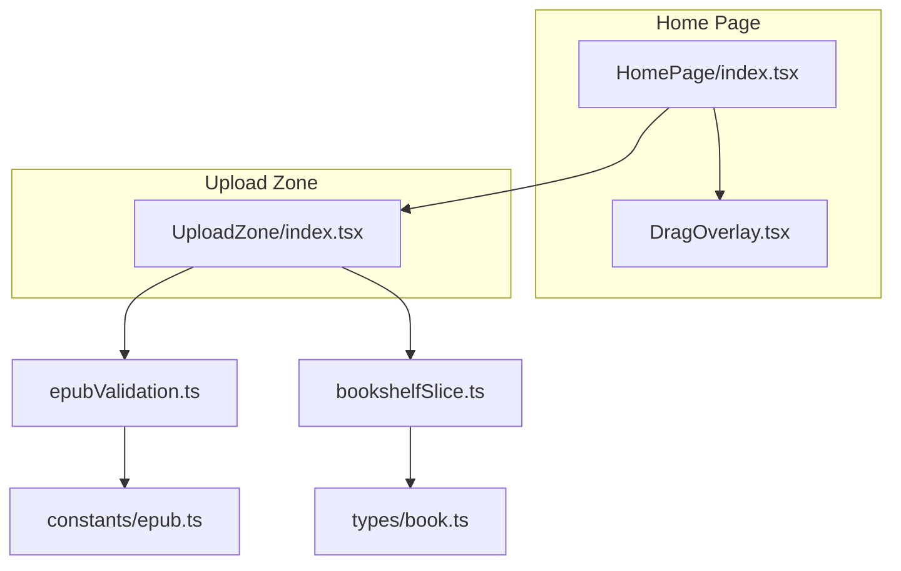
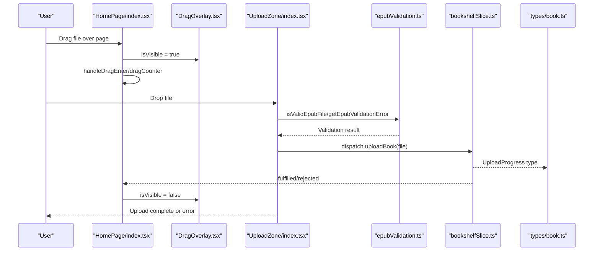
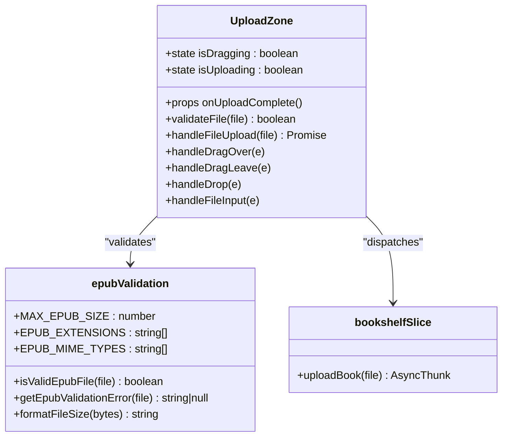
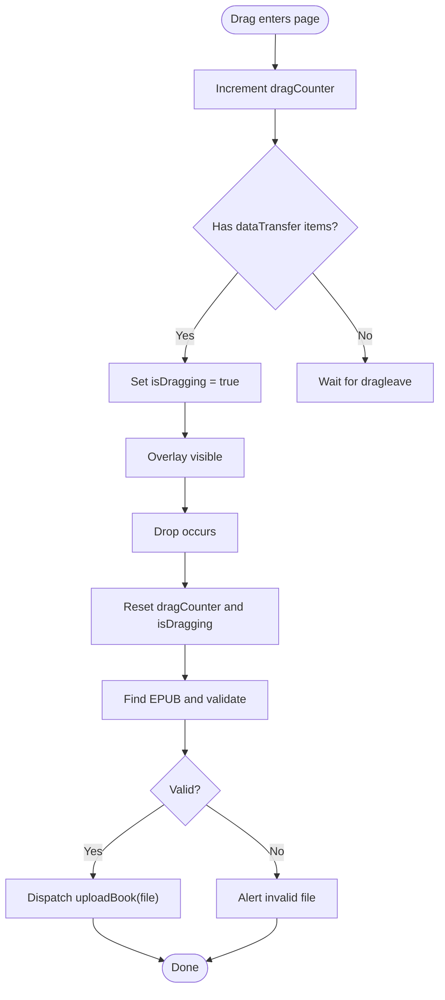
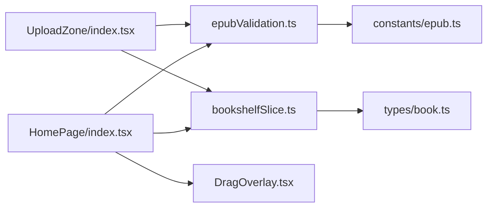

# Drag and Drop Upload

<cite>
**Referenced Files in This Document**
- [UploadZone/index.tsx](file://src/components/UploadZone/index.tsx)
- [HomePage/index.tsx](file://src/pages/HomePage/index.tsx)
- [DragOverlay.tsx](file://src/pages/HomePage/components/DragOverlay.tsx)
- [epubValidation.ts](file://src/utils/epubValidation.ts)
- [epub.ts](file://src/constants/epub.ts)
- [bookshelfSlice.ts](file://src/store/slices/bookshelfSlice.ts)
- [book.ts](file://src/types/book.ts)
</cite>

## Table of Contents
1. [Introduction](#introduction)
2. [Project Structure](#project-structure)
3. [Core Components](#core-components)
4. [Architecture Overview](#architecture-overview)
5. [Detailed Component Analysis](#detailed-component-analysis)
6. [Dependency Analysis](#dependency-analysis)
7. [Performance Considerations](#performance-considerations)
8. [Troubleshooting Guide](#troubleshooting-guide)
9. [Conclusion](#conclusion)

## Introduction
This document explains the drag-and-drop upload feature for importing EPUB books. It focuses on:
- How the UploadZone component handles dragover, dragleave, and drop events to provide visual feedback and process dropped files.
- How state (isDragging, isUploading) manages UI transitions and prevents multiple uploads.
- Integration with epubValidation utilities to verify file type and size before upload.
- The DragOverlay component that displays a full-screen overlay when files are dragged over the home page, including conditional rendering based on visibility.
- The file input fallback mechanism with a hidden input element and label trigger.
- How the onUploadComplete callback notifies parent components.
- Browser-specific drag behavior and troubleshooting guidance for cases where drop events are not triggered.
- Performance considerations around file size validation and user experience during upload.

## Project Structure
The drag-and-drop upload feature spans several files:
- UploadZone: central upload UI with drag-and-drop and fallback file input.
- HomePage: orchestrates page-level drag-and-drop events and renders the overlay.
- DragOverlay: full-screen overlay shown while dragging over the page.
- epubValidation: shared validation utilities for EPUB files.
- constants/epub: EPUB-related constants (extensions, MIME types, max size).
- bookshelfSlice: Redux slice that defines uploadBook async thunk and state updates.

**Diagram sources**
- [HomePage/index.tsx](file://src/pages/HomePage/index.tsx#L154-L171)
- [DragOverlay.tsx](file://src/pages/HomePage/components/DragOverlay.tsx#L1-L25)
- [UploadZone/index.tsx](file://src/components/UploadZone/index.tsx#L1-L129)
- [epubValidation.ts](file://src/utils/epubValidation.ts#L1-L77)
- [epub.ts](file://src/constants/epub.ts#L28-L40)
- [bookshelfSlice.ts](file://src/store/slices/bookshelfSlice.ts#L40-L56)
- [book.ts](file://src/types/book.ts#L80-L106)

**Section sources**
- [HomePage/index.tsx](file://src/pages/HomePage/index.tsx#L154-L171)
- [UploadZone/index.tsx](file://src/components/UploadZone/index.tsx#L1-L129)
- [epubValidation.ts](file://src/utils/epubValidation.ts#L1-L77)
- [epub.ts](file://src/constants/epub.ts#L28-L40)
- [bookshelfSlice.ts](file://src/store/slices/bookshelfSlice.ts#L40-L56)
- [book.ts](file://src/types/book.ts#L80-L106)

## Core Components
- UploadZone: Provides drag-and-drop zone and fallback file input. Manages isDragging and isUploading states, validates EPUB files, and triggers uploadBook via Redux.
- HomePage: Implements page-level drag-and-drop handlers to coordinate overlay visibility and file processing. Integrates with the same validation utilities and Redux upload flow.
- DragOverlay: Full-screen overlay rendered conditionally when isDragging is true on the home page.
- epubValidation: Centralized validation for EPUB files (extension, size, MIME).
- bookshelfSlice: Defines uploadBook async thunk and state updates for upload progress and error handling.

**Section sources**
- [UploadZone/index.tsx](file://src/components/UploadZone/index.tsx#L1-L129)
- [HomePage/index.tsx](file://src/pages/HomePage/index.tsx#L81-L131)
- [DragOverlay.tsx](file://src/pages/HomePage/components/DragOverlay.tsx#L1-L25)
- [epubValidation.ts](file://src/utils/epubValidation.ts#L1-L77)
- [bookshelfSlice.ts](file://src/store/slices/bookshelfSlice.ts#L40-L56)

## Architecture Overview
The drag-and-drop upload pipeline integrates UI, validation, and Redux:

**Diagram sources**
- [HomePage/index.tsx](file://src/pages/HomePage/index.tsx#L81-L131)
- [DragOverlay.tsx](file://src/pages/HomePage/components/DragOverlay.tsx#L1-L25)
- [UploadZone/index.tsx](file://src/components/UploadZone/index.tsx#L25-L48)
- [epubValidation.ts](file://src/utils/epubValidation.ts#L28-L61)
- [bookshelfSlice.ts](file://src/store/slices/bookshelfSlice.ts#L40-L56)
- [book.ts](file://src/types/book.ts#L80-L106)

## Detailed Component Analysis

### UploadZone Component
UploadZone encapsulates the drag-and-drop zone and fallback file input. It:
- Tracks isDragging via onDragOver/onDragLeave and applies visual feedback.
- Tracks isUploading to disable interactions during upload.
- Validates files using epubValidation utilities before dispatching uploadBook.
- Uses a hidden input with a label trigger to support traditional file selection.

Key behaviors:
- Drag events: Prevent default and set isDragging on dragover; reset on dragleave.
- Drop event: Prevent default, reset isDragging, extract files, find an EPUB among them, validate, upload, and call onUploadComplete on success.
- Upload flow: Dispatch uploadBook, handle errors, and toggle isUploading in finally.
- Fallback: Hidden input accepts .epub and application/epub+zip; label triggers click.

State management:
- isDragging: Controls visual feedback and overlay visibility at the page level.
- isUploading: Disables interactions and shows a spinner.

Validation integration:
- isValidEpubFile and getEpubValidationError ensure only valid EPUBs are processed.
- MAX_EPUB_SIZE and formatFileSize are used for display and checks.

onUploadComplete callback:
- Called after successful uploadBook dispatch to notify parent components (e.g., HomePage) to refresh lists or update UI.

**Section sources**
- [UploadZone/index.tsx](file://src/components/UploadZone/index.tsx#L21-L48)
- [UploadZone/index.tsx](file://src/components/UploadZone/index.tsx#L51-L76)
- [UploadZone/index.tsx](file://src/components/UploadZone/index.tsx#L78-L86)
- [UploadZone/index.tsx](file://src/components/UploadZone/index.tsx#L88-L128)
- [epubValidation.ts](file://src/utils/epubValidation.ts#L28-L61)
- [epub.ts](file://src/constants/epub.ts#L31-L39)

#### UploadZone Class Diagram

**Diagram sources**
- [UploadZone/index.tsx](file://src/components/UploadZone/index.tsx#L1-L129)
- [epubValidation.ts](file://src/utils/epubValidation.ts#L1-L77)
- [bookshelfSlice.ts](file://src/store/slices/bookshelfSlice.ts#L40-L56)

### HomePage Integration and DragOverlay
HomePage coordinates page-level drag-and-drop:
- Maintains isDragging and a dragCounter to track nested dragenter/dragleave pairs.
- Implements handleDragEnter/handleDragLeave/handleDragOver/handleDrop to detect EPUB drops anywhere on the page.
- Renders DragOverlay conditionally based on isDragging.

DragOverlay:
- Full-screen overlay with centered prompt to drop an EPUB.
- Visibility controlled by HomePage’s isDragging state.

Fallback mechanism:
- Hidden input with accept=".epub,application/epub+zip".
- Label triggers click to open file dialog.

**Section sources**
- [HomePage/index.tsx](file://src/pages/HomePage/index.tsx#L27-L30)
- [HomePage/index.tsx](file://src/pages/HomePage/index.tsx#L81-L131)
- [HomePage/index.tsx](file://src/pages/HomePage/index.tsx#L154-L171)
- [DragOverlay.tsx](file://src/pages/HomePage/components/DragOverlay.tsx#L1-L25)

#### HomePage Drag-and-Drop Flow

**Diagram sources**
- [HomePage/index.tsx](file://src/pages/HomePage/index.tsx#L81-L131)
- [epubValidation.ts](file://src/utils/epubValidation.ts#L28-L61)
- [bookshelfSlice.ts](file://src/store/slices/bookshelfSlice.ts#L40-L56)

### Validation Utilities
epubValidation provides:
- isValidEpubFile: Checks extension, size, and MIME type.
- getEpubValidationError: Returns a user-friendly error message for invalid files.
- formatFileSize: Converts bytes to human-readable format.
- MAX_EPUB_SIZE and EPUB_EXTENSIONS/EPUB_MIME_TYPES: Shared constants.

These utilities are used by both UploadZone and HomePage to ensure consistent validation.

**Section sources**
- [epubValidation.ts](file://src/utils/epubValidation.ts#L28-L61)
- [epub.ts](file://src/constants/epub.ts#L31-L39)

### Redux Upload Flow
bookshelfSlice defines uploadBook as an async thunk:
- Validates file in the thunk (extension, size).
- Calls OPFSManager.uploadBook to persist the file.
- Updates state on pending/fulfilled/rejected.

UploadProgress type:
- Describes progress, status, and error for upload feedback.

**Section sources**
- [bookshelfSlice.ts](file://src/store/slices/bookshelfSlice.ts#L40-L56)
- [book.ts](file://src/types/book.ts#L80-L106)

## Dependency Analysis
- UploadZone depends on epubValidation for file checks and on bookshelfSlice for dispatching uploads.
- HomePage depends on epubValidation and bookshelfSlice, and composes DragOverlay.
- epubValidation depends on constants/epub for EPUB-related constants.
- bookshelfSlice depends on types/book for UploadProgress and BookMetadata.

**Diagram sources**
- [UploadZone/index.tsx](file://src/components/UploadZone/index.tsx#L1-L129)
- [HomePage/index.tsx](file://src/pages/HomePage/index.tsx#L154-L171)
- [DragOverlay.tsx](file://src/pages/HomePage/components/DragOverlay.tsx#L1-L25)
- [epubValidation.ts](file://src/utils/epubValidation.ts#L1-L77)
- [epub.ts](file://src/constants/epub.ts#L28-L40)
- [bookshelfSlice.ts](file://src/store/slices/bookshelfSlice.ts#L40-L56)
- [book.ts](file://src/types/book.ts#L80-L106)

**Section sources**
- [UploadZone/index.tsx](file://src/components/UploadZone/index.tsx#L1-L129)
- [HomePage/index.tsx](file://src/pages/HomePage/index.tsx#L154-L171)
- [epubValidation.ts](file://src/utils/epubValidation.ts#L1-L77)
- [epub.ts](file://src/constants/epub.ts#L28-L40)
- [bookshelfSlice.ts](file://src/store/slices/bookshelfSlice.ts#L40-L56)
- [book.ts](file://src/types/book.ts#L80-L106)

## Performance Considerations
- File size validation: Both UploadZone and HomePage use getEpubValidationError to short-circuit early for invalid sizes, preventing unnecessary dispatches and network overhead.
- UI responsiveness: isUploading disables interactions and shows a spinner, improving perceived performance and preventing duplicate uploads.
- Overlay rendering: Conditional rendering of DragOverlay avoids unnecessary DOM nodes when not dragging.
- MIME and extension checks: isValidEpubFile reduces false positives and avoids expensive server-side failures.

[No sources needed since this section provides general guidance]

## Troubleshooting Guide
Common issues and resolutions:
- Drop events not firing:
  - Ensure onDragOver prevents default and stops propagation to avoid browser default behavior.
  - Verify dragCounter logic resets to zero on drop to avoid stale isDragging state.
  - Confirm that the overlay is visible only when isDragging is true.
- Invalid file types:
  - Use getEpubValidationError to surface clear messages (only EPUB supported, file size exceeded).
- Empty files:
  - Validation catches zero-size files and alerts the user.
- Multiple uploads:
  - isUploading prevents simultaneous uploads and disables the input and zone interactions.
- Browser-specific behavior:
  - Some browsers require explicit dataTransfer items presence checks in dragenter/dragleave.
  - Ensure accept attributes on input match EPUB MIME types and extensions.

**Section sources**
- [HomePage/index.tsx](file://src/pages/HomePage/index.tsx#L81-L131)
- [UploadZone/index.tsx](file://src/components/UploadZone/index.tsx#L51-L76)
- [epubValidation.ts](file://src/utils/epubValidation.ts#L43-L61)

## Conclusion
The drag-and-drop upload feature combines a robust validation layer, clear UI feedback, and a resilient Redux upload flow. UploadZone and HomePage coordinate to provide a smooth user experience, while epubValidation ensures consistent checks across the app. The overlay and state management keep the interface responsive and informative during uploads.

[No sources needed since this section summarizes without analyzing specific files]