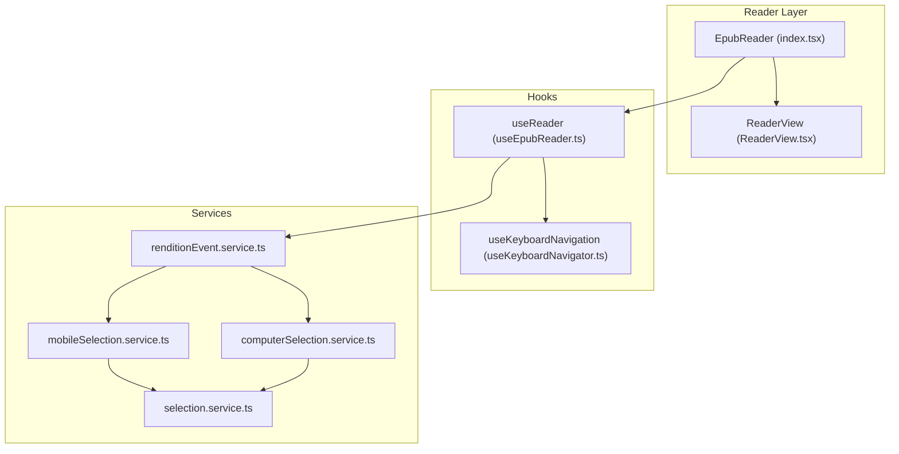
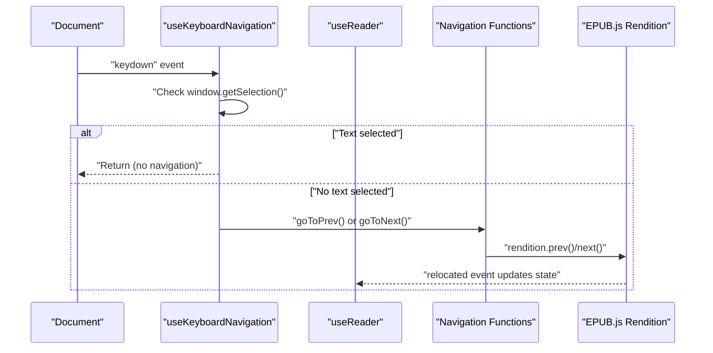
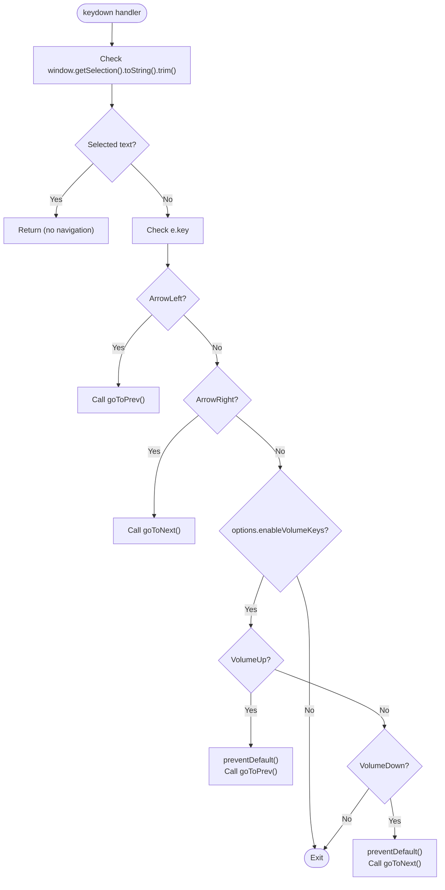
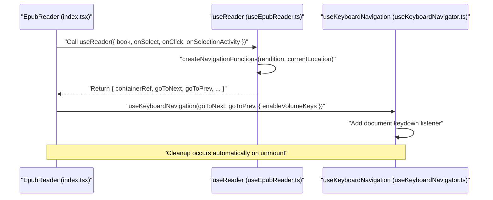
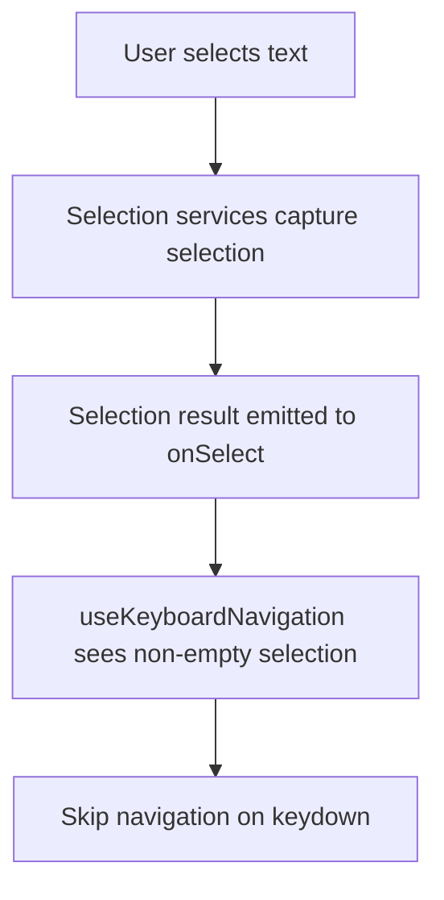
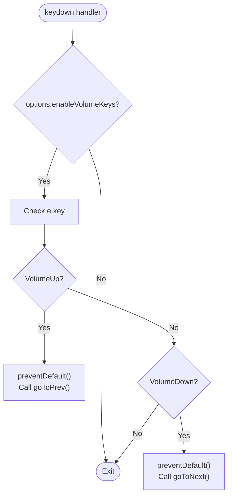
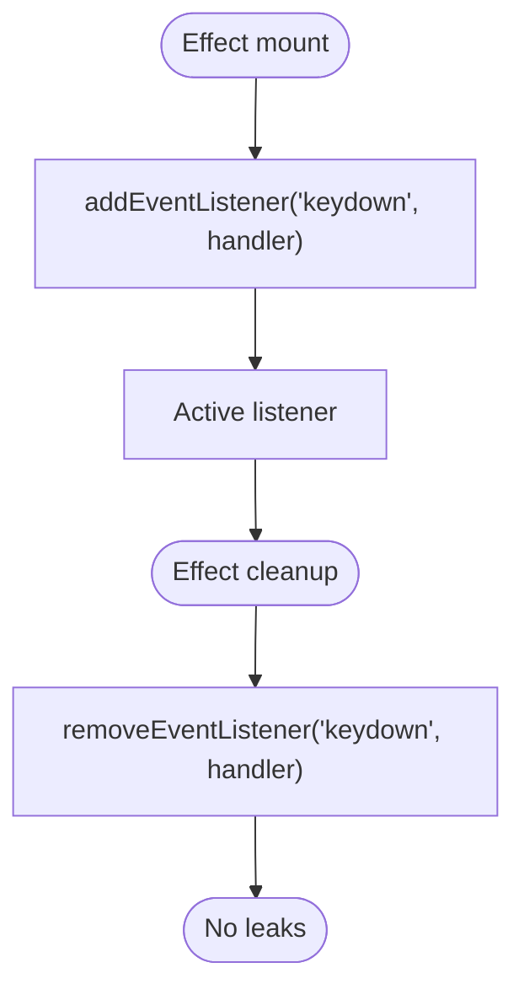
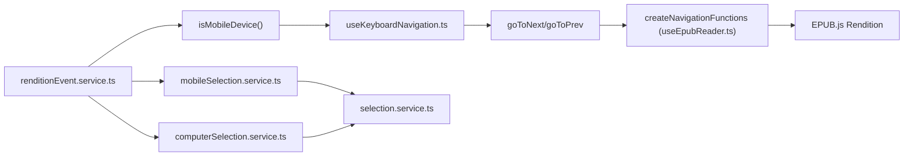

# Keyboard Navigation

<cite>
**Referenced Files in This Document**
- [useKeyboardNavigator.ts](file://src/pages/EpubReader/hooks/useKeyboardNavigator.ts)
- [useEpubReader.ts](file://src/pages/EpubReader/hooks/useEpubReader.ts)
- [renditionEvent.service.ts](file://src/pages/EpubReader/services/renditionEvent.service.ts)
- [mobileSelection.service.ts](file://src/pages/EpubReader/services/mobileSelection.service.ts)
- [computerSelection.service.ts](file://src/pages/EpubReader/services/computerSelection.service.ts)
- [selection.service.ts](file://src/pages/EpubReader/services/selection.service.ts)
- [index.tsx](file://src/pages/EpubReader/index.tsx)
- [ReaderView.tsx](file://src/pages/EpubReader/components/ReaderView.tsx)
</cite>

## Table of Contents
1. [Introduction](#introduction)
2. [Project Structure](#project-structure)
3. [Core Components](#core-components)
4. [Architecture Overview](#architecture-overview)
5. [Detailed Component Analysis](#detailed-component-analysis)
6. [Dependency Analysis](#dependency-analysis)
7. [Performance Considerations](#performance-considerations)
8. [Troubleshooting Guide](#troubleshooting-guide)
9. [Conclusion](#conclusion)

## Introduction
This document explains the keyboard navigation system implemented in the EPUB reader. It focuses on how the useKeyboardNavigator hook attaches keydown event listeners, manages navigation state, and integrates with the reader’s page navigation functions. It covers:
- Standard arrow keys for page navigation
- Special handling of mobile volume keys when enabled
- Prevention of navigation during text selection
- Cleanup of event listeners on unmount
- How goToNext and goToPrev are passed from the reader component
- Common issues and troubleshooting guidance
- Performance considerations for event listener efficiency and dependency arrays

## Project Structure
The keyboard navigation feature is implemented as a reusable React hook and wired into the reader via a higher-level hook that creates navigation functions backed by EPUB.js.

**Diagram sources**
- [index.tsx](file://src/pages/EpubReader/index.tsx#L212-L231)
- [ReaderView.tsx](file://src/pages/EpubReader/components/ReaderView.tsx#L16-L49)
- [useEpubReader.ts](file://src/pages/EpubReader/hooks/useEpubReader.ts#L68-L90)
- [useKeyboardNavigator.ts](file://src/pages/EpubReader/hooks/useKeyboardNavigator.ts#L13-L46)
- [renditionEvent.service.ts](file://src/pages/EpubReader/services/renditionEvent.service.ts#L21-L59)
- [mobileSelection.service.ts](file://src/pages/EpubReader/services/mobileSelection.service.ts#L16-L101)
- [computerSelection.service.ts](file://src/pages/EpubReader/services/computerSelection.service.ts#L6-L19)
- [selection.service.ts](file://src/pages/EpubReader/services/selection.service.ts#L11-L25)

**Section sources**
- [index.tsx](file://src/pages/EpubReader/index.tsx#L212-L231)
- [ReaderView.tsx](file://src/pages/EpubReader/components/ReaderView.tsx#L16-L49)
- [useEpubReader.ts](file://src/pages/EpubReader/hooks/useEpubReader.ts#L68-L90)
- [useKeyboardNavigator.ts](file://src/pages/EpubReader/hooks/useKeyboardNavigator.ts#L13-L46)
- [renditionEvent.service.ts](file://src/pages/EpubReader/services/renditionEvent.service.ts#L21-L59)

## Core Components
- useKeyboardNavigation: Attaches a document-level keydown listener, checks for text selection, and invokes goToNext/goToPrev based on key presses. It conditionally enables mobile volume keys and cleans up listeners on unmount.
- useReader: Creates navigation functions (goToNext, goToPrev) backed by EPUB.js rendition and passes them to useKeyboardNavigation along with device detection for enabling volume keys.
- renditionEvent.service: Detects mobile devices and wires up selection handling for mobile vs. desktop.
- selection services: Provide selection extraction and context building logic used by the reader’s selection pipeline.

**Section sources**
- [useKeyboardNavigator.ts](file://src/pages/EpubReader/hooks/useKeyboardNavigator.ts#L13-L46)
- [useEpubReader.ts](file://src/pages/EpubReader/hooks/useEpubReader.ts#L68-L90)
- [renditionEvent.service.ts](file://src/pages/EpubReader/services/renditionEvent.service.ts#L21-L59)

## Architecture Overview
The keyboard navigation system is layered:
- The reader component exposes goToNext and goToPrev via useReader.
- useKeyboardNavigation subscribes to document keydown events and delegates to these functions.
- Text selection is handled by separate services; useKeyboardNavigation intentionally avoids triggering navigation when text is selected.

**Diagram sources**
- [useKeyboardNavigator.ts](file://src/pages/EpubReader/hooks/useKeyboardNavigator.ts#L18-L46)
- [useEpubReader.ts](file://src/pages/EpubReader/hooks/useEpubReader.ts#L68-L90)
- [renditionEvent.service.ts](file://src/pages/EpubReader/services/renditionEvent.service.ts#L31-L40)

## Detailed Component Analysis

### useKeyboardNavigation Hook
Responsibilities:
- Attach a document-level keydown listener inside a React effect.
- Prevent navigation when text is selected using window.getSelection().
- Route ArrowLeft to goToPrev and ArrowRight to goToNext.
- Optionally enable mobile volume keys (VolumeUp/VolumeDown) when enabled via options, calling goToPrev/GoToNext and attempting to suppress system volume changes via preventDefault.
- Clean up the listener on unmount to avoid memory leaks.

Key behaviors:
- Input handling: If window.getSelection() returns a non-empty string after trimming, navigation is skipped.
- Core processing: Arrow keys trigger goToPrev/goToNext; optional volume keys trigger goToPrev/goToNext with preventDefault.
- Cleanup: Removes the keydown listener in the effect’s return function.
- Dependencies: The effect depends on goToNext, goToPrev, and options.enableVolumeKeys.

**Diagram sources**
- [useKeyboardNavigator.ts](file://src/pages/EpubReader/hooks/useKeyboardNavigator.ts#L18-L46)

**Section sources**
- [useKeyboardNavigator.ts](file://src/pages/EpubReader/hooks/useKeyboardNavigator.ts#L13-L46)

### Passing goToNext and goToPrev from the Reader Component
- useReader creates navigation functions (goToNext, goToPrev) bound to EPUB.js rendition and stores them in state.
- useReader passes these functions to useKeyboardNavigation along with options.enableVolumeKeys derived from device detection.
- The reader component receives containerRef and navigation functions from useReader and renders the EPUB into the container.

**Diagram sources**
- [index.tsx](file://src/pages/EpubReader/index.tsx#L212-L231)
- [useEpubReader.ts](file://src/pages/EpubReader/hooks/useEpubReader.ts#L68-L90)
- [useKeyboardNavigator.ts](file://src/pages/EpubReader/hooks/useKeyboardNavigator.ts#L18-L46)

**Section sources**
- [index.tsx](file://src/pages/EpubReader/index.tsx#L212-L231)
- [useEpubReader.ts](file://src/pages/EpubReader/hooks/useEpubReader.ts#L68-L90)
- [useKeyboardNavigator.ts](file://src/pages/EpubReader/hooks/useKeyboardNavigator.ts#L18-L46)

### Text Selection Prevention Logic
- useKeyboardNavigation checks window.getSelection().toString().trim() to detect active selections and skips navigation when text is selected.
- The selection services set up selection handling for both mobile and desktop environments. While these services primarily emit selection results, they establish the context in which text selection can occur.

**Diagram sources**
- [useKeyboardNavigator.ts](file://src/pages/EpubReader/hooks/useKeyboardNavigator.ts#L20-L23)
- [mobileSelection.service.ts](file://src/pages/EpubReader/services/mobileSelection.service.ts#L16-L101)
- [computerSelection.service.ts](file://src/pages/EpubReader/services/computerSelection.service.ts#L6-L19)
- [selection.service.ts](file://src/pages/EpubReader/services/selection.service.ts#L11-L25)

**Section sources**
- [useKeyboardNavigator.ts](file://src/pages/EpubReader/hooks/useKeyboardNavigator.ts#L20-L23)
- [mobileSelection.service.ts](file://src/pages/EpubReader/services/mobileSelection.service.ts#L16-L101)
- [computerSelection.service.ts](file://src/pages/EpubReader/services/computerSelection.service.ts#L6-L19)
- [selection.service.ts](file://src/pages/EpubReader/services/selection.service.ts#L11-L25)

### Mobile Volume Keys Handling
- When options.enableVolumeKeys is true (detected via isMobileDevice), VolumeUp triggers goToPrev and VolumeDown triggers goToNext.
- preventDefault is attempted to suppress system volume changes.

**Diagram sources**
- [useKeyboardNavigator.ts](file://src/pages/EpubReader/hooks/useKeyboardNavigator.ts#L32-L41)
- [renditionEvent.service.ts](file://src/pages/EpubReader/services/renditionEvent.service.ts#L22-L24)

**Section sources**
- [useKeyboardNavigator.ts](file://src/pages/EpubReader/hooks/useKeyboardNavigator.ts#L32-L41)
- [renditionEvent.service.ts](file://src/pages/EpubReader/services/renditionEvent.service.ts#L22-L24)

### Cleanup Mechanism on Unmount
- The effect adds a listener on mount and returns a cleanup function that removes the listener on unmount, preventing memory leaks.

**Diagram sources**
- [useKeyboardNavigator.ts](file://src/pages/EpubReader/hooks/useKeyboardNavigator.ts#L43-L46)

**Section sources**
- [useKeyboardNavigator.ts](file://src/pages/EpubReader/hooks/useKeyboardNavigator.ts#L43-L46)

## Dependency Analysis
- useKeyboardNavigation depends on:
  - goToNext/goToPrev callbacks passed from useReader
  - options.enableVolumeKeys derived from device detection
- useReader depends on:
  - EPUB.js rendition to create navigation functions
  - Device detection to decide whether to enable volume keys
- Text selection services depend on:
  - EPUB.js contents/document/window to manipulate selections
  - selection.service to finalize and extract selection context

**Diagram sources**
- [useKeyboardNavigator.ts](file://src/pages/EpubReader/hooks/useKeyboardNavigator.ts#L13-L46)
- [useEpubReader.ts](file://src/pages/EpubReader/hooks/useEpubReader.ts#L68-L90)
- [renditionEvent.service.ts](file://src/pages/EpubReader/services/renditionEvent.service.ts#L21-L59)
- [mobileSelection.service.ts](file://src/pages/EpubReader/services/mobileSelection.service.ts#L16-L101)
- [computerSelection.service.ts](file://src/pages/EpubReader/services/computerSelection.service.ts#L6-L19)
- [selection.service.ts](file://src/pages/EpubReader/services/selection.service.ts#L11-L25)

**Section sources**
- [useKeyboardNavigator.ts](file://src/pages/EpubReader/hooks/useKeyboardNavigator.ts#L13-L46)
- [useEpubReader.ts](file://src/pages/EpubReader/hooks/useEpubReader.ts#L68-L90)
- [renditionEvent.service.ts](file://src/pages/EpubReader/services/renditionEvent.service.ts#L21-L59)

## Performance Considerations
- Event Listener Efficiency:
  - The hook installs a single document-level keydown listener and performs lightweight checks (selection presence and key comparison) inside the handler. This minimizes overhead.
- Dependency Array Optimization:
  - The effect depends on goToNext, goToPrev, and options.enableVolumeKeys. Keeping this minimal reduces unnecessary re-subscriptions.
  - If goToNext/goToPrev are stable references (memoized), the effect will not re-run on typical re-renders.
- Device Detection:
  - isMobileDevice is called once when passing options to useKeyboardNavigation. If device characteristics change during runtime, consider re-evaluating this flag or adding a mechanism to refresh options.

[No sources needed since this section provides general guidance]

## Troubleshooting Guide
Common issues and resolutions:
- Keyboard events not captured:
  - Ensure the document has focus. Some browsers require the page to be focused for keydown events to fire.
  - Verify that the component is mounted and the effect has executed. Confirm that the document-level listener is attached.
  - Check for conflicting listeners elsewhere that might consume or stop propagation before reaching the hook.
- Navigation triggers during text selection:
  - Confirm that window.getSelection().toString().trim() is non-empty when selection occurs. The hook intentionally skips navigation when text is selected.
  - If navigation still triggers unexpectedly, inspect selection services to ensure they are correctly setting selection state.
- Mobile volume keys not working:
  - Ensure options.enableVolumeKeys is true on mobile devices. The hook only handles VolumeUp/VolumeDown when enabled.
  - preventDefault may not always suppress system volume changes depending on browser/device policy. The hook attempts suppression but cannot guarantee it.
- Event propagation conflicts:
  - If other components stop propagation, keydown may not reach the hook. Ensure no ancestor component stops propagation on keydown.
  - The reader’s own keydown handler (outside the hook) demonstrates how to intercept media keys; if you rely on that handler, ensure it does not interfere with the hook’s behavior.

**Section sources**
- [useKeyboardNavigator.ts](file://src/pages/EpubReader/hooks/useKeyboardNavigator.ts#L20-L23)
- [useKeyboardNavigator.ts](file://src/pages/EpubReader/hooks/useKeyboardNavigator.ts#L32-L41)
- [index.tsx](file://src/pages/EpubReader/index.tsx#L324-L344)

## Conclusion
The keyboard navigation system cleanly separates concerns:
- useKeyboardNavigation encapsulates event handling and selection-aware routing.
- useReader centralizes navigation creation and passes stable callbacks to the hook.
- Device-specific behavior (volume keys) is gated behind a simple option.
- Cleanup is automatic, and the dependency array keeps subscriptions efficient.

This design ensures reliable, predictable keyboard-driven navigation across platforms while avoiding conflicts with text selection and other input mechanisms.