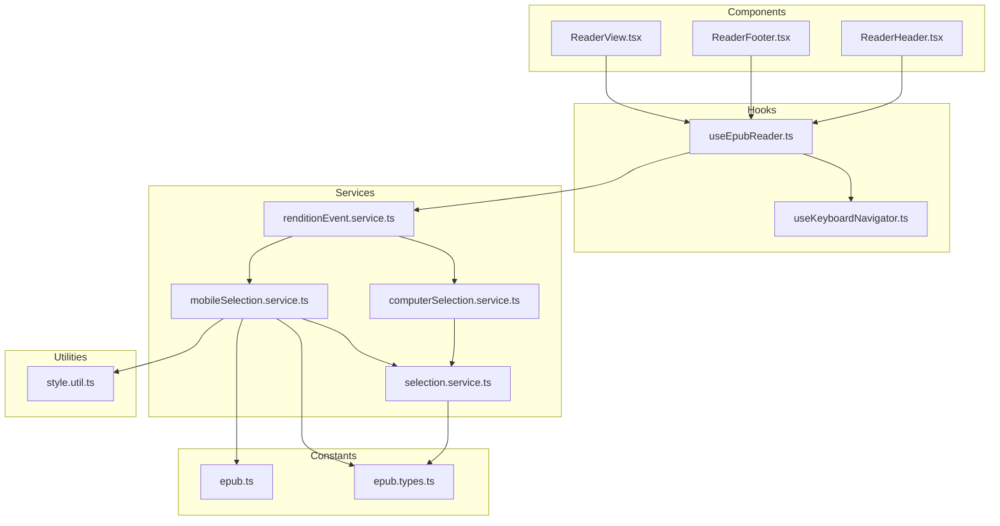
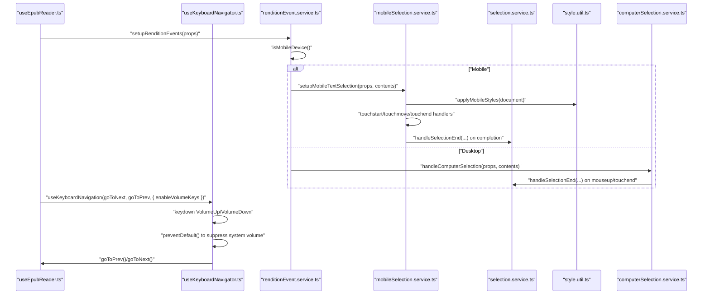
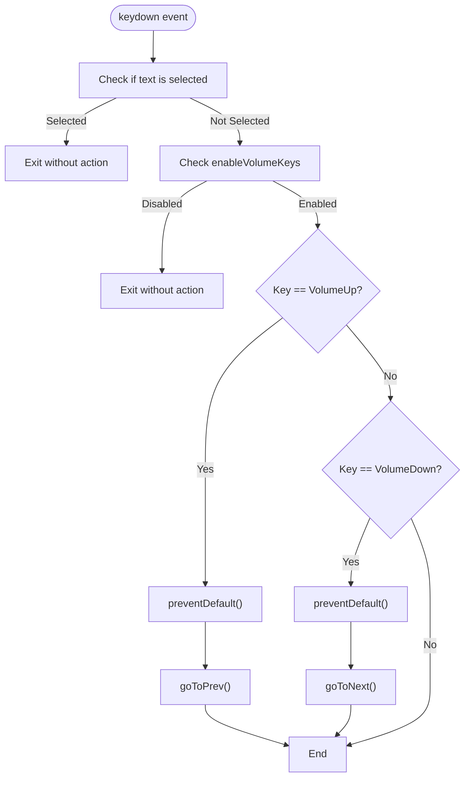
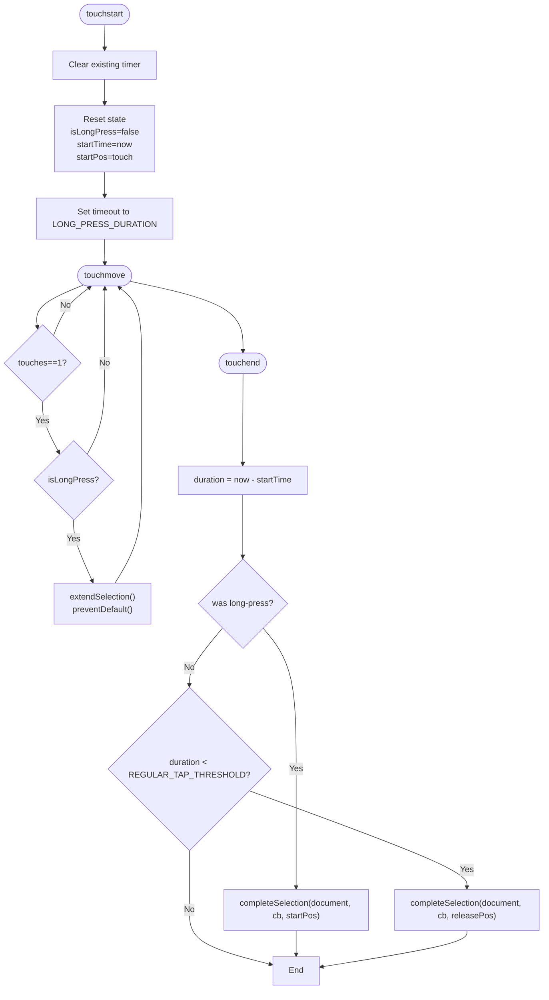
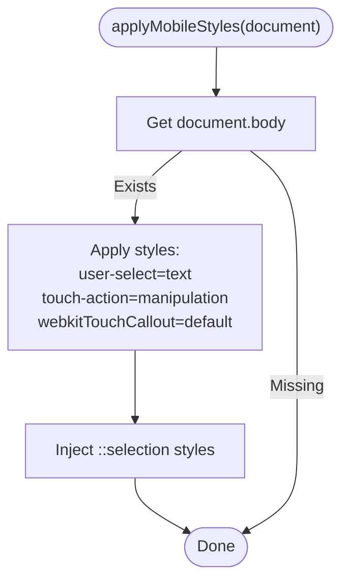
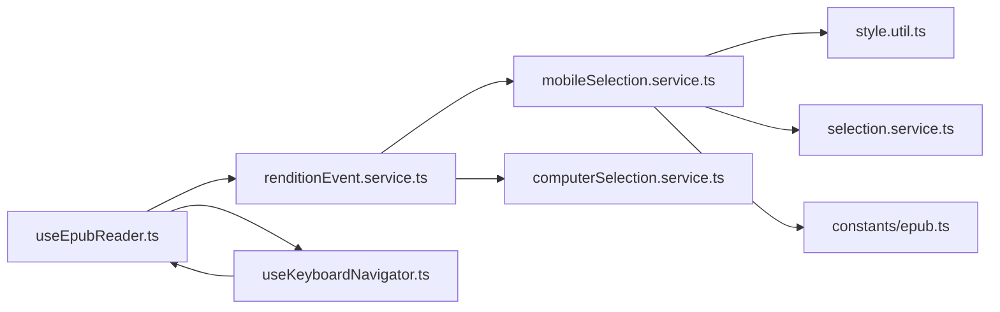

# Mobile Optimization

<cite>
**Referenced Files in This Document**
- [useKeyboardNavigator.ts](file://src/pages/EpubReader/hooks/useKeyboardNavigator.ts)
- [useEpubReader.ts](file://src/pages/EpubReader/hooks/useEpubReader.ts)
- [renditionEvent.service.ts](file://src/pages/EpubReader/services/renditionEvent.service.ts)
- [mobileSelection.service.ts](file://src/pages/EpubReader/services/mobileSelection.service.ts)
- [computerSelection.service.ts](file://src/pages/EpubReader/services/computerSelection.service.ts)
- [selection.service.ts](file://src/pages/EpubReader/services/selection.service.ts)
- [style.util.ts](file://src/pages/EpubReader/utils/style.util.ts)
- [epub.ts](file://src/constants/epub.ts)
- [epub.types.ts](file://src/types/epub.ts)
- [ReaderView.tsx](file://src/pages/EpubReader/components/ReaderView.tsx)
- [ReaderFooter.tsx](file://src/pages/EpubReader/components/ReaderFooter.tsx)
- [ReaderHeader.tsx](file://src/pages/EpubReader/components/ReaderHeader.tsx)
</cite>

## Table of Contents
1. [Introduction](#introduction)
2. [Project Structure](#project-structure)
3. [Core Components](#core-components)
4. [Architecture Overview](#architecture-overview)
5. [Detailed Component Analysis](#detailed-component-analysis)
6. [Dependency Analysis](#dependency-analysis)
7. [Performance Considerations](#performance-considerations)
8. [Troubleshooting Guide](#troubleshooting-guide)
9. [Conclusion](#conclusion)

## Introduction
This document focuses on mobile-specific optimizations for the EPUB reader, covering:
- Volume button navigation via the enableVolumeKeys option in useKeyboardNavigator.ts
- Mobile text selection with long-press detection and configurable timing thresholds
- applyMobileStyles utility for touch-friendly UI adjustments
- Responsive design considerations for touch targets
- Practical examples of how these features enhance the mobile reading experience
- Troubleshooting guidance for platform differences and performance concerns

## Project Structure
The mobile optimization features are implemented across several modules:
- Keyboard navigation hook integrates volume key handling for mobile devices
- Rendition event setup selects between mobile and computer selection flows
- Mobile selection service implements long-press detection and touch handling
- Selection service extracts and contextualizes selected text
- Style utility applies mobile-friendly CSS for selection and interaction
- Constants define configurable timing thresholds for touch interactions

**Diagram sources**
- [useKeyboardNavigator.ts](file://src/pages/EpubReader/hooks/useKeyboardNavigator.ts#L1-L48)
- [useEpubReader.ts](file://src/pages/EpubReader/hooks/useEpubReader.ts#L1-L201)
- [renditionEvent.service.ts](file://src/pages/EpubReader/services/renditionEvent.service.ts#L1-L60)
- [mobileSelection.service.ts](file://src/pages/EpubReader/services/mobileSelection.service.ts#L1-L231)
- [computerSelection.service.ts](file://src/pages/EpubReader/services/computerSelection.service.ts#L1-L20)
- [selection.service.ts](file://src/pages/EpubReader/services/selection.service.ts#L1-L169)
- [style.util.ts](file://src/pages/EpubReader/utils/style.util.ts#L1-L41)
- [epub.ts](file://src/constants/epub.ts#L1-L61)
- [epub.types.ts](file://src/types/epub.ts#L112-L135)
- [ReaderView.tsx](file://src/pages/EpubReader/components/ReaderView.tsx#L1-L51)
- [ReaderFooter.tsx](file://src/pages/EpubReader/components/ReaderFooter.tsx#L1-L66)
- [ReaderHeader.tsx](file://src/pages/EpubReader/components/ReaderHeader.tsx#L1-L86)

**Section sources**
- [useKeyboardNavigator.ts](file://src/pages/EpubReader/hooks/useKeyboardNavigator.ts#L1-L48)
- [useEpubReader.ts](file://src/pages/EpubReader/hooks/useEpubReader.ts#L1-L201)
- [renditionEvent.service.ts](file://src/pages/EpubReader/services/renditionEvent.service.ts#L1-L60)
- [mobileSelection.service.ts](file://src/pages/EpubReader/services/mobileSelection.service.ts#L1-L231)
- [computerSelection.service.ts](file://src/pages/EpubReader/services/computerSelection.service.ts#L1-L20)
- [selection.service.ts](file://src/pages/EpubReader/services/selection.service.ts#L1-L169)
- [style.util.ts](file://src/pages/EpubReader/utils/style.util.ts#L1-L41)
- [epub.ts](file://src/constants/epub.ts#L1-L61)
- [epub.types.ts](file://src/types/epub.ts#L112-L135)
- [ReaderView.tsx](file://src/pages/EpubReader/components/ReaderView.tsx#L1-L51)
- [ReaderFooter.tsx](file://src/pages/EpubReader/components/ReaderFooter.tsx#L1-L66)
- [ReaderHeader.tsx](file://src/pages/EpubReader/components/ReaderHeader.tsx#L1-L86)

## Core Components
- Volume button navigation: The keyboard navigation hook listens for keydown events and, when enabled, intercepts VolumeUp and VolumeDown keys to trigger page navigation while attempting to suppress the default system volume change behavior.
- Mobile selection system: A dedicated mobile selection service sets up touchstart/touchmove/touchend handlers with a long-press timer and tap threshold to initiate and extend selections, applying mobile styles for better touch interaction.
- applyMobileStyles: Utility that enables text selection, disables unwanted callouts, and configures touch-action and highlight behavior for mobile.
- Responsive design: Reader components use Tailwind classes to ensure appropriate spacing and visibility of interactive elements; the selection overlay is pointer-events-none to allow touch interactions beneath it.

**Section sources**
- [useKeyboardNavigator.ts](file://src/pages/EpubReader/hooks/useKeyboardNavigator.ts#L1-L48)
- [mobileSelection.service.ts](file://src/pages/EpubReader/services/mobileSelection.service.ts#L1-L231)
- [style.util.ts](file://src/pages/EpubReader/utils/style.util.ts#L1-L41)
- [ReaderFooter.tsx](file://src/pages/EpubReader/components/ReaderFooter.tsx#L1-L66)
- [ReaderHeader.tsx](file://src/pages/EpubReader/components/ReaderHeader.tsx#L1-L86)

## Architecture Overview
The mobile optimization pipeline connects the reader hook, rendition event setup, and selection services:

**Diagram sources**
- [useEpubReader.ts](file://src/pages/EpubReader/hooks/useEpubReader.ts#L150-L181)
- [renditionEvent.service.ts](file://src/pages/EpubReader/services/renditionEvent.service.ts#L29-L59)
- [mobileSelection.service.ts](file://src/pages/EpubReader/services/mobileSelection.service.ts#L16-L101)
- [selection.service.ts](file://src/pages/EpubReader/services/selection.service.ts#L1-L169)
- [style.util.ts](file://src/pages/EpubReader/utils/style.util.ts#L1-L41)
- [computerSelection.service.ts](file://src/pages/EpubReader/services/computerSelection.service.ts#L1-L20)
- [useKeyboardNavigator.ts](file://src/pages/EpubReader/hooks/useKeyboardNavigator.ts#L13-L47)

## Detailed Component Analysis

### Volume Button Navigation (enableVolumeKeys)
- Purpose: Repurpose hardware volume keys for page navigation on mobile devices while suppressing the default system volume change.
- Implementation highlights:
  - The keyboard navigation hook accepts an options object with enableVolumeKeys.
  - On keydown, it checks for VolumeUp and VolumeDown keys and calls preventDefault to suppress system volume changes.
  - It invokes goToPrev or goToNext accordingly.
  - The reader hook conditionally enables this behavior based on device detection.

**Diagram sources**
- [useKeyboardNavigator.ts](file://src/pages/EpubReader/hooks/useKeyboardNavigator.ts#L13-L47)
- [useEpubReader.ts](file://src/pages/EpubReader/hooks/useEpubReader.ts#L177-L181)

**Section sources**
- [useKeyboardNavigator.ts](file://src/pages/EpubReader/hooks/useKeyboardNavigator.ts#L1-L48)
- [useEpubReader.ts](file://src/pages/EpubReader/hooks/useEpubReader.ts#L177-L181)

### Mobile Text Selection with Long-Press Detection
- Purpose: Provide reliable text selection on touch devices using long-press and tap gestures with configurable thresholds.
- Implementation highlights:
  - Touch state tracks long-press status, start time, and start position.
  - Long-press timer triggers selection initiation after a configurable duration.
  - During touchmove, only single-touch selections are processed; preventDefault is used to avoid unintended scrolling.
  - Selection completion occurs on touchend for long-press or quick taps below a threshold.
  - A delayed completion callback ensures selection stability and avoids premature callbacks.

**Diagram sources**
- [mobileSelection.service.ts](file://src/pages/EpubReader/services/mobileSelection.service.ts#L16-L101)
- [mobileSelection.service.ts](file://src/pages/EpubReader/services/mobileSelection.service.ts#L103-L183)
- [mobileSelection.service.ts](file://src/pages/EpubReader/services/mobileSelection.service.ts#L185-L231)
- [epub.ts](file://src/constants/epub.ts#L8-L13)

**Section sources**
- [mobileSelection.service.ts](file://src/pages/EpubReader/services/mobileSelection.service.ts#L1-L231)
- [epub.ts](file://src/constants/epub.ts#L8-L13)
- [epub.types.ts](file://src/types/epub.ts#L112-L121)

### applyMobileStyles Utility
- Purpose: Apply mobile-friendly styles to enable text selection and optimize touch interactions.
- Implementation highlights:
  - Enables text selection on the body and child elements.
  - Disables unwanted touch callouts and sets touch-action to manipulation.
  - Adds selection highlight colors via injected styles.

**Diagram sources**
- [style.util.ts](file://src/pages/EpubReader/utils/style.util.ts#L1-L41)

**Section sources**
- [style.util.ts](file://src/pages/EpubReader/utils/style.util.ts#L1-L41)

### Responsive Design Considerations
- ReaderView uses a full-width, full-height container for the EPUB content and an overlay with pointer-events-none to allow touch interactions beneath it.
- ReaderFooter and ReaderHeader use Tailwind utilities to position navigation controls and progress indicators, ensuring they remain accessible on small screens.
- The selection overlay remains transparent and non-blocking to preserve touch interactions.

**Section sources**
- [ReaderView.tsx](file://src/pages/EpubReader/components/ReaderView.tsx#L1-L51)
- [ReaderFooter.tsx](file://src/pages/EpubReader/components/ReaderFooter.tsx#L1-L66)
- [ReaderHeader.tsx](file://src/pages/EpubReader/components/ReaderHeader.tsx#L1-L86)

## Dependency Analysis
- Device detection drives the selection flow: renditionEvent.service determines whether to set up mobile or computer selection.
- Mobile selection depends on:
  - applyMobileStyles for enabling selection and touch-action
  - TOUCH_TIMING constants for long-press and tap thresholds
  - selection.service for extracting and contextualizing selections
- Keyboard navigation depends on:
  - useEpubReader to pass goToNext/goToPrev
  - isMobileDevice to conditionally enable volume keys

**Diagram sources**
- [renditionEvent.service.ts](file://src/pages/EpubReader/services/renditionEvent.service.ts#L29-L59)
- [mobileSelection.service.ts](file://src/pages/EpubReader/services/mobileSelection.service.ts#L1-L231)
- [computerSelection.service.ts](file://src/pages/EpubReader/services/computerSelection.service.ts#L1-L20)
- [style.util.ts](file://src/pages/EpubReader/utils/style.util.ts#L1-L41)
- [selection.service.ts](file://src/pages/EpubReader/services/selection.service.ts#L1-L169)
- [epub.ts](file://src/constants/epub.ts#L1-L61)
- [useEpubReader.ts](file://src/pages/EpubReader/hooks/useEpubReader.ts#L150-L181)
- [useKeyboardNavigator.ts](file://src/pages/EpubReader/hooks/useKeyboardNavigator.ts#L13-L47)

**Section sources**
- [renditionEvent.service.ts](file://src/pages/EpubReader/services/renditionEvent.service.ts#L1-L60)
- [mobileSelection.service.ts](file://src/pages/EpubReader/services/mobileSelection.service.ts#L1-L231)
- [computerSelection.service.ts](file://src/pages/EpubReader/services/computerSelection.service.ts#L1-L20)
- [selection.service.ts](file://src/pages/EpubReader/services/selection.service.ts#L1-L169)
- [epub.ts](file://src/constants/epub.ts#L1-L61)
- [useEpubReader.ts](file://src/pages/EpubReader/hooks/useEpubReader.ts#L150-L181)
- [useKeyboardNavigator.ts](file://src/pages/EpubReader/hooks/useKeyboardNavigator.ts#L13-L47)

## Performance Considerations
- Touch event handling frequency:
  - Mobile selection uses a single active timer and minimal state updates. Touchmove triggers selection extension only when isLongPress is true, reducing unnecessary work.
  - The selection extension relies on caret position APIs and range creation; avoid excessive reflows by batching DOM operations.
- Memory usage on resource-constrained devices:
  - Timers are cleared on touchend and cleanup; ensure timers are not leaked by verifying cleanup paths.
  - Debounce selection completion callbacks to reduce repeated processing when users rapidly move their fingers.
- Rendering and layout:
  - Keep selection overlays lightweight; avoid heavy CSS animations during touch interactions.
  - Prefer pointer-events-none on overlays to minimize event overhead.

[No sources needed since this section provides general guidance]

## Troubleshooting Guide
- Browser permission requirements for intercepting volume keys:
  - Some browsers require explicit user activation (e.g., a gesture) before allowing keydown interception for media keys. Trigger the reader interaction on a user-initiated event (e.g., tapping the screen or opening the reader) to increase compatibility.
  - If VolumeUp/VolumeDown are not recognized, verify the device is mobile and enableVolumeKeys is true in the keyboard navigation hook.
- Inconsistent touch event behavior across platforms:
  - iOS Safari may differ from Android Chrome in touch handling and caret positioning. Validate caretPositionFromPoint availability and gracefully handle null results.
  - Ensure preventDefault is used during selection extension to avoid unintended scrolling.
- Selection quality and stability:
  - If selections snap to unexpected boundaries, adjust word boundary extraction logic and consider increasing the selection delay slightly if needed.
  - For collapsed selections far from text, the selection service validates proximity; ensure click positions are passed correctly for tap selections.
- Responsive layout issues:
  - Verify ReaderView’s overlay maintains pointer-events-none to allow touch interactions beneath it.
  - Confirm ReaderFooter and ReaderHeader remain visible and accessible on small screens.

**Section sources**
- [useKeyboardNavigator.ts](file://src/pages/EpubReader/hooks/useKeyboardNavigator.ts#L13-L47)
- [useEpubReader.ts](file://src/pages/EpubReader/hooks/useEpubReader.ts#L177-L181)
- [mobileSelection.service.ts](file://src/pages/EpubReader/services/mobileSelection.service.ts#L16-L101)
- [selection.service.ts](file://src/pages/EpubReader/services/selection.service.ts#L1-L169)
- [ReaderView.tsx](file://src/pages/EpubReader/components/ReaderView.tsx#L1-L51)

## Conclusion
The mobile optimization features deliver a cohesive reading experience on touch devices:
- Volume button navigation replaces system volume changes with page turning for seamless control.
- Long-press and tap detection provide robust text selection with configurable thresholds.
- applyMobileStyles ensures text selection and touch-friendly interactions.
- Responsive components keep navigation controls accessible and usable.
These features collectively improve usability on mobile devices without physical keyboards, while offering practical troubleshooting guidance for platform-specific quirks and performance considerations.