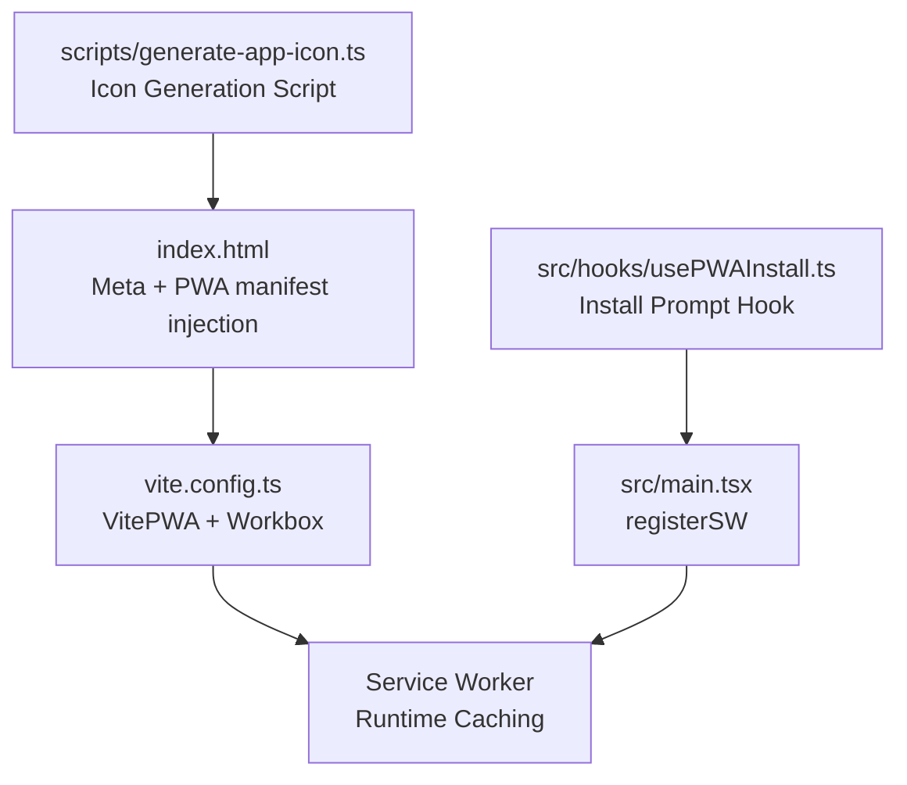
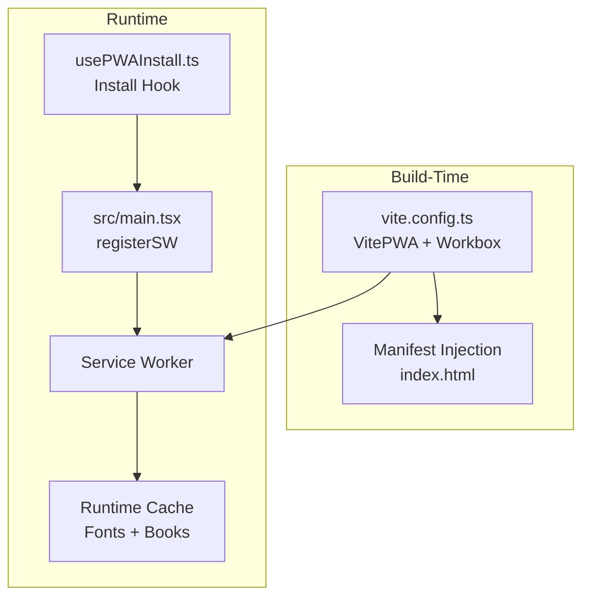
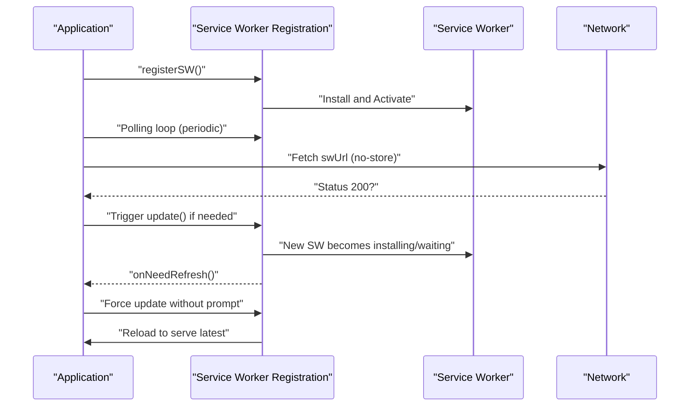
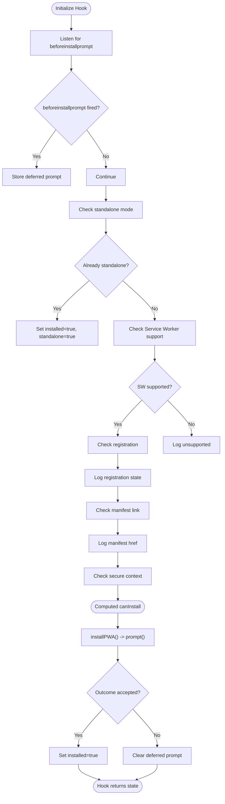
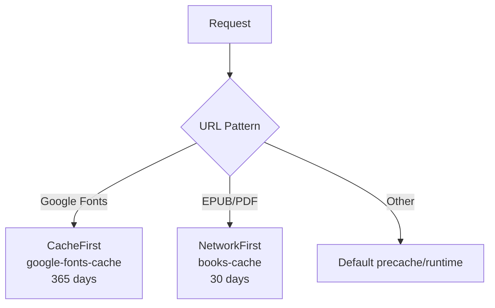
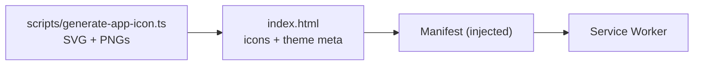
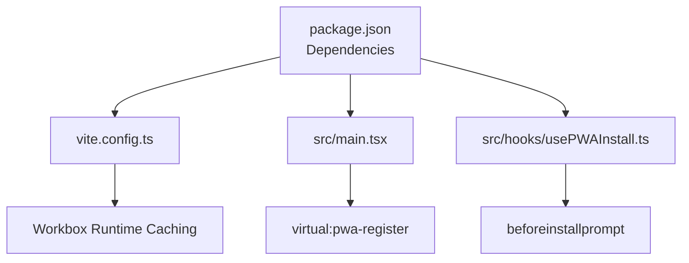

# Pwa Enhancements

<cite>
**Referenced Files in This Document**
- [index.html](file://index.html)
- [package.json](file://package.json)
- [vite.config.ts](file://vite.config.ts)
- [src/main.tsx](file://src/main.tsx)
- [src/hooks/usePWAInstall.ts](file://src/hooks/usePWAInstall.ts)
- [PWA_UPDATE_SPEC.md](file://PWA_UPDATE_SPEC.md)
- [scripts/generate-app-icon.ts](file://scripts/generate-app-icon.ts)
</cite>

## Table of Contents
1. [Introduction](#introduction)
2. [Project Structure](#project-structure)
3. [Core Components](#core-components)
4. [Architecture Overview](#architecture-overview)
5. [Detailed Component Analysis](#detailed-component-analysis)
6. [Dependency Analysis](#dependency-analysis)
7. [Performance Considerations](#performance-considerations)
8. [Troubleshooting Guide](#troubleshooting-guide)
9. [Conclusion](#conclusion)

## Introduction
This document describes the PWA enhancements implemented in the project, focusing on automatic updates, installation prompts, offline readiness, and iconography. It synthesizes the current configuration and code, highlights areas for improvement aligned with the PWA automatic update specification, and provides actionable guidance for maintaining a robust offline-first reading experience.

## Project Structure
The PWA-related assets and configuration are centralized:
- HTML meta and manifest injection are handled by the Vite PWA plugin.
- Service worker and runtime caching are configured in Vite.
- The application registers the service worker in the main entry point.
- A dedicated hook manages install prompts and compatibility checks.
- An icon generation script produces PWA icons and favicons.

**Diagram sources**
- [index.html](file://index.html#L1-L30)
- [vite.config.ts](file://vite.config.ts#L1-L112)
- [src/main.tsx](file://src/main.tsx#L1-L31)
- [src/hooks/usePWAInstall.ts](file://src/hooks/usePWAInstall.ts#L1-L119)
- [scripts/generate-app-icon.ts](file://scripts/generate-app-icon.ts#L1-L215)

**Section sources**
- [index.html](file://index.html#L1-L30)
- [vite.config.ts](file://vite.config.ts#L1-L112)
- [src/main.tsx](file://src/main.tsx#L1-L31)
- [src/hooks/usePWAInstall.ts](file://src/hooks/usePWAInstall.ts#L1-L119)
- [scripts/generate-app-icon.ts](file://scripts/generate-app-icon.ts#L1-L215)

## Core Components
- Service Worker and Runtime Caching: Configured via Vite PWA to cache fonts and EPUB/PDF assets with appropriate expiration and handlers.
- Update Mechanism: The main entry registers the service worker and currently prompts users to refresh; the PWA automatic update specification proposes removing the prompt and adding periodic checks.
- Install Prompt Hook: Provides install-state detection, compatibility checks, and a controlled prompt flow.
- Icons and Manifest: Icons are generated by a script and referenced in HTML; the manifest is injected by the Vite PWA plugin.

**Section sources**
- [vite.config.ts](file://vite.config.ts#L1-L112)
- [src/main.tsx](file://src/main.tsx#L1-L31)
- [src/hooks/usePWAInstall.ts](file://src/hooks/usePWAInstall.ts#L1-L119)
- [scripts/generate-app-icon.ts](file://scripts/generate-app-icon.ts#L1-L215)
- [index.html](file://index.html#L1-L30)

## Architecture Overview
The PWA architecture integrates build-time caching, runtime update checks, and install prompts.

**Diagram sources**
- [vite.config.ts](file://vite.config.ts#L1-L112)
- [index.html](file://index.html#L1-L30)
- [src/main.tsx](file://src/main.tsx#L1-L31)
- [src/hooks/usePWAInstall.ts](file://src/hooks/usePWAInstall.ts#L1-L119)

## Detailed Component Analysis

### Automatic Updates Enhancement
The current implementation registers the service worker and shows a confirmation dialog when an update is available. The PWA automatic update specification recommends:
- Removing the confirmation dialog.
- Adding periodic polling to check for updates.
- Reloading automatically when a new service worker is ready.

**Diagram sources**
- [src/main.tsx](file://src/main.tsx#L1-L31)
- [PWA_UPDATE_SPEC.md](file://PWA_UPDATE_SPEC.md#L1-L77)

**Section sources**
- [src/main.tsx](file://src/main.tsx#L1-L31)
- [PWA_UPDATE_SPEC.md](file://PWA_UPDATE_SPEC.md#L1-L77)

### Install Prompt and Compatibility Checks
The install hook listens for the beforeinstallprompt event, tracks installation state, and performs compatibility checks (standalone mode, service worker presence, manifest availability, secure context). It exposes a controlled install function.

**Diagram sources**
- [src/hooks/usePWAInstall.ts](file://src/hooks/usePWAInstall.ts#L1-L119)

**Section sources**
- [src/hooks/usePWAInstall.ts](file://src/hooks/usePWAInstall.ts#L1-L119)

### Offline Caching Strategy
The Vite PWA configuration defines runtime caching policies:
- Fonts from Google APIs use a cache-first strategy with long-lived expiration.
- EPUB/PDF assets use a network-first strategy with a monthly expiration and a moderate entry limit.

**Diagram sources**
- [vite.config.ts](file://vite.config.ts#L1-L112)

**Section sources**
- [vite.config.ts](file://vite.config.ts#L1-L112)

### Iconography and Manifest
The HTML references favicon and Apple touch icons. The Vite PWA plugin injects the manifest. The icon generation script creates a source SVG, favicon, and placeholder PNGs for various sizes.

**Diagram sources**
- [index.html](file://index.html#L1-L30)
- [scripts/generate-app-icon.ts](file://scripts/generate-app-icon.ts#L1-L215)
- [vite.config.ts](file://vite.config.ts#L58-L88)

**Section sources**
- [index.html](file://index.html#L1-L30)
- [scripts/generate-app-icon.ts](file://scripts/generate-app-icon.ts#L1-L215)
- [vite.config.ts](file://vite.config.ts#L58-L88)

## Dependency Analysis
- Build-time dependencies: Vite, @vitejs/plugin-react, vite-plugin-pwa, workbox-window.
- Runtime dependencies: react, react-dom, react-router-dom, redux, epubjs, i18next stack.
- PWA-specific runtime: virtual:pwa-register for service worker registration.

**Diagram sources**
- [package.json](file://package.json#L1-L68)
- [vite.config.ts](file://vite.config.ts#L1-L112)
- [src/main.tsx](file://src/main.tsx#L1-L31)
- [src/hooks/usePWAInstall.ts](file://src/hooks/usePWAInstall.ts#L1-L119)

**Section sources**
- [package.json](file://package.json#L1-L68)
- [vite.config.ts](file://vite.config.ts#L1-L112)
- [src/main.tsx](file://src/main.tsx#L1-L31)
- [src/hooks/usePWAInstall.ts](file://src/hooks/usePWAInstall.ts#L1-L119)

## Performance Considerations
- Font caching: Long expiration reduces network requests for fonts; ensure cache limits are appropriate for the site’s font variants.
- EPUB/PDF caching: Network-first improves freshness for large content; consider cache limits to avoid excessive storage usage.
- Update polling: Periodic checks should be throttled and respect online/offline status to minimize unnecessary network traffic.
- Icons: Prefer SVG favicons and modern PNG sizes; placeholders in the generator script should be replaced with real conversions for production.

[No sources needed since this section provides general guidance]

## Troubleshooting Guide
- Service worker not updating:
  - Verify the register type and update mechanism align with the automatic update specification.
  - Ensure the polling loop is active and respects offline conditions.
- Install prompt not appearing:
  - Confirm beforeinstallprompt fires and the hook stores the deferred prompt.
  - Check standalone mode detection and secure context requirements.
- Manifest or icons missing:
  - Confirm the manifest is injected by the Vite PWA plugin and icons are placed under the expected public path.
  - Re-run the icon generation script and replace placeholder PNGs with actual assets.

**Section sources**
- [src/main.tsx](file://src/main.tsx#L1-L31)
- [src/hooks/usePWAInstall.ts](file://src/hooks/usePWAInstall.ts#L1-L119)
- [scripts/generate-app-icon.ts](file://scripts/generate-app-icon.ts#L1-L215)
- [vite.config.ts](file://vite.config.ts#L1-L112)

## Conclusion
The project’s PWA foundation is solid, with build-time caching and runtime registration. To achieve truly seamless, automatic updates without user prompts and to improve installation reliability, follow the PWA automatic update specification by removing the confirmation dialog, adding periodic update checks, and refining the install hook’s compatibility checks. These changes will deliver a consistent, offline-ready reading experience.