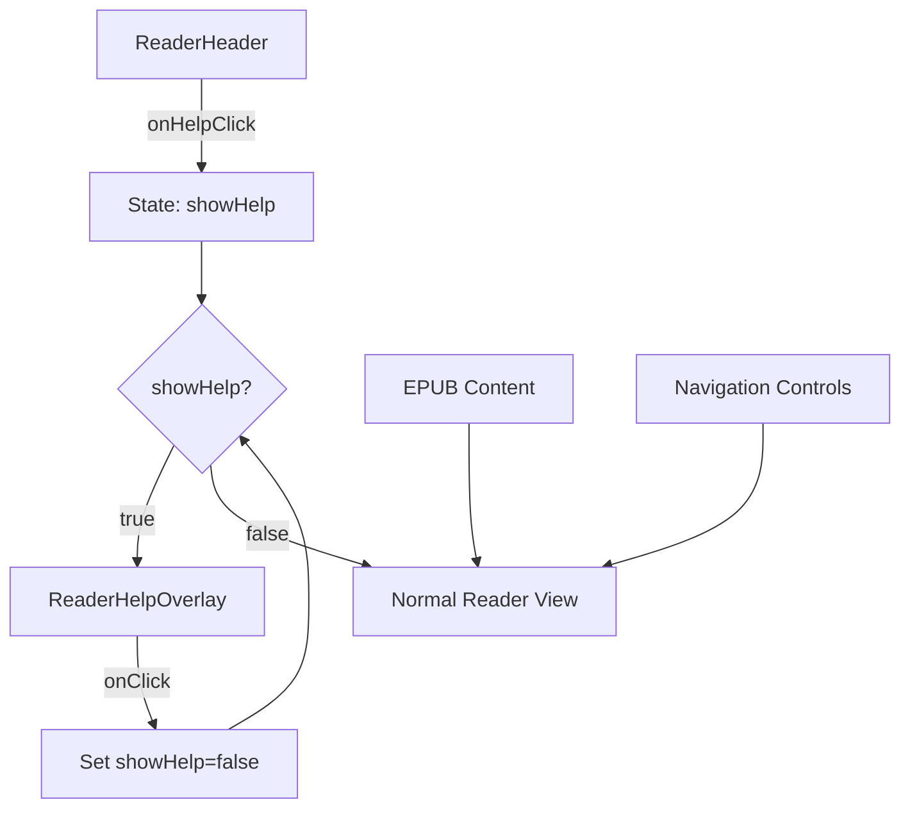
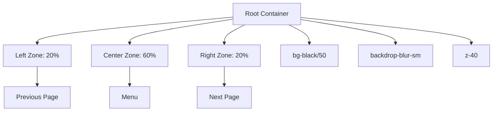
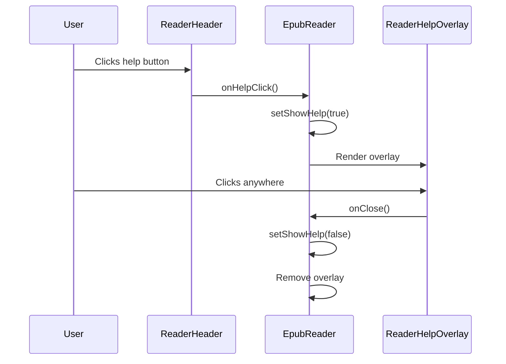
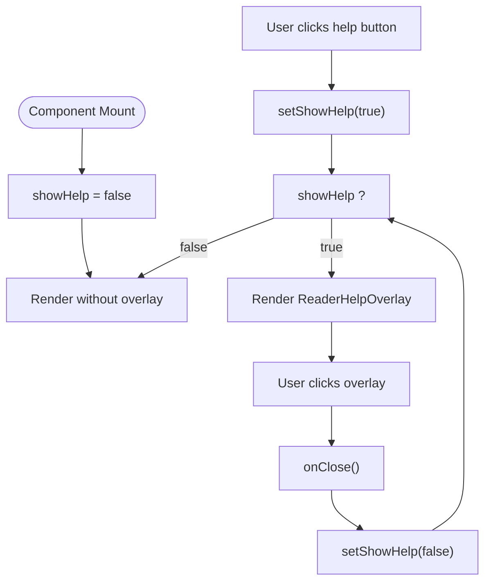
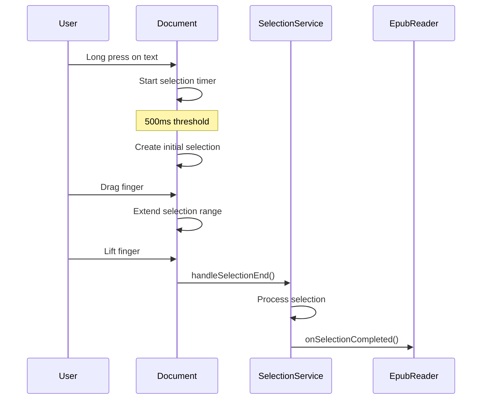
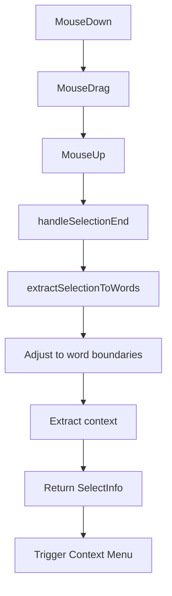
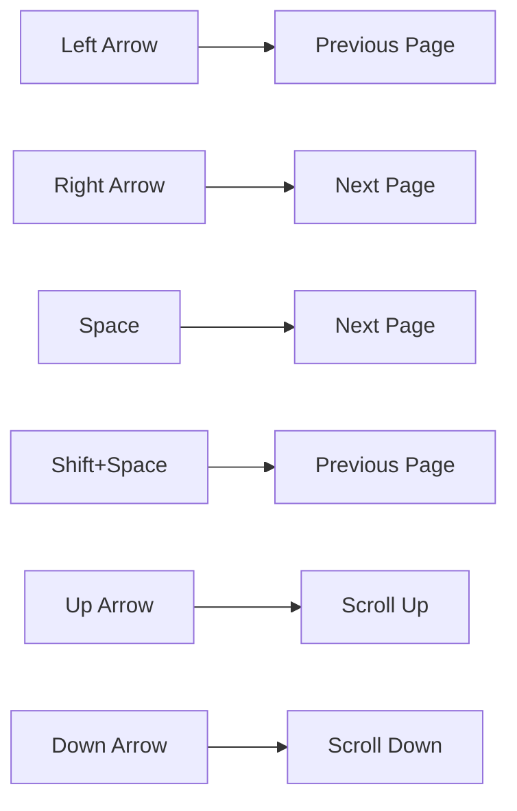

# Reader Help Overlay

<cite>
**Referenced Files in This Document**   
- [ReaderHelpOverlay.tsx](file://src/pages/EpubReader/components/ReaderHelpOverlay.tsx)
- [index.tsx](file://src/pages/EpubReader/index.tsx)
- [ReaderHeader.tsx](file://src/pages/EpubReader/components/ReaderHeader.tsx)
- [selection.service.ts](file://src/pages/EpubReader/services/selection.service.ts)
- [mobileSelection.service.ts](file://src/pages/EpubReader/services/mobileSelection.service.ts)
- [computerSelection.service.ts](file://src/pages/EpubReader/services/computerSelection.service.ts)
- [renditionEvent.service.ts](file://src/pages/EpubReader/services/renditionEvent.service)
- [epub.ts](file://src/types/epub.ts)
</cite>

## Table of Contents
1. [Introduction](#introduction)
2. [Core Components](#core-components)
3. [Architecture Overview](#architecture-overview)
4. [Detailed Component Analysis](#detailed-component-analysis)
5. [Integration with Reader State Management](#integration-with-reader-state-management)
6. [Onboarding for Text Selection and AI Features](#onboarding-for-text-selection-and-ai-features)
7. [Accessibility Considerations](#accessibility-considerations)
8. [Customization and User Segmentation](#customization-and-user-segmentation)
9. [Conclusion](#conclusion)

## Introduction
The ReaderHelpOverlay component serves as an interactive onboarding mechanism for new users of the EPUB reader interface. It provides visual guidance on available gestures and interactions within the reading environment, specifically highlighting navigation zones and key functionality. The overlay appears as a semi-transparent layer with distinct interactive regions that correspond to core reader functions: page navigation and menu access. This documentation details the implementation, integration, and functionality of this onboarding feature, explaining how it enhances user experience through contextual guidance.

## Core Components

The ReaderHelpOverlay is implemented as a React functional component that renders a full-screen overlay with three distinct interaction zones. These zones are designed to guide users through the primary navigation methods available in the EPUB reader interface. The component is triggered by user interaction with the help button in the reader header and is dismissed when the user clicks anywhere on the overlay. The overlay provides immediate visual feedback through hover effects and clear textual instructions for each interaction zone.

**Section sources**
- [ReaderHelpOverlay.tsx](file://src/pages/EpubReader/components/ReaderHelpOverlay.tsx#L1-L30)
- [index.tsx](file://src/pages/EpubReader/index.tsx#L82-L352)

## Architecture Overview

The ReaderHelpOverlay operates as a modal layer within the EPUB reader's component hierarchy, positioned above all other reader content but below permanent UI elements like the header and footer. It is conditionally rendered based on application state and provides a temporary, dismissible instructional layer that guides users through the reader's interaction model.

**Diagram sources **
- [index.tsx](file://src/pages/EpubReader/index.tsx#L347-L400)
- [ReaderHelpOverlay.tsx](file://src/pages/EpubReader/components/ReaderHelpOverlay.tsx#L7-L30)

## Detailed Component Analysis

### ReaderHelpOverlay Implementation
The ReaderHelpOverlay component is implemented with a fixed layout that divides the screen into three distinct interaction zones, each corresponding to a primary reader function. The implementation uses Tailwind CSS for styling, ensuring responsive design across different screen sizes.

#### Layout and Styling
The overlay uses absolute positioning to cover the entire reader viewport with a z-index of 40, placing it above the EPUB content but below the header (z-index 50) and context menus (z-index 50+). The background uses a semi-transparent black overlay (bg-black/50) with a backdrop blur effect (backdrop-blur-sm) to maintain focus on the overlay content while subtly dimming the underlying content.

**Diagram sources **
- [ReaderHelpOverlay.tsx](file://src/pages/EpubReader/components/ReaderHelpOverlay.tsx#L8-L29)

#### Interaction Zones
The overlay is divided into three horizontal sections with specific width allocations:
- **Left Zone (20%)**: Dedicated to previous page navigation
- **Center Zone (60%)**: Dedicated to menu access
- **Right Zone (20%)**: Dedicated to next page navigation

Each zone includes hover effects (hover:bg-white/10) and visual separators (border-r border-white/30) to clearly delineate the interactive areas. The instructional text uses text-lg font size with bold weight and drop shadows for enhanced readability against the semi-transparent background.

**Section sources**
- [ReaderHelpOverlay.tsx](file://src/pages/EpubReader/components/ReaderHelpOverlay.tsx#L15-L28)

### Trigger Mechanism and State Management
The display of the ReaderHelpOverlay is controlled by React state within the main EpubReader component. The overlay appears in response to user interaction with the help button in the reader header and can be dismissed by clicking anywhere on the overlay.

#### State Flow

**Diagram sources **
- [index.tsx](file://src/pages/EpubReader/index.tsx#L82-L352)
- [ReaderHeader.tsx](file://src/pages/EpubReader/components/ReaderHeader.tsx#L59-L65)

## Integration with Reader State Management

The ReaderHelpOverlay integrates with the reader's state management system through React's useState hook and component props. The visibility state is managed in the parent EpubReader component, which passes a callback function to the overlay for dismissal.

### State Implementation
The help overlay state is implemented as a boolean flag (showHelp) that controls the conditional rendering of the overlay component. When the user clicks the help button in the header, the state is updated to true, triggering the overlay's appearance. The overlay receives an onClose callback that sets the state back to false when the user interacts with the overlay.

**Diagram sources **
- [index.tsx](file://src/pages/EpubReader/index.tsx#L82-L352)

## Onboarding for Text Selection and AI Features

While the ReaderHelpOverlay primarily focuses on navigation gestures, it serves as part of a broader onboarding strategy that includes text selection and AI context menu access. The overlay introduces users to the spatial interaction model of the reader, which extends to text selection gestures.

### Text Selection Integration
The reader implements different text selection mechanisms for mobile and desktop devices, which are conceptually related to the gesture-based navigation taught by the help overlay.

#### Mobile Text Selection
On mobile devices, text selection is initiated through a long press gesture, followed by drag gestures to extend the selection. This gesture-based interaction model is consistent with the touch-based navigation demonstrated in the help overlay.

**Diagram sources **
- [mobileSelection.service.ts](file://src/pages/EpubReader/services/mobileSelection.service.ts#L16-L101)
- [selection.service.ts](file://src/pages/EpubReader/services/selection.service.ts#L11-L25)

#### Desktop Text Selection
On desktop devices, text selection follows standard mouse-based selection patterns, with the selection finalized on mouseup events. The selection service processes the selected text and extracts contextual information for AI tools.

**Diagram sources **
- [computerSelection.service.ts](file://src/pages/EpubReader/services/computerSelection.service.ts#L6-L20)
- [selection.service.ts](file://src/pages/EpubReader/services/selection.service.ts#L33-L149)

## Accessibility Considerations

The ReaderHelpOverlay and related components incorporate several accessibility features to support users with different needs. While the overlay itself is primarily visual, the underlying reader interface includes keyboard navigation and semantic HTML elements.

### Keyboard Navigation
The reader implements keyboard navigation for page turning, allowing users to navigate through the EPUB content without relying on mouse or touch interactions. This complements the gesture-based navigation taught by the help overlay.

**Section sources**
- [useKeyboardNavigator.ts](file://src/pages/EpubReader/hooks/useKeyboardNavigator.ts)

### Visual Design for Accessibility
The overlay uses high-contrast text (text-white) against a darkened background to ensure readability. The instructional text is displayed in a large, bold font (text-lg font-bold) with drop shadows (drop-shadow-md) to enhance legibility. The hover effects provide clear visual feedback for interactive zones, aiding users in identifying clickable areas.

## Customization and User Segmentation

The current implementation of the ReaderHelpOverlay provides a generic onboarding experience for all users. However, the architecture supports potential customization for different user segments through configuration options and conditional rendering.

### Potential Customization Points
The help overlay could be extended to support different content for various user segments, such as:
- First-time users vs. returning users
- Mobile users vs. desktop users
- Users with different accessibility needs
- Users with varying levels of technical proficiency

The state management pattern used for the overlay (showHelp flag) could be extended to track user progress through onboarding steps, allowing for a more personalized onboarding experience.

## Conclusion
The ReaderHelpOverlay component provides an effective onboarding mechanism for new users of the EPUB reader interface. By visually demonstrating the available interaction zones, it helps users quickly understand the navigation model of the application. The overlay's implementation leverages modern CSS techniques for visual effects and responsive layout, while its integration with React state management ensures smooth interaction with the rest of the application. The component serves as a foundation for a comprehensive onboarding experience that could be extended to cover additional features like text selection and AI context menu access. Future enhancements could include personalized onboarding flows, progress tracking, and accessibility-focused variations to support a wider range of users.