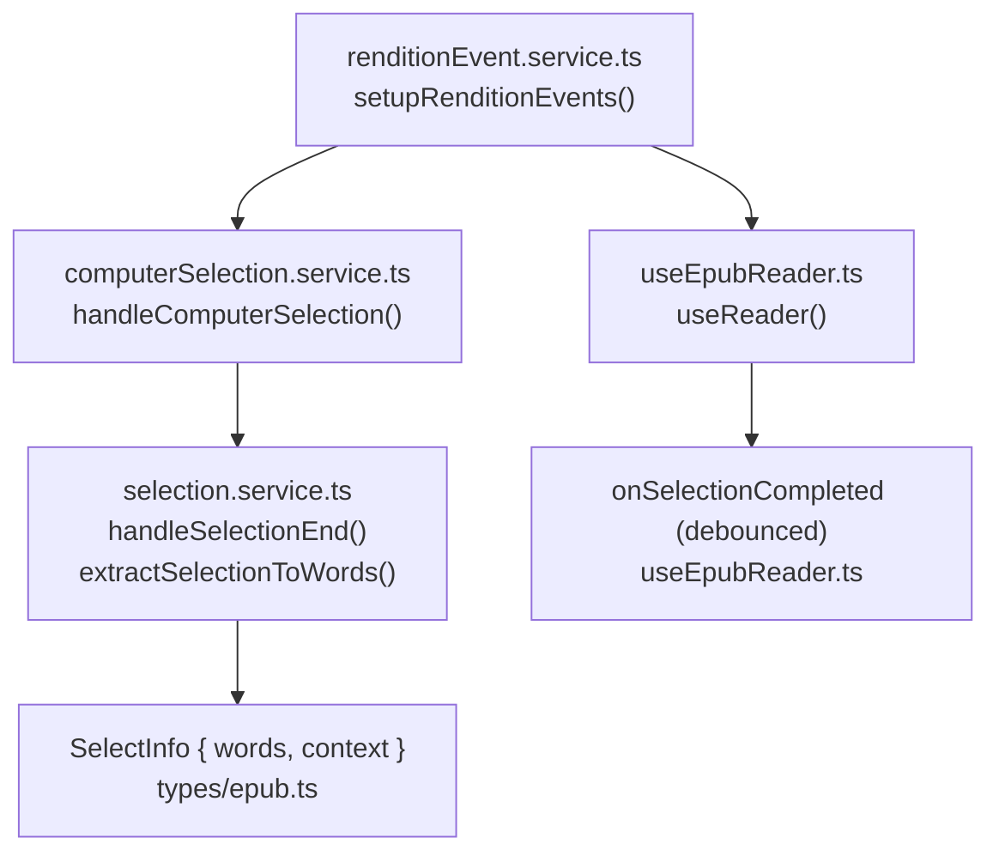
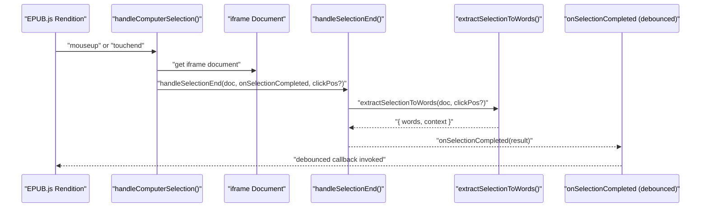
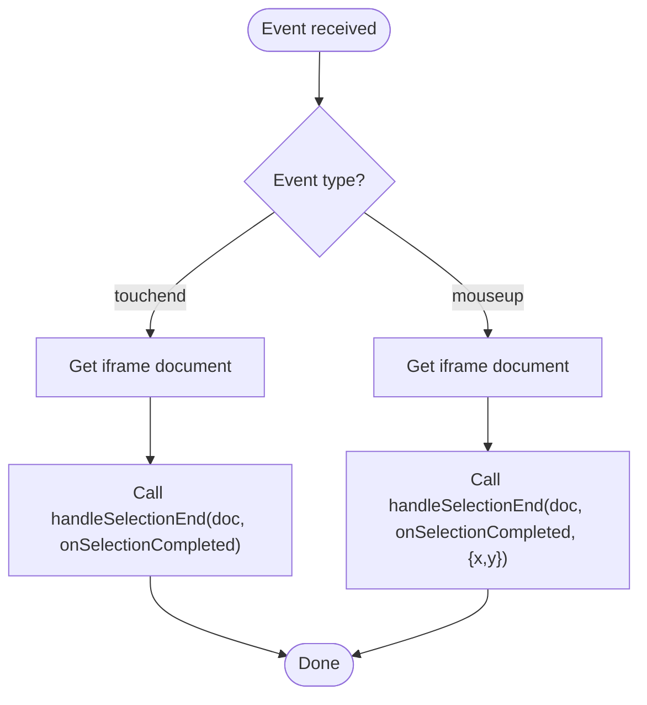
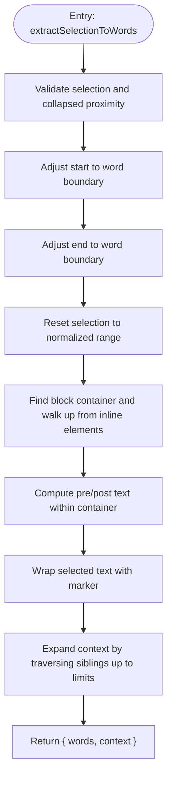
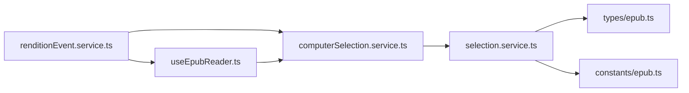

# Computer Text Selection

<cite>
**Referenced Files in This Document**
- [computerSelection.service.ts](file://src/pages/EpubReader/services/computerSelection.service.ts)
- [selection.service.ts](file://src/pages/EpubReader/services/selection.service.ts)
- [renditionEvent.service.ts](file://src/pages/EpubReader/services/renditionEvent.service.ts)
- [useEpubReader.ts](file://src/pages/EpubReader/hooks/useEpubReader.ts)
- [epub.ts](file://src/types/epub.ts)
- [epub.ts](file://src/constants/epub.ts)
- [drilldownSelection.ts](file://src/pages/EpubReader/components/AIAgent/utils/drilldownSelection.ts)
</cite>

## Table of Contents
1. [Introduction](#introduction)
2. [Project Structure](#project-structure)
3. [Core Components](#core-components)
4. [Architecture Overview](#architecture-overview)
5. [Detailed Component Analysis](#detailed-component-analysis)
6. [Dependency Analysis](#dependency-analysis)
7. [Performance Considerations](#performance-considerations)
8. [Troubleshooting Guide](#troubleshooting-guide)
9. [Conclusion](#conclusion)

## Introduction
This document explains the computer text selection system used in the EPUB reader. It focuses on how mouseup and touchend events from the EPUB.js rendition are captured and processed to extract a normalized selection, expand its context, and pass the result to the context menu. The implementation relies on shared logic in selection.service.ts, including constants that define how far to expand context and how many neighbor nodes to traverse. Selected text is wrapped with a special marker for downstream AI processing, and the system accounts for rapid mouse movements and overlapping event listeners by debouncing and careful event wiring.

## Project Structure
The selection pipeline spans several services and hooks:
- Event wiring and device detection live in renditionEvent.service.ts.
- Computer-specific selection handlers are in computerSelection.service.ts.
- Shared selection extraction and context expansion logic is in selection.service.ts.
- The reader hook wires everything together and exposes a debounced onSelectionCompleted callback.
- Types and constants define the selection payload and thresholds.

**Diagram sources**
- [renditionEvent.service.ts](file://src/pages/EpubReader/services/renditionEvent.service.ts#L29-L59)
- [computerSelection.service.ts](file://src/pages/EpubReader/services/computerSelection.service.ts#L6-L19)
- [selection.service.ts](file://src/pages/EpubReader/services/selection.service.ts#L11-L149)
- [useEpubReader.ts](file://src/pages/EpubReader/hooks/useEpubReader.ts#L126-L143)
- [epub.ts](file://src/types/epub.ts#L14-L14)

**Section sources**
- [renditionEvent.service.ts](file://src/pages/EpubReader/services/renditionEvent.service.ts#L29-L59)
- [computerSelection.service.ts](file://src/pages/EpubReader/services/computerSelection.service.ts#L6-L19)
- [selection.service.ts](file://src/pages/EpubReader/services/selection.service.ts#L11-L149)
- [useEpubReader.ts](file://src/pages/EpubReader/hooks/useEpubReader.ts#L126-L143)
- [epub.ts](file://src/types/epub.ts#L14-L14)

## Core Components
- computerSelection.service.ts
  - Listens for touchend and mouseup on the EPUB.js rendition.
  - Captures the iframe document and delegates to handleSelectionEnd with optional click coordinates for proximity checks.
- selection.service.ts
  - Normalizes selection to word boundaries.
  - Builds a context string by extracting text before and after the selection within a block container.
  - Wraps the selected text with a special marker for downstream AI processing.
  - Expands context by traversing adjacent DOM nodes up to a configured limit and word count threshold.
  - Exposes a public function to extract selection and context.
- renditionEvent.service.ts
  - Detects device type and routes to computer or mobile selection handlers.
  - Wires rendition events and passes onSelectionCompleted to the selection handlers.
- useEpubReader.ts
  - Debounces onSelectionCompleted to avoid rapid repeated triggers.
  - Provides the callback to the selection services.

**Section sources**
- [computerSelection.service.ts](file://src/pages/EpubReader/services/computerSelection.service.ts#L6-L19)
- [selection.service.ts](file://src/pages/EpubReader/services/selection.service.ts#L11-L149)
- [renditionEvent.service.ts](file://src/pages/EpubReader/services/renditionEvent.service.ts#L29-L59)
- [useEpubReader.ts](file://src/pages/EpubReader/hooks/useEpubReader.ts#L126-L143)

## Architecture Overview
The selection flow begins when the rendition emits mouseup or touchend. The computer selection handler captures the document and invokes the shared selection extractor. That extractor validates the selection, normalizes it to word boundaries, builds a context string, and expands it around the selection. The resulting SelectInfo is emitted to the consumer via a debounced callback.

**Diagram sources**
- [computerSelection.service.ts](file://src/pages/EpubReader/services/computerSelection.service.ts#L6-L19)
- [selection.service.ts](file://src/pages/EpubReader/services/selection.service.ts#L11-L149)
- [useEpubReader.ts](file://src/pages/EpubReader/hooks/useEpubReader.ts#L126-L143)

## Detailed Component Analysis

### computerSelection.service.ts
- Purpose: Bridge EPUB.js rendition events to the shared selection logic.
- Behavior:
  - Registers a touchend listener that triggers selection extraction.
  - Registers a mouseup listener that also triggers extraction and passes client coordinates for proximity validation.
  - Uses the iframe’s document for selection operations.

**Diagram sources**
- [computerSelection.service.ts](file://src/pages/EpubReader/services/computerSelection.service.ts#L6-L19)

**Section sources**
- [computerSelection.service.ts](file://src/pages/EpubReader/services/computerSelection.service.ts#L6-L19)

### selection.service.ts
- Purpose: Normalize selection, compute context, and wrap selected text for AI processing.
- Key steps:
  - Validates selection and handles collapsed selections near text caret positions using proximity checks.
  - Adjusts selection start/end to word boundaries.
  - Resets selection to the normalized range.
  - Determines a block-level container for context boundaries and extracts pre/post text.
  - Wraps the selected text with a special marker for downstream AI processing.
  - Expands context by walking previous and next sibling elements up to a configured neighbor limit and until a minimum word count is met.
  - Returns SelectInfo with words and context.

**Diagram sources**
- [selection.service.ts](file://src/pages/EpubReader/services/selection.service.ts#L33-L149)

**Section sources**
- [selection.service.ts](file://src/pages/EpubReader/services/selection.service.ts#L11-L149)

### Constants and Thresholds
- MIN_CONTEXT_WORDS: Minimum number of words to include in the context after normalization.
- MAX_NEIGHBOR_SEARCH: Maximum number of adjacent sibling nodes to traverse when expanding context.
- These constants are defined inside the selection extractor and drive robustness of context expansion.

**Section sources**
- [selection.service.ts](file://src/pages/EpubReader/services/selection.service.ts#L108-L109)

### Types and Payload
- SelectInfo: The normalized selection payload passed to consumers. It includes:
  - words: the selected text.
  - context: the surrounding text with the selected segment wrapped for AI processing.

**Section sources**
- [epub.ts](file://src/types/epub.ts#L14-L14)

### Integration with the Reader Hook
- The reader hook sets up rendition events and provides a debounced onSelectionCompleted callback.
- This ensures that rapid successive selection events do not flood the UI or AI tools.

**Section sources**
- [useEpubReader.ts](file://src/pages/EpubReader/hooks/useEpubReader.ts#L126-L143)

### Mobile vs Computer Path
- The computer path registers mouseup and touchend listeners directly on the rendition.
- The mobile path uses a separate service with long press and drag semantics; it still delegates to the same selection extractor.

**Section sources**
- [renditionEvent.service.ts](file://src/pages/EpubReader/services/renditionEvent.service.ts#L29-L59)
- [mobileSelection.service.ts](file://src/pages/EpubReader/services/mobileSelection.service.ts#L1-L231)

### Drilldown Selection Utility (Optional)
- A separate utility resolves a single English word under a mouse event and builds a context string similarly, wrapping the word with a marker. While not used by the computer selection path, it demonstrates the same wrapping and context-building pattern.

**Section sources**
- [drilldownSelection.ts](file://src/pages/EpubReader/components/AIAgent/utils/drilldownSelection.ts#L1-L136)

## Dependency Analysis
- computerSelection.service.ts depends on:
  - renditionEvent.service.ts for device detection and event routing.
  - selection.service.ts for the shared extraction logic.
- selection.service.ts depends on:
  - DOM APIs (Selection, Range, Document) to normalize and expand context.
  - Internal constants for thresholds.
- useEpubReader.ts depends on:
  - renditionEvent.service.ts to wire events.
  - Debounce utility to stabilize callbacks.

**Diagram sources**
- [computerSelection.service.ts](file://src/pages/EpubReader/services/computerSelection.service.ts#L6-L19)
- [selection.service.ts](file://src/pages/EpubReader/services/selection.service.ts#L11-L149)
- [renditionEvent.service.ts](file://src/pages/EpubReader/services/renditionEvent.service.ts#L29-L59)
- [useEpubReader.ts](file://src/pages/EpubReader/hooks/useEpubReader.ts#L126-L143)
- [epub.ts](file://src/types/epub.ts#L14-L14)
- [epub.ts](file://src/constants/epub.ts#L8-L13)

**Section sources**
- [computerSelection.service.ts](file://src/pages/EpubReader/services/computerSelection.service.ts#L6-L19)
- [selection.service.ts](file://src/pages/EpubReader/services/selection.service.ts#L11-L149)
- [renditionEvent.service.ts](file://src/pages/EpubReader/services/renditionEvent.service.ts#L29-L59)
- [useEpubReader.ts](file://src/pages/EpubReader/hooks/useEpubReader.ts#L126-L143)
- [epub.ts](file://src/types/epub.ts#L14-L14)
- [epub.ts](file://src/constants/epub.ts#L8-L13)

## Performance Considerations
- Debouncing: The reader hook debounces onSelectionCompleted to reduce redundant processing and UI updates.
- Proximity checks: For collapsed selections, proximity validation avoids treating clicks far from text as selections.
- Context expansion: Limits on neighbor traversal and word counts prevent excessive DOM scanning and large payloads.
- Event wiring: Using rendition-level listeners avoids attaching numerous DOM listeners and reduces overhead.

[No sources needed since this section provides general guidance]

## Troubleshooting Guide
- Selection loss on rapid mouse movements
  - Cause: Multiple rapid mouseup events can trigger overlapping extractions.
  - Solution: The reader hook debounces onSelectionCompleted to consolidate events. Ensure the debounce interval is appropriate for your UX.
  - Related code: debounced callback in the reader hook.
  - Section sources
    - [useEpubReader.ts](file://src/pages/EpubReader/hooks/useEpubReader.ts#L126-L143)

- Overlapping event listeners
  - Cause: Attaching multiple listeners to the same DOM nodes can cause race conditions.
  - Solution: The computer selection handler attaches listeners to the rendition object. For mobile, the dedicated service returns a cleanup function to remove listeners; reuse it when unmounting or re-rendering.
  - Section sources
    - [renditionEvent.service.ts](file://src/pages/EpubReader/services/renditionEvent.service.ts#L29-L59)
    - [mobileSelection.service.ts](file://src/pages/EpubReader/services/mobileSelection.service.ts#L88-L101)

- Collapsed selection not recognized
  - Cause: Clicks far from text caret are ignored to avoid false positives.
  - Solution: Ensure proximity thresholds are reasonable for your layout. The extractor computes distance to the caret rectangle and ignores clicks beyond a small threshold.
  - Section sources
    - [selection.service.ts](file://src/pages/EpubReader/services/selection.service.ts#L43-L57)

- Context too small or too large
  - Cause: Insufficient words or too many neighbors traversed.
  - Solution: Tune MIN_CONTEXT_WORDS and MAX_NEIGHBOR_SEARCH to balance context richness and performance.
  - Section sources
    - [selection.service.ts](file://src/pages/EpubReader/services/selection.service.ts#L108-L109)

- Cross-browser differences
  - Cause: Different Selection/Range behaviors across browsers.
  - Solution: The extractor uses standard DOM APIs and walks up from inline elements to block containers to avoid inconsistent boundaries. Test across devices and browsers and adjust thresholds as needed.
  - Section sources
    - [selection.service.ts](file://src/pages/EpubReader/services/selection.service.ts#L89-L106)

## Conclusion
The computer text selection system integrates EPUB.js rendition events with a robust selection extraction routine. It normalizes selections to word boundaries, wraps the selected text for AI processing, and expands context using controlled neighbor traversal and word-count thresholds. The reader hook’s debounced callback ensures consistent behavior across rapid interactions, while the event wiring keeps the system efficient and reliable across browsers and input devices.