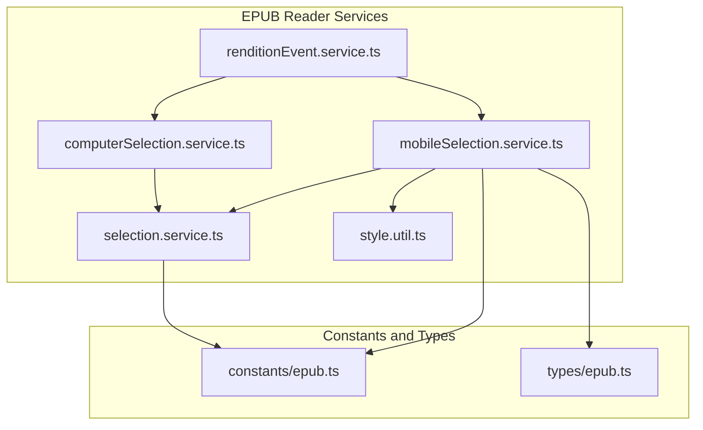
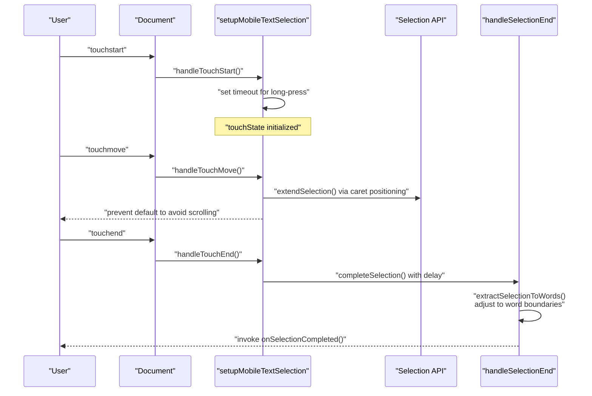
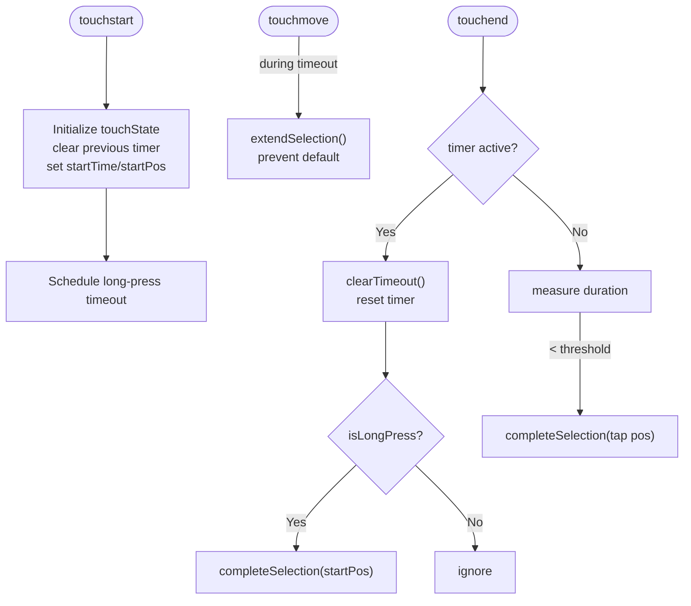
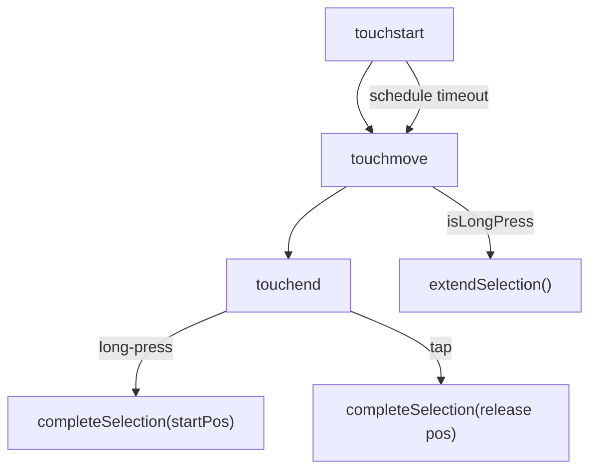
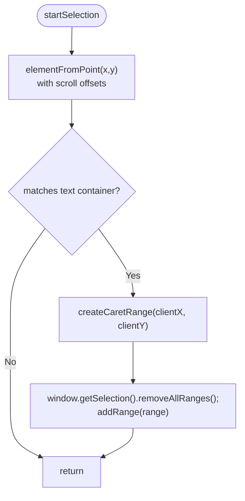
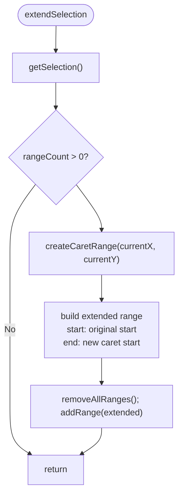
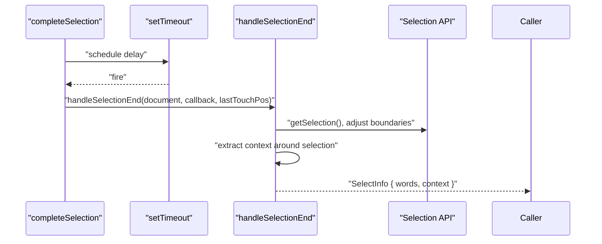
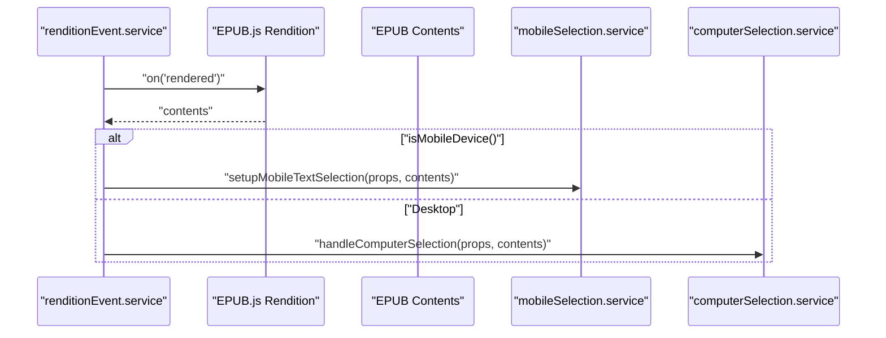
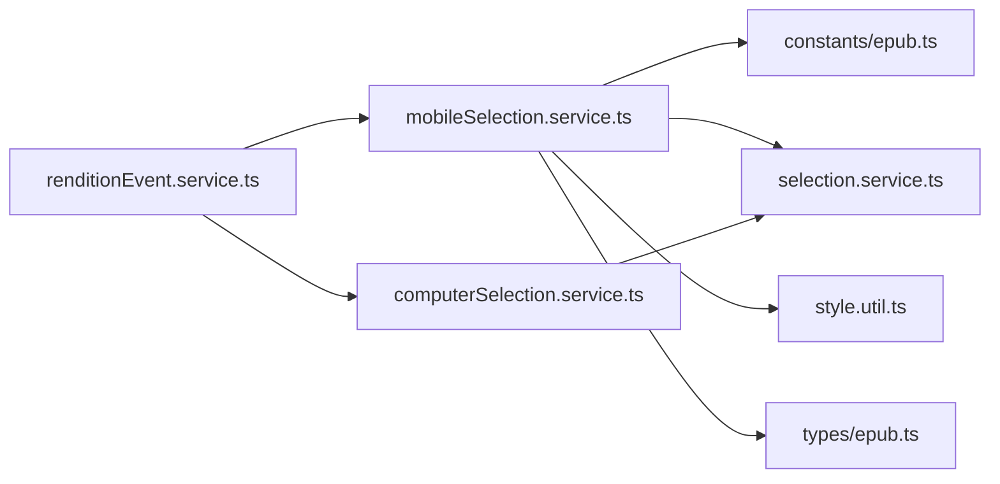

# Mobile Text Selection

<cite>
**Referenced Files in This Document**
- [mobileSelection.service.ts](file://src/pages/EpubReader/services/mobileSelection.service.ts)
- [computerSelection.service.ts](file://src/pages/EpubReader/services/computerSelection.service.ts)
- [renditionEvent.service.ts](file://src/pages/EpubReader/services/renditionEvent.service.ts)
- [selection.service.ts](file://src/pages/EpubReader/services/selection.service.ts)
- [epub.ts](file://src/constants/epub.ts)
- [epub.ts](file://src/types/epub.ts)
- [style.util.ts](file://src/pages/EpubReader/utils/style.util.ts)
</cite>

## Table of Contents
1. [Introduction](#introduction)
2. [Project Structure](#project-structure)
3. [Core Components](#core-components)
4. [Architecture Overview](#architecture-overview)
5. [Detailed Component Analysis](#detailed-component-analysis)
6. [Dependency Analysis](#dependency-analysis)
7. [Performance Considerations](#performance-considerations)
8. [Troubleshooting Guide](#troubleshooting-guide)
9. [Conclusion](#conclusion)

## Introduction
This document explains the mobile text selection system implemented in the EPUB reader. It focuses on the mobile selection service, touchState management for tracking selection phases, long-press detection using timeouts and TOUCH_TIMING constants, and the three-phase touch handling pipeline: touchstart, touchmove, and touchend. It also covers how startSelection identifies the target DOM element and creates initial caret ranges, how extendSelection dynamically updates the selection during finger movement, and how coordinate adjustments enable correct context menu positioning. Finally, it addresses common issues such as accidental selections, race conditions with computer selection handlers, and touch event propagation conflicts, along with performance considerations and optimization strategies.

## Project Structure
The mobile text selection is implemented as part of the EpubReader services and integrates with EPUB.js rendition events. The key files involved are:
- Mobile selection service: handles touchstart/touchmove/touchend and caret-based selection
- Computer selection service: handles mouse-based selection on desktop
- Rendition event service: wires device detection and attaches appropriate selection handlers
- Selection extraction service: finalizes selection, adjusts to word boundaries, and extracts context
- Constants and types: define timing constants and selection state interfaces
- Style utility: applies mobile-friendly selection styles

**Diagram sources**
- [renditionEvent.service.ts](file://src/pages/EpubReader/services/renditionEvent.service.ts#L1-L60)
- [mobileSelection.service.ts](file://src/pages/EpubReader/services/mobileSelection.service.ts#L1-L231)
- [computerSelection.service.ts](file://src/pages/EpubReader/services/computerSelection.service.ts#L1-L20)
- [selection.service.ts](file://src/pages/EpubReader/services/selection.service.ts#L1-L169)
- [style.util.ts](file://src/pages/EpubReader/utils/style.util.ts#L1-L41)
- [epub.ts](file://src/constants/epub.ts#L1-L61)
- [epub.ts](file://src/types/epub.ts#L112-L121)

**Section sources**
- [renditionEvent.service.ts](file://src/pages/EpubReader/services/renditionEvent.service.ts#L1-L60)
- [mobileSelection.service.ts](file://src/pages/EpubReader/services/mobileSelection.service.ts#L1-L231)
- [computerSelection.service.ts](file://src/pages/EpubReader/services/computerSelection.service.ts#L1-L20)
- [selection.service.ts](file://src/pages/EpubReader/services/selection.service.ts#L1-L169)
- [epub.ts](file://src/constants/epub.ts#L1-L61)
- [epub.ts](file://src/types/epub.ts#L112-L121)
- [style.util.ts](file://src/pages/EpubReader/utils/style.util.ts#L1-L41)

## Core Components
- TouchState: Tracks long-press state, start time, start position, and timeout handle during a selection gesture.
- setupMobileTextSelection: Attaches touch event listeners and manages the selection lifecycle.
- startSelection: Initializes selection at the touch point using caret positioning APIs.
- extendSelection: Updates the selection range during movement by recalculating caret positions.
- completeSelection: Finalizes selection with a delay and invokes the selection extraction pipeline.
- createCaretRange: Converts client coordinates to a DOM Range using caret position APIs.
- handleSelectionEnd: Extracts words and context, adjusts to word boundaries, and invokes the callback.
- TOUCH_TIMING constants: Configure long-press duration, tap threshold, and selection delay.
- applyMobileStyles: Enables text selection and sets touch-action for better mobile behavior.

**Section sources**
- [mobileSelection.service.ts](file://src/pages/EpubReader/services/mobileSelection.service.ts#L1-L231)
- [selection.service.ts](file://src/pages/EpubReader/services/selection.service.ts#L1-L169)
- [epub.ts](file://src/constants/epub.ts#L1-L61)
- [epub.ts](file://src/types/epub.ts#L112-L121)
- [style.util.ts](file://src/pages/EpubReader/utils/style.util.ts#L1-L41)

## Architecture Overview
The mobile selection pipeline is triggered when a mobile device is detected. The rendition event service attaches the mobile selection handler to the EPUB contents document. The mobile selection service listens to touch events, manages a touchState object, and delegates to caret-based selection helpers. On completion, it defers extraction to the selection service to normalize and enrich the selection.

**Diagram sources**
- [renditionEvent.service.ts](file://src/pages/EpubReader/services/renditionEvent.service.ts#L42-L58)
- [mobileSelection.service.ts](file://src/pages/EpubReader/services/mobileSelection.service.ts#L28-L101)
- [mobileSelection.service.ts](file://src/pages/EpubReader/services/mobileSelection.service.ts#L103-L170)
- [mobileSelection.service.ts](file://src/pages/EpubReader/services/mobileSelection.service.ts#L185-L231)
- [selection.service.ts](file://src/pages/EpubReader/services/selection.service.ts#L1-L169)

## Detailed Component Analysis

### TouchState Management and Long-Press Detection
- touchState tracks:
  - isLongPress: whether the gesture has been confirmed as a long-press
  - startTime: when the gesture started
  - startPos: initial client coordinates
  - timer: reference to the long-press timeout
- Long-press detection:
  - On touchstart, a timeout is scheduled using TOUCH_TIMING.LONG_PRESS_DURATION
  - If the timeout fires, isLongPress is set and startSelection is invoked
  - If the user moves or ends the gesture before the timeout, the timer is cleared and the gesture is treated as a tap or drag
- Tap vs. long-press:
  - If the gesture ends before long-press threshold, completeSelection is still invoked with a tap threshold check using TOUCH_TIMING.REGULAR_TAP_THRESHOLD

**Diagram sources**
- [mobileSelection.service.ts](file://src/pages/EpubReader/services/mobileSelection.service.ts#L28-L101)
- [epub.ts](file://src/constants/epub.ts#L8-L13)

**Section sources**
- [mobileSelection.service.ts](file://src/pages/EpubReader/services/mobileSelection.service.ts#L18-L45)
- [mobileSelection.service.ts](file://src/pages/EpubReader/services/mobileSelection.service.ts#L60-L86)
- [epub.ts](file://src/constants/epub.ts#L8-L13)

### Three-Phase Touch Handling
- touchstart:
  - Clears any pending timer
  - Resets touchState flags and captures start time and position
  - Schedules a long-press timeout
- touchmove:
  - Validates single-touch input
  - If isLongPress is true, extends the selection using caret positioning
  - Prevents default to avoid unintended scrolling
- touchend:
  - Clears the long-press timer
  - If isLongPress is true, completes selection using the start position
  - If the duration is below the tap threshold, completes selection using the release position

**Diagram sources**
- [mobileSelection.service.ts](file://src/pages/EpubReader/services/mobileSelection.service.ts#L28-L101)

**Section sources**
- [mobileSelection.service.ts](file://src/pages/EpubReader/services/mobileSelection.service.ts#L28-L101)

### startSelection: Target Element and Initial Caret Range
- startSelection identifies the target element under the touch point using elementFromPoint with scroll offsets
- It restricts selection to common text containers (paragraphs, headings, spans)
- It creates a caret range at the touch coordinates and applies it to the selection

Coordinate adjustment:
- Uses clientX/clientY minus window.scrollX/scrollY to convert viewport-relative coordinates to document-relative coordinates

**Diagram sources**
- [mobileSelection.service.ts](file://src/pages/EpubReader/services/mobileSelection.service.ts#L110-L127)
- [mobileSelection.service.ts](file://src/pages/EpubReader/services/mobileSelection.service.ts#L194-L230)

**Section sources**
- [mobileSelection.service.ts](file://src/pages/EpubReader/services/mobileSelection.service.ts#L110-L127)
- [mobileSelection.service.ts](file://src/pages/EpubReader/services/mobileSelection.service.ts#L194-L230)

### extendSelection: Dynamic Selection Extension
- extendSelection retrieves the current selection and ensures a valid range exists
- It computes a new caret range at the current touch position
- It constructs an extended range by keeping the original start and updating the end to the new caret position
- It replaces the selection with the extended range

**Diagram sources**
- [mobileSelection.service.ts](file://src/pages/EpubReader/services/mobileSelection.service.ts#L136-L159)
- [mobileSelection.service.ts](file://src/pages/EpubReader/services/mobileSelection.service.ts#L194-L230)

**Section sources**
- [mobileSelection.service.ts](file://src/pages/EpubReader/services/mobileSelection.service.ts#L136-L159)
- [mobileSelection.service.ts](file://src/pages/EpubReader/services/mobileSelection.service.ts#L194-L230)

### completeSelection and Selection Extraction
- completeSelection delays execution by TOUCH_TIMING.SELECTION_DELAY to allow the selection to settle
- It invokes handleSelectionEnd with the last touch position (start position for long-press, release position for tap)
- handleSelectionEnd:
  - Optionally validates collapsed selections against click proximity
  - Adjusts selection to word boundaries
  - Extracts selected text and expands context within the container and neighboring nodes
  - Returns SelectInfo (words and context) to the caller

**Diagram sources**
- [mobileSelection.service.ts](file://src/pages/EpubReader/services/mobileSelection.service.ts#L167-L183)
- [selection.service.ts](file://src/pages/EpubReader/services/selection.service.ts#L1-L169)
- [epub.ts](file://src/constants/epub.ts#L8-L13)

**Section sources**
- [mobileSelection.service.ts](file://src/pages/EpubReader/services/mobileSelection.service.ts#L167-L183)
- [selection.service.ts](file://src/pages/EpubReader/services/selection.service.ts#L1-L169)
- [epub.ts](file://src/constants/epub.ts#L8-L13)

### Coordinate Calculation for Context Menu Positioning
- The selection extraction pipeline receives the last touch position (either start position for long-press or release position for tap)
- The extraction logic uses the selection’s bounding rectangle to validate proximity for collapsed selections and to compute distances when determining whether to ignore accidental taps
- These coordinates are used to position context menus near the selection or click location

Practical implications:
- For long-press selections, the context menu can be positioned near the initial touch point
- For quick taps, the context menu can be positioned near the release point
- The proximity check prevents accidental context menu activation when tapping far from text

**Section sources**
- [mobileSelection.service.ts](file://src/pages/EpubReader/services/mobileSelection.service.ts#L70-L86)
- [selection.service.ts](file://src/pages/EpubReader/services/selection.service.ts#L33-L82)

### Device Integration and Event Wiring
- The rendition event service detects mobile devices and attaches the mobile selection handler to the EPUB contents document
- On desktop, it attaches the computer selection handler instead
- Both handlers ultimately call handleSelectionEnd to finalize and extract the selection

**Diagram sources**
- [renditionEvent.service.ts](file://src/pages/EpubReader/services/renditionEvent.service.ts#L42-L58)
- [renditionEvent.service.ts](file://src/pages/EpubReader/services/renditionEvent.service.ts#L22-L24)

**Section sources**
- [renditionEvent.service.ts](file://src/pages/EpubReader/services/renditionEvent.service.ts#L22-L58)

## Dependency Analysis
- mobileSelection.service depends on:
  - TOUCH_TIMING constants for timing thresholds
  - selection.service for finalizing and extracting selection
  - style.util for enabling text selection and touch-action
  - types/epub for TouchState interface
- computerSelection.service depends on:
  - selection.service for finalizing selection on desktop
- renditionEvent.service orchestrates which handler to attach based on device detection

**Diagram sources**
- [mobileSelection.service.ts](file://src/pages/EpubReader/services/mobileSelection.service.ts#L1-L231)
- [computerSelection.service.ts](file://src/pages/EpubReader/services/computerSelection.service.ts#L1-L20)
- [renditionEvent.service.ts](file://src/pages/EpubReader/services/renditionEvent.service.ts#L1-L60)
- [selection.service.ts](file://src/pages/EpubReader/services/selection.service.ts#L1-L169)
- [epub.ts](file://src/constants/epub.ts#L1-L61)
- [epub.ts](file://src/types/epub.ts#L112-L121)
- [style.util.ts](file://src/pages/EpubReader/utils/style.util.ts#L1-L41)

**Section sources**
- [mobileSelection.service.ts](file://src/pages/EpubReader/services/mobileSelection.service.ts#L1-L231)
- [computerSelection.service.ts](file://src/pages/EpubReader/services/computerSelection.service.ts#L1-L20)
- [renditionEvent.service.ts](file://src/pages/EpubReader/services/renditionEvent.service.ts#L1-L60)
- [selection.service.ts](file://src/pages/EpubReader/services/selection.service.ts#L1-L169)
- [epub.ts](file://src/constants/epub.ts#L1-L61)
- [epub.ts](file://src/types/epub.ts#L112-L121)
- [style.util.ts](file://src/pages/EpubReader/utils/style.util.ts#L1-L41)

## Performance Considerations
- Frequent touchmove events:
  - extendSelection recomputes caret ranges on every move; keep the logic minimal and avoid heavy DOM queries
  - prevent default on touchmove avoids unwanted scrolling and reduces layout thrashing
- Timeout scheduling:
  - Long-press timeout is cleared on gesture changes; ensure timers are always cleared to prevent leaks
- Scroll offsets:
  - Coordinate conversion uses window.scrollX/scrollY; cache these values if frequently accessed
- Selection normalization:
  - handleSelectionEnd performs boundary adjustments and context expansion; batch DOM reads/writes to minimize reflows
- Passive vs. non-passive listeners:
  - Touch listeners are configured non-passive to allow preventDefault; ensure this does not conflict with platform-specific scrolling behavior
- Styles:
  - applyMobileStyles enables text selection and sets touch-action; ensure styles are applied once per render to avoid repeated style injections

[No sources needed since this section provides general guidance]

## Troubleshooting Guide
- Accidental selections:
  - Collapsed selection proximity check ignores clicks more than a small distance from the caret
  - Ensure clickPos is passed correctly from touchend to handleSelectionEnd
- Race conditions with computer selection handlers:
  - The rendition event service attaches either mobile or computer handlers based on device detection
  - Verify that only one handler is attached at a time to avoid conflicting selections
- Touch event propagation conflicts:
  - preventDefault is used in touchmove to avoid scrolling; confirm that higher-level overlays do not swallow events
  - Ensure passive: false is used for touch listeners to allow preventDefault
- Long-press not triggering:
  - Confirm TOUCH_TIMING.LONG_PRESS_DURATION is appropriate for the device and content
  - Ensure the timer is not being cleared prematurely by rapid gestures
- Selection not finalized:
  - completeSelection uses a delay; ensure the delay is not too long and that handleSelectionEnd is invoked with the correct lastTouchPos

**Section sources**
- [selection.service.ts](file://src/pages/EpubReader/services/selection.service.ts#L33-L82)
- [renditionEvent.service.ts](file://src/pages/EpubReader/services/renditionEvent.service.ts#L42-L58)
- [mobileSelection.service.ts](file://src/pages/EpubReader/services/mobileSelection.service.ts#L47-L58)
- [mobileSelection.service.ts](file://src/pages/EpubReader/services/mobileSelection.service.ts#L167-L183)
- [epub.ts](file://src/constants/epub.ts#L8-L13)

## Conclusion
The mobile text selection system uses a robust three-phase touch pipeline with explicit touchState management and caret-based selection. Long-press detection is implemented via timeouts and TOUCH_TIMING constants, while coordinate adjustments ensure accurate context menu positioning. The separation of concerns between mobile and computer selection handlers, combined with a delayed extraction pipeline, provides reliable and performant text selection on mobile devices. Proper handling of edge cases such as accidental taps, gesture conflicts, and frequent touchmove events ensures a smooth user experience.