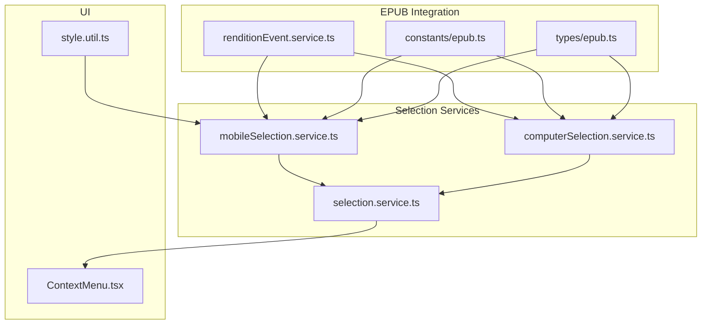
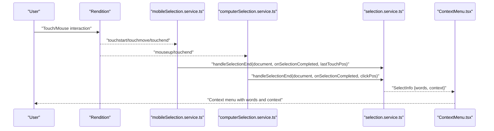
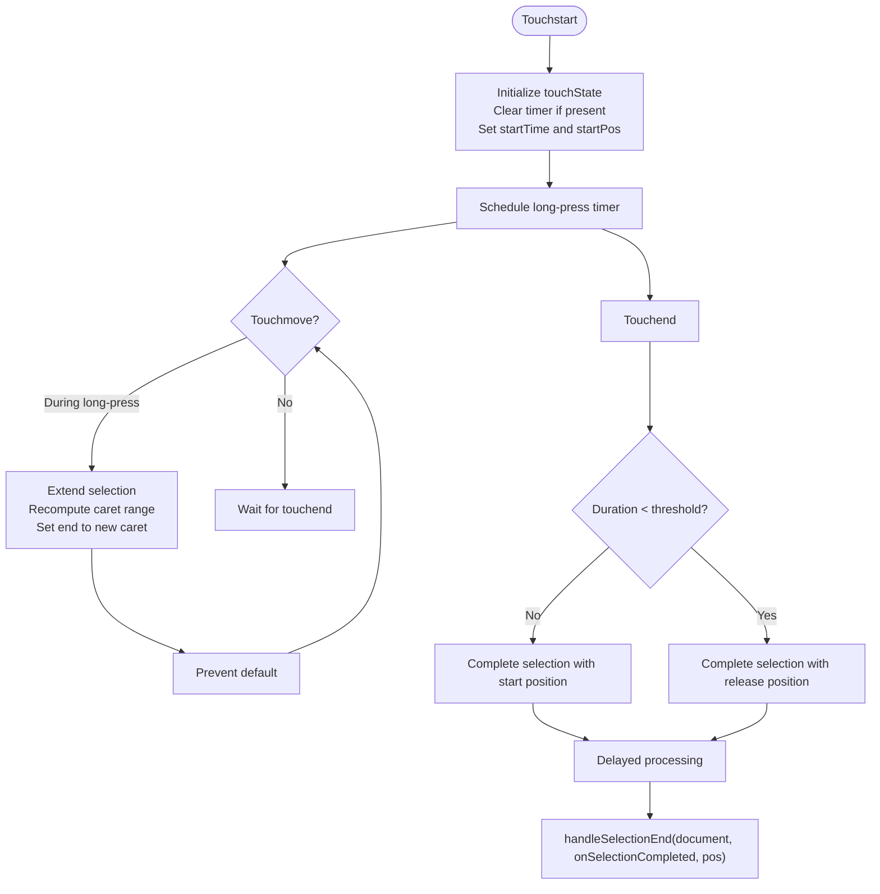
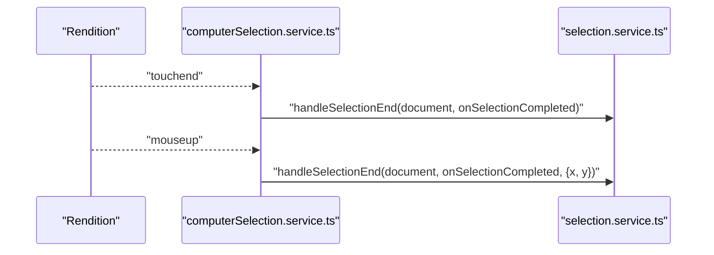
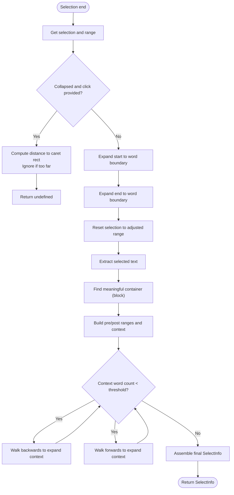
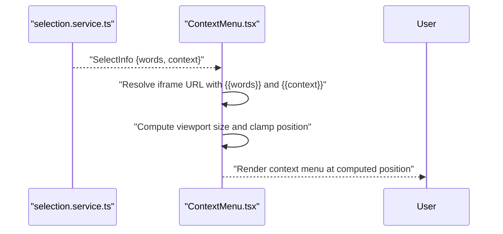
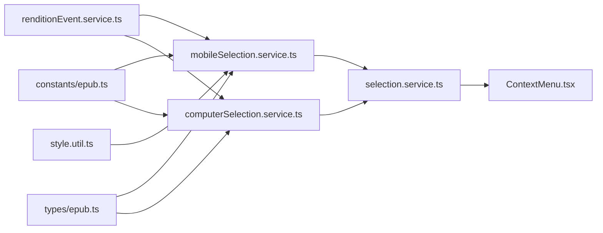

# Text Selection Handling

<cite>
**Referenced Files in This Document**
- [mobileSelection.service.ts](file://src/pages/EpubReader/services/mobileSelection.service.ts)
- [computerSelection.service.ts](file://src/pages/EpubReader/services/computerSelection.service.ts)
- [selection.service.ts](file://src/pages/EpubReader/services/selection.service.ts)
- [renditionEvent.service.ts](file://src/pages/EpubReader/services/renditionEvent.service.ts)
- [epub.ts](file://src/constants/epub.ts)
- [style.util.ts](file://src/pages/EpubReader/utils/style.util.ts)
- [epub.types.ts](file://src/types/epub.ts)
- [CHANGELOG.md](file://CHANGELOG.md)
- [ContextMenu.tsx](file://src/pages/EpubReader/components/ContextMenu.tsx)
</cite>

## Table of Contents
1. [Introduction](#introduction)
2. [Project Structure](#project-structure)
3. [Core Components](#core-components)
4. [Architecture Overview](#architecture-overview)
5. [Detailed Component Analysis](#detailed-component-analysis)
6. [Dependency Analysis](#dependency-analysis)
7. [Performance Considerations](#performance-considerations)
8. [Troubleshooting Guide](#troubleshooting-guide)
9. [Conclusion](#conclusion)

## Introduction
This document explains the dual text selection system that supports both mobile and computer input methods in the EPUB reader. It covers:
- Mobile selection implementation with touchState management, long-press detection using setTimeout, and three-phase touch handling (touchstart, touchmove, touchend)
- Computer selection relying on mouseup and touchend events from the EPUB rendition
- Shared selection processing via a unified handler that extracts words and context and triggers the AI context menu
- TOUCH_TIMING constants that govern selection behavior
- How selection coordinates are passed to the context menu for positioning
- Solutions for selection conflicts and race conditions between mobile and computer handlers

## Project Structure
The selection system spans several services and utilities:
- Mobile selection: mobileSelection.service.ts
- Computer selection: computerSelection.service.ts
- Unified selection processing: selection.service.ts
- Rendition event wiring: renditionEvent.service.ts
- Constants and types: epub.ts, epub.types.ts
- Mobile-specific styles: style.util.ts
- Context menu component: ContextMenu.tsx
- Changelog note on selection conflicts: CHANGELOG.md

**Diagram sources**
- [mobileSelection.service.ts](file://src/pages/EpubReader/services/mobileSelection.service.ts#L1-L231)
- [computerSelection.service.ts](file://src/pages/EpubReader/services/computerSelection.service.ts#L1-L20)
- [selection.service.ts](file://src/pages/EpubReader/services/selection.service.ts#L1-L169)
- [renditionEvent.service.ts](file://src/pages/EpubReader/services/renditionEvent.service.ts#L1-L60)
- [epub.ts](file://src/constants/epub.ts#L1-L61)
- [epub.types.ts](file://src/types/epub.ts#L1-L135)
- [style.util.ts](file://src/pages/EpubReader/utils/style.util.ts#L1-L41)
- [ContextMenu.tsx](file://src/pages/EpubReader/components/ContextMenu.tsx#L1-L714)

**Section sources**
- [renditionEvent.service.ts](file://src/pages/EpubReader/services/renditionEvent.service.ts#L1-L60)
- [mobileSelection.service.ts](file://src/pages/EpubReader/services/mobileSelection.service.ts#L1-L231)
- [computerSelection.service.ts](file://src/pages/EpubReader/services/computerSelection.service.ts#L1-L20)
- [selection.service.ts](file://src/pages/EpubReader/services/selection.service.ts#L1-L169)
- [epub.ts](file://src/constants/epub.ts#L1-L61)
- [epub.types.ts](file://src/types/epub.ts#L1-L135)
- [style.util.ts](file://src/pages/EpubReader/utils/style.util.ts#L1-L41)
- [ContextMenu.tsx](file://src/pages/EpubReader/components/ContextMenu.tsx#L1-L714)

## Core Components
- Mobile selection service: Manages touchState, long-press detection, and three-phase touch handling. It identifies target elements and creates caret ranges, extends the selection during movement, and completes selection with a delayed callback.
- Computer selection service: Listens for touchend and mouseup events from the EPUB rendition and triggers the same selection completion pipeline.
- Unified selection handler: Extracts words and context, validates collapsed selections near text, expands to word boundaries, and passes the result to the context menu.
- Constants and types: TOUCH_TIMING defines timing thresholds; TouchState and SelectInfo define runtime state and selection payload.
- Mobile styles: Ensures text selection is enabled and styled consistently on mobile.
- Context menu: Receives words and context, resolves iframe URLs with parameters, and positions itself in the viewport.

**Section sources**
- [mobileSelection.service.ts](file://src/pages/EpubReader/services/mobileSelection.service.ts#L1-L231)
- [computerSelection.service.ts](file://src/pages/EpubReader/services/computerSelection.service.ts#L1-L20)
- [selection.service.ts](file://src/pages/EpubReader/services/selection.service.ts#L1-L169)
- [epub.ts](file://src/constants/epub.ts#L1-L61)
- [epub.types.ts](file://src/types/epub.ts#L112-L135)
- [style.util.ts](file://src/pages/EpubReader/utils/style.util.ts#L1-L41)
- [ContextMenu.tsx](file://src/pages/EpubReader/components/ContextMenu.tsx#L1-L714)

## Architecture Overview
The selection architecture integrates with EPUB.js rendition events and routes selection outcomes to a shared handler that prepares the context menu payload.

**Diagram sources**
- [renditionEvent.service.ts](file://src/pages/EpubReader/services/renditionEvent.service.ts#L42-L58)
- [mobileSelection.service.ts](file://src/pages/EpubReader/services/mobileSelection.service.ts#L28-L101)
- [computerSelection.service.ts](file://src/pages/EpubReader/services/computerSelection.service.ts#L6-L19)
- [selection.service.ts](file://src/pages/EpubReader/services/selection.service.ts#L11-L25)
- [ContextMenu.tsx](file://src/pages/EpubReader/components/ContextMenu.tsx#L1-L714)

## Detailed Component Analysis

### Mobile Selection Implementation
The mobile selection service orchestrates three-phase touch handling and long-press detection:
- touchState tracks long-press state, start time, start position, and the active timer
- touchstart initializes state and schedules a long-press timer; if the timer fires, it starts selection at the touch point
- touchmove extends the selection while a long-press is active; it prevents default to avoid scrolling during selection
- touchend evaluates the duration and selection mode; it completes selection with a configurable delay and passes the last touch position for context menu placement

Key behaviors:
- Long-press detection uses setTimeout with TOUCH_TIMING.LONG_PRESS_DURATION
- Three-phase touch handling: touchstart, touchmove, touchend
- startSelection identifies the target element using elementFromPoint and creates a caret range at the touch coordinates
- extendSelection updates the selection range by recomputing a caret range at the current touch position and extending the original range’s end
- completeSelection delays execution by TOUCH_TIMING.SELECTION_DELAY before invoking the shared handler

**Diagram sources**
- [mobileSelection.service.ts](file://src/pages/EpubReader/services/mobileSelection.service.ts#L28-L101)
- [mobileSelection.service.ts](file://src/pages/EpubReader/services/mobileSelection.service.ts#L110-L170)
- [mobileSelection.service.ts](file://src/pages/EpubReader/services/mobileSelection.service.ts#L161-L183)
- [epub.ts](file://src/constants/epub.ts#L8-L13)

**Section sources**
- [mobileSelection.service.ts](file://src/pages/EpubReader/services/mobileSelection.service.ts#L16-L101)
- [mobileSelection.service.ts](file://src/pages/EpubReader/services/mobileSelection.service.ts#L110-L183)
- [epub.ts](file://src/constants/epub.ts#L8-L13)

### Computer Selection Implementation
Computer selection listens to rendition events:
- touchend triggers selection completion for touch-based desktop interactions
- mouseup triggers selection completion with the mouse coordinates for pointer-based desktop interactions

Both paths call the shared handler with the document and optional click position.

**Diagram sources**
- [computerSelection.service.ts](file://src/pages/EpubReader/services/computerSelection.service.ts#L6-L19)
- [selection.service.ts](file://src/pages/EpubReader/services/selection.service.ts#L11-L25)

**Section sources**
- [computerSelection.service.ts](file://src/pages/EpubReader/services/computerSelection.service.ts#L6-L19)

### Shared Selection Processing
The shared handler performs:
- Word boundary adjustment to expand the selection to whole words
- Collapsed selection validation against click proximity to avoid accidental context menu triggers on empty spaces
- Context extraction within the meaningful container (paragraph or block-like element)
- Robust context expansion by walking neighboring siblings up to a configured limit
- Final payload delivery to the caller (context menu)

**Diagram sources**
- [selection.service.ts](file://src/pages/EpubReader/services/selection.service.ts#L33-L149)

**Section sources**
- [selection.service.ts](file://src/pages/EpubReader/services/selection.service.ts#L11-L169)

### TOUCH_TIMING Constants
Timing constants control selection behavior:
- LONG_PRESS_DURATION: Threshold for long-press detection
- REGULAR_TAP_THRESHOLD: Threshold to distinguish tap vs. long press
- SELECTION_DELAY: Delay before finalizing selection to avoid race conditions
- CLICK_DELAY: Additional delay constant used elsewhere

These values are used by both mobile and computer selection services to ensure consistent behavior across input methods.

**Section sources**
- [epub.ts](file://src/constants/epub.ts#L8-L13)

### Mobile Styles Application
Mobile styles ensure text selection is enabled and styled consistently, including selection highlight colors and touch callout behavior.

**Section sources**
- [style.util.ts](file://src/pages/EpubReader/utils/style.util.ts#L1-L41)

### Context Menu Positioning and Payload
The context menu receives:
- words: the selected text
- context: surrounding text with the selection highlighted
- Optional click position for mobile taps to align the menu near the tap location

The context menu component:
- Receives words and context
- Resolves iframe URLs by injecting words and context parameters
- Computes viewport-aware layout and clamps position to the viewport
- Supports pinning, maximizing, dragging, and double-click toggling

**Diagram sources**
- [selection.service.ts](file://src/pages/EpubReader/services/selection.service.ts#L11-L25)
- [ContextMenu.tsx](file://src/pages/EpubReader/components/ContextMenu.tsx#L1-L714)

**Section sources**
- [ContextMenu.tsx](file://src/pages/EpubReader/components/ContextMenu.tsx#L1-L714)

## Dependency Analysis
- renditionEvent.service.ts detects device type and wires either mobile or computer selection handlers upon rendition rendered
- mobileSelection.service.ts depends on:
  - TOUCH_TIMING for timing
  - TouchState type for runtime state
  - selection.service.ts for final processing
  - style.util.ts for enabling selection
- computerSelection.service.ts depends on:
  - rendition events
  - selection.service.ts for final processing
- selection.service.ts depends on:
  - DOM selection APIs
  - word boundary logic and context expansion
- ContextMenu.tsx depends on:
  - SelectInfo payload
  - iframe URL resolution with injected parameters

**Diagram sources**
- [renditionEvent.service.ts](file://src/pages/EpubReader/services/renditionEvent.service.ts#L42-L58)
- [mobileSelection.service.ts](file://src/pages/EpubReader/services/mobileSelection.service.ts#L1-L231)
- [computerSelection.service.ts](file://src/pages/EpubReader/services/computerSelection.service.ts#L1-L20)
- [selection.service.ts](file://src/pages/EpubReader/services/selection.service.ts#L1-L169)
- [ContextMenu.tsx](file://src/pages/EpubReader/components/ContextMenu.tsx#L1-L714)
- [epub.ts](file://src/constants/epub.ts#L1-L61)
- [epub.types.ts](file://src/types/epub.ts#L112-L135)
- [style.util.ts](file://src/pages/EpubReader/utils/style.util.ts#L1-L41)

**Section sources**
- [renditionEvent.service.ts](file://src/pages/EpubReader/services/renditionEvent.service.ts#L21-L58)
- [mobileSelection.service.ts](file://src/pages/EpubReader/services/mobileSelection.service.ts#L1-L231)
- [computerSelection.service.ts](file://src/pages/EpubReader/services/computerSelection.service.ts#L1-L20)
- [selection.service.ts](file://src/pages/EpubReader/services/selection.service.ts#L1-L169)
- [ContextMenu.tsx](file://src/pages/EpubReader/components/ContextMenu.tsx#L1-L714)
- [epub.ts](file://src/constants/epub.ts#L1-L61)
- [epub.types.ts](file://src/types/epub.ts#L112-L135)
- [style.util.ts](file://src/pages/EpubReader/utils/style.util.ts#L1-L41)

## Performance Considerations
- Touch handling uses passive: false to allow preventDefault during move; ensure minimal DOM reads/writes inside touchmove to avoid jank
- Selection extension recalculates caret ranges; batch updates and avoid frequent reflows
- Context extraction walks DOM nodes; limit neighbor expansion to reasonable bounds to prevent heavy operations
- Delayed completion (SELECTION_DELAY) reduces race conditions and allows UI to settle

[No sources needed since this section provides general guidance]

## Troubleshooting Guide
Common issues and solutions:
- Stale selection and navigation-zone conflicts: The changelog notes fixes for stale text selection and navigation-zone conflicts. Ensure that selection handlers are cleaned up and that touchend/mouseup events are not prematurely consumed by other components.
- Race conditions between mobile and computer handlers:
  - Use the SELECTION_DELAY to decouple immediate UI updates from selection completion
  - Ensure only one handler finalizes selection at a time; rely on the shared handler to validate and process the selection
- Click proximity for collapsed selections:
  - The shared handler checks distance to the caret rect for collapsed selections; if the click is too far from text, it ignores the selection to avoid accidental context menu triggers
- Long-press vs. tap ambiguity:
  - Use REGULAR_TAP_THRESHOLD to differentiate taps from long presses; adjust TOUCH_TIMING if needed for your UX

**Section sources**
- [CHANGELOG.md](file://CHANGELOG.md#L33-L36)
- [selection.service.ts](file://src/pages/EpubReader/services/selection.service.ts#L33-L79)
- [epub.ts](file://src/constants/epub.ts#L8-L13)

## Conclusion
The dual selection system provides robust text selection across mobile and computer input methods. Mobile selection uses long-press detection and three-phase touch handling, while computer selection responds to touchend and mouseup events. Both paths converge on a shared selection processor that extracts words and context, expands to word boundaries, and feeds the context menu. TOUCH_TIMING constants standardize behavior, and mobile styles ensure consistent selection visuals. The changelog confirms fixes for stale selection and navigation conflicts, emphasizing the importance of careful event handling and cleanup.