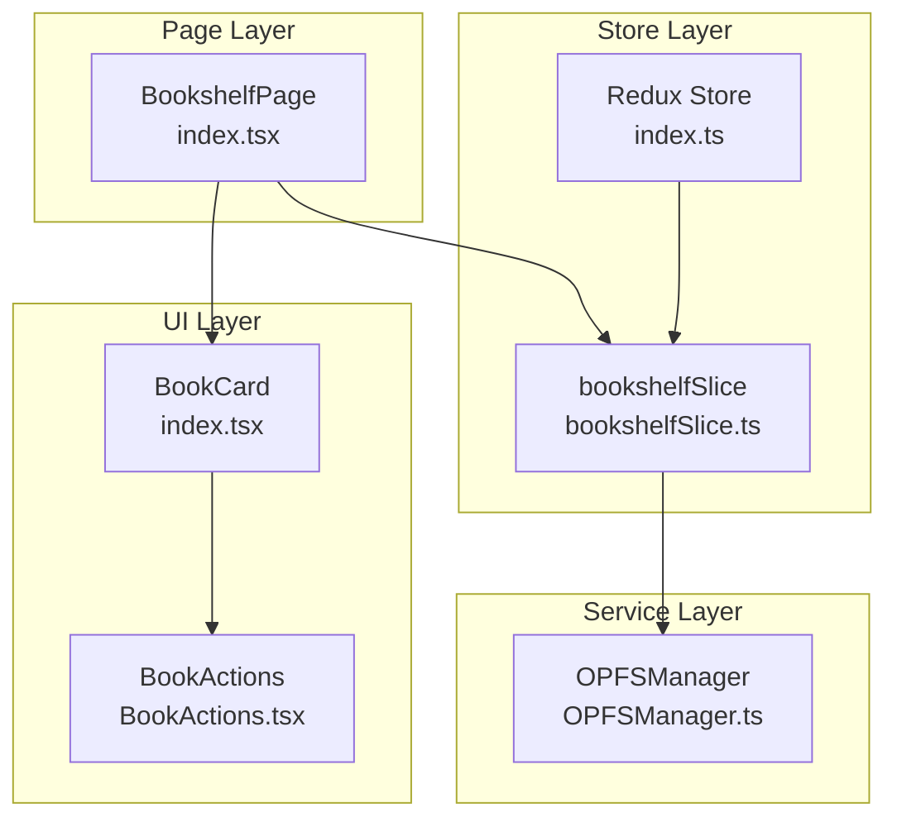
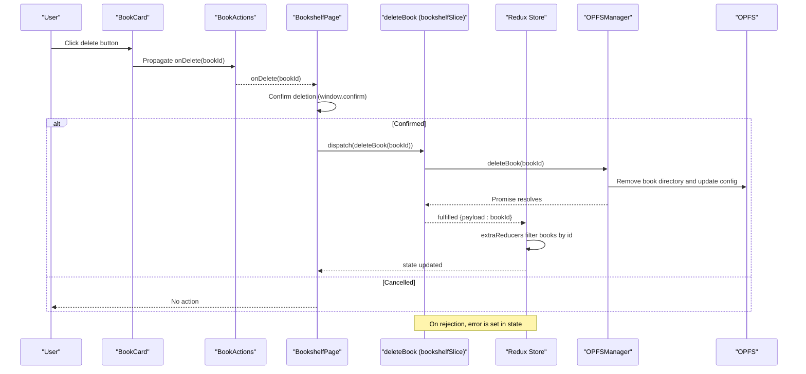
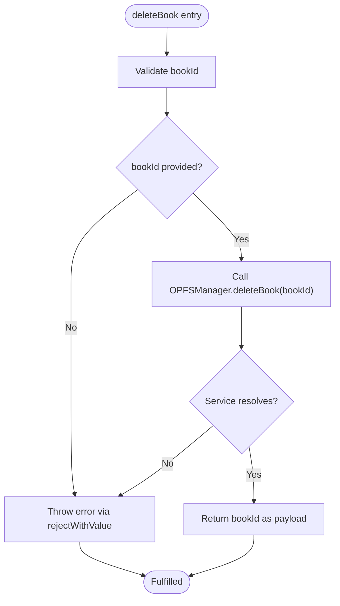
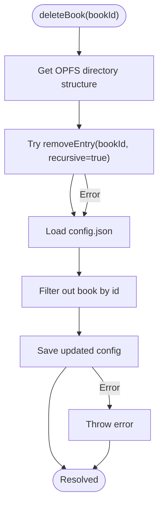
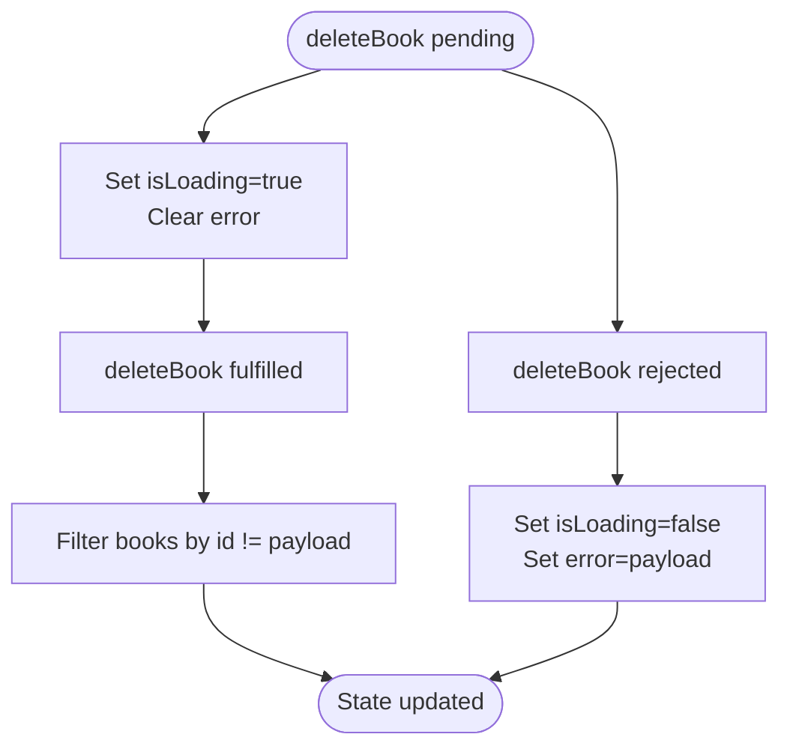
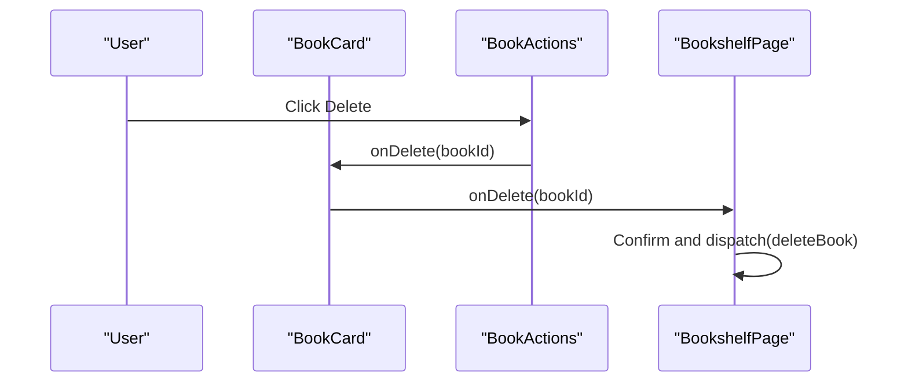
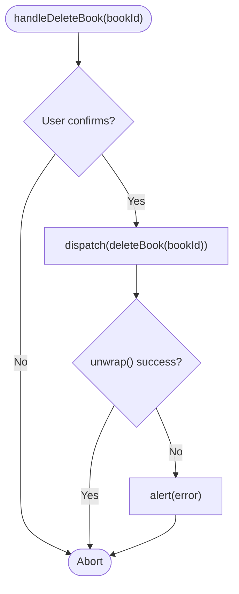
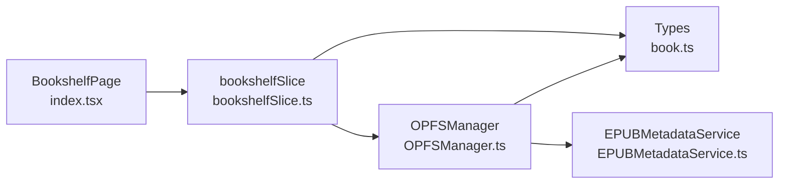

# Book Deletion Management

<cite>
**Referenced Files in This Document**
- [bookshelfSlice.ts](file://src/store/slices/bookshelfSlice.ts)
- [OPFSManager.ts](file://src/services/OPFSManager.ts)
- [index.tsx](file://src/pages/HomePage/index.tsx)
- [index.tsx](file://src/components/BookCard/index.tsx)
- [BookActions.tsx](file://src/components/BookCard/BookActions.tsx)
- [index.ts](file://src/store/index.ts)
- [book.ts](file://src/types/book.ts)
</cite>

## Table of Contents
1. [Introduction](#introduction)
2. [Project Structure](#project-structure)
3. [Core Components](#core-components)
4. [Architecture Overview](#architecture-overview)
5. [Detailed Component Analysis](#detailed-component-analysis)
6. [Dependency Analysis](#dependency-analysis)
7. [Performance Considerations](#performance-considerations)
8. [Troubleshooting Guide](#troubleshooting-guide)
9. [Conclusion](#conclusion)

## Introduction
This document explains the end-to-end book deletion workflow in the application. It focuses on how the deleteBook async thunk acts as the primary interface for deletion, validates the book ID, interacts with OPFSManager to remove the file from the Origin Private File System, updates the Redux state, and displays errors to the user. It also covers how the BookCard component triggers deletion via a button action and outlines edge cases such as attempting to delete a currently open book, along with guidance on user confirmation patterns.

## Project Structure
The deletion workflow spans several layers:
- UI layer: BookCard and BookActions components render the book card and action buttons.
- Page layer: BookshelfPage orchestrates user interactions and dispatches Redux actions.
- Store layer: bookshelfSlice defines the deleteBook async thunk and manages state transitions.
- Service layer: OPFSManager performs file system operations in OPFS.

**Diagram sources**
- [index.tsx](file://src/components/BookCard/index.tsx#L1-L87)
- [BookActions.tsx](file://src/components/BookCard/BookActions.tsx#L1-L67)
- [index.tsx](file://src/pages/HomePage/index.tsx#L1-L200)
- [bookshelfSlice.ts](file://src/store/slices/bookshelfSlice.ts#L58-L76)
- [index.ts](file://src/store/index.ts#L1-L23)
- [OPFSManager.ts](file://src/services/OPFSManager.ts#L242-L261)

**Section sources**
- [index.tsx](file://src/components/BookCard/index.tsx#L1-L87)
- [BookActions.tsx](file://src/components/BookCard/BookActions.tsx#L1-L67)
- [index.tsx](file://src/pages/HomePage/index.tsx#L1-L200)
- [bookshelfSlice.ts](file://src/store/slices/bookshelfSlice.ts#L58-L76)
- [index.ts](file://src/store/index.ts#L1-L23)
- [OPFSManager.ts](file://src/services/OPFSManager.ts#L242-L261)

## Core Components
- deleteBook async thunk: Validates the book ID and delegates deletion to OPFSManager, returning the deleted ID on fulfillment.
- bookshelfSlice: Manages loading/error states and filters the books array upon fulfilled deletion.
- OPFSManager.deleteBook: Removes the book directory and updates the config to remove the book metadata.
- BookCard and BookActions: Render the delete button and propagate the deletion event to the parent page handler.
- BookshelfPage: Triggers deletion via dispatch and handles user confirmation and error feedback.

**Section sources**
- [bookshelfSlice.ts](file://src/store/slices/bookshelfSlice.ts#L58-L76)
- [bookshelfSlice.ts](file://src/store/slices/bookshelfSlice.ts#L148-L163)
- [OPFSManager.ts](file://src/services/OPFSManager.ts#L242-L261)
- [index.tsx](file://src/components/BookCard/index.tsx#L1-L87)
- [BookActions.tsx](file://src/components/BookCard/BookActions.tsx#L1-L67)
- [index.tsx](file://src/pages/HomePage/index.tsx#L50-L58)

## Architecture Overview
The deletion flow follows a predictable sequence:
1. The user clicks the delete action in the BookCard.
2. The page handler dispatches deleteBook with the book ID.
3. The thunk validates the ID and calls OPFSManager.deleteBook.
4. On fulfillment, the slice filters the books array to remove the deleted book.
5. On rejection, the slice sets an error message displayed to the user.

**Diagram sources**
- [index.tsx](file://src/components/BookCard/index.tsx#L36-L40)
- [BookActions.tsx](file://src/components/BookCard/BookActions.tsx#L55-L63)
- [index.tsx](file://src/pages/HomePage/index.tsx#L50-L58)
- [bookshelfSlice.ts](file://src/store/slices/bookshelfSlice.ts#L58-L76)
- [bookshelfSlice.ts](file://src/store/slices/bookshelfSlice.ts#L148-L163)
- [OPFSManager.ts](file://src/services/OPFSManager.ts#L242-L261)

## Detailed Component Analysis

### deleteBook Async Thunk
- Purpose: Centralized deletion interface that validates the book ID and invokes OPFSManager.deleteBook.
- Validation: Throws an error if the book ID is falsy.
- Fulfillment: Returns the deleted book ID to trigger state updates.
- Rejection: Uses rejectWithValue to propagate the error message to the slice.

**Diagram sources**
- [bookshelfSlice.ts](file://src/store/slices/bookshelfSlice.ts#L58-L76)
- [OPFSManager.ts](file://src/services/OPFSManager.ts#L242-L261)

**Section sources**
- [bookshelfSlice.ts](file://src/store/slices/bookshelfSlice.ts#L58-L76)

### OPFSManager.deleteBook
- Purpose: Deletes the entire book directory and updates the config to remove the book metadata.
- Behavior:
  - Attempts to remove the book directory recursively.
  - Loads the current config, filters out the book by ID, and saves the updated config.
- Robustness: Ignores missing directories and rethrows errors with a descriptive message.

**Diagram sources**
- [OPFSManager.ts](file://src/services/OPFSManager.ts#L242-L261)

**Section sources**
- [OPFSManager.ts](file://src/services/OPFSManager.ts#L242-L261)

### bookshelfSlice State Updates
- Pending: Sets loading to true and clears previous errors.
- Fulfilled: Filters the books array to exclude the deleted book ID.
- Rejected: Sets loading to false and stores the error message.

**Diagram sources**
- [bookshelfSlice.ts](file://src/store/slices/bookshelfSlice.ts#L148-L163)

**Section sources**
- [bookshelfSlice.ts](file://src/store/slices/bookshelfSlice.ts#L148-L163)

### UI Trigger: BookCard and BookActions
- BookCard renders the book card and passes onDelete to BookActions.
- BookActions renders the delete button and calls onDelete with the book ID.
- BookCard stops event propagation to prevent unintended card click behavior.

**Diagram sources**
- [index.tsx](file://src/components/BookCard/index.tsx#L36-L40)
- [BookActions.tsx](file://src/components/BookCard/BookActions.tsx#L55-L63)
- [index.tsx](file://src/pages/HomePage/index.tsx#L50-L58)

**Section sources**
- [index.tsx](file://src/components/BookCard/index.tsx#L1-L87)
- [BookActions.tsx](file://src/components/BookCard/BookActions.tsx#L1-L67)
- [index.tsx](file://src/pages/HomePage/index.tsx#L50-L58)

### Page Handler: BookshelfPage
- Implements the deletion flow:
  - Prompts the user for confirmation.
  - Dispatches deleteBook and unwraps the result.
  - Alerts on failure and relies on slice error state for display.

**Diagram sources**
- [index.tsx](file://src/pages/HomePage/index.tsx#L50-L58)

**Section sources**
- [index.tsx](file://src/pages/HomePage/index.tsx#L50-L58)

### Edge Cases and Guidance
- Attempting to delete a currently open book:
  - The current UI navigates to the reader on card click. If a book is actively being read, deleting it while open may lead to unexpected behavior. Consider disabling the delete action when the book is the current reader target or preventing navigation until deletion completes.
- User confirmation:
  - The page uses a browser confirmation dialog before dispatching the thunk. This is a simple UX pattern; consider a modal dialog for richer messaging and undo options.
- Error handling:
  - The slice sets an error on rejection. The page alerts on unwrap failure. Consider centralizing error display via a toast/notification system and surfacing the error in the UI (e.g., a banner or snackbar) for better discoverability.

**Section sources**
- [index.tsx](file://src/pages/HomePage/index.tsx#L50-L58)
- [bookshelfSlice.ts](file://src/store/slices/bookshelfSlice.ts#L148-L163)

## Dependency Analysis
- BookshelfPage depends on:
  - bookshelfSlice for dispatching deleteBook.
  - Redux store for state selection and dispatch.
- bookshelfSlice depends on:
  - OPFSManager for file system operations.
  - Types for BookMetadata and BookshelfState.
- OPFSManager depends on:
  - EPUBMetadataService for metadata extraction (used elsewhere).
  - File system utilities for safe directory/file operations.

**Diagram sources**
- [index.tsx](file://src/pages/HomePage/index.tsx#L1-L200)
- [bookshelfSlice.ts](file://src/store/slices/bookshelfSlice.ts#L58-L76)
- [OPFSManager.ts](file://src/services/OPFSManager.ts#L1-L50)
- [book.ts](file://src/types/book.ts#L1-L116)

**Section sources**
- [index.tsx](file://src/pages/HomePage/index.tsx#L1-L200)
- [bookshelfSlice.ts](file://src/store/slices/bookshelfSlice.ts#L58-L76)
- [OPFSManager.ts](file://src/services/OPFSManager.ts#L1-L50)
- [book.ts](file://src/types/book.ts#L1-L116)

## Performance Considerations
- Deletion is a synchronous operation in the UI thread; however, the heavy lifting occurs in OPFSManager, which performs directory removal and config updates. These operations are generally fast but depend on browser OPFS performance.
- Filtering the books array on fulfillment is O(n); given typical library sizes, this is negligible.
- Consider debouncing or batching UI updates if many deletions occur rapidly.

## Troubleshooting Guide
- OPFS not supported:
  - The slice checks for OPFS support during initialization. If unsupported, an error is set. Ensure the browser supports OPFS.
- Invalid book ID:
  - The thunk throws an error if the ID is falsy. Verify that the BookCard passes a valid ID.
- Deletion fails:
  - OPFSManager wraps errors with descriptive messages. Check the error state in the slice and surface it to the user.
- UI does not reflect deletion:
  - Ensure the fulfilled branch filters the books array by the returned ID. Verify that the key used in the grid matches the book ID.

**Section sources**
- [bookshelfSlice.ts](file://src/store/slices/bookshelfSlice.ts#L114-L124)
- [bookshelfSlice.ts](file://src/store/slices/bookshelfSlice.ts#L148-L163)
- [OPFSManager.ts](file://src/services/OPFSManager.ts#L242-L261)

## Conclusion
The book deletion workflow is a cohesive pipeline: BookCard triggers deletion, BookshelfPage confirms and dispatches deleteBook, the thunk validates the ID and calls OPFSManager, and the slice updates state by filtering the books array. Errors are propagated to the UI via the slice’s error field. To improve robustness, consider disabling deletion for the currently open book, enhancing confirmation UX, and centralizing error notifications.