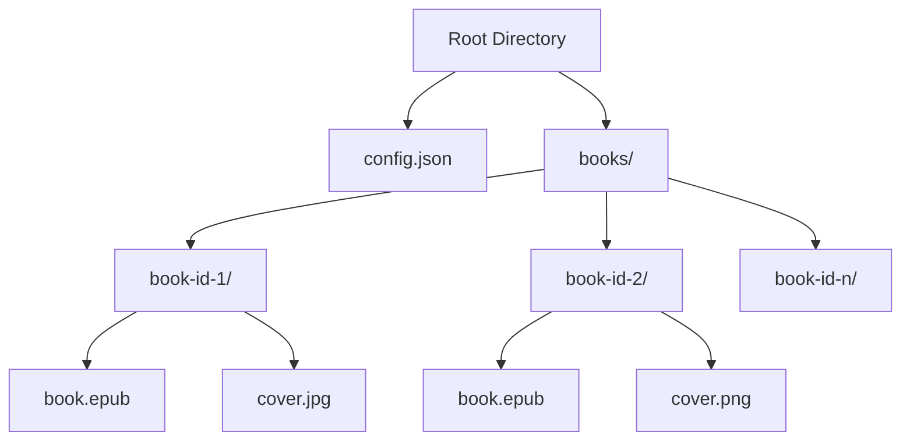
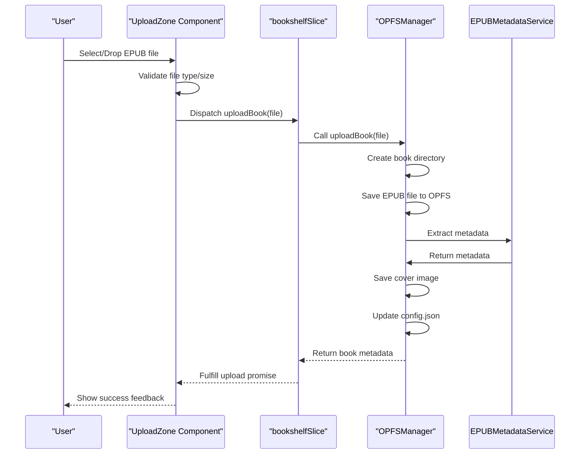
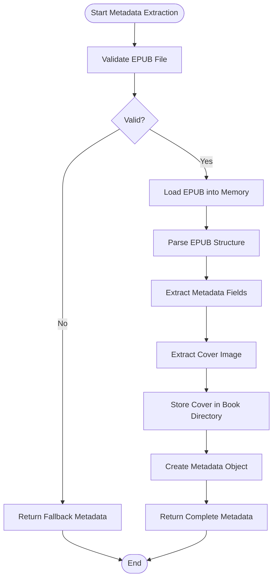
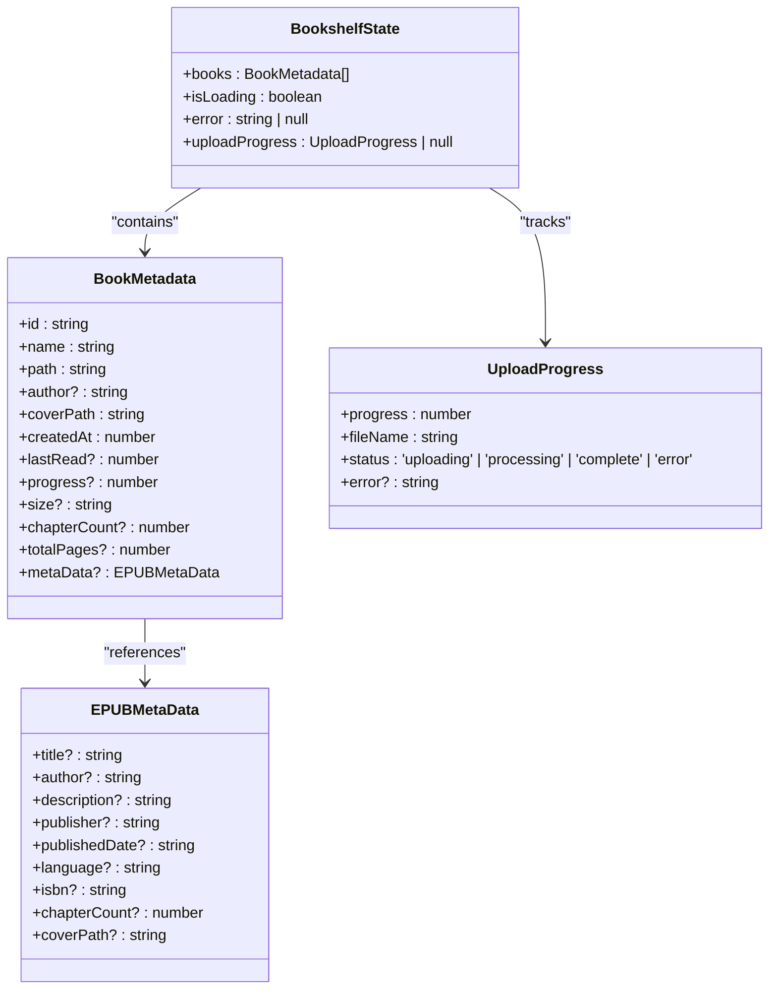
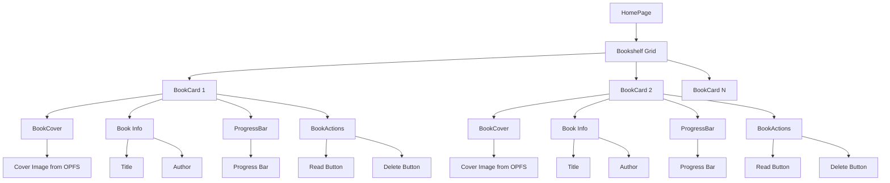
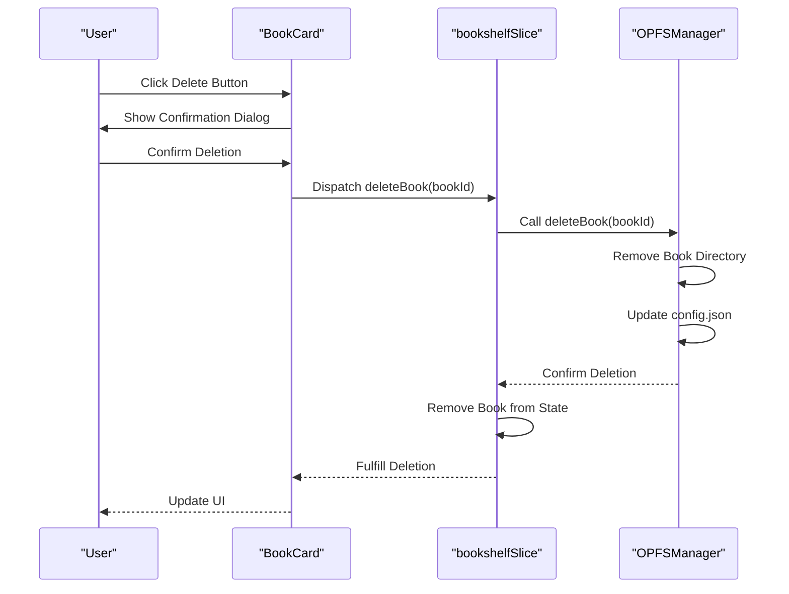

# Book Management System

<cite>
**Referenced Files in This Document**   
- [UploadZone/index.tsx](file://src/components/UploadZone/index.tsx)
- [EPUBMetadataService.ts](file://src/services/EPUBMetadataService.ts)
- [bookshelfSlice.ts](file://src/store/slices/bookshelfSlice.ts)
- [BookCard/index.tsx](file://src/components/BookCard/index.tsx)
- [HomePage/index.tsx](file://src/pages/HomePage/index.tsx)
- [OPFSManager.ts](file://src/services/OPFSManager.ts)
- [epubValidation.ts](file://src/utils/epubValidation.ts)
- [book.ts](file://src/types/book.ts)
- [useBookDisplayData.ts](file://src/components/BookCard/hooks/useBookDisplayData.ts)
- [BookCover.tsx](file://src/components/BookCard/BookCover.tsx)
</cite>

## Table of Contents
1. [Introduction](#introduction)
2. [OPFS-Based Storage Mechanism](#opfs-based-storage-mechanism)
3. [Book Upload Process](#book-upload-process)
4. [Metadata Extraction](#metadata-extraction)
5. [Redux State Management](#redux-state-management)
6. [Bookshelf Display](#bookshelf-display)
7. [Book Deletion and Error Handling](#book-deletion-and-error-handling)
8. [Performance Considerations](#performance-considerations)

## Introduction
The book management system provides a comprehensive solution for uploading, storing, and organizing EPUB books in a web application. Built on modern web technologies, the system leverages the Origin Private File System (OPFS) API for persistent offline storage, enabling users to maintain their digital library directly within the browser. The architecture combines React for UI components, Redux Toolkit for state management, and epub.js for EPUB file processing, creating a seamless reading experience. This document details the core mechanisms that enable book upload, storage, organization, and display within the application.

## OPFS-Based Storage Mechanism
The application utilizes the Origin Private File System (OPFS) API to provide persistent, offline-capable storage for EPUB books directly within the browser. This modern web API enables the application to store books securely in a private, origin-scoped file system that persists across sessions and provides sufficient storage capacity for extensive digital libraries.

The OPFSManager service orchestrates all file system operations, establishing a structured directory hierarchy with a root directory containing a configuration file (config.json) and a dedicated "books" subdirectory for storing individual book files. Each book is stored in its own UUID-named directory within the books directory, containing the original EPUB file and any extracted assets such as cover images.

**Diagram sources**
- [OPFSManager.ts](file://src/services/OPFSManager.ts#L38-L57)
- [book.ts](file://src/types/book.ts#L68-L77)

**Section sources**
- [OPFSManager.ts](file://src/services/OPFSManager.ts#L1-L510)
- [book.ts](file://src/types/book.ts#L68-L116)

## Book Upload Process
The book upload process begins with the UploadZone component, which provides both drag-and-drop and file picker interfaces for users to select EPUB files. When a file is selected or dropped, the system initiates a validation process to ensure the file meets the required criteria before proceeding with storage.

The upload workflow follows a structured sequence: file selection, validation, metadata extraction, OPFS storage, and state update. The UploadZone component handles user interaction and delegates the core upload logic to the Redux store via the uploadBook async thunk. This thunk orchestrates the entire upload process, ensuring proper error handling and state management throughout.

**Diagram sources**
- [UploadZone/index.tsx](file://src/components/UploadZone/index.tsx#L20-L129)
- [bookshelfSlice.ts](file://src/store/slices/bookshelfSlice.ts#L40-L56)
- [OPFSManager.ts](file://src/services/OPFSManager.ts#L126-L219)

**Section sources**
- [UploadZone/index.tsx](file://src/components/UploadZone/index.tsx#L1-L129)
- [epubValidation.ts](file://src/utils/epubValidation.ts#L28-L61)

## Metadata Extraction
The system extracts comprehensive metadata from uploaded EPUB files using the EPUBMetadataService, which leverages the epub.js library to parse and analyze the EPUB structure. This service extracts essential information such as title, author, description, publisher, publication date, language, ISBN, chapter count, and cover image path, enriching the user experience with detailed book information.

Metadata extraction occurs during the upload process, where the EPUB file is loaded into memory and parsed to extract its metadata. The service implements robust error handling, providing fallback values when metadata extraction fails, ensuring that books remain accessible even with corrupted or incomplete metadata. Cover images are extracted and stored separately in the book's directory, with their paths recorded in the metadata for efficient retrieval.

**Diagram sources**
- [EPUBMetadataService.ts](file://src/services/EPUBMetadataService.ts#L11-L63)
- [book.ts](file://src/types/book.ts#L6-L25)

**Section sources**
- [EPUBMetadataService.ts](file://src/services/EPUBMetadataService.ts#L1-L177)
- [book.ts](file://src/types/book.ts#L6-L55)

## Redux State Management
The bookshelfSlice manages the application state for the book collection using Redux Toolkit, providing a centralized store for book data, loading states, and error conditions. The slice maintains a BookshelfState that tracks all uploaded books, current loading status, error messages, and upload progress, enabling consistent state management across the application.

The slice exposes several async thunks for key operations: initializeBookshelf for loading books on application startup, uploadBook for adding new books, deleteBook for removing books, and loadBooks for refreshing the book list. These thunks handle the asynchronous operations and automatically update the state based on their lifecycle (pending, fulfilled, rejected), ensuring the UI reflects the current state of operations.

**Diagram sources**
- [bookshelfSlice.ts](file://src/store/slices/bookshelfSlice.ts#L91-L105)
- [book.ts](file://src/types/book.ts#L27-L105)

**Section sources**
- [bookshelfSlice.ts](file://src/store/slices/bookshelfSlice.ts#L1-L189)
- [book.ts](file://src/types/book.ts#L27-L105)

## Bookshelf Display
The HomePage component renders the bookshelf interface, displaying all uploaded books in a responsive grid layout using BookCard components. Each BookCard presents a book's cover, title, author, reading progress, and size information, providing a visually appealing and informative representation of the user's library.

The BookCard component leverages the useBookDisplayData hook to format and provide fallback values for book information, ensuring consistent presentation even when metadata is incomplete. The card includes interactive elements for reading and deleting books, with proper event handling to prevent unintended actions. Cover images are loaded asynchronously from OPFS and displayed with appropriate loading states and error handling.

**Diagram sources**
- [HomePage/index.tsx](file://src/pages/HomePage/index.tsx#L22-L292)
- [BookCard/index.tsx](file://src/components/BookCard/index.tsx#L22-L87)

**Section sources**
- [HomePage/index.tsx](file://src/pages/HomePage/index.tsx#L1-L292)
- [BookCard/index.tsx](file://src/components/BookCard/index.tsx#L1-L87)
- [useBookDisplayData.ts](file://src/components/BookCard/hooks/useBookDisplayData.ts#L1-L33)

## Book Deletion and Error Handling
The book deletion workflow provides users with a confirmation dialog before permanently removing a book from their library. When a user initiates deletion through the BookActions component, the application displays a browser confirmation dialog to prevent accidental deletions. Upon confirmation, the deleteBook async thunk is dispatched, which coordinates the removal of the book from both OPFS storage and the Redux state.

Error handling is implemented throughout the book management system, with comprehensive validation at multiple levels. The epubValidation utility provides centralized validation for EPUB files, checking file extensions, size limits, and MIME types. The OPFSManager service includes error recovery mechanisms for corrupted configuration files, automatically recreating default configurations when necessary. The application displays user-friendly error messages in the UI, allowing users to dismiss errors and continue using the application.

**Diagram sources**
- [BookActions.tsx](file://src/components/BookCard/BookActions.tsx#L19-L67)
- [bookshelfSlice.ts](file://src/store/slices/bookshelfSlice.ts#L58-L76)
- [OPFSManager.ts](file://src/services/OPFSManager.ts#L242-L261)

**Section sources**
- [BookActions.tsx](file://src/components/BookCard/BookActions.tsx#L1-L67)
- [BookCover.tsx](file://src/components/BookCard/BookCover.tsx#L1-L109)
- [bookshelfSlice.ts](file://src/store/slices/bookshelfSlice.ts#L58-L76)

## Performance Considerations
The system addresses performance considerations for managing large book collections through several optimization strategies. The OPFS storage mechanism provides efficient file access with minimal performance overhead, while the application implements lazy loading of cover images to reduce initial load times. The getStorageStats function enables monitoring of storage usage, helping users manage their library size within browser storage limits.

Storage quota limitations are mitigated through efficient file organization and the use of OPFS, which typically provides generous storage capacity compared to traditional localStorage or IndexedDB. The application validates file sizes during upload, preventing excessively large files from consuming disproportionate storage space. For very large collections, the system could be extended with pagination or virtualized rendering to maintain responsive performance.

**Section sources**
- [OPFSManager.ts](file://src/services/OPFSManager.ts#L368-L376)
- [epubValidation.ts](file://src/utils/epubValidation.ts#L11-L12)
- [constants/epub.ts](file://src/constants/epub.ts#L31-L39)