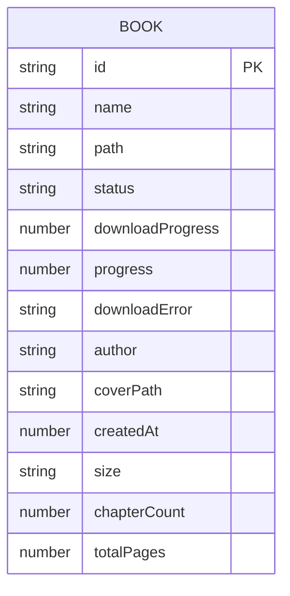
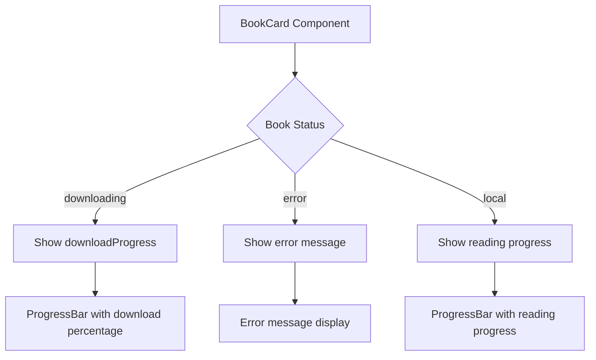

# Download Progress Tracking

<cite>
**Referenced Files in This Document**   
- [ProgressBar.tsx](file://src/components/BookCard/ProgressBar.tsx)
- [useBookDisplayData.ts](file://src/components/BookCard/hooks/useBookDisplayData.ts)
- [BookCard.tsx](file://src/components/BookCard/index.tsx)
- [book.ts](file://src/types/book.ts)
</cite>

## Table of Contents
1. [Introduction](#introduction)
2. [Progress Tracking Implementation](#progress-tracking-implementation)
3. [Data Structure and Types](#data-structure-and-types)
4. [User Interface Components](#user-interface-components)
5. [State Management](#state-management)

## Introduction
This document details the download progress tracking system in the EPUB reader application. The system provides visual feedback for book download operations, handles different book states (local, downloading, error), and maintains consistent progress display across the application. The implementation leverages React components, TypeScript interfaces, and state management patterns to deliver a seamless user experience.

## Progress Tracking Implementation

The download progress tracking system is implemented through a combination of React components and state management logic. The core functionality revolves around displaying progress information for books that are being downloaded from remote sources, particularly preset books that are automatically fetched.

The system differentiates between various book states and displays appropriate progress information:
- For books currently being downloaded, it shows the download progress percentage
- For completed books, it shows the reading progress percentage
- For books with download errors, it displays error information

The implementation uses a dedicated hook to determine which progress value to display based on the book's current status.

**Section sources**
- [useBookDisplayData.ts](file://src/components/BookCard/hooks/useBookDisplayData.ts#L25-L27)
- [BookCard.tsx](file://src/components/BookCard/index.tsx#L30)

## Data Structure and Types

The download progress tracking system relies on specific data structures defined in the application's type system. The BookMetadata interface contains properties that support progress tracking for both downloading and reading states.

Key properties include:
- `status`: Indicates the current state of the book ('local', 'downloading', 'error')
- `downloadProgress`: Stores the current download progress percentage (0-100) for books being downloaded
- `progress`: Stores the reading progress percentage for completed books
- `downloadError`: Contains error information if a download fails

These properties work together to provide a comprehensive view of a book's state and progress.

**Diagram sources**
- [book.ts](file://src/types/book.ts#L55-L64)

## User Interface Components

The user interface for download progress tracking consists of reusable React components that provide visual feedback to users. The primary component is the ProgressBar, which displays progress information in a consistent manner throughout the application.

The ProgressBar component accepts several props to customize its appearance and behavior:
- `progress`: The progress percentage to display (0-100)
- `showPercentage`: Whether to display the percentage text
- `color`: Custom color for the progress bar
- `hideWhenZero`: Whether to hide the bar when progress is zero

The component includes accessibility features such as ARIA attributes and handles input validation to ensure the progress value is within the valid range.

**Diagram sources**
- [ProgressBar.tsx](file://src/components/BookCard/ProgressBar.tsx#L4-L15)
- [BookCard.tsx](file://src/components/BookCard/index.tsx#L28-L31)

## State Management

The state management for download progress is integrated into the application's Redux store. The BookshelfState interface includes properties that track the overall download state of the application, including the number of active downloads.

When a book is being downloaded, its status is set to 'downloading' and the downloadProgress property is updated periodically as the download progresses. If the download encounters an error, the status is set to 'error' and the downloadError property is populated with the error message.

The system also tracks the number of active downloads through the downloadingCount property in the BookshelfState, allowing the application to display global download status information.

**Section sources**
- [book.ts](file://src/types/book.ts#L110-L122)
- [BookCard.tsx](file://src/components/BookCard/index.tsx#L28-L31)