# Metadata Extraction System

<cite>
**Referenced Files in This Document**
- [EPUBMetadataService.ts](file://src/services/EPUBMetadataService.ts)
- [fileOperations.ts](file://src/utils/fileOperations.ts)
- [logger.ts](file://src/utils/logger.ts)
- [book.ts](file://src/types/book.ts)
- [OPFSManager.ts](file://src/services/OPFSManager.ts)
- [epubValidation.ts](file://src/utils/epubValidation.ts)
- [epub.ts](file://src/constants/epub.ts)
- [UploadZone/index.tsx](file://src/components/UploadZone/index.tsx)
- [HomePage/index.tsx](file://src/pages/HomePage/index.tsx)
- [bookshelfSlice.ts](file://src/store/slices/bookshelfSlice.ts)
- [BookCard/index.tsx](file://src/components/BookCard/index.tsx)
- [useBookDisplayData.ts](file://src/components/BookCard/hooks/useBookDisplayData.ts)
</cite>

## Table of Contents
1. [Introduction](#introduction)
2. [Project Structure](#project-structure)
3. [Core Components](#core-components)
4. [Architecture Overview](#architecture-overview)
5. [Detailed Component Analysis](#detailed-component-analysis)
6. [Dependency Analysis](#dependency-analysis)
7. [Performance Considerations](#performance-considerations)
8. [Troubleshooting Guide](#troubleshooting-guide)
9. [Conclusion](#conclusion)
10. [Appendices](#appendices)

## Introduction
This document explains the metadata extraction system that parses EPUB files to populate book information. It focuses on how extractMetadata uses epubjs to load an EPUB from an ArrayBuffer, extract core metadata (title, author, publisher, publication date, language, ISBN), derive chapter count from the spine, and obtain a cover image URL via book.coverUrl(). It also documents the fallback mechanism for missing or invalid metadata, how formatAuthors handles both string and array inputs, and how extractISBN identifies ISBN identifiers. Finally, it describes the integration with performFileOperation for resilient execution and logging via the logger utility, and demonstrates how extracted metadata is used to create BookMetadata objects stored in the bookshelf state.

## Project Structure
The metadata extraction system spans several modules:
- Services: EPUB parsing and metadata extraction
- Utilities: File operation wrappers and logging
- Types: Strongly typed metadata interfaces
- OPFS Manager: File storage and retrieval for EPUBs and covers
- Validation: EPUB file validation helpers
- UI Integration: Upload zone, bookshelf slice, and display components

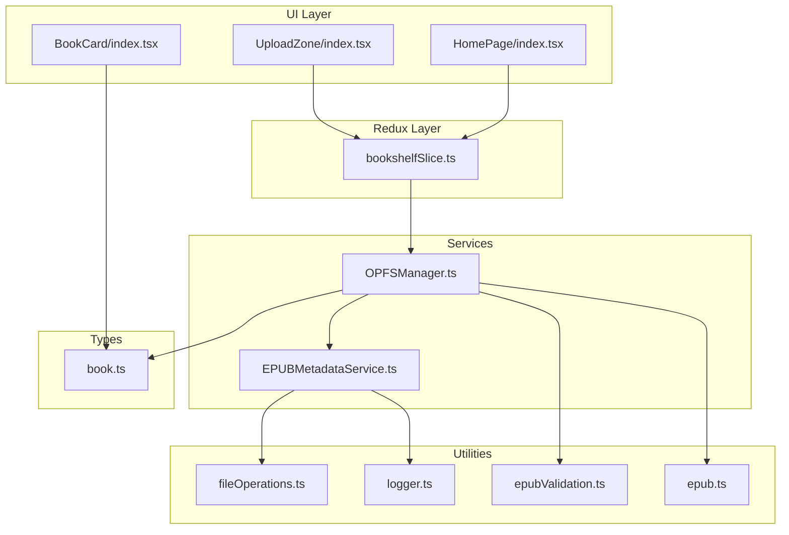

**Diagram sources**
- [UploadZone/index.tsx](file://src/components/UploadZone/index.tsx#L1-L129)
- [HomePage/index.tsx](file://src/pages/HomePage/index.tsx#L1-L36)
- [bookshelfSlice.ts](file://src/store/slices/bookshelfSlice.ts#L1-L189)
- [OPFSManager.ts](file://src/services/OPFSManager.ts#L1-L510)
- [EPUBMetadataService.ts](file://src/services/EPUBMetadataService.ts#L1-L177)
- [fileOperations.ts](file://src/utils/fileOperations.ts#L1-L91)
- [logger.ts](file://src/utils/logger.ts#L1-L19)
- [epubValidation.ts](file://src/utils/epubValidation.ts#L1-L77)
- [epub.ts](file://src/constants/epub.ts#L1-L61)
- [book.ts](file://src/types/book.ts#L1-L116)

**Section sources**
- [EPUBMetadataService.ts](file://src/services/EPUBMetadataService.ts#L1-L177)
- [OPFSManager.ts](file://src/services/OPFSManager.ts#L120-L219)
- [book.ts](file://src/types/book.ts#L1-L116)

## Core Components
- EPUBMetadataService: Centralizes EPUB metadata extraction, cover extraction, and fallback logic.
- OPFSManager: Manages EPUB file storage, cover extraction, and BookMetadata assembly.
- fileOperations: Wraps operations with consistent error handling and logging.
- logger: Standardized logging across the app.
- epubValidation and constants: Validate EPUB files and define limits.
- Types: Define EPUBMetaData and BookMetadata interfaces used throughout.

Key responsibilities:
- Extract core metadata from EPUB container metadata
- Derive chapter count from spine length
- Extract cover image URL and blob for storage
- Provide fallback values when metadata is missing
- Integrate with Redux for state updates

**Section sources**
- [EPUBMetadataService.ts](file://src/services/EPUBMetadataService.ts#L1-L177)
- [OPFSManager.ts](file://src/services/OPFSManager.ts#L120-L219)
- [fileOperations.ts](file://src/utils/fileOperations.ts#L1-L91)
- [logger.ts](file://src/utils/logger.ts#L1-L19)
- [epubValidation.ts](file://src/utils/epubValidation.ts#L1-L77)
- [epub.ts](file://src/constants/epub.ts#L1-L61)
- [book.ts](file://src/types/book.ts#L1-L116)

## Architecture Overview
The system orchestrates upload, metadata extraction, cover handling, and state updates.

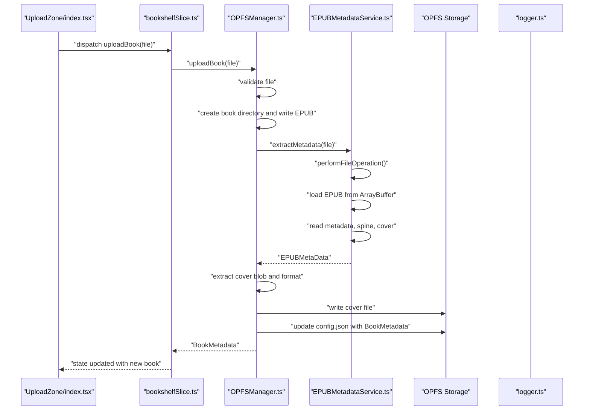

**Diagram sources**
- [UploadZone/index.tsx](file://src/components/UploadZone/index.tsx#L1-L129)
- [bookshelfSlice.ts](file://src/store/slices/bookshelfSlice.ts#L40-L56)
- [OPFSManager.ts](file://src/services/OPFSManager.ts#L120-L219)
- [EPUBMetadataService.ts](file://src/services/EPUBMetadataService.ts#L1-L177)
- [logger.ts](file://src/utils/logger.ts#L1-L19)

## Detailed Component Analysis

### EPUBMetadataService
Responsibilities:
- Load EPUB from File using ArrayBuffer
- Extract core metadata (title, author, publisher, publication date, language, description)
- Identify ISBN from metadata identifier(s)
- Count chapters from spine length
- Extract cover URL and blob for storage
- Provide fallback values when extraction fails

Implementation highlights:
- Uses epubjs Book loaded from ArrayBuffer
- Reads metadata, spine, and cover via epubjs promises
- Applies formatAuthors to normalize author strings
- Uses extractISBN to detect ISBN identifiers
- Integrates with performFileOperation for resilience and logging

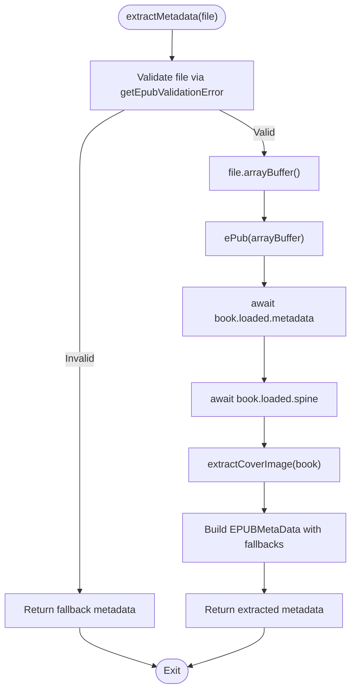

**Diagram sources**
- [EPUBMetadataService.ts](file://src/services/EPUBMetadataService.ts#L11-L63)
- [epubValidation.ts](file://src/utils/epubValidation.ts#L38-L61)

**Section sources**
- [EPUBMetadataService.ts](file://src/services/EPUBMetadataService.ts#L11-L63)
- [EPUBMetadataService.ts](file://src/services/EPUBMetadataService.ts#L65-L84)
- [EPUBMetadataService.ts](file://src/services/EPUBMetadataService.ts#L86-L102)
- [EPUBMetadataService.ts](file://src/services/EPUBMetadataService.ts#L121-L158)

### OPFSManager Integration
Responsibilities:
- Upload EPUB file to OPFS
- Extract metadata and cover
- Assemble BookMetadata and persist to config.json
- Manage cover image storage and retrieval

Key flows:
- Upload creates a directory per book and writes the EPUB file
- Loads EPUB for cover extraction and formats cover filename
- Writes cover file and updates BookMetadata with coverPath
- Pushes BookMetadata into OPFS config

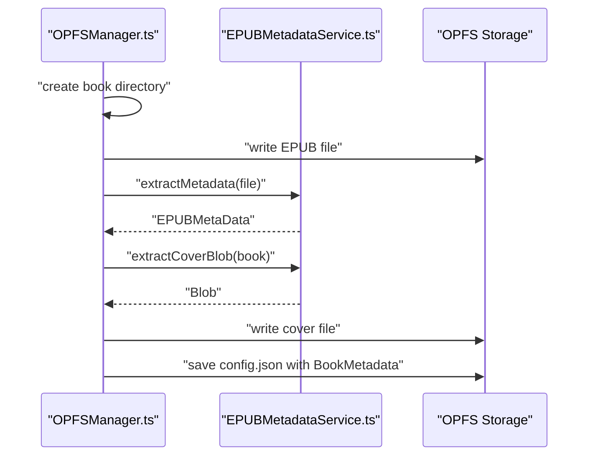

**Diagram sources**
- [OPFSManager.ts](file://src/services/OPFSManager.ts#L120-L219)
- [EPUBMetadataService.ts](file://src/services/EPUBMetadataService.ts#L121-L158)

**Section sources**
- [OPFSManager.ts](file://src/services/OPFSManager.ts#L120-L219)

### Data Models and Interfaces
- EPUBMetaData: Defines shape of extracted metadata (title, author, description, publisher, publishedDate, language, isbn, chapterCount, coverPath)
- BookMetadata: Extends EPUBMetaData with book identity, paths, timestamps, and UI-friendly fields

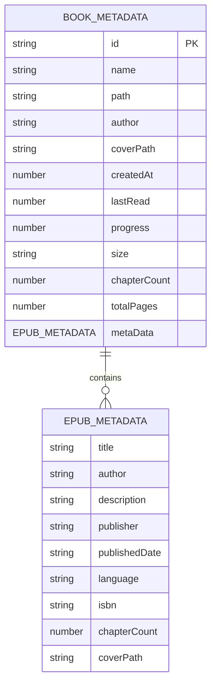

**Diagram sources**
- [book.ts](file://src/types/book.ts#L1-L55)

**Section sources**
- [book.ts](file://src/types/book.ts#L1-L55)

### Author Formatting and ISBN Extraction
- formatAuthors: Normalizes author input to a single string, joining arrays with commas or returning a default when missing
- extractISBN: Scans identifier(s) for any entry containing “isbn” (case-insensitive) and returns the matched identifier

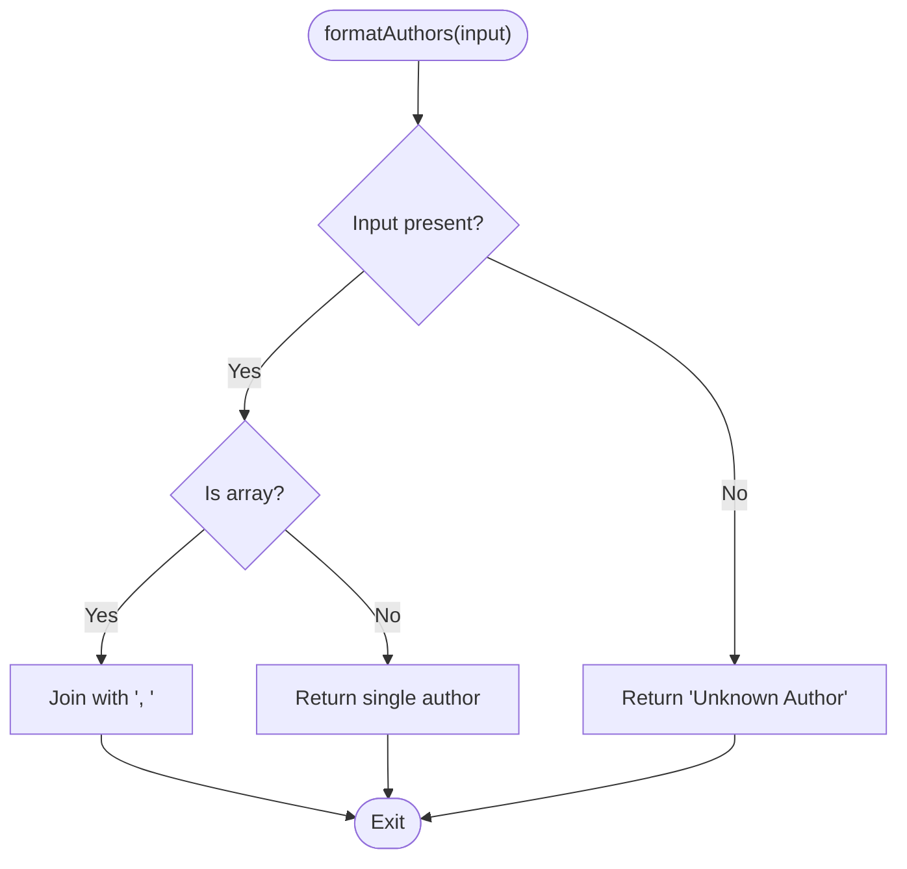

**Diagram sources**
- [EPUBMetadataService.ts](file://src/services/EPUBMetadataService.ts#L76-L84)

**Section sources**
- [EPUBMetadataService.ts](file://src/services/EPUBMetadataService.ts#L65-L84)

### Cover Extraction and Blob Handling
- extractCoverImage: Attempts to read cover from book.loaded.cover
- extractCoverBlob: Uses book.coverUrl() to fetch the cover image as a Blob
- getCoverFormat: Determines image format from Blob type

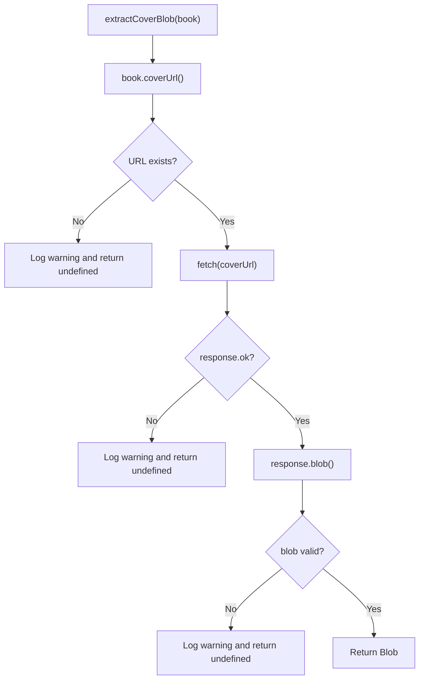

**Diagram sources**
- [EPUBMetadataService.ts](file://src/services/EPUBMetadataService.ts#L121-L158)

**Section sources**
- [EPUBMetadataService.ts](file://src/services/EPUBMetadataService.ts#L86-L102)
- [EPUBMetadataService.ts](file://src/services/EPUBMetadataService.ts#L104-L119)
- [EPUBMetadataService.ts](file://src/services/EPUBMetadataService.ts#L121-L158)

### Fallback Mechanism
- extractMetadata returns fallback metadata when extraction fails:
  - title: original filename without .epub
  - author: “Unknown Author”
  - chapterCount: 0
- performFileOperation ensures errors are captured and logged consistently

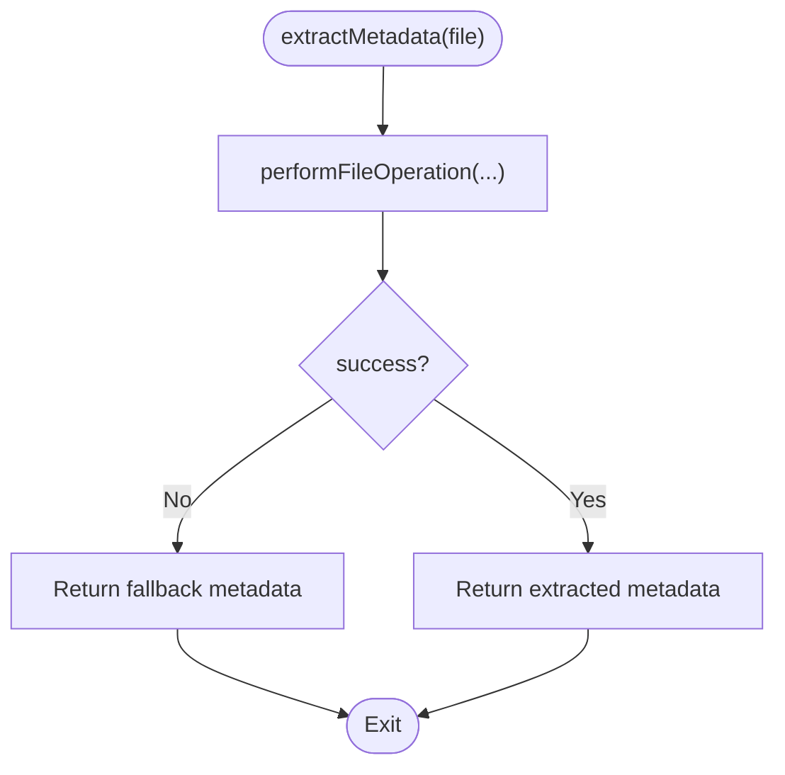

**Diagram sources**
- [EPUBMetadataService.ts](file://src/services/EPUBMetadataService.ts#L1-L63)
- [fileOperations.ts](file://src/utils/fileOperations.ts#L1-L36)

**Section sources**
- [EPUBMetadataService.ts](file://src/services/EPUBMetadataService.ts#L52-L63)
- [fileOperations.ts](file://src/utils/fileOperations.ts#L1-L36)

### Integration with performFileOperation and Logger
- performFileOperation wraps operations with standardized try/catch, logging start and completion, and returning structured results
- logger provides consistent log/info/error/warn outputs across the system

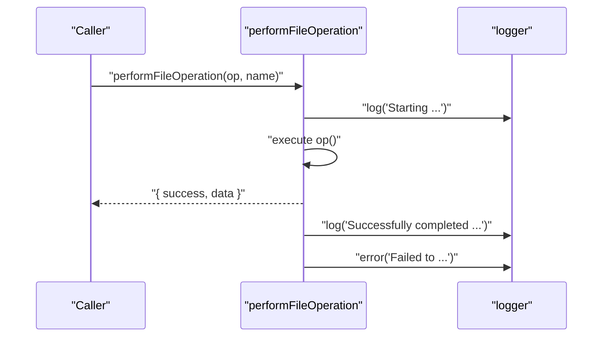

**Diagram sources**
- [fileOperations.ts](file://src/utils/fileOperations.ts#L1-L36)
- [logger.ts](file://src/utils/logger.ts#L1-L19)

**Section sources**
- [fileOperations.ts](file://src/utils/fileOperations.ts#L1-L36)
- [logger.ts](file://src/utils/logger.ts#L1-L19)

### UI Integration and State Updates
- UploadZone triggers upload via Redux
- bookshelfSlice manages async upload thunk and updates state
- BookMetadata is persisted to OPFS config and rendered by BookCard

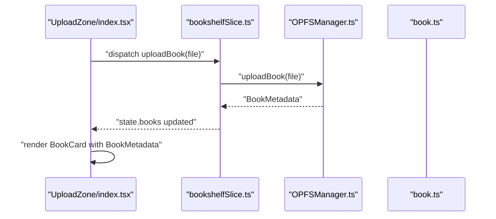

**Diagram sources**
- [UploadZone/index.tsx](file://src/components/UploadZone/index.tsx#L1-L129)
- [bookshelfSlice.ts](file://src/store/slices/bookshelfSlice.ts#L40-L56)
- [OPFSManager.ts](file://src/services/OPFSManager.ts#L120-L219)
- [book.ts](file://src/types/book.ts#L1-L55)

**Section sources**
- [UploadZone/index.tsx](file://src/components/UploadZone/index.tsx#L1-L129)
- [bookshelfSlice.ts](file://src/store/slices/bookshelfSlice.ts#L40-L56)
- [BookCard/index.tsx](file://src/components/BookCard/index.tsx#L1-L45)
- [useBookDisplayData.ts](file://src/components/BookCard/hooks/useBookDisplayData.ts#L1-L32)

## Dependency Analysis
- EPUBMetadataService depends on:
  - epubjs for EPUB parsing
  - logger for logging
  - fileOperations for resilient execution
  - epubValidation for pre-checks
  - OPFSManager for book retrieval by ID (auxiliary)
- OPFSManager depends on:
  - EPUBMetadataService for metadata and cover extraction
  - epubjs for cover URL resolution
  - fileOperations for safe filesystem operations
  - epubValidation and constants for validation and limits
  - types for BookMetadata and OPFSConfig

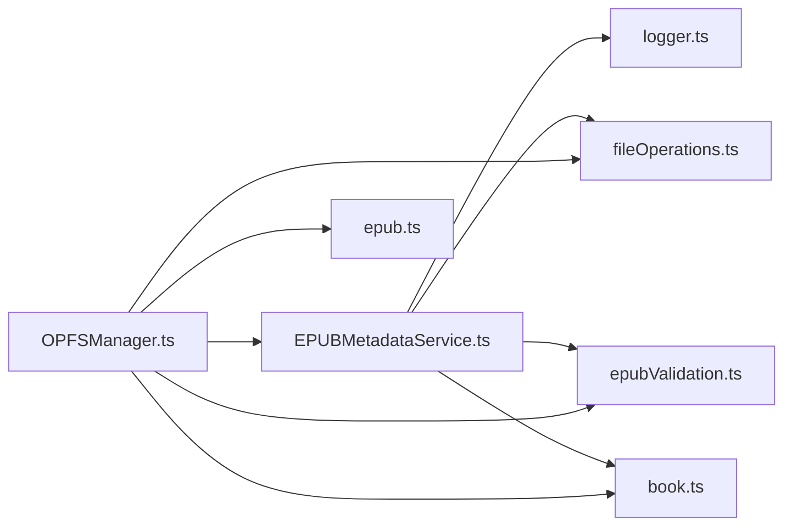

**Diagram sources**
- [EPUBMetadataService.ts](file://src/services/EPUBMetadataService.ts#L1-L177)
- [OPFSManager.ts](file://src/services/OPFSManager.ts#L1-L510)
- [fileOperations.ts](file://src/utils/fileOperations.ts#L1-L91)
- [epubValidation.ts](file://src/utils/epubValidation.ts#L1-L77)
- [epub.ts](file://src/constants/epub.ts#L1-L61)
- [book.ts](file://src/types/book.ts#L1-L116)

**Section sources**
- [EPUBMetadataService.ts](file://src/services/EPUBMetadataService.ts#L1-L177)
- [OPFSManager.ts](file://src/services/OPFSManager.ts#L1-L510)

## Performance Considerations
- EPUB loading and cover extraction occur synchronously within OPFSManager’s upload flow; consider deferring non-critical steps if needed
- Cover blob fetching uses network I/O; caching or early termination on failure reduces overhead
- Logging adds minimal overhead; keep logs informative without excessive verbosity
- File validation prevents unnecessary processing for invalid files

[No sources needed since this section provides general guidance]

## Troubleshooting Guide
Common issues and resolutions:
- EPUB file validation failures: Ensure file has .epub extension, is not empty, and under size limits
- Metadata extraction failures: The system falls back to default values; check logs for detailed error messages
- Cover extraction failures: Missing cover URL or network errors; verify EPUB has embedded cover and network connectivity
- OPFS initialization failures: Browser must support OPFS; handle unsupported environments gracefully

**Section sources**
- [epubValidation.ts](file://src/utils/epubValidation.ts#L38-L61)
- [fileOperations.ts](file://src/utils/fileOperations.ts#L1-L36)
- [logger.ts](file://src/utils/logger.ts#L1-L19)
- [OPFSManager.ts](file://src/services/OPFSManager.ts#L1-L60)

## Conclusion
The metadata extraction system integrates epubjs parsing, robust error handling, and OPFS-backed storage to reliably populate BookMetadata from EPUB files. It normalizes authors, extracts ISBN identifiers, counts chapters from the spine, and retrieves cover images with fallbacks. The design leverages performFileOperation and logger for resilience and observability, and the resulting metadata is seamlessly stored in the bookshelf state for UI rendering.

[No sources needed since this section summarizes without analyzing specific files]

## Appendices

### Example: How Extracted Metadata Becomes BookMetadata
- During upload, OPFSManager writes the EPUB and cover, then constructs BookMetadata with:
  - id, name, path, author, coverPath, createdAt, size, chapterCount, metaData
- The bookshelf state is updated via Redux, and BookCard renders the book with display-safe fallbacks.

**Section sources**
- [OPFSManager.ts](file://src/services/OPFSManager.ts#L196-L214)
- [book.ts](file://src/types/book.ts#L1-L55)
- [bookshelfSlice.ts](file://src/store/slices/bookshelfSlice.ts#L132-L141)
- [BookCard/index.tsx](file://src/components/BookCard/index.tsx#L1-L45)
- [useBookDisplayData.ts](file://src/components/BookCard/hooks/useBookDisplayData.ts#L1-L32)