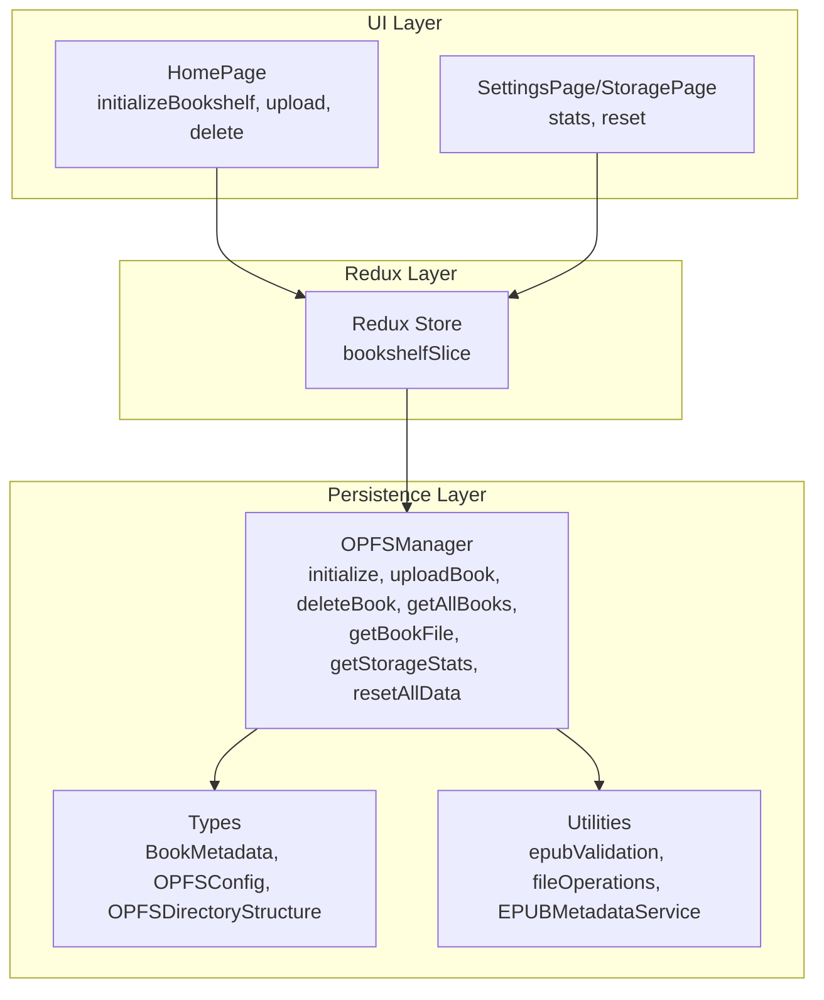
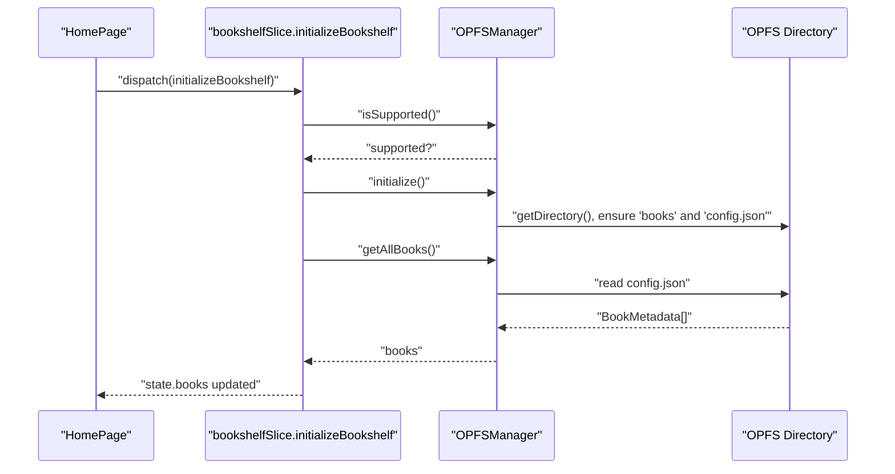
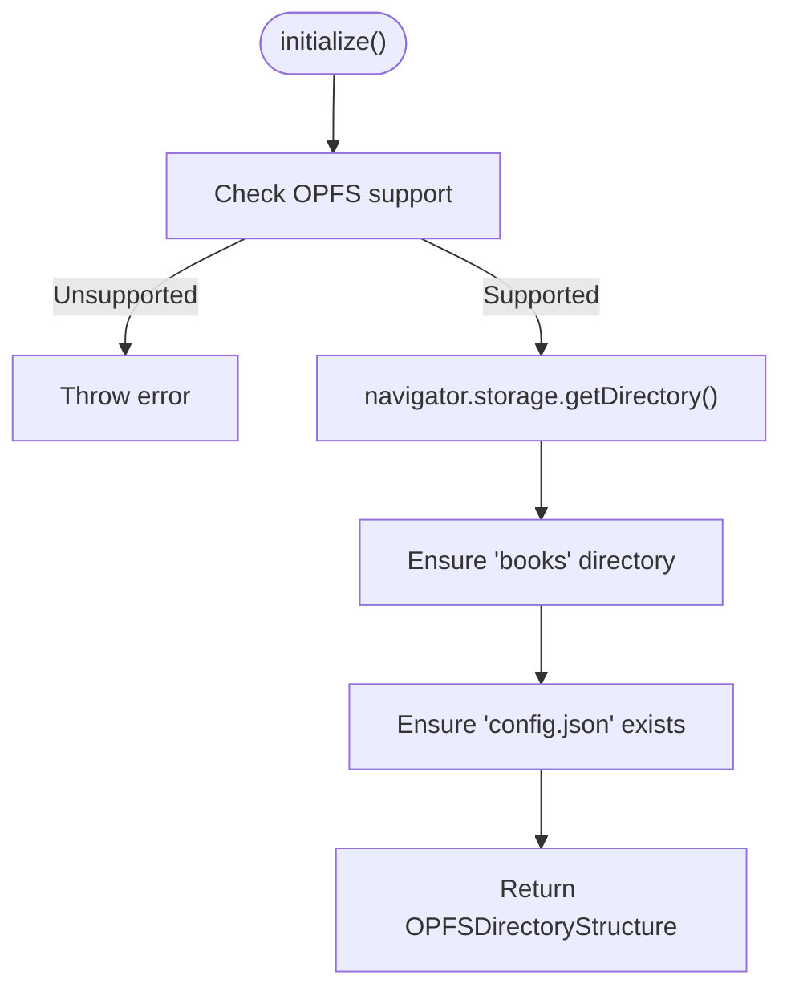
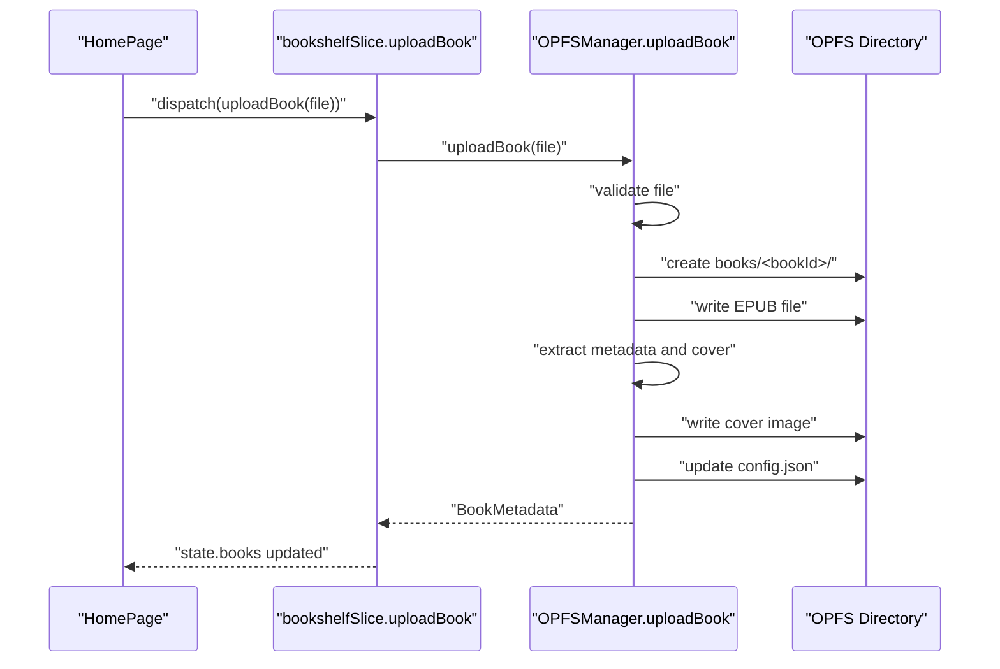
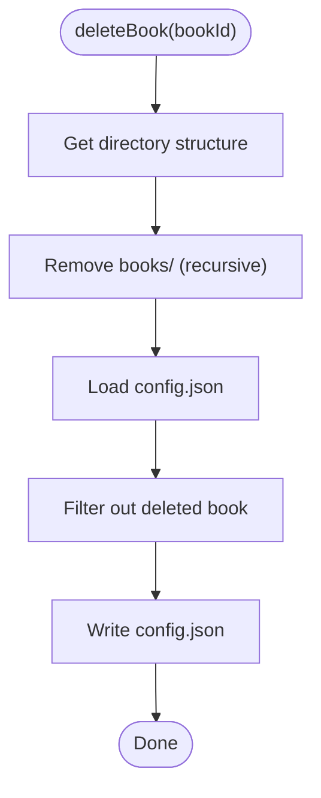
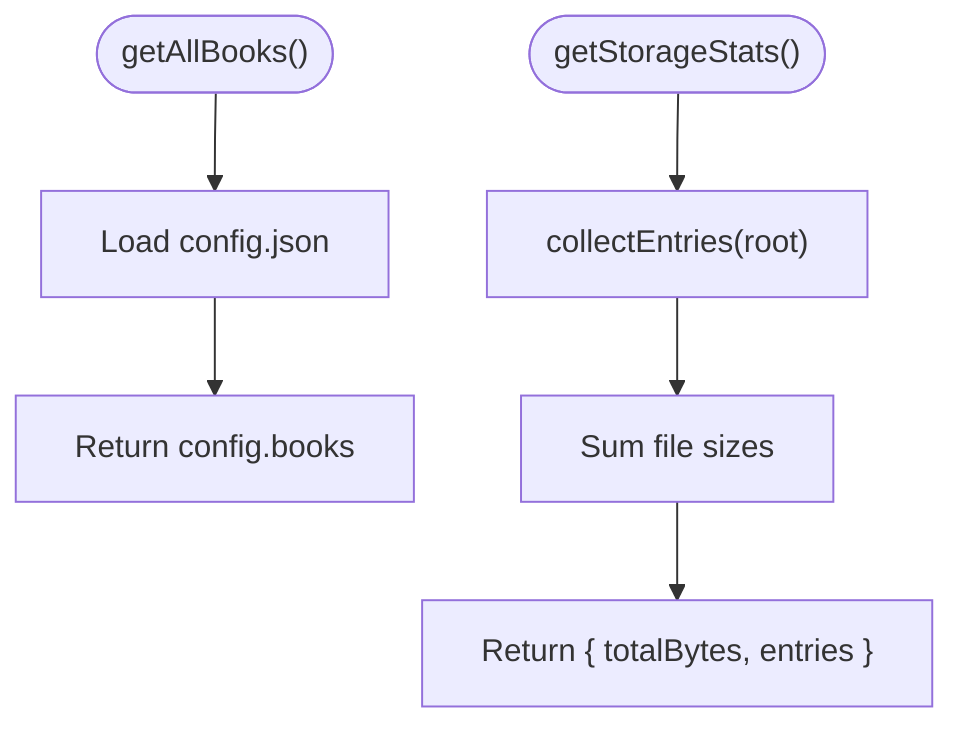
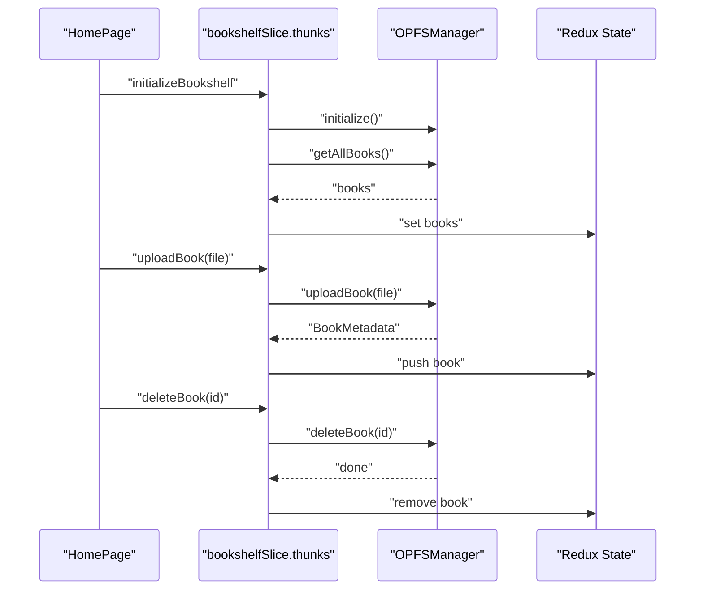
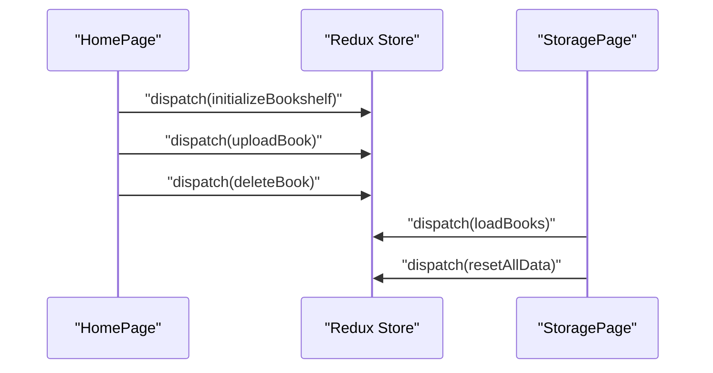
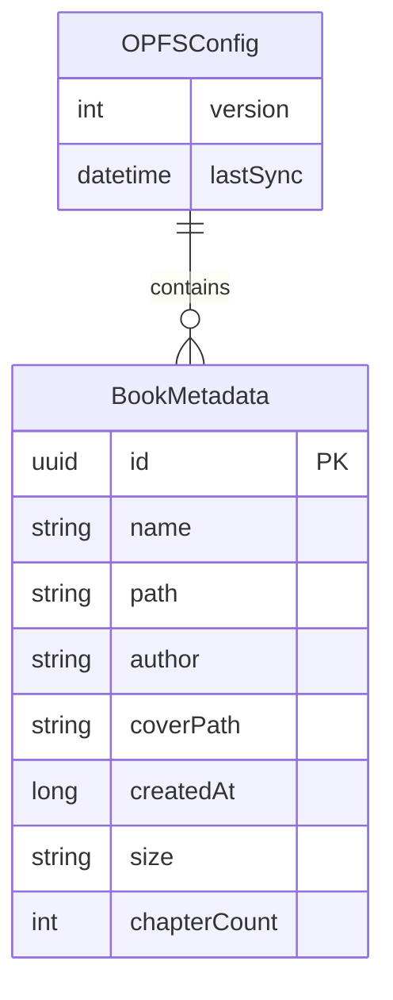
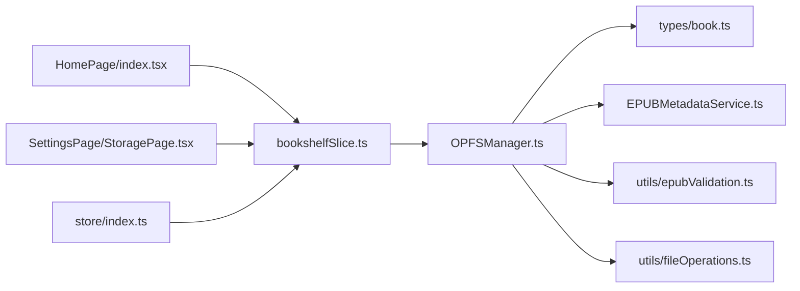

# OPFS Storage Mechanism

<cite>
**Referenced Files in This Document**
- [OPFSManager.ts](file://src/services/OPFSManager.ts)
- [bookshelfSlice.ts](file://src/store/slices/bookshelfSlice.ts)
- [index.tsx](file://src/pages/HomePage/index.tsx)
- [StoragePage.tsx](file://src/pages/SettingsPage/StoragePage.tsx)
- [book.ts](file://src/types/book.ts)
- [epubValidation.ts](file://src/utils/epubValidation.ts)
- [fileOperations.ts](file://src/utils/fileOperations.ts)
- [EPUBMetadataService.ts](file://src/services/EPUBMetadataService.ts)
- [epub.ts](file://src/constants/epub.ts)
- [index.ts](file://src/store/index.ts)
</cite>

## Table of Contents
1. [Introduction](#introduction)
2. [Project Structure](#project-structure)
3. [Core Components](#core-components)
4. [Architecture Overview](#architecture-overview)
5. [Detailed Component Analysis](#detailed-component-analysis)
6. [Dependency Analysis](#dependency-analysis)
7. [Performance Considerations](#performance-considerations)
8. [Troubleshooting Guide](#troubleshooting-guide)
9. [Conclusion](#conclusion)

## Introduction
This section documents the Origin Private File System (OPFS) storage mechanism that powers persistent, offline EPUB book storage in the browser. The application leverages the File System Access API through OPFSManager to store EPUB files directly in the browser’s private file system. The initialization process occurs in the initializeBookshelf async thunk, which detects browser support, sets up the OPFS directory structure, and loads existing books. Books are persisted as binary files under unique IDs with associated metadata, and the getAllBooks function reconstructs the bookshelf state from stored files. The integration with Redux state management ensures seamless synchronization between UI state and OPFS persistence, with robust error handling for unsupported environments. Examples illustrate how uploadBook and deleteBook interact with OPFS, and we address storage quota limitations and performance considerations for large collections.

## Project Structure
The OPFS integration spans several modules:
- OPFSManager: Implements OPFS operations, directory setup, file persistence, and metadata management.
- Redux slice (bookshelfSlice): Orchestrates async thunks for initialization, upload, deletion, and retrieval of books, updating the Redux state accordingly.
- Pages: HomePage initializes the bookshelf and handles user interactions; SettingsPage/StoragePage displays OPFS statistics and allows resetting data.
- Types: Defines BookMetadata, OPFSConfig, and OPFSDirectoryStructure interfaces.
- Utilities: Provide file validation, safe file/directory handle getters, and EPUB metadata extraction.

**Diagram sources**
- [bookshelfSlice.ts](file://src/store/slices/bookshelfSlice.ts#L1-L188)
- [index.tsx](file://src/pages/HomePage/index.tsx#L33-L84)
- [StoragePage.tsx](file://src/pages/SettingsPage/StoragePage.tsx#L1-L159)
- [OPFSManager.ts](file://src/services/OPFSManager.ts#L1-L510)
- [book.ts](file://src/types/book.ts#L1-L116)
- [epubValidation.ts](file://src/utils/epubValidation.ts#L1-L77)
- [fileOperations.ts](file://src/utils/fileOperations.ts#L1-L91)
- [EPUBMetadataService.ts](file://src/services/EPUBMetadataService.ts#L1-L177)

**Section sources**
- [OPFSManager.ts](file://src/services/OPFSManager.ts#L1-L510)
- [bookshelfSlice.ts](file://src/store/slices/bookshelfSlice.ts#L1-L188)
- [index.tsx](file://src/pages/HomePage/index.tsx#L33-L84)
- [StoragePage.tsx](file://src/pages/SettingsPage/StoragePage.tsx#L1-L159)
- [book.ts](file://src/types/book.ts#L1-L116)
- [epubValidation.ts](file://src/utils/epubValidation.ts#L1-L77)
- [fileOperations.ts](file://src/utils/fileOperations.ts#L1-L91)
- [EPUBMetadataService.ts](file://src/services/EPUBMetadataService.ts#L1-L177)
- [epub.ts](file://src/constants/epub.ts#L1-L61)
- [index.ts](file://src/store/index.ts#L1-L23)

## Core Components
- OPFSManager: Centralized service for OPFS operations, including support detection, directory initialization, book upload, deletion, retrieval, and storage statistics.
- Redux bookshelfSlice: Async thunks for initializeBookshelf, uploadBook, deleteBook, and loadBooks; reducers update the UI state based on OPFS outcomes.
- HomePage: Triggers initialization and user actions (upload, delete), integrates with Redux dispatchers.
- SettingsPage/StoragePage: Displays OPFS statistics and provides a reset-all-data action.
- Types: Define BookMetadata, OPFSConfig, and OPFSDirectoryStructure for consistent data modeling.
- Utilities: Validation helpers, safe handle getters, and EPUB metadata extraction.

Key responsibilities:
- OPFSManager: Ensures OPFS availability, creates and maintains the directory structure, persists EPUBs and covers, updates config.json, and enumerates storage entries.
- Redux: Manages loading states, errors, and the list of books; delegates persistence to OPFSManager.
- UI: Renders warnings for unsupported browsers, displays storage stats, and triggers actions.

**Section sources**
- [OPFSManager.ts](file://src/services/OPFSManager.ts#L1-L510)
- [bookshelfSlice.ts](file://src/store/slices/bookshelfSlice.ts#L1-L188)
- [index.tsx](file://src/pages/HomePage/index.tsx#L33-L84)
- [StoragePage.tsx](file://src/pages/SettingsPage/StoragePage.tsx#L1-L159)
- [book.ts](file://src/types/book.ts#L1-L116)

## Architecture Overview
The OPFS architecture follows a layered design:
- UI layer triggers actions (initialize, upload, delete, load).
- Redux slice executes async thunks and updates state.
- OPFSManager performs File System Access API operations against the origin-private directory.
- Metadata and EPUB files are stored under a structured layout with unique IDs.

**Diagram sources**
- [bookshelfSlice.ts](file://src/store/slices/bookshelfSlice.ts#L19-L38)
- [OPFSManager.ts](file://src/services/OPFSManager.ts#L38-L60)
- [OPFSManager.ts](file://src/services/OPFSManager.ts#L329-L332)

## Detailed Component Analysis

### OPFSManager: Initialization and Directory Setup
- Support detection: Checks navigator.storage and navigator.storage.getDirectory capabilities.
- Directory initialization: Creates the root directory and a dedicated books directory; ensures config.json exists with default structure.
- Directory structure caching: Stores root and books directory handles for reuse.

**Diagram sources**
- [OPFSManager.ts](file://src/services/OPFSManager.ts#L31-L60)
- [OPFSManager.ts](file://src/services/OPFSManager.ts#L112-L121)

**Section sources**
- [OPFSManager.ts](file://src/services/OPFSManager.ts#L31-L60)
- [OPFSManager.ts](file://src/services/OPFSManager.ts#L112-L121)

### OPFSManager: Book Upload Workflow
- Validates EPUB using centralized validation utilities.
- Generates a unique bookId and creates a book-specific directory under books/<bookId>.
- Writes the EPUB file and extracts cover image (if available), saving as cover.<ext>.
- Builds enhanced BookMetadata and appends it to config.json.
- Returns the new BookMetadata for Redux state updates.

**Diagram sources**
- [bookshelfSlice.ts](file://src/store/slices/bookshelfSlice.ts#L40-L56)
- [OPFSManager.ts](file://src/services/OPFSManager.ts#L126-L219)
- [EPUBMetadataService.ts](file://src/services/EPUBMetadataService.ts#L1-L177)
- [epubValidation.ts](file://src/utils/epubValidation.ts#L1-L77)

**Section sources**
- [OPFSManager.ts](file://src/services/OPFSManager.ts#L126-L219)
- [EPUBMetadataService.ts](file://src/services/EPUBMetadataService.ts#L1-L177)
- [epubValidation.ts](file://src/utils/epubValidation.ts#L1-L77)

### OPFSManager: Book Deletion Workflow
- Removes the entire book directory under books/<bookId>.
- Updates config.json by filtering out the deleted book.
- Maintains consistency between persisted files and in-memory state.

**Diagram sources**
- [OPFSManager.ts](file://src/services/OPFSManager.ts#L242-L261)

**Section sources**
- [OPFSManager.ts](file://src/services/OPFSManager.ts#L242-L261)

### OPFSManager: Retrieving Books and Storage Statistics
- getAllBooks: Reads config.json and returns the stored BookMetadata array.
- getStorageStats: Enumerates all entries under the root directory, computes total bytes, and returns a list of entries with sizes.

**Diagram sources**
- [OPFSManager.ts](file://src/services/OPFSManager.ts#L329-L332)
- [OPFSManager.ts](file://src/services/OPFSManager.ts#L334-L376)

**Section sources**
- [OPFSManager.ts](file://src/services/OPFSManager.ts#L329-L332)
- [OPFSManager.ts](file://src/services/OPFSManager.ts#L334-L376)

### Redux Integration: initializeBookshelf, uploadBook, deleteBook, loadBooks
- initializeBookshelf: Validates OPFS support, initializes directories, and loads books via OPFSManager.getAllBooks, then updates state.
- uploadBook: Validates file, uploads via OPFSManager.uploadBook, and appends returned metadata to state.
- deleteBook: Deletes via OPFSManager.deleteBook and removes the book from state.
- loadBooks: Refreshes state by re-reading config.json via OPFSManager.getAllBooks.

**Diagram sources**
- [bookshelfSlice.ts](file://src/store/slices/bookshelfSlice.ts#L19-L88)
- [OPFSManager.ts](file://src/services/OPFSManager.ts#L329-L332)
- [OPFSManager.ts](file://src/services/OPFSManager.ts#L126-L219)
- [OPFSManager.ts](file://src/services/OPFSManager.ts#L242-L261)

**Section sources**
- [bookshelfSlice.ts](file://src/store/slices/bookshelfSlice.ts#L19-L88)

### UI Integration: HomePage and SettingsPage/StoragePage
- HomePage: On mount, dispatches initializeBookshelf; handles upload and delete events; shows browser compatibility warnings.
- SettingsPage/StoragePage: Displays OPFS statistics, totals, and individual file sizes; provides a reset-all-data action that clears OPFS and reloads state.

**Diagram sources**
- [index.tsx](file://src/pages/HomePage/index.tsx#L33-L84)
- [StoragePage.tsx](file://src/pages/SettingsPage/StoragePage.tsx#L1-L159)
- [bookshelfSlice.ts](file://src/store/slices/bookshelfSlice.ts#L19-L88)

**Section sources**
- [index.tsx](file://src/pages/HomePage/index.tsx#L33-L84)
- [StoragePage.tsx](file://src/pages/SettingsPage/StoragePage.tsx#L1-L159)

### Data Models and Directory Layout
- OPFS directory structure:
  - Root directory with:
    - books/<bookId>/<original.epub>
    - books/<bookId>/cover.<ext> (optional)
    - config.json containing OPFSConfig with version, books[], settings, and lastSync.
- BookMetadata includes id, name, path, author, coverPath, createdAt, size, chapterCount, and embedded EPUB metadata.

**Diagram sources**
- [book.ts](file://src/types/book.ts#L60-L116)

**Section sources**
- [book.ts](file://src/types/book.ts#L1-L116)
- [OPFSManager.ts](file://src/services/OPFSManager.ts#L329-L332)

## Dependency Analysis
- OPFSManager depends on:
  - Types for BookMetadata and OPFSConfig.
  - EPUBMetadataService for metadata extraction and cover handling.
  - epubValidation for file validation.
  - fileOperations for safe handle creation and logging.
- Redux slice depends on OPFSManager for persistence and on types for state modeling.
- UI pages depend on Redux dispatchers and on OPFSManager for support checks and stats.

**Diagram sources**
- [OPFSManager.ts](file://src/services/OPFSManager.ts#L1-L510)
- [book.ts](file://src/types/book.ts#L1-L116)
- [EPUBMetadataService.ts](file://src/services/EPUBMetadataService.ts#L1-L177)
- [epubValidation.ts](file://src/utils/epubValidation.ts#L1-L77)
- [fileOperations.ts](file://src/utils/fileOperations.ts#L1-L91)
- [bookshelfSlice.ts](file://src/store/slices/bookshelfSlice.ts#L1-L188)
- [index.ts](file://src/store/index.ts#L1-L23)
- [index.tsx](file://src/pages/HomePage/index.tsx#L33-L84)
- [StoragePage.tsx](file://src/pages/SettingsPage/StoragePage.tsx#L1-L159)

**Section sources**
- [OPFSManager.ts](file://src/services/OPFSManager.ts#L1-L510)
- [bookshelfSlice.ts](file://src/store/slices/bookshelfSlice.ts#L1-L188)
- [index.ts](file://src/store/index.ts#L1-L23)

## Performance Considerations
- Large collections:
  - Prefer batched reads/writes to minimize filesystem round-trips.
  - Use getAllBooks to hydrate state efficiently rather than iterating directories repeatedly.
  - Avoid frequent cover conversions; cache base64 URIs when needed.
- Memory usage:
  - For EPUB rendering, consider streaming or chunked processing to reduce peak memory.
  - Limit concurrent uploads to prevent UI jank.
- Storage quotas:
  - Monitor getStorageStats to inform users about usage trends.
  - Provide guidance to clear old books or reset data when nearing limits.
- Network and parsing:
  - EPUB parsing and cover extraction can be expensive; defer heavy operations until necessary.
  - Use lazy loading for cover images and metadata.

[No sources needed since this section provides general guidance]

## Troubleshooting Guide
Common issues and resolutions:
- Browser not supported:
  - The UI displays a compatibility notice and OPFSManager.isSupported() prevents initialization.
- Initialization failures:
  - Ensure OPFS is enabled and the origin has permission; check for errors thrown during directory creation or config.json read/write.
- Upload failures:
  - Verify file validation passes; confirm EPUB integrity and size limits.
  - Inspect safeGetFileHandle and safeGetDirectoryHandle logs for handle acquisition errors.
- Deletion anomalies:
  - Confirm the bookId exists; ensure recursive removal succeeds and config.json is updated.
- Storage stats discrepancies:
  - getStorageStats enumerates entries; verify directory permissions and file visibility.

Operational tips:
- Use SettingsPage/StoragePage to inspect cached files and total usage.
- Reset all data to recover from corrupted states; this recreates default directories and config.

**Section sources**
- [index.tsx](file://src/pages/HomePage/index.tsx#L227-L244)
- [OPFSManager.ts](file://src/services/OPFSManager.ts#L31-L60)
- [OPFSManager.ts](file://src/services/OPFSManager.ts#L368-L402)
- [StoragePage.tsx](file://src/pages/SettingsPage/StoragePage.tsx#L1-L159)

## Conclusion
The OPFS storage mechanism provides a robust, origin-private persistence layer for EPUB books. OPFSManager encapsulates all filesystem operations, while Redux thunks coordinate UI actions with persistent state. The design emphasizes safety, resilience (with config.json as the canonical source of truth), and scalability. By leveraging directory structure, unique IDs, and metadata-driven bookshelf reconstruction, the system supports efficient browsing, uploading, and deletion of EPUB collections. UI components surface support detection, storage statistics, and recovery actions, ensuring a smooth user experience across supported browsers.