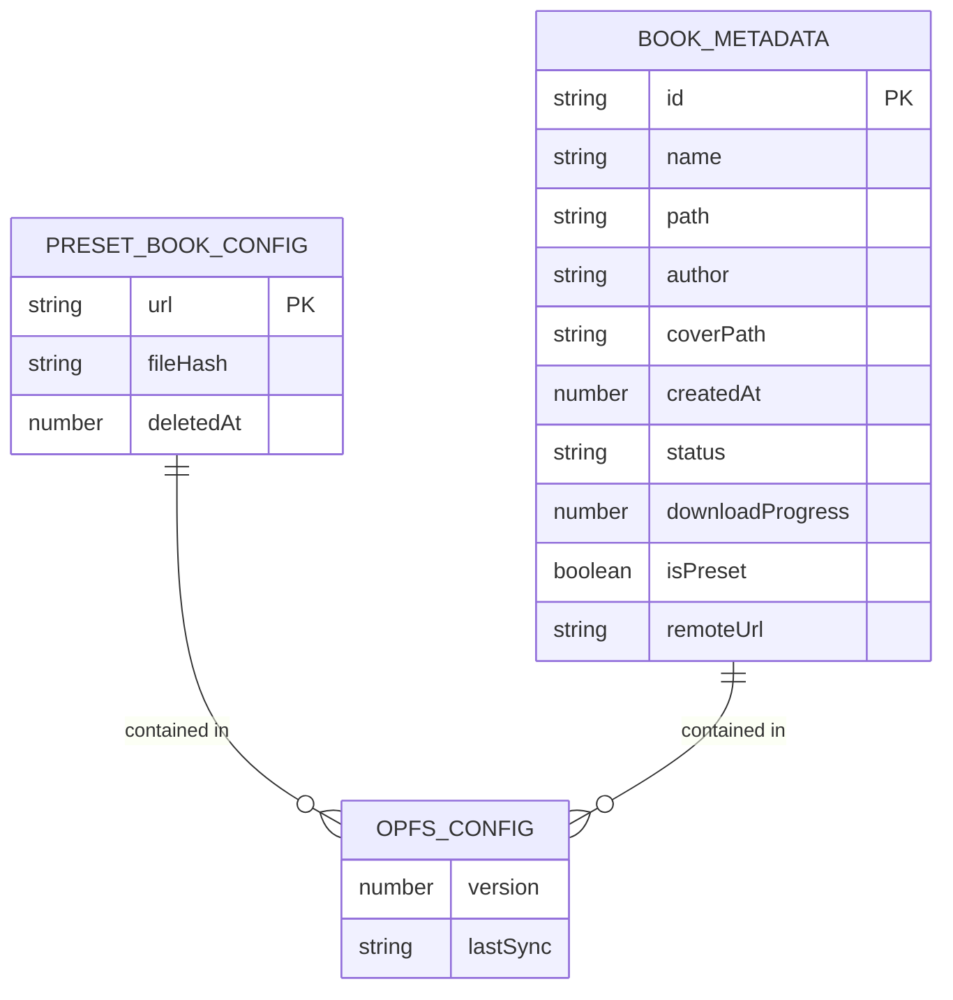
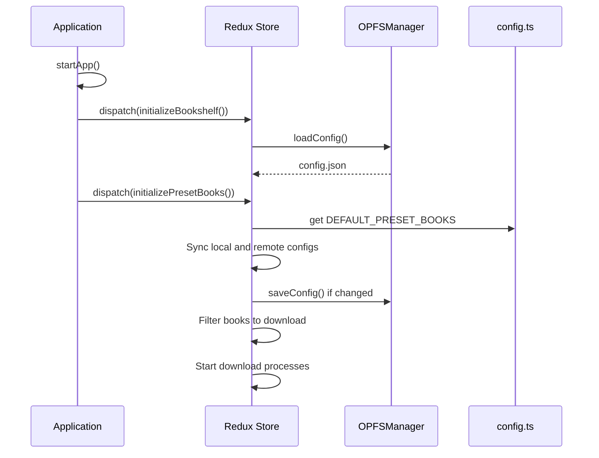
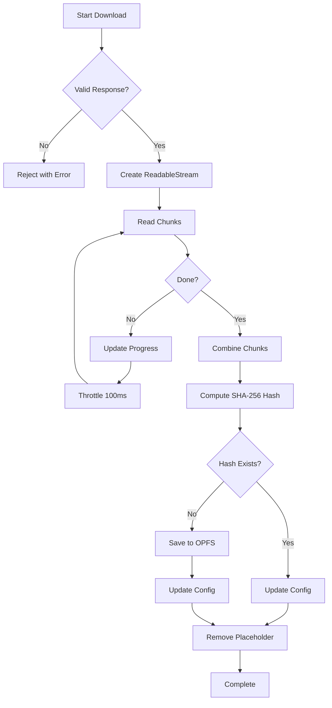

# Preset Books Functionality

<cite>
**Referenced Files in This Document**   
- [bookshelfSlice.ts](file://src/store/slices/bookshelfSlice.ts)
- [book.ts](file://src/types/book.ts)
- [config.ts](file://src/config/config.ts)
- [main.tsx](file://src/main.tsx)
- [preset-books.md](file://docs/features/preset-books.md)
</cite>

## Table of Contents
1. [Introduction](#introduction)
2. [Core Data Structures](#core-data-structures)
3. [Initialization Process](#initialization-process)
4. [Download Workflow](#download-workflow)
5. [State Management](#state-management)
6. [Error Handling and Edge Cases](#error-handling-and-edge-cases)
7. [UI Integration](#ui-integration)
8. [Testing and Validation](#testing-and-validation)

## Introduction
The Preset Books functionality enables automatic downloading and management of pre-configured EPUB books from remote servers. This feature ensures users have immediate access to essential reading materials upon application launch, with robust handling for duplicate detection, progress tracking, and hot-reload synchronization. The system leverages Redux for state management and OPFS (Origin Private File System) for persistent storage.

**Section sources**
- [preset-books.md](file://docs/features/preset-books.md#L1-L623)

## Core Data Structures
The functionality relies on several key data structures defined in the application's type system. The `PresetBookConfig` interface defines the configuration for each preset book, including its remote URL, optional file hash, and deletion timestamp for hot-reload support. The `OPFSConfig` interface extends the application configuration to include a `presetBooks` array and a `hashMapFilePath` index for O(1) duplicate detection. Book metadata has been enhanced with fields for download status, progress tracking, and source identification.

**Diagram sources**
- [book.ts](file://src/types/book.ts#L138-L145)
- [preset-books.md](file://docs/features/preset-books.md#L35-L46)

## Initialization Process
The preset books system initializes during application startup in `main.tsx`, where the `initializePresetBooks` thunk is dispatched after the bookshelf is loaded. This process synchronizes the local configuration with the `DEFAULT_PRESET_BOOKS` array defined in `config.ts`, marking removed books with a `deletedAt` timestamp and adding new books from the remote configuration. The synchronization ensures that the application state reflects the current set of preset books, supporting hot-reload scenarios where the configuration may change between deployments.

**Diagram sources**
- [main.tsx](file://src/main.tsx#L25-L42)
- [bookshelfSlice.ts](file://src/store/slices/bookshelfSlice.ts#L208-L262)
- [config.ts](file://src/config/config.ts#L4)

## Download Workflow
The download process is managed through Redux thunks to ensure continuity across route changes. When a preset book needs to be downloaded, the `downloadPresetBook` thunk creates a placeholder in the store with a temporary ID and "downloading" status. The actual download occurs via a streaming fetch request, with progress updates throttled to every 100ms to prevent excessive state updates. Upon completion, the file's SHA-256 hash is computed and checked against the `hashMapFilePath` index for duplicate detection. If the book is new, it is saved to OPFS with the hash as its directory name; if it's a duplicate, the process is skipped.

**Diagram sources**
- [bookshelfSlice.ts](file://src/store/slices/bookshelfSlice.ts#L125-L206)

## State Management
The bookshelf slice maintains comprehensive state for preset books, including a `presetBooksInitialized` flag to track initialization status and a `downloadingCount` to monitor active downloads. The reducer handles placeholder books through dedicated actions: `addPlaceholderBook` for initial insertion, `updateDownloadProgress` for progress updates, and `replacePlaceholderBook` for finalizing the download with actual metadata. This approach ensures that the UI can display accurate progress information while maintaining data integrity throughout the asynchronous download process.

**Section sources**
- [bookshelfSlice.ts](file://src/store/slices/bookshelfSlice.ts#L266-L427)
- [book.ts](file://src/types/book.ts#L119-L122)

## Error Handling and Edge Cases
The system implements robust error handling for various edge cases, including network failures, invalid EPUB files, and hash collisions. The `downloadPresetBook` thunk catches errors and updates the book's status to "error" with an appropriate message. The initialization process prevents duplicate downloads by checking for existing "downloading" books in the state. The configuration synchronization handles hot-reload scenarios by marking removed books with a `deletedAt` timestamp rather than immediately deleting them, allowing for graceful degradation if the application is reloaded with a different configuration.

**Section sources**
- [bookshelfSlice.ts](file://src/store/slices/bookshelfSlice.ts#L197-L204)
- [preset-books.md](file://docs/features/preset-books.md#L595-L599)

## UI Integration
The user interface displays downloading preset books separately from local books, typically in a "Downloading" section with progress bars and percentage indicators. The `BookCard` component can render different states (downloading, error, complete) based on the book's status field. This integration allows users to monitor the progress of preset book downloads and understand when their library will be fully available, enhancing the overall user experience during the initial application setup.

**Section sources**
- [preset-books.md](file://docs/features/preset-books.md#L550-L577)

## Testing and Validation
The preset books functionality has been validated against several critical test cases, including first-time user scenarios, hot-reload synchronization, duplicate upload detection, and route navigation during downloads. The system has been tested for edge cases such as network failures, invalid EPUB files, and multiple concurrent downloads. The testing strategy ensures that the feature is reliable and provides a seamless user experience across different usage patterns and potential failure scenarios.

**Section sources**
- [preset-books.md](file://docs/features/preset-books.md#L584-L592)