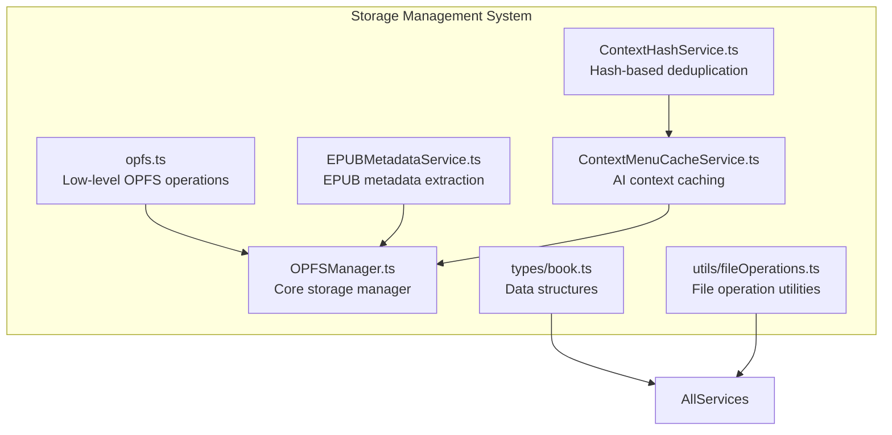
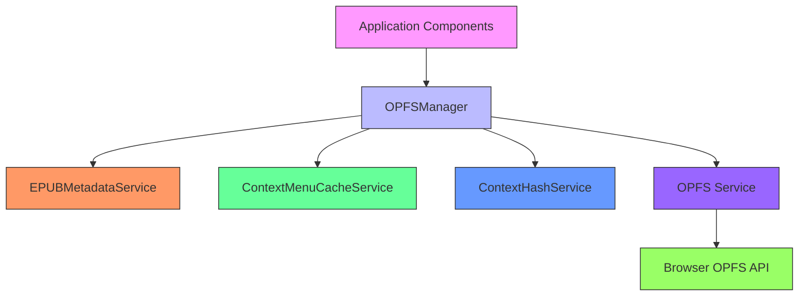
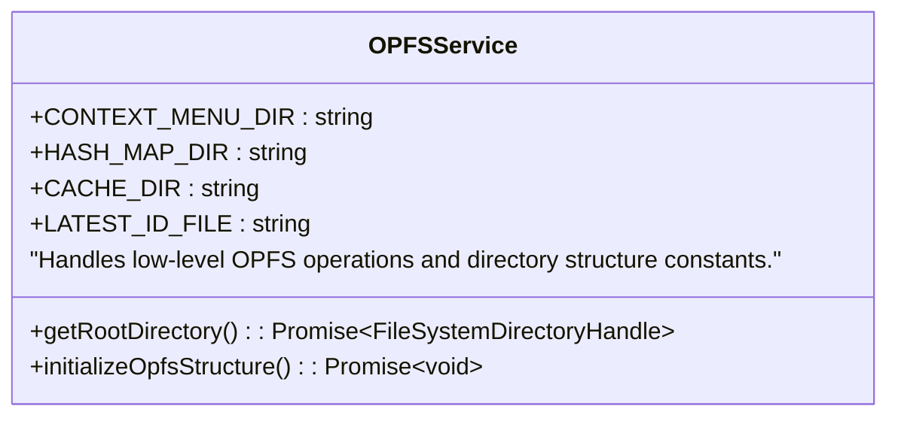
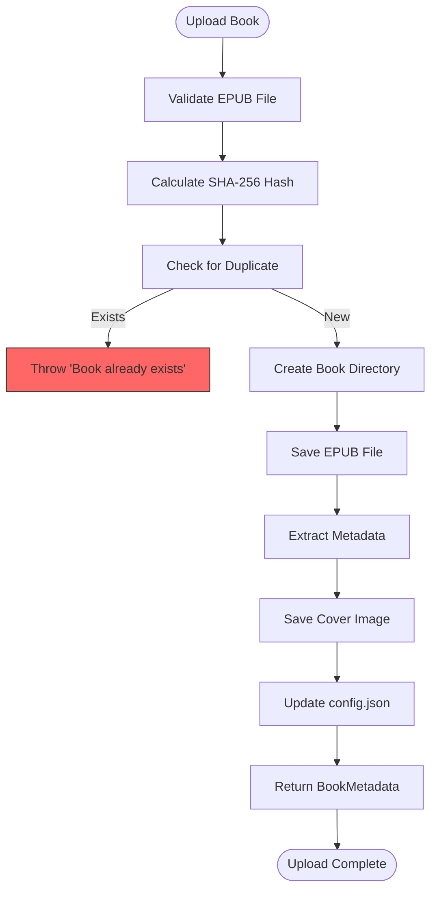
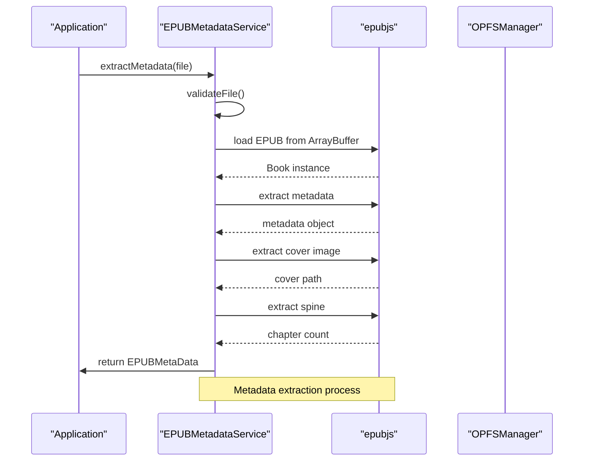
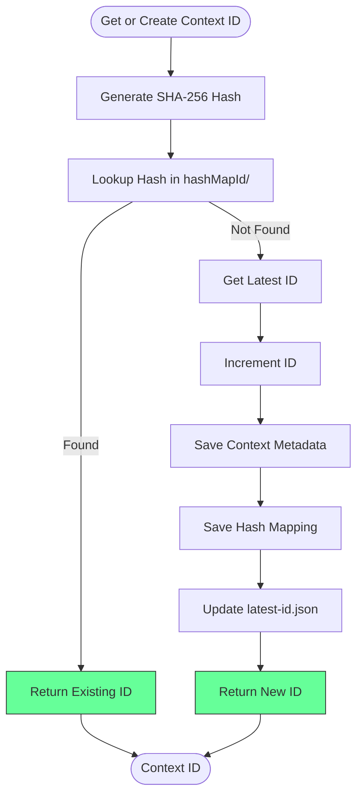
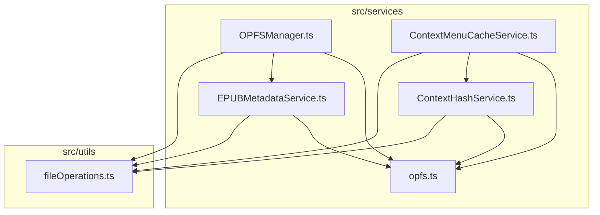

# Storage Management Revamp

<cite>
**Referenced Files in This Document**   
- [opfs.ts](file://src/services/opfs.ts)
- [OPFSManager.ts](file://src/services/OPFSManager.ts)
- [EPUBMetadataService.ts](file://src/services/EPUBMetadataService.ts)
- [ContextMenuCacheService.ts](file://src/services/ContextMenuCacheService.ts)
- [ContextHashService.ts](file://src/services/ContextHashService.ts)
- [book.ts](file://src/types/book.ts)
- [contextMenuCache.ts](file://src/types/contextMenuCache.ts)
- [epubValidation.ts](file://src/utils/epubValidation.ts)
- [fileOperations.ts](file://src/utils/fileOperations.ts)
- [logger.ts](file://src/utils/logger.ts)
</cite>

## Table of Contents
1. [Introduction](#introduction)
2. [Project Structure](#project-structure)
3. [Core Components](#core-components)
4. [Architecture Overview](#architecture-overview)
5. [Detailed Component Analysis](#detailed-component-analysis)
6. [Dependency Analysis](#dependency-analysis)
7. [Performance Considerations](#performance-considerations)
8. [Troubleshooting Guide](#troubleshooting-guide)
9. [Conclusion](#conclusion)

## Introduction
The Storage Management Revamp documentation provides a comprehensive overview of the OPFS (Origin Private File System) implementation in the EPUB reader application. This system enables persistent, high-performance storage for EPUB books, metadata, and AI context caching directly within the browser environment. The architecture leverages modern web APIs to create a robust file management system that supports book uploads, metadata extraction, duplicate detection, and efficient data retrieval.

## Project Structure
The storage management system is organized across several key directories and files within the application structure. The core functionality resides in the `src/services` directory, with supporting types in `src/types` and utility functions in `src/utils`. The system follows a modular architecture with clear separation of concerns between low-level file operations, business logic, and data management.

**Diagram sources**
- [opfs.ts](file://src/services/opfs.ts#L1-L64)
- [OPFSManager.ts](file://src/services/OPFSManager.ts#L1-L725)
- [EPUBMetadataService.ts](file://src/services/EPUBMetadataService.ts#L1-L177)

**Section sources**
- [opfs.ts](file://src/services/opfs.ts#L1-L64)
- [OPFSManager.ts](file://src/services/OPFSManager.ts#L1-L725)

## Core Components
The storage management system consists of several core components that work together to provide a comprehensive file management solution. These components include the OPFS service for low-level file operations, the OPFSManager for high-level book management, the EPUBMetadataService for extracting metadata from EPUB files, and the ContextMenuCacheService for managing AI context caching. Each component follows a functional programming paradigm with pure functions and proper error handling through the performFileOperation utility.

**Section sources**
- [opfs.ts](file://src/services/opfs.ts#L1-L64)
- [OPFSManager.ts](file://src/services/OPFSManager.ts#L1-L725)
- [EPUBMetadataService.ts](file://src/services/EPUBMetadataService.ts#L1-L177)
- [ContextMenuCacheService.ts](file://src/services/ContextMenuCacheService.ts#L1-L200)

## Architecture Overview
The storage management architecture is built around the OPFS API, providing a hierarchical file system within the browser. The system implements a multi-layered approach with distinct responsibilities: low-level file operations, book management, metadata extraction, and context caching. This layered architecture ensures separation of concerns and maintainability while providing a robust foundation for the EPUB reader application.

**Diagram sources**
- [OPFSManager.ts](file://src/services/OPFSManager.ts#L1-L725)
- [EPUBMetadataService.ts](file://src/services/EPUBMetadataService.ts#L1-L177)
- [ContextMenuCacheService.ts](file://src/services/ContextMenuCacheService.ts#L1-L200)

## Detailed Component Analysis

### OPFS Service Analysis
The OPFS service provides low-level operations for interacting with the Origin Private File System. It defines the directory structure constants and implements functions for initializing the file system structure and accessing the root directory.

**Diagram sources**
- [opfs.ts](file://src/services/opfs.ts#L1-L64)

**Section sources**
- [opfs.ts](file://src/services/opfs.ts#L1-L64)

### OPFSManager Analysis
The OPFSManager is the central component for book storage management, handling all operations related to EPUB book lifecycle including uploading, metadata extraction, duplicate detection, and deletion. It implements a comprehensive configuration system stored in config.json that tracks books, settings, and preset books.

**Diagram sources**
- [OPFSManager.ts](file://src/services/OPFSManager.ts#L1-L725)

**Section sources**
- [OPFSManager.ts](file://src/services/OPFSManager.ts#L1-L725)

### EPUB Metadata Service Analysis
The EPUBMetadataService handles the extraction of comprehensive metadata from EPUB files using the epubjs library. It performs validation, parses the EPUB structure, and extracts key information such as title, author, chapter count, and cover image.

**Diagram sources**
- [EPUBMetadataService.ts](file://src/services/EPUBMetadataService.ts#L1-L177)

**Section sources**
- [EPUBMetadataService.ts](file://src/services/EPUBMetadataService.ts#L1-L177)

### Context Menu Cache Service Analysis
The ContextMenuCacheService manages AI context caching using a hash-based deduplication system. It assigns unique IDs to text selections and caches AI responses to avoid redundant processing, significantly improving performance for frequently accessed content.

**Diagram sources**
- [ContextMenuCacheService.ts](file://src/services/ContextMenuCacheService.ts#L1-L200)
- [ContextHashService.ts](file://src/services/ContextHashService.ts#L1-L133)

**Section sources**
- [ContextMenuCacheService.ts](file://src/services/ContextMenuCacheService.ts#L1-L200)
- [ContextHashService.ts](file://src/services/ContextHashService.ts#L1-L133)

## Dependency Analysis
The storage management system has a well-defined dependency structure with clear separation between components. The OPFSManager serves as the central orchestrator, depending on lower-level services for specific functionality while providing a unified interface to the rest of the application.

**Diagram sources**
- [OPFSManager.ts](file://src/services/OPFSManager.ts#L1-L725)
- [EPUBMetadataService.ts](file://src/services/EPUBMetadataService.ts#L1-L177)
- [ContextMenuCacheService.ts](file://src/services/ContextMenuCacheService.ts#L1-L200)
- [ContextHashService.ts](file://src/services/ContextHashService.ts#L1-L133)
- [fileOperations.ts](file://src/utils/fileOperations.ts#L1-L91)

**Section sources**
- [OPFSManager.ts](file://src/services/OPFSManager.ts#L1-L725)
- [EPUBMetadataService.ts](file://src/services/EPUBMetadataService.ts#L1-L177)
- [ContextMenuCacheService.ts](file://src/services/ContextMenuCacheService.ts#L1-L200)

## Performance Considerations
The storage management system incorporates several performance optimizations to ensure efficient operation. The hash-based deduplication system prevents redundant processing of identical text selections, while the OPFS file system provides fast, persistent storage directly in the browser. The system also implements batch operations where appropriate, such as creating multiple directories simultaneously during initialization. Error handling is centralized through the performFileOperation utility, reducing code duplication and ensuring consistent behavior across operations.

**Section sources**
- [fileOperations.ts](file://src/utils/fileOperations.ts#L1-L91)
- [OPFSManager.ts](file://src/services/OPFSManager.ts#L1-L725)
- [ContextHashService.ts](file://src/services/ContextHashService.ts#L1-L133)

## Troubleshooting Guide
Common issues with the storage management system typically relate to browser compatibility or file validation. The system checks for OPFS support and provides appropriate error messages when the feature is unavailable. File validation ensures that only valid EPUB files are processed, with specific error messages for unsupported formats, empty files, or files exceeding the 100MB size limit. The logging system provides detailed information about operations, making it easier to diagnose issues during development.

**Section sources**
- [opfs.ts](file://src/services/opfs.ts#L1-L64)
- [epubValidation.ts](file://src/utils/epubValidation.ts#L1-L78)
- [logger.ts](file://src/utils/logger.ts#L1-L19)

## Conclusion
The Storage Management Revamp provides a robust, scalable solution for managing EPUB books and related data within the browser environment. By leveraging the OPFS API, the system offers persistent storage with excellent performance characteristics. The modular architecture with clear separation of concerns makes the system maintainable and extensible. The hash-based deduplication system for AI context caching represents a significant optimization, reducing redundant processing and improving user experience. Overall, this implementation provides a solid foundation for the EPUB reader application's storage needs.