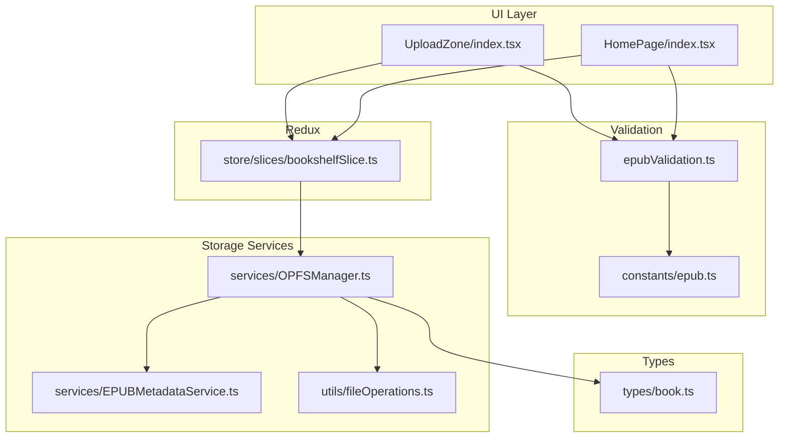
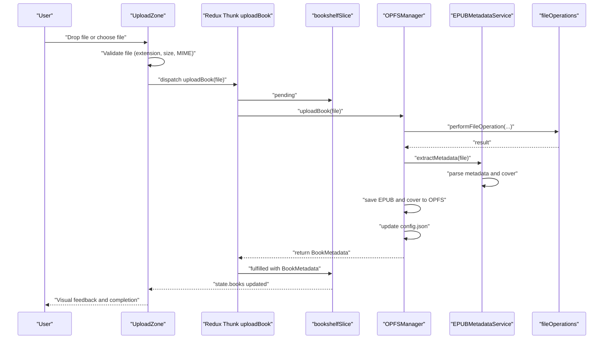
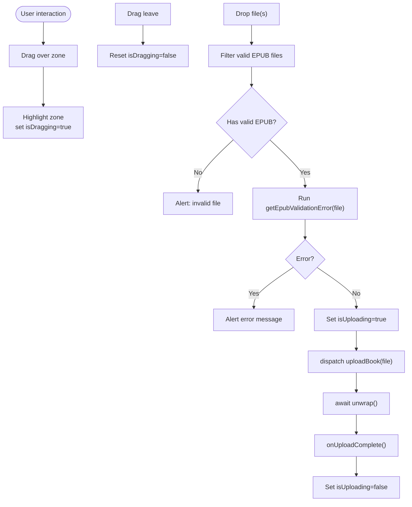
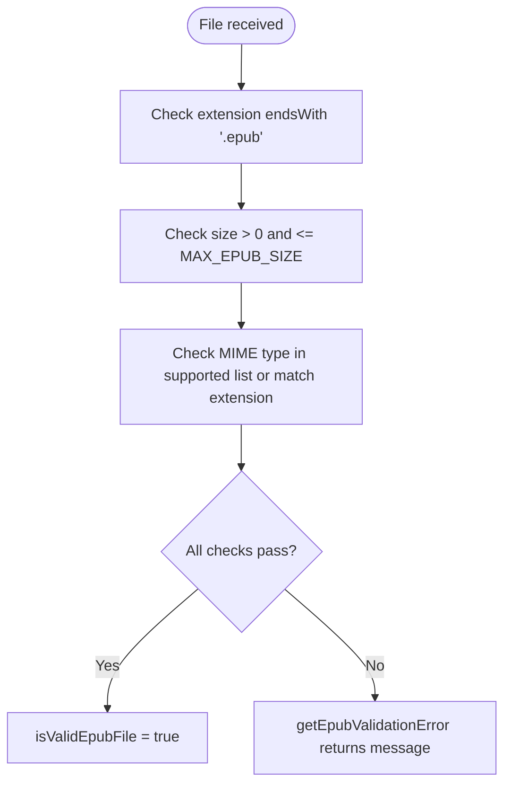
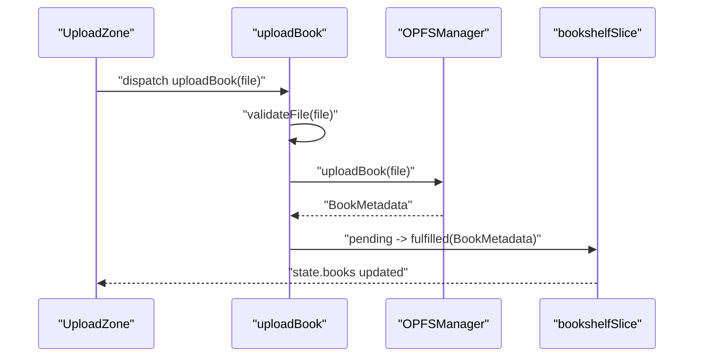
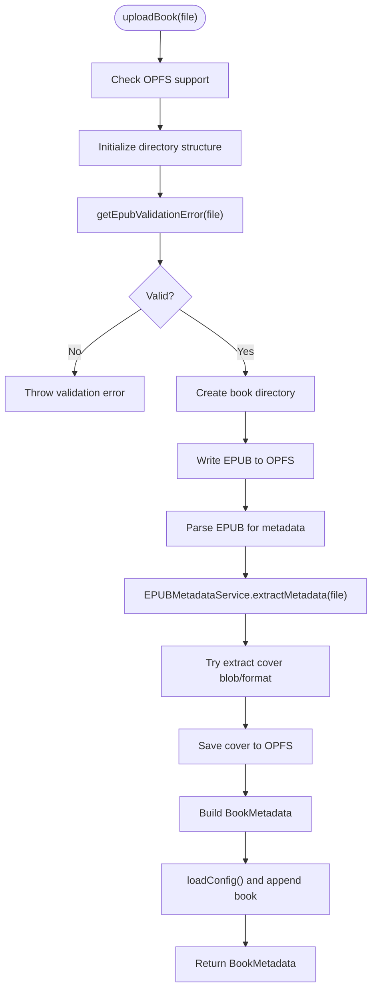
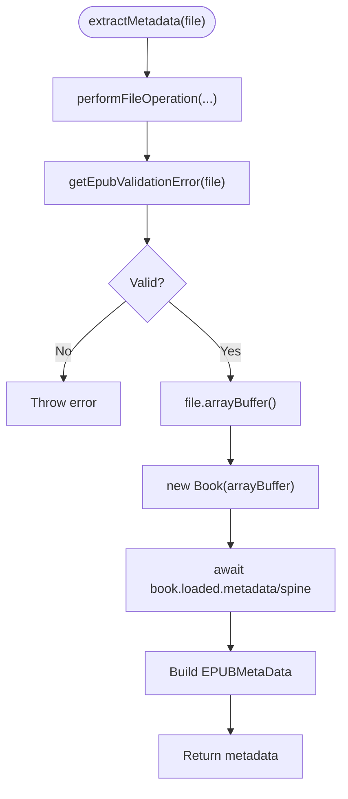
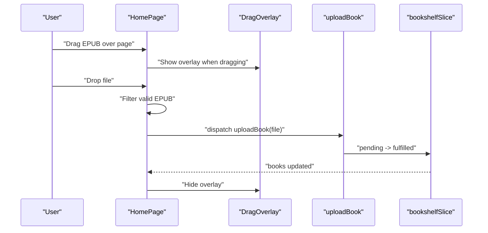
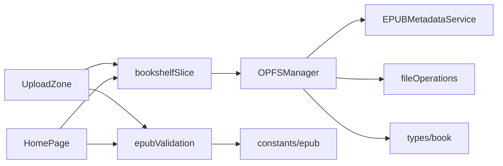

# Upload Process Workflow

<cite>
**Referenced Files in This Document**
- [UploadZone/index.tsx](file://src/components/UploadZone/index.tsx)
- [HomePage/index.tsx](file://src/pages/HomePage/index.tsx)
- [epubValidation.ts](file://src/utils/epubValidation.ts)
- [epub.ts](file://src/constants/epub.ts)
- [bookshelfSlice.ts](file://src/store/slices/bookshelfSlice.ts)
- [OPFSManager.ts](file://src/services/OPFSManager.ts)
- [EPUBMetadataService.ts](file://src/services/EPUBMetadataService.ts)
- [fileOperations.ts](file://src/utils/fileOperations.ts)
- [book.ts](file://src/types/book.ts)
</cite>

## Table of Contents
1. [Introduction](#introduction)
2. [Project Structure](#project-structure)
3. [Core Components](#core-components)
4. [Architecture Overview](#architecture-overview)
5. [Detailed Component Analysis](#detailed-component-analysis)
6. [Dependency Analysis](#dependency-analysis)
7. [Performance Considerations](#performance-considerations)
8. [Troubleshooting Guide](#troubleshooting-guide)
9. [Conclusion](#conclusion)

## Introduction
This document explains the end-to-end EPUB upload process from user interaction to successful storage. It covers:
- How the UploadZone component provides drag-and-drop and file picker interfaces with visual feedback.
- The validation chain starting with isValidEpubFile and getEpubValidationError, checking file extension, size, and MIME type.
- How handleFileUpload dispatches the uploadBook async thunk, triggering the Redux action flow from pending to fulfilled states.
- The role of OPFSManager.uploadBook in saving the file to the Origin Private File System (OPFS) and extracting metadata via EPUBMetadataService.
- Error handling for invalid files and upload failures, with user feedback through alerts.
- Integration examples showing the relationship between UploadZone, Redux actions, and the OPFS storage layer.

## Project Structure
The upload workflow spans UI components, validation utilities, Redux slices, and storage services:
- UI: UploadZone component and HomePage page orchestrate user interactions.
- Validation: Centralized utilities enforce EPUB file constraints.
- State: Redux slice manages upload lifecycle and bookshelf state.
- Storage: OPFSManager persists EPUBs and metadata; EPUBMetadataService extracts metadata and cover images.

**Diagram sources**
- [UploadZone/index.tsx](file://src/components/UploadZone/index.tsx#L1-L129)
- [HomePage/index.tsx](file://src/pages/HomePage/index.tsx#L1-L292)
- [epubValidation.ts](file://src/utils/epubValidation.ts#L1-L77)
- [epub.ts](file://src/constants/epub.ts#L1-L61)
- [bookshelfSlice.ts](file://src/store/slices/bookshelfSlice.ts#L1-L189)
- [OPFSManager.ts](file://src/services/OPFSManager.ts#L1-L510)
- [EPUBMetadataService.ts](file://src/services/EPUBMetadataService.ts#L1-L177)
- [fileOperations.ts](file://src/utils/fileOperations.ts#L1-L91)
- [book.ts](file://src/types/book.ts#L1-L116)

**Section sources**
- [UploadZone/index.tsx](file://src/components/UploadZone/index.tsx#L1-L129)
- [HomePage/index.tsx](file://src/pages/HomePage/index.tsx#L1-L292)
- [epubValidation.ts](file://src/utils/epubValidation.ts#L1-L77)
- [epub.ts](file://src/constants/epub.ts#L1-L61)
- [bookshelfSlice.ts](file://src/store/slices/bookshelfSlice.ts#L1-L189)
- [OPFSManager.ts](file://src/services/OPFSManager.ts#L1-L510)
- [EPUBMetadataService.ts](file://src/services/EPUBMetadataService.ts#L1-L177)
- [fileOperations.ts](file://src/utils/fileOperations.ts#L1-L91)
- [book.ts](file://src/types/book.ts#L1-L116)

## Core Components
- UploadZone: Presents drag-and-drop and file picker UI, validates input, triggers upload, and shows visual feedback.
- Validation utilities: Centralized checks for EPUB extension, size, and MIME type.
- Redux slice: Defines uploadBook async thunk and manages loading/error states.
- OPFSManager: Initializes OPFS, saves EPUB files, extracts metadata and cover, updates config.
- EPUBMetadataService: Extracts metadata and cover images from EPUB content.
- fileOperations: Wraps operations with consistent error handling and logging.

**Section sources**
- [UploadZone/index.tsx](file://src/components/UploadZone/index.tsx#L1-L129)
- [epubValidation.ts](file://src/utils/epubValidation.ts#L1-L77)
- [bookshelfSlice.ts](file://src/store/slices/bookshelfSlice.ts#L1-L189)
- [OPFSManager.ts](file://src/services/OPFSManager.ts#L1-L510)
- [EPUBMetadataService.ts](file://src/services/EPUBMetadataService.ts#L1-L177)
- [fileOperations.ts](file://src/utils/fileOperations.ts#L1-L91)

## Architecture Overview
The upload workflow follows a clear separation of concerns:
- UI layer handles user input and visual feedback.
- Validation ensures only valid EPUBs are processed.
- Redux async thunk orchestrates the upload lifecycle.
- OPFSManager performs persistence and metadata extraction.
- EPUBMetadataService parses EPUB content and cover images.
- fileOperations standardizes error handling across services.

**Diagram sources**
- [UploadZone/index.tsx](file://src/components/UploadZone/index.tsx#L1-L129)
- [bookshelfSlice.ts](file://src/store/slices/bookshelfSlice.ts#L1-L189)
- [OPFSManager.ts](file://src/services/OPFSManager.ts#L1-L510)
- [EPUBMetadataService.ts](file://src/services/EPUBMetadataService.ts#L1-L177)
- [fileOperations.ts](file://src/utils/fileOperations.ts#L1-L91)

## Detailed Component Analysis

### UploadZone Component
UploadZone provides:
- Drag-and-drop zone with visual feedback (highlighting and spinner).
- File picker via label/input element.
- Validation using isValidEpubFile and getEpubValidationError.
- Dispatch of uploadBook thunk and user feedback on success/failure.

Key behaviors:
- Drag events toggle isDragging state and highlight the zone.
- Drop handler filters valid EPUB files and invokes handleFileUpload.
- File input change triggers handleFileUpload.
- handleFileUpload runs validation, sets isUploading, dispatches uploadBook, and resets state.

**Diagram sources**
- [UploadZone/index.tsx](file://src/components/UploadZone/index.tsx#L1-L129)

**Section sources**
- [UploadZone/index.tsx](file://src/components/UploadZone/index.tsx#L1-L129)

### Validation Chain
The validation chain ensures only valid EPUBs are processed:
- isValidEpubFile checks extension, size, and MIME type.
- getEpubValidationError provides user-friendly messages for unsupported extensions, empty files, and oversized files.
- MAX_EPUB_SIZE and supported extensions/mime types are defined centrally.

**Diagram sources**
- [epubValidation.ts](file://src/utils/epubValidation.ts#L1-L77)
- [epub.ts](file://src/constants/epub.ts#L1-L61)

**Section sources**
- [epubValidation.ts](file://src/utils/epubValidation.ts#L1-L77)
- [epub.ts](file://src/constants/epub.ts#L1-L61)

### Redux Thunk: uploadBook
The uploadBook async thunk:
- Validates the file locally before dispatching.
- Calls OPFSManager.uploadBook to persist and extract metadata.
- Updates Redux state from pending to fulfilled with new book metadata.
- Propagates errors to rejected state.

**Diagram sources**
- [bookshelfSlice.ts](file://src/store/slices/bookshelfSlice.ts#L1-L189)
- [OPFSManager.ts](file://src/services/OPFSManager.ts#L1-L510)

**Section sources**
- [bookshelfSlice.ts](file://src/store/slices/bookshelfSlice.ts#L1-L189)

### OPFSManager.uploadBook
OPFSManager.uploadBook:
- Ensures OPFS is supported and initializes directory structure.
- Validates file using getEpubValidationError.
- Creates a unique book directory under books/<uuid>.
- Writes the EPUB file to OPFS.
- Loads EPUB content to extract metadata via EPUBMetadataService.
- Attempts to extract and save cover image with detected format.
- Builds BookMetadata and updates config.json.

**Diagram sources**
- [OPFSManager.ts](file://src/services/OPFSManager.ts#L1-L510)
- [EPUBMetadataService.ts](file://src/services/EPUBMetadataService.ts#L1-L177)
- [fileOperations.ts](file://src/utils/fileOperations.ts#L1-L91)

**Section sources**
- [OPFSManager.ts](file://src/services/OPFSManager.ts#L1-L510)
- [EPUBMetadataService.ts](file://src/services/EPUBMetadataService.ts#L1-L177)
- [fileOperations.ts](file://src/utils/fileOperations.ts#L1-L91)

### EPUBMetadataService
EPUBMetadataService:
- Extracts metadata (title, authors, description, publisher, publication date, language, ISBN).
- Determines chapter count from spine length.
- Extracts cover image URL and converts to Blob for storage.
- Provides fallback metadata when extraction fails.

**Diagram sources**
- [EPUBMetadataService.ts](file://src/services/EPUBMetadataService.ts#L1-L177)
- [epubValidation.ts](file://src/utils/epubValidation.ts#L1-L77)
- [fileOperations.ts](file://src/utils/fileOperations.ts#L1-L91)

**Section sources**
- [EPUBMetadataService.ts](file://src/services/EPUBMetadataService.ts#L1-L177)
- [epubValidation.ts](file://src/utils/epubValidation.ts#L1-L77)
- [fileOperations.ts](file://src/utils/fileOperations.ts#L1-L91)

### HomePage Integration
HomePage integrates drag-and-drop at the page level:
- Tracks drag enter/leave counters to manage overlay visibility.
- Validates dropped files and dispatches uploadBook.
- Displays browser compatibility warnings and error states.

**Diagram sources**
- [HomePage/index.tsx](file://src/pages/HomePage/index.tsx#L1-L292)

**Section sources**
- [HomePage/index.tsx](file://src/pages/HomePage/index.tsx#L1-L292)

## Dependency Analysis
The upload workflow exhibits low coupling and clear responsibilities:
- UploadZone depends on validation utilities and Redux slice.
- Redux slice depends on OPFSManager for persistence.
- OPFSManager depends on EPUBMetadataService for metadata extraction and fileOperations for robustness.
- EPUBMetadataService depends on epub.js and validation utilities.

**Diagram sources**
- [UploadZone/index.tsx](file://src/components/UploadZone/index.tsx#L1-L129)
- [HomePage/index.tsx](file://src/pages/HomePage/index.tsx#L1-L292)
- [epubValidation.ts](file://src/utils/epubValidation.ts#L1-L77)
- [epub.ts](file://src/constants/epub.ts#L1-L61)
- [bookshelfSlice.ts](file://src/store/slices/bookshelfSlice.ts#L1-L189)
- [OPFSManager.ts](file://src/services/OPFSManager.ts#L1-L510)
- [EPUBMetadataService.ts](file://src/services/EPUBMetadataService.ts#L1-L177)
- [fileOperations.ts](file://src/utils/fileOperations.ts#L1-L91)
- [book.ts](file://src/types/book.ts#L1-L116)

**Section sources**
- [UploadZone/index.tsx](file://src/components/UploadZone/index.tsx#L1-L129)
- [HomePage/index.tsx](file://src/pages/HomePage/index.tsx#L1-L292)
- [bookshelfSlice.ts](file://src/store/slices/bookshelfSlice.ts#L1-L189)
- [OPFSManager.ts](file://src/services/OPFSManager.ts#L1-L510)
- [EPUBMetadataService.ts](file://src/services/EPUBMetadataService.ts#L1-L177)
- [epubValidation.ts](file://src/utils/epubValidation.ts#L1-L77)
- [epub.ts](file://src/constants/epub.ts#L1-L61)
- [fileOperations.ts](file://src/utils/fileOperations.ts#L1-L91)
- [book.ts](file://src/types/book.ts#L1-L116)

## Performance Considerations
- File size limits reduce memory pressure and IO overhead.
- EPUB parsing occurs in-memory; large files may increase processing time.
- Cover extraction fetches and writes blobs; network and disk latency affect throughput.
- OPFS writes are asynchronous; batching multiple uploads can improve throughput.
- Consider adding upload progress reporting to enhance UX for large files.

[No sources needed since this section provides general guidance]

## Troubleshooting Guide
Common issues and resolutions:
- Unsupported browser: OPFSManager.isSupported() returns false; display a compatibility notice.
- Invalid file type: getEpubValidationError returns a message; prompt the user to select a valid EPUB.
- Oversized file: Exceeds MAX_EPUB_SIZE; inform the user of the size limit.
- OPFS initialization failure: Ensure permissions and origin isolation; retry initialization.
- Metadata extraction failure: EPUBMetadataService falls back to default metadata; notify the user if needed.
- Upload failure: Redux rejected payload contains error message; surface via alert and allow retry.

**Section sources**
- [OPFSManager.ts](file://src/services/OPFSManager.ts#L1-L510)
- [EPUBMetadataService.ts](file://src/services/EPUBMetadataService.ts#L1-L177)
- [epubValidation.ts](file://src/utils/epubValidation.ts#L1-L77)
- [HomePage/index.tsx](file://src/pages/HomePage/index.tsx#L1-L292)

## Conclusion
The EPUB upload process is structured around reusable validation, a clean Redux thunk, and robust OPFS persistence with metadata extraction. UploadZone and HomePage provide intuitive user experiences with immediate visual feedback, while centralized validation and error handling ensure reliability. The modular design enables easy maintenance and future enhancements such as progress indicators and batch uploads.