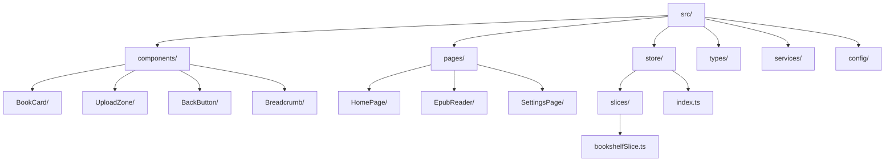
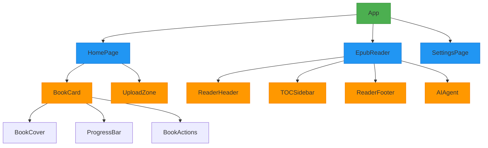
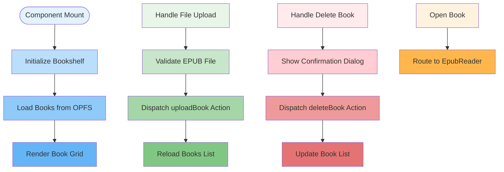
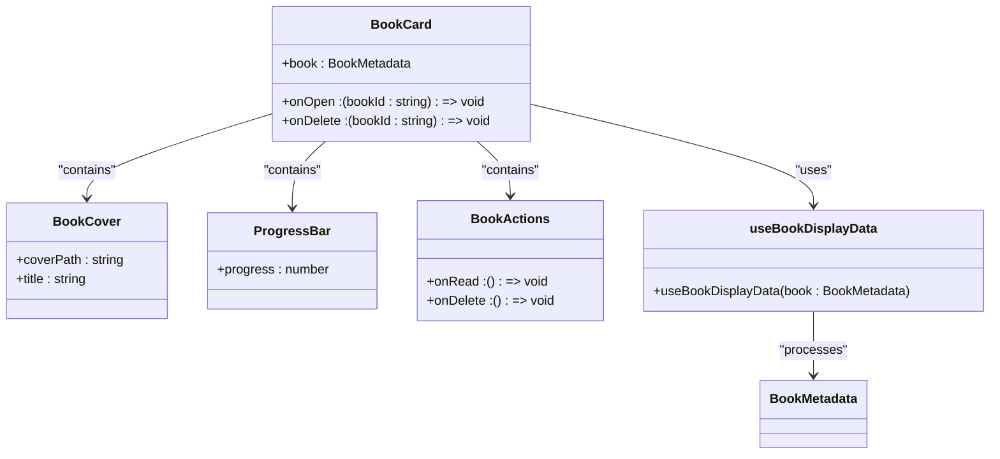
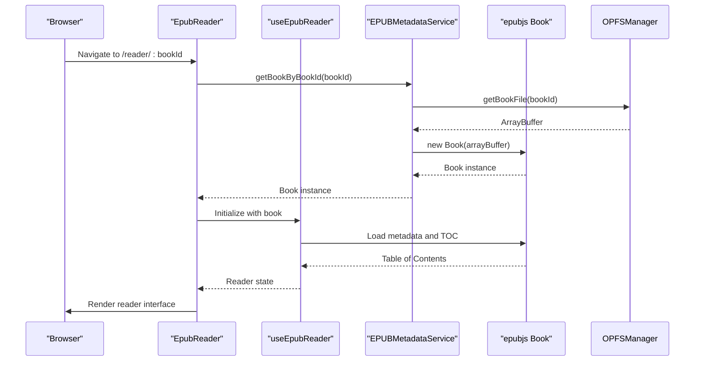
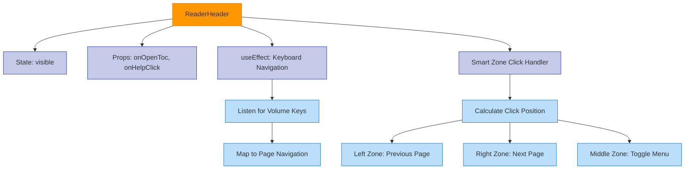
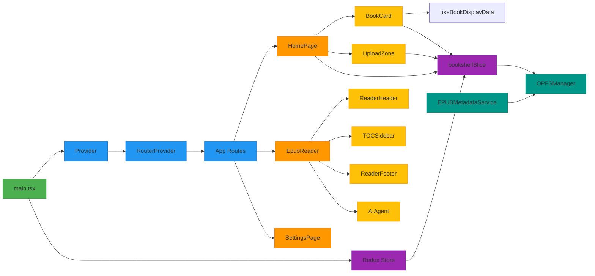
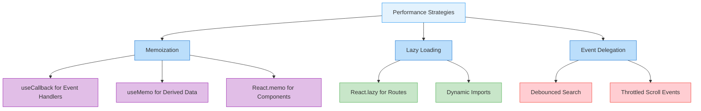

# Component Architecture

<cite>
**Referenced Files in This Document**   
- [main.tsx](file://src/main.tsx)
- [HomePage/index.tsx](file://src/pages/HomePage/index.tsx)
- [EpubReader/index.tsx](file://src/pages/EpubReader/index.tsx)
- [SettingsPage/index.tsx](file://src/pages/SettingsPage/index.tsx)
- [BookCard/index.tsx](file://src/components/BookCard/index.tsx)
- [UploadZone/index.tsx](file://src/components/UploadZone/index.tsx)
- [TOCSidebar.tsx](file://src/pages/EpubReader/components/TOCSidebar.tsx)
- [ReaderHeader.tsx](file://src/pages/EpubReader/components/ReaderHeader.tsx)
- [store/index.ts](file://src/store/index.ts)
- [slices/bookshelfSlice.ts](file://src/store/slices/bookshelfSlice.ts)
- [book.ts](file://src/types/book.ts)
- [router.tsx](file://src/config/router.tsx)
- [useBookDisplayData.ts](file://src/components/BookCard/hooks/useBookDisplayData.ts)
- [EPUBMetadataService.ts](file://src/services/EPUBMetadataService.ts)
</cite>

## Table of Contents
1. [Introduction](#introduction)
2. [Project Structure](#project-structure)
3. [Core Components](#core-components)
4. [Architecture Overview](#architecture-overview)
5. [Detailed Component Analysis](#detailed-component-analysis)
6. [Dependency Analysis](#dependency-analysis)
7. [Performance Considerations](#performance-considerations)
8. [Troubleshooting Guide](#troubleshooting-guide)
9. [Conclusion](#conclusion)

## Introduction
This document provides comprehensive architectural documentation for the React component system in the EPUB reader application. It describes the high-level design principles, component hierarchy, state management patterns, and integration strategies used throughout the codebase. The documentation covers functional components with Hooks, PascalCase naming convention, composition over inheritance, and other key architectural decisions that shape the application's structure and behavior.

## Project Structure

The project follows a feature-based organization with clear separation of concerns. Components are organized by functionality, with pages containing route-specific logic and components providing reusable UI elements.

**Diagram sources**
- [src/pages/HomePage/index.tsx](file://src/pages/HomePage/index.tsx)
- [src/components/BookCard/index.tsx](file://src/components/BookCard/index.tsx)
- [src/store/slices/bookshelfSlice.ts](file://src/store/slices/bookshelfSlice.ts)

**Section sources**
- [src/pages/HomePage/index.tsx](file://src/pages/HomePage/index.tsx)
- [src/components/BookCard/index.tsx](file://src/components/BookCard/index.tsx)
- [src/store/slices/bookshelfSlice.ts](file://src/store/slices/bookshelfSlice.ts)

## Core Components

The application's core components follow React best practices with functional components and Hooks. The architecture emphasizes composition over inheritance, using PascalCase naming convention for all component files. Key components include page-level containers (HomePage, EpubReader, SettingsPage) and reusable UI elements (BookCard, UploadZone, TOCSidebar). State management is handled through a combination of local component state and global Redux store for shared application state.

**Section sources**
- [src/pages/HomePage/index.tsx](file://src/pages/HomePage/index.tsx)
- [src/pages/EpubReader/index.tsx](file://src/pages/EpubReader/index.tsx)
- [src/components/BookCard/index.tsx](file://src/components/BookCard/index.tsx)

## Architecture Overview

The application architecture follows a layered approach with clear separation between presentation, business logic, and data management layers. React Router handles navigation between pages, while Redux manages global application state. The component hierarchy flows from App.tsx down to page components and then to reusable UI components.

**Diagram sources**
- [src/main.tsx](file://src/main.tsx)
- [src/config/router.tsx](file://src/config/router.tsx)
- [src/pages/HomePage/index.tsx](file://src/pages/HomePage/index.tsx)
- [src/pages/EpubReader/index.tsx](file://src/pages/EpubReader/index.tsx)

## Detailed Component Analysis

### HomePage Analysis
The HomePage component serves as the bookshelf interface, displaying all available books in a responsive grid layout. It handles book uploads via drag-and-drop or file picker, manages deletions, and provides navigation to the reader interface.

**Diagram sources**
- [src/pages/HomePage/index.tsx](file://src/pages/HomePage/index.tsx)
- [src/store/slices/bookshelfSlice.ts](file://src/store/slices/bookshelfSlice.ts)

**Section sources**
- [src/pages/HomePage/index.tsx](file://src/pages/HomePage/index.tsx)
- [src/store/slices/bookshelfSlice.ts](file://src/store/slices/bookshelfSlice.ts)

### BookCard Analysis
The BookCard component displays individual book information in the bookshelf grid. It receives book metadata as props and uses composition to include smaller components for specific UI elements.

#### Component Composition

**Diagram sources**
- [src/components/BookCard/index.tsx](file://src/components/BookCard/index.tsx)
- [src/components/BookCard/hooks/useBookDisplayData.ts](file://src/components/BookCard/hooks/useBookDisplayData.ts)
- [src/types/book.ts](file://src/types/book.ts)

**Section sources**
- [src/components/BookCard/index.tsx](file://src/components/BookCard/index.tsx)
- [src/components/BookCard/hooks/useBookDisplayData.ts](file://src/components/BookCard/hooks/useBookDisplayData.ts)

### EpubReader Analysis
The EpubReader component provides the full reading experience, integrating multiple subcomponents to create a cohesive interface for reading EPUB files.

#### Reader Component Flow

**Diagram sources**
- [src/pages/EpubReader/index.tsx](file://src/pages/EpubReader/index.tsx)
- [src/services/EPUBMetadataService.ts](file://src/services/EPUBMetadataService.ts)
- [src/pages/EpubReader/hooks/useEpubReader.ts](file://src/pages/EpubReader/hooks/useEpubReader.ts)

**Section sources**
- [src/pages/EpubReader/index.tsx](file://src/pages/EpubReader/index.tsx)
- [src/services/EPUBMetadataService.ts](file://src/services/EPUBMetadataService.ts)

### ReaderHeader Analysis
The ReaderHeader component manages navigation controls and state for the reading interface, demonstrating effective use of React Hooks for state management.

**Diagram sources**
- [src/pages/EpubReader/components/ReaderHeader.tsx](file://src/pages/EpubReader/components/ReaderHeader.tsx)
- [src/pages/EpubReader/index.tsx](file://src/pages/EpubReader/index.tsx)

**Section sources**
- [src/pages/EpubReader/components/ReaderHeader.tsx](file://src/pages/EpubReader/components/ReaderHeader.tsx)
- [src/pages/EpubReader/index.tsx](file://src/pages/EpubReader/index.tsx)

## Dependency Analysis

The application's dependency structure shows a clear flow of data and control from top-level components to specialized subcomponents, with proper separation between UI presentation and business logic.

**Diagram sources**
- [src/main.tsx](file://src/main.tsx)
- [src/store/index.ts](file://src/store/index.ts)
- [src/store/slices/bookshelfSlice.ts](file://src/store/slices/bookshelfSlice.ts)
- [src/services/OPFSManager.ts](file://src/services/OPFSManager.ts)
- [src/services/EPUBMetadataService.ts](file://src/services/EPUBMetadataService.ts)

**Section sources**
- [src/main.tsx](file://src/main.tsx)
- [src/store/index.ts](file://src/store/index.ts)
- [src/store/slices/bookshelfSlice.ts](file://src/store/slices/bookshelfSlice.ts)

## Performance Considerations

The application implements several performance optimizations to ensure smooth user experience, particularly in the bookshelf and reader interfaces.

### Memoization and Optimization

**Diagram sources**
- [src/pages/HomePage/index.tsx](file://src/pages/HomePage/index.tsx)
- [src/pages/EpubReader/index.tsx](file://src/pages/EpubReader/index.tsx)
- [src/components/BookCard/index.tsx](file://src/components/BookCard/index.tsx)

The application uses `useCallback` to memoize event handlers in components like HomePage and UploadZone, preventing unnecessary re-renders. Derived data is memoized using `useMemo`, such as the active tools calculation in EpubReader. The component structure favors composition over deep nesting, reducing re-render costs. For large book collections, the grid layout uses efficient rendering with minimal inline functions and callbacks.

## Troubleshooting Guide

This section documents common issues and their solutions based on the application's error handling patterns and state management.

**Section sources**
- [src/pages/HomePage/index.tsx](file://src/pages/HomePage/index.tsx)
- [src/pages/EpubReader/index.tsx](file://src/pages/EpubReader/index.tsx)
- [src/store/slices/bookshelfSlice.ts](file://src/store/slices/bookshelfSlice.ts)

### Common Issues and Solutions
- **Book upload fails**: Check file extension (.epub) and size (must be under 100MB). The application validates these conditions before upload.
- **Book not loading**: Ensure the browser supports OPFS (Chrome 86+, Edge 86+, Firefox 102+). The application shows a compatibility warning when OPFS is not supported.
- **Context menu not appearing**: Verify that at least one tool is enabled in Settings > Context Menu. The application checks for active tools before showing the context menu.
- **Page navigation not working**: Check for JavaScript errors in the console. The smart zone click handler logs debug information about click positions and zone detection.

## Conclusion

The EPUB reader application demonstrates a well-structured React component architecture that follows modern best practices. The use of functional components with Hooks provides a clean and maintainable codebase, while the PascalCase naming convention ensures consistency across the project. Composition over inheritance allows for flexible and reusable components, with proper separation between presentation and business logic. The Redux store effectively manages global state, particularly for the bookshelf functionality, while local component state handles UI-specific concerns. The application's performance optimizations ensure a smooth user experience, and the clear component hierarchy makes the codebase easy to navigate and extend.