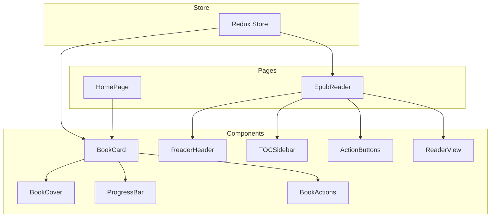
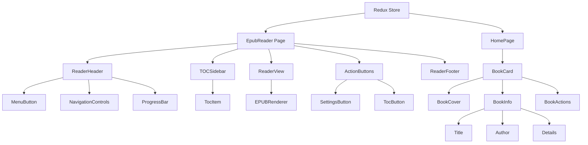
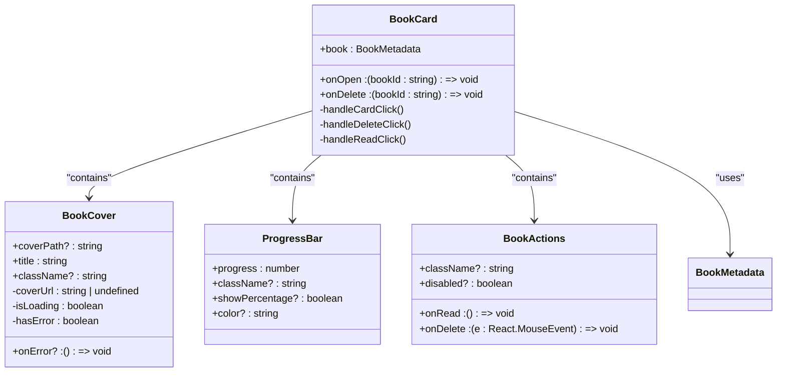
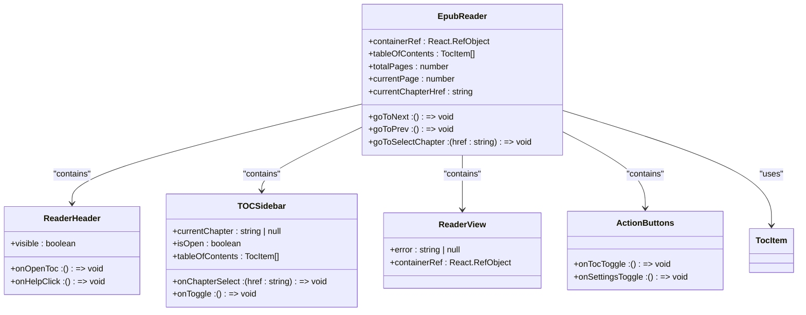
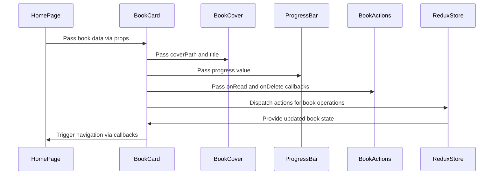
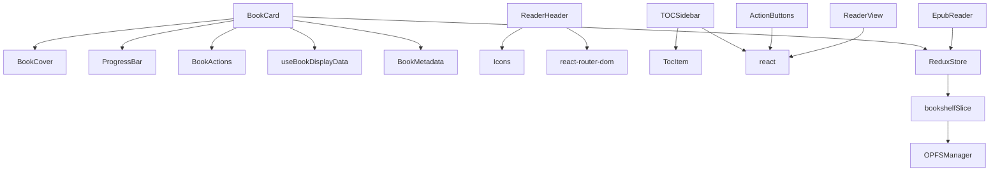

# Component Composition Patterns

<cite>
**Referenced Files in This Document**   
- [BookCard/index.tsx](file://src/components/BookCard/index.tsx)
- [BookCard/BookCover.tsx](file://src/components/BookCard/BookCover.tsx)
- [BookCard/ProgressBar.tsx](file://src/components/BookCard/ProgressBar.tsx)
- [BookCard/BookActions.tsx](file://src/components/BookCard/BookActions.tsx)
- [EpubReader/components/ReaderHeader.tsx](file://src/pages/EpubReader/components/ReaderHeader.tsx)
- [EpubReader/components/TOCSidebar.tsx](file://src/pages/EpubReader/components/TOCSidebar.tsx)
- [EpubReader/components/ActionButtons.tsx](file://src/pages/EpubReader/components/ActionButtons.tsx)
- [EpubReader/components/ReaderView.tsx](file://src/pages/EpubReader/components/ReaderView.tsx)
- [store/index.ts](file://src/store/index.ts)
- [types/book.ts](file://src/types/book.ts)
- [types/epub.ts](file://src/types/epub.ts)
</cite>

## Table of Contents
1. [Introduction](#introduction)
2. [Project Structure](#project-structure)
3. [Core Components](#core-components)
4. [Architecture Overview](#architecture-overview)
5. [Detailed Component Analysis](#detailed-component-analysis)
6. [Dependency Analysis](#dependency-analysis)
7. [Performance Considerations](#performance-considerations)
8. [Troubleshooting Guide](#troubleshooting-guide)
9. [Conclusion](#conclusion)

## Introduction
This document analyzes the component composition patterns used throughout the EPUB reader application. The architecture follows the "composition over inheritance" principle, building complex UIs by combining smaller, focused components. This approach enhances maintainability, reusability, and testability across the codebase. The documentation examines specific examples like BookCard composing BookCover, ProgressBar, and BookActions, as well as the EpubReader assembling ReaderHeader, TOCSidebar, and ActionButtons into a cohesive reading interface.

## Project Structure

**Diagram sources**
- [src/components/BookCard](file://src/components/BookCard)
- [src/pages/EpubReader](file://src/pages/EpubReader)
- [src/store](file://src/store)

**Section sources**
- [src/components](file://src/components)
- [src/pages](file://src/pages)
- [src/store](file://src/store)

## Core Components

The EPUB reader application implements a component composition architecture where complex UI elements are built by combining smaller, focused components. The BookCard component serves as a prime example of this pattern, composing BookCover, ProgressBar, and BookActions to create a cohesive book representation in the bookshelf. Similarly, the EpubReader page assembles ReaderHeader, TOCSidebar, ActionButtons, and ReaderView to create a complete reading interface. This composition approach follows the "composition over inheritance" principle, allowing for greater flexibility and reusability compared to class inheritance hierarchies.

**Section sources**
- [BookCard/index.tsx](file://src/components/BookCard/index.tsx)
- [EpubReader/components/ReaderHeader.tsx](file://src/pages/EpubReader/components/ReaderHeader.tsx)
- [EpubReader/components/TOCSidebar.tsx](file://src/pages/EpubReader/components/TOCSidebar.tsx)

## Architecture Overview

**Diagram sources**
- [src/pages/EpubReader](file://src/pages/EpubReader)
- [src/components/BookCard](file://src/components/BookCard)
- [src/store/index.ts](file://src/store/index.ts)

## Detailed Component Analysis

### BookCard Composition Analysis

The BookCard component demonstrates effective composition by combining multiple specialized components to create a complete book representation. It imports and utilizes BookCover, ProgressBar, and BookActions components, each responsible for a specific aspect of the book's visual representation.

**Diagram sources**
- [BookCard/index.tsx](file://src/components/BookCard/index.tsx)
- [BookCard/BookCover.tsx](file://src/components/BookCard/BookCover.tsx)
- [BookCard/ProgressBar.tsx](file://src/components/BookCard/ProgressBar.tsx)
- [BookCard/BookActions.tsx](file://src/components/BookCard/BookActions.tsx)
- [types/book.ts](file://src/types/book.ts)

**Section sources**
- [BookCard/index.tsx](file://src/components/BookCard/index.tsx#L1-L86)
- [BookCard/BookCover.tsx](file://src/components/BookCard/BookCover.tsx#L1-L109)
- [BookCard/ProgressBar.tsx](file://src/components/BookCard/ProgressBar.tsx#L1-L60)
- [BookCard/BookActions.tsx](file://src/components/BookCard/BookActions.tsx#L1-L67)

### EpubReader Composition Analysis

The EpubReader page exemplifies complex component composition by assembling multiple components into a cohesive reading interface. It combines ReaderHeader, TOCSidebar, ReaderView, and ActionButtons to create a complete reading experience.

**Diagram sources**
- [EpubReader/components/ReaderHeader.tsx](file://src/pages/EpubReader/components/ReaderHeader.tsx#L1-L86)
- [EpubReader/components/TOCSidebar.tsx](file://src/pages/EpubReader/components/TOCSidebar.tsx#L1-L102)
- [EpubReader/components/ReaderView.tsx](file://src/pages/EpubReader/components/ReaderView.tsx#L1-L50)
- [EpubReader/components/ActionButtons.tsx](file://src/pages/EpubReader/components/ActionButtons.tsx#L1-L50)
- [types/epub.ts](file://src/types/epub.ts#L1-L135)

**Section sources**
- [EpubReader/components/ReaderHeader.tsx](file://src/pages/EpubReader/components/ReaderHeader.tsx#L1-L86)
- [EpubReader/components/TOCSidebar.tsx](file://src/pages/EpubReader/components/TOCSidebar.tsx#L1-L102)
- [EpubReader/components/ReaderView.tsx](file://src/pages/EpubReader/components/ReaderView.tsx#L1-L50)
- [EpubReader/components/ActionButtons.tsx](file://src/pages/EpubReader/components/ActionButtons.tsx#L1-L50)

### Data Flow and State Management

The application uses a combination of prop drilling and Redux for state management. The BookCard component receives book data through props from the HomePage, while the EpubReader uses Redux to manage global application state.

**Diagram sources**
- [src/pages/HomePage/index.tsx](file://src/pages/HomePage/index.tsx#L274-L291)
- [BookCard/index.tsx](file://src/components/BookCard/index.tsx#L1-L86)
- [store/index.ts](file://src/store/index.ts#L1-L24)

**Section sources**
- [src/pages/HomePage/index.tsx](file://src/pages/HomePage/index.tsx#L274-L291)
- [BookCard/index.tsx](file://src/components/BookCard/index.tsx#L1-L86)
- [store/index.ts](file://src/store/index.ts#L1-L24)

## Dependency Analysis

**Diagram sources**
- [src/components/BookCard](file://src/components/BookCard)
- [src/pages/EpubReader/components](file://src/pages/EpubReader/components)
- [src/store](file://src/store)
- [src/services/OPFSManager](file://src/services/OPFSManager)

**Section sources**
- [src/components/BookCard](file://src/components/BookCard)
- [src/pages/EpubReader/components](file://src/pages/EpubReader/components)
- [src/store](file://src/store)

## Performance Considerations

The component composition pattern in this application has several performance implications. The use of React.memo is recommended for components that receive the same props frequently to prevent unnecessary re-renders in deeply composed trees. The BookCard component, for example, could benefit from memoization since it may render multiple times in a bookshelf list. Similarly, the ProgressBar component, which only changes when the progress value updates, is a good candidate for memoization. The application should also consider using React's useMemo and useCallback hooks to optimize expensive calculations and prevent unnecessary function recreations in composed components.

**Section sources**
- [BookCard/index.tsx](file://src/components/BookCard/index.tsx)
- [BookCard/ProgressBar.tsx](file://src/components/BookCard/ProgressBar.tsx)

## Troubleshooting Guide

When working with the component composition patterns in this application, several common issues may arise. For prop drilling issues, ensure that callbacks are properly passed through the component hierarchy and that event propagation is correctly managed (e.g., using stopPropagation when needed). For Redux integration problems, verify that the store is properly configured and that selectors are correctly implemented. When components fail to render, check that required props are being passed and that data types match the expected interfaces. For accessibility issues, ensure that ARIA attributes are properly propagated through composed components and that keyboard navigation is supported.

**Section sources**
- [BookCard/index.tsx](file://src/components/BookCard/index.tsx)
- [EpubReader/components/ReaderHeader.tsx](file://src/pages/EpubReader/components/ReaderHeader.tsx)
- [store/index.ts](file://src/store/index.ts)

## Conclusion

The EPUB reader application effectively implements component composition patterns to create a maintainable and reusable codebase. By following the "composition over inheritance" principle, the application achieves greater flexibility and easier testing compared to traditional inheritance-based approaches. The BookCard and EpubReader components demonstrate how complex UIs can be built by combining smaller, focused components with clear APIs. The strategic use of Redux for global state management complements the prop drilling approach, avoiding excessive prop passing while maintaining a predictable state management pattern. This architecture supports the development of accessible, performant, and maintainable components throughout the application.