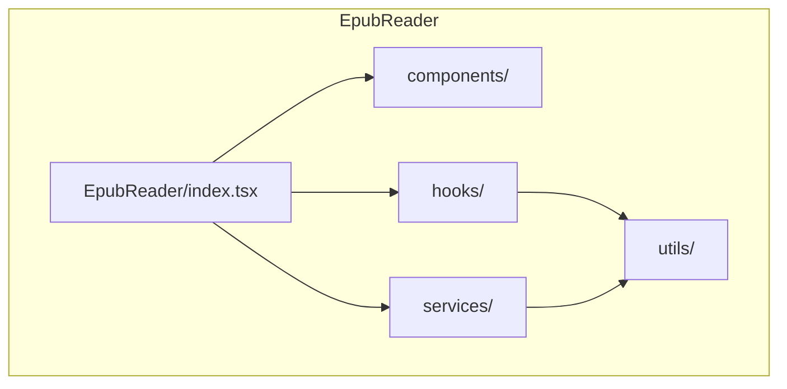
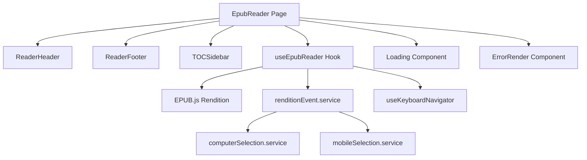
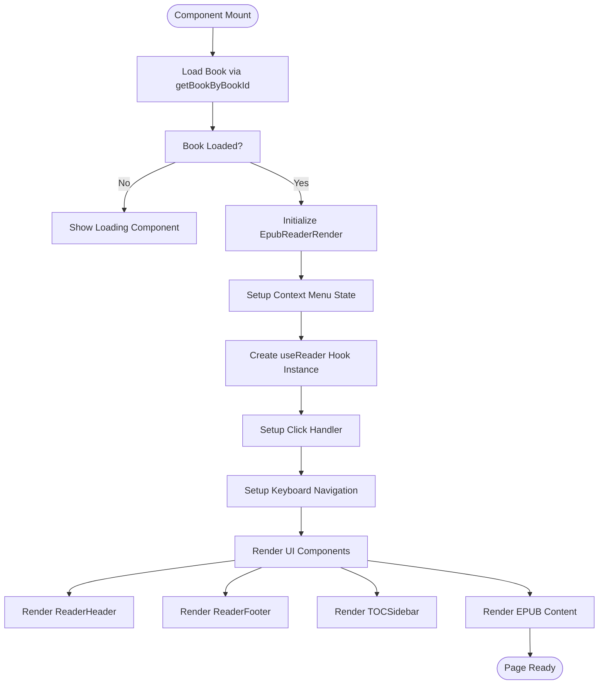
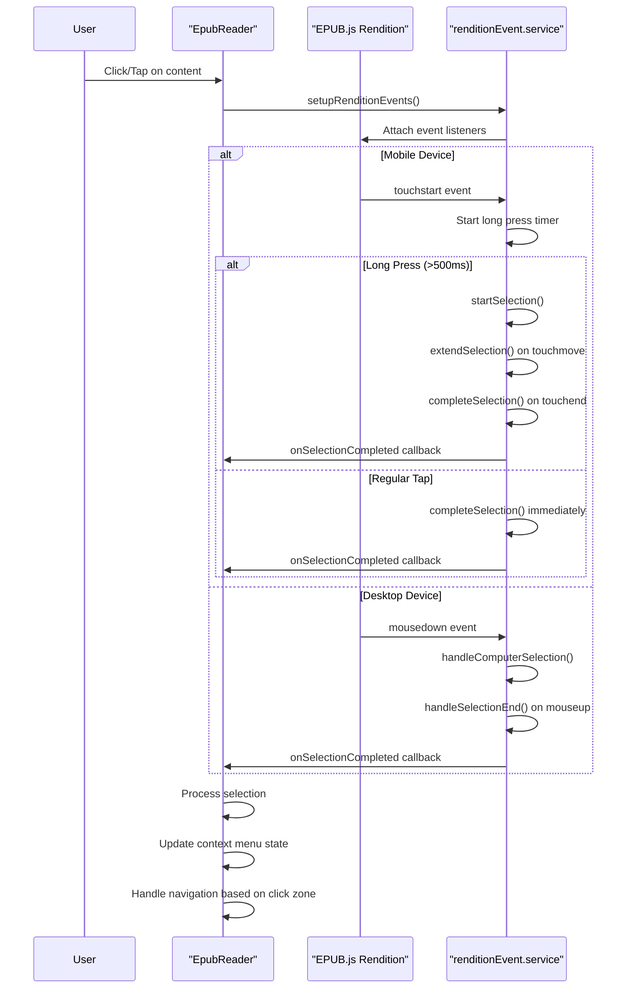
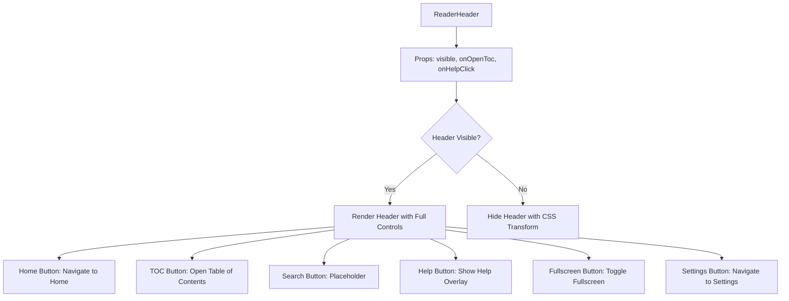
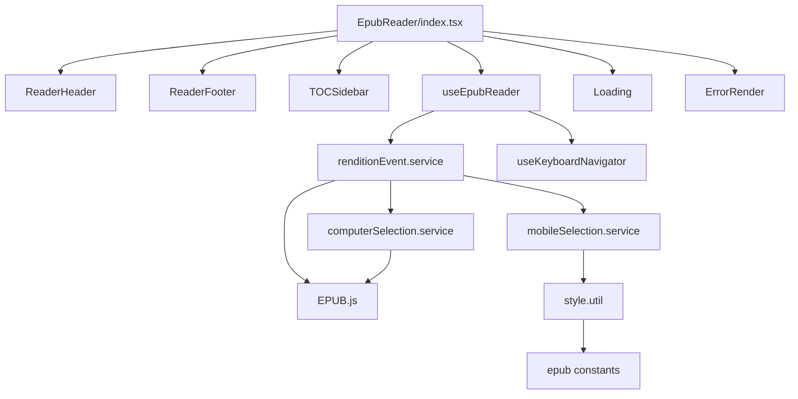

# EPUB Reader Page

<cite>
**Referenced Files in This Document**   
- [EpubReader/index.tsx](file://src/pages/EpubReader/index.tsx)
- [EpubReader/hooks/useEpubReader.ts](file://src/pages/EpubReader/hooks/useEpubReader.ts)
- [EpubReader/hooks/useKeyboardNavigator.ts](file://src/pages/EpubReader/hooks/useKeyboardNavigator.ts)
- [EpubReader/services/renditionEvent.service.ts](file://src/pages/EpubReader/services/renditionEvent.service.ts)
- [EpubReader/services/computerSelection.service.ts](file://src/pages/EpubReader/services/computerSelection.service.ts)
- [EpubReader/services/mobileSelection.service.ts](file://src/pages/EpubReader/services/mobileSelection.service.ts)
- [EpubReader/components/ReaderHeader.tsx](file://src/pages/EpubReader/components/ReaderHeader.tsx)
- [EpubReader/components/ReaderFooter.tsx](file://src/pages/EpubReader/components/ReaderFooter.tsx)
- [EpubReader/components/TOCSidebar.tsx](file://src/pages/EpubReader/components/TOCSidebar.tsx)
- [EpubReader/components/Loading.tsx](file://src/pages/EpubReader/components/Loading.tsx)
- [EpubReader/components/ErrorRender.tsx](file://src/pages/EpubReader/components/ErrorRender.tsx)
- [EpubReader/utils/style.util.ts](file://src/pages/EpubReader/utils/style.util.ts)
- [constants/epub.ts](file://src/constants/epub.ts)
- [services/EPUBMetadataService.ts](file://src/services/EPUBMetadataService.ts)
- [types/epub.ts](file://src/types/epub.ts)
</cite>

## Table of Contents
1. [Introduction](#introduction)
2. [Project Structure](#project-structure)
3. [Core Components](#core-components)
4. [Architecture Overview](#architecture-overview)
5. [Detailed Component Analysis](#detailed-component-analysis)
6. [Dependency Analysis](#dependency-analysis)
7. [Performance Considerations](#performance-considerations)
8. [Troubleshooting Guide](#troubleshooting-guide)
9. [Conclusion](#conclusion)

## Introduction
The EPUB Reader page provides the core reading experience for the application, integrating EPUB.js for rendering and navigation. It manages the complete reading lifecycle from book loading to content rendering, with support for user interactions, progress tracking, and responsive design. The page is composed of several key components that work together to deliver a seamless reading experience across devices.

## Project Structure
The EPUB Reader page is organized within the `src/pages/EpubReader` directory, following a modular structure that separates concerns into components, hooks, services, and utilities. The main entry point is `index.tsx`, which orchestrates the reader experience by composing various UI components and business logic.



**Diagram sources**
- [EpubReader/index.tsx](file://src/pages/EpubReader/index.tsx)

**Section sources**
- [EpubReader/index.tsx](file://src/pages/EpubReader/index.tsx)

## Core Components
The EPUB Reader page is built around several core components that handle different aspects of the reading experience. These include the ReaderHeader and ReaderFooter for navigation controls, TOCSidebar for chapter navigation, and various utility components for handling loading states and errors. The page uses the useEpubReader hook to manage the EPUB.js rendition lifecycle and coordinate interactions between components.

**Section sources**
- [EpubReader/index.tsx](file://src/pages/EpubReader/index.tsx)
- [EpubReader/components/ReaderHeader.tsx](file://src/pages/EpubReader/components/ReaderHeader.tsx)
- [EpubReader/components/ReaderFooter.tsx](file://src/pages/EpubReader/components/ReaderFooter.tsx)
- [EpubReader/components/TOCSidebar.tsx](file://src/pages/EpubReader/components/TOCSidebar.tsx)

## Architecture Overview
The EPUB Reader page follows a composition pattern where the main page component orchestrates various subcomponents and hooks to deliver a cohesive reading experience. The architecture is centered around the useEpubReader hook, which serves as the primary interface to EPUB.js, managing the rendition lifecycle, page navigation, and event handling.



**Diagram sources**
- [EpubReader/index.tsx](file://src/pages/EpubReader/index.tsx)
- [EpubReader/hooks/useEpubReader.ts](file://src/pages/EpubReader/hooks/useEpubReader.ts)
- [EpubReader/services/renditionEvent.service.ts](file://src/pages/EpubReader/services/renditionEvent.service.ts)

## Detailed Component Analysis

### EpubReader Page Analysis
The EpubReader component serves as the main container for the reading experience, handling book loading, error states, and orchestrating the various reader components. It uses React hooks to manage state and side effects, ensuring proper cleanup of resources when the component unmounts.



**Diagram sources**
- [EpubReader/index.tsx](file://src/pages/EpubReader/index.tsx)

**Section sources**
- [EpubReader/index.tsx](file://src/pages/EpubReader/index.tsx)

### useEpubReader Hook Analysis
The useEpubReader hook is the central piece of logic that manages the EPUB.js rendition and provides navigation capabilities to the UI components. It handles book rendering, page tracking, and progress persistence across sessions.

```mermaid
classDiagram
class useEpubReader {
+containerRef : RefObject<HTMLDivElement>
+tableOfContents : TocItem[]
+totalPages : number
+currentPage : number
+currentChapterHref : string
+goToNext() : void
+goToPrev() : void
+goToSelectChapter(href : string) : void
}
class renditionEvent.service {
+setupRenditionEvents(props : SetupRenditionEventsProps) : void
+isMobileDevice() : boolean
}
class useKeyboardNavigator {
+useKeyboardNavigation(goToNext : () => void, goToPrev : () => void, options? : KeyboardNavOptions) : void
}
useEpubReader --> renditionEvent.service : "uses"
useEpubReader --> useKeyboardNavigator : "uses"
useEpubReader --> "EPUB.js Book" : "manages"
useEpubReader --> "EPUB.js Rendition" : "creates"
```

**Diagram sources**
- [EpubReader/hooks/useEpubReader.ts](file://src/pages/EpubReader/hooks/useEpubReader.ts)
- [EpubReader/services/renditionEvent.service.ts](file://src/pages/EpubReader/services/renditionEvent.service.ts)
- [EpubReader/hooks/useKeyboardNavigator.ts](file://src/pages/EpubReader/hooks/useKeyboardNavigator.ts)

**Section sources**
- [EpubReader/hooks/useEpubReader.ts](file://src/pages/EpubReader/hooks/useEpubReader.ts)

### Reader Interaction Flow
The reader implements a sophisticated interaction model that handles both mouse and touch inputs differently based on the device type. The flow coordinates selection events, click handling, and navigation gestures to provide an intuitive reading experience.



**Diagram sources**
- [EpubReader/index.tsx](file://src/pages/EpubReader/index.tsx)
- [EpubReader/services/renditionEvent.service.ts](file://src/pages/EpubReader/services/renditionEvent.service.ts)
- [EpubReader/services/mobileSelection.service.ts](file://src/pages/EpubReader/services/mobileSelection.service.ts)
- [EpubReader/services/computerSelection.service.ts](file://src/pages/EpubReader/services/computerSelection.service.ts)

**Section sources**
- [EpubReader/services/renditionEvent.service.ts](file://src/pages/EpubReader/services/renditionEvent.service.ts)
- [EpubReader/services/mobileSelection.service.ts](file://src/pages/EpubReader/services/mobileSelection.service.ts)
- [EpubReader/services/computerSelection.service.ts](file://src/pages/EpubReader/services/computerSelection.service.ts)

### ReaderHeader Component Analysis
The ReaderHeader component provides the top navigation controls for the reading experience, including access to the table of contents, help overlay, and application navigation.



**Diagram sources**
- [EpubReader/components/ReaderHeader.tsx](file://src/pages/EpubReader/components/ReaderHeader.tsx)

**Section sources**
- [EpubReader/components/ReaderHeader.tsx](file://src/pages/EpubReader/components/ReaderHeader.tsx)

### ReaderFooter Component Analysis
The ReaderFooter component displays reading progress and provides navigation controls at the bottom of the screen.

```mermaid
flowchart TD
A[ReaderFooter] --> B[Props: visible, currentPage, totalPages, onNext, onPrev]
B --> C{Footer Visible?}
C --> |Yes| D[Render Footer with Progress and Controls]
C --> |No| E[Hide Footer with CSS]
D --> F[Calculate Progress: (currentPage+1)/totalPages]
F --> G[Display Progress Bar]
G --> H[Show Page Number: currentPage+1 of totalPages]
H --> I[Show Percentage: progress%]
D --> J[Next Page Button: Call onNext()]
D --> K[Previous Page Button: Call onPrev()]
```

**Diagram sources**
- [EpubReader/components/ReaderFooter.tsx](file://src/pages/EpubReader/components/ReaderFooter.tsx)

**Section sources**
- [EpubReader/components/ReaderFooter.tsx](file://src/pages/EpubReader/components/ReaderFooter.tsx)

### TOCSidebar Component Analysis
The TOCSidebar component provides hierarchical navigation through the book's table of contents, allowing users to jump to specific chapters.

```mermaid
classDiagram
class TOCSidebar {
-isOpen : boolean
-currentChapter : string
-tableOfContents : TocItem[]
-onChapterSelect : (href : string) => void
-onToggle : () => void
}
class TocItem {
+href : string
+label : string
+subitems? : TocItem[]
}
TOCSidebar --> TocItem : "contains"
TOCSidebar --> "EPUB.js Navigation" : "receives data from"
```

**Diagram sources**
- [EpubReader/components/TOCSidebar.tsx](file://src/pages/EpubReader/components/TOCSidebar.tsx)
- [types/epub.ts](file://src/types/epub.ts)

**Section sources**
- [EpubReader/components/TOCSidebar.tsx](file://src/pages/EpubReader/components/TOCSidebar.tsx)

## Dependency Analysis
The EPUB Reader page has a well-defined dependency structure that separates concerns and promotes reusability. The main page component depends on various UI components and hooks, which in turn depend on services and utilities.



**Diagram sources**
- [EpubReader/index.tsx](file://src/pages/EpubReader/index.tsx)
- [EpubReader/hooks/useEpubReader.ts](file://src/pages/EpubReader/hooks/useEpubReader.ts)
- [EpubReader/services/renditionEvent.service.ts](file://src/pages/EpubReader/services/renditionEvent.service.ts)

**Section sources**
- [EpubReader/index.tsx](file://src/pages/EpubReader/index.tsx)
- [EpubReader/hooks/useEpubReader.ts](file://src/pages/EpubReader/hooks/useEpubReader.ts)

## Performance Considerations
The EPUB Reader page implements several performance optimizations to ensure smooth rendering and interaction, especially for large books. The use of React's useCallback and useMemo hooks prevents unnecessary re-renders, while debouncing is used to limit the frequency of selection events. The page also properly cleans up EPUB.js instances and event listeners when unmounting to prevent memory leaks.

**Section sources**
- [EpubReader/hooks/useEpubReader.ts](file://src/pages/EpubReader/hooks/useEpubReader.ts)
- [EpubReader/index.tsx](file://src/pages/EpubReader/index.tsx)

## Troubleshooting Guide
The EPUB Reader page includes comprehensive error handling for various failure scenarios. When a book fails to load, the page displays an appropriate error message through the InvalidBookError component. The useEpubReader hook includes proper cleanup of the EPUB.js instance when the component unmounts or when a new book is loaded. For selection issues, the page implements different handling strategies for mobile and desktop devices, with appropriate debugging logs to help diagnose problems.

**Section sources**
- [EpubReader/index.tsx](file://src/pages/EpubReader/index.tsx)
- [EpubReader/components/ErrorRender.tsx](file://src/pages/EpubReader/components/ErrorRender.tsx)
- [EpubReader/hooks/useEpubReader.ts](file://src/pages/EpubReader/hooks/useEpubReader.ts)

## Conclusion
The EPUB Reader page provides a comprehensive reading experience by integrating EPUB.js with a well-structured React component architecture. It handles book loading, rendering, navigation, and user interactions through a combination of custom hooks, services, and UI components. The page maintains reading progress across sessions and provides intuitive controls for both desktop and mobile users. The modular design allows for easy extension and customization, making it a robust foundation for the application's core reading functionality.