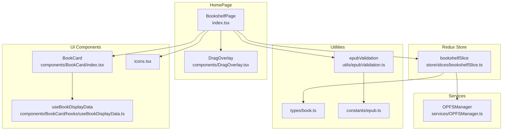
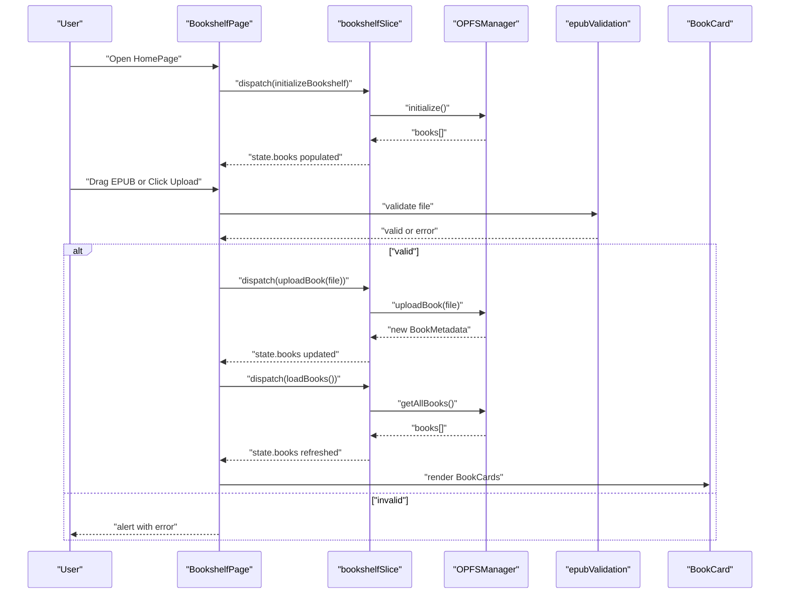
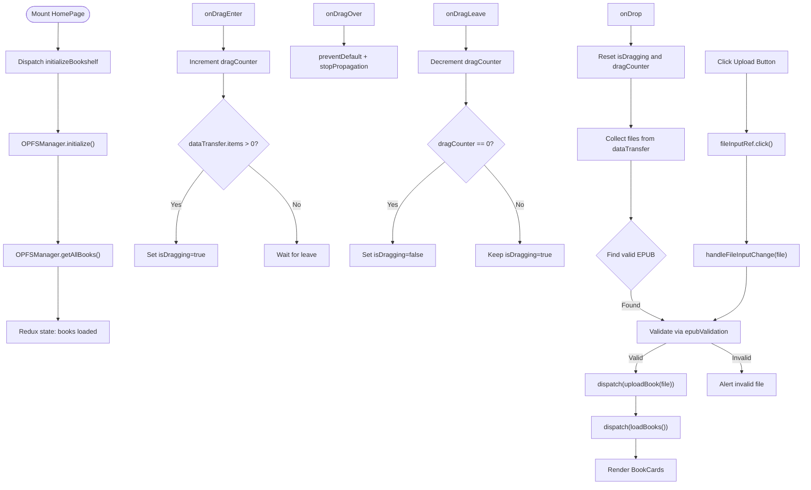
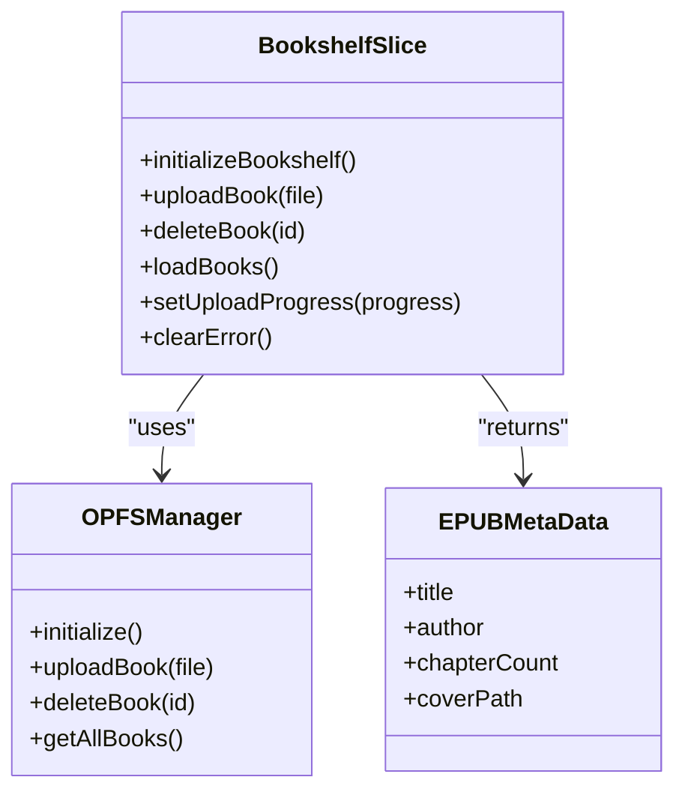
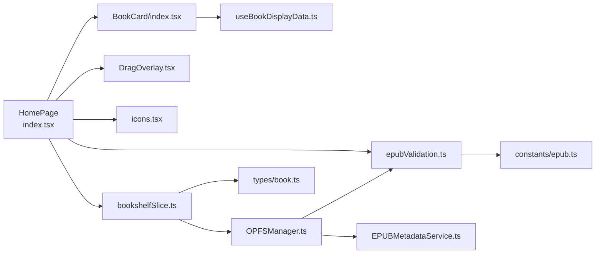

# Home Page

<cite>
**Referenced Files in This Document**
- [index.tsx](file://src/pages/HomePage/index.tsx)
- [DragOverlay.tsx](file://src/pages/HomePage/components/DragOverlay.tsx)
- [bookshelfSlice.ts](file://src/store/slices/bookshelfSlice.ts)
- [OPFSManager.ts](file://src/services/OPFSManager.ts)
- [epubValidation.ts](file://src/utils/epubValidation.ts)
- [book.ts](file://src/types/book.ts)
- [useBookDisplayData.ts](file://src/components/BookCard/hooks/useBookDisplayData.ts)
- [icons.tsx](file://src/components/icons.tsx)
- [epub.ts](file://src/constants/epub.ts)
</cite>

## Table of Contents
1. [Introduction](#introduction)
2. [Project Structure](#project-structure)
3. [Core Components](#core-components)
4. [Architecture Overview](#architecture-overview)
5. [Detailed Component Analysis](#detailed-component-analysis)
6. [Dependency Analysis](#dependency-analysis)
7. [Performance Considerations](#performance-considerations)
8. [Troubleshooting Guide](#troubleshooting-guide)
9. [Conclusion](#conclusion)

## Introduction
The HomePage component is the primary entry point and bookshelf interface for the application. It orchestrates the user’s interaction with their EPUB collection by:
- Displaying books via BookCard components in a responsive grid
- Managing uploads through direct drag-and-drop interactions
- Providing visual feedback with the DragOverlay component
- Integrating with the Redux store via bookshelfSlice to manage book state
- Handling file uploads through OPFS storage
- Responding to user interactions such as clicking the upload button to trigger the system file picker

It also manages loading and empty states, ensures responsiveness across devices, and coordinates state transitions between upload actions and book display.

## Project Structure
The HomePage resides under the pages directory and composes several supporting modules:
- DragOverlay: renders a full-screen overlay during drag-and-drop
- bookshelfSlice: Redux slice for initializing, uploading, deleting, and listing books
- OPFSManager: service layer for OPFS operations (initialization, upload, deletion, listing)
- epubValidation: shared validation utilities for EPUB files
- BookCard and its hooks: reusable components for rendering individual books
- Icons: reusable SVG icons for UI affordances

**Diagram sources**
- [index.tsx](file://src/pages/HomePage/index.tsx#L1-L292)
- [DragOverlay.tsx](file://src/pages/HomePage/components/DragOverlay.tsx#L1-L25)
- [bookshelfSlice.ts](file://src/store/slices/bookshelfSlice.ts#L1-L189)
- [OPFSManager.ts](file://src/services/OPFSManager.ts#L1-L510)
- [epubValidation.ts](file://src/utils/epubValidation.ts#L1-L77)
- [book.ts](file://src/types/book.ts#L1-L116)
- [useBookDisplayData.ts](file://src/components/BookCard/hooks/useBookDisplayData.ts#L1-L33)
- [icons.tsx](file://src/components/icons.tsx#L1-L200)
- [epub.ts](file://src/constants/epub.ts#L1-L61)

**Section sources**
- [index.tsx](file://src/pages/HomePage/index.tsx#L1-L292)
- [bookshelfSlice.ts](file://src/store/slices/bookshelfSlice.ts#L1-L189)

## Core Components
- BookshelfPage: The main page component that initializes the bookshelf, handles drag-and-drop and file picker uploads, renders the header, error/browser warnings, loading/empty states, and the book grid.
- DragOverlay: A full-screen overlay shown while dragging files over the page to indicate drop zone activation.
- bookshelfSlice: Redux slice that defines async thunks for initialization, upload, deletion, and listing books, plus reducers for upload progress and clearing errors.
- OPFSManager: Service responsible for OPFS initialization, directory structure management, book upload (including metadata extraction and cover saving), deletion, listing, and storage stats.
- epubValidation: Centralized validation utilities for EPUB files (extension, size, MIME).
- BookCard and useBookDisplayData: Renders a single book card with cover, title, author, progress, chapter count, and actions.

**Section sources**
- [index.tsx](file://src/pages/HomePage/index.tsx#L1-L292)
- [DragOverlay.tsx](file://src/pages/HomePage/components/DragOverlay.tsx#L1-L25)
- [bookshelfSlice.ts](file://src/store/slices/bookshelfSlice.ts#L1-L189)
- [OPFSManager.ts](file://src/services/OPFSManager.ts#L1-L510)
- [epubValidation.ts](file://src/utils/epubValidation.ts#L1-L77)
- [useBookDisplayData.ts](file://src/components/BookCard/hooks/useBookDisplayData.ts#L1-L33)

## Architecture Overview
The HomePage orchestrates a unidirectional data flow:
- Initialization: On mount, HomePage dispatches initializeBookshelf, which calls OPFSManager to initialize and load books. The Redux slice updates state and populates the bookshelf.
- Upload flow: Users can either drag-and-drop or click the upload button to open the file picker. Both paths converge into a validation step and then dispatch uploadBook. The slice triggers OPFSManager to persist the file, extract metadata, and update the store. A subsequent loadBooks fetches the updated list.
- Display: The HomePage reads the Redux state and renders BookCard components for each book. BookCard uses useBookDisplayData to format display values safely.

**Diagram sources**
- [index.tsx](file://src/pages/HomePage/index.tsx#L31-L152)
- [bookshelfSlice.ts](file://src/store/slices/bookshelfSlice.ts#L18-L88)
- [OPFSManager.ts](file://src/services/OPFSManager.ts#L123-L219)
- [epubValidation.ts](file://src/utils/epubValidation.ts#L23-L61)

## Detailed Component Analysis

### HomePage (BookshelfPage)
Responsibilities:
- Initialize the bookshelf on mount using OPFS-backed storage
- Manage drag-and-drop events to prevent flickering and show visual feedback
- Trigger file uploads via hidden input or drag-and-drop
- Render error and browser compatibility warnings
- Render loading and empty states
- Display books using BookCard components

Key behaviors:
- Drag-and-drop handling uses a counter to track nested drag events and sets isDragging accordingly to avoid flickering.
- Hidden file input is programmatically clicked to open the system file picker.
- Validation uses epubValidation utilities to ensure EPUB compliance before dispatching upload.
- After successful upload, HomePage dispatches loadBooks to refresh the list.

**Diagram sources**
- [index.tsx](file://src/pages/HomePage/index.tsx#L80-L152)
- [epubValidation.ts](file://src/utils/epubValidation.ts#L23-L61)

**Section sources**
- [index.tsx](file://src/pages/HomePage/index.tsx#L1-L292)

### DragOverlay
Responsibility:
- Provide a full-screen overlay with visual cues when dragging a file over the page.

Implementation highlights:
- Visibility controlled by a boolean prop; component renders nothing when invisible.
- Uses backdrop blur and semi-transparent background for clear overlay effect.

**Section sources**
- [DragOverlay.tsx](file://src/pages/HomePage/components/DragOverlay.tsx#L1-L25)

### bookshelfSlice
Responsibilities:
- Define async thunks for initializeBookshelf, uploadBook, deleteBook, and loadBooks
- Manage loading/error states and upload progress
- Update Redux state on pending/fulfilled/rejected outcomes

Key points:
- initializeBookshelf validates OPFS support, initializes directories, and loads books
- uploadBook validates file, persists to OPFS, extracts metadata, and updates store
- deleteBook removes a book directory and updates config
- loadBooks refreshes the book list from OPFS

**Diagram sources**
- [bookshelfSlice.ts](file://src/store/slices/bookshelfSlice.ts#L1-L189)
- [OPFSManager.ts](file://src/services/OPFSManager.ts#L1-L510)
- [book.ts](file://src/types/book.ts#L1-L55)

**Section sources**
- [bookshelfSlice.ts](file://src/store/slices/bookshelfSlice.ts#L1-L189)

### OPFSManager
Responsibilities:
- Initialize OPFS directory structure and ensure config.json exists
- Upload EPUB files, create per-book directories, write EPUB and cover images
- Extract metadata and cover via EPUBMetadataService
- Delete books and update config
- List all books from config
- Provide storage statistics

Key validations:
- Uses epubValidation to validate files before upload
- Uses safeGetFileHandle and safeGetDirectoryHandle wrappers for robustness

**Section sources**
- [OPFSManager.ts](file://src/services/OPFSManager.ts#L1-L510)
- [epubValidation.ts](file://src/utils/epubValidation.ts#L1-L77)

### BookCard and useBookDisplayData
Responsibilities:
- Render a single book card with cover, title, author, progress, chapter count, and actions
- Provide safe fallbacks for missing metadata

**Section sources**
- [useBookDisplayData.ts](file://src/components/BookCard/hooks/useBookDisplayData.ts#L1-L33)
- [index.tsx](file://src/components/BookCard/index.tsx#L1-L87)

### Icons
- Plus and Settings icons are used in the header for upload and settings navigation.

**Section sources**
- [icons.tsx](file://src/components/icons.tsx#L1-L200)

## Dependency Analysis
- HomePage depends on:
  - Redux store via hooks to read state and dispatch actions
  - bookshelfSlice for async thunks and reducers
  - OPFSManager for storage operations
  - epubValidation for file checks
  - DragOverlay for visual feedback
  - BookCard and useBookDisplayData for rendering
  - Icons for UI affordances

- bookshelfSlice depends on:
  - OPFSManager for persistence
  - types/book for state and metadata shapes
  - constants/epub for validation constants

- OPFSManager depends on:
  - EPUBMetadataService for metadata extraction
  - epubValidation for file checks
  - fileOperations for safe file/directory access

**Diagram sources**
- [index.tsx](file://src/pages/HomePage/index.tsx#L1-L292)
- [bookshelfSlice.ts](file://src/store/slices/bookshelfSlice.ts#L1-L189)
- [OPFSManager.ts](file://src/services/OPFSManager.ts#L1-L510)
- [epubValidation.ts](file://src/utils/epubValidation.ts#L1-L77)
- [epub.ts](file://src/constants/epub.ts#L1-L61)
- [book.ts](file://src/types/book.ts#L1-L116)

**Section sources**
- [index.tsx](file://src/pages/HomePage/index.tsx#L1-L292)
- [bookshelfSlice.ts](file://src/store/slices/bookshelfSlice.ts#L1-L189)

## Performance Considerations
- Large book collections:
  - HomePage renders a responsive grid of BookCard components. For very large lists, consider virtualization or pagination to reduce DOM nodes and improve scroll performance.
  - Ensure BookCard renders efficiently by avoiding heavy computations in render; memoize derived values where possible.
- Drag-and-drop:
  - The dragCounter approach prevents flickering by accurately tracking nested drag events. Keep drag handlers lightweight to avoid jank.
- OPFS operations:
  - OPFSManager performs file writes and metadata extraction. These are asynchronous and offload work to the browser’s file system. Keep UI responsive by avoiding synchronous blocking operations.
- Validation:
  - Validation occurs before dispatching uploads. Keep validation fast and deterministic to minimize perceived latency.

[No sources needed since this section provides general guidance]

## Troubleshooting Guide
Common issues and resolutions:
- Drag event propagation:
  - Ensure preventDefault and stopPropagation are consistently called in drag handlers to avoid unexpected behavior in parent containers.
  - Use dragCounter to stabilize isDragging state and prevent flickering when moving over nested elements.
  - Reference: [index.tsx](file://src/pages/HomePage/index.tsx#L80-L131)

- File validation errors:
  - EPUB validation checks extension, size, and MIME. If alerts appear, confirm the file meets requirements and try again.
  - Reference: [epubValidation.ts](file://src/utils/epubValidation.ts#L23-L61)

- Browser compatibility:
  - OPFS is required. If unsupported, a warning is shown. Upgrade to a compatible browser.
  - Reference: [index.tsx](file://src/pages/HomePage/index.tsx#L226-L244)

- Upload failures:
  - Redux state captures errors during upload. Clear the error via the UI and retry.
  - Reference: [bookshelfSlice.ts](file://src/store/slices/bookshelfSlice.ts#L131-L146)

- OPFS initialization failures:
  - OPFSManager throws descriptive errors if initialization fails. Check browser support and permissions.
  - Reference: [OPFSManager.ts](file://src/services/OPFSManager.ts#L38-L60)

- Deleting a book:
  - Confirm deletion and ensure the directory and config are updated. Errors surface through Redux state.
  - Reference: [bookshelfSlice.ts](file://src/store/slices/bookshelfSlice.ts#L57-L75)

**Section sources**
- [index.tsx](file://src/pages/HomePage/index.tsx#L80-L152)
- [epubValidation.ts](file://src/utils/epubValidation.ts#L23-L61)
- [bookshelfSlice.ts](file://src/store/slices/bookshelfSlice.ts#L131-L146)
- [OPFSManager.ts](file://src/services/OPFSManager.ts#L38-L60)

## Conclusion
The HomePage component provides a cohesive, user-friendly interface for managing an EPUB bookshelf. It integrates seamlessly with Redux for state management, OPFS for persistent storage, and shared validation utilities for robust uploads. Its drag-and-drop UX is resilient against event propagation issues, and it gracefully handles loading, empty, and error states. For large libraries, consider performance optimizations such as virtualization to maintain responsiveness.