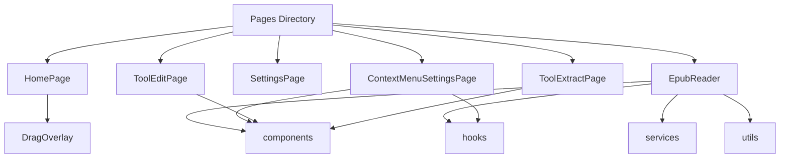
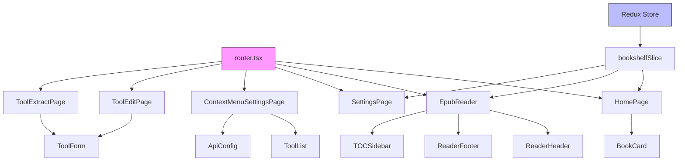
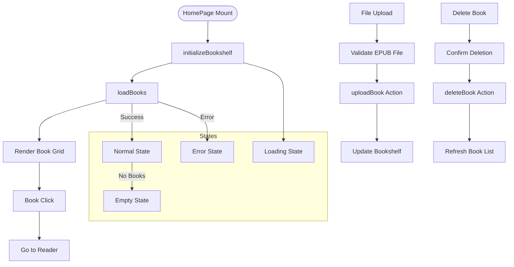
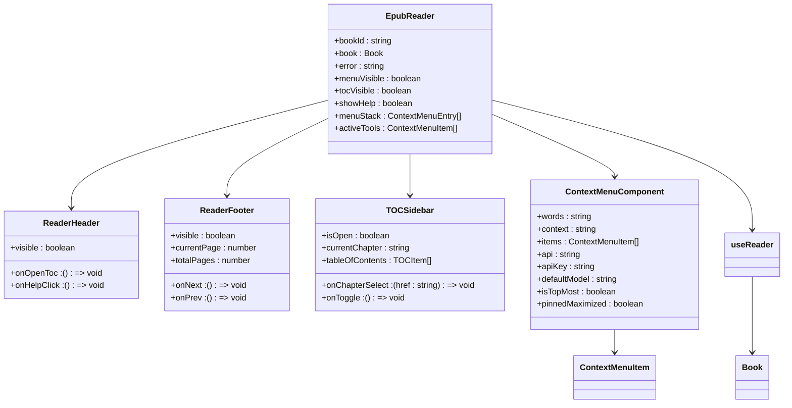
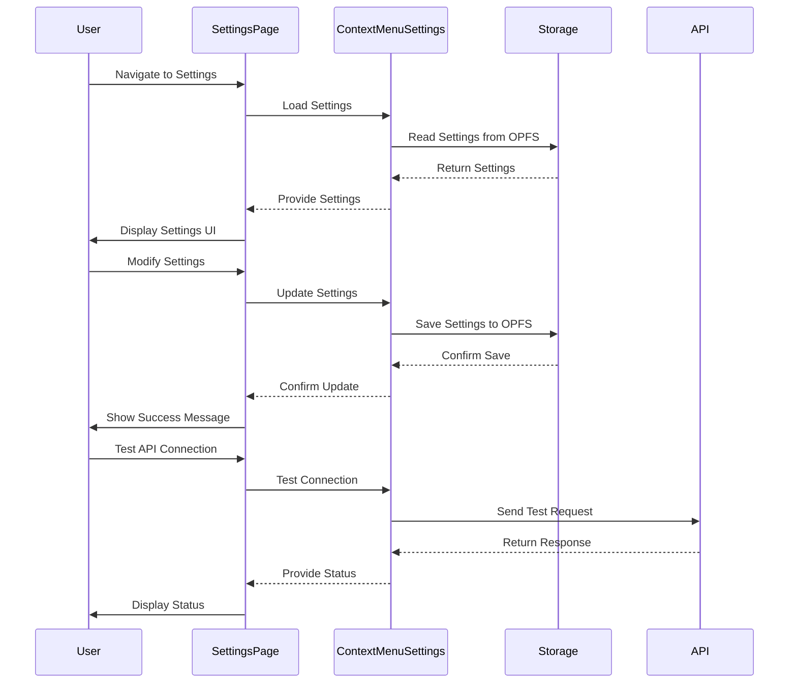
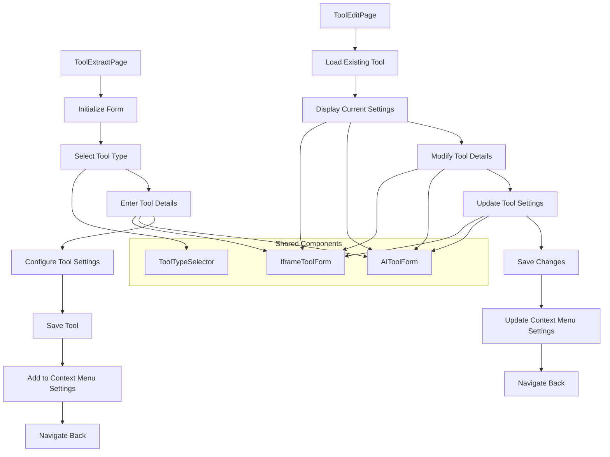

# Page-Level Components

<cite>
**Referenced Files in This Document**   
- [HomePage/index.tsx](file://src/pages/HomePage/index.tsx)
- [EpubReader/index.tsx](file://src/pages/EpubReader/index.tsx)
- [SettingsPage/index.tsx](file://src/pages/SettingsPage/index.tsx)
- [ContextMenuSettingsPage/index.tsx](file://src/pages/ContextMenuSettingsPage/index.tsx)
- [ToolEditPage/index.tsx](file://src/pages/ToolEditPage/index.tsx)
- [ToolExtractPage/index.tsx](file://src/pages/ToolExtractPage/index.tsx)
- [router.tsx](file://src/config/router.tsx)
- [bookshelfSlice.ts](file://src/store/slices/bookshelfSlice.ts)
- [EPUBMetadataService.ts](file://src/services/EPUBMetadataService.ts)
- [book.ts](file://src/types/book.ts)
- [ReaderHeader.tsx](file://src/pages/EpubReader/components/ReaderHeader.tsx)
- [ReaderFooter.tsx](file://src/pages/EpubReader/components/ReaderFooter.tsx)
- [BookCard/index.tsx](file://src/components/BookCard/index.tsx)
- [useContextMenuSettings.ts](file://src/pages/ContextMenuSettingsPage/hooks/useContextMenuSettings.ts)
- [useToolForm.ts](file://src/pages/ContextMenuSettingsPage/hooks/useToolForm.ts)
</cite>

## Table of Contents
1. [Introduction](#introduction)
2. [Project Structure](#project-structure)
3. [Core Components](#core-components)
4. [Architecture Overview](#architecture-overview)
5. [Detailed Component Analysis](#detailed-component-analysis)
6. [Dependency Analysis](#dependency-analysis)
7. [Performance Considerations](#performance-considerations)
8. [Troubleshooting Guide](#troubleshooting-guide)
9. [Conclusion](#conclusion)

## Introduction
This document provides comprehensive documentation for the page-level components that define the application's main views. It explains the structure and functionality of key pages including HomePage as the bookshelf interface with upload capabilities, EpubReader as the core reading experience with ReaderHeader and ReaderFooter for navigation controls, SettingsPage for application configuration, ContextMenuSettingsPage for AI tool management, and specialized pages like ToolEditPage and ToolExtractPage for tool customization.

The documentation covers routing integration via router.tsx and how these pages consume Redux state from bookshelfSlice, detailing data flow from state to UI, including how book metadata is passed to components. It provides examples of page composition patterns, such as how EpubReader orchestrates multiple sub-components for rendering, addresses lifecycle management, error handling, and loading states, and includes guidance on adding new pages and integrating them with the existing routing and state management system.

## Project Structure
The application follows a modular structure with pages organized in the src/pages directory, each containing their respective components and hooks. The core page components are organized as follows:

**Diagram sources**
- [src/pages/HomePage](file://src/pages/HomePage)
- [src/pages/EpubReader](file://src/pages/EpubReader)
- [src/pages/ContextMenuSettingsPage](file://src/pages/ContextMenuSettingsPage)
- [src/pages/ToolEditPage](file://src/pages/ToolEditPage)
- [src/pages/ToolExtractPage](file://src/pages/ToolExtractPage)

**Section sources**
- [src/pages](file://src/pages)

## Core Components
The application's core components include the main page-level components that define the user interface and experience. These components are designed with high cohesion and low coupling principles, utilizing React's component-based architecture and Redux for state management.

The HomePage serves as the bookshelf interface with upload capabilities, displaying books in a responsive grid layout. The EpubReader provides the core reading experience with navigation controls through ReaderHeader and ReaderFooter components. The SettingsPage offers application configuration options, while ContextMenuSettingsPage manages AI tools. Specialized pages like ToolEditPage and ToolExtractPage enable tool customization.

These components follow a consistent pattern of consuming Redux state via hooks, handling user interactions, and rendering appropriate UI based on application state, with proper error handling and loading states.

**Section sources**
- [src/pages/HomePage/index.tsx](file://src/pages/HomePage/index.tsx)
- [src/pages/EpubReader/index.tsx](file://src/pages/EpubReader/index.tsx)
- [src/pages/SettingsPage/index.tsx](file://src/pages/SettingsPage/index.tsx)
- [src/pages/ContextMenuSettingsPage/index.tsx](file://src/pages/ContextMenuSettingsPage/index.tsx)

## Architecture Overview
The application architecture follows a modern React pattern with Redux for state management and React Router for navigation. The page-level components are integrated through a centralized router configuration that defines the application's navigation structure.

**Diagram sources**
- [src/config/router.tsx](file://src/config/router.tsx)
- [src/store/slices/bookshelfSlice.ts](file://src/store/slices/bookshelfSlice.ts)
- [src/pages/HomePage/index.tsx](file://src/pages/HomePage/index.tsx)
- [src/pages/EpubReader/index.tsx](file://src/pages/EpubReader/index.tsx)
- [src/pages/ContextMenuSettingsPage/index.tsx](file://src/pages/ContextMenuSettingsPage/index.tsx)

## Detailed Component Analysis

### HomePage Analysis
The HomePage component serves as the bookshelf interface with upload capabilities. It displays all books in a responsive grid layout and handles book uploads via drag-and-drop or file picker, deletions, and navigation.

**Diagram sources**
- [src/pages/HomePage/index.tsx](file://src/pages/HomePage/index.tsx)
- [src/store/slices/bookshelfSlice.ts](file://src/store/slices/bookshelfSlice.ts)

**Section sources**
- [src/pages/HomePage/index.tsx](file://src/pages/HomePage/index.tsx)
- [src/components/BookCard/index.tsx](file://src/components/BookCard/index.tsx)

### EpubReader Analysis
The EpubReader component provides the core reading experience with ReaderHeader and ReaderFooter for navigation controls. It orchestrates multiple sub-components for rendering and handles complex interactions like context menu management and page navigation.

**Diagram sources**
- [src/pages/EpubReader/index.tsx](file://src/pages/EpubReader/index.tsx)
- [src/pages/EpubReader/components/ReaderHeader.tsx](file://src/pages/EpubReader/components/ReaderHeader.tsx)
- [src/pages/EpubReader/components/ReaderFooter.tsx](file://src/pages/EpubReader/components/ReaderFooter.tsx)
- [src/pages/EpubReader/components/TOCSidebar.tsx](file://src/pages/EpubReader/components/TOCSidebar.tsx)
- [src/pages/EpubReader/hooks/useEpubReader.ts](file://src/pages/EpubReader/hooks/useEpubReader.ts)

**Section sources**
- [src/pages/EpubReader/index.tsx](file://src/pages/EpubReader/index.tsx)
- [src/pages/EpubReader/components/ReaderHeader.tsx](file://src/pages/EpubReader/components/ReaderHeader.tsx)
- [src/pages/EpubReader/components/ReaderFooter.tsx](file://src/pages/EpubReader/components/ReaderFooter.tsx)

### SettingsPage Analysis
The SettingsPage component provides application configuration options, with a modular structure that allows for different settings sections. The ContextMenuSettingsPage specifically manages AI tool configuration.

**Diagram sources**
- [src/pages/SettingsPage/index.tsx](file://src/pages/SettingsPage/index.tsx)
- [src/pages/ContextMenuSettingsPage/index.tsx](file://src/pages/ContextMenuSettingsPage/index.tsx)
- [src/pages/ContextMenuSettingsPage/hooks/useContextMenuSettings.ts](file://src/pages/ContextMenuSettingsPage/hooks/useContextMenuSettings.ts)

**Section sources**
- [src/pages/SettingsPage/index.tsx](file://src/pages/SettingsPage/index.tsx)
- [src/pages/ContextMenuSettingsPage/index.tsx](file://src/pages/ContextMenuSettingsPage/index.tsx)

### Tool Management Pages Analysis
The ToolEditPage and ToolExtractPage components provide specialized interfaces for tool customization, allowing users to create and modify AI tools and iframe tools for the context menu.

**Diagram sources**
- [src/pages/ToolEditPage/index.tsx](file://src/pages/ToolEditPage/index.tsx)
- [src/pages/ToolExtractPage/index.tsx](file://src/pages/ToolExtractPage/index.tsx)
- [src/pages/ContextMenuSettingsPage/components/ToolTypeSelector.tsx](file://src/pages/ContextMenuSettingsPage/components/ToolTypeSelector.tsx)
- [src/pages/ContextMenuSettingsPage/components/AIToolForm.tsx](file://src/pages/ContextMenuSettingsPage/components/AIToolForm.tsx)
- [src/pages/ContextMenuSettingsPage/components/IframeToolForm.tsx](file://src/pages/ContextMenuSettingsPage/components/IframeToolForm.tsx)

**Section sources**
- [src/pages/ToolEditPage/index.tsx](file://src/pages/ToolEditPage/index.tsx)
- [src/pages/ToolExtractPage/index.tsx](file://src/pages/ToolExtractPage/index.tsx)
- [src/pages/ContextMenuSettingsPage/hooks/useToolForm.ts](file://src/pages/ContextMenuSettingsPage/hooks/useToolForm.ts)

## Dependency Analysis
The page-level components have a well-defined dependency structure, with clear relationships between components, hooks, and services. The dependency graph shows how components consume state and services to provide functionality.

```mermaid
graph TD
HomePage --> bookshelfSlice
HomePage --> EPUBMetadataService
HomePage --> BookCard
HomePage --> UploadZone
EpubReader --> bookshelfSlice
EpubReader --> EPUBMetadataService
EpubReader --> ReaderHeader
EpubReader --> ReaderFooter
EpubReader --> TOCSidebar
EpubReader --> ContextMenuComponent
EpubReader --> useEpubReader
SettingsPage --> useContextMenuSettings
SettingsPage --> Container
SettingsPage --> Breadcrumb
ContextMenuSettingsPage --> useContextMenuSettings
ContextMenuSettingsPage --> ApiConfig
ContextMenuSettingsPage --> ModelSearchInput
ContextMenuSettingsPage --> ToolList
ContextMenuSettingsPage --> SectionCard
ToolEditPage --> useContextMenuSettings
ToolEditPage --> useToolForm
ToolEditPage --> Container
ToolEditPage --> AIToolForm
ToolEditPage --> IframeToolForm
ToolExtractPage --> useContextMenuSettings
ToolExtractPage --> useToolForm
ToolExtractPage --> Container
ToolExtractPage --> AIToolForm
ToolExtractPage --> IframeToolForm
bookshelfSlice --> OPFSManager
useContextMenuSettings --> OPFSManager
useToolForm --> useContextMenuSettings
style HomePage fill:#f9f,stroke:#333
style EpubReader fill:#f9f,stroke:#333
style SettingsPage fill:#f9f,stroke:#333
style ContextMenuSettingsPage fill:#f9f,stroke:#333
style ToolEditPage fill:#f9f,stroke:#333
style ToolExtractPage fill:#f9f,stroke:#333
```

**Diagram sources**
- [src/store/slices/bookshelfSlice.ts](file://src/store/slices/bookshelfSlice.ts)
- [src/services/EPUBMetadataService.ts](file://src/services/EPUBMetadataService.ts)
- [src/pages/ContextMenuSettingsPage/hooks/useContextMenuSettings.ts](file://src/pages/ContextMenuSettingsPage/hooks/useContextMenuSettings.ts)
- [src/pages/ContextMenuSettingsPage/hooks/useToolForm.ts](file://src/pages/ContextMenuSettingsPage/hooks/useToolForm.ts)

**Section sources**
- [src/store/index.ts](file://src/store/index.ts)
- [src/config/router.tsx](file://src/config/router.tsx)

## Performance Considerations
The page-level components are designed with performance in mind, utilizing React's optimization patterns and efficient state management. Key performance considerations include:

1. **Memoization**: Components use useMemo and useCallback to prevent unnecessary re-renders
2. **Lazy Loading**: The router configuration enables code splitting and lazy loading of pages
3. **Efficient State Updates**: Redux actions are designed to minimize state mutations
4. **Virtualization**: Large lists are handled efficiently through proper component design
5. **Resource Management**: The EpubReader component properly cleans up resources in useEffect cleanup functions

The components also implement loading states and error boundaries to provide a smooth user experience during data fetching and processing operations.

## Troubleshooting Guide
When working with page-level components, consider the following troubleshooting steps:

1. **Routing Issues**: Verify the router.tsx configuration matches the component imports and paths
2. **State Access Problems**: Ensure useAppSelector and useAppDispatch hooks are properly configured
3. **Component Rendering**: Check for proper error boundaries and loading state handling
4. **Data Flow**: Verify the flow from Redux actions to reducers to component props
5. **Performance Issues**: Use React DevTools to identify unnecessary re-renders

Common issues include incorrect state selectors, missing dependency arrays in hooks, and improper cleanup of side effects. The use of TypeScript helps catch many of these issues at compile time.

**Section sources**
- [src/store/index.ts](file://src/store/index.ts)
- [src/config/router.tsx](file://src/config/router.tsx)
- [src/store/slices/bookshelfSlice.ts](file://src/store/slices/bookshelfSlice.ts)

## Conclusion
The page-level components in this application follow a consistent architecture pattern, leveraging React's component model, Redux for state management, and React Router for navigation. Each page is designed with clear responsibilities and well-defined interfaces, promoting maintainability and scalability.

The components effectively manage data flow from state to UI, handle lifecycle events appropriately, and provide robust error handling and loading states. The modular design allows for easy extension and customization, as demonstrated by the tool management pages.

By following the patterns established in these components, new pages can be added to the application with confidence that they will integrate seamlessly with the existing architecture and provide a consistent user experience.