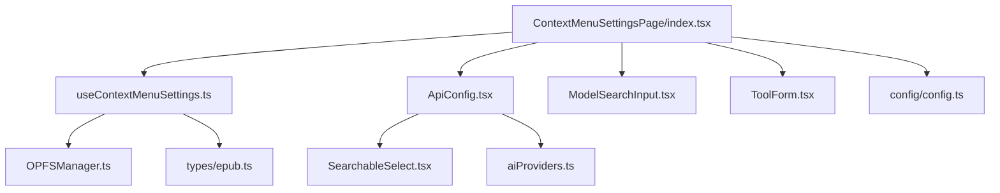
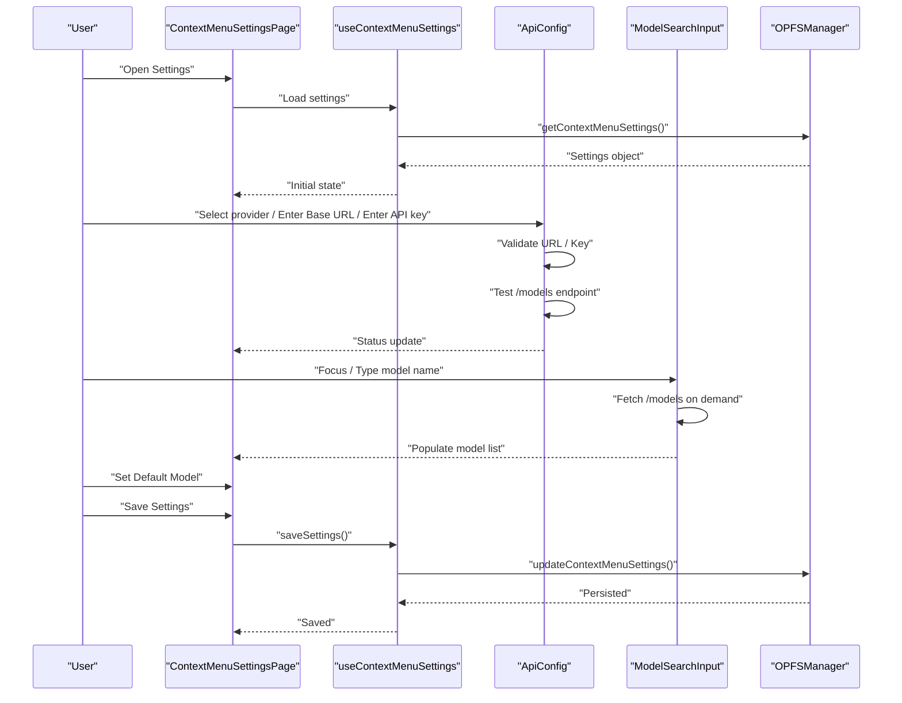
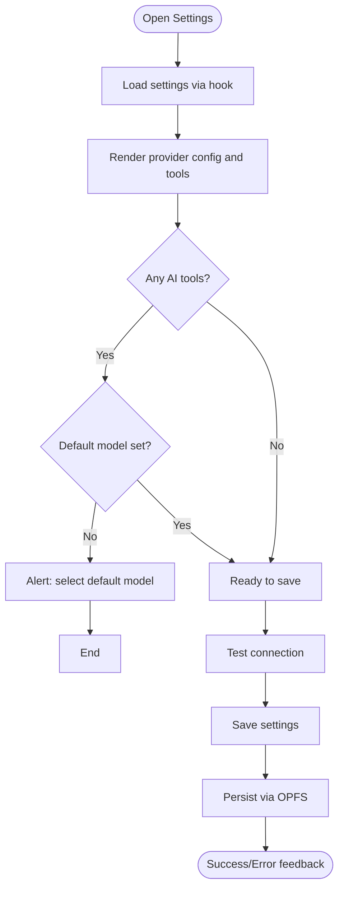
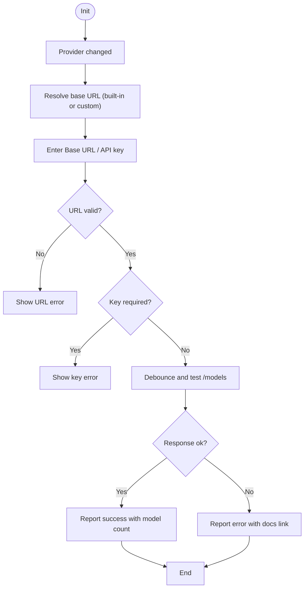
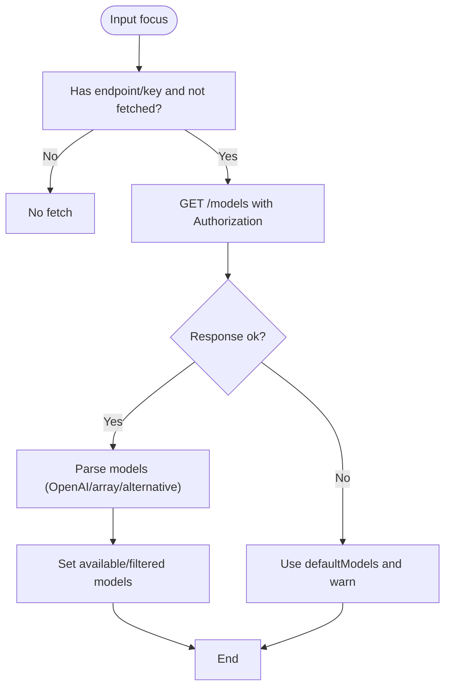
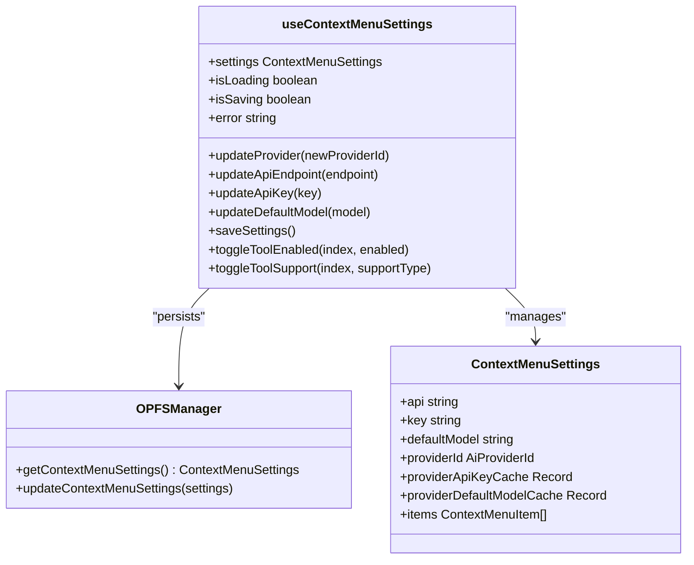
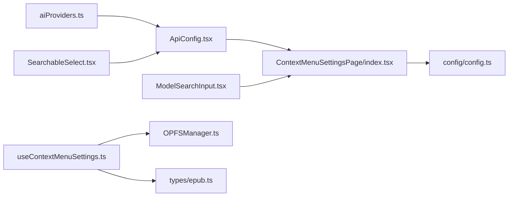

# AI Provider Configuration

<cite>
**Referenced Files in This Document**
- [ContextMenuSettingsPage/index.tsx](file://src/pages/ContextMenuSettingsPage/index.tsx)
- [ContextMenuSettingsPage/components/ApiConfig.tsx](file://src/pages/ContextMenuSettingsPage/components/ApiConfig.tsx)
- [ContextMenuSettingsPage/components/ModelSearchInput.tsx](file://src/pages/ContextMenuSettingsPage/components/ModelSearchInput.tsx)
- [ContextMenuSettingsPage/components/ToolForm.tsx](file://src/pages/ContextMenuSettingsPage/components/ToolForm.tsx)
- [ContextMenuSettingsPage/hooks/useContextMenuSettings.ts](file://src/pages/ContextMenuSettingsPage/hooks/useContextMenuSettings.ts)
- [components/SearchableSelect.tsx](file://src/components/SearchableSelect.tsx)
- [config/aiProviders.ts](file://src/config/aiProviders.ts)
- [services/OPFSManager.ts](file://src/services/OPFSManager.ts)
- [types/epub.ts](file://src/types/epub.ts)
- [config/config.ts](file://src/config/config.ts)
</cite>

## Table of Contents
1. [Introduction](#introduction)
2. [Project Structure](#project-structure)
3. [Core Components](#core-components)
4. [Architecture Overview](#architecture-overview)
5. [Detailed Component Analysis](#detailed-component-analysis)
6. [Dependency Analysis](#dependency-analysis)
7. [Performance Considerations](#performance-considerations)
8. [Security Considerations](#security-considerations)
9. [Troubleshooting Guide](#troubleshooting-guide)
10. [Implementation Examples](#implementation-examples)
11. [Conclusion](#conclusion)

## Introduction
This document explains the AI provider configuration system that powers the ContextMenuSettingsPage. It covers how users connect to multiple LLM platforms, configure API endpoints and keys, test connectivity, discover available models, and enforce validation for default model selection when AI tools are configured. It also provides guidance for extending the system with new providers, configuring custom OpenAI-compatible endpoints, and handling provider-specific authentication requirements.

## Project Structure
The AI configuration surface is centered around the ContextMenuSettingsPage, which orchestrates:
- Provider selection and API configuration
- Default model selection via a searchable input
- Tool management for AI actions
- Persistence of settings using OPFS-backed storage

**Diagram sources**
- [ContextMenuSettingsPage/index.tsx](file://src/pages/ContextMenuSettingsPage/index.tsx#L1-L273)
- [ContextMenuSettingsPage/components/ApiConfig.tsx](file://src/pages/ContextMenuSettingsPage/components/ApiConfig.tsx#L1-L276)
- [ContextMenuSettingsPage/components/ModelSearchInput.tsx](file://src/pages/ContextMenuSettingsPage/components/ModelSearchInput.tsx#L1-L235)
- [ContextMenuSettingsPage/components/ToolForm.tsx](file://src/pages/ContextMenuSettingsPage/components/ToolForm.tsx#L1-L63)
- [ContextMenuSettingsPage/hooks/useContextMenuSettings.ts](file://src/pages/ContextMenuSettingsPage/hooks/useContextMenuSettings.ts#L1-L438)
- [components/SearchableSelect.tsx](file://src/components/SearchableSelect.tsx#L1-L185)
- [config/aiProviders.ts](file://src/config/aiProviders.ts#L1-L110)
- [services/OPFSManager.ts](file://src/services/OPFSManager.ts#L404-L473)
- [types/epub.ts](file://src/types/epub.ts#L78-L109)
- [config/config.ts](file://src/config/config.ts#L1-L116)

**Section sources**
- [ContextMenuSettingsPage/index.tsx](file://src/pages/ContextMenuSettingsPage/index.tsx#L1-L273)
- [ContextMenuSettingsPage/hooks/useContextMenuSettings.ts](file://src/pages/ContextMenuSettingsPage/hooks/useContextMenuSettings.ts#L1-L120)

## Core Components
- ContextMenuSettingsPage: Central UI for AI provider configuration, default model selection, and tool management. It validates that a default model is set when AI tools exist and persists settings via OPFS.
- ApiConfig: Provider selector with base URL and API key fields, URL validation, and connection testing. Supports built-in providers and a custom OpenAI-compatible mode.
- ModelSearchInput: Dynamically fetches available models from the selected provider’s API and presents a searchable dropdown.
- useContextMenuSettings: Hook that loads, migrates, and saves settings; caches provider keys and default models per provider; updates tools and pins.
- SearchableSelect: Generic dropdown/select component used by ApiConfig to pick providers.
- AI_PROVIDER_CATALOG: Registry of supported providers with base URLs and documentation links.
- OPFSManager: Persists settings to a config.json file in the browser’s OPFS.

**Section sources**
- [ContextMenuSettingsPage/index.tsx](file://src/pages/ContextMenuSettingsPage/index.tsx#L1-L273)
- [ContextMenuSettingsPage/components/ApiConfig.tsx](file://src/pages/ContextMenuSettingsPage/components/ApiConfig.tsx#L1-L276)
- [ContextMenuSettingsPage/components/ModelSearchInput.tsx](file://src/pages/ContextMenuSettingsPage/components/ModelSearchInput.tsx#L1-L235)
- [ContextMenuSettingsPage/components/ToolForm.tsx](file://src/pages/ContextMenuSettingsPage/components/ToolForm.tsx#L1-L63)
- [ContextMenuSettingsPage/hooks/useContextMenuSettings.ts](file://src/pages/ContextMenuSettingsPage/hooks/useContextMenuSettings.ts#L1-L200)
- [components/SearchableSelect.tsx](file://src/components/SearchableSelect.tsx#L1-L185)
- [config/aiProviders.ts](file://src/config/aiProviders.ts#L1-L110)
- [services/OPFSManager.ts](file://src/services/OPFSManager.ts#L404-L473)

## Architecture Overview
The configuration flow integrates UI components, validation, and persistence:

**Diagram sources**
- [ContextMenuSettingsPage/index.tsx](file://src/pages/ContextMenuSettingsPage/index.tsx#L1-L273)
- [ContextMenuSettingsPage/components/ApiConfig.tsx](file://src/pages/ContextMenuSettingsPage/components/ApiConfig.tsx#L120-L195)
- [ContextMenuSettingsPage/components/ModelSearchInput.tsx](file://src/pages/ContextMenuSettingsPage/components/ModelSearchInput.tsx#L58-L112)
- [ContextMenuSettingsPage/hooks/useContextMenuSettings.ts](file://src/pages/ContextMenuSettingsPage/hooks/useContextMenuSettings.ts#L388-L406)
- [services/OPFSManager.ts](file://src/services/OPFSManager.ts#L407-L447)

## Detailed Component Analysis

### ContextMenuSettingsPage
- Responsibilities:
  - Renders provider configuration and default model input.
  - Validates that a default model is selected when AI tools exist.
  - Triggers connection testing and displays status.
  - Saves settings and shows feedback.
- Key behaviors:
  - Default model validation occurs before saving.
  - Connection test sets a nonce to re-trigger validation/testing.
  - Status chip and banner reflect testing state and messages.

**Section sources**
- [ContextMenuSettingsPage/index.tsx](file://src/pages/ContextMenuSettingsPage/index.tsx#L22-L52)
- [ContextMenuSettingsPage/index.tsx](file://src/pages/ContextMenuSettingsPage/index.tsx#L121-L198)
- [ContextMenuSettingsPage/index.tsx](file://src/pages/ContextMenuSettingsPage/index.tsx#L231-L269)

### ApiConfig
- Provider selection:
  - Uses SearchableSelect with options from AI_PROVIDER_CATALOG.
  - Displays provider base URL and documentation link.
- Base URL and API key:
  - Base URL is hidden for built-in providers and shown for custom.
  - API key is masked by default with toggle.
- Validation:
  - URL validation checks scheme and emptiness.
  - Key requirement depends on URL validity and presence.
- Connection testing:
  - Debounced fetch to /models endpoint with Authorization header.
  - Reports success/failure with model count or error details.
  - Updates status to parent via callback.

**Section sources**
- [ContextMenuSettingsPage/components/ApiConfig.tsx](file://src/pages/ContextMenuSettingsPage/components/ApiConfig.tsx#L1-L118)
- [ContextMenuSettingsPage/components/ApiConfig.tsx](file://src/pages/ContextMenuSettingsPage/components/ApiConfig.tsx#L119-L195)
- [ContextMenuSettingsPage/components/ApiConfig.tsx](file://src/pages/ContextMenuSettingsPage/components/ApiConfig.tsx#L197-L276)
- [config/aiProviders.ts](file://src/config/aiProviders.ts#L1-L110)
- [components/SearchableSelect.tsx](file://src/components/SearchableSelect.tsx#L1-L185)

### ModelSearchInput
- Fetching models:
  - On first focus or when endpoint/key become available, fetches /models.
  - Supports multiple response formats (OpenAI-style, direct arrays, alternative).
- Filtering and selection:
  - Filters available models by input text.
  - Keyboard navigation (arrow up/down, enter, escape).
  - Dropdown closes on outside click.
- Fallback:
  - If API fails, falls back to defaultModels while showing a warning.

**Section sources**
- [ContextMenuSettingsPage/components/ModelSearchInput.tsx](file://src/pages/ContextMenuSettingsPage/components/ModelSearchInput.tsx#L1-L112)
- [ContextMenuSettingsPage/components/ModelSearchInput.tsx](file://src/pages/ContextMenuSettingsPage/components/ModelSearchInput.tsx#L114-L183)
- [ContextMenuSettingsPage/components/ModelSearchInput.tsx](file://src/pages/ContextMenuSettingsPage/components/ModelSearchInput.tsx#L185-L235)

### ToolForm
- Reusable form for AI tools that includes:
  - Prompt editor
  - Model selection via ModelSearchInput
  - Reasoning toggle for supported models

**Section sources**
- [ContextMenuSettingsPage/components/ToolForm.tsx](file://src/pages/ContextMenuSettingsPage/components/ToolForm.tsx#L1-L63)

### useContextMenuSettings
- Loads settings from OPFS and migrates legacy fields.
- Manages provider switching, base URL resolution, and key/model caching per provider.
- Saves settings back to OPFS and sanitizes tool configurations.

**Diagram sources**
- [ContextMenuSettingsPage/hooks/useContextMenuSettings.ts](file://src/pages/ContextMenuSettingsPage/hooks/useContextMenuSettings.ts#L1-L438)
- [services/OPFSManager.ts](file://src/services/OPFSManager.ts#L407-L473)
- [types/epub.ts](file://src/types/epub.ts#L78-L109)

**Section sources**
- [ContextMenuSettingsPage/hooks/useContextMenuSettings.ts](file://src/pages/ContextMenuSettingsPage/hooks/useContextMenuSettings.ts#L1-L200)
- [ContextMenuSettingsPage/hooks/useContextMenuSettings.ts](file://src/pages/ContextMenuSettingsPage/hooks/useContextMenuSettings.ts#L200-L310)
- [ContextMenuSettingsPage/hooks/useContextMenuSettings.ts](file://src/pages/ContextMenuSettingsPage/hooks/useContextMenuSettings.ts#L310-L438)
- [services/OPFSManager.ts](file://src/services/OPFSManager.ts#L407-L473)
- [types/epub.ts](file://src/types/epub.ts#L78-L109)

## Dependency Analysis
- Provider catalog dependency:
  - ApiConfig reads AI_PROVIDER_CATALOG to populate provider options and base URLs.
- UI composition:
  - ContextMenuSettingsPage composes ApiConfig, ModelSearchInput, ToolForm, and tool list.
- Persistence:
  - All settings are persisted via OPFSManager.updateContextMenuSettings and loaded via getContextMenuSettings.
- Types:
  - ContextMenuSettings and AISettingItem define the shape of configuration and tools.

**Diagram sources**
- [config/aiProviders.ts](file://src/config/aiProviders.ts#L1-L110)
- [ContextMenuSettingsPage/components/ApiConfig.tsx](file://src/pages/ContextMenuSettingsPage/components/ApiConfig.tsx#L1-L276)
- [components/SearchableSelect.tsx](file://src/components/SearchableSelect.tsx#L1-L185)
- [ContextMenuSettingsPage/index.tsx](file://src/pages/ContextMenuSettingsPage/index.tsx#L1-L273)
- [ContextMenuSettingsPage/components/ModelSearchInput.tsx](file://src/pages/ContextMenuSettingsPage/components/ModelSearchInput.tsx#L1-L235)
- [ContextMenuSettingsPage/hooks/useContextMenuSettings.ts](file://src/pages/ContextMenuSettingsPage/hooks/useContextMenuSettings.ts#L1-L438)
- [services/OPFSManager.ts](file://src/services/OPFSManager.ts#L407-L473)
- [types/epub.ts](file://src/types/epub.ts#L78-L109)
- [config/config.ts](file://src/config/config.ts#L1-L116)

**Section sources**
- [config/aiProviders.ts](file://src/config/aiProviders.ts#L1-L110)
- [ContextMenuSettingsPage/components/ApiConfig.tsx](file://src/pages/ContextMenuSettingsPage/components/ApiConfig.tsx#L1-L276)
- [ContextMenuSettingsPage/index.tsx](file://src/pages/ContextMenuSettingsPage/index.tsx#L1-L273)
- [ContextMenuSettingsPage/hooks/useContextMenuSettings.ts](file://src/pages/ContextMenuSettingsPage/hooks/useContextMenuSettings.ts#L1-L200)
- [services/OPFSManager.ts](file://src/services/OPFSManager.ts#L407-L473)
- [types/epub.ts](file://src/types/epub.ts#L78-L109)

## Performance Considerations
- Debounced testing: ApiConfig debounces network requests to reduce unnecessary calls while typing.
- Conditional fetching: ModelSearchInput only fetches models when endpoint/key are available and not yet fetched.
- Minimal re-renders: useContextMenuSettings uses memoization and callbacks to avoid excessive state churn.
- Local caching: Provider keys and default models are cached per provider to avoid repeated prompts.

[No sources needed since this section provides general guidance]

## Security Considerations
- API key handling:
  - ApiConfig masks the API key by default and exposes a toggle to reveal it.
  - Keys are stored in memory and cached per provider within the hook state.
- Storage scope:
  - Settings are persisted locally via OPFS; no server-side transmission occurs for configuration.
- Best practices:
  - Treat API keys as secrets; avoid logging or exposing them.
  - Prefer provider-specific base URLs for known providers; use custom only when necessary.
  - Rotate keys periodically and leverage provider-specific auth mechanisms.

**Section sources**
- [ContextMenuSettingsPage/components/ApiConfig.tsx](file://src/pages/ContextMenuSettingsPage/components/ApiConfig.tsx#L248-L272)
- [ContextMenuSettingsPage/hooks/useContextMenuSettings.ts](file://src/pages/ContextMenuSettingsPage/hooks/useContextMenuSettings.ts#L145-L167)

## Troubleshooting Guide
- Connection test shows “Needs input”:
  - Ensure Base URL and API key are both provided and valid.
- Connection test shows “Please fix Base URL format”:
  - Verify the URL uses http or https scheme.
- Network error or provider error:
  - Confirm endpoint accessibility and that the Authorization header is accepted.
  - Check provider documentation link included in the status banner.
- Default model missing:
  - When AI tools exist, a default model must be selected; otherwise saving is blocked.
- Models not loading:
  - Ensure endpoint and key are correct; the component falls back to default models on failure.

**Section sources**
- [ContextMenuSettingsPage/components/ApiConfig.tsx](file://src/pages/ContextMenuSettingsPage/components/ApiConfig.tsx#L160-L195)
- [ContextMenuSettingsPage/index.tsx](file://src/pages/ContextMenuSettingsPage/index.tsx#L22-L38)
- [ContextMenuSettingsPage/components/ModelSearchInput.tsx](file://src/pages/ContextMenuSettingsPage/components/ModelSearchInput.tsx#L96-L112)

## Implementation Examples

### Adding a New AI Provider to the Catalog
- Extend the provider registry with a new AiProviderConfig entry:
  - Provide a unique id, human-readable name, optional base URL, and documentation URL.
  - For OpenAI-compatible endpoints without a fixed base URL, use the custom provider id and leave base URL undefined.
- Reference:
  - [AI_PROVIDER_CATALOG](file://src/config/aiProviders.ts#L24-L109)

**Section sources**
- [config/aiProviders.ts](file://src/config/aiProviders.ts#L1-L110)

### Configuring a Custom OpenAI-Compatible Endpoint
- Select the custom provider.
- Enter the Base URL (must be a valid http/https URL).
- Provide the API key.
- Use the connection test to validate the endpoint.
- Reference:
  - [ApiConfig provider options and custom handling](file://src/pages/ContextMenuSettingsPage/components/ApiConfig.tsx#L197-L246)
  - [AiProviderId union and custom id](file://src/config/aiProviders.ts#L1-L16)

**Section sources**
- [ContextMenuSettingsPage/components/ApiConfig.tsx](file://src/pages/ContextMenuSettingsPage/components/ApiConfig.tsx#L197-L246)
- [config/aiProviders.ts](file://src/config/aiProviders.ts#L1-L16)

### Handling Provider-Specific Authentication Requirements
- The system sends Authorization: Bearer <key> for /models and other endpoints.
- If a provider requires a different header or scheme, adjust the fetch calls accordingly.
- Reference:
  - [ApiConfig fetch with Authorization header](file://src/pages/ContextMenuSettingsPage/components/ApiConfig.tsx#L120-L160)
  - [ModelSearchInput fetch with Authorization header](file://src/pages/ContextMenuSettingsPage/components/ModelSearchInput.tsx#L66-L83)

**Section sources**
- [ContextMenuSettingsPage/components/ApiConfig.tsx](file://src/pages/ContextMenuSettingsPage/components/ApiConfig.tsx#L120-L160)
- [ContextMenuSettingsPage/components/ModelSearchInput.tsx](file://src/pages/ContextMenuSettingsPage/components/ModelSearchInput.tsx#L66-L83)

### Enforcing Default Model Selection When AI Tools Are Configured
- The page-level validation prevents saving if AI tools exist but no default model is set.
- Reference:
  - [Default model validation on save](file://src/pages/ContextMenuSettingsPage/index.tsx#L22-L38)

**Section sources**
- [ContextMenuSettingsPage/index.tsx](file://src/pages/ContextMenuSettingsPage/index.tsx#L22-L38)

## Conclusion
The AI provider configuration system centers on ContextMenuSettingsPage, which integrates provider selection, API configuration, model discovery, and validation. It leverages a provider catalog, a reusable searchable select, and a model input that dynamically fetches models. Settings are persisted locally via OPFS, and the hook manages migration, caching, and tool normalization. Extending the system involves adding entries to the provider catalog and adjusting fetch logic for provider-specific authentication as needed.