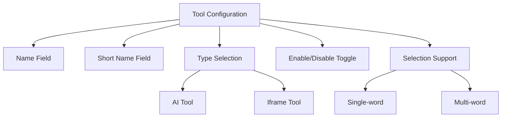
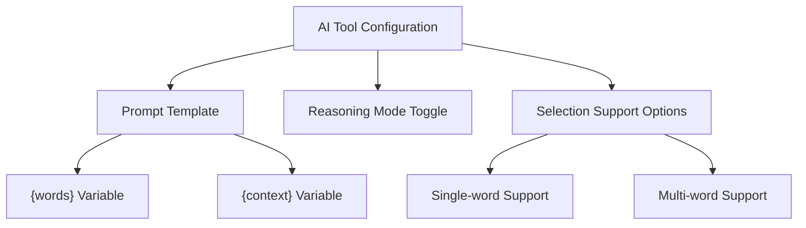
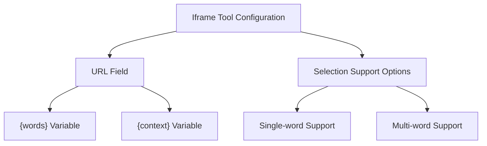
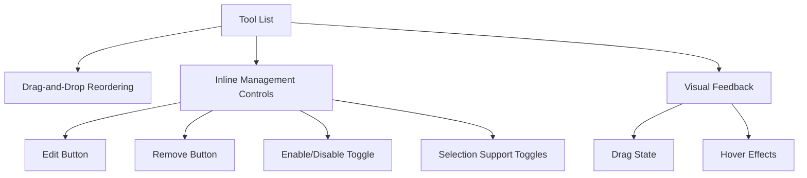
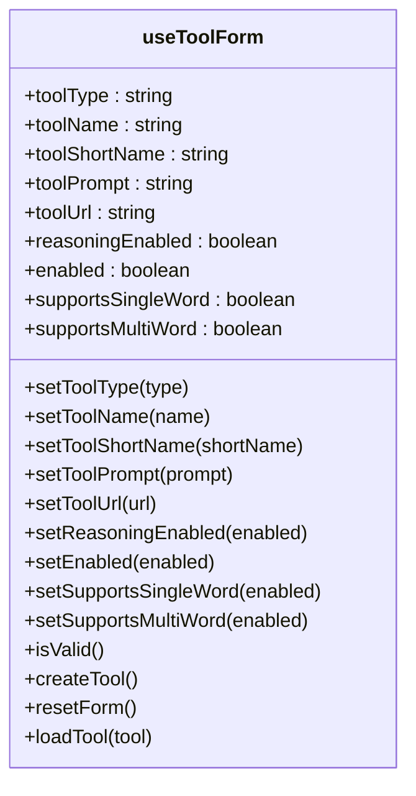

# Custom Tool Management

<cite>
**Referenced Files in This Document**   
- [useToolForm.ts](file://src/pages/ContextMenuSettingsPage/hooks/useToolForm.ts)
- [ToolEditPage/index.tsx](file://src/pages/ToolEditPage/index.tsx)
- [ToolExtractPage/index.tsx](file://src/pages/ToolExtractPage/index.tsx)
- [AIToolForm.tsx](file://src/pages/ContextMenuSettingsPage/components/AIToolForm.tsx)
- [IframeToolForm.tsx](file://src/pages/ContextMenuSettingsPage/components/IframeToolForm.tsx)
- [ToolList.tsx](file://src/pages/ContextMenuSettingsPage/components/ToolList.tsx)
- [epub.ts](file://src/types/epub.ts)
</cite>

## Table of Contents
1. [Introduction](#introduction)
2. [Tool Configuration Interface](#tool-configuration-interface)
3. [AI Tool Form](#ai-tool-form)
4. [Iframe Tool Form](#iframe-tool-form)
5. [Tool Management Components](#tool-management-components)
6. [State Management with useToolForm](#state-management-with-usetoolform)
7. [Validation and Error Handling](#validation-and-error-handling)
8. [Persistence Mechanism](#persistence-mechanism)
9. [Usage Examples](#usage-examples)
10. [Conclusion](#conclusion)

## Introduction
The custom tool management system enables users to create and configure AI-powered context menu tools for enhanced reading experiences. This documentation covers the complete workflow for managing tools, from creation and editing to organization and persistence. The system provides two primary interfaces: ToolExtractPage for adding new tools and ToolEditPage for modifying existing ones, both leveraging the shared useToolForm hook for consistent state management.

**Section sources**
- [ToolEditPage/index.tsx](file://src/pages/ToolEditPage/index.tsx#L1-L208)
- [ToolExtractPage/index.tsx](file://src/pages/ToolExtractPage/index.tsx#L1-L208)

## Tool Configuration Interface
The tool configuration interface provides a comprehensive set of fields for defining custom tools. Users can specify the tool name, short name, type (AI or iframe), and enable/disable status through a unified form. The interface supports both AI-powered tools that leverage language models and iframe tools that embed external web content.

The configuration includes selection support options that determine whether a tool can handle single-word or multi-word selections. This flexibility allows users to create specialized tools optimized for different types of text interactions. The short name field is optional and automatically generates from the tool name if left empty, with a maximum length of 15 characters.

**Diagram sources**
- [ToolEditPage/index.tsx](file://src/pages/ToolEditPage/index.tsx#L98-L124)
- [useToolForm.ts](file://src/pages/ContextMenuSettingsPage/hooks/useToolForm.ts#L10-L18)

**Section sources**
- [ToolEditPage/index.tsx](file://src/pages/ToolEditPage/index.tsx#L97-L141)
- [useToolForm.ts](file://src/pages/ContextMenuSettingsPage/hooks/useToolForm.ts#L11-L18)

## AI Tool Form
The AIToolForm component provides a specialized interface for configuring AI-powered tools. It centers around a prompt template system that utilizes {words} and {context} variables to create dynamic AI interactions. The {words} variable represents the selected text, while {context} provides surrounding content for additional background.

The form includes a reasoning mode toggle that enables advanced reasoning capabilities for supported language models. This feature enhances the AI's ability to provide more thoughtful and comprehensive responses. The prompt field supports multi-line input with placeholder guidance that explains the variable substitution system.

**Diagram sources**
- [AIToolForm.tsx](file://src/pages/ContextMenuSettingsPage/components/AIToolForm.tsx#L39-L110)
- [epub.ts](file://src/types/epub.ts#L44-L52)

**Section sources**
- [AIToolForm.tsx](file://src/pages/ContextMenuSettingsPage/components/AIToolForm.tsx#L1-L111)
- [epub.ts](file://src/types/epub.ts#L44-L52)

## Iframe Tool Form
The IframeToolForm component enables the creation of tools that embed external web content within the application. It provides a URL field that supports the same {words} and {context} variables as the AI tool form, allowing dynamic URL construction based on user selections.

Users can configure iframe tools to display dictionary lookups, translation services, or any web-based resource that accepts query parameters. The form includes the same selection support options as the AI tool form, ensuring consistent behavior across different tool types. The URL field validates input to ensure proper formatting and protocol specification.

**Diagram sources**
- [IframeToolForm.tsx](file://src/pages/ContextMenuSettingsPage/components/IframeToolForm.tsx#L33-L90)
- [epub.ts](file://src/types/epub.ts#L61-L67)

**Section sources**
- [IframeToolForm.tsx](file://src/pages/ContextMenuSettingsPage/components/IframeToolForm.tsx#L1-L91)
- [epub.ts](file://src/types/epub.ts#L61-L67)

## Tool Management Components
The ToolList component provides a comprehensive interface for managing multiple tools with drag-and-drop reordering capabilities. Built with the DndKit library, it enables intuitive tool organization through both pointer and keyboard interactions. Each tool in the list displays its name, type, and current status, with inline controls for editing, removal, and reordering.

The component supports all standard tool management operations: enabling/disabling tools, toggling selection support, editing configurations, and removing tools from the collection. The drag handle provides visual feedback during reordering operations, with smooth transitions and hover effects that enhance usability.

**Diagram sources**
- [ToolList.tsx](file://src/pages/ContextMenuSettingsPage/components/ToolList.tsx#L179-L239)
- [ToolList.tsx](file://src/pages/ContextMenuSettingsPage/components/ToolList.tsx#L49-L173)

**Section sources**
- [ToolList.tsx](file://src/pages/ContextMenuSettingsPage/components/ToolList.tsx#L1-L240)

## State Management with useToolForm
The useToolForm hook serves as the central state management solution for tool configuration across both the ToolExtractPage and ToolEditPage components. It encapsulates all form state, validation logic, and tool creation functionality in a reusable custom hook.

The hook manages state for tool type, name, short name, prompt (for AI tools), URL (for iframe tools), reasoning mode, enable status, and selection support options. It provides computed properties for form validation and actions for creating, resetting, and loading tool configurations. The normalizeSupports function ensures that at least one selection support option remains enabled.

**Diagram sources**
- [useToolForm.ts](file://src/pages/ContextMenuSettingsPage/hooks/useToolForm.ts#L8-L158)

**Section sources**
- [useToolForm.ts](file://src/pages/ContextMenuSettingsPage/hooks/useToolForm.ts#L1-L159)

## Validation and Error Handling
The tool management system implements comprehensive validation rules to ensure data integrity and prevent configuration errors. The isValid function checks that required fields are populated and that at least one selection support option is enabled. For AI tools, the prompt field must contain content, while iframe tools require a valid URL.

Error handling occurs at multiple levels: form-level validation prevents submission of invalid configurations, while API-level error handling manages connection issues and authentication failures. The system provides clear error messages that guide users toward resolution, with contextual help text explaining requirements and constraints.

The validation system prevents the creation of tools that cannot function properly, such as those without selection support or with empty required fields. When editing existing tools, the system preserves the original configuration if validation fails, preventing data loss.

**Section sources**
- [useToolForm.ts](file://src/pages/ContextMenuSettingsPage/hooks/useToolForm.ts#L31-L40)
- [ToolEditPage/index.tsx](file://src/pages/ToolEditPage/index.tsx#L187-L192)

## Persistence Mechanism
Tool configurations are persisted through the contextMenuSettings service, which manages the complete lifecycle of tool creation, modification, and deletion. When creating a new tool via ToolExtractPage, the addTool method saves the configuration and navigates back to the context menu settings. When editing an existing tool via ToolEditPage, the saveTool method updates the specific tool at the given index.

The persistence mechanism handles asynchronous operations with appropriate loading states and error reporting. The system provides visual feedback during save operations, with a "Saving..." indicator that prevents duplicate submissions. In case of errors, the system displays descriptive error messages that help users understand and resolve issues.

The tool collection is maintained as an array within the context menu settings, with the order preserved according to user preferences. Drag-and-drop reordering operations update the array indices accordingly, ensuring that the visual order matches the functional order in the application.

**Section sources**
- [ToolExtractPage/index.tsx](file://src/pages/ToolExtractPage/index.tsx#L35-L38)
- [ToolEditPage/index.tsx](file://src/pages/ToolEditPage/index.tsx#L37-L39)
- [ToolList.tsx](file://src/pages/ContextMenuSettingsPage/components/ToolList.tsx#L193-L201)

## Usage Examples
### Creating Custom AI Prompts
Users can create AI tools for various use cases by crafting appropriate prompt templates. For example, a "Simple Explanation" tool might use the prompt "Explain {words} in simple terms using everyday language." A "Summarize" tool could use "Summarize {words} in 2-3 sentences, focusing on the main points." More advanced prompts can leverage the {context} variable, such as "Explain {words} using the surrounding text for context: {context}."

### Implementing Iframe Tools
Iframe tools can be configured for dictionary lookups by setting the URL to "https://dictionary.com/browse/{words}" or for translation services with "https://translate.google.com/?sl=auto&tl=en&text={words}". Users can also create specialized tools for Wikipedia lookups, thesaurus searches, or any web service that accepts query parameters.

### Organizing Tool Workflows
Users can organize their tools by creating specialized sets for different reading scenarios. For academic reading, they might include tools for summarization, explanation, and citation generation. For language learning, they could create tools for translation, definition lookup, and pronunciation guidance. The drag-and-drop interface allows users to arrange tools in order of frequency or logical workflow.

**Section sources**
- [AIToolForm.tsx](file://src/pages/ContextMenuSettingsPage/components/AIToolForm.tsx#L45-L61)
- [IframeToolForm.tsx](file://src/pages/ContextMenuSettingsPage/components/IframeToolForm.tsx#L41-L55)

## Conclusion
The custom tool management system provides a flexible and user-friendly interface for creating and configuring AI-powered context menu tools. By combining the ToolExtractPage and ToolEditPage components with the shared useToolForm hook, the system ensures consistent behavior and state management across tool creation and modification workflows.

The comprehensive configuration options, including AI prompt templates with {words} and {context} variables, reasoning mode toggles, and selection support settings, empower users to create highly specialized tools for their reading needs. The drag-and-drop ToolList component enables intuitive organization and management of multiple tools, while robust validation and error handling ensure data integrity and a smooth user experience.

This system demonstrates a well-architected approach to user customization, balancing flexibility with usability and providing a foundation for extending functionality through additional tool types and integration points.