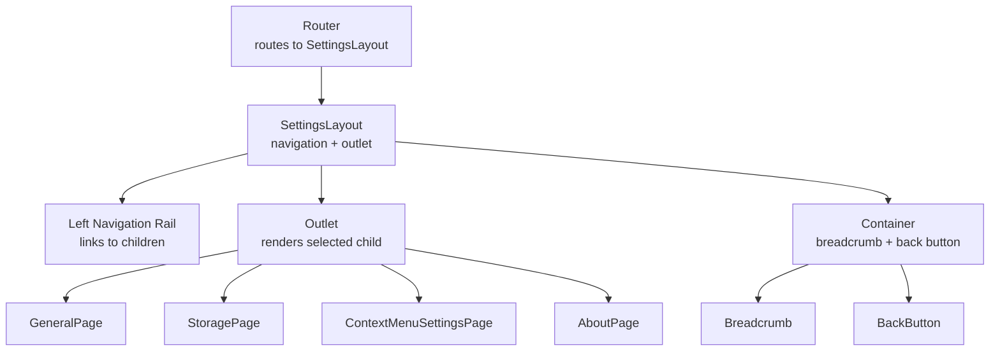
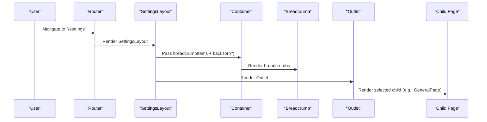
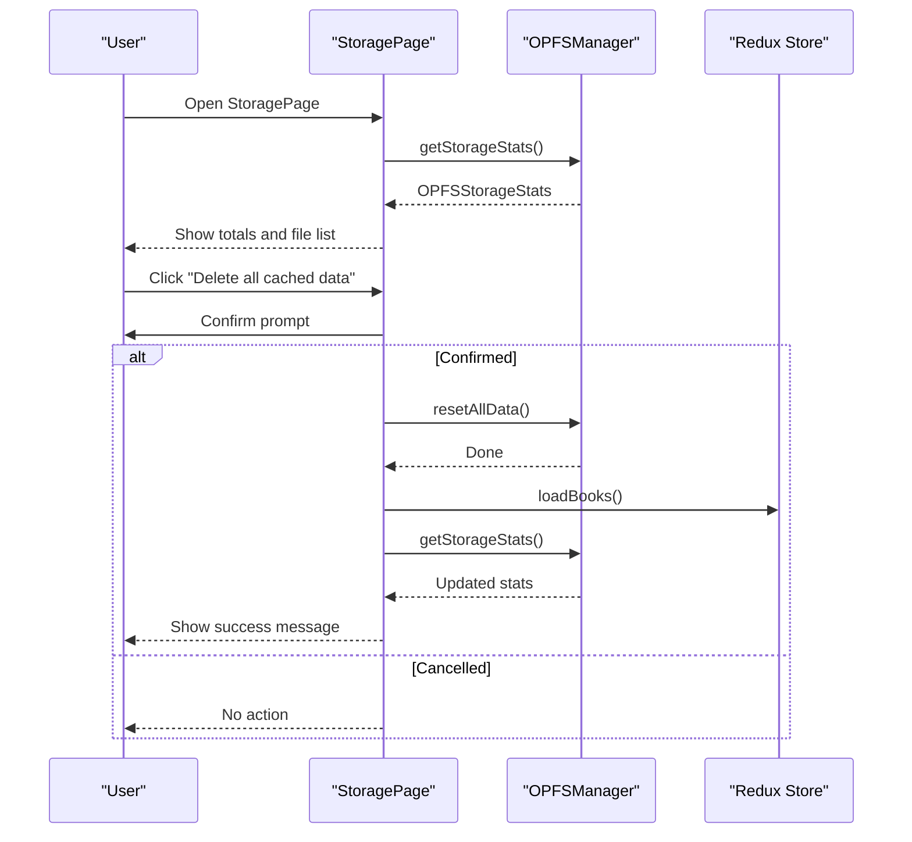
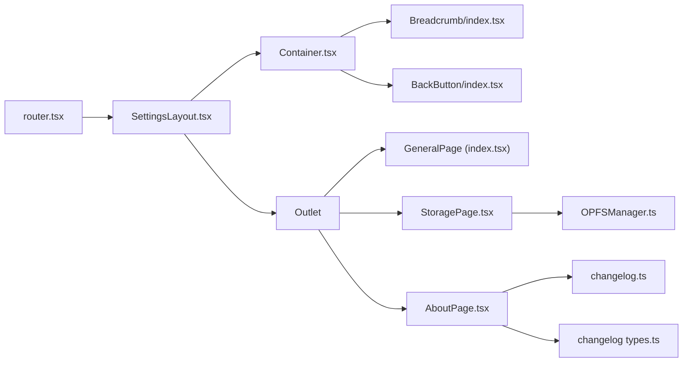

# General Settings

<cite>
**Referenced Files in This Document**
- [router.tsx](file://src/config/router.tsx)
- [SettingsLayout.tsx](file://src/pages/SettingsPage/SettingsLayout.tsx)
- [index.tsx](file://src/pages/SettingsPage/index.tsx)
- [StoragePage.tsx](file://src/pages/SettingsPage/StoragePage.tsx)
- [AboutPage.tsx](file://src/pages/SettingsPage/AboutPage.tsx)
- [Container.tsx](file://src/components/Container.tsx)
- [Breadcrumb/index.tsx](file://src/components/Breadcrumb/index.tsx)
- [BackButton/index.tsx](file://src/components/BackButton/index.tsx)
- [OPFSManager.ts](file://src/services/OPFSManager.ts)
- [changelog.ts](file://src/config/changelog.ts)
- [changelog types.ts](file://src/types/changelog.ts)
</cite>

## Table of Contents
1. [Introduction](#introduction)
2. [Project Structure](#project-structure)
3. [Core Components](#core-components)
4. [Architecture Overview](#architecture-overview)
5. [Detailed Component Analysis](#detailed-component-analysis)
6. [Dependency Analysis](#dependency-analysis)
7. [Performance Considerations](#performance-considerations)
8. [Troubleshooting Guide](#troubleshooting-guide)
9. [Conclusion](#conclusion)
10. [Appendices](#appendices)

## Introduction
This document describes the SettingsPage system that serves as the central hub for application preferences. It covers the SettingsLayout component that provides consistent navigation and structure across all settings views, the GeneralPage default settings view (with placeholders for future theme and language options), the StoragePage for managing OPFS storage and cache, and the AboutPage for version and changelog information. It also explains how SettingsLayout organizes navigation using breadcrumb navigation and consistent UI patterns, and provides practical guidance for adding new settings panels while maintaining visual consistency.

## Project Structure
The settings system is organized around a shared layout and route-driven children. The router mounts a SettingsLayout that renders a left navigation rail and a content area. The content area is filled by an Outlet that renders the selected settings panel.

**Diagram sources**
- [router.tsx](file://src/config/router.tsx#L12-L55)
- [SettingsLayout.tsx](file://src/pages/SettingsPage/SettingsLayout.tsx#L34-L86)
- [Container.tsx](file://src/components/Container.tsx#L1-L30)
- [Breadcrumb/index.tsx](file://src/components/Breadcrumb/index.tsx#L1-L35)
- [BackButton/index.tsx](file://src/components/BackButton/index.tsx#L1-L39)

**Section sources**
- [router.tsx](file://src/config/router.tsx#L12-L55)
- [SettingsLayout.tsx](file://src/pages/SettingsPage/SettingsLayout.tsx#L34-L86)
- [Container.tsx](file://src/components/Container.tsx#L1-L30)

## Core Components
- SettingsLayout: Provides a responsive two-column layout with a vertical navigation rail on the left and a scrollable content panel on the right. It computes breadcrumbs based on the current route and applies active link styles.
- GeneralPage: The default settings view. Currently displays a placeholder grid indicating upcoming features (theme customization and language selection).
- StoragePage: Manages OPFS storage, shows usage statistics, and provides a reset-all control with safety prompts and feedback states.
- AboutPage: Displays application metadata, latest version, release date, and a categorized changelog history.
- Container, Breadcrumb, BackButton: Shared UI scaffolding that renders a header with breadcrumb navigation and a back button.

**Section sources**
- [SettingsLayout.tsx](file://src/pages/SettingsPage/SettingsLayout.tsx#L34-L86)
- [index.tsx](file://src/pages/SettingsPage/index.tsx#L1-L51)
- [StoragePage.tsx](file://src/pages/SettingsPage/StoragePage.tsx#L1-L190)
- [AboutPage.tsx](file://src/pages/SettingsPage/AboutPage.tsx#L1-L105)
- [Container.tsx](file://src/components/Container.tsx#L1-L30)
- [Breadcrumb/index.tsx](file://src/components/Breadcrumb/index.tsx#L1-L35)
- [BackButton/index.tsx](file://src/components/BackButton/index.tsx#L1-L39)

## Architecture Overview
The settings architecture is route-driven and layout-centric. The router defines the settings route group and its children. SettingsLayout composes Container, which embeds Breadcrumb and BackButton. The layout’s navigation rail links to children routes, and Outlet renders the active child.

**Diagram sources**
- [router.tsx](file://src/config/router.tsx#L22-L46)
- [SettingsLayout.tsx](file://src/pages/SettingsPage/SettingsLayout.tsx#L50-L84)
- [Container.tsx](file://src/components/Container.tsx#L9-L29)
- [Breadcrumb/index.tsx](file://src/components/Breadcrumb/index.tsx#L17-L31)

## Detailed Component Analysis

### SettingsLayout
Responsibilities:
- Defines the navigation items and their labels, paths, and descriptions.
- Computes breadcrumbs based on the current location.
- Renders a responsive two-column layout: a vertical navigation rail and a content panel.
- Uses react-router’s Outlet to render the active child page.

Key behaviors:
- Active link highlighting via a class condition based on isActive.
- Responsive layout: the navigation becomes a vertical column on small screens and a fixed-width rail on larger screens.
- Breadcrumb construction includes Home and Settings, plus the current section.

Accessibility and UX:
- The navigation rail has an aria-label.
- Active state uses color contrast to indicate the current section.

Integration points:
- Consumes Container to provide breadcrumb and back navigation.
- Uses react-router NavLink for navigation and Outlet for rendering children.

**Section sources**
- [SettingsLayout.tsx](file://src/pages/SettingsPage/SettingsLayout.tsx#L11-L33)
- [SettingsLayout.tsx](file://src/pages/SettingsPage/SettingsLayout.tsx#L34-L86)
- [Container.tsx](file://src/components/Container.tsx#L9-L29)
- [Breadcrumb/index.tsx](file://src/components/Breadcrumb/index.tsx#L17-L31)

### GeneralPage
Current state:
- Serves as the default settings view.
- Contains a placeholder grid indicating upcoming features: Theme Customization and Language Selection.

Planned configuration options:
- Theme customization: likely to be introduced as a future enhancement.
- Language selection: also indicated as a future enhancement.

Visual consistency:
- Uses the same spacing and typography patterns as other settings panels.

**Section sources**
- [index.tsx](file://src/pages/SettingsPage/index.tsx#L1-L51)

### StoragePage
Functionality:
- Checks OPFS support and displays a warning if unsupported.
- Loads storage statistics asynchronously and shows totals for Books and Config.
- Lists cached files sorted by size and shows loading states.
- Provides a reset-all control that clears all cached data and reloads the app state.

Data and services:
- Uses OPFSManager to check support, load stats, and reset data.
- Uses formatFileSize utility for human-readable sizes.
- Dispatches loadBooks to refresh the bookshelf after reset.

Error handling:
- Displays errors when OPFS is unsupported or when loading/resetting fails.
- Uses a ResetState machine to reflect idle, working, success, and error states.

Safety and UX:
- Prompts the user before resetting all data.
- Provides success/error feedback after reset.

**Diagram sources**
- [StoragePage.tsx](file://src/pages/SettingsPage/StoragePage.tsx#L1-L190)
- [OPFSManager.ts](file://src/services/OPFSManager.ts#L368-L402)
- [OPFSManager.ts](file://src/services/OPFSManager.ts#L478-L509)

**Section sources**
- [StoragePage.tsx](file://src/pages/SettingsPage/StoragePage.tsx#L1-L190)
- [OPFSManager.ts](file://src/services/OPFSManager.ts#L368-L402)
- [OPFSManager.ts](file://src/services/OPFSManager.ts#L478-L509)

### AboutPage
Content:
- Application title, description, and latest version badge.
- Release date and summary.
- Changelog history grouped by categories and ordered consistently.

Data sources:
- Reads CHANGELOG_CONFIG and LATEST_CHANGELOG from changelog.ts.
- Uses categoryLabels and categoryOrder to render categorized entries.

**Section sources**
- [AboutPage.tsx](file://src/pages/SettingsPage/AboutPage.tsx#L1-L105)
- [changelog.ts](file://src/config/changelog.ts#L1-L100)
- [changelog types.ts](file://src/types/changelog.ts#L1-L14)

### Container, Breadcrumb, BackButton
- Container wraps the main content, renders a sticky header with a BackButton and a Breadcrumb, and passes breadcrumbItems and backTo props.
- Breadcrumb renders a navigable trail with separators and the current page label.
- BackButton navigates either to a specific path or uses browser history.

**Section sources**
- [Container.tsx](file://src/components/Container.tsx#L1-L30)
- [Breadcrumb/index.tsx](file://src/components/Breadcrumb/index.tsx#L1-L35)
- [BackButton/index.tsx](file://src/components/BackButton/index.tsx#L1-L39)

## Dependency Analysis
The settings system exhibits clean separation of concerns:
- Router defines the route tree and mounts SettingsLayout.
- SettingsLayout depends on Container, Breadcrumb, and BackButton for UI scaffolding.
- Child pages (GeneralPage, StoragePage, AboutPage) are rendered by Outlet inside SettingsLayout.
- StoragePage depends on OPFSManager for storage operations.
- AboutPage depends on changelog configuration and types.

**Diagram sources**
- [router.tsx](file://src/config/router.tsx#L12-L55)
- [SettingsLayout.tsx](file://src/pages/SettingsPage/SettingsLayout.tsx#L50-L84)
- [Container.tsx](file://src/components/Container.tsx#L9-L29)
- [Breadcrumb/index.tsx](file://src/components/Breadcrumb/index.tsx#L17-L31)
- [BackButton/index.tsx](file://src/components/BackButton/index.tsx#L13-L36)
- [StoragePage.tsx](file://src/pages/SettingsPage/StoragePage.tsx#L1-L190)
- [OPFSManager.ts](file://src/services/OPFSManager.ts#L368-L402)
- [AboutPage.tsx](file://src/pages/SettingsPage/AboutPage.tsx#L1-L105)
- [changelog.ts](file://src/config/changelog.ts#L1-L100)
- [changelog types.ts](file://src/types/changelog.ts#L1-L14)

**Section sources**
- [router.tsx](file://src/config/router.tsx#L12-L55)
- [SettingsLayout.tsx](file://src/pages/SettingsPage/SettingsLayout.tsx#L34-L86)
- [StoragePage.tsx](file://src/pages/SettingsPage/StoragePage.tsx#L1-L190)
- [AboutPage.tsx](file://src/pages/SettingsPage/AboutPage.tsx#L1-L105)

## Performance Considerations
- StoragePage loads OPFS stats asynchronously; ensure UI remains responsive by keeping loading states minimal and avoiding heavy computations in render.
- OPFSManager.getStorageStats traverses directories; for large caches, consider pagination or lazy loading of file entries.
- Avoid unnecessary re-renders by memoizing derived values (e.g., computed sizes) and using stable callbacks where appropriate.
- Debounce or throttle user-triggered actions (e.g., repeated resets) to prevent redundant operations.

[No sources needed since this section provides general guidance]

## Troubleshooting Guide
Common issues and resolutions:
- OPFS not supported: StoragePage shows a warning and disables reset controls. Advise users to switch to a Chromium-based browser.
- Reset confirmation: If the user cancels, no action is taken; if confirmed, the system clears all cached data and reinitializes defaults.
- Error states: StoragePage surfaces errors for unsupported browsers or failed operations; ensure error messages are actionable and displayed prominently.
- Changelog rendering: If the changelog appears empty, verify that CHANGELOG_CONFIG and LATEST_CHANGELOG are populated and typed correctly.

**Section sources**
- [StoragePage.tsx](file://src/pages/SettingsPage/StoragePage.tsx#L98-L103)
- [StoragePage.tsx](file://src/pages/SettingsPage/StoragePage.tsx#L105-L109)
- [StoragePage.tsx](file://src/pages/SettingsPage/StoragePage.tsx#L170-L184)
- [OPFSManager.ts](file://src/services/OPFSManager.ts#L368-L402)
- [changelog.ts](file://src/config/changelog.ts#L1-L100)

## Conclusion
The SettingsPage system provides a consistent, accessible, and extensible foundation for application preferences. SettingsLayout establishes a reliable navigation and breadcrumb structure, while child pages encapsulate specific configuration domains. The StoragePage integrates tightly with OPFS for robust cache management, and the AboutPage consolidates version and changelog information. Adding new settings panels follows a straightforward pattern: define a child route, implement the panel, and register it in SettingsLayout’s navigation.

[No sources needed since this section summarizes without analyzing specific files]

## Appendices

### How to Add a New Settings Panel
Steps:
1. Create a new page component under src/pages/SettingsPage/.
2. Register the route in the router under the /settings group with a unique path and element.
3. Add a navigation item in SettingsLayout’s navItems with label, path, and description.
4. Optionally, add breadcrumb items in SettingsLayout.getBreadcrumbs if the new route requires special breadcrumb handling.
5. Ensure the new panel follows the same spacing and typography patterns used across settings pages.

Example references:
- Router registration pattern: [router.tsx](file://src/config/router.tsx#L22-L46)
- Navigation items: [SettingsLayout.tsx](file://src/pages/SettingsPage/SettingsLayout.tsx#L11-L33)
- Outlet rendering: [SettingsLayout.tsx](file://src/pages/SettingsPage/SettingsLayout.tsx#L78-L84)

**Section sources**
- [router.tsx](file://src/config/router.tsx#L22-L46)
- [SettingsLayout.tsx](file://src/pages/SettingsPage/SettingsLayout.tsx#L11-L33)
- [SettingsLayout.tsx](file://src/pages/SettingsPage/SettingsLayout.tsx#L78-L84)

### Responsive Design Considerations
- Navigation rail: On small screens, the navigation becomes a horizontal stack; on larger screens, it becomes a fixed-width vertical rail with a min-height spanning the viewport minus margins.
- Content panel: Scrollable and responsive grid layouts adapt to different widths.
- Breadcrumb and back button: Fixed header ensures consistent navigation affordances across devices.

**Section sources**
- [SettingsLayout.tsx](file://src/pages/SettingsPage/SettingsLayout.tsx#L50-L84)
- [Container.tsx](file://src/components/Container.tsx#L9-L29)

### Accessibility Requirements
- Navigation rail has an aria-label for assistive technologies.
- Active navigation items use color contrast to indicate state.
- Breadcrumb links are keyboard focusable and styled appropriately.
- Buttons and interactive elements provide clear feedback (e.g., hover, disabled states).

**Section sources**
- [SettingsLayout.tsx](file://src/pages/SettingsPage/SettingsLayout.tsx#L55-L76)
- [Breadcrumb/index.tsx](file://src/components/Breadcrumb/index.tsx#L17-L31)
- [BackButton/index.tsx](file://src/components/BackButton/index.tsx#L23-L36)