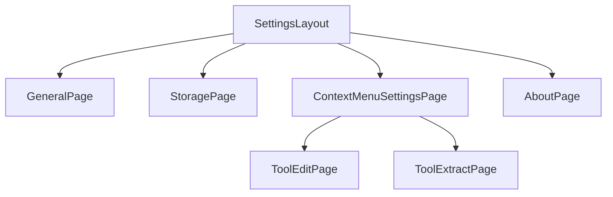
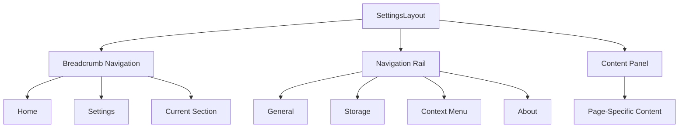
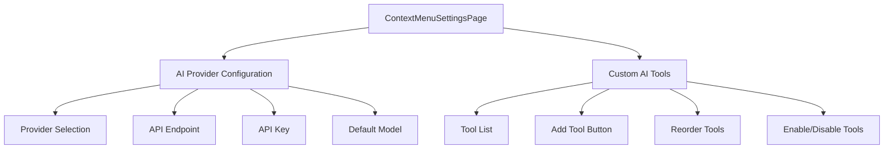
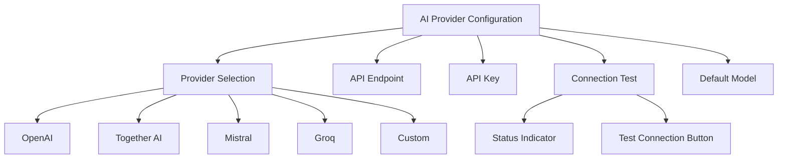
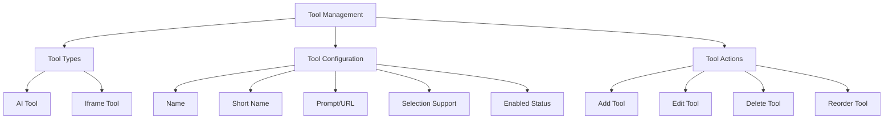
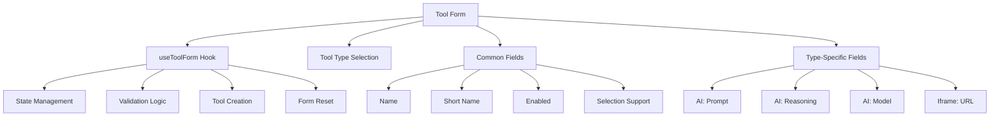
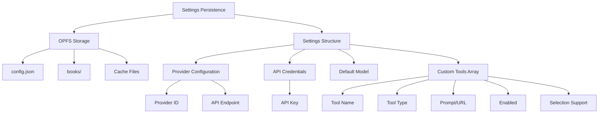
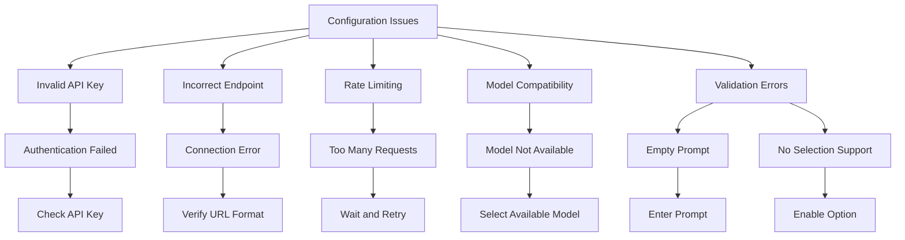

# Settings Pages

<cite>
**Referenced Files in This Document**   
- [GeneralPage.tsx](file://src/pages/SettingsPage/index.tsx)
- [SettingsLayout.tsx](file://src/pages/SettingsPage/SettingsLayout.tsx)
- [AboutPage.tsx](file://src/pages/SettingsPage/AboutPage.tsx)
- [StoragePage.tsx](file://src/pages/SettingsPage/StoragePage.tsx)
- [ContextMenuSettingsPage.tsx](file://src/pages/ContextMenuSettingsPage/index.tsx)
- [aiProviders.ts](file://src/config/aiProviders.ts)
- [useToolForm.ts](file://src/pages/ContextMenuSettingsPage/hooks/useToolForm.ts)
- [ToolEditPage.tsx](file://src/pages/ToolEditPage/index.tsx)
- [ToolExtractPage.tsx](file://src/pages/ToolExtractPage/index.tsx)
- [epub.ts](file://src/types/epub.ts)
- [router.tsx](file://src/config/router.tsx)
- [ApiConfig.tsx](file://src/pages/ContextMenuSettingsPage/components/ApiConfig.tsx)
- [ModelSearchInput.tsx](file://src/pages/ContextMenuSettingsPage/components/ModelSearchInput.tsx)
- [ToolList.tsx](file://src/pages/ContextMenuSettingsPage/components/ToolList.tsx)
</cite>

## Table of Contents
1. [Introduction](#introduction)
2. [Settings Page Architecture](#settings-page-architecture)
3. [Settings Layout and Navigation](#settings-layout-and-navigation)
4. [Context Menu Settings](#context-menu-settings)
5. [AI Provider Configuration](#ai-provider-configuration)
6. [Custom Tool Management](#custom-tool-management)
7. [Tool Form Implementation](#tool-form-implementation)
8. [Settings Persistence](#settings-persistence)
9. [Configuration Issues and Troubleshooting](#configuration-issues-and-troubleshooting)
10. [Conclusion](#conclusion)

## Introduction

The Settings Pages in the Immersive Reader application provide a comprehensive interface for users to customize application behavior and configure AI-powered context tools. The settings system is organized around a central SettingsLayout that serves as the navigation hub, with dedicated pages for general settings, storage management, application information, and AI tool configuration. The ContextMenuSettingsPage acts as the central interface for managing AI providers and custom tools, allowing users to configure OpenAI, Anthropic, and other compatible AI services, select models, manage API keys, and create custom AI tools with specific prompts and behaviors. This documentation details the architecture, implementation, and usage of these settings pages, focusing on the configuration of AI-powered context tools and the management of custom AI tools.

## Settings Page Architecture

The settings pages are organized as a nested routing structure with SettingsLayout serving as the parent component that provides consistent navigation and layout for all settings pages. The architecture follows a modular design pattern with separate components for each settings section, allowing for independent development and maintenance of different configuration areas.

**Diagram sources**
- [SettingsLayout.tsx](file://src/pages/SettingsPage/SettingsLayout.tsx)
- [router.tsx](file://src/config/router.tsx)

**Section sources**
- [SettingsLayout.tsx](file://src/pages/SettingsPage/SettingsLayout.tsx)
- [GeneralPage.tsx](file://src/pages/SettingsPage/index.tsx)

## Settings Layout and Navigation

The SettingsLayout component provides a consistent navigation interface for all settings pages, featuring a sidebar with navigation links to different settings sections. The layout includes breadcrumb navigation that dynamically updates based on the current page, helping users understand their location within the settings hierarchy. The navigation rail contains links to General, Storage, Context Menu, and About sections, with visual indicators showing the active page.

**Diagram sources**
- [SettingsLayout.tsx](file://src/pages/SettingsPage/SettingsLayout.tsx)

**Section sources**
- [SettingsLayout.tsx](file://src/pages/SettingsPage/SettingsLayout.tsx)

## Context Menu Settings

The ContextMenuSettingsPage serves as the central interface for configuring AI-powered context tools that appear in the reader's context menu. This page allows users to connect to various AI providers, configure API authentication, set a default model for AI tools, and manage custom tools that can be triggered from selected text in the reader. The interface is divided into two main sections: AI Provider configuration and Custom AI Tools management.

**Diagram sources**
- [ContextMenuSettingsPage.tsx](file://src/pages/ContextMenuSettingsPage/index.tsx)

**Section sources**
- [ContextMenuSettingsPage.tsx](file://src/pages/ContextMenuSettingsPage/index.tsx)

## AI Provider Configuration

The AI provider configuration system supports multiple AI services through a comprehensive catalog defined in aiProviders.ts. Users can select from various providers including OpenAI, Together AI, Mistral, Groq, and others, or configure a custom OpenAI-compatible service. The configuration includes provider selection, API endpoint specification, API key management, and connection testing functionality.

**Diagram sources**
- [aiProviders.ts](file://src/config/aiProviders.ts)
- [ApiConfig.tsx](file://src/pages/ContextMenuSettingsPage/components/ApiConfig.tsx)

**Section sources**
- [aiProviders.ts](file://src/config/aiProviders.ts)
- [ApiConfig.tsx](file://src/pages/ContextMenuSettingsPage/components/ApiConfig.tsx)

## Custom Tool Management

The custom tool management system allows users to create, edit, and organize AI-powered tools that appear in the reader's context menu. Tools can be of two types: AI tools that use language models to process selected text, and iframe tools that embed external web content. Users can configure tool names, prompts, selection support (single-word vs. multi-word), and enable/disable status. Tools can be reordered through drag-and-drop interaction.

**Diagram sources**
- [ToolList.tsx](file://src/pages/ContextMenuSettingsPage/components/ToolList.tsx)
- [epub.ts](file://src/types/epub.ts)

**Section sources**
- [ToolList.tsx](file://src/pages/ContextMenuSettingsPage/components/ToolList.tsx)
- [epub.ts](file://src/types/epub.ts)

## Tool Form Implementation

The tool form implementation uses the useToolForm hook to manage the state and validation logic for creating and editing custom tools. The form supports both AI and iframe tool types, with type-specific configuration options. For AI tools, users can specify a prompt with template variables {{words}} and {{context}}, enable reasoning mode for supported models, and configure selection support. For iframe tools, users specify a URL template that can include the same template variables.

**Diagram sources**
- [useToolForm.ts](file://src/pages/ContextMenuSettingsPage/hooks/useToolForm.ts)
- [AIToolForm.tsx](file://src/pages/ContextMenuSettingsPage/components/AIToolForm.tsx)
- [IframeToolForm.tsx](file://src/pages/ContextMenuSettingsPage/components/IframeToolForm.tsx)

**Section sources**
- [useToolForm.ts](file://src/pages/ContextMenuSettingsPage/hooks/useToolForm.ts)
- [AIToolForm.tsx](file://src/pages/ContextMenuSettingsPage/components/AIToolForm.tsx)
- [IframeToolForm.tsx](file://src/pages/ContextMenuSettingsPage/components/IframeToolForm.tsx)

## Settings Persistence

Application settings are persisted in the browser's LocalStorage through the OPFS (Origin Private File System) API, which provides a private, sandboxed file system for storing application data. The StoragePage provides an interface for viewing cached files and resetting all local data. AI provider configurations are stored with the provider ID, API endpoint, API key, and default model. Custom tool configurations are stored as an array of tool objects with their respective settings.

**Diagram sources**
- [StoragePage.tsx](file://src/pages/SettingsPage/StoragePage.tsx)
- [epub.ts](file://src/types/epub.ts)

**Section sources**
- [StoragePage.tsx](file://src/pages/SettingsPage/StoragePage.tsx)
- [epub.ts](file://src/types/epub.ts)

## Configuration Issues and Troubleshooting

Common configuration issues include invalid API keys, incorrect API endpoints, rate limiting, and model compatibility problems. The application provides validation feedback for API configuration, including URL format validation and connection testing. When connection tests fail, users are provided with error messages and links to provider documentation. For custom tools, validation ensures that at least one selection support option (single-word or multi-word) is enabled and that AI tools have a non-empty prompt.

**Section sources**
- [ApiConfig.tsx](file://src/pages/ContextMenuSettingsPage/components/ApiConfig.tsx)
- [useToolForm.ts](file://src/pages/ContextMenuSettingsPage/hooks/useToolForm.ts)

## Conclusion

The Settings Pages in the Immersive Reader application provide a comprehensive and user-friendly interface for configuring application behavior and AI-powered context tools. The modular architecture with SettingsLayout as the central navigation hub allows for organized access to different configuration areas. The ContextMenuSettingsPage enables users to connect to various AI providers, manage API credentials securely, and create custom AI tools with specific prompts and behaviors. The tool management system supports both AI and iframe tool types, with intuitive forms for configuration and drag-and-drop reordering. Settings are persisted in the browser's LocalStorage using OPFS, ensuring data persistence across sessions while providing users with the ability to manage their cached data through the StoragePage. The implementation follows best practices for form validation, error handling, and user feedback, making it easier for users to configure their AI tools successfully.