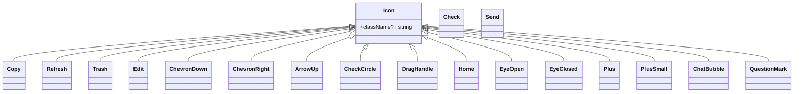

# Reusable UI Components

<cite>
**Referenced Files in This Document**   
- [BookCard/index.tsx](file://src/components/BookCard/index.tsx)
- [BookCard/hooks/useBookDisplayData.ts](file://src/components/BookCard/hooks/useBookDisplayData.ts)
- [BookCard/BookCover.tsx](file://src/components/BookCard/BookCover.tsx)
- [BookCard/ProgressBar.tsx](file://src/components/BookCard/ProgressBar.tsx)
- [BookCard/BookActions.tsx](file://src/components/BookCard/BookActions.tsx)
- [UploadZone/index.tsx](file://src/components/UploadZone/index.tsx)
- [Breadcrumb/index.tsx](file://src/components/Breadcrumb/index.tsx)
- [BackButton/index.tsx](file://src/components/BackButton/index.tsx)
- [Container.tsx](file://src/components/Container.tsx)
- [SearchableSelect.tsx](file://src/components/SearchableSelect.tsx)
- [icons.tsx](file://src/components/icons.tsx)
- [aiProviders.ts](file://src/config/aiProviders.ts)
- [HomePage/index.tsx](file://src/pages/HomePage/index.tsx)
- [SettingsPage/SettingsLayout.tsx](file://src/pages/SettingsPage/SettingsLayout.tsx)
- [SettingsPage/StoragePage.tsx](file://src/pages/SettingsPage/StoragePage.tsx)
- [ToolEditPage/index.tsx](file://src/pages/ToolEditPage/index.tsx)
- [ToolExtractPage/index.tsx](file://src/pages/ToolExtractPage/index.tsx)
</cite>

## Table of Contents
1. [Introduction](#introduction)
2. [BookCard Component](#bookcard-component)
3. [UploadZone Component](#uploadzone-component)
4. [Navigation Components](#navigation-components)
5. [Layout Components](#layout-components)
6. [SearchableSelect Component](#searchableselect-component)
7. [Icon Components](#icon-components)
8. [Composition Patterns](#composition-patterns)
9. [Performance Considerations](#performance-considerations)
10. [Common Implementation Issues](#common-implementation-issues)

## Introduction
This documentation provides comprehensive details about the reusable UI components in the EPUB reader application. The components are designed to promote consistency, maintainability, and reusability across the application. Each component follows React best practices with proper TypeScript typing, accessibility features, and clear separation of concerns. The components are organized in a modular structure within the src/components directory, allowing for easy import and usage throughout the application.

## BookCard Component

The BookCard component displays book metadata in a visually appealing card format, showing the book cover, title, author, progress, and action buttons. It serves as the primary interface for book representation in the bookshelf view.

### Props
- **book**: BookMetadata - The book metadata to display (required)
- **onOpen**: (bookId: string) => void - Callback when the book is clicked (required)
- **onDelete**: (bookId: string) => void - Callback when delete is clicked (required)

### Key Features
- **Accessibility**: Implements proper ARIA labels, keyboard navigation (Enter and Space keys), and screen reader support
- **Responsive Design**: Uses Tailwind CSS for responsive layout that adapts to different screen sizes
- **Error Handling**: Gracefully handles missing or invalid book data with appropriate fallbacks
- **Event Propagation**: Prevents event bubbling on delete button to avoid triggering card click

### Sub-components
The BookCard is composed of several specialized sub-components that handle specific aspects of the card's functionality:

**Diagram sources**
- [BookCard/index.tsx](file://src/components/BookCard/index.tsx)
- [BookCard/BookCover.tsx](file://src/components/BookCard/BookCover.tsx)
- [BookCard/ProgressBar.tsx](file://src/components/BookCard/ProgressBar.tsx)
- [BookCard/BookActions.tsx](file://src/components/BookCard/BookActions.tsx)

**Section sources**
- [BookCard/index.tsx](file://src/components/BookCard/index.tsx)
- [HomePage/index.tsx](file://src/pages/HomePage/index.tsx)

### Hook Integration
The BookCard uses the useBookDisplayData hook to format and provide fallback values for book display data. This hook ensures consistent presentation of book information across the application, providing default values for missing metadata.

**Diagram sources**
- [BookCard/index.tsx](file://src/components/BookCard/index.tsx)
- [BookCard/hooks/useBookDisplayData.ts](file://src/components/BookCard/hooks/useBookDisplayData.ts)

### Usage Example
The BookCard is used in the HomePage to display the bookshelf collection:

**Diagram sources**
- [HomePage/index.tsx](file://src/pages/HomePage/index.tsx)
- [BookCard/index.tsx](file://src/components/BookCard/index.tsx)

## UploadZone Component

The UploadZone component provides a user-friendly interface for uploading EPUB files through drag-and-drop or file selection. It integrates with the OPFS (Origin Private File System) storage for efficient file handling.

### Props
- **onUploadComplete?**: () => void - Callback when upload is complete (optional)

### Key Features
- **Drag-and-Drop Support**: Implements HTML5 drag and drop API with visual feedback
- **File Validation**: Validates file type and size using centralized validation utilities
- **Visual Feedback**: Shows loading spinner during upload and appropriate states for different interactions
- **Accessibility**: Proper ARIA attributes and keyboard navigation support
- **OPFS Integration**: Seamlessly integrates with the application's OPFS storage system

### Implementation Details
The UploadZone handles both drag-and-drop events and traditional file input, providing a consistent user experience across different interaction methods. It uses the epubValidation utilities to ensure only valid EPUB files are processed.

**Diagram sources**
- [UploadZone/index.tsx](file://src/components/UploadZone/index.tsx)
- [utils/epubValidation.ts](file://src/utils/epubValidation.ts)
- [store/slices/bookshelfSlice.ts](file://src/store/slices/bookshelfSlice.ts)

### Usage Example
The UploadZone is prominently featured in the HomePage, serving as the primary method for adding new books to the library:

**Diagram sources**
- [UploadZone/index.tsx](file://src/components/UploadZone/index.tsx)
- [HomePage/index.tsx](file://src/pages/HomePage/index.tsx)

**Section sources**
- [UploadZone/index.tsx](file://src/components/UploadZone/index.tsx)
- [HomePage/index.tsx](file://src/pages/HomePage/index.tsx)

## Navigation Components

The navigation components provide consistent navigation patterns throughout the application, including breadcrumb trails and back navigation.

### Breadcrumb Component

The Breadcrumb component displays the current location in the application hierarchy, helping users understand their position within the app.

#### Props
- **items**: BreadcrumbItem[] - Array of breadcrumb items with label and optional path

#### BreadcrumbItem Interface
- **label**: string - Display text for the breadcrumb
- **path?**: string - Optional navigation path (if omitted, item is displayed as text)

**Diagram sources**
- [Breadcrumb/index.tsx](file://src/components/Breadcrumb/index.tsx)

### BackButton Component

The BackButton component provides a consistent way to navigate back to the previous page or a specific route.

#### Props
- **to?**: string - Optional specific path to navigate to
- **label?**: string - Optional custom label (defaults to "Back")

When no 'to' prop is provided, the component uses the browser's history API to go back one step.

**Section sources**
- [Breadcrumb/index.tsx](file://src/components/Breadcrumb/index.tsx)
- [BackButton/index.tsx](file://src/components/BackButton/index.tsx)

## Layout Components

### Container Component

The Container component provides a consistent layout structure for pages, combining the BackButton and Breadcrumb components with a header and main content area.

#### Props
- **breadcrumbItems**: BreadcrumbItem[] - Items to display in the breadcrumb trail
- **backTo**: string - Path to navigate to when back button is clicked
- **children?**: React.ReactNode - Content to display in the main area

The Container ensures a uniform header experience across different pages while allowing flexible content in the main area.

**Diagram sources**
- [Container.tsx](file://src/components/Container.tsx)
- [BackButton/index.tsx](file://src/components/BackButton/index.tsx)
- [Breadcrumb/index.tsx](file://src/components/Breadcrumb/index.tsx)

**Section sources**
- [Container.tsx](file://src/components/Container.tsx)
- [SettingsPage/SettingsLayout.tsx](file://src/pages/SettingsPage/SettingsLayout.tsx)

## SearchableSelect Component

The SearchableSelect component provides a sophisticated dropdown selection interface with search functionality, used primarily for selecting AI providers in the settings.

### Props
- **label?**: string - Optional label for the select
- **value**: string - Current selected value
- **onChange**: (value: string) => void - Callback when selection changes
- **options**: SearchableSelectOption[] - Array of selectable options
- **placeholder?**: string - Placeholder text (defaults to "Select...")
- **disabled?**: boolean - Whether the select is disabled
- **className?**: string - Additional CSS classes
- **renderOption?**: (option: SearchableSelectOption) => React.ReactNode - Custom option renderer
- **isFilterable?**: boolean - Whether filtering is enabled (defaults to true)

### SearchableSelectOption Interface
- **value**: string - Internal value of the option
- **label**: string - Display label
- **note?**: string - Optional additional information

### Key Features
- **Dynamic Filtering**: Filters options based on search input across label, value, and note fields
- **Accessibility**: Full keyboard navigation support and ARIA attributes
- **Smart Positioning**: Automatically positions dropdown up or down based on available space
- **Custom Rendering**: Supports custom option rendering for complex displays

### Usage in Settings
The SearchableSelect is used in the settings pages to allow users to select AI providers from a comprehensive list:

**Diagram sources**
- [SearchableSelect.tsx](file://src/components/SearchableSelect.tsx)
- [aiProviders.ts](file://src/config/aiProviders.ts)

**Section sources**
- [SearchableSelect.tsx](file://src/components/SearchableSelect.tsx)
- [ToolEditPage/index.tsx](file://src/pages/ToolEditPage/index.tsx)
- [ToolExtractPage/index.tsx](file://src/pages/ToolExtractPage/index.tsx)

## Icon Components

The icons.tsx file exports a collection of reusable SVG icons used throughout the application, ensuring visual consistency and reducing duplication.

### Available Icons
- Menu
- Search
- Settings
- Fullscreen
- RightArrow
- LeftArrow
- Copy
- Refresh
- Trash
- Edit
- Check
- Send
- ChevronDown
- ChevronRight
- ArrowUp
- CheckCircle
- DragHandle
- Home
- EyeOpen
- EyeClosed
- Plus
- PlusSmall
- ChatBubble
- QuestionMark

### Icon Props
Icons that accept props (like Copy, Refresh, etc.) support a className property to allow for custom styling while maintaining consistent base styling.

**Diagram sources**
- [icons.tsx](file://src/components/icons.tsx)

**Section sources**
- [icons.tsx](file://src/components/icons.tsx)
- [BookCard/BookActions.tsx](file://src/components/BookCard/BookActions.tsx)

## Composition Patterns

The components are designed to be composed together to create complex UIs while maintaining separation of concerns and reusability.

### Container Pattern
The Container component combines BackButton and Breadcrumb to create a consistent header experience across settings pages:

This pattern is used in all settings pages to maintain a consistent navigation experience.

### BookCard Composition
The BookCard demonstrates component composition by combining specialized sub-components:

This composition allows for independent development and testing of each sub-component while creating a cohesive user interface.

**Section sources**
- [Container.tsx](file://src/components/Container.tsx)
- [BookCard/index.tsx](file://src/components/BookCard/index.tsx)

## Performance Considerations

### Lazy Loading for Book Covers
The BookCover component implements lazy loading for book covers, which improves initial page load performance:

- **Async Loading**: Covers are loaded asynchronously using the OPFSManager service
- **Loading State**: Shows a placeholder with book title during loading
- **Error Handling**: Displays a fallback gradient background if cover loading fails
- **Memory Efficiency**: Only loads covers for visible books in the viewport

### Optimized Rendering
Several components implement performance optimizations:

- **BookCard**: Early returns for invalid book data to prevent unnecessary rendering
- **ProgressBar**: Validates progress input and only renders when progress > 0
- **SearchableSelect**: Uses memoization for filtered options and efficient event handling

### Event Handler Optimization
Components use useCallback to memoize event handlers, preventing unnecessary re-renders:

- UploadZone uses useCallback for drag and drop handlers
- SearchableSelect uses useCallback for input and selection handlers
- BookCard uses useCallback for action handlers

**Section sources**
- [BookCard/BookCover.tsx](file://src/components/BookCard/BookCover.tsx)
- [UploadZone/index.tsx](file://src/components/UploadZone/index.tsx)
- [SearchableSelect.tsx](file://src/components/SearchableSelect.tsx)

## Common Implementation Issues

### Drag-and-Drop Event Handling
The UploadZone component properly handles drag-and-drop events by:

- Calling preventDefault() on dragOver and drop events to enable drop functionality
- Managing the isDragging state to provide visual feedback
- Properly extracting files from the DataTransfer object
- Handling edge cases like multiple files and invalid file types

### Responsive Design Considerations
Components are designed with responsive layouts using Tailwind CSS:

- BookCard uses a grid layout that adapts to screen size (2-5 columns)
- Container uses flexbox for consistent header layout
- SearchableSelect uses absolute positioning for the dropdown with proper viewport constraints

### Accessibility Implementation
All components follow accessibility best practices:

- Proper ARIA attributes (aria-label, aria-valuenow, etc.)
- Keyboard navigation support (tabIndex, onKeyDown handlers)
- Screen reader friendly labels and descriptions
- Sufficient color contrast for text and interactive elements

**Section sources**
- [UploadZone/index.tsx](file://src/components/UploadZone/index.tsx)
- [BookCard/index.tsx](file://src/components/BookCard/index.tsx)
- [SearchableSelect.tsx](file://src/components/SearchableSelect.tsx)