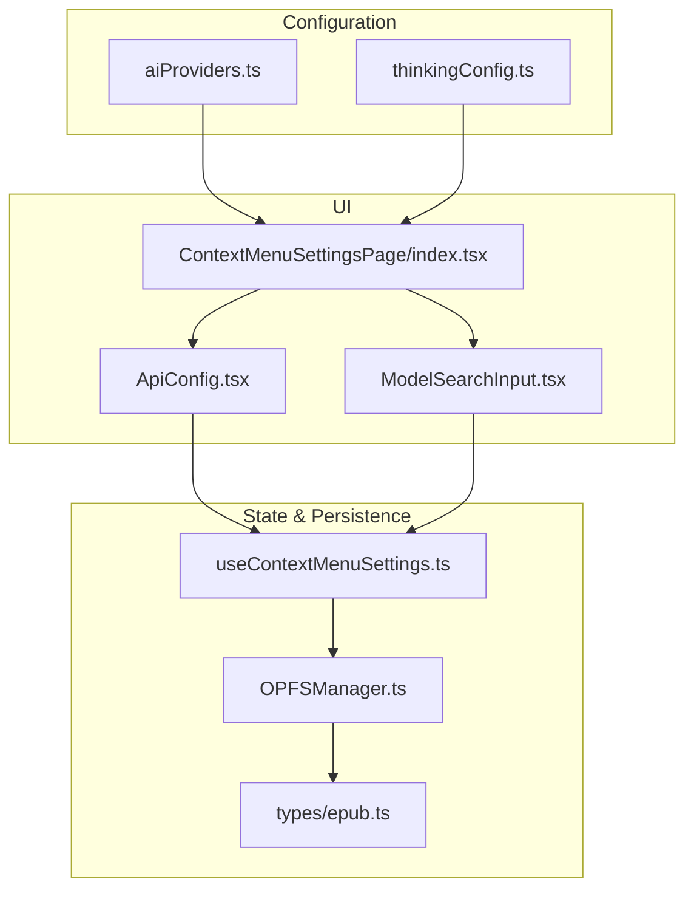
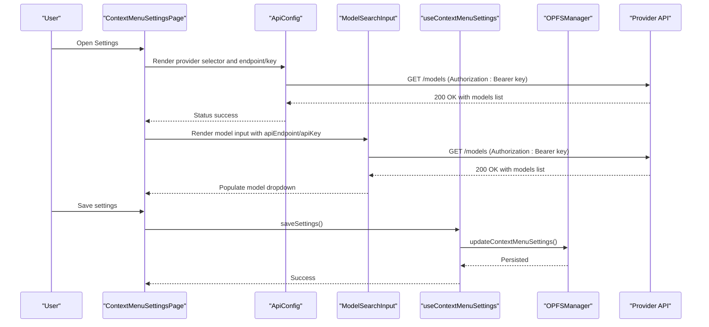
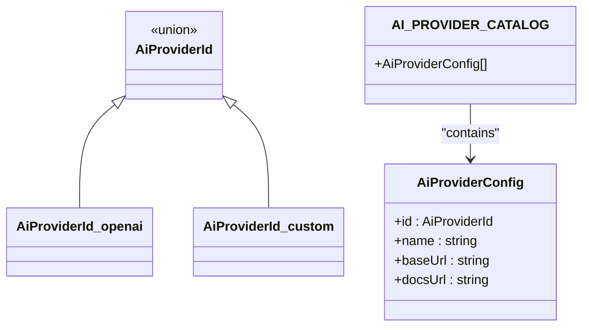
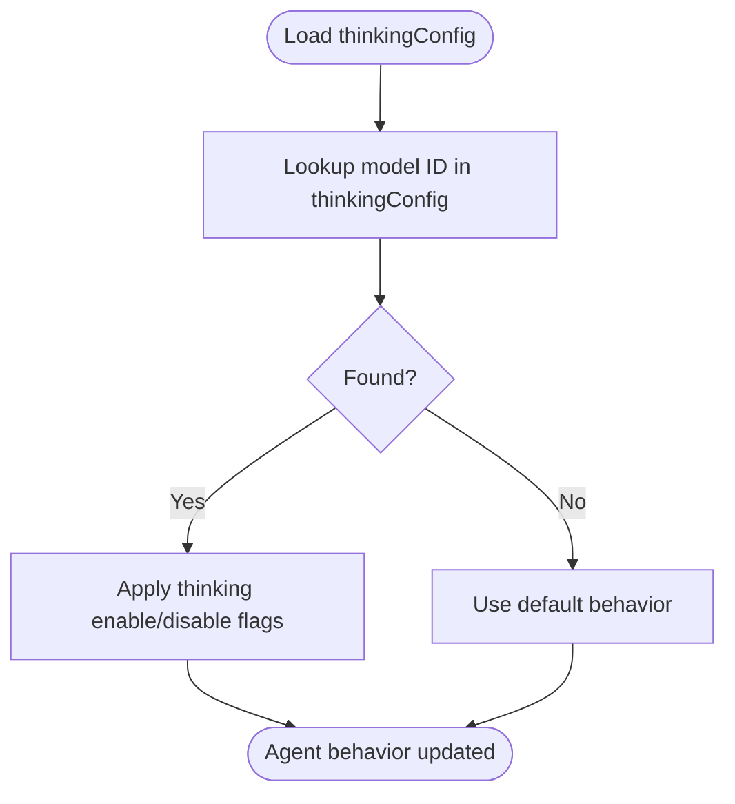
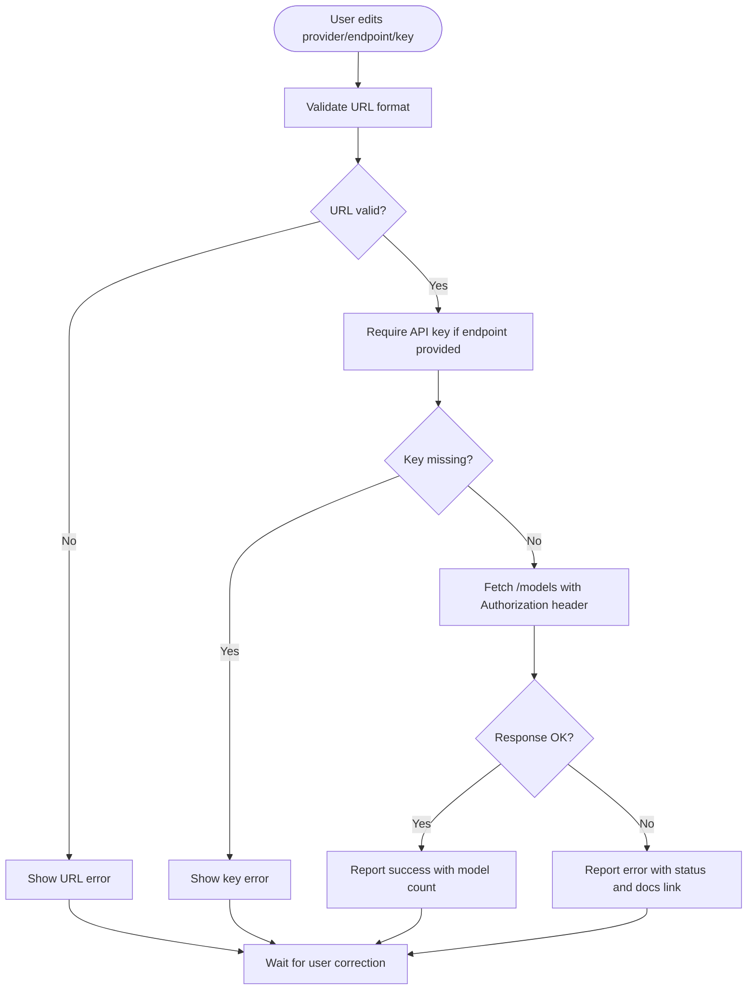
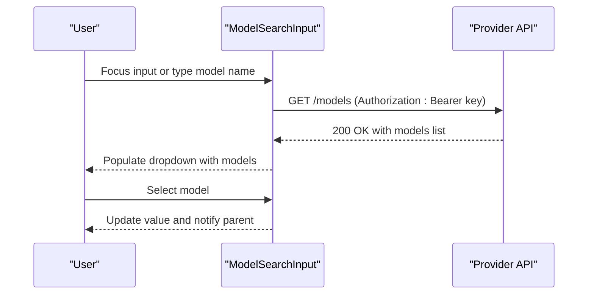
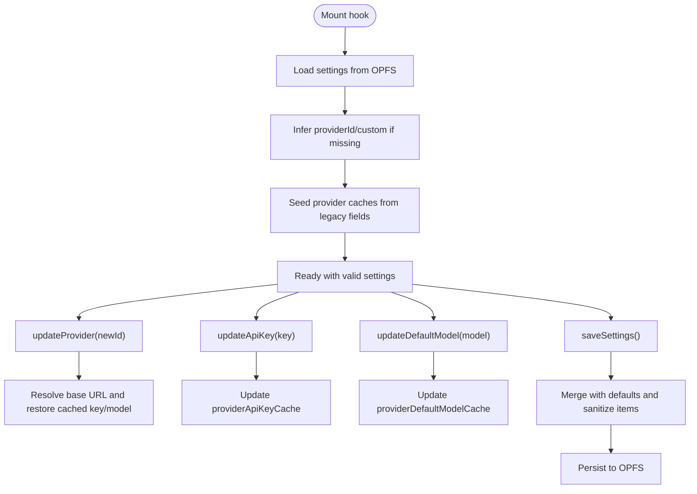
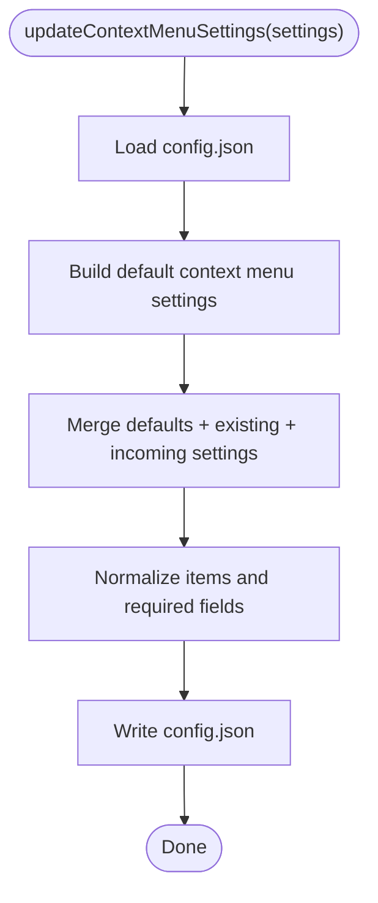
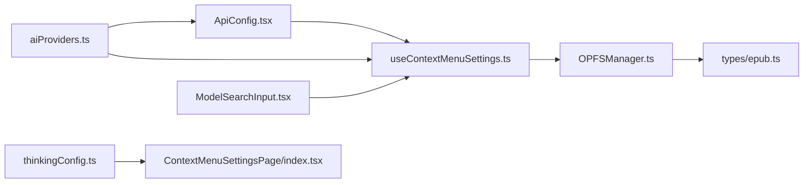

# AI Provider Configuration

<cite>
**Referenced Files in This Document**
- [aiProviders.ts](file://src/config/aiProviders.ts)
- [thinkingConfig.ts](file://src/config/thinkingConfig.ts)
- [ApiConfig.tsx](file://src/pages/ContextMenuSettingsPage/components/ApiConfig.tsx)
- [ModelSearchInput.tsx](file://src/pages/ContextMenuSettingsPage/components/ModelSearchInput.tsx)
- [ContextMenuSettingsPage/index.tsx](file://src/pages/ContextMenuSettingsPage/index.tsx)
- [useContextMenuSettings.ts](file://src/pages/ContextMenuSettingsPage/hooks/useContextMenuSettings.ts)
- [OPFSManager.ts](file://src/services/OPFSManager.ts)
- [epub.ts](file://src/types/epub.ts)
- [epub.utils.ts](file://src/pages/EpubReader/hooks/epub.utils.ts)
- [AGENTS.md](file://AGENTS.md)
</cite>

## Table of Contents
1. [Introduction](#introduction)
2. [Project Structure](#project-structure)
3. [Core Components](#core-components)
4. [Architecture Overview](#architecture-overview)
5. [Detailed Component Analysis](#detailed-component-analysis)
6. [Dependency Analysis](#dependency-analysis)
7. [Performance Considerations](#performance-considerations)
8. [Troubleshooting Guide](#troubleshooting-guide)
9. [Conclusion](#conclusion)
10. [Appendices](#appendices)

## Introduction
This document explains the AI provider configuration system used to connect the application to external AI services. It covers:
- Defining available providers and their endpoints
- Controlling AI response behavior and model selection
- Managing API keys and validating endpoints
- Selecting default models from provider offerings
- Browser-side storage of sensitive credentials
- Adding new providers and handling errors and fallbacks
- Best practices for maintaining compatibility across API versions

## Project Structure
The AI configuration spans configuration files, UI components, and persistence logic:
- Configuration files define provider catalog and thinking behavior
- UI components capture provider, endpoint, and API key, and fetch models
- Hooks orchestrate state and persist to OPFS-backed storage
- Types define the shape of persisted settings

**Diagram sources**
- [aiProviders.ts](file://src/config/aiProviders.ts#L1-L110)
- [thinkingConfig.ts](file://src/config/thinkingConfig.ts#L1-L34)
- [ContextMenuSettingsPage/index.tsx](file://src/pages/ContextMenuSettingsPage/index.tsx#L1-L273)
- [ApiConfig.tsx](file://src/pages/ContextMenuSettingsPage/components/ApiConfig.tsx#L1-L276)
- [ModelSearchInput.tsx](file://src/pages/ContextMenuSettingsPage/components/ModelSearchInput.tsx#L1-L235)
- [useContextMenuSettings.ts](file://src/pages/ContextMenuSettingsPage/hooks/useContextMenuSettings.ts#L1-L438)
- [OPFSManager.ts](file://src/services/OPFSManager.ts#L404-L473)
- [epub.ts](file://src/types/epub.ts#L89-L109)

**Section sources**
- [aiProviders.ts](file://src/config/aiProviders.ts#L1-L110)
- [thinkingConfig.ts](file://src/config/thinkingConfig.ts#L1-L34)
- [ContextMenuSettingsPage/index.tsx](file://src/pages/ContextMenuSettingsPage/index.tsx#L1-L273)

## Core Components
- Provider catalog: Defines provider IDs, human-friendly names, base URLs, and documentation links.
- Thinking configuration: Maps model IDs to thinking behavior flags.
- API configuration UI: Collects provider, endpoint, and API key; validates and tests connectivity.
- Model search input: Fetches available models from the configured endpoint and allows selection.
- Settings hook: Manages state, migrates legacy fields, caches provider-specific keys/models, and persists to OPFS.
- Persistence: OPFS-backed storage for configuration and books.

**Section sources**
- [aiProviders.ts](file://src/config/aiProviders.ts#L1-L110)
- [thinkingConfig.ts](file://src/config/thinkingConfig.ts#L1-L34)
- [ApiConfig.tsx](file://src/pages/ContextMenuSettingsPage/components/ApiConfig.tsx#L1-L276)
- [ModelSearchInput.tsx](file://src/pages/ContextMenuSettingsPage/components/ModelSearchInput.tsx#L1-L235)
- [useContextMenuSettings.ts](file://src/pages/ContextMenuSettingsPage/hooks/useContextMenuSettings.ts#L1-L438)
- [OPFSManager.ts](file://src/services/OPFSManager.ts#L404-L473)
- [epub.ts](file://src/types/epub.ts#L89-L109)

## Architecture Overview
The system integrates configuration, UI, and persistence:

**Diagram sources**
- [ContextMenuSettingsPage/index.tsx](file://src/pages/ContextMenuSettingsPage/index.tsx#L160-L205)
- [ApiConfig.tsx](file://src/pages/ContextMenuSettingsPage/components/ApiConfig.tsx#L120-L195)
- [ModelSearchInput.tsx](file://src/pages/ContextMenuSettingsPage/components/ModelSearchInput.tsx#L60-L112)
- [useContextMenuSettings.ts](file://src/pages/ContextMenuSettingsPage/hooks/useContextMenuSettings.ts#L388-L406)
- [OPFSManager.ts](file://src/services/OPFSManager.ts#L407-L447)

## Detailed Component Analysis

### Provider Catalog: aiProviders.ts
- Purpose: Central registry of supported AI providers with IDs, display names, base URLs, and documentation links.
- Behavior:
  - Exposes a union type for provider IDs and a catalog array of provider configs.
  - Includes a special custom provider requiring user-provided base URL and docs URL.
- Extensibility:
  - Add a new provider by extending the union type and appending to the catalog array with required fields.

**Diagram sources**
- [aiProviders.ts](file://src/config/aiProviders.ts#L1-L110)

**Section sources**
- [aiProviders.ts](file://src/config/aiProviders.ts#L1-L110)

### Thinking Behavior: thinkingConfig.ts
- Purpose: Associates specific model IDs with thinking behavior flags.
- Behavior:
  - Maps model IDs to a configuration item containing a query key and enable/disable flags.
  - Used to adapt agent behavior for models that support thinking modes.

**Diagram sources**
- [thinkingConfig.ts](file://src/config/thinkingConfig.ts#L1-L34)

**Section sources**
- [thinkingConfig.ts](file://src/config/thinkingConfig.ts#L1-L34)

### API Configuration UI: ApiConfig.tsx
- Purpose: Captures provider selection, base URL, and API key; validates inputs; tests connectivity.
- Key behaviors:
  - Validates URL format and shows targeted error messages.
  - Requires API key when endpoint is valid; shows warnings otherwise.
  - Tests connectivity by fetching models from the configured endpoint and reporting status with model count.
  - Supports custom provider mode by rendering the base URL input.
  - Debounces testing to avoid excessive network calls.

**Diagram sources**
- [ApiConfig.tsx](file://src/pages/ContextMenuSettingsPage/components/ApiConfig.tsx#L35-L195)

**Section sources**
- [ApiConfig.tsx](file://src/pages/ContextMenuSettingsPage/components/ApiConfig.tsx#L1-L276)

### Model Selection UI: ModelSearchInput.tsx
- Purpose: Allows users to search and select a model from the provider’s offerings.
- Key behaviors:
  - Fetches models from the configured endpoint when both endpoint and key are available.
  - Handles multiple API response formats (array of objects with ids, direct arrays, or arrays under a models key).
  - Falls back to default models if the API is unavailable, preserving usability.
  - Implements keyboard navigation and dropdown filtering.

**Diagram sources**
- [ModelSearchInput.tsx](file://src/pages/ContextMenuSettingsPage/components/ModelSearchInput.tsx#L60-L112)

**Section sources**
- [ModelSearchInput.tsx](file://src/pages/ContextMenuSettingsPage/components/ModelSearchInput.tsx#L1-L235)

### Settings Management: useContextMenuSettings.ts
- Purpose: Orchestrates state for provider, endpoint, API key, default model, and tools; persists to OPFS.
- Key behaviors:
  - Loads settings from OPFS on mount; infers custom provider if missing; seeds caches.
  - Updates provider, endpoint, API key, and default model; maintains provider-specific caches.
  - Saves settings to OPFS with merging logic to preserve defaults and normalize items.
  - Provides actions for tools and preferences.

**Diagram sources**
- [useContextMenuSettings.ts](file://src/pages/ContextMenuSettingsPage/hooks/useContextMenuSettings.ts#L47-L128)
- [useContextMenuSettings.ts](file://src/pages/ContextMenuSettingsPage/hooks/useContextMenuSettings.ts#L145-L167)
- [useContextMenuSettings.ts](file://src/pages/ContextMenuSettingsPage/hooks/useContextMenuSettings.ts#L176-L190)
- [useContextMenuSettings.ts](file://src/pages/ContextMenuSettingsPage/hooks/useContextMenuSettings.ts#L192-L209)
- [useContextMenuSettings.ts](file://src/pages/ContextMenuSettingsPage/hooks/useContextMenuSettings.ts#L388-L406)
- [OPFSManager.ts](file://src/services/OPFSManager.ts#L407-L447)

**Section sources**
- [useContextMenuSettings.ts](file://src/pages/ContextMenuSettingsPage/hooks/useContextMenuSettings.ts#L1-L438)
- [OPFSManager.ts](file://src/services/OPFSManager.ts#L404-L473)
- [epub.ts](file://src/types/epub.ts#L89-L109)

### Persistence: OPFSManager.ts
- Purpose: Provides OPFS-backed storage for configuration and books.
- Key behaviors:
  - Ensures config.json exists and initializes directory structure.
  - Loads and saves configuration; recovers from empty/corrupted files by recreating defaults.
  - Updates context menu settings by merging incoming partial settings with defaults and existing values.
  - Retrieves context menu settings with default fallbacks.

**Diagram sources**
- [OPFSManager.ts](file://src/services/OPFSManager.ts#L407-L447)
- [OPFSManager.ts](file://src/services/OPFSManager.ts#L452-L473)

**Section sources**
- [OPFSManager.ts](file://src/services/OPFSManager.ts#L404-L473)

## Dependency Analysis
- aiProviders.ts is consumed by:
  - ApiConfig.tsx (provider options and docs URL)
  - useContextMenuSettings.ts (resolving base URL and caching provider-specific keys/models)
- thinkingConfig.ts is consumed by:
  - Agent logic (external to the analyzed files) to adapt behavior for specific models
- ApiConfig.tsx and ModelSearchInput.tsx depend on:
  - useContextMenuSettings.ts for state updates and saving
  - OPFSManager.ts indirectly via the hook’s save operation
- Types in epub.ts define the persisted structure used by OPFSManager.

**Diagram sources**
- [aiProviders.ts](file://src/config/aiProviders.ts#L1-L110)
- [thinkingConfig.ts](file://src/config/thinkingConfig.ts#L1-L34)
- [ApiConfig.tsx](file://src/pages/ContextMenuSettingsPage/components/ApiConfig.tsx#L1-L276)
- [ModelSearchInput.tsx](file://src/pages/ContextMenuSettingsPage/components/ModelSearchInput.tsx#L1-L235)
- [useContextMenuSettings.ts](file://src/pages/ContextMenuSettingsPage/hooks/useContextMenuSettings.ts#L1-L438)
- [OPFSManager.ts](file://src/services/OPFSManager.ts#L404-L473)
- [epub.ts](file://src/types/epub.ts#L89-L109)

**Section sources**
- [aiProviders.ts](file://src/config/aiProviders.ts#L1-L110)
- [ApiConfig.tsx](file://src/pages/ContextMenuSettingsPage/components/ApiConfig.tsx#L1-L276)
- [ModelSearchInput.tsx](file://src/pages/ContextMenuSettingsPage/components/ModelSearchInput.tsx#L1-L235)
- [useContextMenuSettings.ts](file://src/pages/ContextMenuSettingsPage/hooks/useContextMenuSettings.ts#L1-L438)
- [OPFSManager.ts](file://src/services/OPFSManager.ts#L404-L473)
- [epub.ts](file://src/types/epub.ts#L89-L109)

## Performance Considerations
- Debounced testing in ApiConfig.tsx prevents rapid repeated network calls while the user is typing.
- ModelSearchInput.tsx fetches models lazily upon focus or when needed, avoiding unnecessary requests.
- OPFS operations are asynchronous; batch saves and avoid frequent writes by leveraging the hook’s saveSettings method.

[No sources needed since this section provides general guidance]

## Troubleshooting Guide
- Invalid API key:
  - Symptom: API connection fails with an error status or message.
  - Resolution: Verify the key is correct and has permissions for the provider. Use the test button to confirm.
- Rate limiting:
  - Symptom: Provider responds with rate limit exceeded or throttled responses.
  - Resolution: Reduce request frequency, retry with backoff, or adjust provider settings. The UI surfaces provider documentation for guidance.
- Fallback strategies:
  - ModelSearchInput.tsx falls back to default models if the API is unreachable, ensuring usability.
  - OPFSManager.ts rebuilds defaults if config.json is missing or corrupted.
- Security:
  - Credentials are stored in-browser via OPFS-backed storage; avoid committing real keys. Prefer HTTPS endpoints and trim logs before sharing.

**Section sources**
- [ApiConfig.tsx](file://src/pages/ContextMenuSettingsPage/components/ApiConfig.tsx#L120-L195)
- [ModelSearchInput.tsx](file://src/pages/ContextMenuSettingsPage/components/ModelSearchInput.tsx#L60-L112)
- [OPFSManager.ts](file://src/services/OPFSManager.ts#L478-L509)
- [AGENTS.md](file://AGENTS.md#L38-L41)

## Conclusion
The AI provider configuration system offers a robust, extensible way to integrate multiple AI services. It centralizes provider definitions, validates and tests endpoints, manages API keys securely in-browser, and enables dynamic model selection. The hook-based architecture ensures compatibility with evolving provider APIs and simplifies migration and fallback strategies.

[No sources needed since this section summarizes without analyzing specific files]

## Appendices

### How to Add a New AI Provider
Steps to add a new provider:
1. Extend the provider ID union and add a new catalog entry with:
   - id: unique provider identifier
   - name: human-readable name
   - baseUrl: base URL for the provider’s API
   - docsUrl: provider documentation URL
2. If the provider requires custom base URL, ensure the custom provider option remains available.
3. Ensure the provider’s /models endpoint returns a list compatible with the ModelSearchInput parsing logic (objects with id, direct arrays, or arrays under a models key).
4. Test connectivity using the API configuration UI and verify model listing.

**Section sources**
- [aiProviders.ts](file://src/config/aiProviders.ts#L1-L110)
- [ModelSearchInput.tsx](file://src/pages/ContextMenuSettingsPage/components/ModelSearchInput.tsx#L60-L112)
- [ApiConfig.tsx](file://src/pages/ContextMenuSettingsPage/components/ApiConfig.tsx#L120-L195)

### Security Model for Sensitive Credentials
- Storage: Settings are persisted to OPFS-backed storage; API keys are stored in the browser.
- Best practices:
  - Never commit real keys; use placeholders in documentation and tests.
  - Prefer HTTPS endpoints.
  - Trim logs before sharing to avoid exposing request URLs or token usage details.

**Section sources**
- [OPFSManager.ts](file://src/services/OPFSManager.ts#L404-L473)
- [epub.utils.ts](file://src/pages/EpubReader/hooks/epub.utils.ts#L1-L10)
- [AGENTS.md](file://AGENTS.md#L38-L41)

### Example: Adding Anthropic or Mistral
- Anthropic:
  - Add a new catalog entry with id, name, baseUrl, and docsUrl.
  - Ensure the provider’s /models endpoint returns a list of model IDs.
  - Use the API configuration UI to test and select a model.
- Mistral:
  - Follow the same steps as above; Mistral is already included in the catalog.

**Section sources**
- [aiProviders.ts](file://src/config/aiProviders.ts#L43-L54)
- [ModelSearchInput.tsx](file://src/pages/ContextMenuSettingsPage/components/ModelSearchInput.tsx#L60-L112)

### Maintaining Compatibility Across API Versions
- Normalize provider responses in ModelSearchInput.tsx to handle variations in model list formats.
- Use provider-specific base URLs from aiProviders.ts to ensure endpoint correctness.
- Leverage provider caches in useContextMenuSettings.ts to minimize churn when switching providers.
- Keep documentation links up to date in aiProviders.ts for quick troubleshooting.

**Section sources**
- [ModelSearchInput.tsx](file://src/pages/ContextMenuSettingsPage/components/ModelSearchInput.tsx#L60-L112)
- [useContextMenuSettings.ts](file://src/pages/ContextMenuSettingsPage/hooks/useContextMenuSettings.ts#L145-L167)
- [aiProviders.ts](file://src/config/aiProviders.ts#L1-L110)