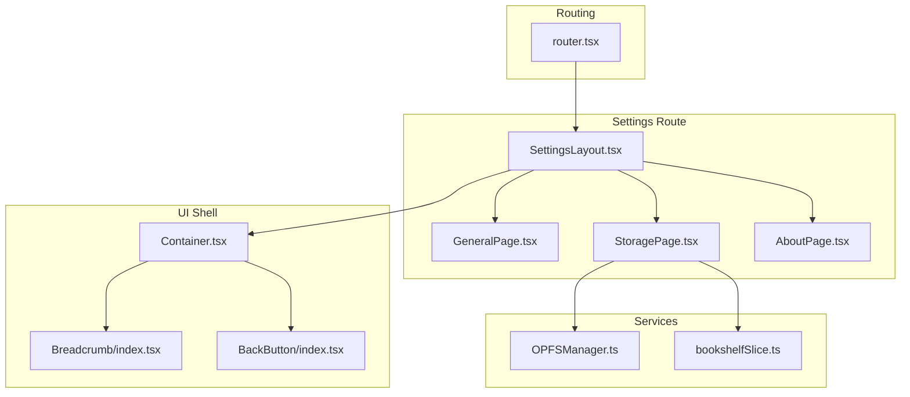
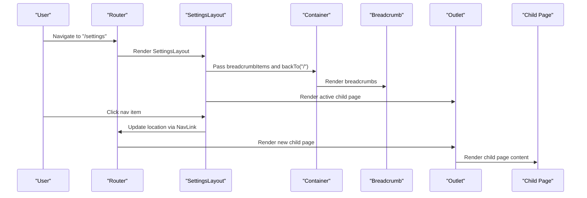
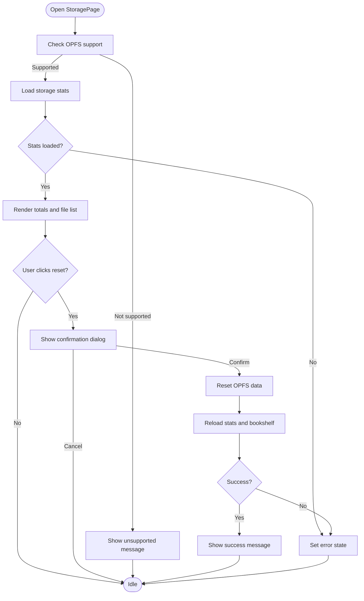
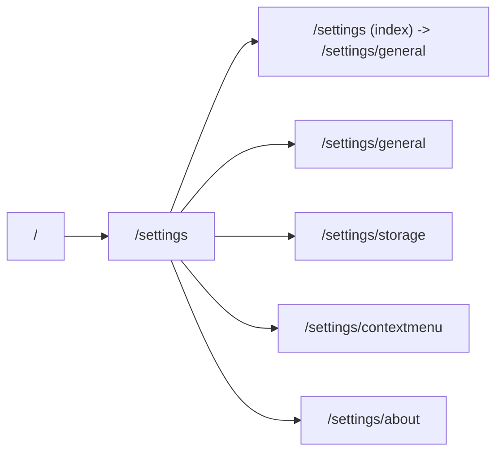
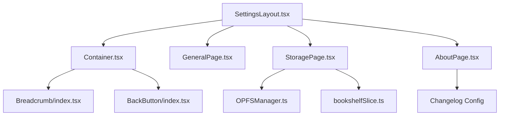

# Application Settings

<cite>
**Referenced Files in This Document**
- [SettingsLayout.tsx](file://src/pages/SettingsPage/SettingsLayout.tsx)
- [index.tsx](file://src/pages/SettingsPage/index.tsx)
- [StoragePage.tsx](file://src/pages/SettingsPage/StoragePage.tsx)
- [AboutPage.tsx](file://src/pages/SettingsPage/AboutPage.tsx)
- [router.tsx](file://src/config/router.tsx)
- [Container.tsx](file://src/components/Container.tsx)
- [Breadcrumb/index.tsx](file://src/components/Breadcrumb/index.tsx)
- [BackButton/index.tsx](file://src/components/BackButton/index.tsx)
- [OPFSManager.ts](file://src/services/OPFSManager.ts)
- [bookshelfSlice.ts](file://src/store/slices/bookshelfSlice.ts)
</cite>

## Table of Contents
1. [Introduction](#introduction)
2. [Project Structure](#project-structure)
3. [Core Components](#core-components)
4. [Architecture Overview](#architecture-overview)
5. [Detailed Component Analysis](#detailed-component-analysis)
6. [Dependency Analysis](#dependency-analysis)
7. [Performance Considerations](#performance-considerations)
8. [Troubleshooting Guide](#troubleshooting-guide)
9. [Conclusion](#conclusion)
10. [Appendices](#appendices)

## Introduction
This section documents the application settings interface, focusing on the SettingsLayout component that powers the navigation rail and breadcrumb system across all settings pages. It also covers the General page placeholder for future preferences, the StoragePage for managing OPFS cache, and the AboutPage for version and changelog display. The document explains how settings routing is configured via react-router-dom, how navigation state is managed, and provides guidance for integrating new settings sections. Accessibility, responsive design patterns, and best practices for presenting “coming soon” features are included, along with practical examples for extending the settings layout.

## Project Structure
The settings feature is organized under a dedicated settings route with a shared layout and several page-specific components. The routing configuration defines nested routes for each settings section, while the layout composes a container, breadcrumb, and navigation rail.

**Diagram sources**
- [router.tsx](file://src/config/router.tsx#L12-L55)
- [SettingsLayout.tsx](file://src/pages/SettingsPage/SettingsLayout.tsx#L34-L86)
- [index.tsx](file://src/pages/SettingsPage/index.tsx#L1-L50)
- [StoragePage.tsx](file://src/pages/SettingsPage/StoragePage.tsx#L1-L190)
- [AboutPage.tsx](file://src/pages/SettingsPage/AboutPage.tsx#L1-L105)
- [Container.tsx](file://src/components/Container.tsx#L1-L31)
- [Breadcrumb/index.tsx](file://src/components/Breadcrumb/index.tsx#L1-L36)
- [BackButton/index.tsx](file://src/components/BackButton/index.tsx#L1-L40)
- [OPFSManager.ts](file://src/services/OPFSManager.ts#L365-L402)
- [bookshelfSlice.ts](file://src/store/slices/bookshelfSlice.ts#L78-L85)

**Section sources**
- [router.tsx](file://src/config/router.tsx#L12-L55)
- [SettingsLayout.tsx](file://src/pages/SettingsPage/SettingsLayout.tsx#L34-L86)
- [Container.tsx](file://src/components/Container.tsx#L1-L31)

## Core Components
- SettingsLayout: Provides the left navigation rail, active link highlighting, and a right content panel that renders the selected settings child page. It computes breadcrumbs based on the current location and passes them to the container.
- GeneralPage: Placeholder page for future general preferences (theme, language). It currently lists “Coming Soon” features.
- StoragePage: Manages OPFS cache statistics and reset operations, including browser support checks, loading states, and user confirmations.
- AboutPage: Displays app version, release date, summary, and a changelog history grouped by categories.
- Routing: Configured via createBrowserRouter with nested routes under /settings, including a default redirect to the general page.

Key responsibilities:
- Navigation: SettingsLayout uses react-router’s NavLink to render the rail and highlight active links.
- Breadcrumbs: Computed dynamically from the current location and nav items.
- Content rendering: Outlet renders the active child page.
- State management: StoragePage manages loading, error, and reset states; AboutPage relies on changelog configuration.

**Section sources**
- [SettingsLayout.tsx](file://src/pages/SettingsPage/SettingsLayout.tsx#L34-L86)
- [index.tsx](file://src/pages/SettingsPage/index.tsx#L1-L50)
- [StoragePage.tsx](file://src/pages/SettingsPage/StoragePage.tsx#L1-L190)
- [AboutPage.tsx](file://src/pages/SettingsPage/AboutPage.tsx#L1-L105)
- [router.tsx](file://src/config/router.tsx#L12-L55)

## Architecture Overview
The settings architecture centers around a single SettingsLayout that hosts multiple child pages. The layout composes a container shell with a breadcrumb bar and a back button, and a navigation rail that links to each child route. The routing configuration ensures predictable navigation and default redirects.

**Diagram sources**
- [router.tsx](file://src/config/router.tsx#L12-L55)
- [SettingsLayout.tsx](file://src/pages/SettingsPage/SettingsLayout.tsx#L34-L86)
- [Container.tsx](file://src/components/Container.tsx#L1-L31)
- [Breadcrumb/index.tsx](file://src/components/Breadcrumb/index.tsx#L1-L36)

## Detailed Component Analysis

### SettingsLayout: Navigation Rail and Breadcrumbs
- Navigation rail: A vertical list of links rendered via react-router’s NavLink. Active links receive a distinct visual style; inactive links have hover states.
- Breadcrumb computation: Breadcrumbs are derived from the current location and a static navItems list. The base includes Home and Settings, with the current section appended.
- Layout composition: The layout wraps content in a container that includes a header with a back button and a breadcrumb bar, and a main content area that renders the active child page.

Accessibility and responsiveness:
- The navigation rail is accessible via keyboard and screen readers through standard anchor elements.
- Responsive behavior: On small screens, the rail is a horizontal bar at the top; on medium and larger screens, it becomes a vertical sidebar with a fixed height.

Integration points:
- The layout depends on react-router for navigation and location state.
- The container component provides a consistent header and back navigation.

**Section sources**
- [SettingsLayout.tsx](file://src/pages/SettingsPage/SettingsLayout.tsx#L34-L86)
- [Container.tsx](file://src/components/Container.tsx#L1-L31)
- [Breadcrumb/index.tsx](file://src/components/Breadcrumb/index.tsx#L1-L36)
- [BackButton/index.tsx](file://src/components/BackButton/index.tsx#L1-L40)

### General Settings Page (Placeholder)
- Purpose: Placeholder for future general preferences such as theme and language settings.
- UI pattern: Displays a “Coming Soon” section with a grid of feature items. This pattern signals unimplemented features without exposing broken UI.
- Best practices:
  - Use a neutral, non-promotional tone for placeholders.
  - Group features by logical categories to aid discoverability when implemented.
  - Consider adding tooltips or badges to indicate feature status.

**Section sources**
- [index.tsx](file://src/pages/SettingsPage/index.tsx#L1-L50)

### Storage Management (StoragePage)
- OPFS integration: Uses OPFSManager to check support, load stats, and reset all data. It displays totals for cached bytes, books, and config, and lists individual cached files.
- State management:
  - isLoading: Tracks asynchronous loading of storage stats.
  - error: Stores error messages for failures.
  - resetState: Tracks the lifecycle of the reset operation (idle, working, success, error).
- UX safeguards:
  - Browser support detection with a friendly message when unsupported.
  - Confirmation dialog before destructive actions.
  - Immediate refresh of stats and bookshelf after reset.
- Data presentation:
  - Uses a utility to format file sizes.
  - Sorts files by size for easy scanning.

**Diagram sources**
- [StoragePage.tsx](file://src/pages/SettingsPage/StoragePage.tsx#L1-L190)
- [OPFSManager.ts](file://src/services/OPFSManager.ts#L365-L402)
- [bookshelfSlice.ts](file://src/store/slices/bookshelfSlice.ts#L78-L85)

**Section sources**
- [StoragePage.tsx](file://src/pages/SettingsPage/StoragePage.tsx#L1-L190)
- [OPFSManager.ts](file://src/services/OPFSManager.ts#L365-L402)
- [bookshelfSlice.ts](file://src/store/slices/bookshelfSlice.ts#L78-L85)

### About Page (Version and Changelog)
- Version and metadata: Displays the latest version, release date, and summary.
- Changelog history: Renders grouped entries by category, ordered by a predefined sequence. Non-empty categories are shown with titles and descriptions.
- Data source: Relies on changelog configuration and category labels.

**Section sources**
- [AboutPage.tsx](file://src/pages/SettingsPage/AboutPage.tsx#L1-L105)

### Settings Routing and Navigation State
- Nested routes: Under /settings, the router defines children for general, storage, contextmenu, and about. An index route redirects to general.
- Navigation state: SettingsLayout uses useLocation to compute breadcrumbs and react-router’s NavLink to manage active states. The container’s back button uses useNavigate for programmatic navigation.
- Consistency: All settings pages share the same layout and breadcrumb structure, ensuring predictable navigation.

**Diagram sources**
- [router.tsx](file://src/config/router.tsx#L12-L55)
- [SettingsLayout.tsx](file://src/pages/SettingsPage/SettingsLayout.tsx#L34-L86)

**Section sources**
- [router.tsx](file://src/config/router.tsx#L12-L55)
- [SettingsLayout.tsx](file://src/pages/SettingsPage/SettingsLayout.tsx#L34-L86)

## Dependency Analysis
- SettingsLayout depends on:
  - react-router for navigation and location state.
  - Container, Breadcrumb, and BackButton for UI shell and navigation affordances.
- StoragePage depends on:
  - OPFSManager for all OPFS operations.
  - Redux store via loadBooks thunk to refresh the bookshelf after reset.
- AboutPage depends on:
  - Changelog configuration and category mapping.

**Diagram sources**
- [SettingsLayout.tsx](file://src/pages/SettingsPage/SettingsLayout.tsx#L34-L86)
- [Container.tsx](file://src/components/Container.tsx#L1-L31)
- [Breadcrumb/index.tsx](file://src/components/Breadcrumb/index.tsx#L1-L36)
- [BackButton/index.tsx](file://src/components/BackButton/index.tsx#L1-L40)
- [StoragePage.tsx](file://src/pages/SettingsPage/StoragePage.tsx#L1-L190)
- [OPFSManager.ts](file://src/services/OPFSManager.ts#L365-L402)
- [bookshelfSlice.ts](file://src/store/slices/bookshelfSlice.ts#L78-L85)
- [AboutPage.tsx](file://src/pages/SettingsPage/AboutPage.tsx#L1-L105)

**Section sources**
- [SettingsLayout.tsx](file://src/pages/SettingsPage/SettingsLayout.tsx#L34-L86)
- [StoragePage.tsx](file://src/pages/SettingsPage/StoragePage.tsx#L1-L190)
- [AboutPage.tsx](file://src/pages/SettingsPage/AboutPage.tsx#L1-L105)

## Performance Considerations
- OPFS operations: StoragePage performs asynchronous IO; ensure stats are cached minimally and refreshed only when necessary to avoid blocking the UI.
- Rendering: The breadcrumb and navigation rail are lightweight; keep child pages’ rendering efficient by avoiding heavy computations in render.
- Conditional rendering: Hide unsupported features gracefully to prevent unnecessary DOM updates.

[No sources needed since this section provides general guidance]

## Troubleshooting Guide
- OPFS not supported:
  - Symptom: Unsupported message appears and reset controls are disabled.
  - Resolution: Inform users to switch to a Chromium-based browser and explain the requirement.
- Reset failures:
  - Symptom: Error state displayed after reset attempt.
  - Resolution: Verify browser support, retry, and check console logs for underlying errors.
- Empty storage:
  - Symptom: No cached files found.
  - Resolution: Confirm uploads occurred and the OPFS directory structure is intact.
- Changelog display issues:
  - Symptom: Missing or malformed changelog entries.
  - Resolution: Validate changelog configuration and ensure category keys match expected values.

**Section sources**
- [StoragePage.tsx](file://src/pages/SettingsPage/StoragePage.tsx#L98-L103)
- [OPFSManager.ts](file://src/services/OPFSManager.ts#L365-L402)
- [AboutPage.tsx](file://src/pages/SettingsPage/AboutPage.tsx#L1-L105)

## Conclusion
The settings interface is built around a robust layout that centralizes navigation, breadcrumbs, and content rendering. The routing configuration ensures consistent navigation across all settings sections, while the StoragePage and AboutPage demonstrate practical patterns for managing OPFS data and presenting version information. The General page serves as a clean placeholder for future preferences. By following the outlined best practices and extending the existing patterns, new settings sections can be integrated seamlessly.

[No sources needed since this section summarizes without analyzing specific files]

## Appendices

### Integrating a New Settings Section
Steps to add a new settings section:
1. Create a new page component under the settings directory.
2. Add a nav item in SettingsLayout with label, path, and description.
3. Register a new route in router.tsx under /settings with the new path and element.
4. Optionally add a breadcrumb item in SettingsLayout if the new section requires special breadcrumb handling.
5. Use the existing container and breadcrumb components for consistent UX.

Example integration points:
- Nav item registration: [SettingsLayout.tsx](file://src/pages/SettingsPage/SettingsLayout.tsx#L11-L32)
- Route registration: [router.tsx](file://src/config/router.tsx#L22-L46)

**Section sources**
- [SettingsLayout.tsx](file://src/pages/SettingsPage/SettingsLayout.tsx#L11-L32)
- [router.tsx](file://src/config/router.tsx#L22-L46)

### Accessibility and Responsive Design Notes
- Accessibility:
  - Use semantic anchors for navigation items.
  - Ensure focus indicators are visible for keyboard navigation.
  - Provide descriptive aria-labels for navigation regions.
- Responsive design:
  - The navigation rail adapts from horizontal on small screens to vertical on larger screens.
  - Ensure touch targets are sufficiently sized for mobile navigation.

[No sources needed since this section provides general guidance]