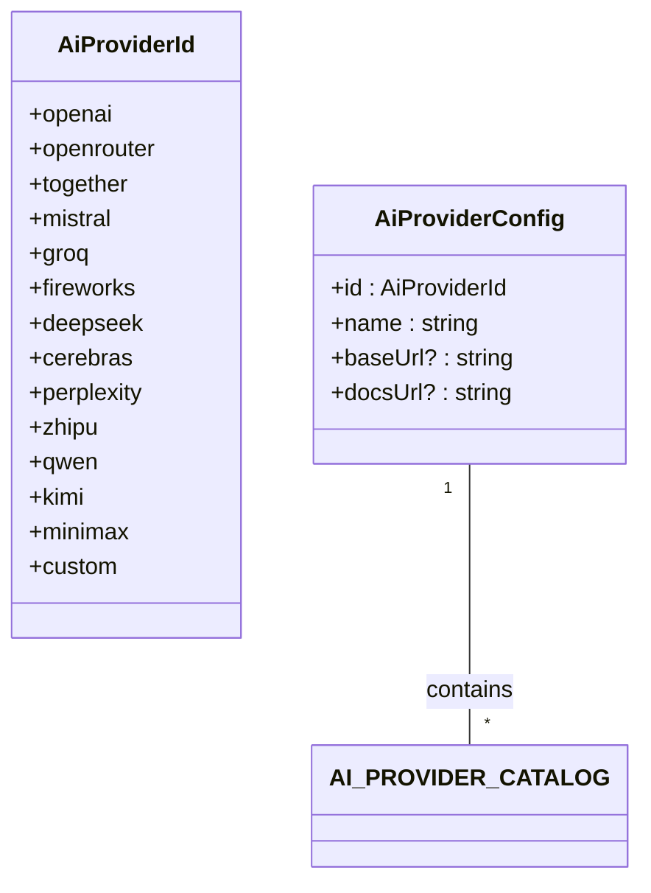
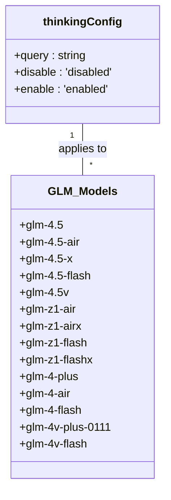
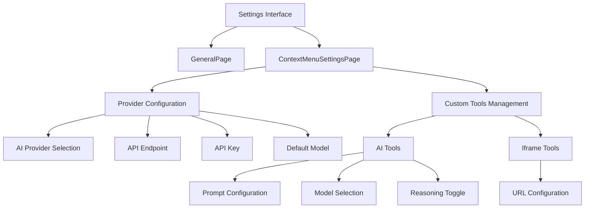
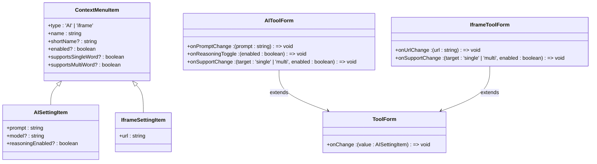
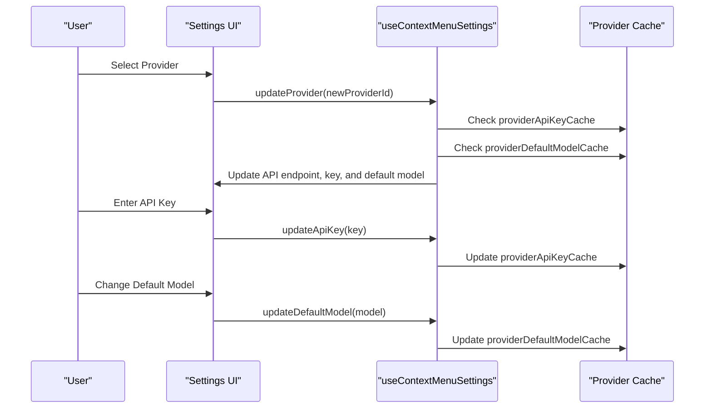
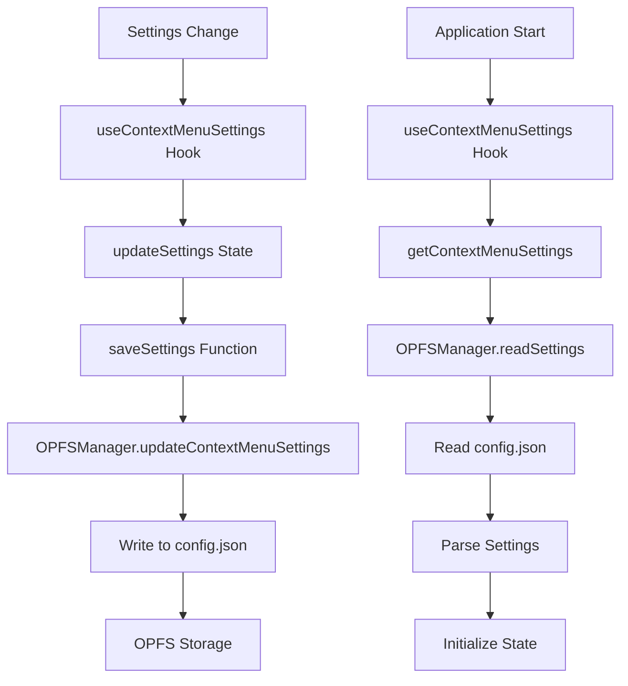

# Configuration and Settings

<cite>
**Referenced Files in This Document**   
- [aiProviders.ts](file://src/config/aiProviders.ts)
- [thinkingConfig.ts](file://src/config/thinkingConfig.ts)
- [config.ts](file://src/config/config.ts)
- [ContextMenuSettingsPage/index.tsx](file://src/pages/ContextMenuSettingsPage/index.tsx)
- [useContextMenuSettings.ts](file://src/pages/ContextMenuSettingsPage/hooks/useContextMenuSettings.ts)
- [AIToolForm.tsx](file://src/pages/ContextMenuSettingsPage/components/AIToolForm.tsx)
- [IframeToolForm.tsx](file://src/pages/ContextMenuSettingsPage/components/IframeToolForm.tsx)
- [OPFSManager.ts](file://src/services/OPFSManager.ts)
- [epub.ts](file://src/types/epub.ts)
- [StoragePage.tsx](file://src/pages/SettingsPage/StoragePage.tsx)
</cite>

## Table of Contents
1. [Introduction](#introduction)
2. [AI Provider Configuration](#ai-provider-configuration)
3. [AI Behavior Parameters](#ai-behavior-parameters)
4. [Application Settings Interface](#application-settings-interface)
5. [Custom Tool System](#custom-tool-system)
6. [Model Selection and Provider Configuration](#model-selection-and-provider-configuration)
7. [Settings Persistence Mechanism](#settings-persistence-mechanism)
8. [Configuration Examples](#configuration-examples)
9. [Security Considerations](#security-considerations)
10. [Best Practices](#best-practices)

## Introduction
The application provides a comprehensive configuration system that enables users to customize AI service endpoints, behavior parameters, and application preferences. The settings architecture is designed around two primary configuration domains: AI service integration and user interface customization. The system supports multiple AI providers through a standardized configuration interface and allows users to create custom tools for enhanced functionality. All settings are managed through dedicated interfaces that provide validation, testing capabilities, and persistence across sessions.

**Section sources**
- [ContextMenuSettingsPage/index.tsx](file://src/pages/ContextMenuSettingsPage/index.tsx#L15-L273)

## AI Provider Configuration

The AI provider configuration system is defined in `aiProviders.ts` and implements a catalog-based approach for managing AI service endpoints. The system supports multiple providers through a unified interface that standardizes endpoint configuration.



**Diagram sources**
- [aiProviders.ts](file://src/config/aiProviders.ts#L1-L110)

The `AI_PROVIDER_CATALOG` constant contains configuration objects for 14 different AI providers, each with a unique identifier, display name, base URL, and documentation link. The system includes built-in support for major providers such as OpenAI, Together AI, Mistral, and Groq, as well as regional providers like Zhipu GLM and Kimi. The 'custom' provider option allows users to configure any OpenAI-compatible API endpoint, providing flexibility for private or specialized AI services.

When a user selects a provider, the system automatically populates the base URL field with the appropriate endpoint, reducing configuration errors. The provider selection also enables provider-specific key caching, allowing users to maintain different API keys for different services without re-entering them each time.

**Section sources**
- [aiProviders.ts](file://src/config/aiProviders.ts#L1-L110)
- [useContextMenuSettings.ts](file://src/pages/ContextMenuSettingsPage/hooks/useContextMenuSettings.ts#L145-L167)

## AI Behavior Parameters

The `thinkingConfig.ts` file defines behavior parameters for AI models, specifically focusing on thinking capabilities for the Zhipu GLM series of models. This configuration system enables fine-grained control over AI behavior based on the specific model being used.



**Diagram sources**
- [thinkingConfig.ts](file://src/config/thinkingConfig.ts#L1-L34)

The configuration uses a record pattern where each GLM model variant is mapped to a configuration object that specifies whether thinking capabilities should be enabled or disabled. This approach allows the application to automatically configure AI behavior based on the selected model, ensuring optimal performance and compatibility. The system is designed to be extensible, allowing new model variants to be added without modifying the core logic.

**Section sources**
- [thinkingConfig.ts](file://src/config/thinkingConfig.ts#L1-L34)

## Application Settings Interface

The application provides two primary settings interfaces: the general settings page and the context menu settings page. The `SettingsPage` component serves as the entry point for application preferences, while the `ContextMenuSettingsPage` provides detailed configuration for AI tools and provider settings.



**Diagram sources**
- [SettingsPage/index.tsx](file://src/pages/SettingsPage/index.tsx#L1-L51)
- [ContextMenuSettingsPage/index.tsx](file://src/pages/ContextMenuSettingsPage/index.tsx#L15-L273)

The context menu settings interface is particularly comprehensive, providing fields for API endpoint configuration, API key management, default model selection, and custom tool management. The interface includes validation logic that ensures a default model is selected when AI tools are configured, preventing runtime errors. Status indicators provide real-time feedback on connection status, with visual cues for testing, success, warning, and error states.

**Section sources**
- [ContextMenuSettingsPage/index.tsx](file://src/pages/ContextMenuSettingsPage/index.tsx#L15-L273)

## Custom Tool System

The custom tool system enables users to create, edit, and manage both AI-powered and iframe-based tools that appear in the reader's context menu. This extensible architecture supports two primary tool types: AI tools that leverage language models for text processing, and iframe tools that embed external web content.



**Diagram sources**
- [epub.ts](file://src/types/epub.ts#L1-L135)
- [AIToolForm.tsx](file://src/pages/ContextMenuSettingsPage/components/AIToolForm.tsx#L1-L111)
- [IframeToolForm.tsx](file://src/pages/ContextMenuSettingsPage/components/IframeToolForm.tsx#L1-L91)

The system uses a unified `ContextMenuItem` type that can be either an `AISettingItem` or an `IframeSettingItem`, allowing for consistent handling of different tool types. AI tools are configured with prompts that define their behavior, model selection, and reasoning capabilities, while iframe tools are configured with URLs that can include template variables for selected text and context.

Each tool can be configured to support single-word or multi-word selections, allowing users to control when each tool appears in the context menu. The interface provides clear guidance on using the `{{words}}` and `{{context}}` template variables in prompts and URLs, enabling context-aware tool behavior.

**Section sources**
- [epub.ts](file://src/types/epub.ts#L1-L135)
- [AIToolForm.tsx](file://src/pages/ContextMenuSettingsPage/components/AIToolForm.tsx#L1-L111)
- [IframeToolForm.tsx](file://src/pages/ContextMenuSettingsPage/components/IframeToolForm.tsx#L1-L91)
- [useContextMenuSettings.ts](file://src/pages/ContextMenuSettingsPage/hooks/useContextMenuSettings.ts#L231-L385)

## Model Selection and Provider Configuration

The application implements a sophisticated model selection and provider configuration system that manages the relationship between AI providers, API keys, and default models. This system ensures that users can seamlessly switch between providers while maintaining their configuration preferences.



**Diagram sources**
- [useContextMenuSettings.ts](file://src/pages/ContextMenuSettingsPage/hooks/useContextMenuSettings.ts#L145-L209)

The system uses a caching mechanism to store API keys and default models for each provider, eliminating the need for users to re-enter this information when switching between providers. When a user selects a different provider, the system automatically updates the API endpoint to the provider's default URL (if available) and restores the previously used API key and default model for that provider.

The configuration process includes validation to ensure that a default model is selected when AI tools are present, preventing configuration errors that could lead to failed API requests. The interface also provides a test connection feature that validates the API endpoint and key before saving, giving users immediate feedback on their configuration.

**Section sources**
- [useContextMenuSettings.ts](file://src/pages/ContextMenuSettingsPage/hooks/useContextMenuSettings.ts#L145-L209)
- [ContextMenuSettingsPage/index.tsx](file://src/pages/ContextMenuSettingsPage/index.tsx#L22-L38)

## Settings Persistence Mechanism

The application uses the Origin Private File System (OPFS) API to persist settings data in the browser's local storage. This modern storage mechanism provides a file-system-like interface for storing data with better performance and larger storage capacity compared to traditional localStorage.



**Diagram sources**
- [useContextMenuSettings.ts](file://src/pages/ContextMenuSettingsPage/hooks/useContextMenuSettings.ts#L47-L131)
- [OPFSManager.ts](file://src/services/OPFSManager.ts)

The persistence system is implemented through the `OPFSManager` service, which handles reading and writing settings to a `config.json` file in the OPFS. The `useContextMenuSettings` hook manages the state lifecycle, loading settings on initialization and saving them when changes are made. The system includes error handling to provide default settings if loading fails, ensuring the application remains functional even if the settings file is corrupted or missing.

Settings are stored in a structured format that includes the API endpoint, API key, default model, provider selection, and all configured tools. The system also maintains caches of API keys and default models for different providers, allowing for seamless switching between services.

**Section sources**
- [useContextMenuSettings.ts](file://src/pages/ContextMenuSettingsPage/hooks/useContextMenuSettings.ts#L47-L131)
- [OPFSManager.ts](file://src/services/OPFSManager.ts)
- [StoragePage.tsx](file://src/pages/SettingsPage/StoragePage.tsx#L37-L87)

## Configuration Examples

### Configuring a New AI Provider
To configure a new AI provider, users navigate to the Context Menu Settings page and select their preferred provider from the dropdown menu. For example, to configure the Together AI provider:

1. Select "Together AI" from the provider dropdown
2. The API endpoint field automatically populates with "https://api.together.xyz/v1"
3. Enter your Together AI API key in the API key field
4. Click "Test connection" to verify the configuration
5. Select a default model (e.g., "meta-llama/Llama-3-70b-chat-hf")
6. Save the settings

For custom OpenAI-compatible providers, users select the "OpenAI compatible (custom)" option and manually enter the base URL and API key.

### Creating a Custom Translation Tool
To create a custom translation tool:

1. Navigate to the Context Menu Settings page
2. Click the "+" button to add a new tool
3. Select "AI" as the tool type
4. Name the tool "Custom Translation"
5. Configure the prompt with translation instructions:
   ```
   Translate the selected text "{{words}}" from English to French, providing both the translation and a brief explanation of any idiomatic expressions.
   ```
6. Select an appropriate model (e.g., "gpt-4o-mini")
7. Enable reasoning for better translation quality
8. Configure the tool to support both single-word and multi-word selections
9. Save the tool configuration

The new tool will now appear in the context menu when text is selected, allowing for instant translation with a single click.

**Section sources**
- [ContextMenuSettingsPage/index.tsx](file://src/pages/ContextMenuSettingsPage/index.tsx#L213-L218)
- [AIToolForm.tsx](file://src/pages/ContextMenuSettingsPage/components/AIToolForm.tsx#L1-L111)
- [useContextMenuSettings.ts](file://src/pages/ContextMenuSettingsPage/hooks/useContextMenuSettings.ts#L231-L252)

## Security Considerations

The application implements several security measures to protect user credentials and ensure safe configuration management:

1. **API Key Protection**: API keys are stored locally in OPFS and never transmitted to external servers. The interface includes a toggle to show/hide API keys, preventing shoulder surfing.

2. **HTTPS Enforcement**: The system validates that API endpoints use HTTPS protocol, preventing configuration of insecure endpoints that could expose API keys.

3. **Local Storage**: All configuration data, including API keys, remains on the user's device and is not synchronized across devices or stored on external servers.

4. **Input Validation**: The configuration interface includes validation for API endpoints and API keys, preventing malformed configurations.

5. **Secure Defaults**: The system provides reasonable defaults and clear guidance to help users configure their settings securely.

6. **Data Isolation**: The OPFS storage system isolates the application's data from other websites, preventing cross-site data access.

Users should follow best practices such as using dedicated API keys with limited permissions, rotating keys periodically, and avoiding the use of production keys in testing environments.

**Section sources**
- [ApiConfig.tsx](file://src/pages/ContextMenuSettingsPage/components/ApiConfig.tsx#L41-L46)
- [AGENTS.md](file://AGENTS.md#L38-L41)
- [useContextMenuSettings.ts](file://src/pages/ContextMenuSettingsPage/hooks/useContextMenuSettings.ts#L176-L188)

## Best Practices

When configuring the application, users should follow these best practices:

1. **Provider Selection**: Choose AI providers based on your specific needs, considering factors such as model capabilities, pricing, latency, and data privacy policies.

2. **Key Management**: Use environment-specific API keys and avoid hardcoding keys in configuration files. Consider using key rotation policies for enhanced security.

3. **Model Optimization**: Select models that balance performance requirements with cost considerations. Use smaller, faster models for simple tasks and larger models for complex reasoning.

4. **Tool Design**: Create focused tools with clear purposes. Use descriptive names and configure appropriate selection support (single-word vs. multi-word) to enhance usability.

5. **Prompt Engineering**: Craft effective prompts that provide clear instructions and context for AI tools. Include examples and specify output formats when appropriate.

6. **Testing**: Always test new configurations using the built-in connection test feature before relying on them for critical tasks.

7. **Backup**: Regularly review and document your configuration settings, as they are stored locally and could be lost if browser data is cleared.

8. **Performance Monitoring**: Monitor the performance of AI tools and adjust configurations as needed to maintain optimal responsiveness.

By following these practices, users can maximize the effectiveness and security of their configuration while ensuring a smooth and productive reading experience.

**Section sources**
- [ContextMenuSettingsPage/index.tsx](file://src/pages/ContextMenuSettingsPage/index.tsx#L22-L38)
- [StoragePage.tsx](file://src/pages/SettingsPage/StoragePage.tsx#L161-L184)
- [AGENTS.md](file://AGENTS.md#L38-L41)