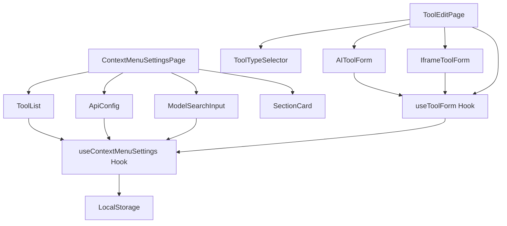
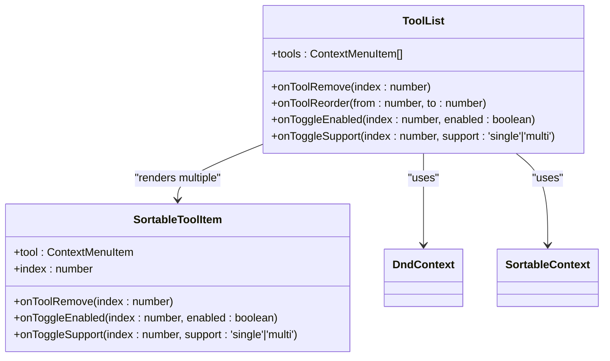
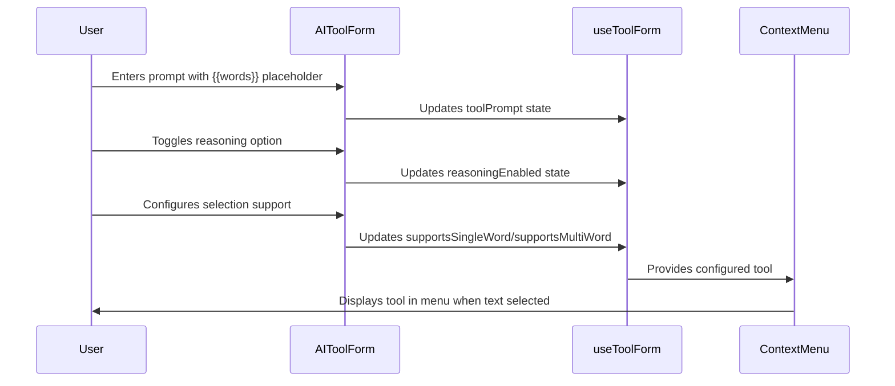
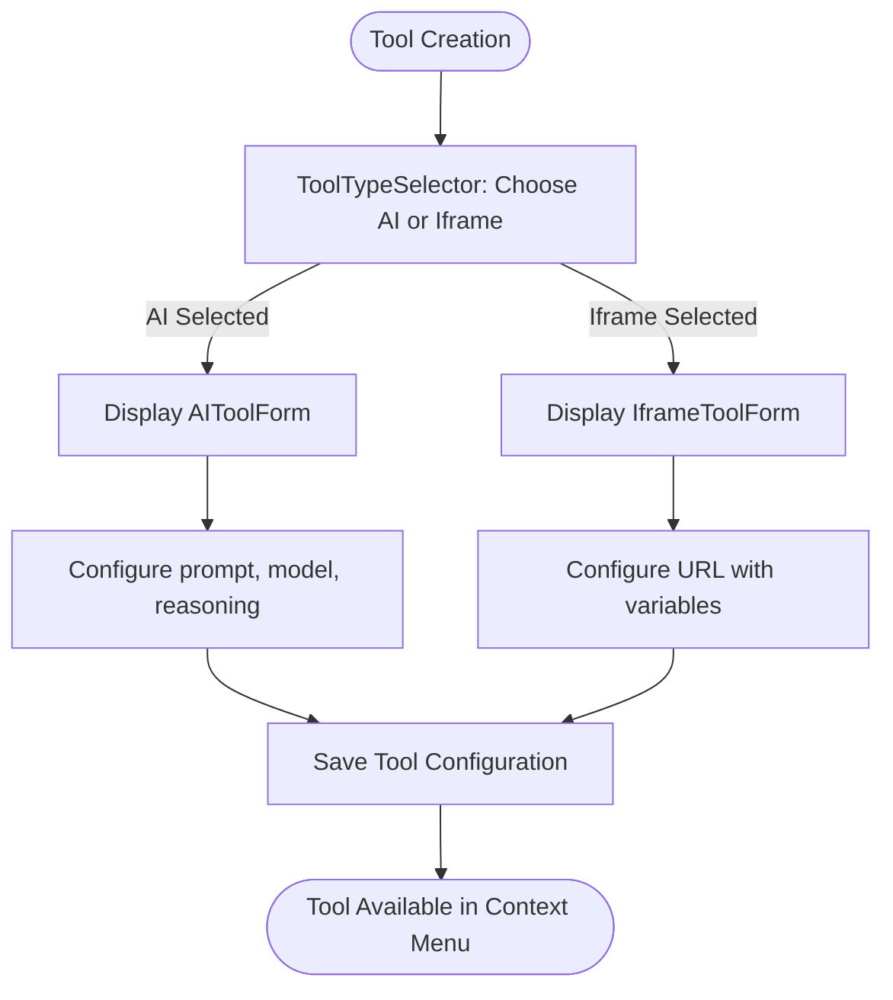
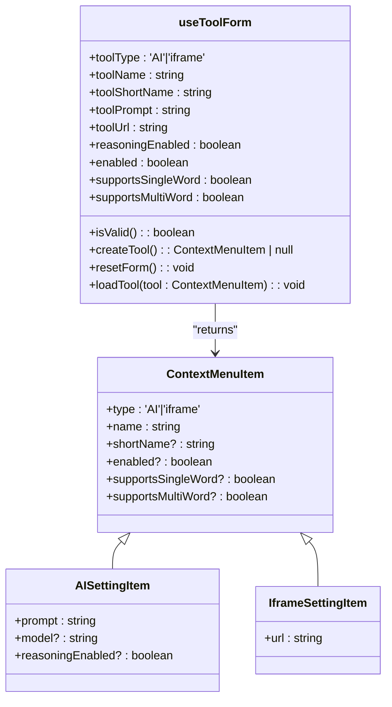

# Custom Tools Management

<cite>
**Referenced Files in This Document**   
- [ToolList.tsx](file://src/pages/ContextMenuSettingsPage/components/ToolList.tsx)
- [ToolForm.tsx](file://src/pages/ContextMenuSettingsPage/components/ToolForm.tsx)
- [AIToolForm.tsx](file://src/pages/ContextMenuSettingsPage/components/AIToolForm.tsx)
- [IframeToolForm.tsx](file://src/pages/ContextMenuSettingsPage/components/IframeToolForm.tsx)
- [ToolTypeSelector.tsx](file://src/pages/ContextMenuSettingsPage/components/ToolTypeSelector.tsx)
- [SectionCard.tsx](file://src/pages/ContextMenuSettingsPage/components/SectionCard.tsx)
- [useToolForm.ts](file://src/pages/ContextMenuSettingsPage/hooks/useToolForm.ts)
- [epub.ts](file://src/types/epub.ts)
- [ApiConfig.tsx](file://src/pages/ContextMenuSettingsPage/components/ApiConfig.tsx)
- [ModelSearchInput.tsx](file://src/pages/ContextMenuSettingsPage/components/ModelSearchInput.tsx)
- [aiProviders.ts](file://src/config/aiProviders.ts)
- [index.tsx](file://src/pages/ContextMenuSettingsPage/index.tsx)
- [ToolEditPage/index.tsx](file://src/pages/ToolEditPage/index.tsx)
</cite>

## Table of Contents
1. [Introduction](#introduction)
2. [Architecture Overview](#architecture-overview)
3. [Core Components](#core-components)
4. [Detailed Component Analysis](#detailed-component-analysis)
5. [Data Persistence and Validation](#data-persistence-and-validation)
6. [Security Considerations](#security-considerations)
7. [Troubleshooting Guide](#troubleshooting-guide)
8. [Conclusion](#conclusion)

## Introduction
The custom tools management system enables users to create AI-powered or iframe-based context menu actions within the EPUB reader application. This extensible architecture allows for personalized reading experiences by integrating external services and AI capabilities directly into the reading interface. The system supports two primary tool types: AI tools that leverage language models for text processing, and iframe tools that embed external web applications. This documentation provides comprehensive guidance on the system's architecture, component functionality, configuration workflows, and best practices for tool creation and management.

## Architecture Overview

**Diagram sources**
- [index.tsx](file://src/pages/ContextMenuSettingsPage/index.tsx)
- [ToolEditPage/index.tsx](file://src/pages/ToolEditPage/index.tsx)
- [useToolForm.ts](file://src/pages/ContextMenuSettingsPage/hooks/useToolForm.ts)
- [useContextMenuSettings.ts](file://src/pages/ContextMenuSettingsPage/hooks/useContextMenuSettings.ts)

**Section sources**
- [index.tsx](file://src/pages/ContextMenuSettingsPage/index.tsx)
- [ToolEditPage/index.tsx](file://src/pages/ToolEditPage/index.tsx)

## Core Components

The custom tools management system consists of several key components that work together to provide a flexible and user-friendly interface for tool configuration. The architecture follows a modular design pattern with clear separation of concerns, enabling extensibility while maintaining code maintainability. Central to the system is the `useToolForm` hook, which manages form state and validation logic across different tool types. The component hierarchy is organized to promote reusability, with specialized forms for AI and iframe tools inheriting common functionality from base components. Data persistence is handled through the `useContextMenuSettings` hook, which interfaces with LocalStorage to maintain user configurations between sessions.

**Section sources**
- [useToolForm.ts](file://src/pages/ContextMenuSettingsPage/hooks/useToolForm.ts)
- [epub.ts](file://src/types/epub.ts)
- [useContextMenuSettings.ts](file://src/pages/ContextMenuSettingsPage/hooks/useContextMenuSettings.ts)

## Detailed Component Analysis

### ToolList Component

The ToolList component provides a comprehensive interface for displaying and managing configured tools. It implements drag-and-drop functionality using the DndKit library, allowing users to reorder tools through both pointer and keyboard interactions. Each tool item displays its name, type indicator (AI or iframe), and configuration status for single-word and multi-word selection support. Users can enable/disable tools with a toggle switch, edit tool configurations through a dedicated link, and remove tools with a delete button. The component includes visual feedback for drag operations and hover states to enhance usability. When no tools are configured, it displays a helpful placeholder message to guide new users.

**Diagram sources**
- [ToolList.tsx](file://src/pages/ContextMenuSettingsPage/components/ToolList.tsx)

**Section sources**
- [ToolList.tsx](file://src/pages/ContextMenuSettingsPage/components/ToolList.tsx)

### ToolForm Base Component

The ToolForm component serves as a reusable base for creating and editing AI tools. It encapsulates common form elements such as the prompt input field and reasoning toggle, promoting code reuse across different tool creation interfaces. The component accepts a tool object and change handler as props, implementing a controlled component pattern for state management. It includes a ModelSearchInput component that enables users to select AI models from their provider's catalog, with support for both API-driven model discovery and manual entry. The form provides real-time validation feedback and maintains a clean, focused interface for configuring AI tool parameters.

**Section sources**
- [ToolForm.tsx](file://src/pages/ContextMenuSettingsPage/components/ToolForm.tsx)

### AIToolForm Component

The AIToolForm component specializes in configuring AI prompt templates with variable injection capabilities. It provides a dedicated interface for creating prompts that can incorporate selected text and contextual information using the `{{words}}` and `{{context}}` placeholders. The component includes comprehensive guidance on prompt construction, explaining how these variables will be replaced with actual content when the tool is executed. Users can enable reasoning functionality for supported models, which may enhance the AI's ability to provide more sophisticated responses. The form also manages selection support configuration, allowing users to specify whether the tool should be available for single-word or multi-word selections in the context menu.

**Diagram sources**
- [AIToolForm.tsx](file://src/pages/ContextMenuSettingsPage/components/AIToolForm.tsx)
- [useToolForm.ts](file://src/pages/ContextMenuSettingsPage/hooks/useToolForm.ts)

**Section sources**
- [AIToolForm.tsx](file://src/pages/ContextMenuSettingsPage/components/AIToolForm.tsx)

### IframeToolForm Component

The IframeToolForm component facilitates the integration of external web applications through iframe embedding. It provides a URL input field where users can specify the target web application, with support for the same variable injection system (`{{words}}` and `{{context}}`) as AI tools. This allows for dynamic URL construction based on the user's text selection. The component includes detailed examples and formatting guidance to help users construct proper URLs with query parameters. Like the AI tool form, it also manages selection support configuration, enabling users to control when the iframe tool appears in the context menu based on selection type.

**Section sources**
- [IframeToolForm.tsx](file://src/pages/ContextMenuSettingsPage/components/IframeToolForm.tsx)

### ToolTypeSelector Component

The ToolTypeSelector component enables users to switch between AI and iframe tool types during tool creation or editing. It presents a clear, visually distinct interface with two buttons representing the available tool types. The selected state is highlighted with a blue background, providing immediate visual feedback. This component plays a crucial role in the tool creation workflow by determining which specialized form (AIToolForm or IframeToolForm) should be displayed for configuration. Its simple design reduces cognitive load while maintaining clear functionality.

**Diagram sources**
- [ToolTypeSelector.tsx](file://src/pages/ContextMenuSettingsPage/components/ToolTypeSelector.tsx)

**Section sources**
- [ToolTypeSelector.tsx](file://src/pages/ContextMenuSettingsPage/components/ToolTypeSelector.tsx)

### SectionCard Component

The SectionCard component provides a consistent visual grouping mechanism for related settings and tools. It implements a card-based layout with a header section containing a title and optional description, a main content area with configurable background tint, and an optional footer section. The component supports status indicators in the header, allowing for the display of connection status or other relevant information. This consistent styling promotes a cohesive user experience across different sections of the settings interface while providing flexibility for various content types and layouts.

**Section sources**
- [SectionCard.tsx](file://src/pages/ContextMenuSettingsPage/components/SectionCard.tsx)

### useToolForm Hook

The useToolForm hook is a custom React hook that manages the state and validation logic for tool creation and editing forms. It centralizes the form state including tool type, name, prompt or URL, reasoning settings, and selection support options. The hook implements comprehensive validation rules to ensure that all required fields are properly configured before tool creation. It provides a createTool function that generates a properly formatted tool object based on the current form state, handling the differences between AI and iframe tool types. The hook also includes utility functions for loading existing tools into the form and resetting the form to its initial state.

**Diagram sources**
- [useToolForm.ts](file://src/pages/ContextMenuSettingsPage/hooks/useToolForm.ts)
- [epub.ts](file://src/types/epub.ts)

**Section sources**
- [useToolForm.ts](file://src/pages/ContextMenuSettingsPage/hooks/useToolForm.ts)

## Data Persistence and Validation

### LocalStorage Implementation

The custom tools management system persists user configurations in LocalStorage through the useContextMenuSettings hook. This hook provides a comprehensive interface for reading, updating, and saving context menu settings, including both AI provider configuration and the complete list of custom tools. Settings are stored as a structured object containing the API endpoint, authentication key, selected provider, default model, and the array of configured tools. The persistence mechanism includes error handling and fallback strategies to ensure data integrity, with validation performed before saving to prevent corruption of user settings.

**Section sources**
- [useContextMenuSettings.ts](file://src/pages/ContextMenuSettingsPage/hooks/useContextMenuSettings.ts)

### Validation Rules

The system implements a multi-layered validation approach to ensure tool configurations are complete and functional. At the form level, the useToolForm hook validates that required fields are populated and that at least one selection support option is enabled. For AI tools, the prompt field must contain content, while iframe tools require a valid URL. The system also validates API configuration, checking that both the endpoint URL and API key are provided before allowing connection tests. Additional validation occurs at the settings level, where the system verifies that a default model is selected if any AI tools are configured. These validation rules prevent common configuration errors and guide users toward successful tool setup.

**Section sources**
- [useToolForm.ts](file://src/pages/ContextMenuSettingsPage/hooks/useToolForm.ts)
- [ApiConfig.tsx](file://src/pages/ContextMenuSettingsPage/components/ApiConfig.tsx)

## Security Considerations

### User-Defined Tool Execution

The system implements several security measures for executing user-defined tools. For iframe tools, the application should implement proper sandboxing attributes to restrict the embedded content's capabilities and prevent malicious behavior. The variable injection system is designed to safely encode user-selected text before insertion into URLs or prompts, preventing injection attacks. For AI tools, the system should validate that API endpoints and keys are properly secured and not exposed to potential leakage. Additionally, the application should implement rate limiting and usage monitoring to prevent abuse of AI provider APIs through configured tools.

**Section sources**
- [IframeToolForm.tsx](file://src/pages/ContextMenuSettingsPage/components/IframeToolForm.tsx)
- [AIToolForm.tsx](file://src/pages/ContextMenuSettingsPage/components/AIToolForm.tsx)

## Troubleshooting Guide

### Common Issues and Solutions

When users encounter issues with custom tools, several common problems may arise. For broken iframe integrations, users should verify that the target website allows embedding via iframe (checking for X-Frame-Options headers) and that the URL is correctly formatted with proper protocol (https://). For malformed AI prompts, users should check that variable placeholders use the correct syntax (`{{words}}` and `{{context}}`) and that the prompt does not contain unescaped special characters. Connection issues with AI providers can often be resolved by verifying the API key and endpoint configuration, and testing the connection through the settings interface. If tools do not appear in the context menu, users should check that the tool is enabled and that the selection support settings match their selection type (single-word vs. multi-word).

**Section sources**
- [ApiConfig.tsx](file://src/pages/ContextMenuSettingsPage/components/ApiConfig.tsx)
- [AIToolForm.tsx](file://src/pages/ContextMenuSettingsPage/components/AIToolForm.tsx)
- [IframeToolForm.tsx](file://src/pages/ContextMenuSettingsPage/components/IframeToolForm.tsx)

## Conclusion

The custom tools management system provides a powerful and flexible framework for extending the EPUB reader's functionality through user-configured AI and web application integrations. By following the documented patterns and best practices, users can create personalized reading experiences that enhance comprehension and productivity. The system's modular architecture, comprehensive validation, and thoughtful user interface design make it accessible to users of varying technical backgrounds while providing the depth needed for sophisticated tool configurations. Future enhancements could include additional tool types, improved template suggestions, and enhanced security features for iframe integrations.