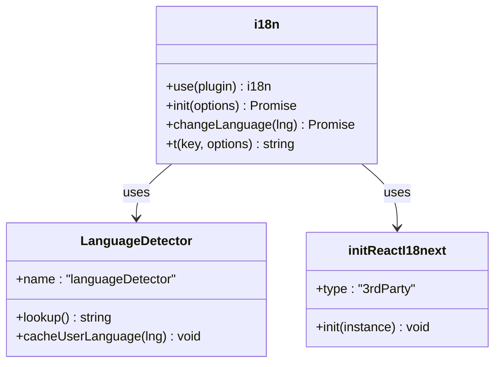
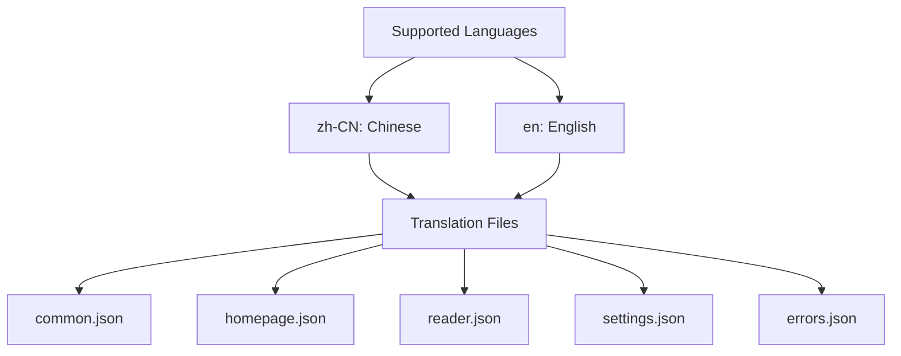
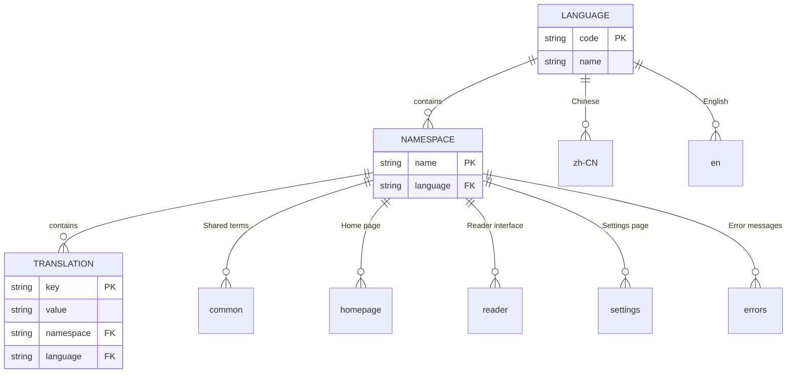
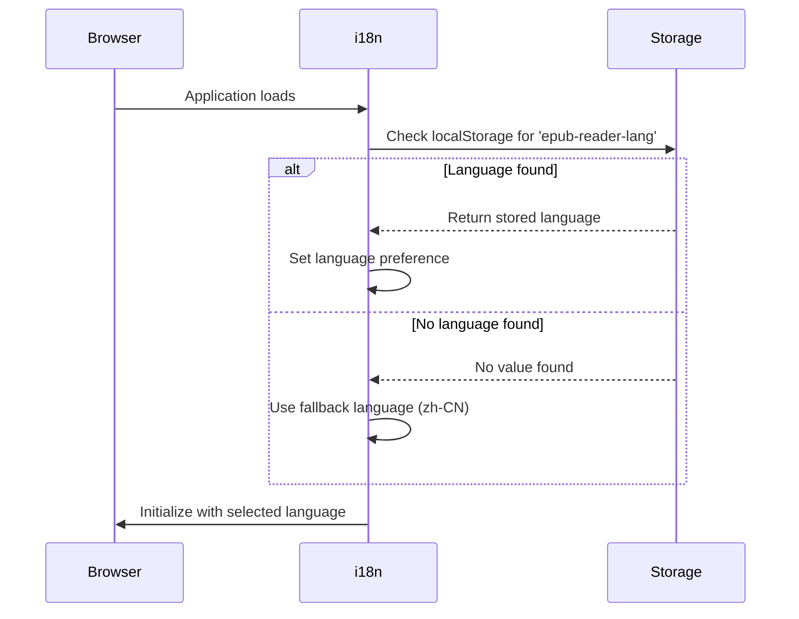
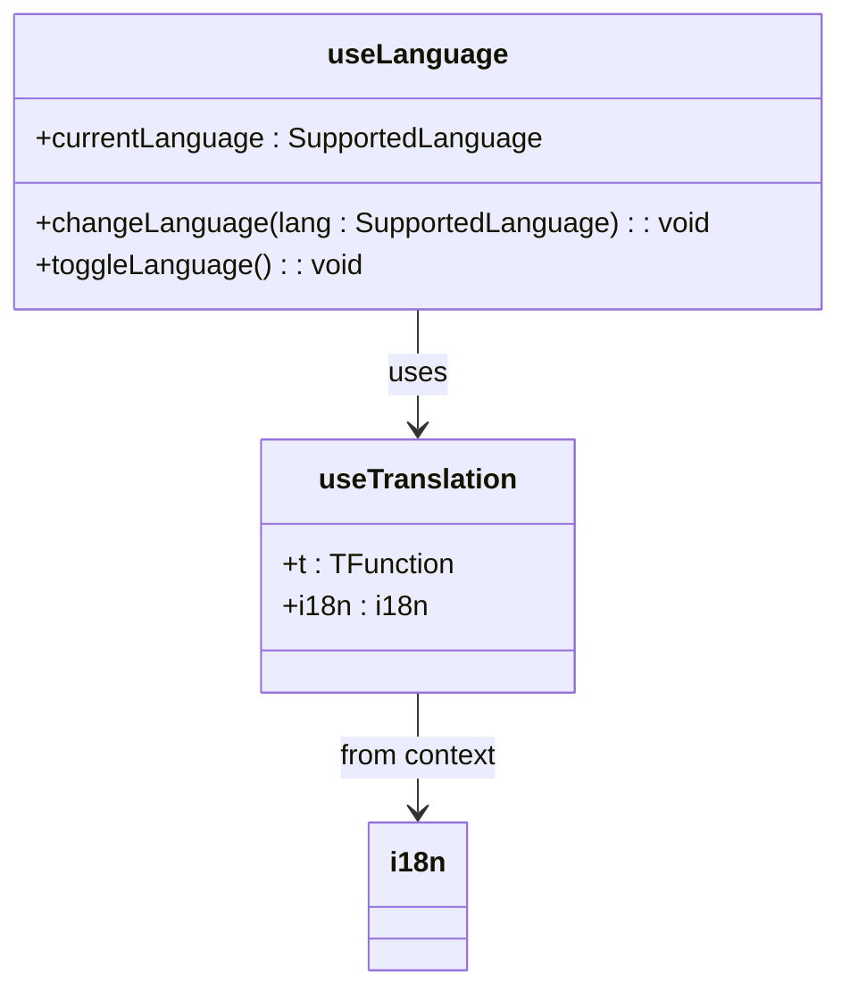
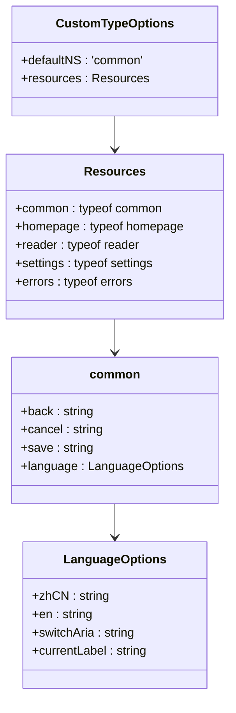
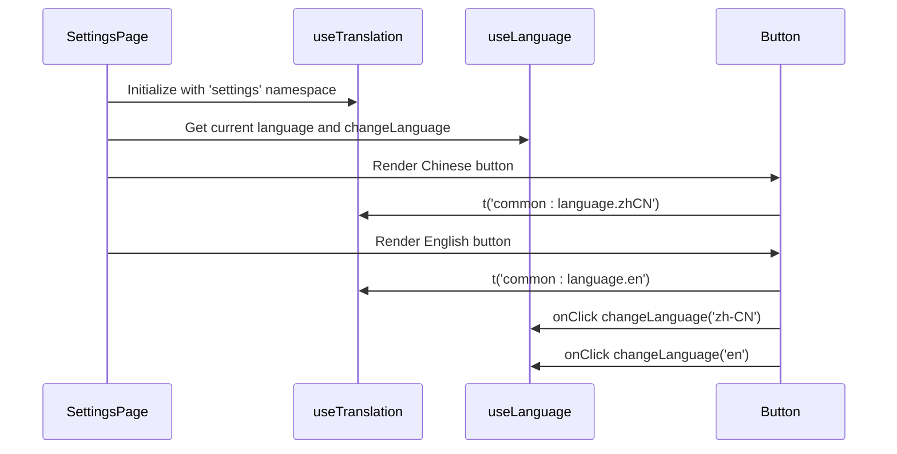
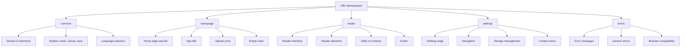

# Internationalization Support

<cite>
**Referenced Files in This Document**   
- [config.ts](file://src/i18n/config.ts)
- [useLanguage.ts](file://src/i18n/useLanguage.ts)
- [types.d.ts](file://src/i18n/types.d.ts)
- [LanguageSwitcher/index.tsx](file://src/components/LanguageSwitcher/index.tsx)
- [I18nSvg.tsx](file://src/components/I18nSvg.tsx)
- [locales/zh-CN/common.json](file://src/i18n/locales/zh-CN/common.json)
- [locales/en/common.json](file://src/i18n/locales/en/common.json)
- [locales/zh-CN/homepage.json](file://src/i18n/locales/zh-CN/homepage.json)
- [locales/en/homepage.json](file://src/i18n/locales/en/homepage.json)
- [locales/zh-CN/reader.json](file://src/i18n/locales/zh-CN/reader.json)
- [locales/en/reader.json](file://src/i18n/locales/en/reader.json)
- [locales/zh-CN/settings.json](file://src/i18n/locales/zh-CN/settings.json)
- [locales/en/settings.json](file://src/i18n/locales/en/settings.json)
- [locales/zh-CN/errors.json](file://src/i18n/locales/zh-CN/errors.json)
- [locales/en/errors.json](file://src/i18n/locales/en/errors.json)
- [SettingsPage/index.tsx](file://src/pages/SettingsPage/index.tsx)
</cite>

## Table of Contents
1. [Introduction](#introduction)
2. [Internationalization Configuration](#internationalization-configuration)
3. [Supported Languages](#supported-languages)
4. [Translation Resources](#translation-resources)
5. [Language Detection and Persistence](#language-detection-and-persistence)
6. [Language Switching Mechanism](#language-switching-mechanism)
7. [Language Switcher Component](#language-switcher-component)
8. [Type Safety and Validation](#type-safety-and-validation)
9. [Usage in Components](#usage-in-components)
10. [Namespace Organization](#namespace-organization)

## Introduction
The application implements a comprehensive internationalization (i18n) system using i18next with react-i18next for React integration. This system supports multiple languages with a focus on Chinese (zh-CN) and English (en), providing users with the ability to switch between languages and persist their preference across sessions. The implementation includes type safety, language detection, and a user-friendly language switching interface.

## Internationalization Configuration
The i18n configuration is centralized in the `config.ts` file within the `src/i18n` directory. This configuration initializes the i18next instance with the necessary plugins and settings for browser-based language detection and React integration.



**Diagram sources**
- [config.ts](file://src/i18n/config.ts#L1-L52)

**Section sources**
- [config.ts](file://src/i18n/config.ts#L1-L52)

## Supported Languages
The application currently supports two languages: Chinese (zh-CN) and English (en). These languages are explicitly defined in the type system and used throughout the application to ensure consistency and type safety.



**Diagram sources**
- [useLanguage.ts](file://src/i18n/useLanguage.ts#L4)
- [config.ts](file://src/i18n/config.ts#L17-L32)

**Section sources**
- [useLanguage.ts](file://src/i18n/useLanguage.ts#L4)
- [config.ts](file://src/i18n/config.ts#L17-L32)

## Translation Resources
The application organizes translation resources by language and domain, with separate JSON files for different functional areas. This modular approach allows for better organization and easier maintenance of translation content.



**Diagram sources**
- [config.ts](file://src/i18n/config.ts#L5-L32)
- [locales/](file://src/i18n/locales/)

**Section sources**
- [config.ts](file://src/i18n/config.ts#L5-L32)
- [locales/zh-CN/common.json](file://src/i18n/locales/zh-CN/common.json)
- [locales/en/common.json](file://src/i18n/locales/en/common.json)
- [locales/zh-CN/homepage.json](file://src/i18n/locales/zh-CN/homepage.json)
- [locales/en/homepage.json](file://src/i18n/locales/en/homepage.json)
- [locales/zh-CN/reader.json](file://src/i18n/locales/zh-CN/reader.json)
- [locales/en/reader.json](file://src/i18n/locales/en/reader.json)
- [locales/zh-CN/settings.json](file://src/i18n/locales/zh-CN/settings.json)
- [locales/en/settings.json](file://src/i18n/locales/en/settings.json)
- [locales/zh-CN/errors.json](file://src/i18n/locales/zh-CN/errors.json)
- [locales/en/errors.json](file://src/i18n/locales/en/errors.json)

## Language Detection and Persistence
The application uses localStorage as the primary method for detecting and persisting the user's language preference. When a user visits the application, it checks localStorage for a previously set language before falling back to the default language.



**Diagram sources**
- [config.ts](file://src/i18n/config.ts#L45-L49)

**Section sources**
- [config.ts](file://src/i18n/config.ts#L45-L49)

## Language Switching Mechanism
The language switching functionality is encapsulated in the `useLanguage` custom hook, which provides a clean API for components to access and modify the current language setting. This hook normalizes language codes and provides convenience functions for changing and toggling languages.



**Diagram sources**
- [useLanguage.ts](file://src/i18n/useLanguage.ts#L6-L29)

**Section sources**
- [useLanguage.ts](file://src/i18n/useLanguage.ts#L6-L29)

## Language Switcher Component
The LanguageSwitcher component provides a user interface element for switching between available languages. It displays the current language and toggles between languages when clicked, using an SVG icon for visual representation.

```mermaid
flowchart TD
A[LanguageSwitcher] --> B[useTranslation]
A --> C[useLanguage]
B --> D[t('common:language.switchAria')]
B --> E[t('common:language.currentLabel')]
C --> F[currentLanguage]
C --> G[toggleLanguage]
A --> H[I18nSvg]
H --> I[SVG Icon]
click A "toggleLanguage" "Toggle language"
click H "toggleLanguage" "Toggle language"
```

**Diagram sources**
- [LanguageSwitcher/index.tsx](file://src/components/LanguageSwitcher/index.tsx#L1-L29)
- [I18nSvg.tsx](file://src/components/I18nSvg.tsx#L1-L24)

**Section sources**
- [LanguageSwitcher/index.tsx](file://src/components/LanguageSwitcher/index.tsx#L1-L29)
- [I18nSvg.tsx](file://src/components/I18nSvg.tsx#L1-L24)

## Type Safety and Validation
The application implements strong type safety for internationalization through TypeScript declaration merging. This ensures that translation keys are validated at compile time and provides autocompletion for translation functions.



**Diagram sources**
- [types.d.ts](file://src/i18n/types.d.ts#L8-L19)

**Section sources**
- [types.d.ts](file://src/i18n/types.d.ts#L8-L19)

## Usage in Components
The internationalization system is integrated throughout the application's components, with the SettingsPage providing a more comprehensive language selection interface that allows users to explicitly choose their preferred language rather than simply toggling between options.



**Diagram sources**
- [SettingsPage/index.tsx](file://src/pages/SettingsPage/index.tsx#L5-L43)

**Section sources**
- [SettingsPage/index.tsx](file://src/pages/SettingsPage/index.tsx#L5-L43)

## Namespace Organization
The application organizes translations into multiple namespaces to separate concerns and improve maintainability. Each namespace corresponds to a specific functional area of the application, allowing for targeted loading and better code organization.



**Diagram sources**
- [config.ts](file://src/i18n/config.ts#L41)
- [locales/](file://src/i18n/locales/)

**Section sources**
- [config.ts](file://src/i18n/config.ts#L41)
- [locales/](file://src/i18n/locales/)