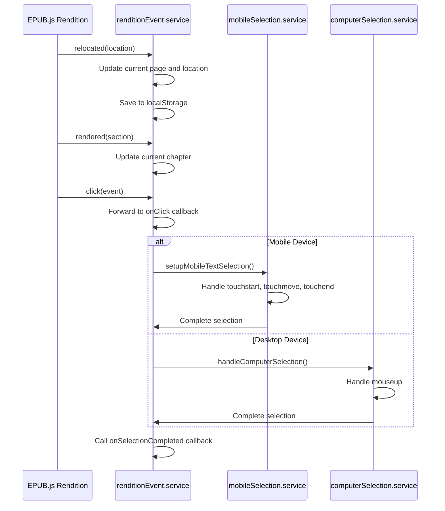
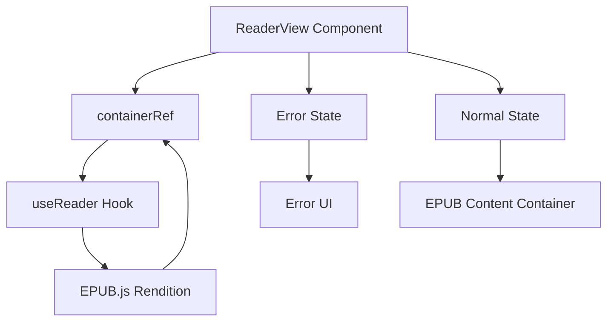

# EPUB Rendering System

<cite>
**Referenced Files in This Document**   
- [useEpubReader.ts](file://src/pages/EpubReader/hooks/useEpubReader.ts)
- [renditionEvent.service.ts](file://src/pages/EpubReader/services/renditionEvent.service.ts)
- [EPUBMetadataService.ts](file://src/services/EPUBMetadataService.ts)
- [ReaderView.tsx](file://src/pages/EpubReader/components/ReaderView.tsx)
- [epub.ts](file://src/constants/epub.ts)
- [mobileSelection.service.ts](file://src/pages/EpubReader/services/mobileSelection.service.ts)
- [computerSelection.service.ts](file://src/pages/EpubReader/services/computerSelection.service.ts)
- [selection.service.ts](file://src/pages/EpubReader/services/selection.service.ts)
- [style.util.ts](file://src/pages/EpubReader/utils/style.util.ts)
- [epub.utils.ts](file://src/pages/EpubReader/hooks/epub.utils.ts)
</cite>

## Table of Contents
1. [EPUB Reader Initialization](#epub-reader-initialization)
2. [Navigation System](#navigation-system)
3. [Reading Progress Tracking](#reading-progress-tracking)
4. [EPUB.js Event Handling](#epubjs-event-handling)
5. [Metadata Extraction Process](#metadata-extraction-process)
6. [Rendering Configuration](#rendering-configuration)
7. [ReaderView Component Integration](#readerview-component-integration)
8. [Performance Considerations](#performance-considerations)
9. [Troubleshooting Common Issues](#troubleshooting-common-issues)

## EPUB Reader Initialization

The EPUB reader initialization process begins with the `useReader` custom hook, which serves as the central controller for the EPUB rendering pipeline. This hook receives a Book instance from EPUB.js and initializes the rendition object by calling the `renderTo` method on the book, targeting a container element referenced by `containerRef`. The initialization process first checks if the container reference exists before proceeding with rendition creation.

During initialization, the hook establishes the rendering configuration by calling `createRenditionConfig`, which pulls settings from the `RENDERING_CONFIG` constants. After creating the rendition, the hook immediately sets up event listeners through the `setupRenditionEvents` function, passing the rendition instance, book object, and callback functions for handling user interactions. The initialization sequence also includes generating location data for the book by calling `book.locations.generate()` with the configured character count threshold, which enables page counting and progress tracking.

A key aspect of initialization is the restoration of the user's reading position. The hook retrieves the last reading location from local storage using the `latestReadingLocation` storage manager, which is keyed by book ID. If a previous reading position exists, the rendition displays the content at that CFI (Canonical Fragment Identifier) location, providing a seamless reading experience across sessions.

**Section sources**
- [useEpubReader.ts](file://src/pages/EpubReader/hooks/useEpubReader.ts#L96-L187)

## Navigation System

The navigation system in the EPUB reader provides both programmatic and user-driven methods for moving through the book content. The system is implemented through the `createNavigationFunctions` function within the `useReader` hook, which returns three primary navigation methods: `goToNext`, `goToPrev`, and `goToSelectChapter`. These functions are exposed through the hook's return value and can be used by UI components to control the reading experience.

The `goToNext` and `goToPrev` functions handle pagination through the book, with built-in boundary checking to prevent navigation beyond the start or end of the book. When attempting to navigate past these boundaries, the functions log appropriate messages and return early without calling the EPUB.js rendition methods. This prevents errors and provides feedback to users when they reach the limits of the book.

Chapter-based navigation is handled by the `goToSelectChapter` function, which takes a chapter href as a parameter and calls the rendition's `display` method with that href. This allows for direct navigation to specific chapters from the table of contents or other navigation interfaces. The navigation system is also integrated with keyboard controls through the `useKeyboardNavigation` hook, which binds the navigation functions to keyboard events, enabling keyboard-based page turning.

**Section sources**
- [useEpubReader.ts](file://src/pages/EpubReader/hooks/useEpubReader.ts#L72-L89)
- [useEpubReader.ts](file://src/pages/EpubReader/hooks/useEpubReader.ts#L178-L180)

## Reading Progress Tracking

The reading progress tracking system monitors the user's position within the book and provides both page-level and percentage-based progress indicators. This tracking is primarily driven by the 'relocated' event from EPUB.js, which fires whenever the user navigates to a new position in the book. The event handler, implemented in the `setupRenditionEvents` function, receives the new location object and updates multiple state variables accordingly.

The progress tracking system calculates the current page number by converting the CFI (Canonical Fragment Identifier) position to a percentage of the book's total length, then mapping that percentage to a page number. This calculation uses the book's locations object, which contains the generated location data from the initialization phase. The current page number is updated through the `setCurrentPage` callback passed to the event setup function.

In addition to page tracking, the system maintains the current chapter href by listening to the 'rendered' event, which fires when a new section (chapter) is displayed. The event handler uses the book's navigation object to look up the current section by its href and updates the `currentChapterHref` state accordingly. All progress information is persisted to local storage through the `latestReadingLocation` storage manager, ensuring that users can resume reading from their last position even after closing the application.

**Section sources**
- [renditionEvent.service.ts](file://src/pages/EpubReader/services/renditionEvent.service.ts#L31-L40)
- [renditionEvent.service.ts](file://src/pages/EpubReader/services/renditionEvent.service.ts#L43-L48)

## EPUB.js Event Handling

The EPUB.js event handling system is centralized in the `renditionEvent.service.ts` file, which exports the `setupRenditionEvents` function responsible for configuring all event listeners on the rendition object. This service acts as the bridge between EPUB.js events and the application's state management, translating low-level events into meaningful application state changes.

The service handles two primary types of events: location events and user interaction events. Location events include 'relocated' (when the user navigates to a new position) and 'rendered' (when a new section is displayed), both of which update the reader's state regarding current position and chapter. The service also handles user interaction events like clicks and selections, routing them to appropriate callback functions.

A key feature of the event handling system is its device-aware selection handling. The service detects whether the user is on a mobile device using the `isMobileDevice` function, which checks the user agent string. Based on this detection, it routes selection events to either the mobile or desktop selection handling system. For mobile devices, it calls `setupMobileTextSelection`, which implements touch-based selection with long-press detection. For desktop devices, it sets up mouse-based selection through the `handleComputerSelection` function.

**Diagram sources**
- [renditionEvent.service.ts](file://src/pages/EpubReader/services/renditionEvent.service.ts#L29-L59)
- [mobileSelection.service.ts](file://src/pages/EpubReader/services/mobileSelection.service.ts#L16-L101)
- [computerSelection.service.ts](file://src/pages/EpubReader/services/computerSelection.service.ts#L6-L19)

**Section sources**
- [renditionEvent.service.ts](file://src/pages/EpubReader/services/renditionEvent.service.ts#L29-L59)

## Metadata Extraction Process

The metadata extraction process is handled by the `EPUBMetadataService.ts` file, which exports the `extractMetadata` function responsible for parsing EPUB files and extracting relevant book information. This process begins with input validation, where the function first checks if the provided file is a valid EPUB using the `getEpubValidationError` utility. If validation fails, the function returns early with an error.

Once validation passes, the process converts the file to an ArrayBuffer and creates a new EPUB.js Book instance. The core metadata extraction occurs through asynchronous operations on this book instance, retrieving data from the book's loaded metadata, cover, and spine properties. The extracted metadata includes essential book information such as title, author, description, publisher, publication date, language, ISBN, chapter count, and cover path.

The service implements robust error handling through the `performFileOperation` utility, which wraps the entire extraction process in a try-catch block with consistent logging. If metadata extraction fails for any reason, the service returns fallback metadata with the filename as the title and "Unknown Author" as the author, ensuring that the application can still display basic information about the book. The extracted metadata is structured according to the `EPUBMetaData` type definition, providing a consistent interface for other components to consume.

**Section sources**
- [EPUBMetadataService.ts](file://src/services/EPUBMetadataService.ts#L11-L63)

## Rendering Configuration

The rendering configuration for the EPUB reader is defined in the `epub.ts` constants file, which exports the `RENDERING_CONFIG` object containing all parameters that control how EPUB content is displayed. This configuration is injected into the rendition creation process through the `createRenditionConfig` function in the `useReader` hook.

Key configuration parameters include:
- **Width and Height**: Set to '100%' to make the rendition fill its container
- **Spread**: Configured to 'always' to display pages in a two-up layout when possible
- **Min Spread Width**: Set to 800 pixels, determining when the spread layout should be used
- **Manager**: Set to 'continuous' for smooth scrolling between pages
- **Flow**: Set to 'paginated' to maintain traditional page-based navigation
- **Location Char Count**: Set to 1600 characters, determining the granularity of location tracking

The configuration also includes additional constants for touch interactions, selection styling, and file validation. The `TOUCH_TIMING` constants control the behavior of mobile selection with parameters for long press duration, tap threshold, and selection delay. The `SELECTION_COLORS` constants define the visual appearance of selected text, using a semi-transparent blue background. These configuration values are designed to provide an optimal reading experience across different devices and book types.

**Section sources**
- [epub.ts](file://src/constants/epub.ts#L53-L61)
- [useEpubReader.ts](file://src/pages/EpubReader/hooks/useEpubReader.ts#L58-L66)

## ReaderView Component Integration

The ReaderView component serves as the visual container for the EPUB rendering process, integrating directly with the EPUB.js rendition object through the container reference passed from the `useReader` hook. This component is a simple but crucial part of the rendering pipeline, providing the DOM element where EPUB.js will inject the book content.

The component accepts two props: an error state and the container reference. When an error is present, it displays a user-friendly error message with a "Go Back" button that navigates to the previous page in the browser history. This error state is typically set by parent components when book loading fails.

In the normal rendering state, the component creates a full-height container with a white background and attaches the container reference to a div element. This div serves as the target for EPUB.js's `renderTo` method, which will populate it with the book content, including an iframe for each rendered section. The component also includes an overlay div that can be used for interaction elements like selection menus or tooltips, though it is initially set to `pointer-events-none` to allow interactions to pass through to the EPUB content.

The integration between ReaderView and the EPUB.js rendition is indirect but essential: the `useReader` hook creates the rendition and attaches it to the same container reference that ReaderView provides. This separation of concerns allows the rendering logic to be managed by the hook while the visual presentation is handled by the component.

**Diagram sources**
- [ReaderView.tsx](file://src/pages/EpubReader/components/ReaderView.tsx#L7-L50)
- [useEpubReader.ts](file://src/pages/EpubReader/hooks/useEpubReader.ts#L149-L150)

**Section sources**
- [ReaderView.tsx](file://src/pages/EpubReader/components/ReaderView.tsx#L7-L50)

## Performance Considerations

The EPUB rendering system incorporates several performance optimizations to handle large EPUB files efficiently and manage memory usage effectively. The primary performance consideration is the generation of location data, which can be resource-intensive for large books. The system addresses this by using a configurable `LOCATION_CHAR_COUNT` parameter (set to 1600 characters) that determines the granularity of location tracking. A higher value reduces the number of location points generated, improving performance at the cost of slightly less precise progress tracking.

Memory management is handled through several mechanisms. The rendition object is stored in a ref within the `useReader` hook, preventing unnecessary re-creation during component re-renders. Event listeners are properly cleaned up when components unmount, preventing memory leaks. The system also leverages EPUB.js's built-in pagination and lazy loading, which only renders visible content and unloads content that is far from the current reading position.

For large books, the system uses the `debounce` function to throttle selection events, preventing excessive processing when users make rapid selections. The `onSelectionCompletedDebounced` function in the `useReader` hook delays the processing of selection events by 200 milliseconds, ensuring that only the final selection in a rapid sequence is processed. This optimization is particularly important for mobile devices with limited processing power.

The rendering configuration also contributes to performance by using the 'continuous' manager and 'paginated' flow, which balance smooth scrolling with efficient memory usage. The spread configuration adapts to screen size, using single-page view on smaller screens to reduce the rendering load. These performance considerations ensure that the reader can handle books of various sizes while maintaining a responsive user interface.

**Section sources**
- [useEpubReader.ts](file://src/pages/EpubReader/hooks/useEpubReader.ts#L126-L135)
- [epub.ts](file://src/constants/epub.ts#L60-L61)

## Troubleshooting Common Issues

### Font Loading Failures
Font loading issues can occur when EPUB files contain custom fonts that fail to load due to CORS restrictions or invalid font formats. To troubleshoot:
1. Check browser developer tools for CORS errors in the network tab
2. Verify that the EPUB file contains valid font files in supported formats (WOFF, TTF, OTF)
3. Ensure the EPUB's CSS properly references font files with correct paths
4. Consider implementing a font loading fallback mechanism in the rendering configuration

### Incorrect Pagination
Pagination issues may manifest as inconsistent page breaks or incorrect page counts. To address:
1. Verify the `LOCATION_CHAR_COUNT` configuration is appropriate for the content (default: 1600)
2. Check that the EPUB file has proper semantic markup (paragraphs, headings, etc.)
3. Ensure the rendition's `flow` is set to 'paginated' rather than 'scrolled'
4. Validate that the book's spine and manifest are correctly structured

### Selection Issues on Mobile
Mobile text selection problems often relate to touch event handling. To resolve:
1. Verify that `applyMobileStyles` is being called to enable text selection
2. Check that touch event listeners are properly attached to the document
3. Ensure the `TOUCH_TIMING` constants are appropriately configured for the device
4. Validate that the `createCaretRange` function can properly determine caret positions

### Memory Usage with Large Files
For performance issues with large EPUB files:
1. Increase the `LOCATION_CHAR_COUNT` to reduce location data generation
2. Monitor memory usage in browser developer tools
3. Ensure event listeners are properly cleaned up
4. Consider implementing virtualization for extremely large books

**Section sources**
- [mobileSelection.service.ts](file://src/pages/EpubReader/services/mobileSelection.service.ts#L8-L101)
- [style.util.ts](file://src/pages/EpubReader/utils/style.util.ts#L8-L41)
- [epub.ts](file://src/constants/epub.ts#L53-L61)