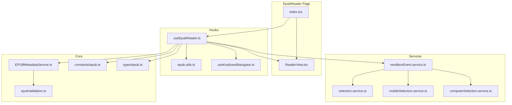
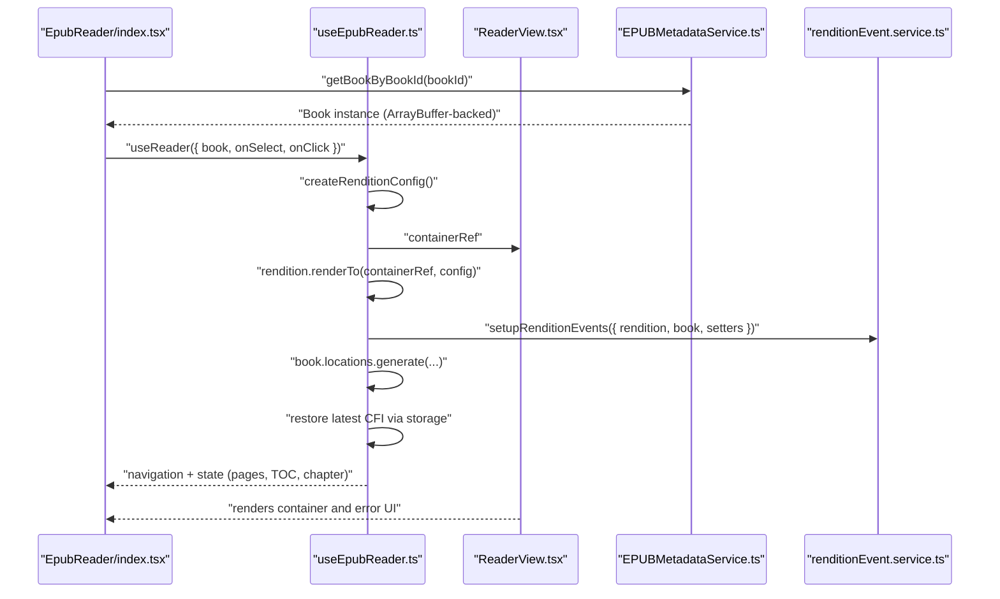
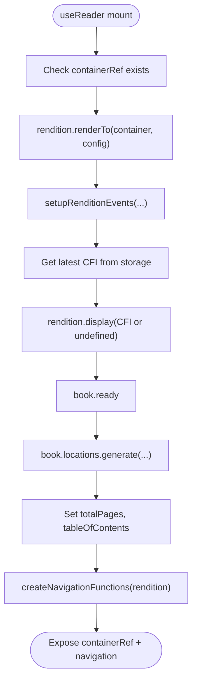
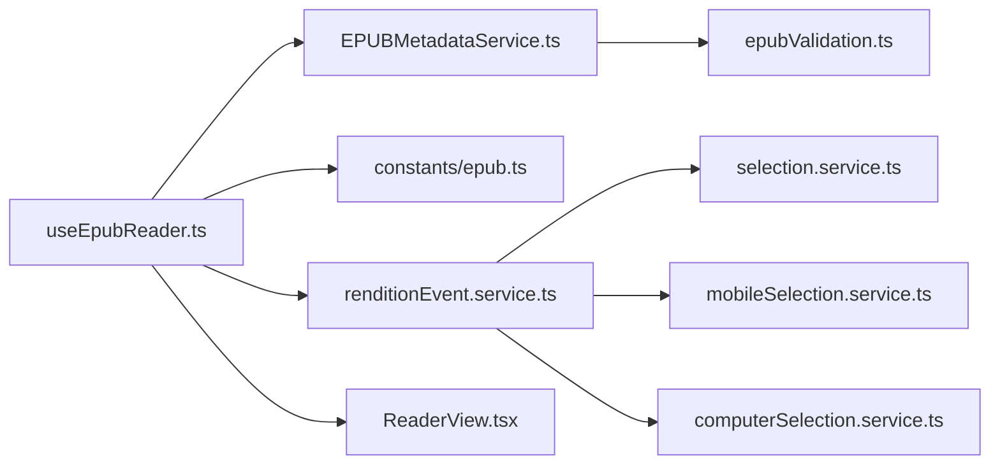

# EPUB.js Integration

<cite>
**Referenced Files in This Document**
- [useEpubReader.ts](file://src/pages/EpubReader/hooks/useEpubReader.ts)
- [ReaderView.tsx](file://src/pages/EpubReader/components/ReaderView.tsx)
- [epub.ts](file://src/constants/epub.ts)
- [epub.ts](file://src/types/epub.ts)
- [renditionEvent.service.ts](file://src/pages/EpubReader/services/renditionEvent.service.ts)
- [epub.utils.ts](file://src/pages/EpubReader/hooks/epub.utils.ts)
- [EPUBMetadataService.ts](file://src/services/EPUBMetadataService.ts)
- [index.tsx](file://src/pages/EpubReader/index.tsx)
- [epubValidation.ts](file://src/utils/epubValidation.ts)
- [selection.service.ts](file://src/pages/EpubReader/services/selection.service.ts)
- [mobileSelection.service.ts](file://src/pages/EpubReader/services/mobileSelection.service.ts)
- [computerSelection.service.ts](file://src/pages/EpubReader/services/computerSelection.service.ts)
- [useKeyboardNavigator.ts](file://src/pages/EpubReader/hooks/useKeyboardNavigator.ts)
</cite>

## Table of Contents
1. [Introduction](#introduction)
2. [Project Structure](#project-structure)
3. [Core Components](#core-components)
4. [Architecture Overview](#architecture-overview)
5. [Detailed Component Analysis](#detailed-component-analysis)
6. [Dependency Analysis](#dependency-analysis)
7. [Performance Considerations](#performance-considerations)
8. [Troubleshooting Guide](#troubleshooting-guide)
9. [Conclusion](#conclusion)

## Introduction
This document explains how the application integrates EPUB.js to render EPUB books in the browser. It focuses on the useEpubReader hook that initializes the EPUB rendition, sets up configuration options (width, height, spread, flow, manager), renders the book into the DOM via ReaderView, and restores the reading location using Canonical Fragment Identifiers (CFI). It also covers event binding for navigation, selection, and clicks, as well as error handling and performance considerations for large EPUBs.

## Project Structure
The EPUB.js integration is centered around the EpubReader page and its associated hooks and services. The key files are organized as follows:
- Hook that orchestrates rendering and state: useEpubReader.ts
- Reader view container: ReaderView.tsx
- Rendering configuration constants: constants/epub.ts
- Types for EPUB-related structures: types/epub.ts
- Event setup for rendition: services/renditionEvent.service.ts
- Utilities for storage and selection: hooks/epub.utils.ts, services/selection.service.ts, services/mobileSelection.service.ts, services/computerSelection.service.ts
- Book creation from ArrayBuffer: services/EPUBMetadataService.ts
- Validation utilities: utils/epubValidation.ts
- Keyboard navigation: hooks/useKeyboardNavigator.ts
- Top-level reader page: pages/EpubReader/index.tsx

**Diagram sources**
- [index.tsx](file://src/pages/EpubReader/index.tsx#L1-L403)
- [ReaderView.tsx](file://src/pages/EpubReader/components/ReaderView.tsx#L1-L51)
- [useEpubReader.ts](file://src/pages/EpubReader/hooks/useEpubReader.ts#L1-L201)
- [renditionEvent.service.ts](file://src/pages/EpubReader/services/renditionEvent.service.ts#L1-L60)
- [epub.utils.ts](file://src/pages/EpubReader/hooks/epub.utils.ts#L1-L33)
- [EPUBMetadataService.ts](file://src/services/EPUBMetadataService.ts#L1-L177)
- [epub.ts](file://src/constants/epub.ts#L1-L61)
- [epub.ts](file://src/types/epub.ts#L1-L135)
- [epubValidation.ts](file://src/utils/epubValidation.ts#L1-L77)
- [selection.service.ts](file://src/pages/EpubReader/services/selection.service.ts#L1-L169)
- [mobileSelection.service.ts](file://src/pages/EpubReader/services/mobileSelection.service.ts#L1-L231)
- [computerSelection.service.ts](file://src/pages/EpubReader/services/computerSelection.service.ts#L1-L19)
- [useKeyboardNavigator.ts](file://src/pages/EpubReader/hooks/useKeyboardNavigator.ts#L1-L48)

**Section sources**
- [index.tsx](file://src/pages/EpubReader/index.tsx#L1-L403)
- [useEpubReader.ts](file://src/pages/EpubReader/hooks/useEpubReader.ts#L1-L201)
- [ReaderView.tsx](file://src/pages/EpubReader/components/ReaderView.tsx#L1-L51)
- [renditionEvent.service.ts](file://src/pages/EpubReader/services/renditionEvent.service.ts#L1-L60)
- [EPUBMetadataService.ts](file://src/services/EPUBMetadataService.ts#L1-L177)
- [epub.ts](file://src/constants/epub.ts#L1-L61)
- [epubValidation.ts](file://src/utils/epubValidation.ts#L1-L77)
- [selection.service.ts](file://src/pages/EpubReader/services/selection.service.ts#L1-L169)
- [mobileSelection.service.ts](file://src/pages/EpubReader/services/mobileSelection.service.ts#L1-L231)
- [computerSelection.service.ts](file://src/pages/EpubReader/services/computerSelection.service.ts#L1-L19)
- [useKeyboardNavigator.ts](file://src/pages/EpubReader/hooks/useKeyboardNavigator.ts#L1-L48)

## Core Components
- useReader hook: Initializes the EPUB rendition, binds events, restores reading location via CFI, and exposes navigation and state.
- ReaderView component: Renders the container where EPUB.js will render the book and displays an error state if needed.
- EPUBMetadataService: Creates a Book instance from an ArrayBuffer and extracts metadata.
- renditionEvent.service: Sets up relocated/rendered/click events and selection handling for desktop and mobile.
- epub.utils: Provides a storage manager for persisting the latest reading location (CFI) and helper utilities.
- constants/epub: Defines rendering configuration (width, height, spread, flow, manager, location character count).
- types/epub: Declares types for TOC items, selection info, and extended rendition interfaces.
- selection.service, mobileSelection.service, computerSelection.service: Implement robust text selection extraction and device-specific handling.
- useKeyboardNavigator: Adds keyboard navigation (arrow keys and volume keys on mobile).
- epubValidation: Validates EPUB file inputs.

**Section sources**
- [useEpubReader.ts](file://src/pages/EpubReader/hooks/useEpubReader.ts#L1-L201)
- [ReaderView.tsx](file://src/pages/EpubReader/components/ReaderView.tsx#L1-L51)
- [EPUBMetadataService.ts](file://src/services/EPUBMetadataService.ts#L1-L177)
- [renditionEvent.service.ts](file://src/pages/EpubReader/services/renditionEvent.service.ts#L1-L60)
- [epub.utils.ts](file://src/pages/EpubReader/hooks/epub.utils.ts#L1-L33)
- [epub.ts](file://src/constants/epub.ts#L1-L61)
- [epub.ts](file://src/types/epub.ts#L1-L135)
- [selection.service.ts](file://src/pages/EpubReader/services/selection.service.ts#L1-L169)
- [mobileSelection.service.ts](file://src/pages/EpubReader/services/mobileSelection.service.ts#L1-L231)
- [computerSelection.service.ts](file://src/pages/EpubReader/services/computerSelection.service.ts#L1-L19)
- [useKeyboardNavigator.ts](file://src/pages/EpubReader/hooks/useKeyboardNavigator.ts#L1-L48)
- [epubValidation.ts](file://src/utils/epubValidation.ts#L1-L77)

## Architecture Overview
The reader pipeline starts from the EpubReader page, which loads a Book instance from storage, passes it to the useReader hook, and renders the container. The hook configures EPUB.js, binds events, and restores the last reading location. The ReaderView component provides the DOM container and error UI.

**Diagram sources**
- [index.tsx](file://src/pages/EpubReader/index.tsx#L1-L403)
- [useEpubReader.ts](file://src/pages/EpubReader/hooks/useEpubReader.ts#L1-L201)
- [ReaderView.tsx](file://src/pages/EpubReader/components/ReaderView.tsx#L1-L51)
- [EPUBMetadataService.ts](file://src/services/EPUBMetadataService.ts#L1-L177)
- [renditionEvent.service.ts](file://src/pages/EpubReader/services/renditionEvent.service.ts#L1-L60)

## Detailed Component Analysis

### useReader Hook: Initialization, Events, and CFI Restoration
- Container reference: The hook maintains a ref to the container element and passes it to EPUB.js via renderTo.
- Configuration: createRenditionConfig reads RENDERING_CONFIG to set width, height, spread, manager, flow, and minSpreadWidth.
- Rendering: renderBook calls book.renderTo(containerRef, config), then sets up events and navigational functions.
- Event binding: setupRenditionEvents subscribes to relocated, rendered, click, and selection events. It updates current page, chapter, and persists the latest CFI.
- CFI restoration: The hook retrieves the last CFI from storage and calls rendition.display(latestCfi || undefined) to restore the reading position.
- Locations and TOC: After book.ready, locations are generated and TOC is populated for UI navigation.

**Diagram sources**
- [useEpubReader.ts](file://src/pages/EpubReader/hooks/useEpubReader.ts#L146-L175)
- [renditionEvent.service.ts](file://src/pages/EpubReader/services/renditionEvent.service.ts#L29-L59)
- [epub.utils.ts](file://src/pages/EpubReader/hooks/epub.utils.ts#L1-L10)

**Section sources**
- [useEpubReader.ts](file://src/pages/EpubReader/hooks/useEpubReader.ts#L52-L99)
- [useEpubReader.ts](file://src/pages/EpubReader/hooks/useEpubReader.ts#L146-L175)
- [renditionEvent.service.ts](file://src/pages/EpubReader/services/renditionEvent.service.ts#L29-L59)
- [epub.utils.ts](file://src/pages/EpubReader/hooks/epub.utils.ts#L1-L10)

### ReaderView Component: Container and Error Handling
- Container: Renders a div with the provided containerRef so EPUB.js can render into it.
- Error state: Displays a friendly error UI when an error prop is present, allowing users to go back.

**Section sources**
- [ReaderView.tsx](file://src/pages/EpubReader/components/ReaderView.tsx#L1-L51)

### EPUBMetadataService: Creating a Book from ArrayBuffer
- File validation: Uses epubValidation helpers to ensure the file is a valid EPUB.
- ArrayBuffer to Book: Creates a Book instance from an ArrayBuffer (via OPFS storage).
- Metadata extraction: Retrieves metadata, cover, and spine length for UI.

**Section sources**
- [EPUBMetadataService.ts](file://src/services/EPUBMetadataService.ts#L1-L177)
- [epubValidation.ts](file://src/utils/epubValidation.ts#L1-L77)

### renditionEvent.service: Relocated, Rendered, Click, and Selection Events
- Relocated: Updates current page based on CFI and persists the latest CFI.
- Rendered: Resolves current chapter href from the navigation and attaches click and selection handlers.
- Selection: Delegates to selection.service and device-specific handlers.

**Section sources**
- [renditionEvent.service.ts](file://src/pages/EpubReader/services/renditionEvent.service.ts#L29-L59)
- [selection.service.ts](file://src/pages/EpubReader/services/selection.service.ts#L1-L169)
- [mobileSelection.service.ts](file://src/pages/EpubReader/services/mobileSelection.service.ts#L1-L231)
- [computerSelection.service.ts](file://src/pages/EpubReader/services/computerSelection.service.ts#L1-L19)

### Keyboard Navigation
- Adds keyboard listeners for arrow keys and volume keys (mobile) to trigger next/previous navigation.

**Section sources**
- [useKeyboardNavigator.ts](file://src/pages/EpubReader/hooks/useKeyboardNavigator.ts#L1-L48)

### Rendering Configuration
- RENDERING_CONFIG defines width, height, spread, manager, flow, and minSpreadWidth used by the hook’s rendition configuration.

**Section sources**
- [epub.ts](file://src/constants/epub.ts#L50-L61)

### Types and Extended Rendition
- TocItem and SelectInfo define the shape of navigation and selection data.
- ExtendedRendition augments EPUB.js types for internal usage.

**Section sources**
- [epub.ts](file://src/types/epub.ts#L1-L135)

## Dependency Analysis
The integration exhibits clear separation of concerns:
- useReader depends on EPUBMetadataService for the Book instance, constants/epub for configuration, and renditionEvent.service for event wiring.
- ReaderView depends on containerRef passed by useReader.
- Selection and device-specific services depend on renditionEvent.service’s props and contents.

**Diagram sources**
- [useEpubReader.ts](file://src/pages/EpubReader/hooks/useEpubReader.ts#L1-L201)
- [EPUBMetadataService.ts](file://src/services/EPUBMetadataService.ts#L1-L177)
- [renditionEvent.service.ts](file://src/pages/EpubReader/services/renditionEvent.service.ts#L1-L60)
- [ReaderView.tsx](file://src/pages/EpubReader/components/ReaderView.tsx#L1-L51)
- [epub.ts](file://src/constants/epub.ts#L1-L61)
- [epubValidation.ts](file://src/utils/epubValidation.ts#L1-L77)
- [selection.service.ts](file://src/pages/EpubReader/services/selection.service.ts#L1-L169)
- [mobileSelection.service.ts](file://src/pages/EpubReader/services/mobileSelection.service.ts#L1-L231)
- [computerSelection.service.ts](file://src/pages/EpubReader/services/computerSelection.service.ts#L1-L19)

**Section sources**
- [useEpubReader.ts](file://src/pages/EpubReader/hooks/useEpubReader.ts#L1-L201)
- [EPUBMetadataService.ts](file://src/services/EPUBMetadataService.ts#L1-L177)
- [renditionEvent.service.ts](file://src/pages/EpubReader/services/renditionEvent.service.ts#L1-L60)
- [ReaderView.tsx](file://src/pages/EpubReader/components/ReaderView.tsx#L1-L51)
- [epub.ts](file://src/constants/epub.ts#L1-L61)
- [epubValidation.ts](file://src/utils/epubValidation.ts#L1-L77)
- [selection.service.ts](file://src/pages/EpubReader/services/selection.service.ts#L1-L169)
- [mobileSelection.service.ts](file://src/pages/EpubReader/services/mobileSelection.service.ts#L1-L231)
- [computerSelection.service.ts](file://src/pages/EpubReader/services/computerSelection.service.ts#L1-L19)

## Performance Considerations
- Lazy loading and memory cleanup:
  - Destroy the Book instance on unmount to free memory.
  - Avoid re-rendering the container unnecessarily; keep containerRef stable.
- Large EPUB handling:
  - Use paginated flow and continuous manager to balance readability and performance.
  - Increase minSpreadWidth to reduce layout thrashing on small screens.
  - Generate locations with a reasonable character count to speed up page calculation.
- Selection overhead:
  - Debounce selection callbacks to minimize UI updates.
- Network and CORS:
  - Ensure external resources are served with appropriate CORS headers.
  - Prefer same-origin assets or proxy resources to avoid mixed-content issues.

**Section sources**
- [index.tsx](file://src/pages/EpubReader/index.tsx#L46-L51)
- [useEpubReader.ts](file://src/pages/EpubReader/hooks/useEpubReader.ts#L146-L175)
- [epub.ts](file://src/constants/epub.ts#L50-L61)

## Troubleshooting Guide
- Invalid EPUB file:
  - Symptoms: Failure to load or parse metadata.
  - Causes: Unsupported extension, zero size, or exceeding max size.
  - Resolution: Validate file using epubValidation helpers and enforce size/mime checks.
- Missing container reference:
  - Symptoms: Render function exits early without errors.
  - Causes: containerRef not attached to DOM yet.
  - Resolution: Ensure ReaderView mounts before renderBook runs; rely on useEffect guard.
- CORS restrictions:
  - Symptoms: Images or fonts fail to load in the EPUB.
  - Causes: Cross-origin requests blocked by server policy.
  - Resolution: Serve assets with proper Access-Control-Allow-Origin headers or proxy them.
- Failed rendering due to malformed EPUB:
  - Symptoms: Rendition emits errors or book.ready never resolves.
  - Causes: Corrupted archive or missing required files.
  - Resolution: Validate EPUB structure and content before attempting to render; provide user feedback and allow retry.
- Selection not working:
  - Symptoms: No context menu or selection events firing.
  - Causes: Device-specific handlers not attached or selection disabled.
  - Resolution: Confirm renditionEvent.setup is invoked and device detection is correct; verify selection service logic.

**Section sources**
- [epubValidation.ts](file://src/utils/epubValidation.ts#L1-L77)
- [useEpubReader.ts](file://src/pages/EpubReader/hooks/useEpubReader.ts#L146-L175)
- [renditionEvent.service.ts](file://src/pages/EpubReader/services/renditionEvent.service.ts#L29-L59)
- [mobileSelection.service.ts](file://src/pages/EpubReader/services/mobileSelection.service.ts#L1-L231)
- [computerSelection.service.ts](file://src/pages/EpubReader/services/computerSelection.service.ts#L1-L19)

## Conclusion
The EPUB.js integration is structured around a clean separation of concerns: the EpubReader page loads the Book, the useReader hook initializes the rendition, binds events, and restores the reading position using CFI, and ReaderView provides the container and error UI. The system leverages device-aware selection handling, keyboard navigation, and robust configuration constants to deliver a responsive reading experience. For large EPUBs and cross-origin assets, validation, CORS policies, and performance tuning are essential for reliability.