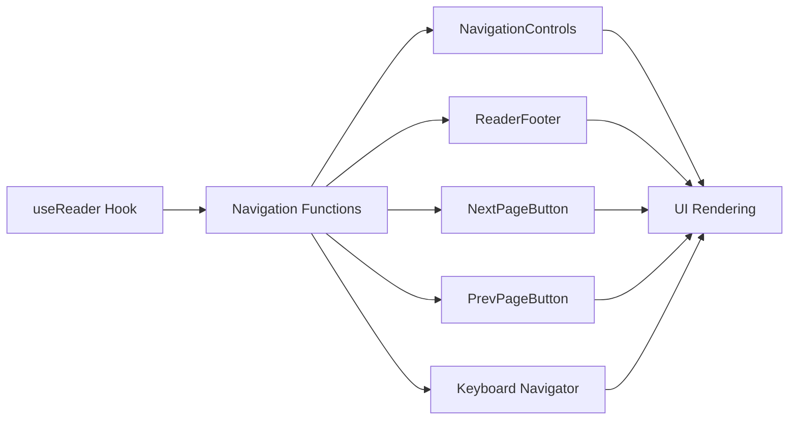
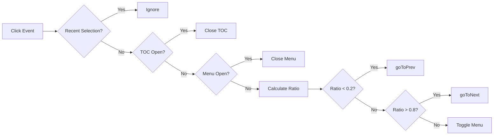

# Navigation Controls

<cite>
**Referenced Files in This Document**   
- [useEpubReader.ts](file://src/pages/EpubReader/hooks/useEpubReader.ts)
- [useKeyboardNavigator.ts](file://src/pages/EpubReader/hooks/useKeyboardNavigator.ts)
- [NavigationControls.tsx](file://src/pages/EpubReader/components/NavigationControls.tsx)
- [TOCSidebar.tsx](file://src/pages/EpubReader/components/TOCSidebar.tsx)
- [renditionEvent.service.ts](file://src/pages/EpubReader/services/renditionEvent.service.ts)
- [ReaderFooter.tsx](file://src/pages/EpubReader/components/ReaderFooter.tsx)
- [NextPageButton.tsx](file://src/pages/EpubReader/components/directory/NextPageButton.tsx)
- [EpubReader/index.tsx](file://src/pages/EpubReader/index.tsx)
</cite>

## Table of Contents
1. [Core Navigation Implementation](#core-navigation-implementation)
2. [Boundary Protection Logic](#boundary-protection-logic)
3. [Chapter Navigation via TOC](#chapter-navigation-via-toc)
4. [Keyboard and Mobile Navigation](#keyboard-and-mobile-navigation)
5. [UI Integration and Controls](#ui-integration-and-controls)
6. [Gesture and Zone-Based Navigation](#gesture-and-zone-based-navigation)
7. [Common Issues and Troubleshooting](#common-issues-and-troubleshooting)

## Core Navigation Implementation

The navigation system in the EPUB reader is primarily implemented through the `useEpubReader.ts` hook, which provides three core navigation functions: `goToNext`, `goToPrev`, and `goToSelectChapter`. These functions are built on top of EPUB.js's native methods and are exposed through the `useReader` hook for use across the application.

The `goToNext` and `goToPrev` functions utilize EPUB.js's `next()` and `prev()` methods respectively to navigate between pages in the book. These functions are created through the `createNavigationFunctions` factory function, which takes the EPUB.js rendition instance and a reference to the current location as parameters. The `goToSelectChapter` function uses EPUB.js's `display()` method with a chapter's href parameter to navigate directly to specific chapters in the book.

These navigation functions are then passed down to various UI components and integrated with keyboard navigation through the `useKeyboardNavigator` hook. The implementation ensures that navigation is consistent across different input methods including buttons, keyboard, touch gestures, and chapter selection.

**Section sources**
- [useEpubReader.ts](file://src/pages/EpubReader/hooks/useEpubReader.ts#L68-L89)
- [EpubReader/index.tsx](file://src/pages/EpubReader/index.tsx#L212-L220)

## Boundary Protection Logic

The navigation system implements robust boundary protection to prevent users from navigating beyond the start or end of the book. This is achieved through the `RenditionLocation` object provided by EPUB.js, which contains `atStart` and `atEnd` boolean flags that indicate the current position within the book.

When `goToPrev` is called, the function first checks the `atStart` flag from the current location. If the user is already at the beginning of the book, the navigation is prevented and a log message is recorded. Similarly, when `goToNext` is called, the function checks the `atEnd` flag and prevents navigation if the user has reached the end of the book.

This boundary checking is implemented directly in the navigation functions within `useEpubReader.ts`, ensuring that all navigation attempts are validated before execution. The location information is updated in real-time through EPUB.js's `relocated` event, which triggers whenever the user navigates to a new position in the book. This event updates the `currentLocationRef` with the latest `RenditionLocation` object, ensuring that the boundary checks always have access to accurate position data.

```mermaid
flowchart TD
A[Navigation Request] --> B{Check Boundary}
B --> |goToPrev| C{atStart?}
B --> |goToNext| D{atEnd?}
C --> |Yes| E[Prevent Navigation<br/>Log Warning]
C --> |No| F[Execute rendition.prev()]
D --> |Yes| G[Prevent Navigation<br/>Log Warning]
D --> |No| H[Execute rendition.next()]
E --> I[Navigation Complete]
F --> I
G --> I
H --> I
```

**Diagram sources**
- [useEpubReader.ts](file://src/pages/EpubReader/hooks/useEpubReader.ts#L72-L86)
- [renditionEvent.service.ts](file://src/pages/EpubReader/services/renditionEvent.service.ts#L31-L40)

**Section sources**
- [useEpubReader.ts](file://src/pages/EpubReader/hooks/useEpubReader.ts#L72-L86)
- [renditionEvent.service.ts](file://src/pages/EpubReader/services/renditionEvent.service.ts#L31-L40)

## Chapter Navigation via TOC

Chapter navigation is implemented through the table of contents (TOC) system, which provides structured access to different sections of the book. The TOC data is extracted from the EPUB file's navigation document and made available through the `tableOfContents` state in the `useReader` hook.

The `TOCSidebar` component renders the hierarchical table of contents, allowing users to navigate directly to any chapter or section. When a user selects a chapter from the TOC, the `goToSelectChapter` function is called with the corresponding href value. This function uses EPUB.js's `display()` method to load and render the specified chapter.

The TOC implementation supports nested chapters through recursive rendering of `subitems`, maintaining the hierarchical structure of the original EPUB navigation. The currently active chapter is highlighted in the TOC sidebar by comparing the `currentChapterHref` with each item's href, providing visual feedback to the user about their current location in the book.

The integration between the TOC and the navigation system is established in the main `EpubReader` component, where the `goToSelectChapter` function from `useReader` is passed directly to the `onChapterSelect` callback of the `TOCSidebar` component.

```mermaid
flowchart LR
A[EPUB File] --> B[Extract TOC]
B --> C[Store tableOfContents]
C --> D[TOCSidebar Component]
D --> E[User Selects Chapter]
E --> F[Call goToSelectChapter(href)]
F --> G[rendition.display(href)]
G --> H[Render Chapter]
H --> I[Update currentChapterHref]
I --> D
```

**Diagram sources**
- [useEpubReader.ts](file://src/pages/EpubReader/hooks/useEpubReader.ts#L171)
- [TOCSidebar.tsx](file://src/pages/EpubReader/components/TOCSidebar.tsx#L31-L102)
- [EpubReader/index.tsx](file://src/pages/EpubReader/index.tsx#L377-L382)

**Section sources**
- [useEpubReader.ts](file://src/pages/EpubReader/hooks/useEpubReader.ts#L171)
- [TOCSidebar.tsx](file://src/pages/EpubReader/components/TOCSidebar.tsx#L31-L102)

## Keyboard and Mobile Navigation

The EPUB reader provides comprehensive keyboard navigation support through the `useKeyboardNavigator.ts` hook, which handles both standard keyboard inputs and mobile-specific volume button navigation. The hook listens for `keydown` events on the document and maps specific keys to navigation functions.

For standard keyboard navigation, the right arrow key triggers `goToNext` and the left arrow key triggers `goToPrev`. This provides intuitive navigation for desktop users. The implementation includes a check for text selection using `window.getSelection()` to prevent navigation when the user is actively selecting text, ensuring that the arrow keys can still be used for text selection within the reader.

On mobile devices, the system supports volume button navigation as an alternative input method. When `enableVolumeKeys` is set to true (determined by the `isMobileDevice()` function), pressing the volume up button triggers `goToPrev` and pressing the volume down button triggers `goToNext`. The system attempts to prevent the default system behavior (volume change) by calling `preventDefault()` on the event, though this may not always be successful depending on the browser and device.

The keyboard navigation hook is integrated with the main navigation system in `useEpubReader.ts`, where it is called with the navigation functions and the mobile detection result. This creates a seamless navigation experience that adapts to the user's device and input preferences.

```mermaid
flowchart TD
A[Keydown Event] --> B{Text Selected?}
B --> |Yes| C[Ignore Navigation]
B --> |No| D{Key Pressed?}
D --> |ArrowRight| E[goToNext()]
D --> |ArrowLeft| F[goToPrev()]
D --> |VolumeDown| G{Mobile?}
D --> |VolumeUp| H{Mobile?}
G --> |Yes| I[goToNext()]
H --> |Yes| J[goToPrev()]
I --> K[Navigation Complete]
J --> K
E --> K
F --> K
```

**Diagram sources**
- [useKeyboardNavigator.ts](file://src/pages/EpubReader/hooks/useKeyboardNavigator.ts#L13-L47)
- [useEpubReader.ts](file://src/pages/EpubReader/hooks/useEpubReader.ts#L178-L180)

**Section sources**
- [useKeyboardNavigator.ts](file://src/pages/EpubReader/hooks/useKeyboardNavigator.ts#L13-L47)
- [useEpubReader.ts](file://src/pages/EpubReader/hooks/useEpubReader.ts#L178-L180)

## UI Integration and Controls

The navigation system is integrated with multiple UI components to provide various methods of interaction. The primary navigation controls are implemented in the `NavigationControls.tsx` component, which renders previous and next page buttons with appropriate disabled states when at the boundaries of the book.

The component receives `onPrevPage`, `onNextPage`, `isAtStart`, and `isAtEnd` props, which are derived from the navigation functions and location state in `useEpubReader.ts`. The buttons are conditionally disabled based on the boundary flags, and their appearance changes to indicate the disabled state, providing clear visual feedback to users.

Additional navigation UI elements include the `ReaderFooter` component, which displays page progress and includes navigation buttons, and the `NextPageButton` and `PrevPageButton` components that provide large, touch-friendly navigation areas on the right and left edges of the screen. These edge buttons are absolutely positioned over the reader view and capture click events with `stopPropagation()` to prevent interference with other interactions.

The integration between the navigation logic and UI components occurs in the main `EpubReader` component, where the navigation functions from `useReader` are passed to various components as props. This centralized approach ensures consistent navigation behavior across all UI elements.



**Diagram sources**
- [NavigationControls.tsx](file://src/pages/EpubReader/components/NavigationControls.tsx#L6-L49)
- [ReaderFooter.tsx](file://src/pages/EpubReader/components/ReaderFooter.tsx#L4-L66)
- [NextPageButton.tsx](file://src/pages/EpubReader/components/directory/NextPageButton.tsx#L1-L47)
- [EpubReader/index.tsx](file://src/pages/EpubReader/index.tsx#L388-L389)

**Section sources**
- [NavigationControls.tsx](file://src/pages/EpubReader/components/NavigationControls.tsx#L6-L49)
- [ReaderFooter.tsx](file://src/pages/EpubReader/components/ReaderFooter.tsx#L4-L66)

## Gesture and Zone-Based Navigation

The EPUB reader implements gesture-based navigation through a smart zone system that divides the reader viewport into navigable regions. This is implemented in the main `EpubReader` component through a click handler that analyzes the position of mouse events relative to the viewport.

When a click occurs, the system calculates the horizontal position ratio of the click event. If the click occurs in the leftmost 20% of the viewport (ratio < 0.2), it triggers `goToPrev`. If the click occurs in the rightmost 20% of the viewport (ratio > 0.8), it triggers `goToNext`. Clicks in the middle 60% of the viewport trigger the menu toggle instead.

This zone-based navigation provides an intuitive touch-friendly interface, particularly on mobile devices where users can swipe or tap the edges of the screen to navigate. The system includes safeguards to prevent conflicts with other interactions, such as ignoring navigation if a text selection occurred within the last 500 milliseconds, and closing the TOC sidebar or context menu before processing navigation gestures.

The implementation also handles edge cases such as iframe embedding by calculating the correct coordinates relative to the frame, ensuring consistent behavior even when the reader is embedded in other pages.



**Diagram sources**
- [EpubReader/index.tsx](file://src/pages/EpubReader/index.tsx#L267-L303)

**Section sources**
- [EpubReader/index.tsx](file://src/pages/EpubReader/index.tsx#L267-L303)

## Common Issues and Troubleshooting

Several common issues can affect the navigation system in the EPUB reader, along with their corresponding solutions:

**Unresponsive Navigation Buttons**: This issue typically occurs when the EPUB.js rendition is not fully initialized or when there are conflicts with event propagation. Ensure that the `renderBook` function in `useReader` has completed successfully and that the container reference is properly set. Check for any JavaScript errors in the console that might prevent the event listeners from being attached.

**Incorrect Page Transitions**: This can happen when the location tracking is out of sync with the actual page display. Verify that the `relocated` event from EPUB.js is properly updating the `currentLocationRef` and that the page calculation based on the percentage from CFI is accurate. The `setupRenditionEvents` function should ensure proper synchronization between the displayed content and the tracked location.

**TOC Synchronization Problems**: When the current chapter highlighting in the TOC doesn't match the actual displayed content, check the `rendered` event handler in `setupRenditionEvents`. Ensure that the `setCurrentChapterHref` function is being called with the correct href from the section, and that the comparison in `TOCSidebar` accounts for partial matches using `startsWith`.

**Mobile Volume Key Issues**: On some devices and browsers, preventing the default volume change behavior may not work due to security restrictions. As a fallback, consider providing alternative navigation methods or educating users about browser-specific requirements for this feature.

**Performance Issues with Large Books**: For books with extensive content, the location generation process in `renderBook` might cause delays. The system currently generates locations based on character count (configured in `RENDERING_CONFIG.LOCATION_CHAR_COUNT`), which can be adjusted to balance accuracy and performance.

**Section sources**
- [useEpubReader.ts](file://src/pages/EpubReader/hooks/useEpubReader.ts#L146-L175)
- [renditionEvent.service.ts](file://src/pages/EpubReader/services/renditionEvent.service.ts#L31-L48)
- [TOCSidebar.tsx](file://src/pages/EpubReader/components/TOCSidebar.tsx#L38-L41)