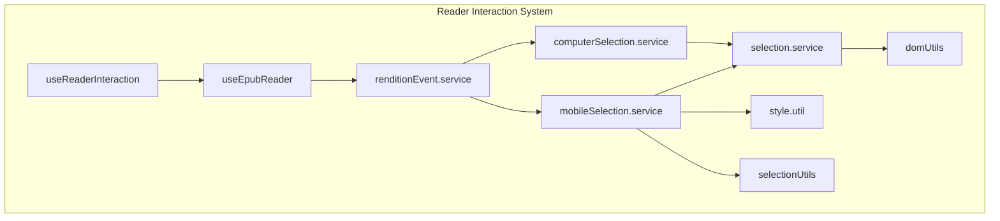
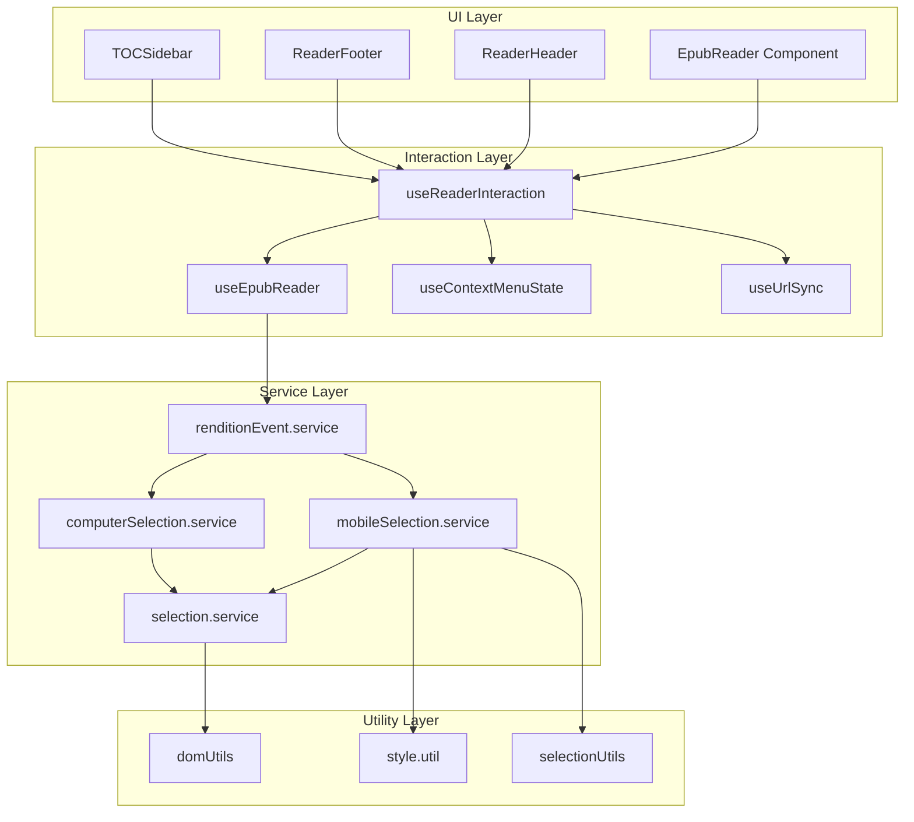
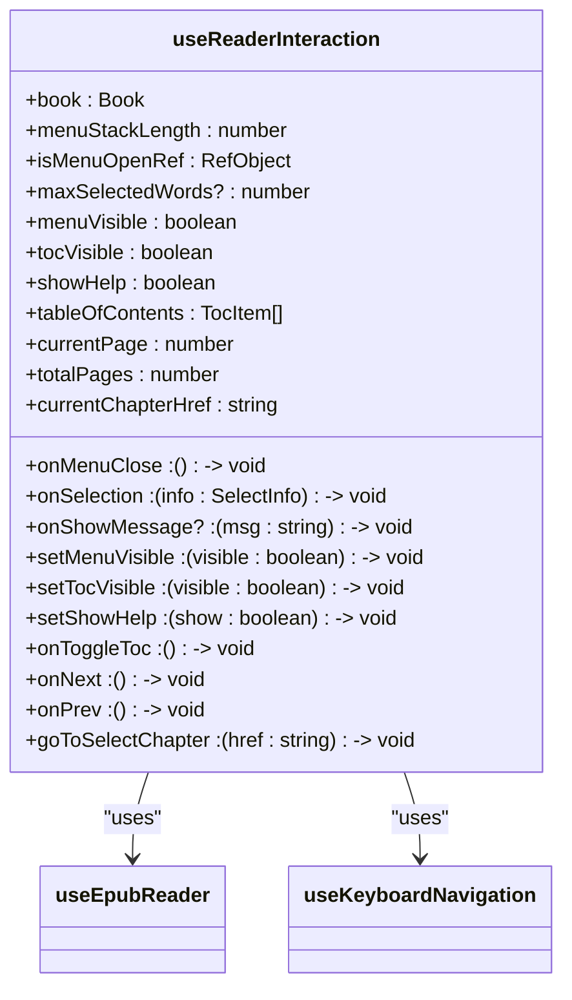
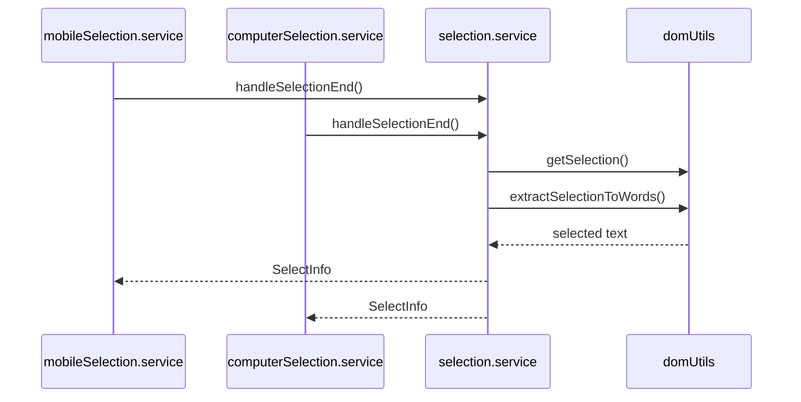
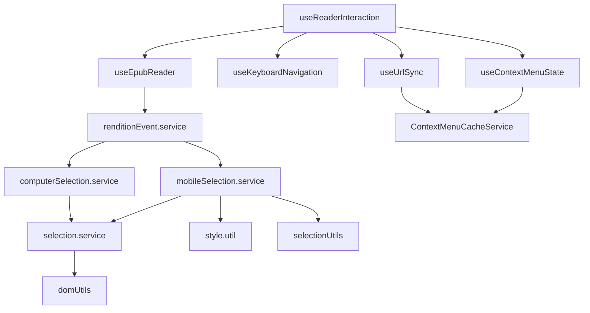

# Reader Interaction Refactor

<cite>
**Referenced Files in This Document**   
- [useReaderInteraction.ts](file://src/pages/EpubReader/hooks/useReaderInteraction.ts)
- [selection.service.ts](file://src/pages/EpubReader/services/selection.service.ts)
- [mobileSelection.service.ts](file://src/pages/EpubReader/services/mobileSelection.service.ts)
- [computerSelection.service.ts](file://src/pages/EpubReader/services/computerSelection.service.ts)
- [renditionEvent.service.ts](file://src/pages/EpubReader/services/renditionEvent.service.ts)
- [useEpubReader.ts](file://src/pages/EpubReader/hooks/useEpubReader.ts)
- [epub.ts](file://src/types/epub.ts)
- [epub.ts](file://src/constants/epub.ts)
- [domUtils.ts](file://src/pages/EpubReader/utils/domUtils.ts)
- [style.util.ts](file://src/pages/EpubReader/utils/style.util.ts)
- [selectionUtils.ts](file://src/pages/EpubReader/utils/selectionUtils.ts)
- [EpubReader/index.tsx](file://src/pages/EpubReader/index.tsx)
- [useContextMenuState.ts](file://src/pages/EpubReader/hooks/useContextMenuState.ts)
- [useUrlSync.ts](file://src/pages/EpubReader/hooks/useUrlSync.ts)
</cite>

## Table of Contents
1. [Introduction](#introduction)
2. [Project Structure](#project-structure)
3. [Core Components](#core-components)
4. [Architecture Overview](#architecture-overview)
5. [Detailed Component Analysis](#detailed-component-analysis)
6. [Dependency Analysis](#dependency-analysis)
7. [Performance Considerations](#performance-considerations)
8. [Troubleshooting Guide](#troubleshooting-guide)
9. [Conclusion](#conclusion)

## Introduction
This document provides a comprehensive analysis of the reader interaction system in the EPUB reader application. The system handles text selection, navigation, and user interaction across different device types, with a focus on providing a seamless reading experience. The analysis covers the architecture, core components, and implementation details of the reader interaction functionality.

## Project Structure
The reader interaction functionality is primarily located in the `src/pages/EpubReader` directory, with key components organized into logical subdirectories:

- `hooks/`: Custom React hooks for reader functionality
- `services/`: Business logic and service layers for reader interactions
- `utils/`: Utility functions for DOM manipulation and text processing
- `components/`: UI components for the reader interface

The system follows a modular architecture with clear separation of concerns between presentation, business logic, and utility functions.



**Diagram sources**
- [useReaderInteraction.ts](file://src/pages/EpubReader/hooks/useReaderInteraction.ts)
- [useEpubReader.ts](file://src/pages/EpubReader/hooks/useEpubReader.ts)
- [renditionEvent.service.ts](file://src/pages/EpubReader/services/renditionEvent.service.ts)
- [mobileSelection.service.ts](file://src/pages/EpubReader/services/mobileSelection.service.ts)
- [computerSelection.service.ts](file://src/pages/EpubReader/services/computerSelection.service.ts)
- [selection.service.ts](file://src/pages/EpubReader/services/selection.service.ts)
- [domUtils.ts](file://src/pages/EpubReader/utils/domUtils.ts)
- [style.util.ts](file://src/pages/EpubReader/utils/style.util.ts)
- [selectionUtils.ts](file://src/pages/EpubReader/utils/selectionUtils.ts)

**Section sources**
- [useReaderInteraction.ts](file://src/pages/EpubReader/hooks/useReaderInteraction.ts)
- [useEpubReader.ts](file://src/pages/EpubReader/hooks/useEpubReader.ts)

## Core Components
The reader interaction system consists of several core components that work together to provide a cohesive user experience. These components handle text selection, navigation, and device-specific interactions.

The system is built around a hook-based architecture that encapsulates complex interaction logic while providing a clean API for the UI components. The main entry point is the `useReaderInteraction` hook, which orchestrates various sub-components and services.

**Section sources**
- [useReaderInteraction.ts](file://src/pages/EpubReader/hooks/useReaderInteraction.ts)
- [EpubReader/index.tsx](file://src/pages/EpubReader/index.tsx)

## Architecture Overview
The reader interaction system follows a layered architecture with clear separation between presentation, business logic, and utility functions. The system is designed to handle both mobile and desktop interactions with appropriate adaptations for each platform.



**Diagram sources**
- [EpubReader/index.tsx](file://src/pages/EpubReader/index.tsx)
- [useReaderInteraction.ts](file://src/pages/EpubReader/hooks/useReaderInteraction.ts)
- [useEpubReader.ts](file://src/pages/EpubReader/hooks/useEpubReader.ts)
- [useContextMenuState.ts](file://src/pages/EpubReader/hooks/useContextMenuState.ts)
- [useUrlSync.ts](file://src/pages/EpubReader/hooks/useUrlSync.ts)
- [renditionEvent.service.ts](file://src/pages/EpubReader/services/renditionEvent.service.ts)
- [mobileSelection.service.ts](file://src/pages/EpubReader/services/mobileSelection.service.ts)
- [computerSelection.service.ts](file://src/pages/EpubReader/services/computerSelection.service.ts)
- [selection.service.ts](file://src/pages/EpubReader/services/selection.service.ts)
- [domUtils.ts](file://src/pages/EpubReader/utils/domUtils.ts)
- [style.util.ts](file://src/pages/EpubReader/utils/style.util.ts)
- [selectionUtils.ts](file://src/pages/EpubReader/utils/selectionUtils.ts)

## Detailed Component Analysis

### useReaderInteraction Hook Analysis
The `useReaderInteraction` hook is the central component that orchestrates reader interactions. It combines functionality from multiple sub-components to provide a unified API for the UI.



**Diagram sources**
- [useReaderInteraction.ts](file://src/pages/EpubReader/hooks/useReaderInteraction.ts)
- [useEpubReader.ts](file://src/pages/EpubReader/hooks/useEpubReader.ts)

**Section sources**
- [useReaderInteraction.ts](file://src/pages/EpubReader/hooks/useReaderInteraction.ts)

### Selection Service Analysis
The selection service handles the core text selection logic, providing a consistent interface for both mobile and desktop platforms.



**Diagram sources**
- [mobileSelection.service.ts](file://src/pages/EpubReader/services/mobileSelection.service.ts)
- [computerSelection.service.ts](file://src/pages/EpubReader/services/computerSelection.service.ts)
- [selection.service.ts](file://src/pages/EpubReader/services/selection.service.ts)
- [domUtils.ts](file://src/pages/EpubReader/utils/domUtils.ts)

**Section sources**
- [selection.service.ts](file://src/pages/EpubReader/services/selection.service.ts)
- [mobileSelection.service.ts](file://src/pages/EpubReader/services/mobileSelection.service.ts)
- [computerSelection.service.ts](file://src/pages/EpubReader/services/computerSelection.service.ts)

### Device-Specific Interaction Analysis
The system implements different interaction patterns for mobile and desktop devices, adapting to platform-specific conventions.

```mermaid
flowchart TD
Start([Device Detection]) --> IsMobile{isMobileDevice()?}
IsMobile --> |Yes| MobileMode[Mobile Selection Mode]
IsMobile --> |No| ComputerMode[Computer Selection Mode]
MobileMode --> LongPress{Long Press?}
LongPress --> |Yes| StartSelection[Start Selection]
LongPress --> |No| RegularTap[Regular Tap]
StartSelection --> ExtendSelection[Extend Selection on Move]
ExtendSelection --> CompleteSelection[Complete on Touch End]
RegularTap --> CompleteSelection
ComputerMode --> MouseDown[Mouse Down]
MouseDown --> MouseUp[Mouse Up]
MouseUp --> Debounce[Debounce 10ms]
Debounce --> HandleSelection[handleSelectionEnd]
```

**Diagram sources**
- [renditionEvent.service.ts](file://src/pages/EpubReader/services/renditionEvent.service.ts)
- [mobileSelection.service.ts](file://src/pages/EpubReader/services/mobileSelection.service.ts)
- [computerSelection.service.ts](file://src/pages/EpubReader/services/computerSelection.service.ts)

**Section sources**
- [renditionEvent.service.ts](file://src/pages/EpubReader/services/renditionEvent.service.ts)
- [mobileSelection.service.ts](file://src/pages/EpubReader/services/mobileSelection.service.ts)
- [computerSelection.service.ts](file://src/pages/EpubReader/services/computerSelection.service.ts)

## Dependency Analysis
The reader interaction system has a well-defined dependency structure with clear boundaries between components.



**Diagram sources**
- [useReaderInteraction.ts](file://src/pages/EpubReader/hooks/useReaderInteraction.ts)
- [useEpubReader.ts](file://src/pages/EpubReader/hooks/useEpubReader.ts)
- [renditionEvent.service.ts](file://src/pages/EpubReader/services/renditionEvent.service.ts)
- [mobileSelection.service.ts](file://src/pages/EpubReader/services/mobileSelection.service.ts)
- [computerSelection.service.ts](file://src/pages/EpubReader/services/computerSelection.service.ts)
- [selection.service.ts](file://src/pages/EpubReader/services/selection.service.ts)
- [domUtils.ts](file://src/pages/EpubReader/utils/domUtils.ts)
- [style.util.ts](file://src/pages/EpubReader/utils/style.util.ts)
- [selectionUtils.ts](file://src/pages/EpubReader/utils/selectionUtils.ts)
- [useContextMenuState.ts](file://src/pages/EpubReader/hooks/useContextMenuState.ts)
- [useUrlSync.ts](file://src/pages/EpubReader/hooks/useUrlSync.ts)

**Section sources**
- [useReaderInteraction.ts](file://src/pages/EpubReader/hooks/useReaderInteraction.ts)
- [useEpubReader.ts](file://src/pages/EpubReader/hooks/useEpubReader.ts)
- [renditionEvent.service.ts](file://src/pages/EpubReader/services/renditionEvent.service.ts)

## Performance Considerations
The system implements several performance optimizations to ensure smooth user interactions:

1. **Debouncing**: Mouse up events are debounced with a 10ms delay to prevent rapid-fire selection events
2. **Memoization**: The `onSelectionCompletedDebounced` function is memoized to prevent unnecessary re-creation
3. **Event Cleanup**: All event listeners are properly cleaned up to prevent memory leaks
4. **Efficient DOM Operations**: Selection operations are optimized to minimize DOM manipulation

The system also includes configurable timing constants in `epub.ts` that can be adjusted to balance responsiveness with performance.

**Section sources**
- [computerSelection.service.ts](file://src/pages/EpubReader/services/computerSelection.service.ts)
- [useEpubReader.ts](file://src/pages/EpubReader/hooks/useEpubReader.ts)
- [epub.ts](file://src/constants/epub.ts)

## Troubleshooting Guide
Common issues and their solutions:

1. **Text selection not working on mobile**: Ensure that `applyMobileStyles` is called to enable text selection on mobile devices
2. **Context menu not appearing**: Check that the selection word count is within the configured limits (`DEFAULT_MAX_SELECTED_WORDS`)
3. **Navigation issues**: Verify that the rendition events are properly set up and that the location tracking is functioning
4. **Performance issues**: Review the debounce settings and consider adjusting the `SELECTION_DELAY` constant

The system includes comprehensive logging through the `logger` utility, which can be used to trace the flow of selection events and identify issues.

**Section sources**
- [mobileSelection.service.ts](file://src/pages/EpubReader/services/mobileSelection.service.ts)
- [computerSelection.service.ts](file://src/pages/EpubReader/services/computerSelection.service.ts)
- [selection.service.ts](file://src/pages/EpubReader/services/selection.service.ts)
- [epub.ts](file://src/constants/epub.ts)
- [logger.ts](file://src/utils/logger.ts)

## Conclusion
The reader interaction system in the EPUB reader application is a well-architected, modular system that provides a consistent user experience across different device types. The system effectively separates concerns between presentation, business logic, and utility functions, making it maintainable and extensible.

Key strengths of the system include:
- Clear separation of mobile and desktop interaction patterns
- Comprehensive text selection handling with context extraction
- Proper event cleanup and memory management
- Configurable performance settings
- Robust error handling and logging

The system could be further improved by adding more comprehensive unit tests and expanding the documentation for the various configuration options.