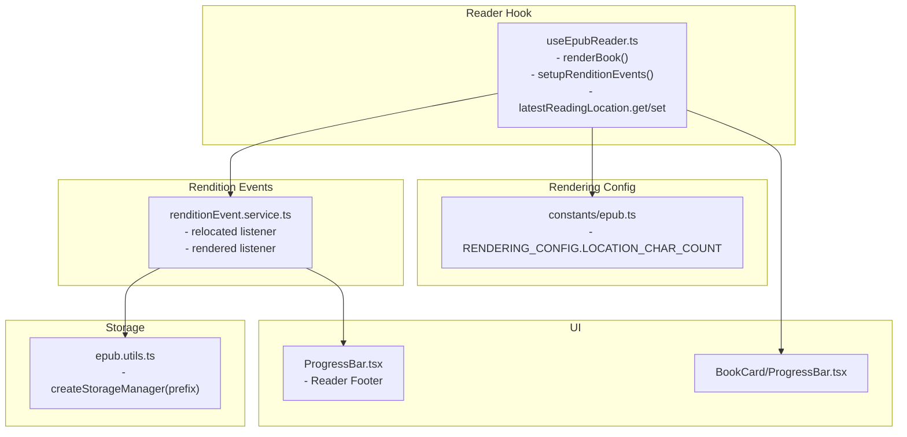
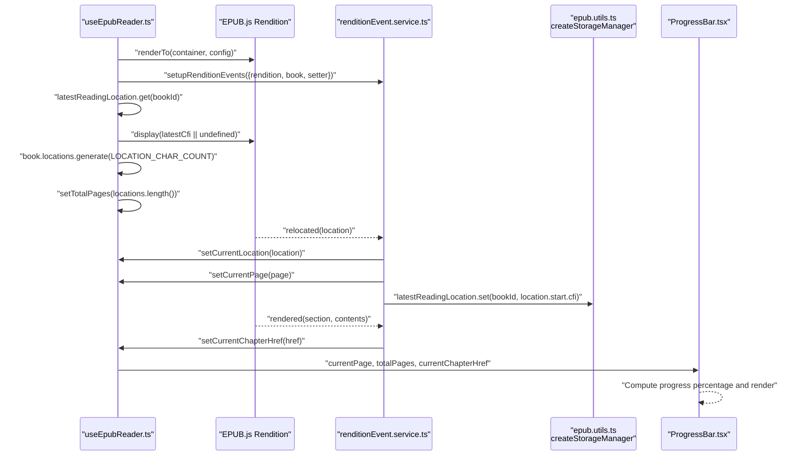
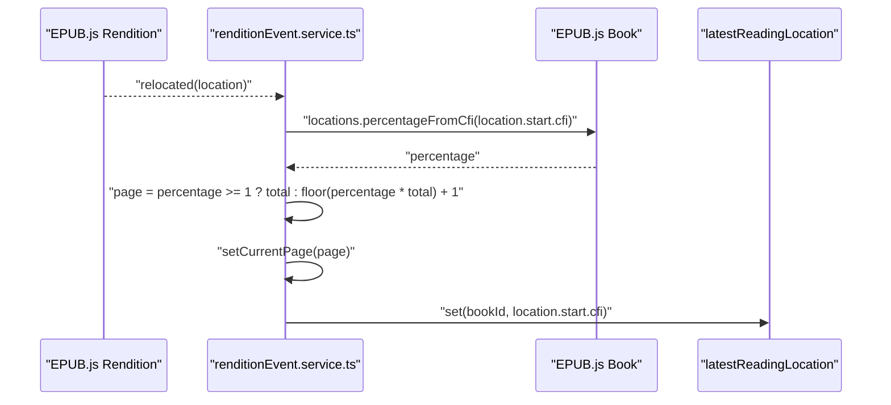
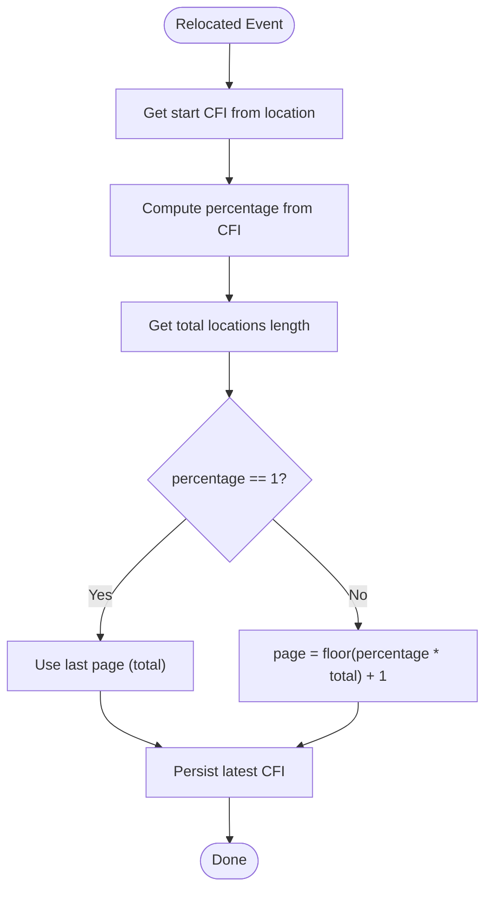
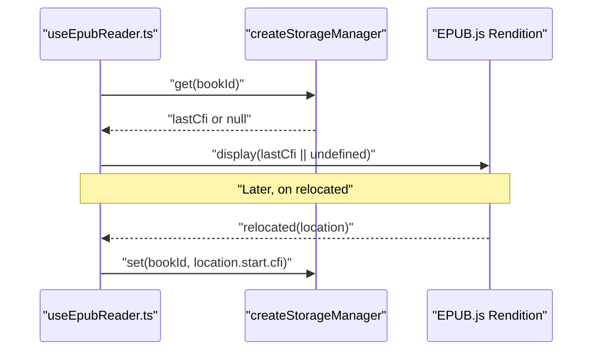
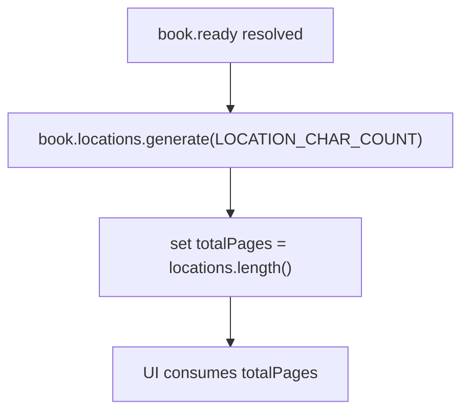
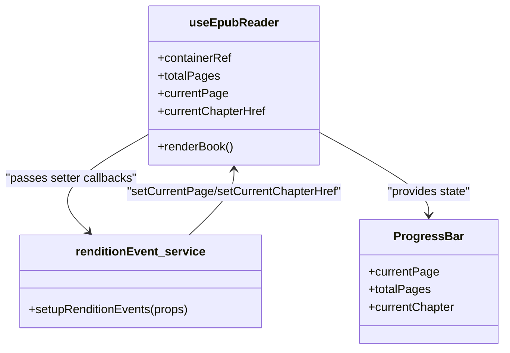
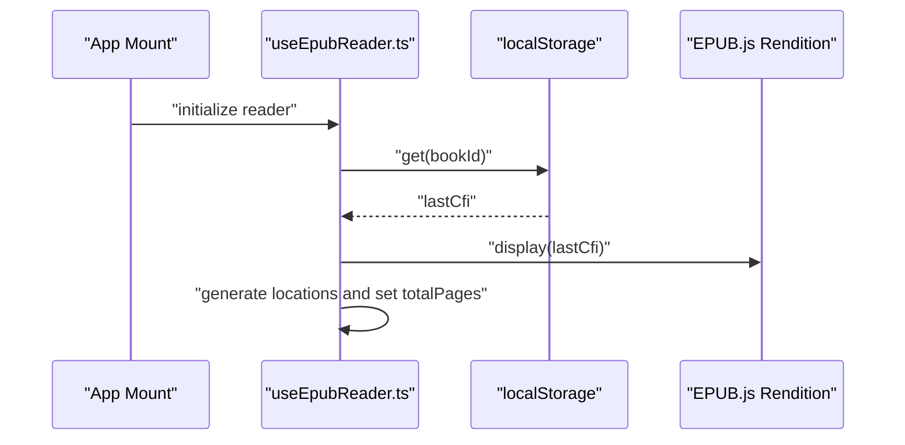
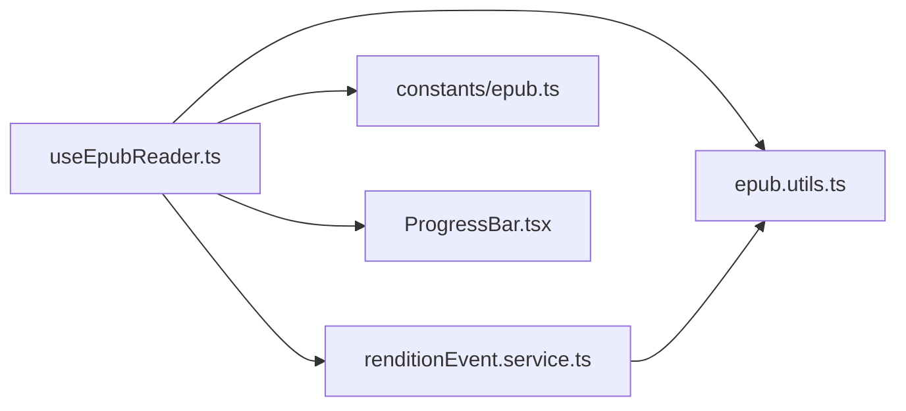

# Reading Progress Tracking

<cite>
**Referenced Files in This Document**
- [useEpubReader.ts](file://src/pages/EpubReader/hooks/useEpubReader.ts)
- [renditionEvent.service.ts](file://src/pages/EpubReader/services/renditionEvent.service.ts)
- [epub.utils.ts](file://src/pages/EpubReader/hooks/epub.utils.ts)
- [epub.ts](file://src/constants/epub.ts)
- [ProgressBar.tsx](file://src/pages/EpubReader/components/ProgressBar.tsx)
- [BookCard/ProgressBar.tsx](file://src/components/BookCard/ProgressBar.tsx)
- [ReaderFooter.tsx](file://src/pages/EpubReader/components/ReaderFooter.tsx)
- [OPFSManager.ts](file://src/services/OPFSManager.ts)
</cite>

## Table of Contents
1. [Introduction](#introduction)
2. [Project Structure](#project-structure)
3. [Core Components](#core-components)
4. [Architecture Overview](#architecture-overview)
5. [Detailed Component Analysis](#detailed-component-analysis)
6. [Dependency Analysis](#dependency-analysis)
7. [Performance Considerations](#performance-considerations)
8. [Troubleshooting Guide](#troubleshooting-guide)
9. [Conclusion](#conclusion)

## Introduction
This document explains the reading progress tracking system used by the EPUB reader. It focuses on how the EPUB.js relocated event is captured to track the current reading position via CFI (Canonical Fragment Identifier), how reading progress is calculated and converted into page numbers, how the last read position is persisted across sessions using a local storage manager, and how locations are generated with a configurable character count threshold. It also covers the integration between currentLocationRef, setCurrentPage, and setCurrentChapterHref for real-time UI updates, along with examples of restoring progress on app restart and addressing common issues such as inaccurate progress saving, lost positions after reload, or incorrect page number calculations.

## Project Structure
The reading progress tracking spans several modules:
- Reader hook orchestrates rendering, event setup, and restoration of the last read position.
- Rendition event service listens to EPUB.js events and updates UI state.
- Storage manager persists the last CFI using a prefixed key.
- Rendering configuration defines the location generation threshold.
- UI components consume page and chapter state to reflect progress.

**Diagram sources**
- [useEpubReader.ts](file://src/pages/EpubReader/hooks/useEpubReader.ts#L145-L175)
- [renditionEvent.service.ts](file://src/pages/EpubReader/services/renditionEvent.service.ts#L29-L59)
- [epub.utils.ts](file://src/pages/EpubReader/hooks/epub.utils.ts#L1-L10)
- [epub.ts](file://src/constants/epub.ts#L53-L61)
- [ProgressBar.tsx](file://src/pages/EpubReader/components/ProgressBar.tsx#L1-L35)
- [BookCard/ProgressBar.tsx](file://src/components/BookCard/ProgressBar.tsx#L1-L59)

**Section sources**
- [useEpubReader.ts](file://src/pages/EpubReader/hooks/useEpubReader.ts#L145-L175)
- [renditionEvent.service.ts](file://src/pages/EpubReader/services/renditionEvent.service.ts#L29-L59)
- [epub.utils.ts](file://src/pages/EpubReader/hooks/epub.utils.ts#L1-L10)
- [epub.ts](file://src/constants/epub.ts#L53-L61)
- [ProgressBar.tsx](file://src/pages/EpubReader/components/ProgressBar.tsx#L1-L35)
- [BookCard/ProgressBar.tsx](file://src/components/BookCard/ProgressBar.tsx#L1-L59)

## Core Components
- useEpubReader: Initializes the rendition, sets up events, restores the last read position, generates locations, and exposes navigation and UI state.
- renditionEvent.service: Listens to EPUB.js relocated and rendered events, computes page number from CFI, persists the last read position, and updates chapter href.
- epub.utils: Provides a simple storage manager abstraction for persisting the last CFI under a prefixed key.
- constants/epub: Defines the location generation threshold used when generating locations.
- UI Progress Bars: Consume currentPage and totalPages to render progress.

**Section sources**
- [useEpubReader.ts](file://src/pages/EpubReader/hooks/useEpubReader.ts#L145-L175)
- [renditionEvent.service.ts](file://src/pages/EpubReader/services/renditionEvent.service.ts#L29-L59)
- [epub.utils.ts](file://src/pages/EpubReader/hooks/epub.utils.ts#L1-L10)
- [epub.ts](file://src/constants/epub.ts#L53-L61)
- [ProgressBar.tsx](file://src/pages/EpubReader/components/ProgressBar.tsx#L1-L35)

## Architecture Overview
The progress tracking pipeline integrates EPUB.js events with local storage and UI updates.

**Diagram sources**
- [useEpubReader.ts](file://src/pages/EpubReader/hooks/useEpubReader.ts#L145-L175)
- [renditionEvent.service.ts](file://src/pages/EpubReader/services/renditionEvent.service.ts#L29-L59)
- [epub.utils.ts](file://src/pages/EpubReader/hooks/epub.utils.ts#L1-L10)
- [ProgressBar.tsx](file://src/pages/EpubReader/components/ProgressBar.tsx#L1-L35)

## Detailed Component Analysis

### EPUB.js Relocated Event and CFI Capture
- The relocated event fires when the rendition’s location changes. The handler receives a location object containing start and end segments with CFI, location index, and percentage.
- The handler extracts the start CFI and uses the book’s locations to compute the reading percentage and derive the current page number.
- The last read CFI is persisted immediately upon relocation.

**Diagram sources**
- [renditionEvent.service.ts](file://src/pages/EpubReader/services/renditionEvent.service.ts#L29-L40)

**Section sources**
- [renditionEvent.service.ts](file://src/pages/EpubReader/services/renditionEvent.service.ts#L29-L40)

### Percentage From CFI and Page Number Calculation
- The percentage is computed from the start CFI using the book’s locations. The total number of locations is derived from locations.length().
- The page number is derived from the percentage and total locations. Edge-case handling ensures that when percentage equals 1, the last page is used; otherwise, the page is the floored percentage times total plus one.

**Diagram sources**
- [renditionEvent.service.ts](file://src/pages/EpubReader/services/renditionEvent.service.ts#L31-L40)

**Section sources**
- [renditionEvent.service.ts](file://src/pages/EpubReader/services/renditionEvent.service.ts#L31-L40)

### Last Read Position Persistence with Storage Manager
- A storage manager is created with a prefix to isolate keys for reading positions.
- On each relocation, the start CFI is saved under a key composed from the prefix and the bookId.
- On startup, the hook retrieves the last CFI and passes it to rendition.display to restore the reading position.

**Diagram sources**
- [useEpubReader.ts](file://src/pages/EpubReader/hooks/useEpubReader.ts#L165-L166)
- [useEpubReader.ts](file://src/pages/EpubReader/hooks/useEpubReader.ts#L165-L166)
- [epub.utils.ts](file://src/pages/EpubReader/hooks/epub.utils.ts#L1-L10)

**Section sources**
- [useEpubReader.ts](file://src/pages/EpubReader/hooks/useEpubReader.ts#L165-L166)
- [epub.utils.ts](file://src/pages/EpubReader/hooks/epub.utils.ts#L1-L10)

### Location Generation Threshold and Accuracy vs Performance
- Locations are generated with a configurable character count threshold defined in RENDERING_CONFIG.LOCATION_CHAR_COUNT.
- A higher threshold increases accuracy by creating finer granularity but may increase memory and generation time. A lower threshold reduces overhead but may yield coarser page boundaries.
- The hook triggers generation after the book is ready and sets the total page count from locations.length().

**Diagram sources**
- [useEpubReader.ts](file://src/pages/EpubReader/hooks/useEpubReader.ts#L168-L171)
- [epub.ts](file://src/constants/epub.ts#L53-L61)

**Section sources**
- [useEpubReader.ts](file://src/pages/EpubReader/hooks/useEpubReader.ts#L168-L171)
- [epub.ts](file://src/constants/epub.ts#L53-L61)

### Real-Time UI Updates: currentLocationRef, setCurrentPage, setCurrentChapterHref
- The hook maintains refs for the current location and state for currentPage and currentChapterHref.
- The rendition event handler updates these values, enabling real-time UI updates in components such as the reader footer and progress bars.

**Diagram sources**
- [useEpubReader.ts](file://src/pages/EpubReader/hooks/useEpubReader.ts#L145-L175)
- [renditionEvent.service.ts](file://src/pages/EpubReader/services/renditionEvent.service.ts#L29-L59)
- [ProgressBar.tsx](file://src/pages/EpubReader/components/ProgressBar.tsx#L1-L35)

**Section sources**
- [useEpubReader.ts](file://src/pages/EpubReader/hooks/useEpubReader.ts#L145-L175)
- [renditionEvent.service.ts](file://src/pages/EpubReader/services/renditionEvent.service.ts#L29-L59)
- [ProgressBar.tsx](file://src/pages/EpubReader/components/ProgressBar.tsx#L1-L35)

### Restoring Progress on App Restart
- On mount, the hook reads the last CFI from storage and passes it to rendition.display to restore the reading position.
- After restoration, locations are generated and total pages are set, ensuring the UI reflects the correct total and current page.

**Diagram sources**
- [useEpubReader.ts](file://src/pages/EpubReader/hooks/useEpubReader.ts#L165-L171)

**Section sources**
- [useEpubReader.ts](file://src/pages/EpubReader/hooks/useEpubReader.ts#L165-L171)

## Dependency Analysis
- useEpubReader depends on:
  - EPUB.js rendition and book APIs for rendering and location computation.
  - renditionEvent.service for event wiring and page/chapter updates.
  - epub.utils for storage management.
  - constants/epub for rendering configuration.
- UI components depend on state exposed by useEpubReader.

**Diagram sources**
- [useEpubReader.ts](file://src/pages/EpubReader/hooks/useEpubReader.ts#L145-L175)
- [renditionEvent.service.ts](file://src/pages/EpubReader/services/renditionEvent.service.ts#L29-L59)
- [epub.utils.ts](file://src/pages/EpubReader/hooks/epub.utils.ts#L1-L10)
- [epub.ts](file://src/constants/epub.ts#L53-L61)
- [ProgressBar.tsx](file://src/pages/EpubReader/components/ProgressBar.tsx#L1-L35)

**Section sources**
- [useEpubReader.ts](file://src/pages/EpubReader/hooks/useEpubReader.ts#L145-L175)
- [renditionEvent.service.ts](file://src/pages/EpubReader/services/renditionEvent.service.ts#L29-L59)
- [epub.utils.ts](file://src/pages/EpubReader/hooks/epub.utils.ts#L1-L10)
- [epub.ts](file://src/constants/epub.ts#L53-L61)
- [ProgressBar.tsx](file://src/pages/EpubReader/components/ProgressBar.tsx#L1-L35)

## Performance Considerations
- Location generation cost: Increasing RENDERING_CONFIG.LOCATION_CHAR_COUNT improves accuracy but may increase generation time and memory usage. Choose a value appropriate for the device and book size.
- Debouncing selection events: The reader debounces selection completion to reduce unnecessary re-renders and event handling.
- OPFS storage: While not directly part of progress tracking, OPFS is used for caching EPUBs and metadata. Clearing OPFS does not affect persisted reading positions because they are stored separately in localStorage.

**Section sources**
- [epub.ts](file://src/constants/epub.ts#L53-L61)
- [useEpubReader.ts](file://src/pages/EpubReader/hooks/useEpubReader.ts#L126-L143)
- [OPFSManager.ts](file://src/services/OPFSManager.ts#L365-L402)

## Troubleshooting Guide
- Inaccurate progress saving:
  - Ensure the relocated event is firing and the start CFI is being persisted. Verify that the storage manager key is constructed with the correct prefix and bookId.
  - Confirm that locations are generated before reading the total page count.

- Lost positions after reload:
  - Verify that the hook reads the last CFI from storage and passes it to rendition.display on mount.
  - Ensure the storage key exists and is readable.

- Incorrect page number calculations:
  - Check that the percentage is computed from the start CFI and that the page formula accounts for the edge case when percentage equals 1.
  - Confirm that totalPages is set from locations.length() after generation.

- UI not updating:
  - Ensure setCurrentPage and setCurrentChapterHref are invoked by the event handler and that the UI components subscribe to these state values.

- OPFS reset does not affect reading positions:
  - OPFS reset clears cached EPUBs and config; reading positions are stored in localStorage under a different key namespace and are unaffected by OPFS reset.

**Section sources**
- [renditionEvent.service.ts](file://src/pages/EpubReader/services/renditionEvent.service.ts#L29-L59)
- [useEpubReader.ts](file://src/pages/EpubReader/hooks/useEpubReader.ts#L165-L171)
- [epub.utils.ts](file://src/pages/EpubReader/hooks/epub.utils.ts#L1-L10)
- [OPFSManager.ts](file://src/services/OPFSManager.ts#L365-L402)

## Conclusion
The reading progress tracking system leverages EPUB.js relocated events to capture the current position via CFI, computes reading progress and page numbers, and persists the last read position using a simple storage manager. Locations are generated with a configurable threshold to balance accuracy and performance. The integration of currentLocationRef, setCurrentPage, and setCurrentChapterHref enables real-time UI updates across the reader and book card components. Proper initialization, event handling, and storage usage ensure robust progress restoration across sessions.