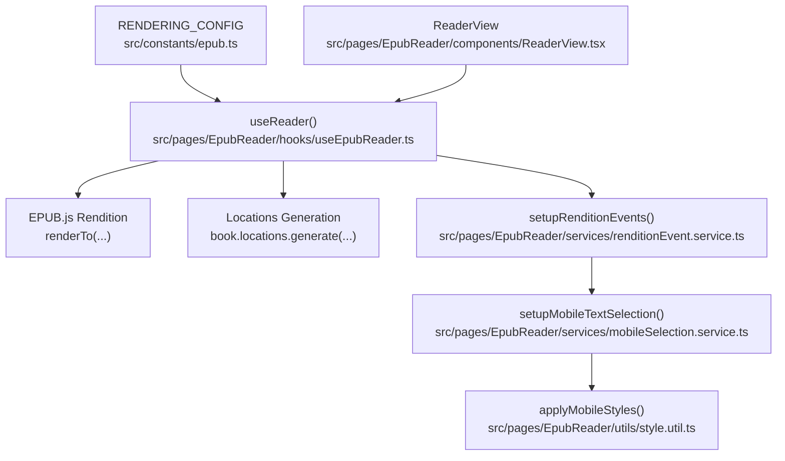
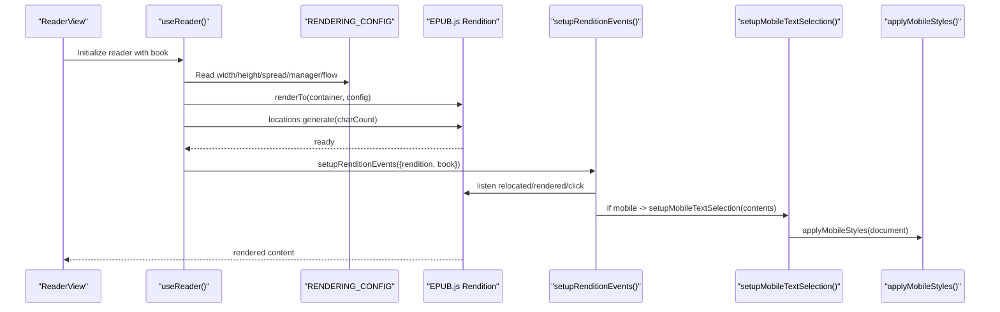
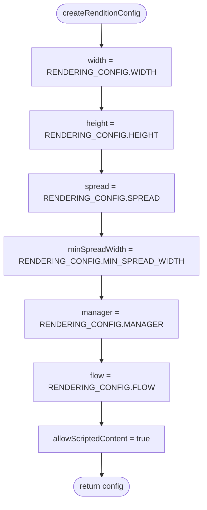
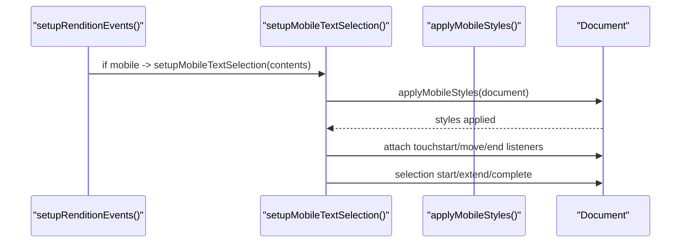
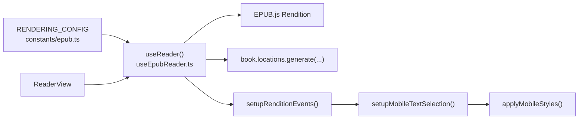

# Rendering Configuration

<cite>
**Referenced Files in This Document**
- [epub.ts](file://src/constants/epub.ts)
- [useEpubReader.ts](file://src/pages/EpubReader/hooks/useEpubReader.ts)
- [renditionEvent.service.ts](file://src/pages/EpubReader/services/renditionEvent.service.ts)
- [style.util.ts](file://src/pages/EpubReader/utils/style.util.ts)
- [mobileSelection.service.ts](file://src/pages/EpubReader/services/mobileSelection.service.ts)
- [selection.service.ts](file://src/pages/EpubReader/services/selection.service.ts)
- [ReaderView.tsx](file://src/pages/EpubReader/components/ReaderView.tsx)
</cite>

## Table of Contents
1. [Introduction](#introduction)
2. [Project Structure](#project-structure)
3. [Core Components](#core-components)
4. [Architecture Overview](#architecture-overview)
5. [Detailed Component Analysis](#detailed-component-analysis)
6. [Dependency Analysis](#dependency-analysis)
7. [Performance Considerations](#performance-considerations)
8. [Troubleshooting Guide](#troubleshooting-guide)
9. [Conclusion](#conclusion)

## Introduction
This document explains the EPUB rendering configuration system used to control how EPUB.js renders books inside the reader. It focuses on the RENDERING_CONFIG constants defined in the constants module and how they are consumed by the reader hook to configure the EPUB.js rendition instance. It also covers how the configuration impacts user experience (spreads, flow, and location granularity), how mobile-specific styles are applied for readability, and practical guidance for tuning the configuration across different screen sizes and reading preferences.

## Project Structure
The rendering configuration lives in a central constants file and is consumed by the reader hook. The hook passes the configuration to EPUB.js, which renders content into a container managed by the ReaderView component. Event handling and selection logic adapt to device type and configuration.

**Diagram sources**
- [epub.ts](file://src/constants/epub.ts#L53-L61)
- [useEpubReader.ts](file://src/pages/EpubReader/hooks/useEpubReader.ts#L58-L66)
- [renditionEvent.service.ts](file://src/pages/EpubReader/services/renditionEvent.service.ts#L29-L59)
- [mobileSelection.service.ts](file://src/pages/EpubReader/services/mobileSelection.service.ts#L16-L27)
- [style.util.ts](file://src/pages/EpubReader/utils/style.util.ts#L8-L40)
- [ReaderView.tsx](file://src/pages/EpubReader/components/ReaderView.tsx#L39-L48)

**Section sources**
- [epub.ts](file://src/constants/epub.ts#L53-L61)
- [useEpubReader.ts](file://src/pages/EpubReader/hooks/useEpubReader.ts#L58-L66)
- [ReaderView.tsx](file://src/pages/EpubReader/components/ReaderView.tsx#L39-L48)

## Core Components
- RENDERING_CONFIG: Centralized constants controlling EPUB rendering behavior.
- useReader: Creates the EPUB.js rendition with RENDERING_CONFIG and sets up events and locations.
- Mobile selection and styles: Adapts selection behavior and applies mobile-friendly styles.

Key responsibilities:
- RENDERING_CONFIG defines width, height, spread behavior, minimum spread width, manager, flow, and location granularity.
- useReader translates RENDERING_CONFIG into EPUB.js options and initializes locations for pagination and progress tracking.
- Mobile selection service applies styles and handles long-press and tap gestures for selection.
- style.util ensures readable selection highlights and touch behavior on mobile.

**Section sources**
- [epub.ts](file://src/constants/epub.ts#L53-L61)
- [useEpubReader.ts](file://src/pages/EpubReader/hooks/useEpubReader.ts#L58-L66)
- [renditionEvent.service.ts](file://src/pages/EpubReader/services/renditionEvent.service.ts#L29-L59)
- [mobileSelection.service.ts](file://src/pages/EpubReader/services/mobileSelection.service.ts#L16-L27)
- [style.util.ts](file://src/pages/EpubReader/utils/style.util.ts#L8-L40)

## Architecture Overview
The rendering pipeline connects configuration to EPUB.js, then to event handling and selection logic. The ReaderView provides the DOM container where EPUB.js renders.

**Diagram sources**
- [ReaderView.tsx](file://src/pages/EpubReader/components/ReaderView.tsx#L39-L48)
- [useEpubReader.ts](file://src/pages/EpubReader/hooks/useEpubReader.ts#L146-L175)
- [renditionEvent.service.ts](file://src/pages/EpubReader/services/renditionEvent.service.ts#L29-L59)
- [mobileSelection.service.ts](file://src/pages/EpubReader/services/mobileSelection.service.ts#L16-L27)
- [style.util.ts](file://src/pages/EpubReader/utils/style.util.ts#L8-L40)

## Detailed Component Analysis

### RENDERING_CONFIG constants and their roles
- WIDTH and HEIGHT: Control the size of the EPUB.js container. These values are passed to EPUB.js to size the rendition canvas.
- SPREAD: Controls whether spreads are used. The value is forwarded to EPUB.js to decide single or double-page spreads.
- MIN_SPREAD_WIDTH: Threshold in pixels that determines when spreads are enabled. EPUB.js uses this to decide whether to show two pages side-by-side.
- MANAGER: Determines the rendering manager strategy. The value is passed to EPUB.js to manage how content is loaded and displayed.
- FLOW: Controls whether the content is paginated or scrolled. This affects how the reader navigates and how text wraps.
- LOCATION_CHAR_COUNT: Used to generate EPUB.js locations with a specific character granularity. This influences pagination, progress calculation, and chapter navigation.

These constants are read by the reader hook to build the EPUB.js configuration object and are also used to generate locations for page tracking.

**Section sources**
- [epub.ts](file://src/constants/epub.ts#L53-L61)
- [useEpubReader.ts](file://src/pages/EpubReader/hooks/useEpubReader.ts#L58-L66)
- [useEpubReader.ts](file://src/pages/EpubReader/hooks/useEpubReader.ts#L168-L170)

### How createRenditionConfig builds the EPUB.js configuration
The reader hook constructs a configuration object from RENDERING_CONFIG and passes it to EPUB.js. The resulting rendition instance is stored for later navigation and event handling.

**Diagram sources**
- [useEpubReader.ts](file://src/pages/EpubReader/hooks/useEpubReader.ts#L58-L66)

**Section sources**
- [useEpubReader.ts](file://src/pages/EpubReader/hooks/useEpubReader.ts#L58-L66)

### Impact on user experience
- Single vs. double-page spreads:
  - Controlled by SPREAD and MIN_SPREAD_WIDTH. Larger screens benefit from spreads for readability and immersion. Smaller screens may prefer single-page mode.
- Scrolled vs. paginated flow:
  - Controlled by FLOW. Paginated flow improves navigation precision and progress tracking. Scrolling can feel more fluid but may reduce granular positioning.
- Text granularity for location tracking:
  - Controlled by LOCATION_CHAR_COUNT. Lower counts increase granularity for precise positions but may slow down location generation. Higher counts improve performance but reduce granularity.

These choices directly affect navigation, progress reporting, and the perceived smoothness of reading.

**Section sources**
- [epub.ts](file://src/constants/epub.ts#L53-L61)
- [useEpubReader.ts](file://src/pages/EpubReader/hooks/useEpubReader.ts#L168-L170)

### Mobile-specific styles and selection behavior
On mobile devices, the selection service applies styles to enable text selection and adjust touch behavior. It also sets up long-press and tap gestures to initiate and finalize selections. The styles ensure consistent highlighting and prevent unwanted browser behaviors.

**Diagram sources**
- [renditionEvent.service.ts](file://src/pages/EpubReader/services/renditionEvent.service.ts#L53-L58)
- [mobileSelection.service.ts](file://src/pages/EpubReader/services/mobileSelection.service.ts#L16-L27)
- [style.util.ts](file://src/pages/EpubReader/utils/style.util.ts#L8-L40)

**Section sources**
- [renditionEvent.service.ts](file://src/pages/EpubReader/services/renditionEvent.service.ts#L29-L59)
- [mobileSelection.service.ts](file://src/pages/EpubReader/services/mobileSelection.service.ts#L16-L27)
- [style.util.ts](file://src/pages/EpubReader/utils/style.util.ts#L8-L40)

### Practical configuration adjustments
Below are practical scenarios and recommended adjustments to RENDERING_CONFIG for different contexts. These are suggestions derived from the configuration’s documented roles and how they influence rendering behavior.

- Large desktop monitor (prefer spreads and paginated flow):
  - Increase MIN_SPREAD_WIDTH to ensure spreads appear on wider displays.
  - Keep FLOW as paginated for precise pagination and progress.
  - Keep LOCATION_CHAR_COUNT moderate to balance granularity and performance.
  - Keep MANAGER as continuous to keep rendering smooth.

- Tablet (balanced readability):
  - Use moderate MIN_SPREAD_WIDTH to enable spreads on typical tablet widths.
  - Keep FLOW as paginated for better navigation.
  - Keep LOCATION_CHAR_COUNT moderate.

- Smartphone (single-page scrolling preferred):
  - Reduce MIN_SPREAD_WIDTH to disable spreads on small screens.
  - Consider FLOW as scrolled for smoother reading on small screens.
  - Adjust LOCATION_CHAR_COUNT to a higher value to improve performance on constrained devices.

- Accessibility-focused reading:
  - Prefer paginated flow for consistent page boundaries.
  - Keep LOCATION_CHAR_COUNT moderate to improve navigation precision.
  - Ensure mobile styles are applied for better selection and tap feedback.

Note: These are usage-based recommendations aligned with the configuration roles described in the code. They are not prescriptive defaults and should be validated against your specific content and user needs.

**Section sources**
- [epub.ts](file://src/constants/epub.ts#L53-L61)
- [useEpubReader.ts](file://src/pages/EpubReader/hooks/useEpubReader.ts#L168-L170)

## Dependency Analysis
The rendering configuration is consumed by the reader hook and indirectly by selection and event services. The ReaderView provides the DOM container where EPUB.js renders.

**Diagram sources**
- [epub.ts](file://src/constants/epub.ts#L53-L61)
- [useEpubReader.ts](file://src/pages/EpubReader/hooks/useEpubReader.ts#L146-L175)
- [renditionEvent.service.ts](file://src/pages/EpubReader/services/renditionEvent.service.ts#L29-L59)
- [mobileSelection.service.ts](file://src/pages/EpubReader/services/mobileSelection.service.ts#L16-L27)
- [style.util.ts](file://src/pages/EpubReader/utils/style.util.ts#L8-L40)
- [ReaderView.tsx](file://src/pages/EpubReader/components/ReaderView.tsx#L39-L48)

**Section sources**
- [useEpubReader.ts](file://src/pages/EpubReader/hooks/useEpubReader.ts#L58-L66)
- [renditionEvent.service.ts](file://src/pages/EpubReader/services/renditionEvent.service.ts#L29-L59)
- [ReaderView.tsx](file://src/pages/EpubReader/components/ReaderView.tsx#L39-L48)

## Performance Considerations
- Location generation cost: LOCATION_CHAR_COUNT influences how quickly EPUB.js can compute positions across the book. Larger counts improve granularity but may increase initialization time.
- Spread thresholds: MIN_SPREAD_WIDTH affects when spreads are enabled. On smaller screens, disabling spreads avoids unnecessary layout work.
- Manager choice: MANAGER set to continuous can improve responsiveness for large EPUBs by streaming content progressively.
- Flow choice: Paginated flow generally yields more predictable pagination and progress, while scrolled flow can reduce layout churn on small screens.

[No sources needed since this section provides general guidance]

## Troubleshooting Guide
- Misaligned layouts or incorrect pagination:
  - Verify FLOW aligns with your expectations. Paginated flow provides precise pagination; scrolled flow may cause unexpected wrapping.
  - Adjust MIN_SPREAD_WIDTH to control when spreads activate. If spreads appear unexpectedly on small screens, lower the threshold.
  - Confirm WIDTH and HEIGHT match the container sizing. If the container is not sized as expected, the rendition may not render correctly.

- Font rendering issues:
  - Ensure mobile styles are applied on mobile devices. The selection service applies styles that can affect text rendering and selection behavior.
  - Check that allowScriptedContent is enabled in the rendition config to permit scripts and dynamic content loading.

- Selection problems on mobile:
  - Review long-press and tap thresholds. If selections do not start or complete as expected, revisit the timing constants and selection logic.
  - Confirm that applyMobileStyles is invoked and that touch action settings are applied.

- Progress and page tracking:
  - LOCATION_CHAR_COUNT affects how granular the progress is. If progress feels imprecise, reduce the count. If initialization is slow, increase the count.

**Section sources**
- [useEpubReader.ts](file://src/pages/EpubReader/hooks/useEpubReader.ts#L58-L66)
- [useEpubReader.ts](file://src/pages/EpubReader/hooks/useEpubReader.ts#L168-L170)
- [renditionEvent.service.ts](file://src/pages/EpubReader/services/renditionEvent.service.ts#L29-L59)
- [mobileSelection.service.ts](file://src/pages/EpubReader/services/mobileSelection.service.ts#L16-L27)
- [style.util.ts](file://src/pages/EpubReader/utils/style.util.ts#L8-L40)

## Conclusion
The RENDERING_CONFIG constants define the core rendering behavior for EPUB.js within the reader. By tuning WIDTH/HEIGHT, SPREAD/MIN_SPREAD_WIDTH, MANAGER, FLOW, and LOCATION_CHAR_COUNT, you can tailor the reading experience to different devices and preferences. The reader hook integrates these values into EPUB.js, while the selection and event services adapt behavior for mobile devices. Use the troubleshooting guidance to diagnose and resolve common issues related to layout, pagination, and selection.