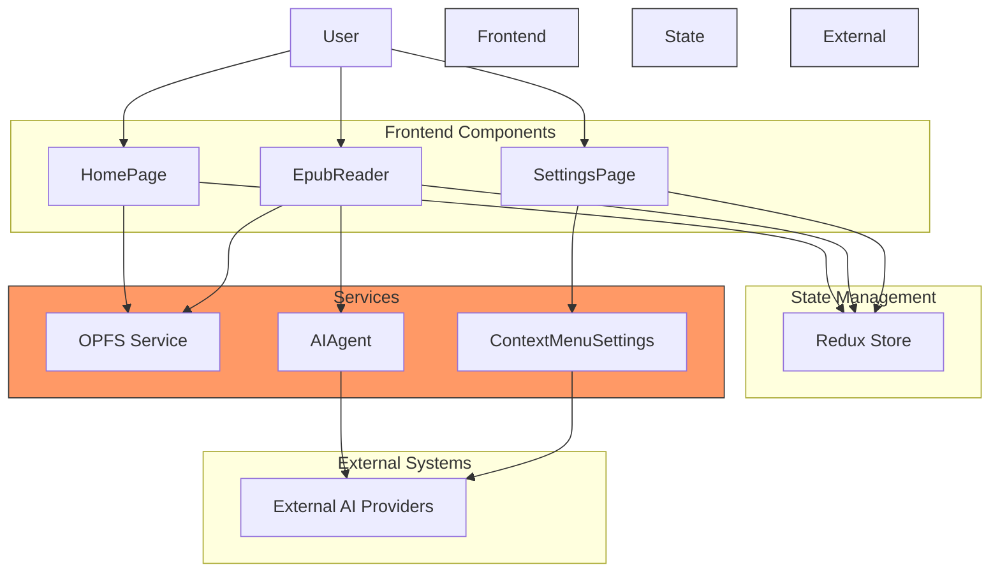

# Project Overview

<cite>
**Referenced Files in This Document**   
- [main.tsx](file://src/main.tsx)
- [router.tsx](file://src/config/router.tsx)
- [config.ts](file://src/config/config.ts)
- [bookshelfSlice.ts](file://src/store/slices/bookshelfSlice.ts)
- [aiProviders.ts](file://src/config/aiProviders.ts)
- [HomePage/index.tsx](file://src/pages/HomePage/index.tsx)
- [EpubReader/index.tsx](file://src/pages/EpubReader/index.tsx)
- [SettingsPage/index.tsx](file://src/pages/SettingsPage/index.tsx)
- [EPUBMetadataService.ts](file://src/services/EPUBMetadataService.ts)
- [AGENTS.md](file://AGENTS.md)
- [GEMINI.md](file://GEMINI.md)
- [CHANGELOG.md](file://CHANGELOG.md)
</cite>

## Table of Contents
1. [Introduction](#introduction)
2. [Core Vision and Purpose](#core-vision-and-purpose)
3. [Current Status and Version](#current-status-and-version)
4. [Primary User Workflows](#primary-user-workflows)
5. [Key Differentiators](#key-differentiators)
6. [Architectural Highlights](#architectural-highlights)
7. [System Context Diagram](#system-context-diagram)
8. [Common Beginner Questions](#common-beginner-questions)

## Introduction
The Immersive Reader (EPUB Reader) application is a modern, React-based EPUB reader designed to transform the digital reading experience through advanced AI integration and offline-first architecture. This document provides a comprehensive overview of the application's purpose, current status, user workflows, key features, and architectural design. The application enables users to upload, manage, and read EPUB books entirely offline using the Origin Private File System (OPFS), while providing AI-powered tools for contextual explanations, translations, and answers to user queries. The system is built with a modular, feature-based structure and strict TypeScript enforcement to ensure code quality and maintainability.

**Section sources**
- [GEMINI.md](file://GEMINI.md#L1-L110)
- [AGENTS.md](file://AGENTS.md#L1-L41)

## Core Vision and Purpose
The Immersive Reader application is designed to create a seamless and intelligent reading environment that combines offline accessibility with powerful AI assistance. The core vision is to enable users to read EPUB books without requiring an internet connection by leveraging OPFS for local storage, while simultaneously enhancing comprehension through context-aware AI tools. When users select text within a book, the application provides instant access to AI-powered explanations, translations, and answers through a context menu system. This integration allows readers to gain deeper understanding of complex passages, translate foreign language text, or explore related concepts without leaving the reading interface. The application's purpose extends beyond simple book reading to create an immersive learning environment where AI agents act as intelligent companions, providing contextual support tailored to the specific text being read.

**Section sources**
- [GEMINI.md](file://GEMINI.md#L5-L8)
- [AGENTS.md](file://AGENTS.md#L9-L14)

## Current Status and Version
The application is currently in Phase 3 of its development lifecycle, specifically focused on AI Integration, and is at version 0.0.9. This phase represents approximately 90% completion of the AI integration roadmap, indicating that the core AI functionality is largely implemented but may still be undergoing refinement and optimization. The recent changelog entries show active development in enhancing the context menu system, adding features like sticky headers, thumbtack controls for pinning maximized windows, and double-click toggling between normal and maximized modes. The application has established a stable foundation with key features such as EPUB rendering, OPFS storage management, and AI tool integration already functional, with ongoing work focused on improving the user experience and expanding AI capabilities.

**Section sources**
- [GEMINI.md](file://GEMINI.md#L7-L8)
- [CHANGELOG.md](file://CHANGELOG.md#L6-L36)

## Primary User Workflows
The application supports several primary user workflows that guide the reader through the complete experience from book management to AI-enhanced reading. The first workflow is book upload and management, where users can upload EPUB files through drag-and-drop or file selection on the HomePage. The application validates the EPUB format and stores the book in OPFS, making it available for offline reading. The second workflow is the reading experience itself, accessed through the EpubReader component, which provides navigation controls, table of contents access, and reading customization options. The third workflow involves interacting with AI tools, where users select text in the book to trigger a context menu with various AI-powered options like translation, explanation, or synonym lookup. The final workflow is tool configuration, accessible through the SettingsPage and ContextMenuSettingsPage, where users can customize AI providers, configure API keys, and manage their context menu tools. These workflows are interconnected, creating a cohesive experience from book acquisition to enhanced comprehension.

**Section sources**
- [HomePage/index.tsx](file://src/pages/HomePage/index.tsx#L22-L292)
- [EpubReader/index.tsx](file://src/pages/EpubReader/index.tsx#L23-L403)
- [SettingsPage/index.tsx](file://src/pages/SettingsPage/index.tsx#L3-L51)

## Key Differentiators
The Immersive Reader application distinguishes itself from other EPUB readers through several innovative features. The most significant differentiator is the context-aware AI agent system, which provides intelligent responses based on the specific text selection and surrounding context within the book. Unlike simple translation tools, these AI agents understand the semantic meaning of selected text within its literary context, enabling more accurate and relevant explanations. Another key differentiator is the draggable and maximizable context menus, which allow users to interact with AI tools in a flexible, window-like interface that can be positioned and resized according to their preferences. The application also features mobile optimization with volume-key navigation, enabling seamless page turning on mobile devices. Additionally, the stacked context menu system supports AI drilldown, allowing users to explore multiple layers of information from a single text selection, creating a rich, interactive learning experience.

**Section sources**
- [CHANGELOG.md](file://CHANGELOG.md#L20-L21)
- [EpubReader/index.tsx](file://src/pages/EpubReader/index.tsx#L84-L92)
- [GEMINI.md](file://GEMINI.md#L29-L30)

## Architectural Highlights
The application follows a clean, feature-based modular architecture with strict TypeScript enforcement throughout the codebase. The structure is organized around key directories: `src/pages/` for top-level route components, `src/components/` for reusable UI elements, `src/store/` for Redux state management, `src/services/` for business logic and external integrations, and `src/hooks/` for custom React hooks. A service-layer pattern is implemented to separate concerns, with heavy operations like file handling and text selection delegated to dedicated services such as OPFSManager and selection.service. The application uses Redux Toolkit for global state management, with the bookshelf state maintained in a dedicated slice that handles book metadata, loading states, and upload progress. The codebase adheres to functional programming patterns, favoring pure functions, immutability, and composition. TypeScript interfaces are used extensively to define data structures like BookMetadata, EPUBMetaData, and ContextMenuItem, ensuring type safety across the application.

**Section sources**
- [GEMINI.md](file://GEMINI.md#L25-L39)
- [bookshelfSlice.ts](file://src/store/slices/bookshelfSlice.ts#L1-L189)
- [types/book.ts](file://src/types/book.ts#L1-L116)
- [EPUBMetadataService.ts](file://src/services/EPUBMetadataService.ts#L1-L177)

## System Context Diagram
The following diagram illustrates the high-level system context of the Immersive Reader application, showing the primary components and their relationships.

**Diagram sources**
- [main.tsx](file://src/main.tsx#L1-L13)
- [router.tsx](file://src/config/router.tsx#L1-L58)
- [EpubReader/index.tsx](file://src/pages/EpubReader/index.tsx#L23-L403)
- [HomePage/index.tsx](file://src/pages/HomePage/index.tsx#L22-L292)
- [SettingsPage/index.tsx](file://src/pages/SettingsPage/index.tsx#L3-L51)
- [store/index.ts](file://src/store/index.ts#L1-L24)

## Common Beginner Questions
**What is the purpose of this project?** The project aims to create an immersive reading experience by combining offline EPUB reading with AI-powered contextual assistance, allowing users to gain deeper understanding of text through instant access to explanations, translations, and related information.

**How does offline reading work?** The application uses the Origin Private File System (OPFS) API to store EPUB books directly in the browser, allowing users to access their entire library without an internet connection.

**What AI capabilities are available?** Users can select text to access AI tools for contextual explanations, translations, synonym lookup, and other language processing tasks, with responses tailored to the specific context within the book.

**Can I use different AI providers?** Yes, the application supports multiple AI providers including OpenAI, Together AI, Mistral, Groq, and others, with a configuration interface that allows users to manage API keys and model preferences.

**Is my data secure?** All book content is stored locally in the browser's OPFS, and AI API keys are stored only in the user's browser, ensuring that personal data and credentials remain private.

**Section sources**
- [GEMINI.md](file://GEMINI.md#L5-L8)
- [AGENTS.md](file://AGENTS.md#L39-L41)
- [aiProviders.ts](file://src/config/aiProviders.ts#L1-L110)
- [config.ts](file://src/config/config.ts#L3-L116)