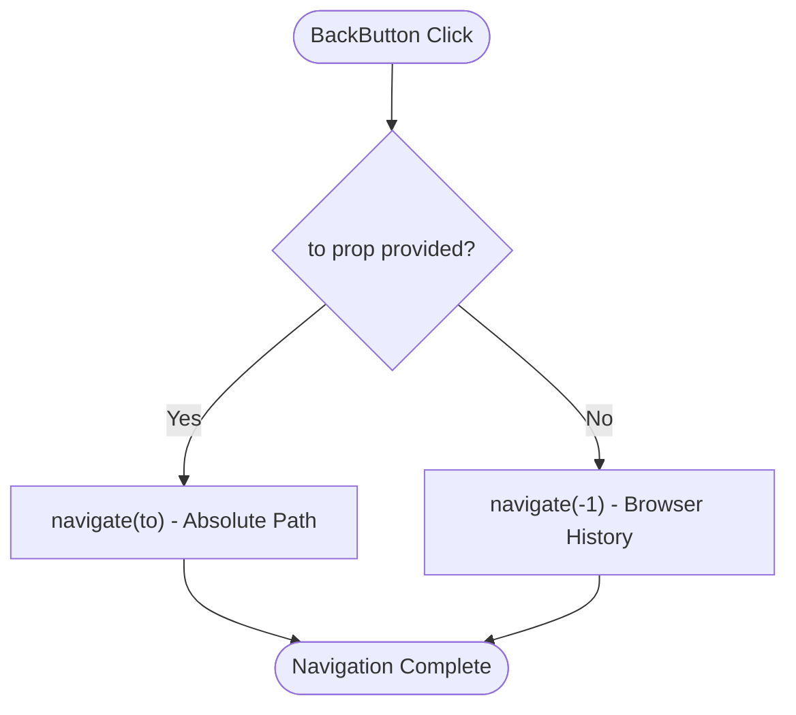
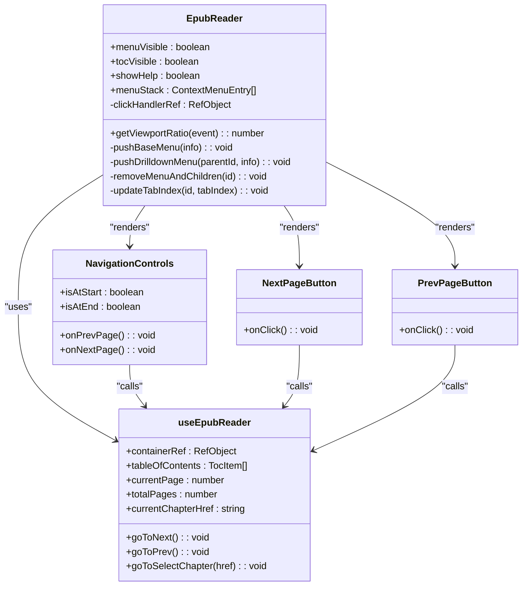
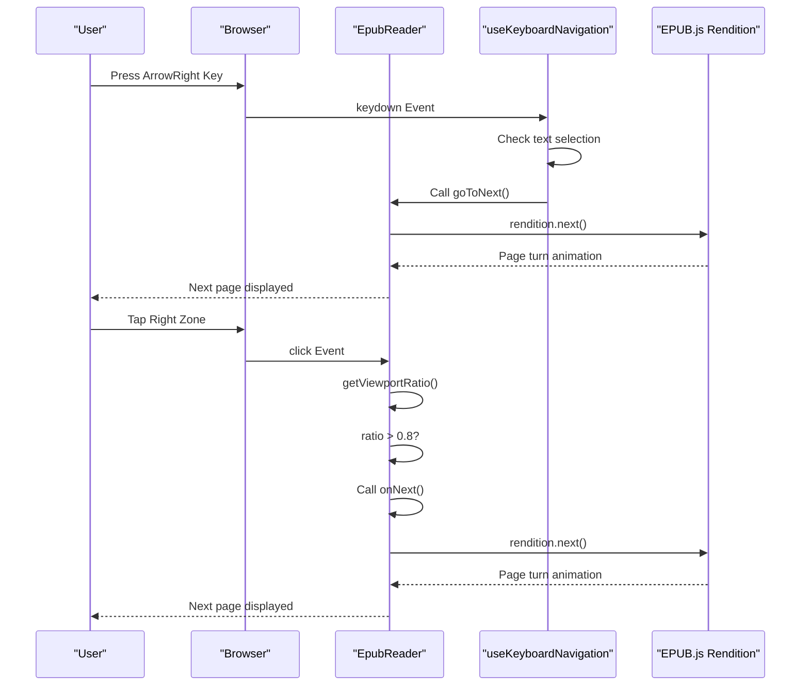
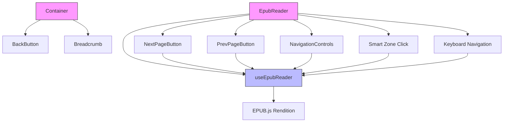

# Navigation Patterns

<cite>
**Referenced Files in This Document**   
- [BackButton/index.tsx](file://src/components/BackButton/index.tsx)
- [EpubReader/index.tsx](file://src/pages/EpubReader/index.tsx)
- [EpubReader/hooks/useEpubReader.ts](file://src/pages/EpubReader/hooks/useEpubReader.ts)
- [EpubReader/hooks/useKeyboardNavigator.ts](file://src/pages/EpubReader/hooks/useKeyboardNavigator.ts)
- [EpubReader/components/directory/NextPageButton.tsx](file://src/pages/EpubReader/components/directory/NextPageButton.tsx)
- [config/router.tsx](file://src/config/router.tsx)
- [Container.tsx](file://src/components/Container.tsx)
- [EpubReader/components/NavigationControls.tsx](file://src/pages/EpubReader/components/NavigationControls.tsx)
</cite>

## Table of Contents
1. [BackButton Component Implementation](#backbutton-component-implementation)
2. [EpubReader Navigation System](#epubreader-navigation-system)
3. [Reader-Specific Navigation Controls](#reader-specific-navigation-controls)
4. [Keyboard and Touch Navigation](#keyboard-and-touch-navigation)
5. [Integration Patterns](#integration-patterns)
6. [Accessibility and User Interaction](#accessibility-and-user-interaction)
7. [Troubleshooting Common Issues](#troubleshooting-common-issues)

## BackButton Component Implementation

The BackButton component implements history-based navigation using react-router-dom's useNavigate hook. It supports both relative navigation (browser history) and absolute path navigation through the optional 'to' prop. The component renders a styled button with an arrow icon and customizable label text.

The implementation follows a conditional navigation pattern: when the 'to' prop is provided, it performs absolute navigation to the specified route; otherwise, it uses relative navigation by going back one step in the browser history stack (-1). This dual-mode functionality allows the component to be reused in various contexts throughout the application.



**Diagram sources**
- [BackButton/index.tsx](file://src/components/BackButton/index.tsx#L13-L22)

**Section sources**
- [BackButton/index.tsx](file://src/components/BackButton/index.tsx#L1-L39)

## EpubReader Navigation System

The EpubReader page implements a comprehensive navigation system that combines application-level routing with reader-specific page navigation. The router configuration defines the '/reader/:bookId' route, which accepts a book identifier parameter for loading specific EPUB files.

The navigation system distinguishes between two primary navigation types: application navigation (moving between different pages of the app) and reader navigation (moving through pages within an EPUB book). The BackButton component is used for application-level navigation, allowing users to return to the bookshelf or other application sections.

```mermaid
graph TB
A[HomePage] --> |Open Book| B[EpubReader]
B --> |BackButton| A
B --> C[SettingsPage]
C --> |BackButton| B
B --> D[ContextMenuSettingsPage]
D --> |BackButton| B
subgraph "EpubReader Navigation"
E[PrevPageButton] < --> F[EPUB Content]
G[NextPageButton] < --> F
H[Smart Zone Click] < --> F
I[Keyboard Navigation] < --> F
end
```

**Diagram sources**
- [config/router.tsx](file://src/config/router.tsx#L12-L57)
- [EpubReader/index.tsx](file://src/pages/EpubReader/index.tsx#L23-L62)

**Section sources**
- [EpubReader/index.tsx](file://src/pages/EpubReader/index.tsx#L1-L403)
- [config/router.tsx](file://src/config/router.tsx#L1-L58)

## Reader-Specific Navigation Controls

The EpubReader implements multiple navigation methods for moving through book content, including dedicated navigation buttons, smart zone clicking, and keyboard shortcuts. The NextPageButton and PrevPageButton components provide touch-friendly navigation controls positioned at the edges of the reading area.

These reader-specific navigation controls are distinct from application-level navigation and operate within the EPUB.js rendering engine. They trigger page turns within the current book rather than changing application routes. The navigation is implemented through the useEpubReader hook, which provides goToNext and goToPrev functions that interface with the EPUB.js rendition object.



**Diagram sources**
- [EpubReader/index.tsx](file://src/pages/EpubReader/index.tsx#L80-L403)
- [EpubReader/hooks/useEpubReader.ts](file://src/pages/EpubReader/hooks/useEpubReader.ts#L96-L201)
- [EpubReader/components/directory/NextPageButton.tsx](file://src/pages/EpubReader/components/directory/NextPageButton.tsx#L1-L46)
- [EpubReader/components/NavigationControls.tsx](file://src/pages/EpubReader/components/NavigationControls.tsx#L1-L48)

**Section sources**
- [EpubReader/index.tsx](file://src/pages/EpubReader/index.tsx#L80-L403)
- [EpubReader/hooks/useEpubReader.ts](file://src/pages/EpubReader/hooks/useEpubReader.ts#L68-L89)
- [EpubReader/components/directory/NextPageButton.tsx](file://src/pages/EpubReader/components/directory/NextPageButton.tsx#L1-L46)

## Keyboard and Touch Navigation

The application implements comprehensive keyboard and touch navigation support through the useKeyboardNavigation hook and smart zone detection. The hook listens for keyboard events and translates arrow key presses into page navigation commands, while also supporting mobile volume keys for page turning on mobile devices.

Smart zone navigation divides the reading area into three regions: left (20% of width) for previous page, right (20% of width) for next page, and center for menu toggling. This allows users to navigate through the book with simple taps or swipes on touch devices. The implementation includes safeguards to prevent conflicts with text selection and context menu interactions.



**Diagram sources**
- [EpubReader/hooks/useKeyboardNavigator.ts](file://src/pages/EpubReader/hooks/useKeyboardNavigator.ts#L13-L47)
- [EpubReader/index.tsx](file://src/pages/EpubReader/index.tsx#L267-L303)

**Section sources**
- [EpubReader/hooks/useKeyboardNavigator.ts](file://src/pages/EpubReader/hooks/useKeyboardNavigator.ts#L1-L47)
- [EpubReader/index.tsx](file://src/pages/EpubReader/index.tsx#L267-L303)

## Integration Patterns

The navigation system demonstrates several integration patterns across components. The Container component integrates the BackButton with breadcrumb navigation, providing consistent header navigation across application pages. The EpubReader integrates multiple navigation methods including button controls, keyboard navigation, and touch gestures.

The useEpubReader hook serves as the central navigation coordinator, exposing navigation functions to various components while managing the EPUB.js rendition state. This pattern of centralized navigation logic with distributed controls allows for consistent behavior across different interaction methods.



**Diagram sources**
- [Container.tsx](file://src/components/Container.tsx#L1-L30)
- [EpubReader/index.tsx](file://src/pages/EpubReader/index.tsx#L80-L403)
- [EpubReader/hooks/useEpubReader.ts](file://src/pages/EpubReader/hooks/useEpubReader.ts#L96-L201)

**Section sources**
- [Container.tsx](file://src/components/Container.tsx#L1-L30)
- [EpubReader/index.tsx](file://src/pages/EpubReader/index.tsx#L80-L403)

## Accessibility and User Interaction

The navigation system incorporates several accessibility features to support diverse user interaction methods. Keyboard navigation is fully supported with arrow key controls, and the implementation includes checks to prevent navigation during text selection to avoid accidental page turns.

Touch interactions are optimized for mobile devices with large, edge-positioned navigation buttons and smart zone detection that accommodates various screen sizes. The implementation prevents event propagation conflicts by using stopPropagation in button handlers and includes timing thresholds to distinguish between different interaction types.

Accessibility attributes such as aria-label are included in navigation controls, and visual feedback is provided through hover states and disabled button styling. The system also maintains proper focus management and supports screen readers through semantic HTML elements.

**Section sources**
- [EpubReader/components/directory/NextPageButton.tsx](file://src/pages/EpubReader/components/directory/NextPageButton.tsx#L27-L31)
- [EpubReader/components/NavigationControls.tsx](file://src/pages/EpubReader/components/NavigationControls.tsx#L27-L28)
- [EpubReader/index.tsx](file://src/pages/EpubReader/index.tsx#L270-L273)

## Troubleshooting Common Issues

Common navigation issues in the application typically involve event propagation conflicts, incorrect route transitions, and navigation timing issues. Event propagation conflicts can occur when multiple event handlers intercept the same user action, which is mitigated by using stopPropagation in button handlers and implementing timing thresholds.

Incorrect route transitions may happen when the BackButton's 'to' prop is incorrectly specified or when navigation occurs during asynchronous operations. The implementation includes safeguards such as cleanup functions in useEffect hooks and proper state management to prevent race conditions.

Timing issues can affect the smart zone navigation, where rapid successive clicks might be misinterpreted. The implementation includes a 500ms threshold after text selection to prevent conflicts between selection and navigation gestures. For keyboard navigation on mobile devices, the system attempts to prevent default volume change behavior while still allowing navigation through volume keys.

**Section sources**
- [EpubReader/index.tsx](file://src/pages/EpubReader/index.tsx#L270-L273)
- [EpubReader/components/directory/NextPageButton.tsx](file://src/pages/EpubReader/components/directory/NextPageButton.tsx#L29-L31)
- [EpubReader/hooks/useKeyboardNavigator.ts](file://src/pages/EpubReader/hooks/useKeyboardNavigator.ts#L22-L23)