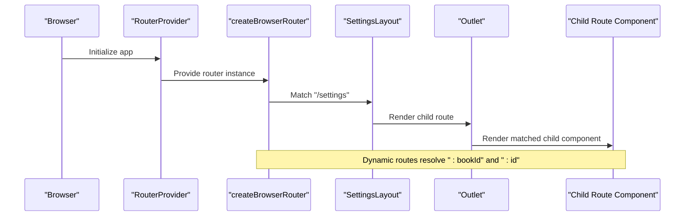

# Route Configuration

<cite>
**Referenced Files in This Document**
- [router.tsx](file://src/config/router.tsx)
- [SettingsLayout.tsx](file://src/pages/SettingsPage/SettingsLayout.tsx)
- [BookshelfPage/index.tsx](file://src/pages/HomePage/index.tsx)
- [EpubReader/index.tsx](file://src/pages/EpubReader/index.tsx)
- [SettingsPage/index.tsx](file://src/pages/SettingsPage/index.tsx)
- [StoragePage.tsx](file://src/pages/SettingsPage/StoragePage.tsx)
- [AboutPage.tsx](file://src/pages/SettingsPage/AboutPage.tsx)
- [ContextMenuSettingsPage/index.tsx](file://src/pages/ContextMenuSettingsPage/index.tsx)
- [ToolEditPage/index.tsx](file://src/pages/ToolEditPage/index.tsx)
- [ToolExtractPage/index.tsx](file://src/pages/ToolExtractPage/index.tsx)
- [main.tsx](file://src/main.tsx)
</cite>

## Table of Contents
1. [Introduction](#introduction)
2. [Project Structure](#project-structure)
3. [Core Components](#core-components)
4. [Architecture Overview](#architecture-overview)
5. [Detailed Component Analysis](#detailed-component-analysis)
6. [Dependency Analysis](#dependency-analysis)
7. [Performance Considerations](#performance-considerations)
8. [Troubleshooting Guide](#troubleshooting-guide)
9. [Conclusion](#conclusion)

## Introduction
This section documents the route configuration for the application using react-router-dom v6. It focuses on the structure defined in src/config/router.tsx, covering root routes, nested settings routes, dynamic parameters, and how route elements map to page components. It also explains the role of layout routes, index routes, and redirects, and provides guidance on best practices, code splitting opportunities, and router integration within the overall application.

## Project Structure
The routing configuration is centralized in a single router definition and consumed by the application’s root entry point. The router defines:
- Root routes for the home and reader experiences
- A settings route group with nested child routes
- Additional dynamic routes for tool editing and extraction

**Diagram sources**
- [main.tsx](file://src/main.tsx#L1-L12)
- [router.tsx](file://src/config/router.tsx#L1-L58)
- [BookshelfPage/index.tsx](file://src/pages/HomePage/index.tsx#L1-L292)
- [EpubReader/index.tsx](file://src/pages/EpubReader/index.tsx#L1-L403)
- [SettingsLayout.tsx](file://src/pages/SettingsPage/SettingsLayout.tsx#L1-L89)
- [SettingsPage/index.tsx](file://src/pages/SettingsPage/index.tsx#L1-L51)
- [StoragePage.tsx](file://src/pages/SettingsPage/StoragePage.tsx#L1-L190)
- [AboutPage.tsx](file://src/pages/SettingsPage/AboutPage.tsx#L1-L105)
- [ContextMenuSettingsPage/index.tsx](file://src/pages/ContextMenuSettingsPage/index.tsx#L1-L273)
- [ToolEditPage/index.tsx](file://src/pages/ToolEditPage/index.tsx#L1-L208)
- [ToolExtractPage/index.tsx](file://src/pages/ToolExtractPage/index.tsx#L1-L202)

**Section sources**
- [main.tsx](file://src/main.tsx#L1-L12)
- [router.tsx](file://src/config/router.tsx#L1-L58)

## Core Components
- Root routes
  - "/" renders the BookshelfPage component, serving as the landing page for the application.
  - "/reader/:bookId" renders the EpubReader component, enabling reading with a dynamic book identifier.
- Settings layout and nested routes
  - "/settings" uses SettingsLayout as a layout route, which wraps child routes and provides a shared navigation rail and outlet.
  - Nested children under "/settings":
    - Index route navigates to "general" by default.
    - "general" renders GeneralPage.
    - "storage" renders StoragePage.
    - "contextmenu" renders ContextMenuSettingsPage.
    - "about" renders AboutPage.
- Additional dynamic routes
  - "/settings/contextmenu/:id/edit" renders ToolEditPage with a dynamic tool identifier for editing.
  - "/settings/contextmenu/add-tool" renders ToolExtractPage for adding new tools.

These route definitions map directly to page components and leverage react-router-dom v6 features such as layout routes, nested routes, index routes, and dynamic parameters.

**Section sources**
- [router.tsx](file://src/config/router.tsx#L1-L58)
- [SettingsLayout.tsx](file://src/pages/SettingsPage/SettingsLayout.tsx#L1-L89)
- [BookshelfPage/index.tsx](file://src/pages/HomePage/index.tsx#L1-L292)
- [EpubReader/index.tsx](file://src/pages/EpubReader/index.tsx#L1-L403)
- [SettingsPage/index.tsx](file://src/pages/SettingsPage/index.tsx#L1-L51)
- [StoragePage.tsx](file://src/pages/SettingsPage/StoragePage.tsx#L1-L190)
- [AboutPage.tsx](file://src/pages/SettingsPage/AboutPage.tsx#L1-L105)
- [ContextMenuSettingsPage/index.tsx](file://src/pages/ContextMenuSettingsPage/index.tsx#L1-L273)
- [ToolEditPage/index.tsx](file://src/pages/ToolEditPage/index.tsx#L1-L208)
- [ToolExtractPage/index.tsx](file://src/pages/ToolExtractPage/index.tsx#L1-L202)

## Architecture Overview
The router is created with createBrowserRouter and mounted via RouterProvider in the application entry point. The settings route group uses a layout route to share navigation and content areas across child routes. Dynamic routes enable editing and creation of tools with parameterized URLs.

**Diagram sources**
- [main.tsx](file://src/main.tsx#L1-L12)
- [router.tsx](file://src/config/router.tsx#L1-L58)
- [SettingsLayout.tsx](file://src/pages/SettingsPage/SettingsLayout.tsx#L1-L89)

## Detailed Component Analysis

### Root Routes
- "/" -> BookshelfPage
  - Purpose: Display the user’s bookshelf, handle uploads, and navigate to the reader.
  - Navigation: Uses programmatic navigation to "/reader/:bookId" when opening a book.
- "/reader/:bookId" -> EpubReader
  - Purpose: Load and render an EPUB reader for the given book identifier.
  - Parameter: :bookId extracted via useParams and used to fetch the book metadata.

**Diagram sources**
- [BookshelfPage/index.tsx](file://src/pages/HomePage/index.tsx#L1-L292)
- [EpubReader/index.tsx](file://src/pages/EpubReader/index.tsx#L1-L403)
- [router.tsx](file://src/config/router.tsx#L1-L58)

**Section sources**
- [router.tsx](file://src/config/router.tsx#L1-L58)
- [BookshelfPage/index.tsx](file://src/pages/HomePage/index.tsx#L1-L292)
- [EpubReader/index.tsx](file://src/pages/EpubReader/index.tsx#L1-L403)

### Settings Layout and Nested Routes
- "/settings" -> SettingsLayout
  - Purpose: Provides a shared layout with a left navigation rail and a content outlet.
  - Navigation: Uses NavLink to link to child routes and Outlet to render the active child.
- Nested children:
  - Index route navigates to "general" by default using Navigate.
  - "general" -> GeneralPage
  - "storage" -> StoragePage
  - "contextmenu" -> ContextMenuSettingsPage
  - "about" -> AboutPage

**Diagram sources**
- [router.tsx](file://src/config/router.tsx#L1-L58)
- [SettingsLayout.tsx](file://src/pages/SettingsPage/SettingsLayout.tsx#L1-L89)

**Section sources**
- [router.tsx](file://src/config/router.tsx#L1-L58)
- [SettingsLayout.tsx](file://src/pages/SettingsPage/SettingsLayout.tsx#L1-L89)
- [SettingsPage/index.tsx](file://src/pages/SettingsPage/index.tsx#L1-L51)
- [StoragePage.tsx](file://src/pages/SettingsPage/StoragePage.tsx#L1-L190)
- [AboutPage.tsx](file://src/pages/SettingsPage/AboutPage.tsx#L1-L105)
- [ContextMenuSettingsPage/index.tsx](file://src/pages/ContextMenuSettingsPage/index.tsx#L1-L273)

### Dynamic Routes for Tool Editing and Extraction
- "/settings/contextmenu/:id/edit" -> ToolEditPage
  - Purpose: Edit an existing tool by index derived from the :id parameter.
  - Parameter: :id parsed to determine the tool index; validation ensures the index is within bounds.
- "/settings/contextmenu/add-tool" -> ToolExtractPage
  - Purpose: Add a new tool via a dedicated form page.

**Diagram sources**
- [router.tsx](file://src/config/router.tsx#L1-L58)
- [ToolEditPage/index.tsx](file://src/pages/ToolEditPage/index.tsx#L1-L208)
- [ToolExtractPage/index.tsx](file://src/pages/ToolExtractPage/index.tsx#L1-L202)

**Section sources**
- [router.tsx](file://src/config/router.tsx#L1-L58)
- [ToolEditPage/index.tsx](file://src/pages/ToolEditPage/index.tsx#L1-L208)
- [ToolExtractPage/index.tsx](file://src/pages/ToolExtractPage/index.tsx#L1-L202)

### Route Element Mapping to Page Components
- "/" -> BookshelfPage
- "/reader/:bookId" -> EpubReader
- "/settings" -> SettingsLayout
- "/settings/general" -> GeneralPage
- "/settings/storage" -> StoragePage
- "/settings/contextmenu" -> ContextMenuSettingsPage
- "/settings/about" -> AboutPage
- "/settings/contextmenu/:id/edit" -> ToolEditPage
- "/settings/contextmenu/add-tool" -> ToolExtractPage

This mapping is explicit in the router configuration and aligns with the component exports and imports shown in the referenced files.

**Section sources**
- [router.tsx](file://src/config/router.tsx#L1-L58)
- [BookshelfPage/index.tsx](file://src/pages/HomePage/index.tsx#L1-L292)
- [EpubReader/index.tsx](file://src/pages/EpubReader/index.tsx#L1-L403)
- [SettingsLayout.tsx](file://src/pages/SettingsPage/SettingsLayout.tsx#L1-L89)
- [SettingsPage/index.tsx](file://src/pages/SettingsPage/index.tsx#L1-L51)
- [StoragePage.tsx](file://src/pages/SettingsPage/StoragePage.tsx#L1-L190)
- [AboutPage.tsx](file://src/pages/SettingsPage/AboutPage.tsx#L1-L105)
- [ContextMenuSettingsPage/index.tsx](file://src/pages/ContextMenuSettingsPage/index.tsx#L1-L273)
- [ToolEditPage/index.tsx](file://src/pages/ToolEditPage/index.tsx#L1-L208)
- [ToolExtractPage/index.tsx](file://src/pages/ToolExtractPage/index.tsx#L1-L202)

## Dependency Analysis
- Router-to-component dependencies
  - router.tsx imports all page components and layout components and passes them as route elements.
  - SettingsLayout depends on react-router-dom’s Outlet and NavLink to render child routes and provide navigation.
- Parameter extraction
  - EpubReader uses useParams to extract :bookId.
  - ToolEditPage uses useParams to extract :id and validates it against the available tools.
- Programmatic navigation
  - BookshelfPage uses useNavigate to move to "/reader/:bookId".
  - ToolEditPage and ToolExtractPage use useNavigate to return to "/settings/contextmenu".

**Diagram sources**
- [router.tsx](file://src/config/router.tsx#L1-L58)
- [SettingsLayout.tsx](file://src/pages/SettingsPage/SettingsLayout.tsx#L1-L89)

**Section sources**
- [router.tsx](file://src/config/router.tsx#L1-L58)
- [SettingsLayout.tsx](file://src/pages/SettingsPage/SettingsLayout.tsx#L1-L89)
- [BookshelfPage/index.tsx](file://src/pages/HomePage/index.tsx#L1-L292)
- [EpubReader/index.tsx](file://src/pages/EpubReader/index.tsx#L1-L403)
- [ToolEditPage/index.tsx](file://src/pages/ToolEditPage/index.tsx#L1-L208)
- [ToolExtractPage/index.tsx](file://src/pages/ToolExtractPage/index.tsx#L1-L202)

## Performance Considerations
- Code splitting potential
  - The router currently imports all page components directly. To optimize initial load, consider lazy-loading route elements using React.lazy and Suspense around RouterProvider. This would defer loading of heavy pages until their routes are accessed.
  - Example approach:
    - Wrap RouterProvider with a Suspense boundary.
    - Replace static imports with dynamic imports for heavy pages (e.g., EpubReader, ContextMenuSettingsPage).
    - Keep frequently visited routes (/, /reader/:bookId) eager to minimize perceived latency.
- Bundle size
  - Consolidating route definitions in a single file simplifies maintenance but can increase initial bundle size. Lazy loading improves startup performance.
- Rendering performance
  - EpubReader performs book loading and cleanup; ensure cleanup logic runs on unmount to prevent memory leaks.
  - ToolEditPage validates the :id parameter before rendering to avoid unnecessary work.

[No sources needed since this section provides general guidance]

## Troubleshooting Guide
- Index redirect not working
  - Verify the index route under "/settings" uses Navigate to "general". If the redirect fails, confirm the child routes are defined and the layout route is correctly configured.
- Dynamic parameter parsing
  - For "/reader/:bookId", ensure useParams is used to extract the book identifier and that the parameter is validated before loading resources.
  - For "/settings/contextmenu/:id/edit", ensure the :id parameter is parsed to a number and validated against the available tools.
- Navigation issues
  - Confirm useNavigate is used consistently for programmatic navigation from BookshelfPage and tool pages.
- Layout rendering
  - Ensure SettingsLayout renders Outlet and that child routes match the expected paths.

**Section sources**
- [router.tsx](file://src/config/router.tsx#L1-L58)
- [SettingsLayout.tsx](file://src/pages/SettingsPage/SettingsLayout.tsx#L1-L89)
- [BookshelfPage/index.tsx](file://src/pages/HomePage/index.tsx#L1-L292)
- [EpubReader/index.tsx](file://src/pages/EpubReader/index.tsx#L1-L403)
- [ToolEditPage/index.tsx](file://src/pages/ToolEditPage/index.tsx#L1-L208)

## Conclusion
The route configuration organizes the application into clear, maintainable segments: root pages for browsing and reading, a settings layout with nested child routes, and dynamic routes for tool management. The use of layout routes, index routes, and redirects provides a coherent user experience. Adopting lazy loading can improve performance, while keeping route definitions centralized enhances discoverability and maintainability.