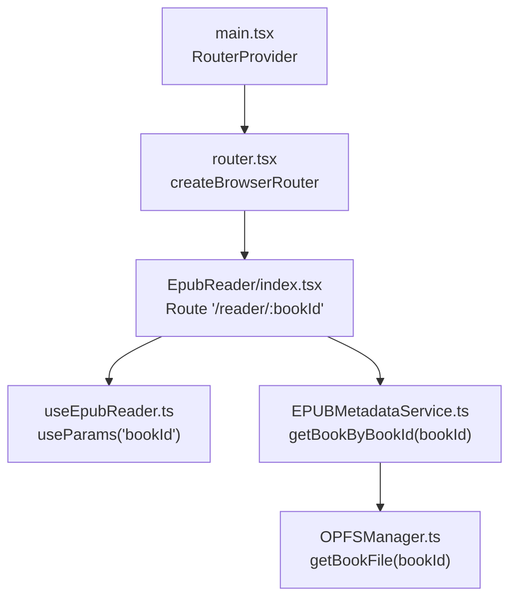
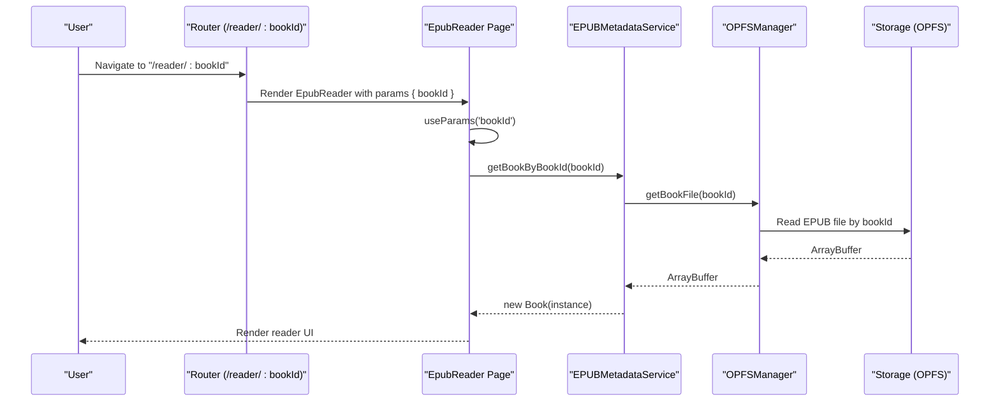
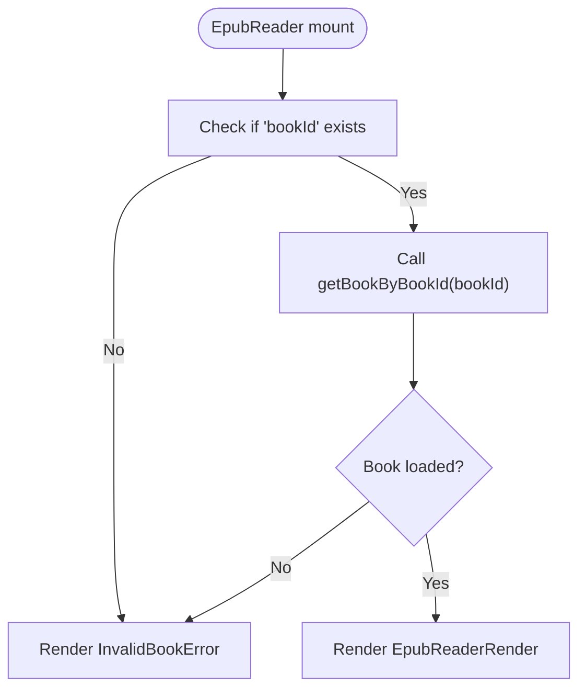
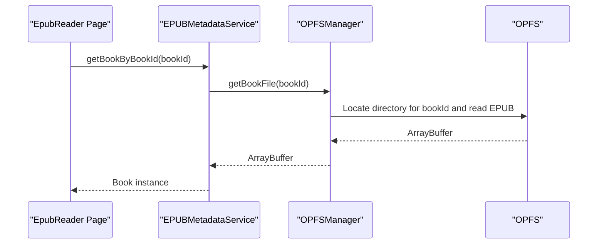
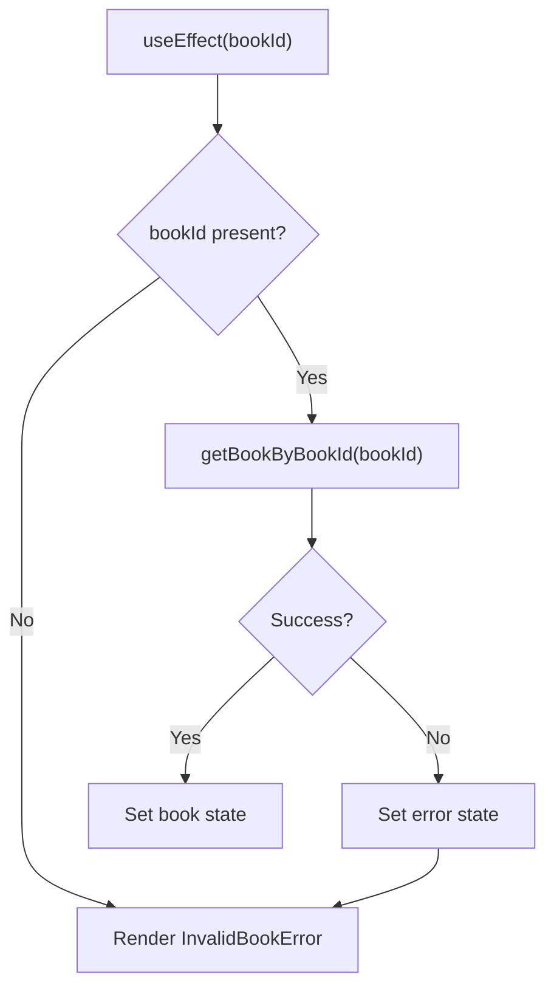
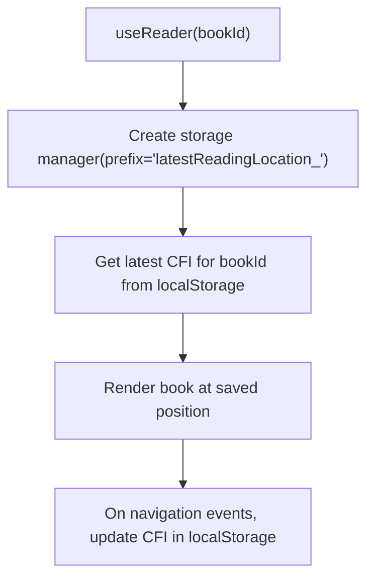
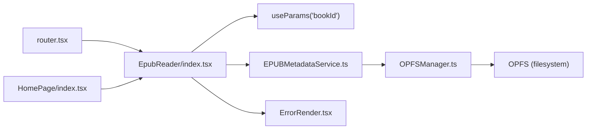

# Route Parameters

<cite>
**Referenced Files in This Document**
- [router.tsx](file://src/config/router.tsx)
- [main.tsx](file://src/main.tsx)
- [EpubReader/index.tsx](file://src/pages/EpubReader/index.tsx)
- [useEpubReader.ts](file://src/pages/EpubReader/hooks/useEpubReader.ts)
- [EPUBMetadataService.ts](file://src/services/EPUBMetadataService.ts)
- [OPFSManager.ts](file://src/services/OPFSManager.ts)
- [HomePage/index.tsx](file://src/pages/HomePage/index.tsx)
- [ErrorRender.tsx](file://src/pages/EpubReader/components/ErrorRender.tsx)
- [book.ts](file://src/types/book.ts)
- [epub.utils.ts](file://src/pages/EpubReader/hooks/epub.utils.ts)
</cite>

## Table of Contents
1. [Introduction](#introduction)
2. [Project Structure](#project-structure)
3. [Core Components](#core-components)
4. [Architecture Overview](#architecture-overview)
5. [Detailed Component Analysis](#detailed-component-analysis)
6. [Dependency Analysis](#dependency-analysis)
7. [Performance Considerations](#performance-considerations)
8. [Troubleshooting Guide](#troubleshooting-guide)
9. [Conclusion](#conclusion)

## Introduction
This document explains how route parameters are handled for the application’s dynamic segment :bookId in the '/reader/:bookId' route. It covers how the router defines dynamic segments, how the EpubReader component accesses the parameter via useParams, and the end-to-end data flow from URL parameter to loading the corresponding EPUB file from storage. It also documents error handling for invalid or missing book IDs, navigation construction with Link and useNavigate, state persistence strategies for reading progress keyed by bookId, and security considerations around input validation and sanitization of route parameters.

## Project Structure
The routing is configured at the application root and the reader page is a dedicated route with a dynamic segment. The main entry point wires the router into the Redux store and renders the app.

**Diagram sources**
- [main.tsx](file://src/main.tsx#L1-L12)
- [router.tsx](file://src/config/router.tsx#L12-L20)
- [EpubReader/index.tsx](file://src/pages/EpubReader/index.tsx#L23-L44)
- [useEpubReader.ts](file://src/pages/EpubReader/hooks/useEpubReader.ts#L96-L100)
- [EPUBMetadataService.ts](file://src/services/EPUBMetadataService.ts#L164-L176)
- [OPFSManager.ts](file://src/services/OPFSManager.ts#L266-L285)

**Section sources**
- [main.tsx](file://src/main.tsx#L1-L12)
- [router.tsx](file://src/config/router.tsx#L12-L20)

## Core Components
- Router configuration defines the '/reader/:bookId' route with a dynamic segment named bookId.
- EpubReader component reads the bookId parameter and loads the corresponding EPUB from storage.
- EPUBMetadataService resolves the book instance by retrieving the EPUB file from OPFS via OPFSManager.
- OPFSManager encapsulates storage operations and ensures the bookId corresponds to a valid directory and EPUB file.
- Error handling displays an invalid book ID error when the parameter is missing or resolution fails.
- Navigation uses useNavigate to construct links to '/reader/:bookId' from the bookshelf.

**Section sources**
- [router.tsx](file://src/config/router.tsx#L12-L20)
- [EpubReader/index.tsx](file://src/pages/EpubReader/index.tsx#L23-L62)
- [EPUBMetadataService.ts](file://src/services/EPUBMetadataService.ts#L164-L176)
- [OPFSManager.ts](file://src/services/OPFSManager.ts#L266-L285)
- [HomePage/index.tsx](file://src/pages/HomePage/index.tsx#L46-L48)

## Architecture Overview
The flow from URL parameter to rendered EPUB involves the router, the reader component, service layer, and storage manager.

**Diagram sources**
- [router.tsx](file://src/config/router.tsx#L12-L20)
- [EpubReader/index.tsx](file://src/pages/EpubReader/index.tsx#L23-L44)
- [EPUBMetadataService.ts](file://src/services/EPUBMetadataService.ts#L164-L176)
- [OPFSManager.ts](file://src/services/OPFSManager.ts#L266-L285)

## Detailed Component Analysis

### Router Dynamic Segment Definition
- The router defines the '/reader/:bookId' route with a dynamic segment named bookId.
- This enables URLs like '/reader/abc123' where abc123 is the book identifier.

**Section sources**
- [router.tsx](file://src/config/router.tsx#L12-L20)

### Accessing the Parameter in EpubReader
- The EpubReader component extracts bookId using useParams and initiates loading when the parameter is present.
- If bookId is missing, the component renders an invalid book ID error page.

**Diagram sources**
- [EpubReader/index.tsx](file://src/pages/EpubReader/index.tsx#L23-L62)

**Section sources**
- [EpubReader/index.tsx](file://src/pages/EpubReader/index.tsx#L23-L62)

### Data Flow to Load EPUB from Storage
- EPUBMetadataService.getBookByBookId(bookId) retrieves the EPUB file from OPFS via OPFSManager.getBookFile(bookId).
- The service constructs a Book instance from the ArrayBuffer and returns it to the caller.

**Diagram sources**
- [EPUBMetadataService.ts](file://src/services/EPUBMetadataService.ts#L164-L176)
- [OPFSManager.ts](file://src/services/OPFSManager.ts#L266-L285)

**Section sources**
- [EPUBMetadataService.ts](file://src/services/EPUBMetadataService.ts#L164-L176)
- [OPFSManager.ts](file://src/services/OPFSManager.ts#L266-L285)

### Error Handling for Invalid or Missing Book IDs
- Missing bookId: The component returns an invalid book ID error page.
- Resolution failure: The component catches errors from loading and sets an error state, then renders the invalid book ID error page.
- The error page displays a friendly message and optionally shows the caught error.

**Diagram sources**
- [EpubReader/index.tsx](file://src/pages/EpubReader/index.tsx#L23-L62)
- [ErrorRender.tsx](file://src/pages/EpubReader/components/ErrorRender.tsx#L1-L17)

**Section sources**
- [EpubReader/index.tsx](file://src/pages/EpubReader/index.tsx#L23-L62)
- [ErrorRender.tsx](file://src/pages/EpubReader/components/ErrorRender.tsx#L1-L17)

### Constructing Navigation Links with Parameters
- From the bookshelf, navigation to the reader uses useNavigate to build '/reader/:bookId'.
- The HomePage component demonstrates constructing a link to '/reader/:bookId' using the book’s id.

**Section sources**
- [HomePage/index.tsx](file://src/pages/HomePage/index.tsx#L46-L48)

### State Persistence and Reading Progress Association
- Reading progress is persisted per bookId using localStorage with a prefixed key managed by a storage manager.
- The hook initializes a storage manager with a prefix and reads the last known CFI for the current bookId to resume reading.
- The progress percentage is computed from currentPage and totalPages in the reader UI.

**Diagram sources**
- [useEpubReader.ts](file://src/pages/EpubReader/hooks/useEpubReader.ts#L52-L52)
- [useEpubReader.ts](file://src/pages/EpubReader/hooks/useEpubReader.ts#L165-L166)
- [epub.utils.ts](file://src/pages/EpubReader/hooks/epub.utils.ts#L1-L10)

**Section sources**
- [useEpubReader.ts](file://src/pages/EpubReader/hooks/useEpubReader.ts#L52-L52)
- [useEpubReader.ts](file://src/pages/EpubReader/hooks/useEpubReader.ts#L165-L166)
- [epub.utils.ts](file://src/pages/EpubReader/hooks/epub.utils.ts#L1-L10)
- [book.ts](file://src/types/book.ts#L30-L55)

### Security Considerations
- Input validation and sanitization:
  - Route parameter bookId is validated implicitly by successful retrieval from OPFS. If the directory for bookId does not exist or the EPUB file is missing, an error is thrown and surfaced to the user.
  - OPFSManager.getBookFile(bookId) performs directory traversal and file lookup; failures are converted into errors indicating missing EPUB files.
  - EPUBMetadataService.getBookByBookId(bookId) relies on OPFSManager to locate the file; any failure bubbles up as an error.
- Additional safeguards:
  - The application stores sensitive configuration (e.g., AI tool settings) locally in the browser; guidance emphasizes avoiding committing secrets and trimming logs before sharing.
  - The bookshelf state includes metadata such as id, name, path, and optional progress; these fields are derived from OPFS-managed data and metadata extraction.

**Section sources**
- [OPFSManager.ts](file://src/services/OPFSManager.ts#L266-L285)
- [EPUBMetadataService.ts](file://src/services/EPUBMetadataService.ts#L164-L176)
- [AGENTS.md](file://AGENTS.md#L38-L41)

## Dependency Analysis
The following diagram shows the primary dependencies among components involved in route parameter handling and EPUB loading.

**Diagram sources**
- [router.tsx](file://src/config/router.tsx#L12-L20)
- [EpubReader/index.tsx](file://src/pages/EpubReader/index.tsx#L23-L62)
- [EPUBMetadataService.ts](file://src/services/EPUBMetadataService.ts#L164-L176)
- [OPFSManager.ts](file://src/services/OPFSManager.ts#L266-L285)
- [ErrorRender.tsx](file://src/pages/EpubReader/components/ErrorRender.tsx#L1-L17)
- [HomePage/index.tsx](file://src/pages/HomePage/index.tsx#L46-L48)

**Section sources**
- [router.tsx](file://src/config/router.tsx#L12-L20)
- [EpubReader/index.tsx](file://src/pages/EpubReader/index.tsx#L23-L62)
- [EPUBMetadataService.ts](file://src/services/EPUBMetadataService.ts#L164-L176)
- [OPFSManager.ts](file://src/services/OPFSManager.ts#L266-L285)
- [ErrorRender.tsx](file://src/pages/EpubReader/components/ErrorRender.tsx#L1-L17)
- [HomePage/index.tsx](file://src/pages/HomePage/index.tsx#L46-L48)

## Performance Considerations
- Lazy loading: The reader component only attempts to load the book when bookId is present, preventing unnecessary work.
- Cleanup: The component destroys the book instance on unmount to free resources.
- Local storage access: Persisting reading position is lightweight and occurs on navigation events; debouncing is used for selection events to reduce overhead.
- OPFS operations: Retrieving the EPUB file is performed asynchronously; ensure UI remains responsive by showing a loading state while the book is being prepared.

[No sources needed since this section provides general guidance]

## Troubleshooting Guide
- Invalid book ID or missing parameter:
  - Symptom: The reader shows an invalid book ID error page.
  - Cause: bookId is absent or getBookByBookId fails to resolve the EPUB.
  - Resolution: Verify the URL includes a valid bookId and that the book exists in OPFS.
- EPUB file not found in OPFS:
  - Symptom: Error thrown indicating EPUB file not found in book directory.
  - Cause: The directory for bookId exists but does not contain an EPUB file.
  - Resolution: Re-upload the book or ensure the correct bookId is used.
- OPFS not supported:
  - Symptom: Browser compatibility warnings or errors during initialization.
  - Resolution: Use a compatible browser or adjust expectations accordingly.

**Section sources**
- [EpubReader/index.tsx](file://src/pages/EpubReader/index.tsx#L23-L62)
- [OPFSManager.ts](file://src/services/OPFSManager.ts#L266-L285)
- [HomePage/index.tsx](file://src/pages/HomePage/index.tsx#L227-L244)

## Conclusion
The application’s route parameter handling for :bookId in '/reader/:bookId' is straightforward and robust. The router exposes the parameter, the reader component validates its presence, and the service layer resolves the EPUB from OPFS. Errors are surfaced gracefully, and reading progress is persisted per bookId. Security is addressed by relying on OPFS-backed storage and by treating sensitive configuration as local-only data. Navigation to the reader is constructed using useNavigate with the bookId parameter, ensuring consistent linking across the application.