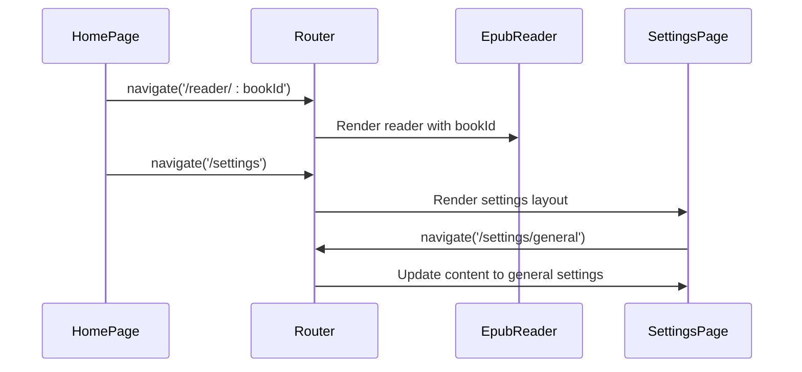
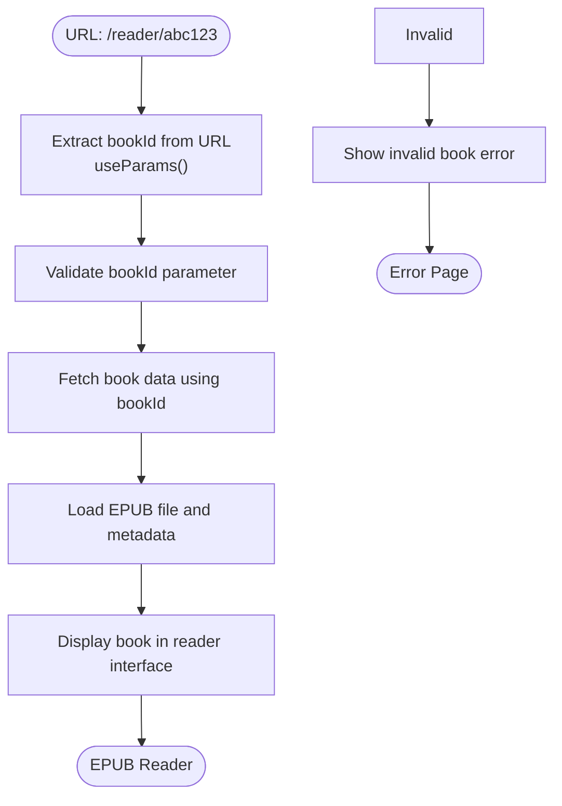
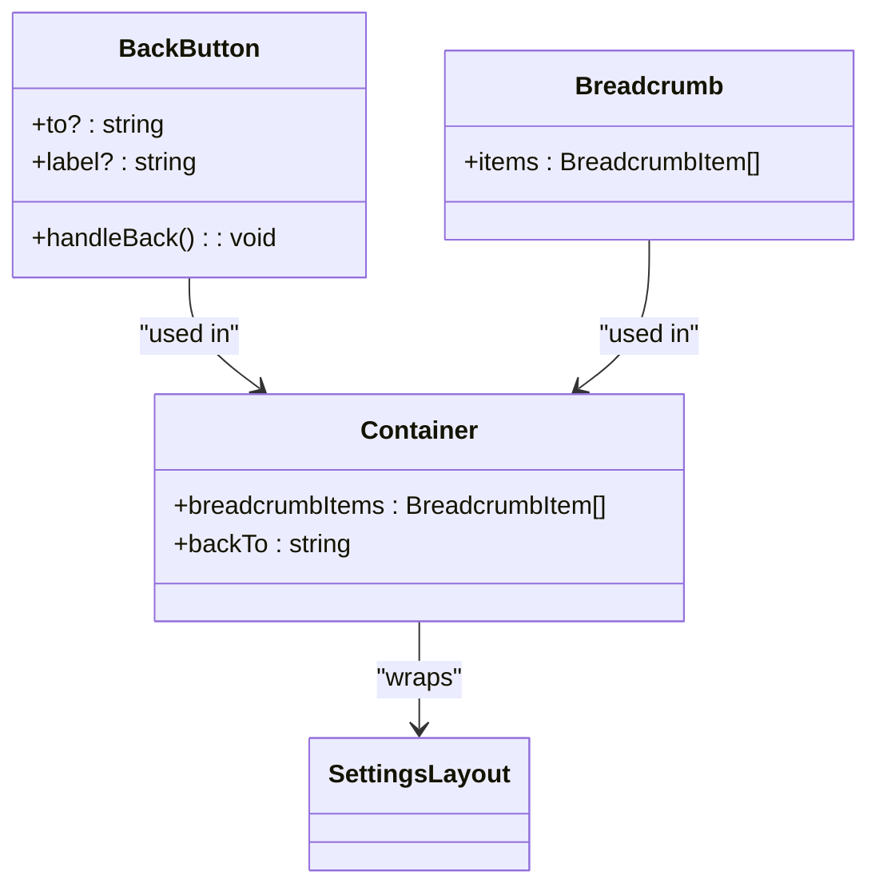

# Routing & Navigation

<cite>
**Referenced Files in This Document**   
- [router.tsx](file://src/config/router.tsx)
- [main.tsx](file://src/main.tsx)
- [HomePage/index.tsx](file://src/pages/HomePage/index.tsx)
- [EpubReader/index.tsx](file://src/pages/EpubReader/index.tsx)
- [SettingsPage/SettingsLayout.tsx](file://src/pages/SettingsPage/SettingsLayout.tsx)
- [BackButton/index.tsx](file://src/components/BackButton/index.tsx)
- [Breadcrumb/index.tsx](file://src/components/Breadcrumb/index.tsx)
</cite>

## Table of Contents
1. [Route Structure](#route-structure)
2. [Navigation Patterns](#navigation-patterns)
3. [Route Parameters](#route-parameters)
4. [Navigation Components](#navigation-components)
5. [Error Handling](#error-handling)
6. [Performance Considerations](#performance-considerations)

## Route Structure

The application implements a comprehensive routing system using react-router-dom v6, with routes defined in `src/config/router.tsx`. The route structure is organized to support the main application views: bookshelf, EPUB reader, and settings with nested pages.

The primary routes include:
- `/` - Home page (bookshelf) displaying all available books
- `/reader/:bookId` - EPUB reader for viewing a specific book by ID
- `/settings` - Settings layout with nested routes for different configuration sections
- `/settings/contextmenu/:id/edit` - Tool editing page for modifying existing context menu tools
- `/settings/contextmenu/add-tool` - Tool extraction page for creating new tools

The settings route uses nested routing with child routes for different settings categories (general, storage, contextmenu, about), allowing for a consistent layout while changing content. The router is initialized in `src/main.tsx` using `createBrowserRouter` and provided to the application via `RouterProvider`.

```mermaid
graph TD
A[/] --> B[/reader/:bookId]
A --> C[/settings]
C --> D[/settings/general]
C --> E[/settings/storage]
C --> F[/settings/contextmenu]
C --> G[/settings/about]
C --> H[/settings/contextmenu/:id/edit]
C --> I[/settings/contextmenu/add-tool]
```

**Diagram sources**
- [router.tsx](file://src/config/router.tsx#L12-L57)

**Section sources**
- [router.tsx](file://src/config/router.tsx#L1-L58)
- [main.tsx](file://src/main.tsx#L1-L12)

## Navigation Patterns

The application implements several navigation patterns to facilitate smooth user experience between different views. Navigation is primarily handled using the `useNavigate` hook from react-router-dom and `Link` components for declarative navigation.

In the `HomePage` component, navigation occurs when users interact with book cards or the settings button. Clicking a book card triggers navigation to the reader page with the specific book ID, while clicking the settings icon navigates to the settings page. The `BookshelfPage` component uses `useNavigate` to programmatically navigate to different routes based on user actions.



**Diagram sources**
- [HomePage/index.tsx](file://src/pages/HomePage/index.tsx#L24-L48)
- [SettingsPage/SettingsLayout.tsx](file://src/pages/SettingsPage/SettingsLayout.tsx#L61-L74)

**Section sources**
- [HomePage/index.tsx](file://src/pages/HomePage/index.tsx#L1-L292)
- [SettingsPage/SettingsLayout.tsx](file://src/pages/SettingsPage/SettingsLayout.tsx#L1-L89)

## Route Parameters

Route parameters are a key aspect of the application's routing system, particularly for the EPUB reader functionality. The `/reader/:bookId` route uses a dynamic parameter `bookId` to identify which book should be loaded and displayed. This parameter is extracted from the URL using the `useParams` hook in the `EpubReader` component.

The `bookId` parameter is used to fetch the corresponding book data from the application's storage system via the `getBookByBookId` function from `EPUBMetadataService`. This enables deep linking to specific books, allowing users to bookmark or share direct links to particular books in their collection.

The settings routes also use route parameters, particularly for the tool editing functionality with the `/settings/contextmenu/:id/edit` route. The `id` parameter identifies which tool should be edited, allowing the `ToolEditPage` to load and display the specific tool configuration.



**Diagram sources**
- [EpubReader/index.tsx](file://src/pages/EpubReader/index.tsx#L24-L30)
- [router.tsx](file://src/config/router.tsx#L18-L20)

**Section sources**
- [EpubReader/index.tsx](file://src/pages/EpubReader/index.tsx#L1-L403)
- [EPUBMetadataService.ts](file://src/services/EPUBMetadataService.ts#L1-L10)

## Navigation Components

The application includes several reusable navigation components that enhance the user experience. The `BackButton` component provides a consistent way to navigate back in the browser history or to a specific route. It uses the `useNavigate` hook to either go back one step in history (`navigate(-1)`) or navigate to a specified route when the `to` prop is provided.

The `Breadcrumb` component is used within the settings layout to show the user's current location in the settings hierarchy. It displays a trail of navigation links that allow users to quickly jump back to higher-level settings pages. The breadcrumb items are dynamically generated based on the current route in the `SettingsLayout` component.

The `Container` component wraps the settings pages and provides both the back button and breadcrumb navigation in a consistent header. This component accepts `breadcrumbItems` and `backTo` props to customize the navigation elements for different settings pages.



**Diagram sources**
- [BackButton/index.tsx](file://src/components/BackButton/index.tsx#L1-L39)
- [Breadcrumb/index.tsx](file://src/components/Breadcrumb/index.tsx#L1-L35)
- [Container.tsx](file://src/components/Container.tsx#L1-L30)

**Section sources**
- [BackButton/index.tsx](file://src/components/BackButton/index.tsx#L1-L40)
- [Breadcrumb/index.tsx](file://src/components/Breadcrumb/index.tsx#L1-L35)
- [Container.tsx](file://src/components/Container.tsx#L1-L30)

## Error Handling

The routing system includes error handling for invalid routes and missing resources. When navigating to the reader page with an invalid or non-existent `bookId`, the `EpubReader` component handles this gracefully by displaying an error message. The component checks for the presence of `bookId` and any loading errors, rendering the `InvalidBookError` component when appropriate.

The `InvalidBookError` component displays a user-friendly message indicating that the book ID is invalid and prompts the user to select a valid book. This prevents the application from crashing when users attempt to access non-existent books or when there are issues loading the requested book.

For navigation within the settings pages, the application uses route guards implicitly through the navigation structure. The settings layout ensures that users can only access child routes when the parent settings route is active, maintaining a consistent navigation hierarchy.

```mermaid
flowchart TD
A[/reader/:bookId] --> B{bookId exists?}
B --> |Yes| C[Load book data]
B --> |No| D[Show InvalidBookError]
C --> E{Loading successful?}
E --> |Yes| F[Display EPUB reader]
E --> |No| G[Show error message]
D --> H[User selects valid book]
H --> A
```

**Diagram sources**
- [EpubReader/index.tsx](file://src/pages/EpubReader/index.tsx#L53-L61)
- [ErrorRender.tsx](file://src/pages/EpubReader/components/ErrorRender.tsx#L1-L17)

**Section sources**
- [EpubReader/index.tsx](file://src/pages/EpubReader/index.tsx#L1-L403)
- [ErrorRender.tsx](file://src/pages/EpubReader/components/ErrorRender.tsx#L1-L17)

## Performance Considerations

The routing implementation considers performance through several mechanisms. The application uses a single `createBrowserRouter` instance that is created once and reused throughout the application lifecycle, minimizing overhead from route processing.

The route definitions are organized to minimize unnecessary re-renders. The settings routes use nested routing with an `Outlet` component, which allows the layout to remain stable while only the content area updates when navigating between settings pages. This prevents the entire settings interface from re-rendering when switching between different settings sections.

The application does not currently implement code splitting for routes, meaning all route components are loaded upfront. However, the route structure is relatively flat with a small number of routes, so the impact on initial load time is minimal. For future optimization, code splitting could be implemented using dynamic imports for less frequently accessed routes like the tool editing pages.

State persistence is handled through the application's Redux store and local storage mechanisms, ensuring that navigation between routes does not lose important application state. The bookshelf state, reading positions, and settings are preserved across navigation, providing a seamless user experience.

**Section sources**
- [router.tsx](file://src/config/router.tsx#L1-L58)
- [SettingsLayout.tsx](file://src/pages/SettingsPage/SettingsLayout.tsx#L1-L89)
- [store/index.ts](file://src/store/index.ts#L1-L10)